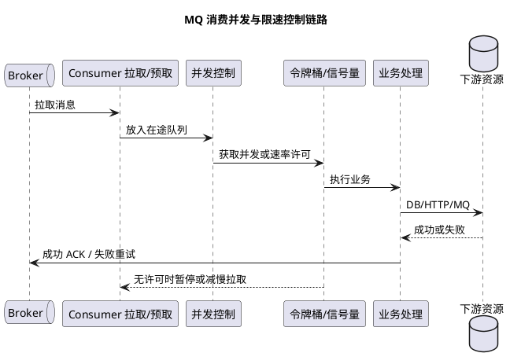
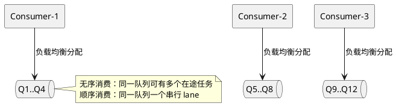

# MQ 并发数与限速机制对比

## 问题索引

- Q1：RocketMQ、RabbitMQ、Kafka、Pulsar 如何控制消费并发和处理速率？
- Q2：MQ 的 queue/partition 数量和消费者数量应该如何设计？
- Q3：RabbitMQ 轮询消费者如何设计，什么是能者多劳？
- Q4：MQ 的消费速度由 Broker 还是消费者决定？各 MQ 如何实现？

## Q1：RocketMQ、RabbitMQ、Kafka、Pulsar 如何控制消费并发和处理速率？

### 背景

面试中“把 MQ 消费并发调大”经常被当成吞吐优化，但并发、批量和限速解决的是三个不同问题：

| 概念 | 含义 | 主要风险 |
| --- | --- | --- |
| 并发数 | 同时处于处理中的消息数量 | 下游连接池、线程池、CPU 被打满 |
| 批量大小 | 一次拉取、回调或提交的消息数量 | 单批耗时变长，失败重试粒度变大 |
| 处理速率 | 单位时间允许处理的消息数 | 速率过高压垮下游，过低造成堆积 |
| 预取数量 | 客户端提前缓存但未完成处理的消息数 | 内存上涨、负载不均、消息延迟变长 |

粗略估算可以使用 Little's Law：

```text
在途消息数 C ≈ 目标处理速率 R × 平均处理耗时 W
```

这只是容量估算，不是无限扩容公式。最终并发还要受队列/分区数量、消费者实例数、线程池、数据库连接池、第三方接口配额和 Broker 调度能力约束。

### 核心原理

#### 1. 四种 MQ 的并发与限速对比

| MQ | 天然并行单元 | 消费并发控制 | 在途/预取控制 | 限速能力与常见做法 | 关键边界 |
| --- | --- | --- | --- | --- | --- |
| RocketMQ | MessageQueue | 无序消费由实例、消费线程和在途控制共同决定；顺序消费通常一队列一个串行处理 lane | 拉取批量、消费批量、客户端缓存阈值和拉取间隔 | 客户端线程池、拉取参数、信号量、令牌桶；Broker 侧主要做流控和堆积保护 | 队列数限制实例分配和顺序 lane，不应机械地当成无序消费的绝对线程上限 |
| RabbitMQ | Queue 上的 Consumer | 增加 Consumer、Channel 或实例；每个 Consumer 的处理线程由应用控制 | `basic.qos(prefetch_count)` 控制未确认消息数量 | Prefetch、消费者数量、发布确认和应用层令牌桶；没有统一的业务 QPS 限速开关 | Prefetch 太大占内存且分发不公平，太小会降低吞吐 |
| Kafka | Partition | 一个 Consumer Group 中，一个分区同一时刻只归一个消费者；并发上限受分区数约束 | `max.poll.records`、拉取字节数等限制批次和缓存 | `pause/resume`、业务信号量、处理线程池；Broker 可按客户端或用户配置字节/请求配额 | 消费者数超过分区数不会继续增加该组并发；阻塞处理要关注 poll 间隔 |
| Pulsar | Partition + Subscription | 多消费者共享订阅；并行度受分区和订阅类型影响 | `receiverQueueSize`、跨分区接收队列上限 | 客户端接收队列、消费者并发、Topic/Namespace/Broker 发布或分发速率限制 | 预取过大会放大内存和重平衡后的缓存；Shared 订阅不保证全局顺序 |

#### 2. RocketMQ

RocketMQ 要先区分“队列分配上限”和“业务处理并发上限”：

```text
活跃消费者实例数 <= min(消费者实例数 I, MessageQueue 数量 Q)
无序消费在途并发 <= min(I × 消费线程数 T, 客户端在途/缓存限制, 下游安全容量)
顺序消费串行 lane <= min(Q, I × T)
```

无序消费时，同一个 MessageQueue 拉取出的消息可以由多个消费任务并行处理，所以 `Q` 不是无序消费的绝对线程上限；它首先决定一个消费组能把多少队列分配给多少实例。顺序消费时，同一 MessageQueue 必须串行，队列数才会直接成为并行 lane 的重要上限。

主要调节方向：

- `consumeThreadMin`、`consumeThreadMax`：控制并发消费线程池范围。
- 拉取批量、消费批量和客户端缓存阈值：控制每次拉取及在途消息规模。
- `pullInterval` 等拉取节奏参数：降低拉取速度，但不是严格的每秒消息数限速器。
- 业务侧 `Semaphore` 或令牌桶：精确限制远程调用、数据库写入等真正的下游压力。
- Broker 流控：当客户端拉取过快、缓存过多或服务端资源紧张时触发保护，但不应替代业务层容量控制。

顺序消费的关键不是把线程数调到最大，而是让同一 MessageQueue 内的消息按顺序处理。需要提速时，应通过增加队列并保证业务键路由，而不是让同一队列被多个线程无序消费。增加线程数只能提高已有队列的处理能力，不能让一个热点业务键在同一队列内并行。

#### 3. RabbitMQ

RabbitMQ 最重要的消费侧并发参数是 prefetch：它限制消费者在未 ACK 前可以持有的消息数量。

```text
prefetch = 1       -> 更接近逐条处理，公平但吞吐可能较低
prefetch = 100      -> 减少网络往返，提高吞吐但占用更多内存
prefetch 过大      -> 消息集中在少数消费者，故障时重投成本也更高
```

实际有效并发还取决于应用有没有为一个 Consumer 建立多个工作线程。RabbitMQ 的 Broker 不知道业务方法内部到底启动了多少线程，因此建议把“预取数”和“应用工作线程数”一起设计，避免客户端缓存了大量消息而业务线程只能慢慢处理。

RabbitMQ 没有一个适用于所有业务的 Broker 级消息每秒限速器。常见做法是：

1. 用 prefetch 限制未确认消息，保护内存和下游。
2. 用 Consumer 数量控制最大并行度。
3. 用应用层令牌桶限制调用下游的 QPS。
4. 用 publisher confirm、连接/信道流控和监控处理生产端背压。

#### 4. Kafka

Kafka 的并发边界由分区决定：同一个 Consumer Group 内，一个 Partition 同时只会被一个 Consumer 处理。

```text
分区数 = 6，消费者数 = 3 -> 最多 3 个消费者各处理若干分区
分区数 = 6，消费者数 = 6 -> 最多 6 个消费者各处理一个分区
分区数 = 6，消费者数 = 10 -> 仍最多 6 个消费者有分区，其余空闲
```

`max.poll.records` 主要限制一次 `poll` 返回的记录数，不等于每秒限速。若单批处理过慢，可能触发 `max.poll.interval.ms` 相关的消费组重新均衡；因此不要只调大批量而忽略单批最大耗时。

Kafka 的常见限速方法：

- 消费者处理前使用 `pause(partitions)`，达到额度后按时间恢复。
- 使用业务线程池或信号量限制同时处理的记录数。
- 调整 `max.poll.records`、拉取字节数和批量提交大小。
- 在 Broker 侧按客户端、用户或 Listener 配置网络字节配额，控制集群资源消耗。

Kafka 的 Broker 配额更适合限制网络带宽、请求资源或客户端行为，不等价于“订单服务每秒最多处理 500 条”。业务 QPS 仍需要在消费者应用内控制。

#### 5. Pulsar

Pulsar 的消费者可以通过订阅类型和消费者数量实现并发：

- Exclusive：一个消费者独占订阅，适合顺序或单消费者场景。
- Failover：主消费者消费，故障后由其他消费者接管。
- Shared：多个消费者分摊消息，适合并发处理但不保证全局顺序。
- Key_Shared：按 key 分配，尽量保证同一 key 的顺序。

`receiverQueueSize` 决定客户端预取缓存规模。它越大，网络利用率和吞吐可能越好，但每个消费者占用的内存和故障时需要重新处理的在途消息也会增加。

Pulsar 还支持在 Topic、Namespace 或 Broker 维度配置发布/分发速率限制。使用时要区分：

- 发布限速：限制生产者写入速度。
- 分发限速：限制 Broker 向消费者发送速度。
- 应用处理限速：限制业务方法真正执行速度。

只有第三层最了解数据库、第三方接口和业务线程池的容量，不能只依赖 Broker 限速。

### 业务场景

订单消费服务同时写 MySQL、调用库存接口和发送下游事件。假设：

```text
数据库安全写入速率：300 次/秒
库存接口配额：200 次/秒
单条业务平均耗时：100 ms
```

即使 MQ 中有大量积压，也不能简单把消费者线程调到 100。以库存接口为瓶颈，目标处理速率应先控制在约 200 条/秒以内；按平均耗时估算，在途并发约为 `200 × 0.1 = 20`，再根据 P95/P99、重试流量和突发余量做压测校准。

### 解决方案

#### 1. 通用的并发与限速链路



#### 2. 应用层限速示例

```java
public void handle(Message message) {
    // 信号量限制同时访问下游的请求数，避免 MQ 堆积把数据库连接池打满。
    if (!downstreamSemaphore.tryAcquire(100, TimeUnit.MILLISECONDS)) {
        returnFailureForRetry(message); // 没拿到许可时不要假装成功 ACK
        return;
    }

    try {
        tokenBucket.acquire(); // 令牌桶限制单位时间内的处理速率，允许受控突发
        orderService.process(message);
        acknowledge(message); // 业务成功后再确认消息
    } finally {
        downstreamSemaphore.release(); // 无论成功失败都释放并发许可
    }
}
```

实际项目中要处理线程中断、超时、异常分类和重试回退；如果 `returnFailureForRetry` 会立即重投，还需要设置退避，不能让无许可消息高速循环。

#### 3. 参数调优顺序

1. 先测出 DB、HTTP、下游 MQ 等最小瓶颈容量。
2. 设定业务处理速率上限，并给重试流量预留预算。
3. 再设置应用线程池和信号量，控制真正的在途请求数。
4. 根据客户端类型调整队列/分区消费者数、prefetch、receiver queue 和批量大小。
5. 观察消息堆积量、最老消息年龄、消费 P99、下游连接池和错误率。
6. 用压测逐步增加并发，直到吞吐不再上升或下游指标达到安全阈值。

#### 4. 监控指标

- RocketMQ：消费 TPS、消费 RT、重试次数、队列堆积、最老消息年龄、消费线程池活跃数。
- RabbitMQ：Ready、Unacked、Consumer Capacity、prefetch、确认延迟、连接/信道流控。
- Kafka：Consumer Lag、每分区处理速率、poll 间隔、rebalance 次数、请求/字节配额命中情况。
- Pulsar：Backlog、消息发布/分发速率、receiver queue、redelivery、订阅消费者状态。
- 业务侧：数据库连接池等待、HTTP 连接池、下游 P99、限速拒绝数、DLQ 增长率。

### 踩坑点

- 把消费者线程数当成真实并发数，忽略队列/分区数量和下游信号量。
- 把 `max.poll.records`、prefetch 或 receiver queue 误认为严格 QPS 限速器。
- RabbitMQ prefetch 过大，导致消息都被一个慢消费者预取，其他消费者空闲。
- Kafka 消费者数量超过分区数后继续扩容，吞吐不升反而增加协调和连接成本。
- RocketMQ 顺序消费增加线程后破坏同一队列顺序预期。
- 重试消息与正常消息共用无限并发，故障恢复时重试洪峰再次击穿下游。
- 只看 MQ 堆积不看“最老消息年龄”。堆积量可能短时间下降，但老消息仍然长时间未处理。
- 限速后直接 ACK，导致消息逻辑上丢失；没有许可时应该暂停拉取、延迟重试或保留未确认状态。
- 用 Broker 的网络字节配额替代业务级 QPS 限制，无法准确保护数据库或第三方接口。

## 面试追问

- Q：消费者并发是不是越大越好？
  A：不是。并发上限由分区/队列、线程池和下游容量共同决定。并发超过下游安全容量后，只会增加排队、超时和重试，吞吐反而下降。

- Q：prefetch 和并发有什么区别？
  A：prefetch 是客户端提前持有的未确认消息数，并不代表这些消息都在业务线程中执行；并发是同时处理中的任务数。prefetch 过大可能造成内存上涨和分发不公平。

- Q：Kafka 为什么扩容消费者不一定提升吞吐？
  A：同一消费组中一个分区同一时刻只分配给一个消费者，消费者数超过分区数后会有空闲实例；还要检查单分区生产速率、磁盘、网络和下游处理能力。

- Q：怎么给 MQ 消费设置每秒 200 条的上限？
  A：先用消费者线程池或信号量限制在途并发，再用令牌桶限制每秒令牌数；无令牌时暂停拉取或延迟处理，成功完成业务后再 ACK，并监控重试和下游 P99。

## 复习清单

- [ ] 能区分并发数、批量大小、预取数量和处理速率。
- [ ] 能说清四种 MQ 的天然并行单元和主要客户端参数。
- [ ] 能解释 Kafka 分区数对消费并发上限的影响。
- [ ] 能解释 RabbitMQ prefetch 对吞吐、公平性和内存的影响。
- [ ] 能用 Little's Law 估算初始并发，并结合压测修正。
- [ ] 能设计“并发控制 + 令牌桶 + 下游保护 + 重试限速”的完整链路。

## Q2：MQ 的 queue/partition 数量和消费者数量应该如何设计？

### 背景

“队列越多、消费者越多，吞吐越高”是不完整的判断。队列或分区决定消息如何分片，消费者实例决定分片由谁处理，消费线程决定单个实例能同时处理多少任务；真正的吞吐还受数据库、线程池、网络和业务键分布约束。

设计时先定义符号：

| 符号 | 含义 |
| --- | --- |
| `Q` | Topic 的 queue 数量；Kafka/Pulsar 中通常对应 partition 数量 |
| `I` | 同一个消费组的消费者实例数量 |
| `T` | 每个实例的消费线程或业务处理 lane 数量 |
| `C` | 实际同时处于业务处理中的消息数量 |

### 核心原理

#### 1. 队列数首先决定“可分配的分片”，不是所有 MQ 的并发硬上限

| MQ | 队列/分区与消费者的关系 | 超过分片数继续加消费者 | 顺序设计边界 |
| --- | --- | --- | --- |
| RocketMQ | 集群消费时，一个 MessageQueue 在同一时刻分配给一个消费者实例；一个实例可以拥有多个队列 | 多出的实例没有分片可消费，处于空闲或待故障接管状态 | 同一队列串行；同一业务键必须稳定路由到同一队列 |
| Kafka | 一个 Consumer Group 中，一个 Partition 同时只分配给一个 Consumer | 多出的消费者空闲 | 一个分区内天然有序；异步并行处理必须自行维护分区内提交顺序 |
| RabbitMQ | 一个 Queue 可以同时绑定多个 Consumer，Broker 按消息分发 | 不存在“消费者数不能超过队列数”的固定边界 | 多 Consumer、prefetch 和并行处理会削弱队列级顺序 |
| Pulsar | 受 Partition 和订阅类型影响；Shared、Key_Shared 的并发语义不同 | 取决于订阅类型与分区数 | Key_Shared 适合按 Key 保序，Shared 不保证全局顺序 |

因此面试时不要直接回答“并发数一定小于队列数”。更准确的表达是：**分片数限制消费组的负载分配和有序处理 lane；无序业务并发还要看客户端是否允许同一分片有多个在途任务，以及下游容量。**

#### 2. RocketMQ 的数量关系

RocketMQ 集群消费可以按两类模式估算：

- 无序消费：`activeInstances <= min(I, Q)`；业务在途并发通常接近 `min(I × T, 客户端在途限制, 下游安全并发)`，同一队列可能同时有多个消费任务。
- 顺序消费：同一 MessageQueue 的处理必须串行，因此有序并行 lane 近似为 `min(Q, I × T)`；线程超过可分配队列后会闲置。

例如 `Q = 12、I = 3、T = 4`：

| 场景 | 能得到的结论 |
| --- | --- |
| 无序消费 | 3 个实例都能拿到队列；理论线程上限约 12，但仍需受拉取缓存、业务线程池和数据库连接池限制，同一队列不必只有一个在途任务 |
| 顺序消费 | 最多约 12 个串行 lane；每个实例大约承载 4 个队列时，12 个消费线程才有机会都工作 |
| `I = 20、Q = 12` | 至少有 8 个实例没有队列，吞吐通常不会因为继续加实例而提高，反而增加 rebalance、连接和监控成本 |
| `Q = 1` | 无论实例数是多少，都只能有一个分片；可以保证分片级顺序，但不能获得多队列并行吞吐 |

#### 3. 队列数怎么定

建议按以下顺序设计，而不是先拍一个很大的队列数：

1. 先用 Little's Law 估算目标在途并发：`C_target ≈ R_target × W_avg`，再用压测和 P99 耗时留出余量。
2. 如果需要按业务键保序，令 `Q >= 目标有序并行 lane`，并预留未来扩容空间；如果只是无序消费，`Q` 主要服务于实例均衡、热点分散和故障接管，不是简单的吞吐乘数。
3. 检查业务键分布。一个热点 Key 只能落到一个队列，增加其他队列不能解决这个 Key 的单键瓶颈；需要拆分业务键时，要先确认是否还满足顺序要求。
4. 检查 Broker 和客户端成本。队列过多会增加路由元数据、消费索引、拉取请求、rebalance 和监控维度，空队列也会带来管理成本。
5. 提前规划扩容。按 `hash(key) % Q` 路由时，直接改变 `Q` 会让同一 Key 可能从旧队列切到新队列，旧消息和新消息可能分散，破坏严格顺序。需要扩容时，应评估停写切换、固定桶映射、版本化路由或新 Topic 迁移。

#### 4. 消费者数量和线程数怎么定

消费者数量要同时满足吞吐和故障接管：

- RocketMQ/Kafka 这类分片型 MQ，正常活跃实例数通常不超过 `Q`/`P`，否则会出现空闲实例；需要故障接管时，可以让分片数大于正常实例数，保证少一个实例后仍能重新分配。
- `T` 不能只按 CPU 核数设置，要看单条消息是否阻塞在 DB、HTTP 或其他 IO。线程数超过下游连接池可用连接数，通常只会制造排队和超时。
- 同一消费组最好把“正常处理并发”和“重试/DLQ 重投并发”分开限速，避免故障恢复时重试洪峰挤占主链路。
- 顺序消费的 `T` 主要用于承载多个队列；对同一个队列加线程不能把串行处理变成安全并行。

可以用下面的容量边界表达设计结果：

```text
目标业务并发 C_target ≈ 目标速率 R × 平均处理耗时 W

无序消费：
  C_safe >= C_target
  min(I × T, 下游安全容量, 客户端在途限制) >= C_target

顺序消费：
  min(Q, I × T, 下游安全容量) >= 目标有序并行 lane
```

这只是初始容量模型，最终还要结合单队列堆积、热点 Key、消息大小、批量、预取、重试比例和最老消息年龄进行压测修正。



### 业务场景

假设订单事件目标处理速率为每秒 `800` 条，平均处理耗时 `20ms`，初始在途并发约为 `800 × 0.02 = 16`。如果数据库和第三方接口共同只允许安全并发 `24`，可以先把业务并发控制在 16 到 20，再通过压测决定 `I`、`T` 和 `Q`，而不是直接开 100 个消费者线程。

如果订单必须按 `orderId` 保序，可以选择至少 16 个可用有序 lane，并让同一个 `orderId` 稳定路由到同一个队列；如果只有 4 个队列，那么最多只有 4 个订单队列可以并行，线程数再大也无法把这 4 条顺序链拆开。

### 踩坑点

- 把一个队列只能对应一个消费者的 Kafka 规则套到 RabbitMQ；RabbitMQ 一个队列可以有多个 Consumer，但顺序和公平性会变化。
- 把 RocketMQ 的 `Q` 当成无序消费并发绝对上限；无序模式还要看消费任务、缓存和下游控制，顺序模式才有明显的队列级串行边界。
- 只按平均耗时算线程，不看 P99、重试流量和下游连接池，导致高峰时超时级联。
- 队列数过少导致热点队列和扩容无效，队列数过多又增加 rebalance、索引和运维成本。
- 扩容队列后仍沿用简单取模路由，导致同一业务键跨队列，顺序消息出现交叉。
- 消费者数量超过队列/分区数后继续扩容，却没有检查空闲实例和 rebalance 次数。

### 面试追问

- Q：RocketMQ 的消费者数量是不是必须等于队列数量？
  A：不是。一个实例可以消费多个队列，消费者数超过队列数会有空闲实例；通常让队列数覆盖正常实例和故障接管需求，再按业务并发设置线程数。

- Q：RocketMQ 队列数少于线程数时，线程一定会闲置吗？
  A：无序消费不一定，单个队列可以有多个在途消费任务；顺序消费中同一队列必须串行，多出的线程没有对应的有序 lane，才会闲置。

- Q：为什么增加队列数仍然有一个订单处理不快？
  A：队列扩容只能增加不同队列之间的并行度；同一个订单或业务键仍固定在一个队列，单键热点必须通过业务拆分、批量优化或降低单条处理耗时解决。

- Q：消费者实例多于分区/队列会怎样？
  A：分片型 MQ 中多出的实例没有分片可处理，吞吐通常不升，反而增加连接、协调和 rebalance 成本；RabbitMQ 要另外看多个 Consumer 共享一个 Queue 的 prefetch 和顺序影响。

### 复习清单

- [ ] 能区分 `Q`、消费者实例 `I`、消费线程 `T` 和实际在途并发 `C`。
- [ ] 能分别说清 RocketMQ 无序消费与顺序消费的并发边界。
- [ ] 能解释为什么 Kafka 消费者数超过分区数后会空闲。
- [ ] 能说明 RabbitMQ 一个队列多个消费者时的 prefetch 和顺序风险。
- [ ] 能用 `R × W` 估算初始并发，并结合下游安全容量修正。
- [ ] 能说明队列扩容为什么可能破坏按业务键的顺序。

## Q3：RabbitMQ 轮询消费者如何设计，什么是能者多劳？

### 背景

RabbitMQ 一个 Queue 可以挂载多个 Consumer。面试里常把“默认轮询”和“能者多劳”混在一起：默认调度通常是轮询选择消费者，但真正让快消费者多拿消息的关键是**未确认消息上限（prefetch）和 ACK 释放消费额度**。

### 核心原理

#### 1. 默认轮询与可消费额度

Broker 可以抽象成下面的流程：

```text
Queue 中有新消息
    -> 按轮询顺序选择下一个有消费额度的 Consumer
    -> 投递消息并增加该 Consumer 的 unacked 数量
    -> Consumer ACK 后释放一个额度
    -> 下一条消息继续选择可用 Consumer
```

当所有消费者都能立即接收消息时，分发看起来是：

```text
M1 -> Consumer A
M2 -> Consumer B
M3 -> Consumer C
M4 -> Consumer A
```

但如果设置 `prefetch=1`：

```text
Consumer A 处理 10ms，快速 ACK
Consumer B 处理 100ms，仍然有 1 条 unacked

A ACK -> A 重新获得额度 -> 下一条继续给 A
B 未 ACK -> B 暂时没有额度 -> Broker 跳过 B
```

这就是常说的“能者多劳”。它不是 Broker 额外启动了一个按耗时排序的智能调度器，而是**快消费者更快 ACK，因而更快重新进入可分发集合**。

#### 2. prefetch 如何影响公平和吞吐

| 配置 | 分发效果 | 适用场景 | 风险 |
| --- | --- | --- | --- |
| `prefetch=1` | 基本逐条投递，慢消费者只占一条未确认消息 | 消息耗时差异大、希望能者多劳或要求低缓存 | 网络往返多，吞吐可能下降 |
| `prefetch=N` | 每个消费者最多持有 N 条未确认消息 | 消费耗时相对稳定、需要提升吞吐 | 慢消费者可能预取较多消息，公平性变差 |
| `prefetch=0` 或未限制 | Broker 可以持续投递，直到客户端或内存成为瓶颈 | 极少数能够严格控制客户端缓存的场景 | 消息集中、内存上涨、故障重投量大 |

`prefetch` 控制的是未 ACK 的在途消息数，不等于业务线程数。一个 Consumer 如果内部又启动了工作线程池，应让 prefetch、工作线程数和单条消息确认时机一起设计：通常让 prefetch 略高于可并行处理数即可，不能无限预取。

RabbitMQ 的 `basic.qos` 在现代客户端中通常按 Consumer 生效；如果同时使用 `global=true`，还会叠加 Channel 级限制。具体语义要结合客户端版本确认，不能把 Channel 级和 Consumer 级 prefetch 混为一谈。

#### 3. 消费者设计方式

- **单 Queue 多 Consumer**：适合无序任务分发，消费者实例可以横向扩容。
- **每个 Consumer 内部线程池**：适合单个连接拉取后并行处理，但必须手动 ACK，且要限制工作队列长度。
- **单活跃消费者**：需要队列级顺序时使用；其他消费者作为故障接管，不能期待多个消费者同时提升顺序吞吐。
- **优先级消费者**：RabbitMQ 支持 Consumer Priority，高优先级消费者可优先获得消息，这会改变默认轮询，应单独评估公平性。

多个 Consumer 会削弱队列级顺序。即使 Broker 按轮询投递，前一条消息也可能被慢 Consumer 持有，后一条消息已经被另一个 Consumer 处理完成，因此需要顺序时应采用单 Consumer、Single Active Consumer 或按业务键拆分多个有序队列。

### 业务场景

假设一个 Queue 上有三个消费者：A 处理图片缩放 20ms，B 处理 200ms，C 处理 30ms。使用 `prefetch=1` 时，A 和 C 会因为频繁 ACK 持续获得更多消息，B 只会暂存一条未确认消息；使用 `prefetch=100` 时，B 可能一开始就拿走 100 条消息，后续即使 A、C 空闲，也无法立即接管这些已预取消息。

### 踩坑点

- 把“轮询”理解成严格的全局平均分配；真正可分发的消费者还受 prefetch、连接状态、Consumer Priority 和 ACK 影响。
- 只提高 Consumer 数量，不调小 prefetch，结果消息已经被慢消费者预取，快消费者仍然拿不到任务。
- 使用自动 ACK 后再观察业务处理结果；自动 ACK 只代表 Broker 已把消息交给客户端，不代表业务成功。
- Consumer 内部开线程池却在回调返回时就 ACK，造成工作线程尚未完成时消息已经从 Broker 删除。
- 用多个 Consumer 处理有序业务，误以为 RabbitMQ 的 Queue 顺序能够跨消费者自动保持。

### 面试追问

- Q：RabbitMQ 默认是轮询，为什么还会能者多劳？
  A：轮询只描述选择消费者的基础顺序；设置较小 prefetch 后，慢消费者因未 ACK 没有可用额度，快消费者 ACK 更快、重新进入可分发集合，所以自然拿到更多消息。

- Q：prefetch 越小越好吗？
  A：不是。越小越公平但网络往返和调度开销越高；应根据单条耗时差异、业务并发、消息大小和下游容量压测确定。

- Q：RabbitMQ 一个 Queue 可以有多个 Consumer 吗？
  A：可以。无序任务通常这样扩容；如果要求严格顺序，应使用单活跃消费者或按业务键拆分队列。

### 复习清单

- [ ] 能区分轮询、prefetch、unacked 和 ACK 的作用。
- [ ] 能解释 `prefetch=1` 为什么形成能者多劳。
- [ ] 能说明 Consumer 内部线程池为什么必须延迟 ACK。
- [ ] 能说明多个 Consumer 为什么破坏队列级顺序。
- [ ] 能根据处理耗时差异选择 prefetch 和消费者数量。

## Q4：MQ 的消费速度由 Broker 还是消费者决定？各 MQ 如何实现？

### 先给结论

MQ 消费速度不是单独由 Broker 或消费者决定，而是由整条链路的最小能力决定：

```text
有效消费速率
  <= min(Broker 可投递能力,
         Consumer 拉取/接收能力,
         Consumer 处理线程与批量能力,
         下游数据库/接口容量,
         Broker 与客户端配额)
```

但两种模式的主动权不同：

- **Pull 模式**：消费者主动调用 `poll/pull`，消费速度主要由消费者的拉取频率、批量、线程和 ACK/提交策略决定；Broker 只能限制上限或拒绝请求。
- **Push 模式**：Broker 或客户端库负责把消息推给回调，但消费者通过 prefetch、receiver queue、消费线程和 ACK 形成背压；Broker 负责存储和投递，不能替业务把数据库处理变快。

所以“每次只消费一个”不是 MQ 的统一规则。Broker 可能批量投递、客户端可能预取，消费者也可能单线程串行或线程池并行；最终是否一次处理一个，要看消费 API、订阅类型、批量参数和业务顺序要求。

### 各 MQ 的实现

| MQ | Broker 到消费者的主要模式 | 一次接收/处理形态 | 并发和限速控制 | 关键边界 |
| --- | --- | --- | --- | --- |
| RocketMQ | 经典 PushConsumer 本质是客户端长轮询 Pull；POP/Push 封装由客户端或服务端投递 | 可批量拉取、客户端缓存；并发监听器可提交多个消费任务，顺序监听器按 MessageQueue 串行 | `consumeThreadMin/Max`、拉取批量、消费批量、客户端缓存、业务信号量；Broker 做流控 | 无序消费可让同一队列存在多个在途任务；顺序消费同一队列必须串行 |
| RabbitMQ | Broker Push 到 Consumer | 受 prefetch 影响，一个 Consumer 可逐条回调，也可在客户端线程池并行处理 | `basic.qos(prefetch_count)`、Consumer 数量、手动 ACK、应用线程池 | 未 ACK 的消息会占用额度；自动 ACK 不能代表业务完成 |
| Kafka | Consumer 主动 `poll` | 一次 `poll` 可拿多条记录；同一分区通常由一个 Consumer 负责，应用可异步派发 | `max.poll.records`、fetch 参数、`pause/resume`、处理线程池、offset 提交 | 异步处理要保证分区内提交顺序；`max.poll.interval.ms` 防止处理太久被踢出组 |
| Pulsar | Broker Dispatcher 配合客户端接收队列 | `receiverQueueSize` 允许预取；Listener 或应用线程池并行处理 | 接收队列、Listener/Consumer 数量、订阅类型、ACK 和限速配置 | Shared 可并行但不保证全局顺序；Key_Shared 按 Key 分配以保序 |

### 消费者如何决定实际速度

#### RocketMQ

经典 PushConsumer 虽然名字叫 Push，但客户端内部会持续长轮询 Broker，把消息放入本地 `ProcessQueue`，再交给消费线程池。调大 `consumeThreadMax` 只是在客户端增加处理能力；如果队列数、下游连接池或 Broker 流控成为瓶颈，吞吐不会线性增长。

- 无序监听：可以并发提交多个 `ConsumeRequest`，处理成功后返回 `CONSUME_SUCCESS`。
- 顺序监听：同一 MessageQueue 的消费请求需要串行，失败通常返回 `RECONSUME_LATER` 并阻塞或延迟该队列。
- 批量拉取不等于批量业务提交；批量消息仍应按业务事务和幂等边界决定 ACK。

#### RabbitMQ

Broker 主动投递，但 `prefetch` 是消费者侧最重要的反压开关。未确认消息达到上限后，Broker 暂停向该 Consumer 投递；ACK 后恢复额度。应用如果要并行处理，应明确“工作线程完成 -> 手动 ACK”的顺序，并把工作队列长度纳入限流。

#### Kafka

Kafka 的主动权更偏向 Consumer：Consumer 调用 `poll` 拉取批量记录，处理完成后提交 offset。可以把记录交给线程池，但同一分区要按 offset 顺序提交，否则可能出现前一条失败、后一条先提交而导致跳过。生产上常用按分区串行或按分区内有序完成队列来实现异步处理。

#### Pulsar

Pulsar 客户端会维护接收队列，Broker Dispatcher 依据订阅类型把消息分配给消费者。`receiverQueueSize` 大时吞吐高但缓存和重投成本增加；Shared 订阅适合无序并行，Key_Shared 把相同 Key 固定给同一消费者以获得 Key 级顺序。

### 监控与调优顺序

1. 先测单条处理耗时、批量耗时和下游安全并发。
2. 再设置消费者线程、prefetch/receiver queue、poll 批量和业务信号量。
3. 观察 Broker 投递速率、客户端在途消息、消费 P99、ACK/offset 延迟和最老消息年龄。
4. 如果 Broker 速率高但消费速率低，优先查客户端线程、锁等待、下游连接池和批量处理；如果客户端不断拉取但 Broker 速率低，查 Broker 磁盘、复制、配额和队列热点。
5. 把重试消息和正常消息分开限速，避免下游恢复时重试洪峰再次击穿系统。

### 面试追问

- Q：Broker 能不能直接把消费速度调快？
  A：Broker 只能提高可投递上限或调整流控，实际速度还受消费者拉取/接收、线程池、ACK 和下游容量限制；Push 也不是绕过消费者处理能力。

- Q：每次消费是不是只能拿一条？
  A：不是。RabbitMQ 受 prefetch 影响，Kafka 的 `poll` 可批量返回，RocketMQ 可批量拉取和并发提交，Pulsar 可通过 receiver queue 预取；是否逐条处理由客户端和业务配置决定。

- Q：Kafka 能不能直接开线程池并行处理所有消息？
  A：可以异步派发，但 offset 提交必须保持分区内已完成的连续前缀；否则某条早期消息失败而后续 offset 已提交，会造成逻辑跳过。

### 复习清单

- [ ] 能用 `min(Broker、消费者、处理线程、下游容量)` 解释实际消费速率。
- [ ] 能区分 Push、Pull、长轮询和客户端预取。
- [ ] 能说清 RocketMQ、RabbitMQ、Kafka、Pulsar 的批量、并发和 ACK/offset 边界。
- [ ] 能解释 RabbitMQ prefetch、Kafka poll、Pulsar receiver queue 和 RocketMQ 消费线程的作用。
- [ ] 能说明异步消费为什么必须处理顺序提交和幂等问题。
