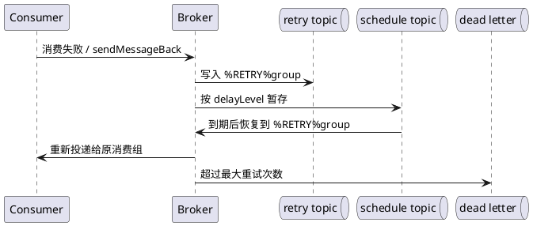

# 各种 MQ 重试机制对比

## 问题索引

- Q1：RocketMQ、RabbitMQ、Kafka、Pulsar 的重试机制有什么区别？
- Q2：RocketMQ 消费失败后的 retry topic、重试次数和延迟投递是怎么工作的？
- Q3：RocketMQ 生产者发送超时后如何判断是否写入，如何避免重复消息？

## Q1：RocketMQ、RabbitMQ、Kafka、Pulsar 的重试机制有什么区别？

### 背景

MQ 重试要先明确讨论的是哪一段链路：

```text
生产发送失败重试 -> Broker 接收确认
消费处理失败重试 -> 业务处理成功并 ACK
事务消息回查     -> 生产事务状态最终确定
死信治理         -> 超过重试预算后的人工或自动补偿
```

这几类重试的责任边界不同。生产者发送重试解决“消息是否成功交给 Broker”的不确定性，消费者重试解决“消息交给业务后是否处理成功”，而幂等、状态机和对账负责处理重复投递、超时但实际成功等边界情况。

### 核心原理

#### 1. 先比较重试模型

| MQ | 消费失败的主要动作 | 延迟重试 | 最大重试与死信 | 对顺序的影响 |
| --- | --- | --- | --- | --- |
| RocketMQ | 消费者返回失败或抛异常，Broker 按消费组维护重试消息 | Broker 按延迟级别再次投递 | 常规消费超过重试上限进入消费组对应 DLQ；可配置重试次数 | 并发消费通常只重试当前消息；顺序消费失败会暂挂该队列，避免越过失败消息 |
| RabbitMQ | `reject/nack` 选择 `requeue=true` 或进入死信交换机 | 常见做法是 TTL + DLX，或使用延迟消息插件 | DLX 由业务配置；Quorum Queue 可配置 poison message 的 delivery limit | 重新入队可能改变投递位置；重试队列设计不当会破坏顺序 |
| Kafka | 不提交 offset，或由消费者把消息转发到 retry topic | 原生没有按消息的延迟重试队列，通常使用 retry topic、暂停分区或外部调度 | 没有统一的 Broker DLQ 原语，由应用创建 DLQ topic 并维护次数 | 不提交 offset 会阻塞同一分区后续消息；retry topic 需要自行处理分区和顺序 |
| Pulsar | Negative ACK、ACK 超时或显式 `reconsumeLater` | 客户端支持延迟重新投递，常配合 retry letter topic | `DeadLetterPolicy` 可按最大 redelivery 次数转入 DLQ | 取决于订阅类型；共享订阅的并发重试通常不保证全局顺序 |

这里的“支持”指产品或客户端提供了对应机制，不代表业务可以省略幂等。所有 MQ 都可能出现“客户端超时但 Broker 已经成功处理”的情况，因此重试的最终落点必须是幂等消费。

#### 2. RocketMQ：Broker 管理重试队列

RocketMQ 的典型消费失败链路是：

```text
正常 Topic
    -> 消费者处理失败
    -> %RETRY%消费组名
    -> 按延迟级别再次投递
    -> 超过重试次数
    -> %DLQ%消费组名
```

并发消费时，监听器返回失败会触发 Broker 重新投递。重试次数和延迟级别由消费端配置及 Broker 策略共同决定，不能把某个版本的默认次数、默认延迟表当成所有部署的固定值。

顺序消费需要特别处理：如果一条消息失败后直接跳过，后续消息可能先改变业务状态，所以通常让当前 MessageQueue 暂停一段时间后重试。这会保护顺序，但也会让同一队列上的后续消息等待，故障消息不能无限重试。

生产发送重试与消费重试是两套配置：

- 同步发送失败时，客户端可以在限定次数内重试或切换 Broker。
- 异步发送要在回调中处理发送成功、失败和超时。
- 发送超时不等于 Broker 没有写入，重试后可能产生重复消息。
- 事务消息的回查是“状态不确定时向生产者确认”，不是普通消费失败重试。

#### 3. RabbitMQ：ACK/NACK 加死信拓扑

RabbitMQ 的基本选择是：

```text
basic.ack              -> 确认并从队列移除
basic.reject/nack(true)  -> 重新入队，可能快速重试
basic.reject/nack(false) -> 拒绝且不重新入队，通常路由到 DLX
```

直接 `requeue=true` 没有天然的退避时间，异常期间可能形成“取出 -> 失败 -> 立即入队”的热循环，持续占用 CPU、网络和消费者线程。生产上通常建立独立重试拓扑：

```text
业务队列 -> 消费失败 -> retry-5s(TTL) -> DLX 回原业务队列
                         -> retry-1m(TTL) -> DLX 回原业务队列
                         -> retry-10m(TTL) -> DLX 回原业务队列
                         -> 超过次数 -> dead-letter 队列
```

重试次数可以通过消息头、业务数据库或独立重试队列表达。`redelivered` 只能说明消息曾经重新投递，不能可靠地作为完整的重试次数账本。

RabbitMQ 的 TTL + DLX 方案要注意消息在队头等待造成的延迟偏差；不同延迟级别最好使用不同队列。Quorum Queue 还可以利用 delivery limit 处理 poison message，但仍需要根据版本和队列类型确认配置，不应与所有队列的通用能力混为一谈。

#### 4. Kafka：offset 重放或 retry topic

Kafka 的消费进度是 Consumer Group 的 offset，而不是每条消息独立的 ACK。

方案一是处理失败时不提交 offset：

```text
读取 partition offset=100
处理失败
不提交 offset
重新拉取 offset=100
```

优点是实现简单，缺点是会阻塞同一分区的后续消息；如果失败原因是永久业务错误，还会形成重试风暴。

方案二是应用管理 retry topic：

```text
order.v1 -> order.retry.1m -> order.retry.10m -> order.dlq
```

消费者将失败消息写入带有 `retryCount`、`nextRetryTime`、`originalTopic`、`originalPartition` 和 `originalOffset` 的重试消息，确认原消息 offset 后继续消费。这样可以避免主分区被单条坏消息卡住，但需要自行解决：

- 重试消息的分区键是否与原消息一致。
- 重试消息重新写回主 Topic 后是否允许乱序。
- retry topic 的保留时间和容量。
- 转发成功但提交原 offset 失败时的重复。
- DLQ 重投后的幂等和审计。

Kafka 的重试能力更偏向“日志重放 + 应用编排”，Broker 负责持久化和 offset，不替业务定义统一的重试次数、延迟级别和死信语义。

#### 5. Pulsar：Negative ACK 与 Retry/DLQ

Pulsar 可通过 Negative ACK 或 ACK 超时触发重新投递；需要明确延迟重试时，可以使用 `reconsumeLater` 和 retry letter topic。达到 `DeadLetterPolicy` 的最大 redelivery 次数后，消息进入 dead letter topic。

Pulsar 的重试消息通常需要携带原消息标识和重试次数。使用 Shared 订阅实现并发消费时，重试可能由其他消费者接管，因此业务侧仍需用业务唯一键做幂等，而不能依赖某个消费者实例内存中的次数。

### 业务场景

以订单创建事件为例，库存服务、积分服务和搜索同步服务都可能消费同一消息。重试策略应按异常分类：

| 异常类型 | 是否重试 | 推荐处理 |
| --- | --- | --- |
| 网络抖动、连接超时、下游临时不可用 | 是 | 延迟重试，限制次数，逐步扩大间隔 |
| 数据库锁等待、连接池暂时耗尽 | 是 | 短暂退避，同时降低消费并发 |
| 参数反序列化失败、字段缺失 | 通常否 | 进入 DLQ，修复兼容性或消息格式后重投 |
| 业务规则永久不满足 | 通常否 | 记录业务原因、告警，进入人工或补偿流程 |
| 下游已成功但响应超时 | 需要谨慎 | 依赖幂等键、查询接口或状态表确认后再决定 |

失败消息不应无限占用正常消费资源。重试队列、正常队列和 DLQ 最好能单独监控，必要时使用独立消费者或限速重投任务。

### 解决方案

#### 1. 通用的消费失败处理骨架

```java
public void consume(Message message) {
    String eventId = message.getBusinessKey(); // 稳定业务键，用于幂等和排查
    int retryCount = message.getRetryCount(); // 重试次数必须来自可持久化的消息属性或重试记录

    try {
        if (dedupRepository.alreadyProcessed(eventId)) {
            acknowledge(message); // 重复投递直接确认，避免无限重试
            return;
        }

        businessService.handle(message); // 先完成业务落库，再 ACK
        dedupRepository.markProcessed(eventId); // 生产上可用唯一索引或状态机保证原子性
        acknowledge(message);
    } catch (TemporaryException ex) {
        if (retryCount < retryPolicy.maxAttempts()) {
            publishToRetry(message, retryPolicy.nextDelay(retryCount));
            acknowledge(message); // 转发到重试通道成功后再确认原消息
        } else {
            publishToDeadLetter(message, ex); // 超过预算进入 DLQ，避免毒消息长期占用主链路
            acknowledge(message);
        }
    } catch (PermanentException ex) {
        publishToDeadLetter(message, ex); // 永久错误不做无意义重试
        acknowledge(message);
    }
}
```

这段代码表达的是通用流程，不应直接复制到某个 MQ 客户端。不同客户端的 ACK、转发和异常返回顺序不同；如果“转发成功”和“确认原消息”之间仍可能宕机，需要用事务性发送、Outbox 或可重复转发加消费幂等来兜底。

#### 2. 指数退避要设置上限和抖动

```text
delay = min(maxDelay, baseDelay * 2^retryCount) + random(0, jitter)
```

退避解决的是下游暂时不可用时的集中重试。必须同时设置：

- 最大重试次数。
- 最大延迟。
- 单条消息总重试时长。
- 重试消费者的并发上限。
- DLQ 告警和重投审批。

不能只设置“重试 16 次”而不看总耗时，也不能让所有消息在同一秒再次集中投递。

#### 3. 选择策略的判断顺序

1. 是否允许同一分区、队列或业务键后的消息越过当前失败消息。
2. 失败是暂时错误还是永久错误。
3. 是否需要秒级、分钟级还是人工介入级别的延迟。
4. 重试期间能否接受重复执行。
5. 失败转发和原消息确认之间如何保证不丢。
6. DLQ 是否有查询、告警、修复、重投和审计闭环。

### 踩坑点

- 把 RocketMQ 的默认重试次数、RabbitMQ 的 TTL 队列或某个 Spring 客户端配置说成 MQ 的统一标准。
- RabbitMQ 失败后一律 `requeue=true`，导致快速重试和 CPU 飙升。
- Kafka 不提交 offset 处理永久错误，导致整个分区长期停滞。
- 重试消息写入成功但原消息 ACK 失败，造成重复；这不是靠“只重试一次”解决的，而是靠幂等。
- 把 `redelivered`、重试 header 或内存计数当成跨重启、跨消费者实例的可靠账本。
- 顺序消息直接进入普通重试队列，可能让后续消息越过失败消息。
- 只统计 DLQ 数量，不记录原 Topic、业务键、异常类型、首次失败时间和最近重试时间，导致无法定位。
- DLQ 重投没有限速，修复一次故障后反而把下游再次打垮。

## 面试追问

- Q：为什么 Kafka 不提交 offset 会阻塞同一分区？
  A：Kafka 的消费进度按分区 offset 管理，当前 offset 没有提交或前移，消费者会反复读取同一条记录；同一分区后续记录不能跳过它形成业务顺序。

- Q：RabbitMQ 的 `requeue=true` 能不能作为延迟重试？
  A：不能把它当作可靠延迟重试。它主要是重新入队，可能立即再次投递；需要退避时应使用 TTL + DLX、延迟插件或应用调度。

- Q：重试和幂等是什么关系？
  A：重试提高消息最终处理成功的概率，幂等保证同一业务事件执行多次只产生一次有效结果。只做前者而没有后者，发送超时、ACK 丢失或人工重投都会造成重复业务。

- Q：什么时候应该直接进死信？
  A：参数格式错误、版本不兼容、永久业务规则不满足等错误通常不会因等待而恢复，应记录原因、告警并进入 DLQ，修复后再有控制地重投。

## 复习清单

- [ ] 能区分生产发送重试、消费失败重试、事务回查和死信治理。
- [ ] 能比较 RocketMQ、RabbitMQ、Kafka、Pulsar 的失败信号、延迟方式和 DLQ 责任边界。
- [ ] 能解释 Kafka 不提交 offset 与 retry topic 的取舍。
- [ ] 能说明 RabbitMQ 直接 requeue 为什么会形成重试风暴。
- [ ] 能说明顺序消息为什么不能无限重试。
- [ ] 能设计异常分类、指数退避、幂等、告警和 DLQ 重投闭环。

## Q2：RocketMQ 消费失败后的 retry topic、重试次数和延迟投递是怎么工作的？

### 先给结论

以下以经典 PushConsumer、集群消费为例：消费失败后，消费者不会简单地把消息重新写回业务 Topic，而是向 Broker 发送 `CONSUMER_SEND_MSG_BACK` 请求。Broker 按消费组把消息写入 `%RETRY%<consumerGroup>`，消息中保存原始 Topic；达到延迟时间后，再投递给这个消费组。超过最大重试次数后，消息进入 `%DLQ%<consumerGroup>`。

因此要区分三个 Topic：

| 名称 | 作用 |
| --- | --- |
| `order-topic` | 业务消息的原始 Topic，其他消费组正常订阅它 |
| `%RETRY%order-consumer` | 当前消费组独占的重试 Topic，避免一个消费组失败影响其他消费组 |
| `SCHEDULE_TOPIC_XXXX` | Broker 内部的延迟调度 Topic，消息处于等待时间时暂存于此，不是业务代码需要订阅的 Topic |

### 核心链路

```text
order-topic
    -> Consumer 返回 RECONSUME_LATER
    -> Broker 写入 %RETRY%order-consumer
       并记录 RETRY_TOPIC=order-topic、RECONSUME_TIME
    -> Broker 按 delayLevel 放入内部 SCHEDULE_TOPIC_XXXX
    -> 到期后恢复到 %RETRY%order-consumer
    -> 该消费组再次拉取并处理
    -> 超过上限后写入 %DLQ%order-consumer
```

经典客户端会自动为集群消费订阅当前消费组的 retry topic。收到重试消息后，客户端还可能根据 `RETRY_TOPIC` 属性把 `MessageExt.topic` 还原成原始业务 Topic，再交给监听器。因此业务日志里看到的 Topic 可能是 `order-topic`，但这不代表消息物理上重新广播给了原 Topic 的所有消费组。



### 重试次数如何记录

重试次数是消息元数据的一部分，不依赖某个消费者实例的内存计数：

- `MessageExt.reconsumeTimes`：客户端收到的重新消费次数。
- `RECONSUME_TIME`：消息属性中的重试次数，兼容某些发送回退路径。
- `MAX_RECONSUME_TIMES`：本次重试允许的最大次数，通常来自消费组配置或发送回执参数。
- `RETRY_TOPIC`：原始业务 Topic，重试消息据此知道将来交给哪个业务消息上下文。

初次投递一般是 `0`，第一次失败后的下一次投递一般是 `1`。同一条业务消息被不同消费组消费时，每个消费组都有自己的重试 Topic 和重试次数，不能把它理解成消息全局只计数一次。

经典 PushConsumer 客户端在未显式配置时常见最大重试次数是 `16`，但这不是所有 RocketMQ 版本、消费模式和框架封装的统一保证，面试和生产配置都应以实际客户端与 Broker 配置为准。超过上限进入消费组 DLQ 后，不能继续假设它会自动回到主链路。

### 延迟投递是不是定时遍历

可以理解为“Broker 内部定时任务按队列 Offset 扫描”，但不是业务应用定时把整个 retry topic 全表遍历一遍：

1. RocketMQ 用 `delayLevel` 表示延迟级别，Broker 通过 `messageDelayLevel` 把级别映射成具体毫秒数。常见部署会配置秒级到小时级的固定档位，普通消费重试使用的是级别，不是任意精确时间。
2. 消息带延迟级别写入时，Broker 会把它改写到内部 `SCHEDULE_TOPIC_XXXX`，并以“一个延迟级别对应一个逻辑队列”的方式管理 `offsetTable`。
3. `ScheduleMessageService` 的后台调度任务从各延迟队列的上次 Offset 继续处理，检查消息是否到期；到期后恢复目标 Topic/Queue 并重新写入，未到期则安排下一次检查。
4. 这更接近“每个延迟级别一个后台扫描器”，不是为每条消息创建一个操作系统定时器，也不是扫描整个 Topic 的所有历史消息。因此消息量大或 Broker 忙时，实际投递时间可能晚于理论延迟。

正常重试路径的延迟级别由消费结果和 Broker 策略共同决定；某些客户端发送回退路径会依据 `reconsumeTimes` 计算级别，例如源码中可见 `3 + reconsumeTimes` 的兜底逻辑。这个表达不能当作所有版本的固定重试时间表，最终要看 Broker 的延迟级别配置。

### 业务场景与设计建议

以订单状态变更为例：库存服务因数据库锁等待返回失败时，可以让消息进入消费组 retry topic 并逐步退避；如果是字段缺失这类永久错误，应直接记录原因并进入 DLQ。每次重试都要记录 `eventId`、原始 Topic、消费组、`reconsumeTimes`、异常类型、首次失败时间和最后重试时间，方便判断是暂时故障还是毒消息。

顺序消息还要额外关注：失败消息可能阻塞同一 MessageQueue，直到成功或进入 DLQ。进入 DLQ 或人工跳过会打破这条队列的业务连续性，所以重投前要确认前后消息的状态，不能只看重试次数。

### 参考源码

- [RocketMQ MessageConst.java](https://github.com/apache/rocketmq/blob/master/common/src/main/java/org/apache/rocketmq/common/message/MessageConst.java)：重试 Topic、原始 Topic、重试次数等属性名。
- [RocketMQ DefaultMQPushConsumerImpl.java](https://github.com/apache/rocketmq/blob/master/client/src/main/java/org/apache/rocketmq/client/impl/consumer/DefaultMQPushConsumerImpl.java)：消费组自动订阅 retry topic、发送失败回退和重试次数处理。
- [RocketMQ ScheduleMessageService.java](https://github.com/apache/rocketmq/blob/master/broker/src/main/java/org/apache/rocketmq/broker/schedule/ScheduleMessageService.java)：延迟级别、Offset 和到期投递调度。

## Q3：RocketMQ 生产者发送超时后如何判断是否写入，如何避免重复消息？

### 发送超时的本质

一次同步发送至少经过以下阶段：

```text
Producer 发请求
    -> Broker 接收并写入 CommitLog
    -> 刷盘 / 主从复制达到配置要求
    -> Broker 返回 SendResult
    -> Producer 收到响应
```

如果 Producer 在最后一步超时，可能是请求根本没到 Broker，也可能是 Broker 已经写入但响应在网络中丢失。因此：**发送超时是结果未知，不等于消息一定没有写入**。客户端只看到 `RemotingTimeoutException`、连接断开等异常时，无法凭本地异常准确判断 Broker 的最终状态。

如果收到 `SendResult`，`SEND_OK` 表示 Broker 按当前发送确认和存储配置返回成功；`FLUSH_DISK_TIMEOUT`、`FLUSH_SLAVE_TIMEOUT`、`SLAVE_NOT_AVAILABLE` 等非成功状态表示没有获得完整的成功确认，也不能简单断言消息一定不存在。刷盘和复制策略决定了“成功确认”的强度。

### 客户端发送重试为什么会产生重复

经典 Producer 有同步发送失败重试、异步发送失败重试以及必要时切换 Broker 等配置，例如 `retryTimesWhenSendFailed`、`retryTimesWhenSendAsyncFailed`、`retryAnotherBrokerWhenNotStoreOK`。它们解决的是可用性问题：在有限次数内提高最终送达概率。

但时序可能是：

```text
第一次请求 -> Broker 已写入 -> 响应返回前网络超时
Producer 认为未确认 -> 发起第二次请求
Broker 再写入一条
```

所以把发送重试次数设成 `0` 只能减少重复概率，同时也会增加消息未送达的概率，不能得到“既不重复又不丢失”的保证。查询 Broker 的消息 ID 或业务 Key 可以辅助排查，但查询存在索引延迟、同 Key 多消息和查询后再次发送的竞态，不能作为唯一去重方案。

### 推荐的去重与可靠投递方案

1. **为业务事件分配稳定的 `eventId`**。同一个业务动作的所有发送尝试都复用它，并把它放入消息体或业务属性；RocketMQ 的内部 `msgId`/`UNIQ_KEY` 可用于定位，但不要直接当业务幂等凭证。
2. **业务数据和 Outbox 同库事务写入**。订单创建成功时，在同一个本地事务中写订单和 `outbox(eventId, topic, body, status)`，通过唯一索引保证一个业务事件只产生一条发送任务。
3. **发送任务允许至少一次发送**。`SEND_OK` 后标记 Outbox 已发送；超时则保留 `PENDING/UNKNOWN`，由重试或对账任务继续投递。即使 Broker 已写入又被再次发送，消息仍带同一个 `eventId`。
4. **消费者用唯一约束或状态机幂等**。例如 `consume_log(event_id)` 唯一键加业务状态条件更新，把重复消息变成成功的空操作；这才是处理“超时已写入 + 发送重试”重复的最终防线。
5. **需要业务库和 MQ 的提交边界时使用事务消息或本地消息表**。它们能减少“业务成功但消息没发出”的窗口，但不能把普通 MQ 消费变成绝对 exactly-once，消费端仍要幂等。

### 面试追问

- Q：发送超时后能不能先按消息 ID 查询，查不到再重发？
  A：可以作为降低重复的辅助动作，但不能作为唯一保证。查询可能有索引延迟，按业务 Key 也可能命中多条消息，且“查询成功”和“重新发送”之间仍有竞态，最终还要依赖稳定业务 ID 和消费端幂等。

- Q：为什么不用 RocketMQ 内置的 `UNIQ_KEY` 做业务去重？
  A：它是客户端或协议层的消息定位属性，适合排查和链路追踪，不等同于业务事件唯一键，也不能替代数据库唯一索引和状态机。业务必须自己定义可重放、可审计的 `eventId`。

- Q：Producer 重试和 Consumer 重试是否能一起保证 exactly-once？
  A：不能。Producer 重试可能重复写入，Consumer ACK 丢失可能重复消费，Broker 故障和人工重投也会重复。工程上通常选择至少一次投递，再用幂等、状态机、对账实现业务上的一次有效变更。

### 复习清单

- [ ] 能解释发送超时为什么只能得到“结果未知”。
- [ ] 能区分 `SEND_OK`、非成功 `SendResult` 和网络异常的处理语义。
- [ ] 能说明 Producer 自动重试为什么可能制造重复消息。
- [ ] 能画出业务库、Outbox、MQ、消费幂等之间的可靠投递链路。
- [ ] 能说明为什么查询消息 ID 只能辅助排查，不能替代消费端幂等。
