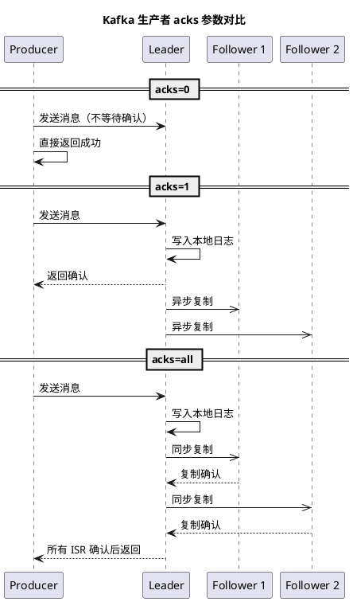
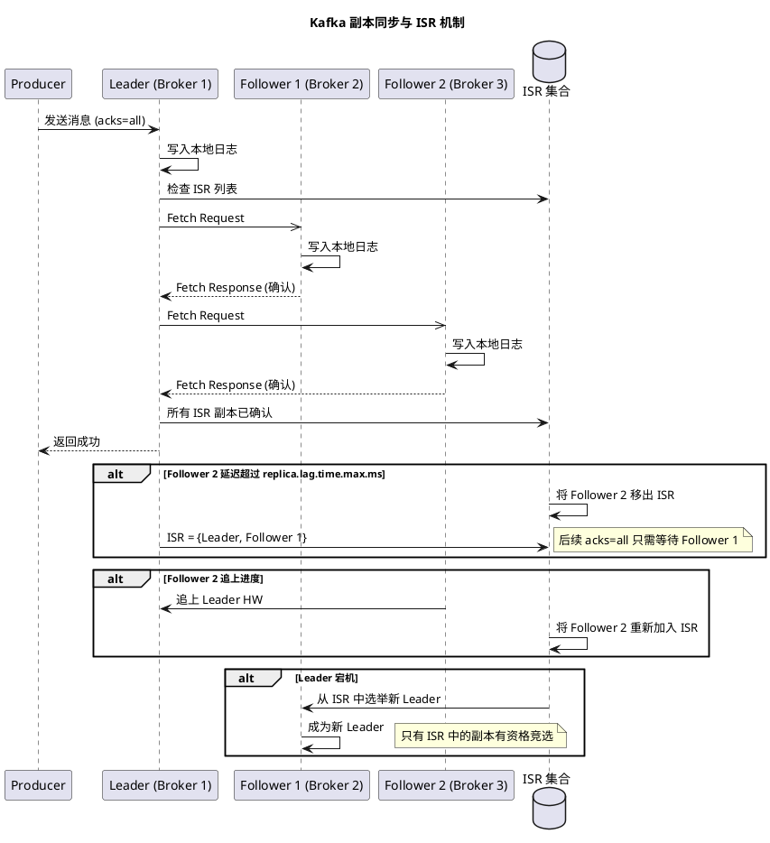
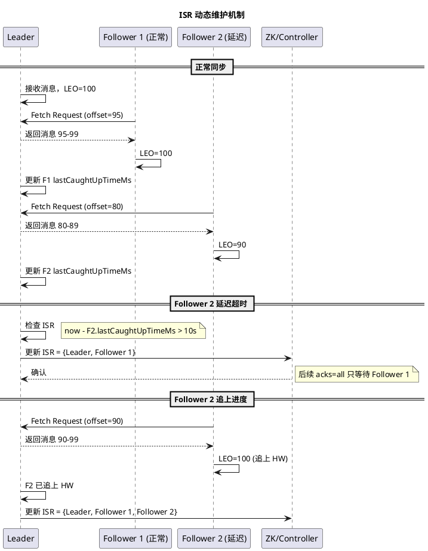
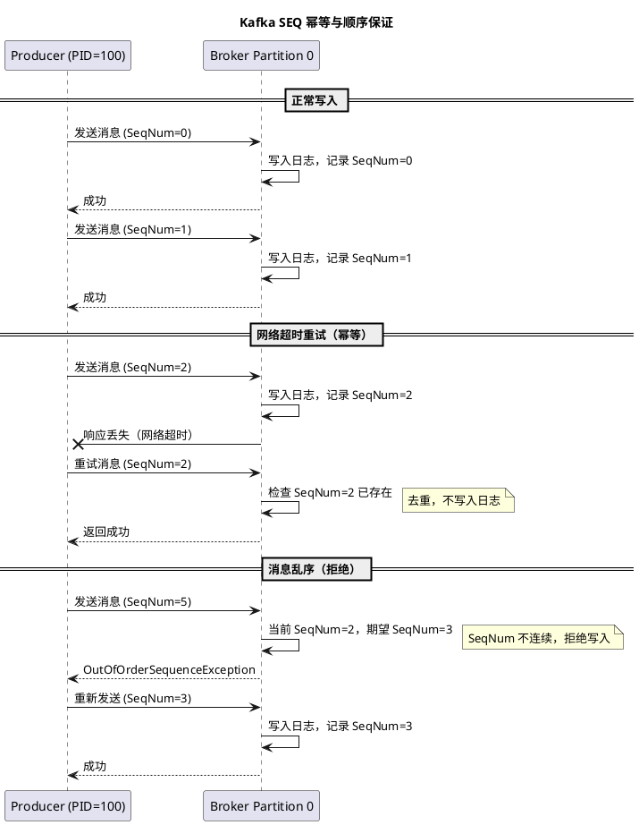

# Kafka 可靠性与消息队列对比

## 问题索引

- Q1：Kafka 如何保证消息可靠性？
- Q2：Kafka ISR（In-Sync Replicas）和 SEQ 机制是什么？
- Q3：Kafka、RocketMQ、RabbitMQ 三者对比，实际项目中如何选择？

## Q1：Kafka 如何保证消息可靠性？

### 背景

Kafka 的消息可靠性不是单一配置决定的，而是生产者、Broker 集群、消费者三个层面共同保障的结果。一条消息从发送到最终被消费，至少要经过以下链路：

1. 生产者发送消息到 Leader 分区。
2. Leader 将消息写入本地日志，并同步到 ISR 副本。
3. 根据 acks 参数决定何时返回确认。
4. 消费者拉取消息并处理。
5. 消费者提交 offset 标记消费进度。

任何一个环节配置不当，都可能导致消息丢失或重复消费。面试中回答 Kafka 可靠性问题，必须按**生产者可靠性、Broker 可靠性、消费者可靠性**三层展开。

### 核心原理

Kafka 的可靠性设计基于以下几个核心机制：

| 层级 | 可靠性机制 | 关键配置 |
| --- | --- | --- |
| 生产者 | 发送确认、重试、幂等、事务 | `acks`、`retries`、`enable.idempotence`、事务 API |
| Broker | 分区副本、ISR、Leader 选举 | `min.insync.replicas`、`unclean.leader.election.enable` |
| 消费者 | 手动提交 offset、幂等消费 | `enable.auto.commit=false`、业务唯一键 |

Kafka 的可靠性目标不是"绝对不丢"，而是通过副本复制、确认机制、重试和幂等，把丢失风险降到可接受水平，并且让异常可恢复。

### 生产者可靠性

#### acks 参数详解

`acks` 控制生产者认为消息"发送成功"的条件，是生产者可靠性的核心参数。

**acks=0**

生产者发送消息后不等待任何 Broker 确认，直接认为发送成功。

- 优点：吞吐量最高，延迟最低。
- 缺点：网络抖动、Broker 宕机、消息序列化失败都可能导致消息丢失，且生产者无法感知。
- 适用场景：日志采集、用户行为埋点等允许少量丢失的场景。

**acks=1**

Leader 副本收到消息并写入本地日志后返回确认，不等待 ISR 副本同步。

- 优点：性能和可靠性折中，延迟较低。
- 缺点：Leader 确认后、ISR 同步前宕机，且新 Leader 没有该消息，会导致消息丢失。
- 适用场景：一般业务消息，可接受极端情况下少量丢失。

**acks=all（或 acks=-1）**

Leader 和所有 ISR 副本都确认写入成功后，才返回确认。

- 优点：可靠性最高，只要 ISR 中有一个副本存活，消息就不会丢失。
- 缺点：延迟最高，吞吐量受 ISR 同步速度影响。
- 配合 `min.insync.replicas`：如果 ISR 副本数少于该值，生产者会收到 `NotEnoughReplicasException`，拒绝写入。
- 适用场景：订单、支付、库存等核心业务。



#### 生产者重试与幂等

生产者发送可能因为网络抖动、Leader 切换、Broker 繁忙等原因失败或超时。Kafka 提供重试机制：

- `retries`：最大重试次数，建议设置为较大值（如 `Integer.MAX_VALUE`）。
- `retry.backoff.ms`：重试间隔，避免立即重试加剧 Broker 压力。
- `delivery.timeout.ms`：从发送到确认的总超时时间，包含重试时间。

重试会带来消息重复和乱序问题：

**幂等生产者**

```java
props.put("enable.idempotence", true); // 开启幂等
```

开启幂等后，Kafka 会为每个生产者分配唯一的 PID（Producer ID），并为每条消息分配递增的 Sequence Number。Broker 根据 `<PID, Partition, SeqNum>` 去重，保证单分区单会话的 Exactly Once 语义。

注意：
- 幂等只在单个生产者会话、单分区内有效。
- 生产者重启后 PID 会变化，无法跨会话去重。
- 跨分区消息仍可能重复，需要业务侧幂等。

**事务消息**

对于需要原子性写入多个分区或 Topic 的场景，可以使用 Kafka 事务：

```java
props.put("transactional.id", "order-tx-001"); // 事务 ID
producer.initTransactions();

try {
    producer.beginTransaction();
    producer.send(new ProducerRecord<>("order-topic", order));
    producer.send(new ProducerRecord<>("inventory-topic", inventory));
    producer.commitTransaction();
} catch (Exception e) {
    producer.abortTransaction();
}
```

事务消息保证多条消息要么全部可见，要么全部不可见，适合订单-库存联动、数据库+Kafka 联动等场景。

### Broker 可靠性

#### 副本机制

Kafka 通过分区副本（Replica）提高可靠性。每个分区有一个 Leader 和多个 Follower：

- Leader 负责读写请求。
- Follower 从 Leader 同步数据，不对外提供读写服务（除非配置了 Follower Fetching）。
- 副本数通过 `replication.factor` 配置，建议设置为 3。

#### ISR（In-Sync Replicas）

ISR 是与 Leader 保持同步的副本集合。只有 ISR 中的副本才有资格参与 Leader 选举。

判断副本是否在 ISR 中的依据：

- `replica.lag.time.max.ms`（默认 10 秒）：Follower 落后 Leader 的最大时间。
- Follower 超过该时间未同步，会被踢出 ISR。
- Follower 追上进度后，会重新加入 ISR。

ISR 的意义：

- 保证 `acks=all` 时只等待健康副本，而不是所有副本。
- 防止慢副本拖累整体写入性能。
- 提供可靠的 Leader 选举候选者。

#### min.insync.replicas

`min.insync.replicas` 定义最少同步副本数。当 ISR 副本数低于该值时，生产者会收到异常，拒绝写入。

推荐配置：
- `replication.factor=3`
- `min.insync.replicas=2`
- `acks=all`

这样保证至少有 2 个副本（Leader + 1 个 Follower）写入成功，即使 1 个副本宕机，消息仍然可靠。

#### 不安全的 Leader 选举

`unclean.leader.election.enable` 控制是否允许不在 ISR 中的副本参与 Leader 选举。

- `true`：允许，优先保证可用性，但可能丢失未同步的消息。
- `false`（推荐）：不允许，优先保证可靠性，但 ISR 全部宕机时分区不可用。

核心业务必须设置为 `false`，避免数据回退。



### 消费者可靠性

#### offset 提交机制

Kafka 消费者通过提交 offset 标记消费进度。offset 提交方式直接影响消息是否会丢失或重复。

**自动提交（不推荐）**

```java
props.put("enable.auto.commit", true);
props.put("auto.commit.interval.ms", 5000);
```

问题：
- 消费者拉取消息后，自动提交 offset，但业务还没处理完就宕机，消息丢失。
- 业务处理失败，但 offset 已提交，消息无法重试。

**手动提交（推荐）**

```java
props.put("enable.auto.commit", false);

while (true) {
    ConsumerRecords<String, String> records = consumer.poll(Duration.ofMillis(100));
    for (ConsumerRecord<String, String> record : records) {
        try {
            // 1. 幂等校验，根据业务唯一键判断是否已处理
            if (consumeLogService.exists(record.key())) {
                continue;
            }
            
            // 2. 业务处理和消费日志必须在同一事务中提交
            orderService.processInTransaction(record.value(), record.key());
            
            // 3. 业务处理成功后再提交 offset
            consumer.commitSync();
        } catch (Exception e) {
            // 4. 业务失败不提交 offset，下次重新拉取该消息
            log.error("consume failed, will retry", e);
            break; // 停止当前批次，避免跳过失败消息
        }
    }
}
```

注意：
- 先处理业务，再提交 offset。
- 业务失败不提交，让 Kafka 重新投递。
- 重新消费时，消费者必须幂等。

#### 幂等消费

Kafka 至少一次投递（At Least Once）是常态，消费者必须做好幂等：

**唯一键防重**

```java
@Transactional
public void processOrder(OrderEvent event) {
    // 1. eventId 是业务事件的唯一标识，重复消费必须保持不变
    if (consumeLogMapper.exists(event.getEventId())) {
        return; // 已处理过，直接返回
    }
    
    // 2. 业务处理要带状态条件，防止乱序或重复消息覆盖正确状态
    int updated = orderMapper.updateStatus(
        event.getOrderNo(),
        OrderStatus.PENDING,
        OrderStatus.PAID
    );
    
    if (updated == 1) {
        // 3. 消费日志和业务状态在同一事务中提交，保证一致性
        consumeLogMapper.insert(event.getEventId(), event.getOrderNo());
    }
}
```

**数据库唯一索引兜底**

```sql
CREATE TABLE consume_log (
    event_id VARCHAR(128) PRIMARY KEY,
    topic VARCHAR(128) NOT NULL,
    partition_id INT NOT NULL,
    offset_value BIGINT NOT NULL,
    biz_key VARCHAR(128) NOT NULL,
    create_time DATETIME NOT NULL,
    INDEX idx_topic_partition_offset(topic, partition_id, offset_value)
);
```

即使代码逻辑有问题，数据库唯一索引也能拦住重复消费。

### 踩坑点

#### 1. acks=all 但 min.insync.replicas=1

`min.insync.replicas=1` 表示只要 Leader 写入成功就返回确认，等同于 `acks=1`，失去了 `acks=all` 的意义。

推荐：`replication.factor=3`、`min.insync.replicas=2`、`acks=all`。

#### 2. 开启幂等但未配置事务

幂等只保证单分区单会话不重复，跨分区、跨会话仍可能重复。如果需要多分区原子性，必须使用事务。

#### 3. 消费者先提交 offset 再处理业务

这是最典型的消息丢失场景。正确顺序必须是：业务成功 -> 提交 offset。

#### 4. 消费失败后继续提交 offset

有些开发者认为"提交 offset 就是告诉 Kafka 我拉取了消息"，实际上提交 offset 意味着"我已经处理成功"。失败消息必须不提交，让 Kafka 重新投递。

#### 5. 依赖自动提交 + 异步处理

自动提交 + 异步线程池处理，业务线程池满或宕机时，消息已经被标记为消费成功，无法重试。

### 面试追问

- Q：acks=all 是否绝对不丢消息?
  A：不是。acks=all 只保证 ISR 副本都写入成功，但如果 `min.insync.replicas=1` 或 `unclean.leader.election.enable=true`，仍可能丢失。还要配合副本数、ISR、Leader 选举策略和消费端幂等。

- Q：生产者重试会不会导致消息重复?
  A：会。网络超时时，Broker 可能已经写入成功，但响应丢失，生产者重试会导致重复。开启幂等可以在单分区单会话内去重，跨分区需要事务或消费端幂等。

- Q：Kafka 如何保证消息顺序?
  A：Kafka 只保证单分区内有序。生产者发送到同一分区，消费者单线程消费同一分区，就能保证顺序。跨分区无序，需要业务侧按 key 分区或全局排序。

- Q：消费者提交 offset 后业务事务回滚怎么办?
  A：这是设计错误。正确做法是业务事务提交成功后再提交 offset。如果已经提交 offset，无法自动撤销，只能通过业务对账、补偿或重置 offset 修复。

- Q：为什么 Kafka 不像 RocketMQ 那样提供事务消息?
  A：Kafka 的事务是生产者侧事务，保证多条消息原子性写入。RocketMQ 的事务消息是解决"本地事务+发消息"的一致性。Kafka 通常通过 Outbox 模式或 CDC（如 Debezium）解决这个问题。

### 复习清单

- [ ] 能讲清 acks=0/1/all 的区别和适用场景。
- [ ] 能说明 ISR 的作用和 `replica.lag.time.max.ms` 的意义。
- [ ] 能解释 `min.insync.replicas` 和 `unclean.leader.election.enable` 的配合。
- [ ] 能说明生产者幂等和事务的区别。
- [ ] 能画出"业务处理成功 -> 提交 offset"的正确时序。
- [ ] 能设计消费日志表和业务唯一键保证幂等。

## Q2：Kafka ISR（In-Sync Replicas）和 SEQ 机制是什么？

### 背景

ISR 和 SEQ 是 Kafka 保证消息可靠性和顺序性的两个核心机制。很多面试官会深入追问：

- ISR 如何判断副本是否同步?
- 副本被踢出 ISR 后如何重新加入?
- Leader 选举为什么只能从 ISR 中选?
- SEQ（Sequence Number）如何保证幂等和顺序?

理解 ISR 和 SEQ，才能真正掌握 Kafka 的可靠性设计。

### ISR（In-Sync Replicas）详解

#### ISR 的作用

ISR 是与 Leader 保持同步的副本集合，包括 Leader 自己。

ISR 解决的核心问题：

1. **性能与可靠性平衡**：`acks=all` 不需要等待所有副本，只需等待 ISR 中的副本，避免慢副本拖累写入性能。
2. **可靠的 Leader 选举**：只有 ISR 中的副本才有资格竞选 Leader，保证新 Leader 拥有最新数据。
3. **动态调整**：副本落后时踢出 ISR，追上后重新加入，保证 ISR 始终是健康副本集合。

#### ISR 的维护机制

Kafka 通过以下参数判断副本是否在 ISR 中：

**replica.lag.time.max.ms**

Follower 落后 Leader 的最大时间，默认 10 秒。

判断逻辑：
- Follower 定期向 Leader 发送 Fetch 请求同步数据。
- Leader 记录每个 Follower 的最后同步时间（`lastCaughtUpTimeMs`）。
- 如果 `now - lastCaughtUpTimeMs > replica.lag.time.max.ms`，Leader 将该 Follower 从 ISR 中移除。

注意：
- Kafka 早期版本还有 `replica.lag.max.messages` 参数，根据消息条数判断是否落后，但已废弃。
- 现在只根据时间判断，因为消息条数不适合突发流量场景。

**副本重新加入 ISR**

Follower 追上 Leader 的 HW（High Watermark）后，会重新加入 ISR。

HW 是所有 ISR 副本都已同步的最大 offset，消费者只能消费到 HW 位置的消息。



#### ISR 与 Leader 选举

当 Leader 宕机时，Kafka 通过 Controller 从 ISR 中选举新 Leader。

选举规则：
- 优先选择 ISR 中的第一个存活副本（按 Replica ID 排序）。
- 如果 ISR 为空且 `unclean.leader.election.enable=true`，允许非 ISR 副本竞选（不推荐）。
- 如果 ISR 为空且不允许 unclean 选举，分区不可用，等待 ISR 副本恢复。

为什么只能从 ISR 选举？

- 非 ISR 副本可能落后很多消息，选举它会导致已确认的消息丢失（日志回退）。
- ISR 副本保证拥有所有已提交的消息（HW 之前的消息）。

#### HW 和 LEO

理解 ISR 还需要理解 HW 和 LEO：

- **LEO（Log End Offset）**：每个副本的最新消息 offset，即日志末尾位置。
- **HW（High Watermark）**：所有 ISR 副本都已同步的最大 offset，消费者只能消费到 HW 之前的消息。

例如：
- Leader LEO = 100
- Follower 1 LEO = 100
- Follower 2 LEO = 90
- HW = 90（取所有 ISR 副本的最小 LEO）

消费者只能消费到 offset 90，保证消费的消息不会因为 Leader 切换而丢失。

### SEQ（Sequence Number）机制

#### SEQ 的作用

SEQ 是 Kafka 幂等生产者的核心机制，用于去重和保证顺序。

开启幂等后，Kafka 为每条消息分配：
- **PID（Producer ID）**：生产者会话的唯一标识，由 Broker 分配。
- **Sequence Number**：单分区内递增的消息序列号，从 0 开始。

Broker 根据 `<PID, Partition, SeqNum>` 判断消息是否重复：
- 如果 SeqNum 已存在，直接返回成功，不写入日志（去重）。
- 如果 SeqNum 不连续，返回 `OutOfOrderSequenceException`（保证顺序）。

#### SEQ 如何保证幂等

生产者重试时，消息的 `<PID, Partition, SeqNum>` 保持不变。

正常流程：
```text
Producer PID=100 发送消息到 Partition 0
    SeqNum=0 -> 写入成功
    SeqNum=1 -> 写入成功
    SeqNum=2 -> 网络超时，Broker 已写入但响应丢失
    SeqNum=2 -> 重试，Broker 发现 SeqNum=2 已存在，返回成功（去重）
```

Broker 为每个 `<PID, Partition>` 维护最后的 SeqNum，重复消息直接返回成功，不会写入两次。

#### SEQ 如何保证顺序

如果消息乱序到达，Broker 会拒绝写入。

异常流程：
```text
Producer 发送 SeqNum=5
Broker 当前 SeqNum=3
    期望下一条消息 SeqNum=4，但收到 SeqNum=5
    返回 OutOfOrderSequenceException
```

生产者收到异常后会重新发送，保证消息按顺序写入。

注意：
- SeqNum 只在单分区内有效，跨分区无序。
- SeqNum 只在单个生产者会话内有效，生产者重启后 PID 变化，SeqNum 重新从 0 开始。

#### PID 的生命周期

PID 在以下情况下会变化：
- 生产者重启。
- 生产者崩溃后重新初始化。
- 生产者 idle 超时（默认 1 天），Broker 回收 PID。

PID 变化后，原有的 SeqNum 失效，无法跨会话去重。如果需要跨会话幂等，必须使用事务消息（`transactional.id`）。



### 事务消息与跨会话幂等

如果需要跨会话幂等，或者多分区原子性，可以使用事务消息。

事务消息核心配置：

```java
props.put("transactional.id", "order-producer-001"); // 事务 ID，必须唯一
props.put("enable.idempotence", true); // 事务自动开启幂等
```

`transactional.id` 的作用：
- Broker 会为同一个 `transactional.id` 分配固定的 PID。
- 生产者重启后，使用相同的 `transactional.id`，可以恢复之前的 PID 和 SeqNum。
- 实现跨会话幂等。

事务消息适合：
- 多分区原子性写入（如订单+库存）。
- 数据库操作+Kafka 消息联动（配合 Flink 等流处理引擎）。
- 需要跨会话幂等的场景。

### 踩坑点

#### 1. 以为幂等能跨分区去重

幂等只在单分区内有效。如果同一个 key 的消息被发送到不同分区（如修改了分区策略），仍可能重复。

#### 2. 生产者重启后以为幂等仍然生效

普通幂等（未配置 `transactional.id`）在生产者重启后 PID 变化，SeqNum 重置，无法去重。

#### 3. ISR 只有 Leader 但 min.insync.replicas=1

此时等同于无副本保护，Leader 宕机后数据全部丢失。必须监控 ISR 数量，及时告警。

#### 4. 误以为 HW 是 Leader 的 LEO

HW 是所有 ISR 副本的最小 LEO，Leader 的 LEO 通常大于 HW。消费者只能消费到 HW，保证消费的消息不会因切换而丢失。

### 面试追问

- Q：ISR 如何判断副本是否同步?
  A：通过 `replica.lag.time.max.ms` 参数，默认 10 秒。Leader 记录每个 Follower 的最后同步时间，超过阈值踢出 ISR，追上 HW 后重新加入。

- Q：为什么 Leader 选举只能从 ISR 中选?
  A：ISR 副本保证拥有所有已提交的消息（HW 之前）。非 ISR 副本可能落后很多，选举它会导致已确认消息丢失（日志回退）。

- Q：HW 和 LEO 的区别?
  A：LEO 是每个副本的日志末尾位置，HW 是所有 ISR 副本的最小 LEO。消费者只能消费到 HW，保证消费的消息在 Leader 切换后不会丢失。

- Q：幂等生产者如何保证不重复?
  A：Broker 为每个生产者分配 PID，为每条消息分配递增的 SeqNum。Broker 根据 `<PID, Partition, SeqNum>` 去重，重复消息直接返回成功。

- Q：幂等和事务的区别?
  A：幂等只保证单分区单会话不重复；事务通过 `transactional.id` 保证跨会话幂等和多分区原子性。

- Q：ISR 为空时分区还能写入吗?
  A：取决于 `unclean.leader.election.enable`。如果为 false（推荐），分区不可用，等待 ISR 副本恢复；如果为 true，允许非 ISR 副本竞选，可能丢失消息。

### 复习清单

- [ ] 能说明 ISR 的作用和维护机制。
- [ ] 能解释 `replica.lag.time.max.ms` 的判断逻辑。
- [ ] 能区分 HW 和 LEO，并说明消费者为什么只能消费到 HW。
- [ ] 能讲清 Leader 选举为什么只能从 ISR 中选。
- [ ] 能说明 SEQ 如何保证幂等和顺序。
- [ ] 能区分普通幂等和事务消息的 PID 生命周期。

## Q3：Kafka、RocketMQ、RabbitMQ 三者对比，实际项目中如何选择？

### 背景

Kafka、RocketMQ、RabbitMQ 是目前最主流的三种消息队列，各有特点和适用场景。面试中经常被问：

- 三者的核心区别是什么?
- 为什么你的项目选择了其中一种?
- 什么场景下应该换另一种?

回答这类问题不能只说"Kafka 性能好"或"RocketMQ 功能全"，要从架构设计、可靠性、性能、运维成本等多个维度对比。

### 三者核心对比

| 维度 | Kafka | RocketMQ | RabbitMQ |
| --- | --- | --- | --- |
| **定位** | 分布式流平台，日志、事件流 | 业务消息队列，金融级可靠性 | 轻量级消息代理，AMQP 协议 |
| **吞吐量** | 极高（百万级/秒） | 高（十万级/秒） | 中（万级/秒） |
| **延迟** | 毫秒级（批量写入） | 毫秒级 | 毫秒级（单条写入） |
| **消息顺序** | 分区有序 | 全局顺序、分区有序 | 队列有序 |
| **消息可靠性** | 副本+ISR | 同步刷盘+主从复制 | 持久化+镜像队列 |
| **消息回溯** | 支持按 offset 回溯 | 支持按时间回溯 | 不支持（消费即删除） |
| **延迟消息** | 不支持（需外部实现） | 支持 18 个固定延迟级别 | 支持插件或死信 TTL |
| **事务消息** | 支持事务（多分区原子） | 支持半消息+回查 | 支持事务（AMQP 事务） |
| **消费模式** | Pull（主动拉取） | Push/Pull（长轮询） | Push（主动推送） |
| **消息过滤** | 不支持（消费者自己过滤） | 支持 Tag 和 SQL92 | 支持 Exchange 路由 |
| **死信队列** | 不支持（需业务实现） | 支持 | 支持 |
| **消息优先级** | 不支持 | 不支持 | 支持 |
| **客户端语言** | 多语言（官方 Java、社区多） | 多语言（官方 Java、社区） | 多语言（官方多语言） |
| **运维复杂度** | 高（依赖 ZooKeeper/KRaft） | 中（NameServer 轻量） | 中（单机或集群） |
| **适用场景** | 日志收集、流处理、大数据 | 订单、支付、核心业务 | 中小规模业务、异步任务 |

### 架构设计对比

#### Kafka 架构

```text
Producer
    -> Broker (分区 Leader)
    -> ISR 副本同步
    -> Consumer Group (多消费者负载均衡)
    -> ZooKeeper/KRaft (元数据管理、Leader 选举)
```

核心特点：
- 分区为最小并行单元，消费者数量 <= 分区数。
- 消息持久化到磁盘，支持长期保留和回溯。
- 批量写入、顺序读写、零拷贝，吞吐量极高。
- 依赖 ZooKeeper（或 KRaft）管理元数据。

#### RocketMQ 架构

```text
Producer
    -> NameServer (路由注册中心)
    -> Broker Master (主节点)
    -> Broker Slave (从节点同步复制)
    -> Consumer Group (广播/集群消费)
```

核心特点：
- NameServer 无状态，轻量级路由中心。
- 支持同步刷盘、同步复制，金融级可靠性。
- 支持事务消息（半消息+回查）、延迟消息、消息过滤。
- 消息模型更贴近业务场景（Topic、Tag、Key）。

#### RabbitMQ 架构

```text
Producer
    -> Exchange (交换机，路由规则)
    -> Queue (队列，持久化或非持久化)
    -> Consumer (推送消费)
```

核心特点：
- 基于 AMQP 协议，灵活的 Exchange 路由（direct、topic、fanout、headers）。
- 单机性能较好，适合中小规模。
- 支持消息优先级、TTL、死信队列。
- 集群模式较复杂（普通集群、镜像队列、Quorum Queue）。

### 性能与可靠性对比

#### 吞吐量

| MQ | 单机吞吐量 | 原因 |
| --- | --- | --- |
| Kafka | 百万级/秒 | 批量写入、顺序 IO、零拷贝、PageCache |
| RocketMQ | 十万级/秒 | 顺序写 CommitLog、异步刷盘、PageCache |
| RabbitMQ | 万级/秒 | 单条消息写入、Erlang VM 限制 |

Kafka 吞吐量最高，适合日志采集、埋点上报、流处理等大流量场景。

#### 延迟

| MQ | 延迟 | 原因 |
| --- | --- | --- |
| Kafka | 毫秒级（2-10ms） | 批量写入有轻微延迟 |
| RocketMQ | 毫秒级（1-5ms） | 单条写入 CommitLog |
| RabbitMQ | 毫秒级（1-5ms） | 直接写队列，推送消费 |

三者延迟都在毫秒级，RabbitMQ 推送消费响应更快，Kafka 批量写入有轻微延迟。

#### 可靠性

| MQ | 可靠性机制 | 适用场景 |
| --- | --- | --- |
| Kafka | 副本+ISR+acks=all | 日志、流处理（允许极端情况下少量丢失） |
| RocketMQ | 同步刷盘+主从同步复制+事务消息 | 订单、支付、库存（金融级可靠性） |
| RabbitMQ | 持久化+Quorum Queue+Publisher Confirm | 中小规模业务（可靠性较好） |

RocketMQ 可靠性最高，Kafka 更注重吞吐量，RabbitMQ 适合中小规模。

### 功能特性对比

#### 消息顺序

| MQ | 顺序保证 | 实现方式 |
| --- | --- | --- |
| Kafka | 分区有序 | 同一 key 发送到同一分区，单线程消费 |
| RocketMQ | 全局顺序、分区有序 | MessageQueue 顺序、全局顺序（单队列） |
| RabbitMQ | 队列有序 | 同一队列单消费者 |

RocketMQ 支持全局顺序（性能差），Kafka 只支持分区有序（性能好）。

#### 消息回溯

| MQ | 回溯支持 | 实现方式 |
| --- | --- | --- |
| Kafka | 支持 | 按 offset 回溯，消息持久化到磁盘 |
| RocketMQ | 支持 | 按时间回溯，CommitLog 持久化 |
| RabbitMQ | 不支持 | 消费即删除，无法回溯 |

Kafka 和 RocketMQ 支持回溯，适合数据重放、bug 修复。RabbitMQ 不支持，消费即删除。

#### 延迟消息

| MQ | 延迟消息 | 实现方式 |
| --- | --- | --- |
| Kafka | 不支持 | 需外部定时任务或 Kafka Streams |
| RocketMQ | 支持 | 18 个固定延迟级别（1s-2h） |
| RabbitMQ | 支持 | TTL+死信队列或延迟插件 |

RocketMQ 原生支持延迟消息，Kafka 需要外部实现。

#### 事务消息

| MQ | 事务消息 | 实现方式 |
| --- | --- | --- |
| Kafka | 支持 | 多分区原子性写入 |
| RocketMQ | 支持 | 半消息+回查（解决本地事务+消息一致性） |
| RabbitMQ | 支持 | AMQP 事务（性能差，不推荐） |

Kafka 事务解决多分区原子性，RocketMQ 事务解决"本地事务+消息"一致性，场景不同。

### 实际项目选择策略

#### 选择 Kafka 的场景

**适用场景：**
- 日志收集（ELK、Flume）。
- 用户行为埋点、监控指标上报。
- 流处理（Kafka Streams、Flink）。
- 大数据场景（Spark、Hadoop）。
- 高吞吐、允许极端情况下少量丢失。

**不适合场景：**
- 需要延迟消息、事务消息（半消息+回查）。
- 需要消息过滤、优先级。
- 小团队，运维成本高（ZooKeeper/KRaft）。

**典型案例：**
- 电商用户行为埋点（每天百亿级消息）。
- 日志收集系统（Filebeat -> Kafka -> Logstash -> ES）。
- 实时推荐系统（用户行为 -> Kafka -> Flink -> Redis）。

#### 选择 RocketMQ 的场景

**适用场景：**
- 订单、支付、库存等核心业务。
- 需要事务消息（本地事务+消息一致性）。
- 需要延迟消息（订单超时关闭）。
- 需要消息过滤（Tag、SQL92）。
- 金融级可靠性要求。

**不适合场景：**
- 日志采集、大数据流处理（吞吐量不如 Kafka）。
- 需要 AMQP 协议或多语言客户端（官方只有 Java，社区其他语言不成熟）。

**典型案例：**
- 订单支付流程（订单服务 -> RocketMQ 事务消息 -> 库存服务）。
- 订单超时关闭（创建订单 -> 30 分钟延迟消息 -> 关闭订单）。
- 支付成功通知（支付服务 -> RocketMQ -> 订单/积分/优惠券服务）。

#### 选择 RabbitMQ 的场景

**适用场景：**
- 中小规模业务（日消息量千万级以下）。
- 异步任务、邮件发送、短信通知。
- 需要消息优先级。
- 需要灵活的路由规则（Exchange）。
- 团队熟悉 AMQP 协议。

**不适合场景：**
- 大流量、高吞吐场景（单机万级/秒）。
- 需要消息回溯、长期保留。
- 需要分布式流处理。

**典型案例：**
- 用户注册后发送欢迎邮件（异步任务）。
- 订单支付成功发送短信通知。
- 微服务间异步通信（Spring Cloud Stream）。

### 混合使用场景

实际项目中，可能同时使用多种 MQ：

**Kafka + RocketMQ**

- Kafka：日志采集、埋点上报、流处理。
- RocketMQ：订单、支付、库存等核心业务。

例如：
- 用户行为埋点 -> Kafka -> Flink 实时计算。
- 订单创建 -> RocketMQ 事务消息 -> 库存扣减。

**RabbitMQ + Kafka**

- RabbitMQ：微服务间异步通信、任务队列。
- Kafka：日志收集、监控上报。

例如：
- 订单服务 -> RabbitMQ -> 邮件服务（发送订单确认邮件）。
- 应用日志 -> Kafka -> ELK（日志分析）。

### 踩坑点

#### 1. 用 Kafka 做业务消息队列

Kafka 不支持延迟消息、消息过滤、优先级，业务代码会很繁琐。核心业务建议用 RocketMQ。

#### 2. 用 RabbitMQ 做日志采集

RabbitMQ 吞吐量低，日志量大时容易堆积。日志采集应该用 Kafka。

#### 3. 只看吞吐量不看可靠性

Kafka 默认配置（`acks=1`、异步刷盘）吞吐量高但可靠性一般。核心业务必须配置 `acks=all` + `min.insync.replicas=2`。

#### 4. 不考虑运维成本

Kafka 依赖 ZooKeeper，运维复杂。小团队可以优先考虑 RocketMQ（NameServer 轻量）或 RabbitMQ。

### 面试追问

- Q：为什么 Kafka 吞吐量比 RocketMQ 高?
  A：Kafka 批量写入、顺序 IO、零拷贝、PageCache。RocketMQ 为了保证可靠性，默认同步刷盘、主从复制，牺牲了部分性能。

- Q：RocketMQ 事务消息和 Kafka 事务有什么区别?
  A：RocketMQ 事务消息解决"本地事务+消息"一致性（半消息+回查）；Kafka 事务解决多分区原子性写入。场景不同。

- Q：为什么 Kafka 不支持延迟消息?
  A：Kafka 设计目标是高吞吐流处理，延迟消息会破坏顺序写入和批量处理。可以通过外部定时任务或 Kafka Streams 实现。

- Q：RabbitMQ 为什么吞吐量低?
  A：RabbitMQ 基于 Erlang VM，单条消息写入，没有 Kafka 的批量写入和零拷贝优化。适合中小规模场景。

- Q：什么场景下必须用 RocketMQ?
  A：核心业务（订单、支付、库存）需要金融级可靠性、事务消息、延迟消息时，RocketMQ 是最佳选择。

### 复习清单

- [ ] 能从吞吐量、延迟、可靠性、功能四个维度对比三种 MQ。
- [ ] 能说明 Kafka 适合日志采集、流处理，不适合业务消息队列。
- [ ] 能说明 RocketMQ 适合核心业务，支持事务消息、延迟消息。
- [ ] 能说明 RabbitMQ 适合中小规模、异步任务。
- [ ] 能根据业务场景（日志、订单、任务）选择合适的 MQ。
- [ ] 能说明混合使用场景（Kafka + RocketMQ）。
