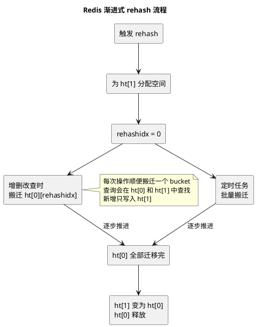
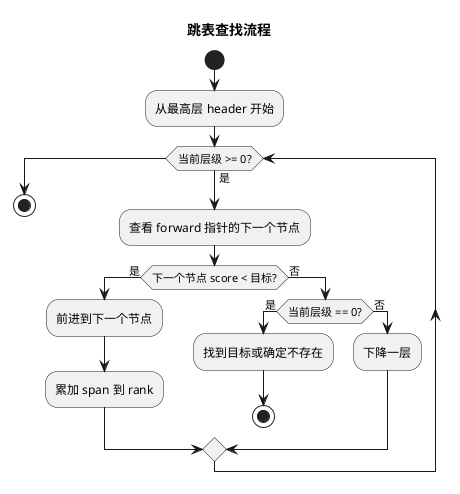
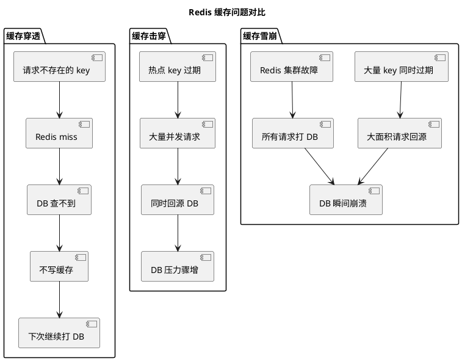
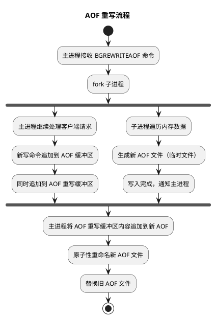

# Redis 底层数据结构与常见问题

## 问题索引

- Q1：Redis 底层数据结构有哪些？SDS、链表、字典、跳表、整数集合、压缩列表的实现原理是什么？
- Q2：Skip List 如何让 Redis 更快？为什么 ZSet 使用跳表而不是红黑树？
- Q3：Redis 穿透、击穿、雪崩的区别、场景和解决方案是什么？
- Q4：AOF 重写机制：AOF 会精简写命令吗？怎么精简？不是 append 吗？
- Q5：AOF 刷盘策略：如果使用 always，有类似 MySQL 的组提交优化吗？

## Q1：Redis 底层数据结构有哪些？SDS、链表、字典、跳表、整数集合、压缩列表的实现原理是什么？

### 背景

Redis 的高性能不仅来自内存存储和单线程模型，更来自精心设计的底层数据结构。理解这些数据结构是深入掌握 Redis 的基础。

Redis 的数据类型（String、List、Hash、Set、ZSet）是逻辑概念，它们的底层由不同的编码（encoding）实现。Redis 会根据数据规模和内容自动选择最优编码。

```text
逻辑类型 -> 编码 -> 底层数据结构
String -> int/embstr/raw -> SDS
List -> quicklist -> listpack + 双向链表
Hash -> listpack/hashtable -> listpack / dict
Set -> intset/hashtable -> intset / dict
ZSet -> listpack/skiplist -> listpack / skiplist + dict
```

### SDS：简单动态字符串

SDS（Simple Dynamic String）是 Redis 字符串的底层实现，相比 C 字符串有显著优势。

#### SDS 结构

```c
struct sdshdr {
    int len;        // 已使用长度
    int free;       // 未使用长度
    char buf[];     // 字节数组
}
```

实际上 Redis 针对不同长度字符串有多种 SDS 变体（sdshdr5/8/16/32/64），通过不同大小的 len 和 free 字段节省内存。

#### SDS 相比 C 字符串的优势

| 特性 | C 字符串 | SDS |
| --- | --- | --- |
| 获取长度 | O(N) 需要遍历到 `\0` | O(1) 直接读取 len 字段 |
| 二进制安全 | 不支持，遇到 `\0` 会截断 | 支持，可存储任意二进制数据 |
| 缓冲区溢出 | 容易溢出，需手动管理 | 自动扩容，API 安全 |
| 内存分配 | 修改需频繁分配 | 空间预分配和惰性释放 |

#### 空间预分配策略

SDS 修改时如果需要扩容，会预留额外空间：

```text
如果修改后 len < 1MB：分配 len * 2 + 1 字节
如果修改后 len >= 1MB：额外分配 1MB
```

这样可以减少频繁的内存分配次数。

#### 惰性空间释放

字符串缩短时，SDS 不会立即回收空间，而是增加 free 值，留待下次扩展使用。如果需要真正释放，可以调用 API。

#### 业务场景

- Redis String 类型的底层实现
- AOF 缓冲区
- 客户端输入缓冲区
- 需要高效字符串操作的场景

### 链表

Redis 链表是双向链表，早期用于 List 类型，现在主要用于 quicklist 的节点连接、发布订阅、慢查询等场景。

#### 链表节点结构

```c
typedef struct listNode {
    struct listNode *prev;  // 前驱节点
    struct listNode *next;  // 后继节点
    void *value;            // 节点值
} listNode;

typedef struct list {
    listNode *head;         // 头节点
    listNode *tail;         // 尾节点
    unsigned long len;      // 节点数量
    // 函数指针：复制、释放、匹配
    void *(*dup)(void *ptr);
    void (*free)(void *ptr);
    int (*match)(void *ptr, void *key);
} list;
```

#### 特点

- 双向链表，可前向后向遍历
- 带头尾指针，获取头尾节点 O(1)
- 带链表长度计数器，获取长度 O(1)
- 多态：使用 void* 存储值，可存储不同类型
- 无环：head 的 prev 和 tail 的 next 都指向 NULL

#### 业务场景

- quicklist 的节点连接
- 发布订阅的客户端列表
- 慢查询日志
- 监视器

### 字典（哈希表）

字典是 Redis 的核心数据结构，Redis 数据库本身就是一个字典，Hash、Set、ZSet 内部也使用字典。

#### 字典结构

```c
typedef struct dictht {
    dictEntry **table;      // 哈希表数组
    unsigned long size;     // 哈希表大小
    unsigned long sizemask; // 哈希表大小掩码，用于计算索引值 = size - 1
    unsigned long used;     // 已有节点数量
} dictht;

typedef struct dict {
    dictType *type;         // 类型特定函数
    void *privdata;         // 私有数据
    dictht ht[2];           // 两个哈希表，用于渐进式 rehash
    long rehashidx;         // rehash 进度，-1 表示未进行
} dict;

typedef struct dictEntry {
    void *key;              // 键
    union {
        void *val;
        uint64_t u64;
        int64_t s64;
        double d;
    } v;                    // 值
    struct dictEntry *next; // 链接下一个节点，解决哈希冲突
} dictEntry;
```

#### 哈希冲突解决

Redis 使用**链地址法**解决哈希冲突：

```text
table[0] -> entry1 -> entry2 -> NULL
table[1] -> entry3 -> NULL
table[2] -> NULL
```

新节点插入到链表头部，时间复杂度 O(1)。

#### 渐进式 rehash

当哈希表负载因子过高或过低时，需要 rehash 扩容或缩容。

普通 rehash 一次性搬迁所有数据会阻塞，Redis 采用**渐进式 rehash**：



**渐进式 rehash 过程：**

1. 为 `ht[1]` 分配空间，大小为第一个大于等于 `ht[0].used * 2` 的 2^n
2. 将 `rehashidx` 设置为 0，表示 rehash 开始
3. 在 rehash 期间，每次对字典的增删改查操作，顺便将 `ht[0]` 在 `rehashidx` 索引上的所有键值对 rehash 到 `ht[1]`，完成后 `rehashidx++`
4. 后台定时任务也会批量搬迁一些 bucket
5. 最终 `ht[0]` 的所有键值对都迁移到 `ht[1]` 后，释放 `ht[0]`，将 `ht[1]` 设置为 `ht[0]`，并创建新的空白 `ht[1]`，为下次 rehash 做准备

**rehash 期间的操作：**

- 查询：先查 `ht[0]`，未找到再查 `ht[1]`
- 新增：直接添加到 `ht[1]`
- 删除/更新：在两个表中查找并操作

这样把一次大开销分摊到多次操作中，避免阻塞。

#### 业务场景

- Redis 数据库本身（key -> value）
- Hash 类型的 hashtable 编码
- Set 类型的 hashtable 编码
- ZSet 的成员到分值映射

### 跳表（Skip List）

跳表是一种有序数据结构，通过在每个节点维护多个指向其他节点的指针，从而加速查找。

#### 跳表结构

```c
typedef struct zskiplistNode {
    sds ele;                        // 成员对象
    double score;                   // 分值
    struct zskiplistNode *backward; // 后退指针
    struct zskiplistLevel {
        struct zskiplistNode *forward; // 前进指针
        unsigned long span;            // 跨度
    } level[];                      // 层级数组
} zskiplistNode;

typedef struct zskiplist {
    struct zskiplistNode *header;   // 表头节点
    struct zskiplistNode *tail;     // 表尾节点
    unsigned long length;           // 节点数量
    int level;                      // 最大层数
} zskiplist;
```

#### 跳表原理

跳表可以理解为**多层有序链表**：

```plantuml
@startuml
title 跳表结构示意

rectangle "层级 3" as L3 {
  (header) -right-> (node1) : span=2
  (node1) -right-> (node3) : span=2
}

rectangle "层级 2" as L2 {
  (h2:header) -right-> (n1:node1) : span=1
  (n1) -right-> (n2:node2) : span=1
  (n2) -right-> (n3:node3) : span=1
}

rectangle "层级 1" as L1 {
  (h1:header) -> (n1a:node1) -> (n1b:node2) -> (n1c:node3) -> (n1d:node4)
}

note bottom
  查找时从高层开始，快速跳过中间节点
  平均时间复杂度 O(logN)
end note

@enduml
```

**关键特性：**

- 每个节点随机生成层高（1-32），层高越高概率越低
- 高层是低层的"快速通道"
- 通过高层快速定位区间，再通过低层精确查找
- 支持范围查询，按 score 顺序遍历

#### 查找过程

从最高层开始，沿着 forward 指针前进，当下一个节点的 score 大于目标值时，降低一层继续查找。

平均时间复杂度 **O(logN)**。

#### 业务场景

- ZSet 的 skiplist 编码
- 排行榜
- 延迟队列（按时间戳排序）
- 范围查询场景

### 整数集合（intset）

整数集合是 Set 类型的底层实现之一，当集合只包含整数且元素数量不多时使用。

#### intset 结构

```c
typedef struct intset {
    uint32_t encoding;  // 编码方式：int16/int32/int64
    uint32_t length;    // 元素数量
    int8_t contents[];  // 保存元素的数组
} intset;
```

#### 特点

- 有序存储，使用二分查找，查找时间 O(logN)
- 根据元素值范围自动选择编码（int16_t/int32_t/int64_t）
- 支持升级，不支持降级
- 节省内存

#### 升级过程

当插入的整数超出当前编码范围时，intset 会升级：

1. 根据新元素类型，扩展底层数组空间
2. 将现有元素转换为新编码并移动到正确位置
3. 添加新元素

例如：intset 当前是 int16，插入 65535，会升级为 int32。

#### 业务场景

- Set 类型存储小规模整数集合
- 黑名单 ID
- 白名单 UID

### 压缩列表（ziplist）与 listpack

压缩列表是紧凑的连续内存块，用于节省内存。Redis 7.0 后逐步被 listpack 替代。

#### ziplist 结构

```text
<zlbytes><zltail><zllen><entry>...<entry><zlend>
```

- `zlbytes`：整个 ziplist 占用字节数
- `zltail`：尾节点偏移量
- `zllen`：节点数量
- `entry`：节点数据
- `zlend`：标识 ziplist 结束（0xFF）

#### entry 结构

```text
<prevlen><encoding><entry-data>
```

- `prevlen`：前一个节点长度，用于反向遍历
- `encoding`：编码类型和长度
- `entry-data`：实际数据

#### ziplist 的问题：连锁更新

当插入或删除节点导致后续节点的 `prevlen` 字段不够存储前一个节点长度时，需要扩展 `prevlen`，这可能引发**连锁更新**。

例如：多个长度为 250-253 字节的节点，插入一个 254 字节节点，会导致后续所有节点的 `prevlen` 从 1 字节扩展到 5 字节，引发连锁更新。

最坏情况 O(N^2)，但实际很少发生。

#### listpack

listpack 是 ziplist 的改进版，去除了 `prevlen` 字段，避免连锁更新问题。

```text
<total-bytes><num-elements><entry>...<entry><end>
```

每个 entry 编码自身长度和类型，支持从后向前遍历，但不会引发连锁更新。

#### 业务场景

- Hash 小对象编码
- List 的 quicklist 节点内部存储
- ZSet 小集合编码
- Stream 消息存储

### 快速列表（quicklist）

quicklist 是 Redis 3.2 引入的 List 底层实现，结合了链表和压缩列表的优点。

#### quicklist 结构

```text
quicklist -> node1 -> node2 -> node3
             |         |         |
           listpack  listpack  listpack
```

- 宏观上是双向链表
- 每个节点内部是一个 listpack（或 ziplist）
- 兼顾内存节省和两端操作效率

#### 配置参数

```text
list-max-ziplist-size：
  正数表示每个节点最多存储多少个元素
  负数表示每个节点最多占用多少字节（-1=4KB, -2=8KB...）

list-compress-depth：
  两端各保留多少个节点不压缩，中间节点用 LZF 压缩
```

#### 业务场景

- Redis List 类型
- 消息队列
- 时间线
- 最新动态列表

### 踩坑点

- SDS 的空间预分配会占用额外内存，大字符串修改后可能浪费空间
- 字典 rehash 期间查询性能会轻微下降，需要查两个表
- 跳表的层高是随机的，极端情况下可能退化
- intset 只支持升级不支持降级，删除大整数后仍占用 int64 空间
- ziplist 连锁更新虽然理论存在，但实际触发概率很低
- quicklist 的压缩会增加 CPU 开销，适合冷数据

## Q2：Skip List 如何让 Redis 更快？为什么 ZSet 使用跳表而不是红黑树？

### 背景

ZSet（有序集合）是 Redis 中最复杂的数据类型之一，需要同时支持：

- 按 member 查询 score：O(1)
- 按 score 范围查询：O(logN + M)
- 按排名范围查询：O(logN + M)
- 插入、删除：O(logN)

Redis 使用**跳表 + 字典**的组合实现：

```text
dict：member -> score 映射，O(1) 查询
skiplist：按 score 有序存储，支持范围查询
```

为什么不用红黑树？这是一个经典的设计权衡问题。

### 跳表 vs 红黑树

| 对比维度 | 跳表 | 红黑树 |
| --- | --- | --- |
| 实现复杂度 | 简单，易理解和调试 | 复杂，旋转和变色逻辑繁琐 |
| 插入/删除 | O(logN)，但常数较小 | O(logN)，但常数较大 |
| 范围查询 | 简单，底层链表顺序遍历 | 需要中序遍历，复杂 |
| 查找性能 | O(logN) | O(logN) |
| 内存占用 | 指针较多，但可控 | 每个节点固定开销 |
| 并发友好 | 局部修改，锁粒度小 | 旋转影响全局平衡 |
| 按排名查找 | 通过 span 字段 O(logN) | 需要额外信息或遍历 |

### 为什么跳表更适合 Redis ZSet

#### 1. 实现简单

跳表的核心逻辑：

```c
// 查找
从最高层开始
while (层级 >= 1) {
    if (下一个节点 score < 目标) 前进
    else 下降一层
}

// 插入
随机生成层高
按层级插入节点并更新指针
```

红黑树的插入需要：

```text
插入节点
  -> 判断父节点颜色
  -> 判断叔叔节点颜色
  -> 执行左旋/右旋
  -> 重新染色
  -> 递归向上调整
```

跳表代码量约 200 行，红黑树需要 500+ 行且难以调试。

#### 2. 范围查询友好

ZSet 的核心场景之一是范围查询：

```bash
ZRANGEBYSCORE rank 80 100
ZREVRANGE rank 0 9
```

跳表的底层是有序链表，找到起点后顺序遍历即可：

```text
1. 用 O(logN) 找到 score >= 80 的第一个节点
2. 沿着 level[0] 顺序遍历到 score > 100
```

红黑树需要中序遍历，且不连续：

```text
1. 找到起点 O(logN)
2. 中序遍历需要递归或栈辅助
3. 节点在内存中不连续，缓存不友好
```

#### 3. 支持按排名查询

ZSet 支持按排名获取元素：

```bash
ZRANGE rank 0 9  # 获取排名前 10
```

跳表的 `span` 字段记录跨度，可以在 O(logN) 时间内定位到第 N 个元素。

红黑树需要额外维护子树大小，增加实现复杂度。

#### 4. 实现 ZRANK 更简单

`ZRANK` 返回 member 在有序集合中的排名：

```bash
ZRANK rank user1  # 返回 user1 的排名
```

跳表只需在查找过程中累加 span，就能得到排名。

#### 5. 内存和性能权衡合理

跳表的层高是随机的，平均层高约 1/(1-p)，Redis 中 p=0.25，平均层高约 1.33。

每个节点的指针数量期望值：

```text
1 * 0.75 + 2 * 0.25 * 0.75 + 3 * 0.25^2 * 0.75 + ... ≈ 1.33
```

相比红黑树每个节点固定 2 个子指针 + 1 个父指针 + 颜色位，跳表的内存开销可控。

#### 6. Redis 单线程，不需要红黑树的平衡保证

红黑树的严格平衡保证最坏情况仍是 O(logN)，但 Redis 是单线程模型，跳表的概率平衡在实践中完全够用。

跳表退化的概率极低，且即使退化，单线程下也不会被并发操作放大。

### 跳表的工程优势



- 代码简单，bug 少
- 调试友好，可以打印每一层
- 性能稳定，概率平衡
- 扩展性好，可以灵活调整层高策略

### Redis 作者的解释

Redis 作者 Antirez 在邮件列表中解释过这个设计选择：

> "跳表的实现简单很多，代码更少，更容易调试。跳表的性能和红黑树在实践中没有显著差异，但跳表更适合范围查询和按排名查询。"

### 业务场景

ZSet 的典型业务场景都依赖跳表的特性：

| 场景 | 操作 | 跳表优势 |
| --- | --- | --- |
| 排行榜 | ZREVRANGE rank 0 9 | 范围查询简单 |
| 延迟队列 | ZRANGEBYSCORE queue 0 now | 按 score 范围取任务 |
| 热度排序 | ZINCRBY hot article1 1 | 插入和更新 O(logN) |
| 分页查询 | ZRANGE rank 100 109 | 按排名范围查询 |
| 实时榜单 | ZRANK user1 | 快速获取排名 |

### 踩坑点

- 跳表的随机层高在极端情况下可能不够均匀，但概率极低
- 跳表的内存占用比单纯的数组高，但比红黑树可控
- 跳表不适合频繁的精确查找单个元素，这种场景 dict 更好（ZSet 两者结合）
- 大范围遍历时，跳表会退化为链表遍历，时间复杂度 O(N)

## Q3：Redis 穿透、击穿、雪崩的区别、场景和解决方案是什么？

### 背景

Redis 缓存的三大经典问题：穿透、击穿、雪崩，虽然都会导致数据库压力暴增，但触发原因和解决方案完全不同。

### 三者对比

| 问题 | 核心原因 | 影响范围 | 典型表现 |
| --- | --- | --- | --- |
| 缓存穿透 | 查询不存在的数据 | 大量随机 key | 恶意请求直接打 DB |
| 缓存击穿 | 单个热点 key 过期 | 单个热点 key | 瞬间大量请求回源 |
| 缓存雪崩 | 大量 key 同时失效或 Redis 故障 | 大面积 key | DB 被大量请求压垮 |



### 缓存穿透

#### 定义

查询的数据既不在缓存中，也不在数据库中，导致每次请求都会穿透缓存直接查询数据库。

#### 典型场景

```text
GET product:-1           # 负数 ID
GET user:999999999       # 不存在的用户
GET order:fake_12345     # 伪造订单号
```

**恶意攻击：** 爬虫或攻击者构造大量不存在的 key，绕过缓存直接打数据库。

#### 业务场景

- 电商平台：恶意查询不存在的商品 ID
- 社交平台：枚举用户 ID 或订单 ID
- 订单系统：商户查询不属于自己的订单
- API 接口：参数被篡改或伪造

#### 请求流程

```text
客户端请求 product:-1
  -> 查询 Redis：miss
  -> 查询 DB：不存在
  -> 返回 null
  -> 不写缓存
  -> 下次相同请求重复上述流程
```

#### 解决方案

##### 方案一：参数校验

在进入缓存层之前，先做业务合法性校验：

```java
// 参数校验
if (productId <= 0) {
    throw new IllegalArgumentException("Invalid product ID");
}

// 权限校验
if (!hasPermission(merchantId, orderId)) {
    throw new ForbiddenException("No permission");
}

// 格式校验
if (!isValidOrderFormat(orderId)) {
    throw new IllegalArgumentException("Invalid order format");
}
```

**适用场景：** 所有业务都应该做，是第一道防线。

##### 方案二：缓存空值

数据库查询不存在时，也写入缓存，但设置较短的 TTL：

```java
String value = redis.get(key);
if (value == null) {
    value = db.query(key);
    if (value == null) {
        // 缓存空值，TTL 较短
        redis.setex(key, 60, "NULL");
        return null;
    }
    redis.setex(key, 3600, value);
}
return value.equals("NULL") ? null : value;
```

**注意：**

- TTL 不能太长，否则真实数据创建后短时间查不到
- 空值缓存可能被大量随机 key 攻击，污染缓存
- 需要区分"业务上不存在"和"缓存未命中"

**适用场景：** key 相对可控，不会被无限枚举的场景。

##### 方案三：布隆过滤器

在缓存之前加一层布隆过滤器，拦截绝大多数不存在的 key：

```java
// 初始化时将所有存在的 key 加入布隆过滤器
bloomFilter.add(productId1);
bloomFilter.add(productId2);
// ...

// 查询时先过滤
if (!bloomFilter.mightContain(key)) {
    // 一定不存在，直接返回
    return null;
}

// 可能存在，继续查 Redis 和 DB
String value = redis.get(key);
if (value == null) {
    value = db.query(key);
    if (value != null) {
        redis.set(key, value);
    }
}
return value;
```

**布隆过滤器特点：**

- 判断不存在时 100% 准确
- 判断存在时可能误判
- 内存占用极小
- 不支持删除（可用布谷鸟过滤器或 Counting Bloom Filter）

**适用场景：** 商品 ID、用户 ID、订单 ID 等有限集合判断。

##### 方案四：限流和风控

对恶意流量做限流和拦截：

```text
- IP 限流：单 IP 每秒最多 100 次请求
- 用户限流：单用户每秒最多 50 次请求
- 设备限流：单设备每秒最多 30 次请求
- 黑名单：异常 IP/用户加入黑名单
- 验证码：高频请求触发验证码
- WAF：网关层拦截恶意流量
```

**适用场景：** 防御恶意攻击，所有对外接口都应该考虑。

### 缓存击穿

#### 定义

某个热点 key 过期瞬间，大量并发请求同时回源数据库，把数据库打垮。

#### 典型场景

```text
product:1001 是爆款商品
  -> 缓存刚好过期
  -> 同一时刻 10000 个请求到来
  -> 都发现缓存 miss
  -> 10000 个请求同时查 DB
```

#### 业务场景

- 秒杀商品详情
- 热门活动配置
- 首页推荐位
- 明星直播间信息
- 热点新闻详情

#### 请求流程

```text
T1: key 过期
T2: 请求 1 查 Redis miss，去查 DB
T2: 请求 2 查 Redis miss，去查 DB
T2: 请求 3 查 Redis miss，去查 DB
...
T2: 请求 10000 查 Redis miss，去查 DB
T3: DB 压力骤增，可能崩溃
```

#### 解决方案

##### 方案一：互斥锁

只允许一个线程回源，其他线程等待：

```java
public String getData(String key) {
    String value = redis.get(key);
    if (value == null) {
        String lockKey = "lock:" + key;
        // 尝试获取分布式锁
        if (redis.setnx(lockKey, "1", 10)) {
            try {
                // 双重检查
                value = redis.get(key);
                if (value == null) {
                    // 查询 DB
                    value = db.query(key);
                    if (value != null) {
                        redis.setex(key, 3600, value);
                    }
                }
            } finally {
                redis.del(lockKey);
            }
        } else {
            // 等待后重试
            Thread.sleep(50);
            return getData(key);
        }
    }
    return value;
}
```

**优点：** 严格控制回源并发

**缺点：** 
- 其他线程需要等待
- 高并发下可能造成线程堆积
- 第一个请求处理时间影响所有等待线程

**适用场景：** 可以接受短暂等待的场景。

##### 方案二：逻辑过期

缓存永不过期，通过逻辑时间判断是否过期：

```java
public class CacheValue {
    private String data;
    private long expireTime; // 逻辑过期时间
}

public String getData(String key) {
    CacheValue cacheValue = redis.get(key);
    if (cacheValue == null) {
        // 首次加载
        return loadAndCache(key);
    }
    
    // 检查逻辑过期
    if (System.currentTimeMillis() > cacheValue.getExpireTime()) {
        // 逻辑过期，尝试异步刷新
        String lockKey = "refresh:" + key;
        if (redis.setnx(lockKey, "1", 10)) {
            // 异步刷新缓存
            threadPool.submit(() -> {
                try {
                    String newData = db.query(key);
                    CacheValue newValue = new CacheValue(newData, 
                        System.currentTimeMillis() + 3600000);
                    redis.set(key, newValue);
                } finally {
                    redis.del(lockKey);
                }
            });
        }
        // 先返回旧数据
        return cacheValue.getData();
    }
    
    return cacheValue.getData();
}
```

**优点：**
- 不阻塞请求，直接返回旧数据
- 只有一个线程刷新缓存
- 用户体验好

**缺点：**
- 会返回短暂的旧数据
- 需要容忍数据短暂不一致

**适用场景：** 商品详情、活动配置、首页推荐等允许短暂旧数据的场景。

##### 方案三：热点永不过期

对热点 key 不设置 TTL，主动更新：

```java
// 初始化时加载热点数据，不设置过期时间
redis.set("product:1001", productData);

// 商品更新时主动刷新缓存
public void updateProduct(Product product) {
    db.update(product);
    redis.set("product:" + product.getId(), product);
}
```

**优点：** 彻底避免过期回源

**缺点：**
- 需要识别热点 key
- 数据变更时需要主动更新缓存
- 缓存和 DB 一致性依赖业务代码

**适用场景：** 明确的热点数据，如首页配置、活动规则。

##### 方案四：多级缓存

本地缓存 + Redis 缓存：

```java
public String getData(String key) {
    // 先查本地缓存
    String value = localCache.get(key);
    if (value != null) {
        return value;
    }
    
    // 再查 Redis
    value = redis.get(key);
    if (value != null) {
        localCache.put(key, value, 60); // 本地缓存 1 分钟
        return value;
    }
    
    // 最后查 DB，加锁保护
    return loadWithLock(key);
}
```

**优点：** 降低 Redis 压力，提升响应速度

**缺点：** 数据一致性更复杂

**适用场景：** 读多写少的热点数据。

### 缓存雪崩

#### 定义

大量缓存同时失效，或 Redis 整体不可用，导致大量请求同时回源数据库。

#### 两种情况

##### 情况一：大量 key 同时过期

```text
活动开始前批量预热商品缓存：
  product:1001  TTL=3600
  product:1002  TTL=3600
  ...
  product:9999  TTL=3600

一小时后，所有 key 同时过期
  -> 大量请求同时回源
  -> DB 被打垮
```

##### 情况二：Redis 整体不可用

```text
Redis 集群故障/网络故障/机房断电
  -> 所有请求都查不到缓存
  -> 全部请求打到 DB
  -> DB 瞬间崩溃
```

#### 业务场景

- 大促活动：批量预热商品，统一过期
- 定时任务：凌晨统一刷新缓存
- 系统重启：缓存全部失效
- Redis 故障：主从切换、网络抖动

#### 解决方案

##### 针对批量过期

**方案一：TTL 加随机值**

```java
// 不要设置统一过期时间
int baseTtl = 3600;
int jitter = new Random().nextInt(600); // 0-600 秒随机值
redis.setex(key, baseTtl + jitter, value);
```

key 过期时间分散在 3600-4200 秒之间，避免集中失效。

**方案二：分批预热**

```java
// 不要一次性预热所有数据
for (int batch = 0; batch < 10; batch++) {
    List<Product> products = getBatchProducts(batch);
    for (Product product : products) {
        redis.setex("product:" + product.getId(), 
            3600 + batch * 60, // 每批间隔 1 分钟过期
            product);
    }
    Thread.sleep(1000); // 批次间隔
}
```

**方案三：热点永不过期 + 后台刷新**

```java
// 热点数据不设置过期时间
redis.set("hot:product:1001", productData);

// 后台定时刷新
@Scheduled(cron = "0 */5 * * * ?") // 每 5 分钟刷新一次
public void refreshHotProducts() {
    List<Product> hotProducts = getHotProducts();
    for (Product product : hotProducts) {
        redis.set("hot:product:" + product.getId(), product);
    }
}
```

##### 针对 Redis 故障

**方案一：Redis 高可用架构**

```text
主从复制 + Sentinel：自动故障转移
Redis Cluster：分片 + 高可用
```

**方案二：多级缓存**

```java
public String getData(String key) {
    // L1: 本地缓存
    String value = localCache.get(key);
    if (value != null) return value;
    
    // L2: Redis
    try {
        value = redis.get(key);
        if (value != null) {
            localCache.put(key, value);
            return value;
        }
    } catch (RedisException e) {
        // Redis 异常，降级到本地缓存兜底
        log.error("Redis error, fallback to local cache", e);
    }
    
    // L3: DB
    return loadFromDB(key);
}
```

**方案三：限流和降级**

```java
// Redis 不可用时限流
if (!redis.isAvailable()) {
    if (!rateLimiter.tryAcquire()) {
        throw new TooManyRequestsException("Service busy");
    }
}

// 降级策略
public Product getProduct(Long productId) {
    try {
        return getFromCache(productId);
    } catch (RedisException e) {
        // 降级：返回默认数据或本地兜底数据
        return getDefaultProduct(productId);
    }
}
```

**方案四：熔断保护**

```java
@HystrixCommand(fallbackMethod = "getProductFallback")
public Product getProduct(Long productId) {
    String value = redis.get("product:" + productId);
    if (value == null) {
        Product product = db.query(productId);
        redis.set("product:" + productId, product);
        return product;
    }
    return JSON.parse(value);
}

// 熔断后的降级方法
public Product getProductFallback(Long productId) {
    // 返回本地缓存或默认值
    return localCache.get(productId);
}
```

### 解决方案对比

| 问题 | 核心方案 | 辅助方案 |
| --- | --- | --- |
| 穿透 | 参数校验 + 布隆过滤器 + 空值缓存 | 限流 + 风控 |
| 击穿 | 互斥锁 / 逻辑过期 / 永不过期 | 多级缓存 + 预热 |
| 雪崩 | 随机 TTL + 高可用 | 多级缓存 + 限流降级 + 熔断 |

### 综合业务场景

#### 电商秒杀

**问题：** 击穿 + 雪崩

**方案：**

```java
// 商品详情：逻辑过期 + 本地缓存
public Product getProductDetail(Long productId) {
    // 本地缓存 30 秒
    Product product = localCache.get(productId);
    if (product != null) return product;
    
    // Redis 逻辑过期
    CacheValue value = redis.get("product:" + productId);
    if (value != null) {
        if (!value.isExpired()) {
            localCache.put(productId, value.getData());
            return value.getData();
        } else {
            // 异步刷新，先返回旧数据
            asyncRefresh(productId);
            return value.getData();
        }
    }
    
    // 首次加载，加锁
    return loadWithLock(productId);
}

// 库存：热点永不过期 + 主动更新
public boolean decrStock(Long productId) {
    Long stock = redis.decr("stock:" + productId);
    if (stock < 0) {
        redis.incr("stock:" + productId);
        return false;
    }
    return true;
}
```

#### 订单查询

**问题：** 穿透

**方案：**

```java
public Order getOrder(Long merchantId, String orderId) {
    // 1. 参数校验
    if (!isValidOrderId(orderId)) {
        throw new IllegalArgumentException("Invalid order ID");
    }
    
    // 2. 权限校验
    if (!hasPermission(merchantId, orderId)) {
        throw new ForbiddenException("No permission");
    }
    
    // 3. 布隆过滤器
    if (!bloomFilter.mightContain(orderId)) {
        return null;
    }
    
    // 4. Redis 缓存
    String key = "order:" + merchantId + ":" + orderId;
    String value = redis.get(key);
    if (value != null) {
        return value.equals("NULL") ? null : JSON.parse(value);
    }
    
    // 5. DB 查询
    Order order = db.query(orderId);
    if (order == null) {
        // 缓存空值 60 秒
        redis.setex(key, 60, "NULL");
    } else {
        redis.setex(key, 3600, JSON.toJson(order));
    }
    
    return order;
}
```

### 踩坑点

- 空值缓存 TTL 太长，真实数据创建后查不到
- 空值缓存没有限制，被随机 key 攻击打爆内存
- 布隆过滤器误判存在，仍有少量请求打到 DB
- 互斥锁实现不当，死锁或锁超时
- 逻辑过期返回旧数据，业务要能接受
- 大量 key 统一 TTL，人为制造雪崩
- Redis 故障时没有限流，所有请求打 DB
- 本地缓存没有失效机制，读到脏数据

### 面试追问

- Q：缓存穿透和缓存击穿的区别是什么？
  A：穿透是查不存在的数据，每次都打 DB；击穿是热点 key 过期瞬间，大量并发回源。穿透用布隆过滤器和空值缓存，击穿用互斥锁或逻辑过期。

- Q：布隆过滤器为什么能防穿透？
  A：布隆过滤器判断不存在时 100% 准确，可以拦截绝大多数不存在的 key，但判断存在时可能误判，所以仍需要查 Redis 和 DB。

- Q：逻辑过期和互斥锁哪个更好？
  A：看场景。逻辑过期不阻塞请求，但会返回短暂旧数据，适合商品详情、配置等；互斥锁严格保证数据新鲜，但会阻塞等待，适合强一致场景。

- Q：缓存雪崩时为什么不能直接扩容 Redis？
  A：扩容能缓解容量压力，但如果是大量 key 同时过期，扩容无法解决集中失效问题；如果是 Redis 故障，扩容也来不及，核心是要提前做好 TTL 随机化、多级缓存和降级预案。

## Q4：AOF 重写机制：AOF 会精简写命令吗？怎么精简？不是 append 吗？

### 背景

AOF（Append Only File）持久化通过记录写命令来保存数据，但会面临一个问题：**文件无限增长**。

```text
SET counter 1
INCR counter    -> counter = 2
INCR counter    -> counter = 3
INCR counter    -> counter = 4
...
INCR counter    -> counter = 10000
```

如果每条命令都追加到 AOF，文件会非常大，恢复时需要重放所有命令，效率低下。

AOF 重写（rewrite）就是为了解决这个问题：**用当前内存数据生成新的 AOF 文件，替代旧文件**。

### AOF 确实是 append，但重写是 rewrite

日常运行时：

```text
客户端写命令 -> Redis 执行 -> append 到 AOF 缓冲区 -> fsync 刷盘
```

这是 **append** 模式，不会修改已有内容。

但 AOF 文件会不断膨胀，所以需要定期**重写**：

```text
遍历当前内存数据 -> 生成等价的最少命令集 -> 写入新 AOF 文件 -> 替换旧文件
```

重写是**生成新文件**，不是修改旧文件。

### AOF 重写如何精简命令

#### 原理：从结果反推命令

AOF 重写不是分析旧 AOF 文件，而是**直接读取内存中的当前数据状态**，生成最少的命令。

```text
旧 AOF：
  SET counter 1
  INCR counter
  INCR counter
  ...（10000 条）
  INCR counter

重写后 AOF：
  SET counter 10000
```

从 10000 条命令精简为 1 条。

#### 不同数据类型的精简

##### String

```text
旧 AOF：
  SET user:1:name "Tom"
  SET user:1:name "Jerry"
  SET user:1:name "Alice"

重写后：
  SET user:1:name "Alice"
```

只保留最终值。

##### List

```text
旧 AOF：
  LPUSH list a
  LPUSH list b
  LPUSH list c
  RPOP list

重写后：
  RPUSH list c b
```

直接用当前列表状态生成 RPUSH。

##### Hash

```text
旧 AOF：
  HSET user:1 name "Tom"
  HSET user:1 age "18"
  HSET user:1 name "Alice"
  HDEL user:1 age

重写后：
  HSET user:1 name "Alice"
```

只保留当前存在的字段。

##### Set

```text
旧 AOF：
  SADD tags java
  SADD tags redis
  SADD tags mysql
  SREM tags java

重写后：
  SADD tags redis mysql
```

只保留当前成员。

##### ZSet

```text
旧 AOF：
  ZADD rank 100 user1
  ZADD rank 200 user2
  ZINCRBY rank 50 user1

重写后：
  ZADD rank 150 user1 200 user2
```

直接用当前 score 生成 ZADD。

### AOF 重写流程



#### 详细步骤

**1. fork 子进程**

主进程执行 `BGREWRITEAOF` 命令后，fork 一个子进程：

```text
主进程：继续处理客户端请求
子进程：遍历内存数据，生成新 AOF
```

fork 利用 COW（Copy-On-Write）机制，子进程共享主进程内存，不会立即复制。

**2. 子进程生成新 AOF**

子进程遍历所有数据库中的 key，生成等价的写命令：

```c
for (db in databases) {
    for (key in db) {
        switch (key.type) {
            case STRING:
                write("SET", key, value);
            case LIST:
                write("RPUSH", key, ...elements);
            case HASH:
                write("HMSET", key, ...fields);
            case SET:
                write("SADD", key, ...members);
            case ZSET:
                write("ZADD", key, ...scoreMembers);
        }
    }
}
```

写入临时文件，例如 `temp-rewriteaof-<pid>.aof`。

**3. AOF 重写缓冲区**

子进程重写期间，主进程继续接收写命令：

```text
写命令 -> 执行
       -> 追加到 AOF 缓冲区（写入旧 AOF）
       -> 同时追加到 AOF 重写缓冲区
```

AOF 重写缓冲区记录子进程 fork 后的增量写命令。

**4. 子进程完成，主进程追加增量**

子进程写完临时文件后，通知主进程：

```text
主进程阻塞处理：
  1. 将 AOF 重写缓冲区内容追加到新 AOF 文件
  2. 原子性 rename 新文件为正式 AOF 文件
  3. 关闭旧 AOF 文件描述符
  4. 后续写命令追加到新 AOF
```

这个阶段会短暂阻塞主进程，但时间很短（通常几毫秒到几十毫秒）。

**5. 替换完成**

新 AOF 文件包含：

```text
子进程重写时的完整数据快照
+ 重写期间的增量写命令
```

保证数据完整性。

### AOF 重写触发条件

#### 自动触发

```text
auto-aof-rewrite-percentage 100
auto-aof-rewrite-min-size 64mb
```

含义：

- 当前 AOF 文件大小超过上次重写后的 100%（即翻倍）
- 且当前 AOF 文件大小超过 64MB

同时满足才触发。

#### 手动触发

```bash
BGREWRITEAOF
```

#### 触发时机选择

生产建议在低峰期触发：

```bash
# 凌晨 3 点自动触发
crontab: 0 3 * * * redis-cli BGREWRITEAOF
```

### AOF 重写优化

#### 1. 重写时限制大集合大小

一个 Hash 有 100 万个字段，不能生成一条 `HMSET` 命令，会导致：

- 单条命令过大
- 恢复时单条命令执行时间过长

Redis 会分批生成：

```text
HMSET key field1 value1 ... field64 value64
HMSET key field65 value65 ... field128 value128
...
```

默认每批 64 个元素（`aof-rewrite-incremental-fsync` 配置）。

#### 2. 重写时定期 fsync

子进程写入新 AOF 文件时，不是一次性写完才 fsync，而是每写入 32MB 就 fsync 一次：

```text
aof-rewrite-incremental-fsync yes
```

避免最后一次性 fsync 造成 IO 毛刺。

#### 3. fork 的 COW 开销

fork 子进程时，主进程的内存使用越高，fork 开销越大：

- 内存占用 10GB，fork 可能需要几十毫秒到几百毫秒
- fork 期间主进程会阻塞

**优化建议：**

- 控制 Redis 实例内存大小（单实例 10-20GB）
- 避免高峰期重写
- 使用 `transparent_hugepage=never`（禁用大页）

### AOF 混合持久化

Redis 4.0 引入混合持久化：

```text
aof-use-rdb-preamble yes
```

重写时，子进程先生成 RDB 快照，再追加增量 AOF 命令：

```text
新 AOF 文件 = RDB 格式的数据快照 + AOF 格式的增量命令
```

**优点：**

- 重写后的文件更小
- 恢复速度更快（RDB 部分快速加载）
- 保留 AOF 的数据安全性

**恢复流程：**

```text
1. 加载 RDB 部分（二进制快照）
2. 重放 AOF 部分（增量命令）
```

### 业务场景

| 场景 | 配置建议 |
| --- | --- |
| 缓存场景 | 不开启 AOF，或 `appendfsync everysec` + 自动重写 |
| 会话存储 | `appendfsync everysec` + 混合持久化 + 自动重写 |
| 业务状态 | `appendfsync everysec` + 混合持久化 + 主从 + 定期备份 |
| 强一致要求 | 不要依赖 Redis，DB 做唯一约束 |

### 踩坑点

- AOF 重写期间 fork 会短暂阻塞主进程，内存越大阻塞越久
- 重写期间写命令会同时写入两个缓冲区，内存压力增加
- 重写完成时主进程追加增量会短暂阻塞（通常几毫秒）
- AOF 文件过大时，重写生成的临时文件也大，磁盘空间要预留
- 混合持久化的 AOF 文件前半部分是 RDB 格式，不能直接文本查看
- 重写不会精简过期但未删除的 key，只保存当前内存数据

### 面试追问

- Q：AOF 重写会分析旧 AOF 文件吗？
  A：不会。AOF 重写直接遍历内存中的当前数据，生成等价的最少命令，完全不读旧 AOF 文件。

- Q：AOF 重写期间新的写命令怎么办？
  A：主进程将新写命令同时追加到 AOF 缓冲区（写入旧 AOF）和 AOF 重写缓冲区。子进程完成后，主进程将重写缓冲区内容追加到新 AOF，保证数据完整。

- Q：AOF 重写会阻塞主进程吗？
  A：fork 子进程时会短暂阻塞（几毫秒到几百毫秒），重写完成追加增量时会短暂阻塞（几毫秒），其他时间不阻塞。

- Q：混合持久化有什么好处？
  A：重写时先生成 RDB 快照，再追加增量 AOF，兼顾文件大小和恢复速度。RDB 部分快速加载，AOF 部分保证数据完整性。

## Q5：AOF 刷盘策略：如果使用 always，有类似 MySQL 的组提交优化吗？

### 背景

AOF 持久化的核心问题：**写命令什么时候真正落盘？**

```text
客户端写命令 -> Redis 执行 -> 写入 AOF 缓冲区 -> fsync 刷盘
```

`fsync` 是系统调用，将内核缓冲区数据强制写入磁盘，性能开销较大。

AOF 刷盘策略由 `appendfsync` 配置：

```text
appendfsync always    # 每条命令都 fsync
appendfsync everysec  # 每秒 fsync 一次
appendfsync no        # 交给操作系统决定
```

### 三种刷盘策略对比

| 策略 | 刷盘时机 | 数据丢失窗口 | 性能 | 适用场景 |
| --- | --- | --- | --- | --- |
| `always` | 每条命令后 fsync | 几乎不丢（极端故障可能丢 1 条） | 最低，受磁盘 IO 限制 | 强一致要求 |
| `everysec` | 后台线程每秒 fsync | 最多丢 1 秒数据 | 较高，异步刷盘 | 生产常用 |
| `no` | 操作系统决定（通常几十秒） | 可能丢几十秒数据 | 最高，完全异步 | 纯缓存场景 |

### always 策略的性能瓶颈

```text
客户端 -> SET key value
       -> Redis 执行
       -> 写入 AOF 缓冲区
       -> fsync 刷盘（阻塞）
       -> 返回客户端
```

每条写命令都要等待 fsync 完成，吞吐量受限于磁盘 IOPS：

- 普通 SATA 盘：200-300 TPS
- SSD：1000-5000 TPS
- NVMe SSD：10000+ TPS

单线程模型下，always 策略会严重限制写入性能。

### Redis 有组提交优化吗？

**简短回答：Redis 的 always 策略有一定的批量优化，但不像 MySQL 那样有完整的组提交机制。**

#### MySQL 的组提交

MySQL InnoDB 的组提交（Group Commit）：

```text
多个事务同时提交
  -> 积攒到一个组（group）
  -> 一次 fsync 刷盘多个事务的 redo log
  -> 大幅降低 fsync 次数
```

例如：

```text
事务 1、2、3、4、5 在同一时刻提交
  -> MySQL 将它们的 redo log 一次性 fsync
  -> 5 个事务只调用 1 次 fsync
  -> 吞吐量提升 5 倍
```

#### Redis 的批量优化

Redis 在 `always` 策略下，也有一定的批量写入优化，但机制不同：

**1. 命令批量执行**

Redis 事件循环在一次循环中可以处理多个命令：

```text
事件循环：
  读取多个客户端命令
  批量执行
  批量写入 AOF 缓冲区
  调用一次 write
  调用一次 fsync
```

但这依赖于命令到达的时机，不是主动积攒。

**2. Pipeline 的批量效果**

客户端使用 Pipeline 发送多条命令：

```bash
PIPELINE
  SET key1 value1
  SET key2 value2
  SET key3 value3
EXEC
```

Redis 会批量执行这些命令，然后批量写入 AOF：

```text
批量执行 3 条命令
  -> 批量写入 AOF 缓冲区
  -> 调用一次 write + fsync
```

但这需要客户端主动使用 Pipeline，不是 Redis 自动优化。

**3. 事件循环的自然批量**

Redis 事件循环每次处理多个就绪的文件描述符（fd）：

```c
while (true) {
    events = epoll_wait(epfd, ...);
    for (event in events) {
        processCommand(event);
        appendToAOFBuffer(event);
    }
    flushAOFBuffer(); // 一次性 write + fsync
}
```

如果多个客户端命令在同一次事件循环中到达，会自然形成批量。

**但这不是严格的组提交：**

- Redis 不会主动等待积攒更多命令
- 批量大小取决于网络延迟和并发量
- 单个客户端串行请求无法受益

#### 对比总结

| 特性 | MySQL 组提交 | Redis 批量优化 |
| --- | --- | --- |
| 主动积攒 | 是，主动等待一段时间积攒事务 | 否，依赖事件循环自然批量 |
| 批量大小 | 可配置等待时间和组大小 | 取决于并发和网络延迟 |
| 吞吐提升 | 显著，组越大提升越明显 | 有限，依赖客户端并发度 |
| 延迟影响 | 组提交等待会增加延迟 | 延迟主要受 fsync 影响 |

### everysec 策略的后台线程优化

生产环境最常用的是 `everysec`：

```text
appendfsync everysec
```

工作机制：

```text
主线程：
  执行命令 -> 写入 AOF 缓冲区 -> 返回客户端

后台线程：
  每秒调用一次 fsync
```

主线程不等待 fsync，写入性能不受磁盘 IO 限制。

**关键细节：后台线程的保护机制**

如果后台线程的上一次 fsync 还没完成（磁盘 IO 慢），主线程会：

```text
如果距离上次 fsync 开始 < 2 秒：
  继续写入 AOF 缓冲区，不等待

如果距离上次 fsync 开始 >= 2 秒：
  主线程阻塞等待 fsync 完成
```

这样避免 AOF 缓冲区无限膨胀，同时限制最坏情况的数据丢失窗口为 2 秒。

### 性能测试对比

假设磁盘 IOPS 为 1000：

| 策略 | 单线程 TPS | 10 并发 TPS | 100 并发 TPS | 数据丢失 |
| --- | --- | --- | --- | --- |
| `always` | ~1000 | ~1000 | ~1000 | 几乎不丢 |
| `everysec` | ~100000 | ~200000 | ~300000 | 最多 1-2 秒 |
| `no` | ~150000 | ~250000 | ~400000 | 可能丢几十秒 |

`always` 策略的 TPS 受磁盘 IOPS 严格限制，即使高并发也无法突破。

### 生产建议

#### 不同场景的选择

| 场景 | 推荐策略 | 原因 |
| --- | --- | --- |
| 纯缓存 | `no` 或不开 AOF | 性能优先，数据可重建 |
| 会话存储 | `everysec` | 平衡性能和安全性 |
| 消息队列 | `everysec` + 主从 | 容忍少量丢失 |
| 业务状态 | `everysec` + 主从 + DB | Redis 不做唯一事实源 |
| 金融级强一致 | 不依赖 Redis | DB 做强一致保证 |

#### always 策略的优化

如果必须使用 `always`：

**1. 使用 Pipeline 批量写入**

```java
Pipeline pipeline = redis.pipelined();
for (int i = 0; i < 100; i++) {
    pipeline.set("key" + i, "value" + i);
}
pipeline.sync(); // 批量执行，减少 fsync 次数
```

**2. 使用高性能磁盘**

- NVMe SSD
- 持久化内存（Intel Optane）
- 企业级 SSD

**3. 使用电池保护的 RAID 卡**

部分 RAID 卡有电池保护的写缓存，fsync 只需要写入缓存，断电时电池保证数据落盘。

但要注意：

- 电池失效时数据仍可能丢
- 不能替代真正的持久化保证

**4. 考虑主从 + 半同步**

Redis 没有内置半同步复制，但可以用 `WAIT` 命令等待副本确认：

```bash
SET key value
WAIT 1 1000  # 等待至少 1 个副本确认，超时 1000ms
```

结合 `appendfsync everysec`，可以在性能和安全性间取得更好平衡。

### 踩坑点

- `always` 策略性能严重受限于磁盘 IOPS，不要高估吞吐量
- `always` 也不是绝对不丢数据，极端故障（机器断电 + 磁盘缓存丢失）仍可能丢 1 条
- `everysec` 磁盘 IO 慢时主线程会阻塞，监控 `aof_delayed_fsync` 指标
- Pipeline 能提升批量效果，但需要客户端支持
- 不要把 Redis 当作唯一数据源，DB 才是强一致保证

### 面试追问

- Q：Redis always 策略有组提交优化吗？
  A：有一定的批量优化，但不像 MySQL 那样主动积攒。Redis 在事件循环中自然批量处理多个命令，如果使用 Pipeline 或高并发场景，多个命令会在一次 fsync 中刷盘，但单客户端串行请求无法受益。

- Q：为什么生产常用 everysec 而不是 always？
  A：always 性能严重受磁盘 IOPS 限制，单机 TPS 通常只有几百到几千；everysec 后台异步刷盘，性能可达几十万 TPS，最多丢 1-2 秒数据，对多数业务是可接受的折中。

- Q：everysec 策略会阻塞主线程吗？
  A：正常情况不阻塞，但如果后台 fsync 执行超过 2 秒（磁盘 IO 严重慢），主线程会阻塞等待，避免 AOF 缓冲区无限膨胀。

- Q：如何优化 always 策略的性能？
  A：使用 Pipeline 批量写入、使用高性能磁盘（NVMe SSD）、使用带电池的 RAID 卡写缓存、考虑 WAIT 命令结合主从实现半同步。

## 面试追问

### 数据结构相关

- Q：为什么 SDS 要记录长度和剩余空间？
  A：记录长度可以 O(1) 获取字符串长度，记录剩余空间可以减少扩容时的内存分配次数，提升性能。

- Q：Redis 字典为什么用渐进式 rehash？
  A：一次性 rehash 大字典会阻塞主线程，影响其他命令执行。渐进式 rehash 把搬迁分摊到每次操作中，避免长时间阻塞。

- Q：跳表的层高是怎么决定的？
  A：随机生成，每增加一层的概率是 0.25，最大层高 32。这样平均层高约 1.33，查找时间复杂度 O(logN)。

- Q：ziplist 连锁更新真的会发生吗？
  A：理论存在，但实际触发概率很低。需要多个连续节点长度都在 250-253 字节，且插入节点恰好 254 字节才会触发。Redis 7.0 用 listpack 替代，避免了这个问题。

### 跳表相关

- Q：跳表相比平衡树的缺点是什么？
  A：跳表的指针数量更多，内存占用可能略高；跳表是概率平衡，极端情况可能退化（虽然概率极低）。但跳表实现简单、范围查询友好，综合优势明显。

- Q：跳表支持并发吗？
  A：跳表天然对并发友好，插入和删除只影响局部节点，锁粒度小。红黑树的旋转会影响全局平衡，并发控制更复杂。但 Redis 是单线程模型，这个优势在 Redis 中不明显。

### 缓存问题相关

- Q：布隆过滤器删除怎么办？
  A：标准布隆过滤器不支持删除。可以用 Counting Bloom Filter（每个位用计数器代替）或布谷鸟过滤器。Redis 4.0+ 提供 RedisBloom 模块，支持删除。

- Q：本地缓存和 Redis 数据一致性怎么保证？
  A：通过 MQ、Redis Pub/Sub 或配置中心通知本地缓存失效；或设置较短的本地缓存 TTL；或使用版本号机制。要根据业务容忍度选择合适方案。

- Q：缓存预热怎么做？
  A：系统启动时或活动开始前，批量加载热点数据到 Redis；分批加载避免一次性压力；TTL 加随机值避免同时过期；关键数据可以永不过期 + 主动更新。

### AOF 相关

- Q：AOF 重写期间主进程内存会增加吗？
  A：会。fork 利用 COW，主进程修改的内存页会复制，且 AOF 重写缓冲区会占用额外内存。内存压力较大时要谨慎重写。

- Q：AOF 和 RDB 可以同时开启吗？
  A：可以。Redis 启动时优先加载 AOF（数据更完整），如果 AOF 不存在才加载 RDB。生产常同时开启，混合持久化时 AOF 文件包含 RDB 快照 + 增量命令。

- Q：如何监控 AOF 重写性能？
  A：关注 `aof_rewrite_in_progress`、`aof_current_size`、`aof_base_size`、fork 耗时、重写耗时。磁盘 IO 慢时会影响重写性能，注意 `aof_delayed_fsync` 指标。

## 复习清单

- [ ] 能说清 SDS、链表、字典、跳表、intset、ziplist/listpack 的核心结构和优势
- [ ] 能解释渐进式 rehash 的流程和为什么需要两个哈希表
- [ ] 能说明跳表为什么适合 ZSet，对比红黑树的实现复杂度、范围查询、按排名查询
- [ ] 能区分缓存穿透、击穿、雪崩的原因、表现和解决方案
- [ ] 能解释 AOF 重写如何精简命令，重写流程中子进程和主进程的分工
- [ ] 能对比 always、everysec、no 三种刷盘策略的性能和数据安全性
- [ ] 能说明 Redis 的批量优化和 MySQL 组提交的区别
- [ ] 能针对不同业务场景（缓存、会话、状态）选择合适的持久化和高可用方案
