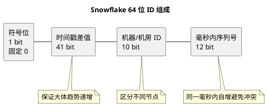
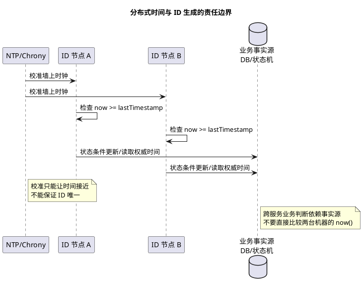
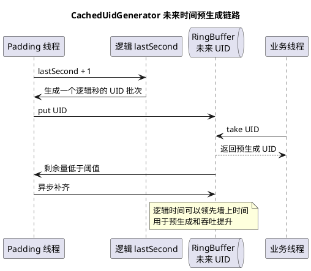

# Snowflake 雪花 ID 设计思路

## 问题索引

- Q1：雪花 ID 设计思路是什么？
- Q2：时钟回拨如何解决，Kubernetes 动态扩缩容下 workerId 如何分配？
- Q3：什么是时钟回拨？本地时间与其他服务不一致怎么办？Leaf-Snowflake 和 UidGenerator 如何处理？

## Q1：雪花 ID 设计思路是什么？

### 背景

分布式系统里经常需要全局唯一 ID，例如：

- 订单号。
- 支付流水号。
- MQ 消息事件 ID。
- 分库分表主键。
- 日志 Trace 关联 ID。

单库自增 ID 在分库分表、多服务部署、高并发写入时会遇到问题：

- 多库自增容易冲突。
- 依赖数据库生成 ID 会增加数据库压力。
- 自增 ID 暴露业务增长量。
- UUID 虽然全局唯一，但太长、无序、对数据库索引不友好。

Snowflake 雪花算法的目标是：**在本地内存中快速生成趋势递增、全局唯一、长度较短的 64 位整数 ID**。

### 核心结构

经典 Snowflake 使用 64 bit 的 long，其中最高位不用，剩余位按时间、机器、序列号拆分：

```text
0 | 41 bit timestamp | 10 bit workerId | 12 bit sequence
```

含义：

| 位段 | 长度 | 作用 |
| --- | --- | --- |
| 符号位 | 1 bit | 固定为 0，保证生成的是正数 |
| 时间戳 | 41 bit | 当前时间与自定义起始时间的毫秒差 |
| 机器 ID | 10 bit | 标识当前节点，最多 1024 个节点 |
| 序列号 | 12 bit | 同一毫秒内自增，最多 4096 个 ID |

生成公式：

```text
id = (timestampDiff << (workerIdBits + sequenceBits))
   | (workerId << sequenceBits)
   | sequence
```

其中 `timestampDiff = currentTimeMillis - epoch`。

### 为什么这样设计


### PlantUML 示意图：Snowflake ID 位段结构



#### 1. 时间戳保证趋势递增

ID 高位是时间戳，所以整体大体按时间递增。

这对数据库索引更友好：

- 相比 UUID，B+Tree 插入更接近顺序写。
- 减少页分裂。
- 范围查询和按时间排查更方便。

注意：Snowflake 是趋势递增，不是严格全局递增。不同机器之间同一毫秒生成的 ID，取决于 workerId 和 sequence。

#### 2. workerId 保证多节点不冲突

不同机器使用不同 `workerId`，即使同一毫秒生成相同序列号，也不会冲突。

例如：

```text
节点 A: workerId = 1
节点 B: workerId = 2
```

两者生成 ID 的机器位不同，因此最终 ID 不同。

#### 3. sequence 保证同一毫秒内不冲突

单个节点在同一毫秒内可能生成多个 ID，所以需要 `sequence` 自增。

12 bit 表示单节点每毫秒最多生成：

```text
2^12 = 4096
```

换算成每秒约：

```text
4096 * 1000 = 409.6 万
```

如果同一毫秒内序列号用完，就等待下一毫秒再生成。

### 关键流程

核心逻辑：

```java
public class SnowflakeIdGenerator {
    // 自定义起始时间，减少时间戳占用范围；不能随意修改，否则可能影响 ID 趋势和唯一性。
    private static final long EPOCH = 1704067200000L;

    private static final long WORKER_ID_BITS = 10L;
    private static final long SEQUENCE_BITS = 12L;

    private static final long MAX_WORKER_ID = (1L << WORKER_ID_BITS) - 1;
    private static final long MAX_SEQUENCE = (1L << SEQUENCE_BITS) - 1;

    private static final long WORKER_ID_SHIFT = SEQUENCE_BITS;
    private static final long TIMESTAMP_SHIFT = WORKER_ID_BITS + SEQUENCE_BITS;

    private final long workerId;
    private long lastTimestamp = -1L;
    private long sequence = 0L;

    public SnowflakeIdGenerator(long workerId) {
        if (workerId < 0 || workerId > MAX_WORKER_ID) {
            throw new IllegalArgumentException("workerId out of range");
        }
        this.workerId = workerId;
    }

    public synchronized long nextId() {
        long currentTimestamp = System.currentTimeMillis();

        if (currentTimestamp < lastTimestamp) {
            // 时钟回拨会导致时间戳变小，可能生成和历史相同的 ID，必须处理。
            throw new IllegalStateException("clock moved backwards");
        }

        if (currentTimestamp == lastTimestamp) {
            // 同一毫秒内自增序列号，用位与控制在 0 ~ 4095 范围内。
            sequence = (sequence + 1) & MAX_SEQUENCE;

            if (sequence == 0) {
                // 当前毫秒序列号耗尽，等待下一毫秒，避免同一毫秒内序列号重复。
                currentTimestamp = waitNextMillis(lastTimestamp);
            }
        } else {
            // 新毫秒开始，序列号归零。
            sequence = 0L;
        }

        lastTimestamp = currentTimestamp;

        return ((currentTimestamp - EPOCH) << TIMESTAMP_SHIFT)
            | (workerId << WORKER_ID_SHIFT)
            | sequence;
    }

    private long waitNextMillis(long lastTimestamp) {
        long timestamp = System.currentTimeMillis();
        while (timestamp <= lastTimestamp) {
            timestamp = System.currentTimeMillis();
        }
        return timestamp;
    }
}
```

### workerId 如何分配

`workerId` 是 Snowflake 唯一性的关键。如果两个节点拿到同一个 `workerId`，就可能在同一毫秒内生成重复 ID。

常见方案：

#### 1. 配置文件静态分配

每台机器配置固定 workerId。

优点：

- 简单。
- 无外部依赖。

缺点：

- 容器扩缩容不方便。
- 人工配置容易重复。
- 节点迁移时容易出错。

适合小规模固定机器部署。

#### 2. 通过注册中心分配

应用启动时向 ZooKeeper、Nacos、Etcd 注册临时节点，由注册中心分配 workerId。

优点：

- 适合动态扩缩容。
- 节点下线后可以释放。
- 可防止重复分配。

缺点：

- 依赖注册中心可用性。
- 启动流程更复杂。

#### 3. 基于数据库分配

维护一张 worker 表，应用启动时抢占一个 workerId。

```sql
CREATE TABLE id_worker (
  worker_id BIGINT PRIMARY KEY,
  app_name VARCHAR(64) NOT NULL,
  instance_id VARCHAR(128) NOT NULL,
  status VARCHAR(32) NOT NULL,
  last_heartbeat_time DATETIME NOT NULL
);
```

通过心跳续约，超时释放。

优点：

- 容易审计。
- 对中小团队实现成本低。

缺点：

- 启动依赖数据库。
- 心跳和过期回收要设计好，避免误回收导致 workerId 重复。

### 时钟回拨问题

Snowflake 强依赖本机时钟。如果系统时间往回跳，当前时间小于上次生成 ID 的时间，就可能生成重复 ID。

常见处理方式：

#### 1. 小幅回拨等待

如果回拨时间很小，例如小于 5ms，可以等待时间追上来。

```java
if (currentTimestamp < lastTimestamp) {
    long offset = lastTimestamp - currentTimestamp;
    if (offset <= 5) {
        currentTimestamp = waitNextMillis(lastTimestamp);
    } else {
        throw new IllegalStateException("clock moved backwards too much");
    }
}
```

#### 2. 大幅回拨拒绝服务

如果回拨很大，继续生成 ID 风险太高，应停止生成并告警。

适用：

- 订单 ID。
- 支付流水。
- 金融流水。
- 分库分表主键。

#### 3. 使用备用序列或时钟回拨位

有些实现会预留额外 bit，用于标记回拨期间的序列空间。但这会压缩其他位段，设计复杂。

#### 4. 运维层面避免时钟跳变

- 使用 NTP 平滑校时。
- 避免手动修改系统时间。
- 容器和宿主机时间统一。
- 监控时间偏移。

### 位段如何调整

经典位段是 `41 + 10 + 12`，但可以按业务调整。

| 场景 | 调整方向 |
| --- | --- |
| 节点很多 | 增加 workerId 位数，减少 sequence 或时间位 |
| 单节点并发极高 | 增加 sequence 位数 |
| 希望使用更久 | 增加时间戳位数 |
| 多机房部署 | workerId 拆成 datacenterId + workerId |

经典拆法：

```text
41 bit timestamp | 5 bit datacenterId | 5 bit workerId | 12 bit sequence
```

这样支持：

- 32 个机房。
- 每个机房 32 个节点。
- 每节点每毫秒 4096 个 ID。

### 和其他方案对比

| 方案 | 优点 | 缺点 | 适用场景 |
| --- | --- | --- | --- |
| 数据库自增 | 简单、强递增 | 单点、性能瓶颈、分库冲突 | 单库单表 |
| UUID | 本地生成、冲突概率低 | 长、无序、索引不友好 | 不要求排序的唯一标识 |
| Redis INCR | 简单、递增 | 依赖 Redis、高可用要处理 | 中小规模全局序列 |
| 号段模式 | 高性能、弱依赖 DB | 可能有号段浪费 | 业务 ID 服务 |
| Snowflake | 高性能、趋势递增、本地生成 | 时钟回拨、workerId 分配复杂 | 高并发分布式主键 |

### 业务场景

#### 分库分表主键

Snowflake ID 趋势递增，适合作为订单表、流水表主键，比 UUID 更适合 B+Tree 索引。

但要注意：

- 不能只按 Snowflake ID 取模做分片，否则时间高位可能导致分布不均，具体要看取模使用的是整个 ID 还是业务字段。
- 常见分片键更推荐选择业务维度，例如 userId、tenantId、orderNo hash。

#### MQ 幂等 eventId

事件消息可以使用 Snowflake 作为 `eventId`，用于消费端幂等记录。

#### Trace 或日志关联

可以用 Snowflake 生成请求号或业务流水号，便于按时间大致排序。

### 踩坑点

#### 1. workerId 重复比算法本身更危险

很多重复 ID 事故不是算法错，而是两个实例配置了同一个 workerId。

必须有：

- 分配机制。
- 启动校验。
- 心跳续约。
- 重复告警。

#### 2. 时钟回拨不能忽略

如果只是简单 `System.currentTimeMillis()`，遇到时间回拨就可能重复。生产实现必须处理回拨。

#### 3. ID 趋势递增不等于严格递增

不同节点同时生成 ID 时，全局顺序不一定完全等于真实生成顺序。

#### 4. 不要把 ID 语义暴露给外部

Snowflake ID 能大致推断生成时间和机器信息。对外订单号如果不希望暴露规模，可以再做编码、混淆或使用业务单号生成规则。

### 面试话术

> Snowflake 的设计思路是把一个 64 位 long 拆成时间戳、机器 ID 和毫秒内序列号。经典结构是 1 位符号位不用，41 位保存当前时间相对自定义 epoch 的毫秒差，10 位保存 workerId，12 位保存同一毫秒内的自增序列。时间戳保证 ID 趋势递增，workerId 保证多节点不冲突，sequence 保证单节点同一毫秒不冲突。它的优点是本地生成、高性能、趋势递增、适合数据库索引；难点是 workerId 分配和时钟回拨处理。生产上 workerId 通常通过配置、注册中心或数据库租约分配，时钟小幅回拨可以等待，大幅回拨要拒绝生成并告警。

### 高频追问

- Q：Snowflake 为什么是趋势递增，不是严格递增？
  A：单节点内基本递增，但多节点并发时，不同 workerId 的 ID 顺序不一定等于真实生成先后，所以只能说趋势递增。

- Q：同一毫秒内生成超过 4096 个怎么办？
  A：当前毫秒序列号耗尽后，等待下一毫秒再生成。

- Q：为什么需要 workerId？
  A：多个节点可能在同一毫秒生成相同 sequence，workerId 用于区分节点，保证全局唯一。

- Q：时钟回拨为什么危险？
  A：时间戳变小后，可能回到之前已经用过的时间区间，如果 sequence 也重复，就可能生成重复 ID。

- Q：Snowflake 适合作为数据库主键吗？
  A：适合很多高并发场景，因为它比 UUID 更短且趋势递增，对 B+Tree 更友好。但如果对外暴露，可能泄露生成时间和规模，需要业务层做处理。

### 复习清单

- [ ] 能画出 `timestamp + workerId + sequence` 位段结构。
- [ ] 能说清为什么 Snowflake 趋势递增且全局唯一。
- [ ] 能说明同一毫秒序列号耗尽后的处理。
- [ ] 能回答 workerId 如何分配和防重复。
- [ ] 能说明时钟回拨的风险和处理策略。
- [ ] 能对比 UUID、数据库自增、Redis INCR、号段模式和 Snowflake。

## Q2：时钟回拨如何解决，Kubernetes 动态扩缩容下 workerId 如何分配？

### 背景

Snowflake 的唯一性依赖三个条件：

- 同一个 workerId 在同一时刻只被一个有效实例持有。
- 同一个 workerId 下，时间戳不能倒退到已经生成过 ID 的时间区间。
- 同一毫秒内 sequence 不能重复。

所以生产事故常见不是算法公式写错，而是：

- 机器时间发生回拨。
- 两个 Pod 拿到了同一个 workerId。
- workerId 被过早回收，新旧 Pod 同时存活一小段时间。
- Pod 重启、漂移后，实例身份变化，但 ID 分配系统没有感知。

### 时钟回拨的解决方案

#### 1. 小幅回拨：等待时间追上

如果回拨时间很小，例如 5ms 以内，可以阻塞等待到 `lastTimestamp` 之后再生成。

```java
public synchronized long nextId() {
    long now = System.currentTimeMillis();

    if (now < lastTimestamp) {
        long offset = lastTimestamp - now;

        if (offset <= 5) {
            // 小幅回拨可以短暂等待，确保不会回到已经使用过的毫秒区间。
            now = waitUntilAfter(lastTimestamp);
        } else {
            // 大幅回拨继续生成 ID 风险太高，应该拒绝服务并告警。
            throw new IllegalStateException("clock moved backwards: " + offset + "ms");
        }
    }

    // 后续仍按同毫秒 sequence 自增、跨毫秒 sequence 归零的规则生成。
    return generateWithTimestamp(now);
}
```

适合场景：

- NTP 小幅校时。
- 宿主机时间轻微抖动。
- 对延迟敏感但可以接受几毫秒阻塞的业务。

#### 2. 大幅回拨：拒绝生成并告警

如果回拨几十毫秒、几秒甚至更久，不建议继续生成。

原因是当前时间已经落入过去使用过的时间窗口，如果还是同一个 workerId，sequence 又从 0 开始，就可能生成重复 ID。

适合策略：

- ID 服务返回异常。
- 业务进入降级或短暂不可用。
- 触发告警，让运维检查节点时间。
- Kubernetes 中可以让该 Pod 退出，由调度系统重建，但要确保 workerId 租约不会被并发复用。

#### 3. 持久化 lastTimestamp

单机进程重启后，内存里的 `lastTimestamp` 会丢失。如果宿主机时间回拨过，重启后仍可能生成过去时间段的 ID。

可以在本地磁盘、数据库或注册中心保存当前 workerId 的最大生成时间。

```text
启动时读取 workerId 对应的 max_last_timestamp
如果当前时间 < max_last_timestamp
    小幅回拨：等待
    大幅回拨：启动失败并告警
生成 ID 后定期上报 max_last_timestamp
```

注意点：

- 不需要每生成一个 ID 都写库，否则性能会被打穿。
- 可以按秒级或批量上报最大时间戳。
- 如果 workerId 会被重新分配给新 Pod，新 Pod 启动时必须读取这个 workerId 的历史最大时间戳。

#### 4. 使用回拨位或逻辑时钟

有些实现会预留一部分 bit 作为 `clockSequence` 或回拨标识。

思路：

```text
0 | timestamp | datacenterId | workerId | clockSequence | sequence
```

当发生回拨时，不直接使用旧的 sequence 空间，而是切换到另一个 `clockSequence` 空间。

优点：

- 小幅回拨时可以继续服务。

缺点：

- 位段更复杂。
- 会压缩 workerId 或 sequence 的容量。
- 如果回拨次数太多，仍然会耗尽。

#### 5. 运维层面避免时间跳变

Snowflake 不是时间同步系统，不能只靠业务代码兜底。

生产上要配合：

- 使用 Chrony/NTP 平滑校时，避免直接大步跳变。
- 禁止人工修改业务节点系统时间。
- 容器使用宿主机时间，重点监控宿主机时间偏移。
- 对 ID 服务增加时间回拨告警。

### Kubernetes 下 workerId 分配的核心问题

Kubernetes 动态扩缩容时，Pod 有几个特点：

- Pod IP 会变。
- Pod 名称可能重建。
- Pod 可能漂移到不同 Node。
- Deployment 的副本没有稳定序号。
- 旧 Pod 可能处于卡死、网络分区或优雅退出过程中，新 Pod 已经启动。

所以不建议使用：

| 方案 | 风险 |
| --- | --- |
| `workerId = hash(Pod IP)` | Pod IP 会复用，hash 也可能冲突 |
| `workerId = random()` | 概率冲突不可接受 |
| `workerId = hash(hostname)` | 普通 Deployment hostname 不适合做全局稳定身份 |
| 手工环境变量配置 | 扩缩容容易重复，运维成本高 |

### 方案一：StatefulSet 固定序号分配

如果 ID 生成服务可以用 StatefulSet 部署，最简单方案是使用 Pod ordinal。

例如 Pod 名称：

```text
id-service-0
id-service-1
id-service-2
```

可以分配：

```text
workerId = datacenterId * 128 + ordinal
```

优点：

- Pod 重启后 ordinal 不变。
- 扩缩容时新增 ordinal 明确。
- 不依赖额外数据库抢占。

限制：

- 最大副本数必须小于 workerId 位段容量。
- 多集群、多环境必须预留 `datacenterId` 或 `clusterId`，不能只用 ordinal。
- StatefulSet 更适合 ID 服务这类基础组件，不一定适合所有业务服务内置生成 ID。

### 方案二：租约中心动态分配

更通用的方案是使用数据库、Etcd、ZooKeeper、Redis 或 Kubernetes Lease 做 workerId 租约分配。

核心表可以这样设计：

```sql
CREATE TABLE snowflake_worker_lease (
  worker_id BIGINT PRIMARY KEY,
  app_name VARCHAR(64) NOT NULL,
  cluster_id VARCHAR(64) NOT NULL,
  instance_id VARCHAR(128) NOT NULL,
  pod_uid VARCHAR(128) NOT NULL,
  lease_until DATETIME NOT NULL,
  last_timestamp BIGINT NOT NULL,
  fencing_token BIGINT NOT NULL,
  version BIGINT NOT NULL
);
```

关键字段：

| 字段 | 作用 |
| --- | --- |
| `worker_id` | 被分配的机器号 |
| `app_name` / `cluster_id` | 避免不同应用、不同集群混用同一空间 |
| `instance_id` | 当前实例身份，可以由 PodName + PodUID 组成 |
| `pod_uid` | Kubernetes 创建 Pod 时生成的唯一 UID，能区分同名重建 |
| `lease_until` | 租约过期时间 |
| `last_timestamp` | 该 workerId 曾经生成过的最大时间戳 |
| `fencing_token` | 防止旧实例复活后继续写的栅栏令牌 |
| `version` | CAS 乐观锁版本 |

#### 启动抢占

```sql
UPDATE snowflake_worker_lease
SET instance_id = ?,
    pod_uid = ?,
    lease_until = DATE_ADD(NOW(), INTERVAL 30 SECOND),
    fencing_token = fencing_token + 1,
    version = version + 1
WHERE worker_id = ?
  AND lease_until < NOW()
  AND version = ?;
```

这条 SQL 的含义：

- 只允许抢占已经过期的 workerId。
- 用 `version` 做乐观锁，避免多个 Pod 同时抢到同一个 workerId。
- 抢占成功后递增 `fencing_token`，让旧实例的令牌失效。

#### 心跳续约

```sql
UPDATE snowflake_worker_lease
SET lease_until = DATE_ADD(NOW(), INTERVAL 30 SECOND),
    last_timestamp = GREATEST(last_timestamp, ?),
    version = version + 1
WHERE worker_id = ?
  AND instance_id = ?
  AND pod_uid = ?
  AND fencing_token = ?;
```

注意：

- 续约时必须校验 `instance_id`、`pod_uid`、`fencing_token`。
- 如果更新行数为 0，说明租约已丢失，当前实例必须停止生成 ID。
- 上报 `last_timestamp` 是为了 workerId 被新实例接管时能识别时钟回拨风险。

#### 生成 ID 前的本地校验

ID 生成不能每次都访问数据库，否则会失去 Snowflake 的意义。常见做法是：

- 本地持有租约和过期时间。
- 后台定时心跳续约。
- 生成 ID 时检查本地租约是否仍在有效期内。
- 如果心跳失败或租约即将过期，停止生成 ID。

```java
public long nextId() {
    if (!leaseHolder.isLeaseValid()) {
        // 租约失效时不能继续生成，否则可能和新 Pod 使用同一个 workerId。
        throw new IllegalStateException("worker lease lost");
    }

    // 租约有效时才进入 Snowflake 生成逻辑。
    return snowflake.nextId();
}
```

### 方案三：Kubernetes Lease API

Kubernetes 自带 `Lease` 对象，可用于 Leader Election，也可以用于 workerId 租约。

设计方式：

```text
每个 workerId 对应一个 Lease 对象
Pod 启动时尝试抢占某个过期 Lease
Pod 持有 Lease 后定期 renew
Lease annotations 保存 pod_uid、cluster_id、last_timestamp、fencing_token
```

优点：

- 不需要额外数据库。
- 和 K8s 控制面集成。
- 适合云原生环境。

注意：

- 控制面异常时要定义 ID 服务的降级策略。
- annotations 写 `last_timestamp` 不能太频繁。
- 多集群时不能共享同一个 Kubernetes API Server，要额外规划 `clusterId` 位段。

### 推荐落地方案

#### 小规模固定副本

使用 StatefulSet：

```text
5 bit clusterId + 5 bit ordinal
```

适合：

- ID 服务独立部署。
- 副本数可控。
- 多集群数量可控。

#### 中大型动态扩缩容

使用租约中心：

```text
workerId = clusterId + leaseWorkerId
```

要求：

- 启动抢占使用 CAS。
- 续约失败立即停止生成 ID。
- workerId 过期后不要立刻复用，保留安全冷却时间。
- 新实例接管 workerId 时检查 `last_timestamp`。
- 通过 `fencing_token` 防止旧 Pod 网络恢复后继续生成。

### 面试话术

> Snowflake 的时钟回拨不能简单忽略，因为同一个 workerId 下时间戳倒退后，sequence 可能和历史重复。小幅回拨可以等待时间追上，大幅回拨应该拒绝生成并告警，同时持久化每个 workerId 的最大生成时间，避免重启后丢失历史状态。在 Kubernetes 里，workerId 不能用随机数、Pod IP 或普通 Deployment 副本序号。简单稳定的方案是用 StatefulSet ordinal，再配合 clusterId；更通用的方案是用 DB、Etcd 或 Kubernetes Lease 做租约分配，启动时 CAS 抢占，运行时心跳续约，续约失败立即停止生成 ID，并用 pod_uid、last_timestamp、fencing_token 防止 Pod 重启、漂移和旧实例复活造成重复分配。

### 高频追问

- Q：Kubernetes 中为什么不能用 Pod IP 生成 workerId？
  A：Pod IP 会变化和复用，hash 也可能冲突。Snowflake 对 workerId 唯一性要求很高，概率冲突在主键生成场景不可接受。

- Q：Pod 重启后拿到同一个 workerId 有问题吗？
  A：如果确认旧 Pod 已经死亡，并且新 Pod 启动时检查了该 workerId 的 `last_timestamp`，可以复用。真正危险的是旧 Pod 没死、新 Pod 又拿到同一个 workerId。

- Q：为什么需要 fencing_token？
  A：它用于防止旧实例在网络恢复或长时间 STW 后继续认为自己持有租约。新实例抢占成功后令牌递增，旧实例续约或校验失败，就必须停止生成 ID。

- Q：workerId 租约过期后能立刻分配给新 Pod 吗？
  A：不建议。最好设置冷却时间，并结合 `last_timestamp` 检查，避免旧 Pod 短暂复活或新 Pod 时间落后导致重复 ID。

- Q：如果 ID 服务所在节点时间回拨，但租约仍有效怎么办？
  A：仍然不能继续生成。租约只证明 workerId 归属，不能证明时间安全。生成器还必须单独处理 `currentTimestamp < lastTimestamp`。

### 复习清单

- [ ] 能说清时钟回拨为什么会导致重复 ID。
- [ ] 能区分小幅回拨等待和大幅回拨拒绝服务。
- [ ] 能说明为什么 Pod IP、随机数、普通 Deployment 副本序号不适合做 workerId。
- [ ] 能设计 StatefulSet ordinal + clusterId 的 workerId 方案。
- [ ] 能设计基于 DB/Etcd/Kubernetes Lease 的租约分配方案。
- [ ] 能解释 `pod_uid`、`last_timestamp`、`fencing_token` 分别解决什么问题。

## Q3：什么是时钟回拨？本地时间与其他服务不一致怎么办？Leaf-Snowflake 和 UidGenerator 如何处理？

### 背景

前面的 Q2 说明了 Snowflake 的通用处理方式。本题进一步追问两个工程实现：

1. Leaf-Snowflake 如何借助 ZooKeeper 记录节点身份和历史时间，避免实例重启后直接复用危险的时间区间。
2. 百度 UidGenerator 如何通过“消费未来时间”和 RingBuffer 预生成 UID，提升吞吐并吸收一部分运行期时钟波动。

先给结论：

| 方案 | 主要解决的问题 | 不能替代的能力 |
| --- | --- | --- |
| NTP/Chrony | 让各节点的墙上时钟尽量接近 | 不能保证业务永远不回拨，也不能保证 ID 唯一 |
| Leaf-Snowflake + ZooKeeper | 分配/复用 workerId，并持久化启动时间检查 | 不是全局授时服务，生成 ID 仍依赖本机时钟 |
| UidGenerator Default | 按当前秒生成 UID，发生回拨直接拒绝 | 不会自动等待大幅回拨，也不使用未来时间 |
| UidGenerator Cached | 预先生成未来时间段的 UID，从 RingBuffer 直接消费 | 不是跨重启的历史时间持久化方案，RingBuffer 空了仍会失败 |

### 什么是时钟回拨

`System.currentTimeMillis()` 取得的是操作系统的墙上时钟，它可能因为 NTP 校时、人工改时间、虚拟机迁移、宿主机时间变化或时钟源调整而向前或向后跳变。

时钟回拨指：

```text
本次 currentTime < 上一次生成 ID 使用的 timestamp
```

经典 Snowflake 的 ID 由下面几部分组成：

```text
timestamp + workerId + sequence
```

如果 workerId 没变、时间戳退回历史区间、sequence 又从 0 开始，就可能生成与历史相同的 ID。即使没有立即重复，也会出现 ID 趋势逆序，影响按 ID 排序、分库分表路由和排查日志的时间判断。

需要区分墙上时钟和单调时钟：

| 时钟 | 特点 | 适用场景 |
| --- | --- | --- |
| `System.currentTimeMillis()` | 表示日历时间，可被校时，可能回拨 | 生成带时间含义的 ID、记录创建时间，但必须处理回拨 |
| `System.nanoTime()` | 进程内单调递增，不能转换成绝对日期 | 计算超时、耗时和重试间隔 |
| NTP/Chrony 校时 | 调整节点墙上时钟，使多个节点尽量接近 | 运维基础设施，不是 ID 唯一性方案 |

### 本地系统时间与其他服务不一致怎么办

#### 1. 先判断是哪一种“不一致”

#### 只影响展示或日志排序

统一使用 UTC epoch 时间戳、统一精度和时区。日志中同时记录 `traceId`、业务 ID 和服务实例，不能只依赖不同机器上的本地格式化时间判断先后。

#### 影响超时、过期和重试

不要用两个服务各自的 `now()` 直接比较。更稳妥的做法是：

- 入口服务生成明确的 `deadline`，下游按剩余预算处理。
- 使用相对超时和 `System.nanoTime()` 计算本地耗时。
- 需要数据库一致判断时，以数据库时间或业务状态为事实来源。
- 订单、支付等状态流转使用版本号和条件更新，不用本地时间直接覆盖远端状态。

#### 影响分布式 ID 生成

每个生成器必须独立检测 `currentTimestamp < lastTimestamp`。即使其他服务时间正常，当前 ID 节点回拨仍可能生成重复 ID；反过来，某个节点时间领先也会导致它生成“未来 ID”，破坏跨节点的严格时间顺序。

#### 2. 基础设施层统一时间

生产环境建议：

1. 所有节点使用同一组可信 NTP/Chrony 时间源，并统一 UTC 和时间精度。
2. 监控节点 offset、stratum、同步状态和最后一次校时结果。
3. 禁止在业务节点直接执行大步长的人工改时。
4. 为 ID 服务配置时间偏移阈值，超过阈值时摘流或停止发号。
5. 容器重启、宿主机迁移和虚拟化环境变更后重新检查时间状态。

NTP 只能降低时间偏差，不能替代 ID 服务的回拨保护。不能因为“所有节点已经 NTP 同步”就删除 `lastTimestamp` 检查。

### PlantUML 示意图：时间校准与 ID 生成边界



### Leaf-Snowflake 的 ZooKeeper 方案

#### 1. ZooKeeper 保存什么

Leaf-Snowflake 使用 ZooKeeper 的持久顺序节点保存 endpoint 与 workerId 的绑定。源码中的路径形式是：

```text
/snowflake/{leaf.name}/forever/{ip}:{port}-000000xxx
```

顺序节点的编号作为 workerId，节点数据中保存当前 endpoint 的时间戳。Leaf 还会把 workerId 写入本地文件，作为 ZooKeeper 初始化失败时的回退信息。

这里的关键不是让 ZooKeeper 给所有服务授时，而是保存：

```text
哪个 endpoint 使用哪个 workerId
该 endpoint 最近一次上报的时间是多少
```

#### 2. Leaf 启动和重启流程

```text
启动 Leaf-Snowflake
        |
        v
连接 ZooKeeper，检查 forever 根节点
        |
        +-- 首次 endpoint：创建持久顺序节点，得到新 workerId
        |
        +-- 已存在 endpoint：复用原 workerId
                              |
                              v
                     比较 ZK 历史时间与本机当前时间
                              |
                +-------------+-------------+
                |                           |
          本机时间不落后                 本机时间落后
                |                           |
          允许启动并上报                 拒绝启动并告警
```

Leaf 的源码实现有两个层次：

- 生成过程中，如果当前时间比 `lastTimestamp` 小不超过 5ms，会等待约 `offset * 2` 后再次检查；仍然落后则返回异常。
- 如果回拨超过 5ms，直接返回异常，不继续生成 ID。
- 进程启动时，如果同一 endpoint 的 ZooKeeper 节点记录时间大于当前本机时间，会抛出启动检查异常，避免重启后直接回到过去的时间段。
- 节点启动后大约每 3 秒上报一次当前时间，供后续重启检查。

#### 3. 为什么要用持久顺序节点而不是只用临时节点

临时节点适合表达“实例当前在线”，但实例下线后节点会消失，单独依赖临时节点无法保存这个 workerId 曾经生成到什么时间。

Leaf 使用持久节点保存历史身份和时间，启动时通过 endpoint 找回原 workerId，并检查历史时间。这样可以避免：

```text
实例生成过未来时间的 ID
实例重启且本机时间落后
重新从旧时间开始生成
```

但这不是完整的分布式 fencing 方案：

- 依赖稳定的 endpoint 标识，IP 或端口变化可能被识别成新节点。
- ZooKeeper 不可用时源码允许读取本地 workerId 文件回退，生产上要评估本地文件复制、容器重建和旧实例存活风险。
- ZooKeeper 记录的是最近上报时间，不是每一个已生成 ID 的最大时间，因此仍需要本地回拨检查和合理的上报策略。

#### 4. Leaf 方案的正确面试表达

> Leaf-Snowflake 并不是用 ZooKeeper 给所有机器同步时间，而是用 ZooKeeper 的持久顺序节点为 endpoint 分配并保存 workerId，同时周期性记录该节点最近一次上报的时间。实例重启时如果发现 ZooKeeper 中的历史时间大于本机当前时间，就拒绝启动，避免同一个 workerId 回到已经使用过的时间区间。运行期仍然要在本地检查时间回拨：小幅回拨等待，超过阈值直接失败。ZooKeeper 解决的是 workerId 身份和重启后的历史时间保护，NTP/Chrony 才负责降低节点间的时钟偏差。

### 百度 UidGenerator 的未来时间思路

#### 1. DefaultUidGenerator 与 CachedUidGenerator 不是同一种策略

UidGenerator 有两个容易混淆的实现：

| 实现 | 发号方式 | 时钟回拨行为 |
| --- | --- | --- |
| `DefaultUidGenerator` | 当前秒内 sequence 自增，耗尽后等待下一秒 | 当前秒小于 `lastSecond` 时直接拒绝并抛出异常 |
| `CachedUidGenerator` | 后台预先生成未来秒的 UID，调用线程从 RingBuffer 取 | 调用热路径不再临时计算当前时间，可吸收一部分运行期回拨，但 RingBuffer 空、进程重启等情况仍需处理 |

所以“UidGenerator 使用未来时间解决回拨”需要准确表达为：**CachedUidGenerator 通过消费未来时间段、把生产和消费解耦，既突破单秒 sequence 的同步生成瓶颈，也为运行期的墙上时钟波动提供缓冲；它不是一个跨重启、永久解决时钟回拨的方案。**

#### 2. 未来时间是怎么产生的

CachedUidGenerator 的后台填充线程维护一个逻辑上的 `lastSecond`：

```text
lastSecond = 当前秒
每次填充：lastSecond + 1
为这个逻辑秒生成 [0, maxSequence] 的整批 UID
把 UID 放入 RingBuffer
```

调用 `getUID()` 时只从 RingBuffer 取一个已经生成的 UID，不需要在当前请求里读取墙上时钟并竞争当前秒的 sequence。这样可以：

- 把 UID 生产和消费并行化。
- 预先消耗未来秒的 sequence 空间，突破单秒序列上限。
- 在进程持续运行且 RingBuffer 有余量时，对一定范围的时间回拨不敏感。

但这些 UID 的时间位可能领先真实当前时间，因此不能把 UID 解码出的 timestamp 当成业务事件的真实发生时间。订单创建时间、支付时间和日志时间应单独使用业务事实源记录。

### PlantUML 示意图：UidGenerator 未来时间与 RingBuffer



### RingBuffer 满了、空了与扩容机制

#### 1. RingBuffer 的结构

RingBuffer 使用数组保存 UID，并使用状态数组标记 slot 是否可以 `put` 或 `take`：

```text
tail   -> 最近一次生产的位置
cursor -> 最近一次消费的位置
flags  -> 当前 slot 可写还是可读
```

CachedUidGenerator 默认的容量计算方式是：

```text
bufferSize = (maxSequence + 1) << boostPower
```

默认 `boostPower = 3`，默认 sequence 位数为 13 时，基础容量为 8192，RingBuffer 容量约为 65536。RingBuffer 容量必须是 2 的幂，便于使用位运算计算槽位。

#### 2. RingBuffer 满了

当 `tail` 追上 `cursor`，继续 `put` 会覆盖尚未消费的 UID，因此 RingBuffer 拒绝写入：

```text
padding 线程生成 UID
        -> put 检查 tail 与 cursor
        -> 已满：调用 rejectedPutBufferHandler
        -> 默认记录日志并丢弃这次填充请求
```

这里丢弃的是“还没有对外返回的预生成 UID”，不是已经发给业务的 UID。UID 不要求连续，因此不会因为填充时丢弃一个候选值而产生重复；但需要监控该日志，频繁出现说明填充速度或调度参数需要调整。

#### 3. RingBuffer 空了

当 `cursor` 追上 `tail`，说明没有可消费 UID：

```text
业务线程 take()
        -> 发现 cursor == tail
        -> 调用 rejectedTakeBufferHandler
        -> 默认记录日志并抛出异常
```

空 RingBuffer 通常表示：

- 业务消费速度持续高于后台填充速度。
- Buffer 太小，流量突发超过了缓冲能力。
- 填充线程被阻塞、异常或线程池资源不足。
- 进程刚启动，初始化填充尚未完成。

自定义 `rejectedTakeBufferHandler` 可以选择阻塞等待、降级到同步生成或快速失败，但不能简单“什么都不做后返回”，否则后续 slot 状态可能仍不可取。

#### 4. 什么时候触发填充

UidGenerator 有三种填充时机：

1. 初始化时填满整个 RingBuffer。
2. 剩余 UID 数量低于 `paddingFactor` 阈值时，异步触发填充。
3. 配置 `scheduleInterval` 后，由定时线程周期性填充。

默认 `paddingFactor` 为 50%。它控制“提前多久补货”，不是扩大 RingBuffer 容量。提高这个比例可以提前触发填充，但会增加后台生成和内存压力。

#### 5. RingBuffer 如何扩容

RingBuffer 的数组容量在初始化时确定，源码中 `bufferSize` 是固定字段，没有运行时动态扩容。所谓扩容主要是：

```text
调整 boostPower
重启或重新初始化 CachedUidGenerator
生成更大的 RingBuffer
```

扩容时要同时考虑：

- 单实例堆内存：每个 slot 有 UID 和状态标记，容量越大占用越多。
- 启动预热时间：初始化会填充整个 RingBuffer。
- 业务突发量与持续 QPS：容量只能吸收突发，不能解决长期供给不足。
- 后台填充线程和 CPU：扩容后填充批次更大，不能只扩大数组。
- 回拨缓冲窗口：未来 UID 越多，运行期能吸收的时间波动窗口越大，但未来 timestamp 也会领先更多。

推荐调优顺序：

1. 先监控空 RingBuffer 次数、剩余量、填充耗时和生成失败率。
2. 先提高提前填充比例或优化填充线程，再判断是否需要扩大容量。
3. 对持续超过单实例供给能力的流量做水平扩容，而不是无限增大 RingBuffer。
4. 通过 `rejectedTakeBufferHandler` 做明确的失败、等待或降级策略，并设置超时。

### Leaf-Snowflake 与 UidGenerator 对比

| 对比项 | Leaf-Snowflake | UidGenerator Cached |
| --- | --- | --- |
| workerId | ZooKeeper 持久顺序节点分配和复用 | 默认由数据库 WorkerIdAssigner 分配，可自定义 |
| 时间来源 | 生成请求时读取本机毫秒时间 | 后台按逻辑未来秒批量生成，业务线程直接消费 |
| 小幅回拨 | 等待约 `offset * 2` 后复查 | 运行期由未来 UID 缓冲吸收一部分，不代表完全免疫 |
| 大幅回拨 | 超过阈值拒绝生成/启动 | Default 模式直接拒绝；Cached 模式还要考虑重启、空 RingBuffer 和历史状态 |
| 高并发 | 当前毫秒 sequence + 本地锁 | RingBuffer 预生成与消费并行，吞吐更高 |
| 满/空处理 | 没有同类 UID RingBuffer | 满时触发 put 拒绝，空时触发 take 拒绝 |
| 主要风险 | ZK 不可用回退、endpoint 变化、历史时间上报延迟 | 未来 timestamp、RingBuffer 空、默认时间位配置过期、重启后历史时间不连续 |

### 踩坑点

- 把 ZooKeeper 说成“给所有服务同步时间”，Leaf 使用 ZooKeeper 的重点是 workerId 身份和历史时间检查。
- 认为节点时间只要相差几毫秒就一定会生成重复 ID。只要 workerId 唯一，单纯的跨节点时间偏差通常不直接造成重复，但会破坏严格时间顺序；同一 workerId 被复用时才是高风险。
- 用 `System.nanoTime()` 直接拼入分布式 ID。它只适合计算本进程耗时，不是跨节点、跨重启的绝对时间。
- 用 UID 解码出的未来 timestamp 当作订单创建时间或支付时间。UidGenerator Cached 的未来时间是发号内部机制，业务时间必须单独落库。
- 以为 CachedUidGenerator 的未来时间能跨重启保护回拨。进程重启后 RingBuffer 和逻辑 `lastSecond` 都会重新初始化，仍需 workerId 分配、历史时间持久化或启动检查。
- RingBuffer 空了仍然无限自旋等待，导致业务线程池全部卡住。等待必须有超时和降级，必要时直接让 ID 服务摘流。
- RingBuffer 满了就动态扩容。该实现的数组容量在初始化时固定，运行时应通过配置 `boostPower` 重新初始化，或通过水平扩容解决持续吞吐问题。
- 只提高 `boostPower`，不监控填充线程和内存。大 RingBuffer 只能延长缓冲时间，不能替代生产能力。
- 忽略 UidGenerator 默认时间位的生命周期。官方默认配置是 28 位 delta seconds、epoch 为 2016-05-20，按该配置时间范围大约在 2024 年结束，生产使用前必须重新规划 epoch 和位数。

## 高频追问

- Q：本地时间比其他服务快 10 秒，会马上生成重复 ID 吗？
  A：如果每个节点的 workerId 唯一，单纯时间偏差通常不会直接造成重复，但该节点会生成未来 ID，跨节点严格排序会失效；如果 workerId 发生复用或本机随后回拨，才可能进入重复风险。要统一 NTP/Chrony，并在业务上使用权威状态源而不是直接比较各服务的 `now()`。

- Q：为什么超时计算要用 `System.nanoTime()`？
  A：超时和耗时只需要单调递增的时间差，不需要绝对日期。`nanoTime()` 不受系统墙上时钟回拨影响，但不能用于生成跨节点唯一 ID，也不能转换成真实时间。

- Q：Leaf 的 ZooKeeper 节点为什么要持久化最后时间？
  A：进程重启后内存中的 `lastTimestamp` 会丢失。持久化的历史时间可以让同一 endpoint 复用 workerId 时先检查本机是否落后，避免重新从已经使用过的时间区间发号。

- Q：UidGenerator 是不是完全解决了时钟回拨？
  A：不是。DefaultUidGenerator 遇到回拨会拒绝；CachedUidGenerator 通过未来时间和 RingBuffer 让运行期发号不依赖每次读取当前时间，可以吸收一部分回拨，但进程重启、RingBuffer 空、workerId 复用和大幅回拨仍需独立保护。

- Q：RingBuffer 满了为什么可以丢弃 put 的 UID？
  A：这些 UID 还没有返回给业务，丢弃只会产生编号空洞，不会造成重复。真正不能丢的是已经返回给业务的 UID；如果频繁满，说明填充速度或容量配置需要治理。

- Q：RingBuffer 空了应该阻塞还是抛异常？
  A：默认策略是拒绝并抛异常，保证调用方快速感知。生产上可以自定义短暂等待或降级，但必须有超时、监控和摘流策略，不能无限阻塞业务线程。

## 复习清单

- [ ] 能区分墙上时钟、单调时钟、NTP/Chrony 和业务权威时间。
- [ ] 能解释本地时间与其他服务不一致时，为什么不应该直接比较各自的 `now()`。
- [ ] 能画出 Leaf-Snowflake 的 ZooKeeper 持久节点、workerId 复用和启动时间检查流程。
- [ ] 能说清 Leaf 的小幅回拨等待、大幅回拨拒绝和每 3 秒上报时间。
- [ ] 能区分 UidGenerator DefaultUidGenerator 与 CachedUidGenerator。
- [ ] 能解释未来时间、逻辑 `lastSecond` 和 RingBuffer 预生成之间的关系。
- [ ] 能说明 RingBuffer 满、空、paddingFactor、scheduleInterval 和 boostPower 各自的作用。
- [ ] 能指出 CachedUidGenerator 不是跨重启的完整回拨解决方案。

## 参考源码

- [Meituan Leaf SnowflakeIDGenImpl](https://github.com/Meituan-Dianping/Leaf/blob/master/leaf-core/src/main/java/com/sankuai/inf/leaf/snowflake/SnowflakeIDGenImpl.java)
- [Meituan Leaf SnowflakeZookeeperHolder](https://github.com/Meituan-Dianping/Leaf/blob/master/leaf-core/src/main/java/com/sankuai/inf/leaf/snowflake/SnowflakeZookeeperHolder.java)
- [Baidu UidGenerator DefaultUidGenerator](https://github.com/baidu/uid-generator/blob/master/src/main/java/com/baidu/fsg/uid/impl/DefaultUidGenerator.java)
- [Baidu UidGenerator CachedUidGenerator](https://github.com/baidu/uid-generator/blob/master/src/main/java/com/baidu/fsg/uid/impl/CachedUidGenerator.java)
- [Baidu UidGenerator RingBuffer](https://github.com/baidu/uid-generator/blob/master/src/main/java/com/baidu/fsg/uid/buffer/RingBuffer.java)

