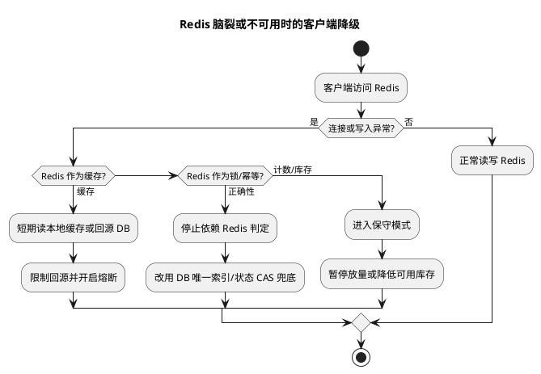

# Redis 脑裂与客户端降级

## 问题索引

- Q1：Redis 发生脑裂时，客户端降级表现是什么？

## Q1：Redis 发生脑裂时，客户端降级表现是什么？

### 背景

Redis 脑裂通常发生在主从、Sentinel 或 Cluster 场景中。简单说，就是网络分区或故障判断不一致导致一段时间内出现“两个主节点都认为自己可以提供写服务”的情况。

典型过程：

```text
Redis Master A 与 Sentinel / 部分节点网络隔离
Sentinel 判断 A 主观/客观下线
Sentinel 将 Replica B 提升为新 Master
但客户端仍然能连到旧 Master A
于是部分客户端写 A，部分客户端写 B
网络恢复后，A 被降级为 B 的从节点
A 上未同步到 B 的写入可能丢失
```

客户端看到的不是一个整齐的“Redis 不可用”，而是一段混乱窗口：

- 有的请求成功。
- 有的请求超时。
- 有的请求写到旧主。
- 有的请求写到新主。
- 有的读到旧数据。
- 有的写入后过一会儿消失。

### 客户端会有哪些表现

#### 1. 写请求部分成功、部分失败

脑裂期间，不同客户端连接的 Redis 节点可能不同：

| 客户端连接 | 表现 |
| --- | --- |
| 仍连旧 Master | 写入可能返回成功，但最终可能丢失 |
| 已切到新 Master | 写入成功并保留 |
| 连接切换中 | 可能超时、连接重置、MOVED/ASK、READONLY |

最迷惑的是：旧 Master 可能仍然对客户端返回 `OK`，但网络恢复后它会被降级为从节点，并同步新 Master 数据，旧 Master 上这段时间的写入会被覆盖。

#### 2. 写成功后读不到

场景：

```text
客户端 A 写旧 Master：SET order:1 PAID -> OK
客户端 B 读新 Master：GET order:1 -> null 或旧值
网络恢复后旧 Master 被重同步
order:1 的 PAID 写入消失
```

表现：

- 用户刚提交操作，页面刷新后状态没变。
- 接口返回成功，但后续查询查不到。
- 分布式锁加锁成功，但另一个客户端也能加锁。
- 幂等 Key 写入成功，但后续重复请求没有被拦住。

#### 3. 锁和幂等失效

如果 Redis 用于分布式锁或幂等标记，脑裂会非常危险。

例如：

```text
客户端 A 在旧 Master 获取 lock:order:1 成功
客户端 B 在新 Master 也获取 lock:order:1 成功
两个客户端同时执行扣库存
```

这就是为什么关键金融、库存、强一致资源不能只依赖单 Redis 主从锁，必须有数据库唯一约束、状态机或业务幂等兜底。

#### 4. 缓存读到旧数据或脏数据

如果旧 Master 和新 Master 都可读：

- 部分客户端读旧 Master，看到旧值。
- 部分客户端读新 Master，看到新值。
- 网络恢复后旧 Master 数据被覆盖。

表现为：

- 同一个用户不同请求结果不一致。
- 后台和前台看到状态不一致。
- 缓存中的计数、库存、权限短时间错乱。

#### 5. 客户端连接层异常

不同 Redis 客户端会表现为：

- 连接超时。
- 连接重置。
- `READONLY You can't write against a read only replica`
- Cluster 模式下 `MOVED`、`ASK` 重定向。
- Sentinel 模式下主节点地址刷新延迟。
- 连接池中仍有旧主连接，短时间继续写旧主。

### 为什么会产生数据丢失

Redis 主从复制默认是异步复制。旧 Master 写入成功返回客户端时，数据不一定已经复制到 Replica。

脑裂期间：

```text
旧 Master A 接收写入 x=1
但 A 与 B / Sentinel 网络隔离
B 被提升为新 Master
客户端继续向 B 写入 x=2
网络恢复后，A 成为 B 的从节点
A 执行全量或增量同步，以 B 数据为准
A 上未复制出去的 x=1 丢失
```

所以客户端感知到的是：**写入曾经成功，但最终状态不存在**。

### Redis 提供的降低脑裂风险参数

#### min-replicas-to-write

配置 Master 至少要有多少个健康从节点，否则拒绝写入。

```conf
min-replicas-to-write 1
min-replicas-max-lag 10
```

含义：

- 至少 1 个从节点延迟不超过 10 秒。
- 如果不满足，Master 拒绝写入。

这样可以降低旧 Master 在孤立状态下继续接收写入的风险。

注意：这不是强一致复制，只是提高写入安全性。它会牺牲可用性：从节点不可用或复制延迟过大时，Master 会拒绝写。

### 客户端降级策略


### PlantUML 示意图：Redis 脑裂下的客户端降级决策



Redis 脑裂时，客户端降级不能一刀切，要按 Redis 在业务中的角色决定。

#### 1. Redis 作为缓存

如果 Redis 只是缓存，降级策略可以是：

- Redis 写失败：跳过缓存写，只写数据库。
- Redis 读失败：回源数据库。
- 短时间启用本地缓存保护热点数据。
- 对热点 Key 加限流，避免大量请求打穿数据库。

表现：

```text
Redis 异常 -> 缓存命中率下降 -> DB 压力上升 -> 启用限流/本地缓存/熔断
```

客户端策略：

```java
public UserDTO getUser(Long userId) {
    try {
        UserDTO cached = redis.get("user:" + userId);
        if (cached != null) {
            return cached;
        }
    } catch (Exception ex) {
        // Redis 读失败时降级到 DB，但要记录指标，避免长期无感知。
        metrics.counter("redis.read.degrade").increment();
    }

    // 回源 DB 时要配合限流或本地缓存，避免 Redis 故障引发 DB 雪崩。
    return userMapper.selectById(userId);
}
```

#### 2. Redis 作为分布式锁

如果 Redis 用作分布式锁，脑裂期间不要盲目继续执行业务。

降级策略：

- 获取锁异常：直接失败或进入排队，不继续执行关键写操作。
- 锁成功后，业务侧仍用 DB 唯一约束、状态机、乐观锁兜底。
- 对强一致资源，优先用数据库行锁、唯一索引、状态机，而不是只依赖 Redis 锁。

示例：

```java
public void deductStock(String orderNo, Long skuId) {
    RLock lock = redissonClient.getLock("stock:" + skuId);
    boolean locked = false;
    try {
        // Redis 锁异常或超时，宁可拒绝请求，也不要在锁状态不确定时继续扣库存。
        locked = lock.tryLock(100, 5, TimeUnit.SECONDS);
        if (!locked) {
            throw new BizException("system busy, please retry later");
        }

        // 即使拿到锁，数据库层仍要用订单唯一键和库存扣减条件兜底。
        stockService.deductWithDbGuard(orderNo, skuId);
    } finally {
        if (locked && lock.isHeldByCurrentThread()) {
            lock.unlock();
        }
    }
}
```

#### 3. Redis 作为幂等标记

如果 Redis 用于 `SETNX` 幂等，脑裂会导致幂等标记丢失或双写。

降级策略：

- Redis 幂等只做第一道防线。
- 数据库唯一索引必须兜底。
- Redis 异常时不要直接放行关键业务，至少走 DB 幂等校验。

```java
public void handlePayCallback(PayCallback callback) {
    String key = "pay:callback:" + callback.getPayNo();

    try {
        Boolean first = redis.setIfAbsent(key, "1", 30, TimeUnit.MINUTES);
        if (Boolean.FALSE.equals(first)) {
            return;
        }
    } catch (Exception ex) {
        // Redis 幂等异常时不能直接认为是首次请求，要降级走 DB 幂等。
        metrics.counter("redis.idempotent.degrade").increment();
    }

    // DB 唯一索引 / 状态机是最终幂等防线。
    payService.handleWithDbIdempotent(callback);
}
```

#### 4. Redis 作为计数器或库存

如果 Redis 保存库存、积分、限购次数等关键计数，脑裂风险更高。

降级策略：

- Redis 异常时停止扣减，进入排队或降级提示。
- 使用数据库库存或库存中心做最终一致校验。
- 后台对账 Redis 计数和 DB 真实库存。
- 对库存类场景，Redis 只做预扣或缓存，最终以 DB 状态机为准。

### 客户端降级表现总结

| Redis 角色 | 脑裂表现 | 降级策略 |
| --- | --- | --- |
| 普通缓存 | 读旧值、读不到、缓存写失败 | 回源 DB、本地缓存、限流 |
| 分布式锁 | 两边都加锁成功、锁丢失 | 失败关闭、DB 锁/唯一索引兜底 |
| 幂等标记 | 重复请求未拦住 | DB 唯一索引、消费日志、状态机 |
| 计数器 | 计数不一致、回滚丢失 | 暂停关键写、DB 对账、补偿 |
| 会话/登录态 | 用户状态异常、踢下线 | 重新登录、读主、短期容忍 |

### 监控与告警

需要关注：

- Sentinel failover 次数。
- Redis master 切换事件。
- 复制延迟。
- `connected_slaves`。
- `master_link_status`。
- `rejected_connections`。
- 客户端 `READONLY`、`MOVED`、超时异常数量。
- Redis 写失败降级次数。
- DB 回源流量。
- 分布式锁获取失败率。

### 面试话术

> Redis 脑裂时，客户端不一定立刻感知为不可用，反而可能出现更危险的“部分成功”。一些客户端还连着旧 Master，写入返回 OK；另一些客户端已经切到新 Master。网络恢复后旧 Master 被降级并同步新 Master，旧 Master 上未复制出去的写入会丢失。所以客户端表现可能是写成功后读不到、锁两边都成功、幂等 Key 丢失、缓存读到旧值、连接超时或 READONLY/MOVED。降级策略要看 Redis 的角色：如果只是缓存，可以回源 DB、本地缓存和限流；如果是锁、幂等、库存计数这类关键写路径，不能只依赖 Redis，必须用 DB 唯一索引、状态机、乐观锁、对账补偿兜底。Redis 侧可以用 `min-replicas-to-write` 和 `min-replicas-max-lag` 降低孤立主继续写入的风险，但会牺牲可用性。

### 高频追问

- Q：Redis 脑裂时为什么写成功还会丢？
  A：因为旧 Master 可能在网络隔离期间仍接收写入，但这些写入没有复制到新 Master。网络恢复后旧 Master 被降级并同步新 Master，旧写入被覆盖。

- Q：`min-replicas-to-write` 能完全避免脑裂吗？
  A：不能完全避免，但能降低孤立 Master 继续写的风险。它要求 Master 至少有指定数量、延迟可接受的从节点，否则拒绝写入。

- Q：Redis 锁脑裂时怎么降级？
  A：锁状态不确定时，关键业务应失败关闭或排队，不能盲目继续执行。业务层必须用 DB 唯一约束、状态机、乐观锁兜底。

- Q：Redis 只是缓存时需要这么紧张吗？
  A：普通缓存可以容忍短暂不一致，主要降级到 DB、本地缓存和限流；但要防止 Redis 故障导致 DB 被打爆。

- Q：如何发现客户端还在写旧主？
  A：关注 Sentinel/Cluster 切主事件、客户端连接目标、`READONLY` 异常、写成功但主库无数据、复制延迟和业务对账差异。

### 复习清单

- [ ] 能说清 Redis 脑裂时为什么会出现两个可写主。
- [ ] 能解释旧主写入为什么会在网络恢复后丢失。
- [ ] 能区分 Redis 作为缓存、锁、幂等、计数器时的不同降级策略。
- [ ] 能说明 `min-replicas-to-write` 的作用和代价。
- [ ] 能回答客户端看到的超时、READONLY、MOVED、写成功读不到分别意味着什么。

