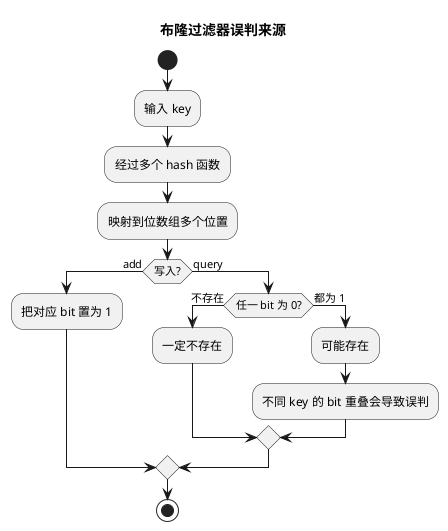

# 布隆过滤器与布谷鸟过滤器

## 问题索引

- Q1：布隆过滤器的实现原理是什么？误判问题如何产生和处理？
- Q2：布谷鸟过滤器的实现原理是什么？为什么天然支持删除？
- Q3：布隆过滤器误判率对存储有什么影响？布隆分片怎么设计？

## Q1：布隆过滤器的实现原理是什么？误判问题如何产生和处理？


### PlantUML 示意图：布隆过滤器写入与查询



### 背景

布隆过滤器用于快速判断一个元素是否“可能存在”或“一定不存在”。

常见场景：

- 缓存穿透防护，判断请求的商品 ID 是否存在。
- 秒杀黑名单或预约名单初筛。
- 大规模 URL 去重。
- 爬虫去重。
- 推荐系统中判断用户是否看过某内容。

它的价值是：**用很小的内存判断海量数据是否可能存在**。

### 核心结构

布隆过滤器由两部分组成：

```text
bit array 位数组
k 个 hash 函数
```

初始时，位数组全部是 0：

```text
index:  0 1 2 3 4 5 6 7 8 9
value:  0 0 0 0 0 0 0 0 0 0
```

### 添加元素

假设添加 `user:1001`，经过 3 个 hash 函数得到位置：

```text
h1(user:1001) = 2
h2(user:1001) = 5
h3(user:1001) = 8
```

把对应 bit 置为 1：

```text
index:  0 1 2 3 4 5 6 7 8 9
value:  0 0 1 0 0 1 0 0 1 0
```

### 查询元素

查询 `user:1001` 时，再用同样的 hash 函数得到 2、5、8。

- 如果这些位置全是 1：说明元素可能存在。
- 如果任意一个位置是 0：说明元素一定不存在。

这就是布隆过滤器最重要的结论：

```text
返回不存在：一定不存在
返回存在：可能存在
```

### 为什么会误判

误判来自 hash 冲突和 bit 复用。

例如过滤器里实际插入了：

```text
A -> 2, 5, 8
B -> 1, 5, 9
C -> 2, 4, 7
```

此时查询一个从没插入过的 `D`：

```text
D -> 1, 4, 8
```

如果 1、4、8 都已经被 A/B/C 置为 1，布隆过滤器会判断：

```text
D 可能存在
```

但实际上 D 并不存在，这就是误判。

注意：布隆过滤器不会误判“不存在”。只要某个 bit 是 0，就说明这个元素一定没插入过。

### 误判率受什么影响

误判率主要受三个因素影响：

| 因素 | 影响 |
| --- | --- |
| 位数组大小 `m` | 越大，误判率越低 |
| 插入元素数量 `n` | 越多，bit 越容易被填满，误判率越高 |
| hash 函数数量 `k` | 太少区分度不够，太多会更快把 bit 置满 |

常见公式：

```text
误判率约等于 (1 - e^(-kn/m))^k
```

最优 hash 函数数量：

```text
k = (m / n) * ln2
```

面试不一定要背公式，但要能说清：

- 容量估小了，误判率会上升。
- 插入数据超过预期，误判率会上升。
- hash 函数数量不是越多越好。

### 为什么普通布隆过滤器不支持删除

因为多个元素可能共用同一个 bit。

例如：

```text
A -> 2, 5, 8
B -> 1, 5, 9
```

A 和 B 都使用 bit 5。

如果删除 A 时把 2、5、8 都置为 0，那么 B 的 bit 5 也被清掉了。后续查询 B 时可能发现 bit 5 是 0，从而误判 B 不存在。

这会破坏布隆过滤器“一定不存在”的可靠性。

所以普通布隆过滤器通常不删除，只能：

- 重建过滤器。
- 使用 Counting Bloom Filter。
- 使用布谷鸟过滤器。

### Counting Bloom Filter

计数布隆过滤器把 bit 改成计数器。

添加元素：

```text
counter[index]++
```

删除元素：

```text
counter[index]--
```

查询时：

```text
所有 counter > 0 -> 可能存在
任意 counter == 0 -> 一定不存在
```

优点：

- 支持删除。

缺点：

- 比 bit array 占用更多内存。
- 计数器可能溢出。
- 删除不存在的元素会污染结构。

### 业务场景

#### 缓存穿透

问题：

```text
大量请求不存在的 productId
缓存查不到
请求全部打到 DB
```

方案：

```text
先查布隆过滤器
  -> 一定不存在：直接拒绝或返回空
  -> 可能存在：再查缓存/DB
```

#### 秒杀预约名单初筛

如果预约名单很大，可以用布隆过滤器先判断：

```text
布隆过滤器判断不在预约名单 -> 直接拒绝
布隆过滤器判断可能在 -> 再查 Redis Set 做精确确认
```

这里不能只靠布隆过滤器放行，因为它会误判存在。

### 踩坑点

- 把“可能存在”当成“一定存在”，导致越权放行。
- 预估容量太小，活动期间误判率飙升。
- 数据删除后不重建，导致已删除数据仍被判断可能存在。
- 布隆过滤器 miss 后直接回源 DB，没有做空值缓存或限流。
- 使用布隆过滤器做黑名单放行唯一依据，误判会误伤正常用户。

### 面试话术

> 布隆过滤器底层是一个 bit 数组加多个 hash 函数。添加元素时，用多个 hash 函数算出多个下标，把对应 bit 置为 1；查询时再算这些下标，如果有任意 bit 是 0，说明元素一定不存在，如果全部是 1，只能说明元素可能存在。误判是因为不同元素的 hash 位可能重叠，导致一个没插入过的元素对应的 bit 都被其他元素置成了 1。布隆过滤器不会误判不存在，但会误判存在。普通布隆过滤器不支持删除，因为多个元素可能共享同一个 bit，删除一个元素会影响其他元素。要支持删除可以用计数布隆过滤器或布谷鸟过滤器。

## Q2：布谷鸟过滤器的实现原理是什么？为什么天然支持删除？

### 背景

布谷鸟过滤器也是用于判断元素是否存在的概率型数据结构。它和布隆过滤器类似，都可能误判存在，但不会误判不存在。

它常被拿来和布隆过滤器比较，因为它有一个重要优势：**支持删除，并且空间效率也很高**。

### 核心结构

布谷鸟过滤器基于 Cuckoo Hashing 思想。

它通常由：

```text
bucket 数组
每个 bucket 有多个 slot
每个 slot 存 fingerprint 指纹
```

不是存完整元素，而是存元素的短指纹。

例如：

```text
fingerprint = hash(x) 的一部分 bit
```

结构示例：

```text
bucket[0]: [fp1, fp2, -, -]
bucket[1]: [fp3, -,   -, -]
bucket[2]: [-,   -,   -, -]
```

### 两个候选位置

每个元素有两个候选 bucket。

```text
fp = fingerprint(x)
i1 = hash(x)
i2 = i1 xor hash(fp)
```

元素 x 可以放在：

```text
bucket[i1] 或 bucket[i2]
```

查询时只需要检查这两个 bucket 里是否存在相同 fingerprint。

### 插入过程

插入 x：

```text
1. 计算 fp、i1、i2
2. 如果 bucket[i1] 有空位，放进去
3. 否则如果 bucket[i2] 有空位，放进去
4. 如果都满了，随机踢出一个已有 fingerprint
5. 被踢出的 fingerprint 去自己的另一个候选 bucket
6. 重复踢出，直到放入成功或达到最大踢出次数
```

这就是“布谷鸟”这个名字的来源：新元素像布谷鸟一样把别的元素从巢里挤出去。

### 查询过程

查询 x：

```text
fp = fingerprint(x)
i1 = hash(x)
i2 = i1 xor hash(fp)
```

如果 `bucket[i1]` 或 `bucket[i2]` 中存在相同 fp：

```text
可能存在
```

否则：

```text
一定不存在
```

### 为什么会误判

布谷鸟过滤器存的是 fingerprint，不是完整元素。

如果两个不同元素的 fingerprint 相同，并且候选 bucket 刚好匹配，就可能误判。

例如：

```text
x 的 fingerprint = 101011
y 的 fingerprint = 101011
```

如果查询 y 时，候选 bucket 里有 x 的 fingerprint，就会返回可能存在。

所以布谷鸟过滤器同样有误判，但误判率可以通过增加 fingerprint 位数降低。

### 为什么天然支持删除

布谷鸟过滤器支持删除的关键是：**它存的是可定位的 fingerprint，而不是共享 bit**。

删除 x：

```text
1. 计算 fp、i1、i2
2. 在 bucket[i1] 和 bucket[i2] 中查找 fp
3. 找到后删除这个 slot 中的 fp
```

因为删除的是某个 bucket 的某个 slot 里的 fingerprint，不会像布隆过滤器那样清掉多个共享 bit。

所以它天然比普通布隆过滤器更适合删除。

但要注意：由于 fingerprint 可能冲突，如果两个不同元素 fingerprint 一样，删除时可能删到“另一个元素”的指纹。

实际工程里通过更长 fingerprint、合理负载因子、业务侧避免删除不存在元素来降低风险。

### 和布隆过滤器对比

| 维度 | 布隆过滤器 | 布谷鸟过滤器 |
| --- | --- | --- |
| 底层结构 | bit array + 多 hash | bucket + fingerprint |
| 查询结果 | 一定不存在 / 可能存在 | 一定不存在 / 可能存在 |
| 误判原因 | hash 位被其他元素全部置 1 | fingerprint 冲突 |
| 删除 | 普通版本不支持 | 支持删除 |
| 插入失败 | 一般不会，误判率升高 | 负载高时可能插入失败 |
| 扩容 | 通常重建 | 通常也需要重建 |
| 适合场景 | 缓存穿透、大规模静态集合 | 需要删除的集合判重 |

### 布谷鸟过滤器的插入失败问题

当过滤器负载很高时，两个候选 bucket 都满，并且踢来踢去找不到空位，就会插入失败。

处理方式：

- 增大 bucket 数量。
- 降低负载因子。
- 增加每个 bucket 的 slot 数。
- 触发扩容或重建。
- 把失败元素放到备用结构。

### 业务场景

#### 可删除黑名单

黑名单用户会新增，也会解除。

如果用普通布隆过滤器：

- 加入黑名单容易。
- 移出黑名单困难。

如果用布谷鸟过滤器：

- 新增黑名单：插入 fingerprint。
- 解除黑名单：删除 fingerprint。

但高风险场景下，过滤器只能做第一层判断，命中后仍建议查 Redis Set 或风控服务确认。

#### 短周期去重

例如活动期间防重复提交的请求 ID：

- 插入请求 ID。
- 过期或处理完成后删除。

布谷鸟过滤器比普通布隆过滤器更适合这种有删除需求的场景。

### 踩坑点

- 认为布谷鸟过滤器完全没有误判。它仍然可能因为 fingerprint 冲突误判存在。
- 认为支持删除就可以随便删除。删除不存在的元素可能误删相同 fingerprint。
- 负载因子太高，插入失败率上升。
- fingerprint 太短，误判率上升。
- 在强一致黑名单场景中只靠过滤器决定放行或拦截。

### 面试话术

> 布谷鸟过滤器底层不是 bit 数组，而是 bucket 数组，每个 bucket 有多个 slot，slot 里存元素的 fingerprint。每个元素通过 hash 有两个候选 bucket，插入时优先放空位，如果两个 bucket 都满，就踢出一个已有 fingerprint，让被踢出的 fingerprint 去自己的另一个候选位置。查询时只检查两个候选 bucket 里是否有相同 fingerprint。它天然支持删除，是因为删除时可以定位到候选 bucket 中的某个 fingerprint 并移除，不会像布隆过滤器那样清理共享 bit 影响其他元素。但它仍然会因为 fingerprint 冲突产生误判，也可能在高负载时插入失败。

## Q3：布隆过滤器误判率对存储有什么影响？布隆分片怎么设计？

### 背景

布隆过滤器不是只要“开一个 bit 数组”就行。实际工程里必须先估算：

```text
预计元素数量 n
目标误判率 p
位数组大小 m
hash 函数数量 k
```

如果容量估小了，误判率会快速上升；如果误判率要求太低，内存和 CPU 成本都会增加。

### 误判率和存储的关系

布隆过滤器误判率近似公式：

```text
p = (1 - e^(-kn/m))^k
```

其中：

| 符号 | 含义 |
| --- | --- |
| `p` | 误判率 |
| `n` | 预计插入元素数量 |
| `m` | bit 数组长度 |
| `k` | hash 函数数量 |

如果给定 `n` 和目标误判率 `p`，所需 bit 数组大小约为：

```text
m = -n * ln(p) / (ln2)^2
```

最优 hash 函数数量：

```text
k = (m / n) * ln2
```

每个元素大概需要的 bit 数：

```text
m / n = -ln(p) / (ln2)^2
```

也可以记成：

```text
bitsPerElement ≈ 1.44 * log2(1 / p)
```

### 误判率越低，存储越大

假设有 1000 万个元素：

| 目标误判率 | 每元素 bit 数 | 总 bit 数 | 约占内存 | 最优 hash 数 |
| --- | --- | --- | --- | --- |
| 1% | 约 9.6 bit | 9600 万 bit | 约 11.4 MB | 约 7 |
| 0.1% | 约 14.4 bit | 1.44 亿 bit | 约 17.2 MB | 约 10 |
| 0.01% | 约 19.2 bit | 1.92 亿 bit | 约 22.9 MB | 约 13 |

可以看到，误判率降低 10 倍，内存不是降低，而是明显增加；hash 函数数量也会增加，查询和写入 CPU 成本更高。

### 误判率对业务的影响

误判率不是越低越好，要看业务成本。

#### 缓存穿透场景

布隆过滤器误判存在时，会多查一次 Redis 或 DB。

如果误判率是 1%，表示 100 万个不存在请求中，约 1 万个可能继续打到后端。

这时要评估：

```text
后端能不能承受这部分误判流量？
误判后是否还有空值缓存、限流、风控兜底？
```

#### 黑名单场景

如果布隆过滤器用于黑名单初筛，误判存在可能误伤正常用户。

所以不能只靠布隆过滤器直接拒绝，应该：

```text
布隆过滤器命中
  -> 再查 Redis Set / DB / 风控服务确认
  -> 确认命中才拒绝
```

#### 秒杀预约名单

预约名单也不能只靠布隆过滤器放行。

推荐：

```text
布隆过滤器判断一定不存在 -> 快速拒绝
布隆过滤器判断可能存在 -> 查 Redis Set / Bitmap 精确确认
```

### 容量超限会发生什么

布隆过滤器必须按预期容量设计。

如果设计容量是：

```text
n = 1000 万
p = 1%
```

但实际插入了 3000 万，bit 数组会被更多元素置 1，误判率会显著升高。

表现：

- “可能存在”的比例越来越高。
- 缓存穿透防护效果变差。
- DB 回源流量变大。
- 过滤器看起来没有报错，但实际已经不可信。

所以要监控：

- 实际插入数量。
- bit 占用比例。
- 误判采样率。
- 后端回源流量。

### 布隆分片是什么

布隆分片是把一个超大的布隆过滤器拆成多个小过滤器。

目的：

- 降低单个 bit array 过大带来的管理成本。
- 支持按业务维度隔离。
- 支持按时间窗口淘汰。
- 支持分布式存储和扩展。
- 避免单个 Redis key 过大。

常见分片方式：

| 分片方式 | 适合场景 |
| --- | --- |
| 按 hash 分片 | 元素均匀分布，例如 userId、orderId |
| 按业务维度分片 | 商户、租户、活动、渠道隔离 |
| 按时间分片 | URL 去重、日志去重、活动周期数据 |
| 按冷热分片 | 热数据过滤器和历史数据过滤器拆开 |

### 确定性 hash 分片

最常见方案：

```text
shardIndex = hash(element) % shardCount
```

添加元素：

```text
计算 shardIndex
只写入对应 shard 的布隆过滤器
```

查询元素：

```text
计算同样的 shardIndex
只查询对应 shard 的布隆过滤器
```

这种方式的特点：

- 每个元素只进入一个分片。
- 查询时也只查一个分片。
- 总误判率约等于单个分片的误判率。
- 总内存和单个大布隆过滤器在同等参数下接近。

注意：分片数量固定后，后续扩容比较麻烦。因为 `hash(element) % shardCount` 变了，旧元素会被路由到不同分片。

### 业务维度分片

例如 B 端商户订单系统：

```text
bloom:order:merchant:{merchantId}
```

优点：

- 商户之间隔离。
- 某个大商户误判率升高，不影响其他商户。
- 可以对大商户单独扩容。
- 数据删除或重建范围更小。

缺点：

- 商户数据量不均匀，过滤器容量要按商户分级设计。
- 小商户太多时，过滤器数量可能很多。
- 查询必须带商户维度，否则需要查多个分片。

### 时间分片

适合只关心一段时间内是否出现过的场景。

例如：

```text
bloom:url:2026-06-30
bloom:url:2026-07-01
bloom:url:2026-07-02
```

优点：

- 过期删除简单，直接删除整个时间分片。
- 不需要普通布隆过滤器支持单元素删除。
- 适合日志、URL、活动报名、短周期去重。

缺点：

- 查询跨时间范围时，需要查多个分片。
- 多个分片查询时，总误判率会上升。

如果查询 `s` 个分片，每个分片误判率是 `p`，整体误判率约为：

```text
p_total = 1 - (1 - p)^s
```

当 `p` 很小时，可以近似：

```text
p_total ≈ s * p
```

所以不要无控制地跨太多时间分片查询。

### 分层扩容

如果一开始容量估小了，不建议直接改变原过滤器大小，因为布隆过滤器无法简单原地扩容。

可以新增一层过滤器：

```text
bloom:v1
bloom:v2
bloom:v3
```

写入新数据时写到最新层。

查询时：

```text
依次查询 v1、v2、v3
任意一层返回可能存在 -> 可能存在
所有层都返回不存在 -> 一定不存在
```

注意：层数越多，总误判率越高。

如果每层误判率都是 `p`，层数是 `s`，整体误判率近似：

```text
p_total ≈ s * p
```

更好的做法是给后续层设置更低误判率，或者定期离线重建成一个新过滤器。

### 布隆分片设计建议

#### 1. 先按业务访问路径决定分片维度

如果请求天然带商户：

```text
merchantId + orderId
```

优先按商户或商户组分片。

如果只是全局用户 ID：

```text
userId
```

可以按 hash 分片。

如果数据有明显生命周期：

```text
最近 7 天 URL 去重
```

可以按时间分片。

#### 2. 每个分片单独估算容量

不要只按总量估算。

例如总订单 10 亿，但头部商户占 20%，尾部商户很少：

```text
头部商户过滤器容量更大
普通商户共用分片
小商户可以合并成商户组
```

否则头部商户对应分片会先超容量，误判率先飙升。

#### 3. 查询不要跨太多分片

跨分片越多，总误判率越高。

所以分片键最好和查询条件一致。

例如订单查询强制带 `merchantId`，那么按商户分片就很自然。

#### 4. 分片扩容要考虑路由版本

如果 hash 分片从 16 个扩到 32 个，不能直接修改路由公式，否则旧数据会查不到。

需要：

```text
保留旧分片组
新数据写新分片组
查询同时查旧组和新组
后台重建完成后切换
```

或者使用一致性 hash 降低迁移范围。

### 踩坑点

- 误判率设得过低，内存和 hash 计算成本上升，但业务收益不明显。
- 容量 `n` 估小，实际插入超量后误判率快速升高。
- 分片后查询跨多个分片，总误判率被放大。
- hash 分片扩容直接改 `shardCount`，导致旧数据路由错位。
- 按商户分片时没有考虑头部商户数据倾斜。
- 布隆过滤器命中后直接放行高风险业务，没有二次确认。

### 面试话术

> 布隆过滤器的误判率和存储是强相关的。给定元素数量 n 和目标误判率 p，位数组大小约为 `m = -n * ln(p) / (ln2)^2`，最优 hash 函数数量是 `k = (m / n) * ln2`。误判率越低，每个元素需要的 bit 越多，hash 次数也越多，所以内存和 CPU 都会上升。比如 1000 万数据，1% 误判率大约 11MB，0.1% 大约 17MB，0.01% 大约 23MB。工程上不能只追求低误判率，要看误判后端能否承受。布隆分片通常按 hash、业务维度或时间分片。确定性 hash 分片时，一个元素只进一个分片，查询也只查一个分片，总误判率接近单分片误判率；如果按时间或分层扩容需要查多个分片，总误判率会放大，近似是 `s * p`。分片设计要和查询路径一致，并且要考虑容量倾斜和扩容路由版本。

## 高频追问

- Q：布隆过滤器为什么不会误判不存在？
  A：如果元素真的插入过，它对应的所有 hash 位一定都被置为 1。查询时只要有一个位是 0，就说明这个元素一定没插入过。

- Q：布隆过滤器误判存在有什么影响？
  A：要看使用场景。缓存穿透中，误判存在只会多查一次缓存或 DB；但黑名单场景中，误判存在可能误伤正常用户，所以命中后要二次确认。

- Q：布隆过滤器怎么降低误判率？
  A：合理预估元素数量，增大 bit 数组，选择合适 hash 函数数量，避免插入量超过设计容量，必要时分片或重建。

- Q：布谷鸟过滤器为什么支持删除？
  A：因为它存的是 fingerprint，并且每个元素只有两个候选 bucket。删除时只需要在两个 bucket 里找到 fingerprint 并移除，不需要清理共享 bit。

- Q：布谷鸟过滤器删除会不会误删？
  A：有可能。如果删除的元素并不存在，但它的 fingerprint 和某个已有元素冲突，就可能删掉已有元素的 fingerprint。工程上要避免删除不存在元素，并使用足够长的 fingerprint。

- Q：布隆过滤器分片后误判率会不会变高？
  A：如果是确定性 hash 分片，一个元素只查一个分片，总误判率接近单分片；如果查询要跨多个分片，整体误判率会上升，近似是分片数乘以单分片误判率。

## 复习清单

- [ ] 能画出布隆过滤器 bit array + 多 hash 的结构。
- [ ] 能解释布隆过滤器为什么一定不会误判不存在，但会误判存在。
- [ ] 能说明普通布隆过滤器为什么不支持删除。
- [ ] 能讲清 Counting Bloom Filter 的思路和代价。
- [ ] 能画出布谷鸟过滤器 bucket + fingerprint 的结构。
- [ ] 能说明布谷鸟过滤器插入、查询、删除过程。
- [ ] 能对比布隆过滤器和布谷鸟过滤器在删除、误判、插入失败上的差异。
- [ ] 能根据元素数量和误判率估算布隆过滤器内存。
- [ ] 能说明布隆过滤器按 hash、业务维度、时间分片的取舍。

