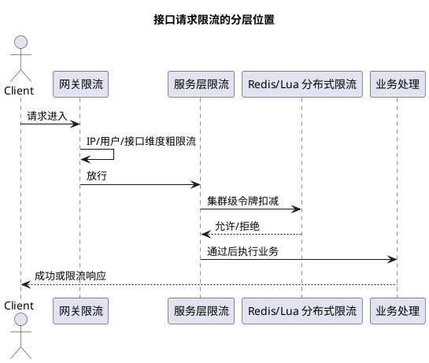

# 接口请求频率限制方案

## 问题索引

- Q1：接口请求频率限制有哪些方案，如何在业务中落地？

## Q1：接口请求频率限制有哪些方案，如何在业务中落地？

### 背景

接口请求频率限制，也就是限流，目的是保护系统在高并发、恶意刷接口、突发流量或下游变慢时不被打垮。

常见场景：

- 登录、短信验证码、注册接口防刷。
- 秒杀、抢券、报名接口抗峰值。
- Open API 按租户、应用、用户限额。
- 后台导出、批量查询等重接口保护数据库。
- 第三方接口调用限频，避免触发对方风控。

限流不是只返回 `Too Many Requests`，而是要回答三个问题：

```text
限制谁？按 IP、用户、租户、接口、商品、活动？
限制多少？每秒、每分钟、每天多少次？
超过后怎么办？拒绝、排队、降级、验证码、转异步？
```

### 限流维度


### PlantUML 示意图：多层限流位置



| 维度 | 适用场景 |
| --- | --- |
| IP | 防爬、防刷、未登录接口 |
| 用户 ID | 登录后接口、下单、抢券 |
| 手机号 | 短信验证码、登录注册 |
| 租户/应用 AppKey | Open API、SaaS 多租户 |
| 接口路径 | 保护重接口 |
| 商品/活动 ID | 秒杀、热点活动 |
| 全局系统 | 保护整体容量 |

生产上通常是多维度组合，例如：

```text
全局 QPS <= 10000
单接口 QPS <= 1000
单用户每分钟 <= 30
单 IP 每分钟 <= 300
单商品每秒 <= 500
```

### 常见算法

#### 1. 固定窗口计数器

思路：

```text
每个时间窗口内计数
窗口内超过阈值就拒绝
窗口结束后计数清零
```

例如：用户每分钟最多请求 60 次。

Redis 实现：

```text
key = rate:user:{userId}:202606281030
INCR key
EXPIRE key 60
```

优点：

- 简单。
- 性能好。
- 容易用 Redis 实现。

缺点：

- 有临界突刺问题。

例如：

```text
10:00:59 请求 60 次
10:01:00 请求 60 次
```

两秒内实际通过 120 次。

适合：

- 要求不高的后台接口。
- 日级、小时级配额。

#### 2. 滑动窗口计数器

思路：

把大窗口切成多个小窗口，通过滚动统计最近一段时间内的请求数。

例如 1 分钟切成 6 个 10 秒窗口：

```text
[10s][10s][10s][10s][10s][10s]
```

每次请求统计最近 6 个小窗口总和。

优点：

- 比固定窗口平滑。
- 能缓解边界突刺。

缺点：

- 实现更复杂。
- 小窗口越多，统计越精确，但存储和计算成本越高。

适合：

- 用户行为限频。
- Open API 限额。

#### 3. 滑动日志

思路：

记录每次请求时间戳，只保留最近一个窗口内的请求。

Redis ZSET 实现：

```text
ZREMRANGEBYSCORE key 0 now-window
ZCARD key
ZADD key now requestId
EXPIRE key window
```

优点：

- 非常精确。

缺点：

- 每次请求都要记录一条日志。
- 高 QPS 下内存和 CPU 成本高。

适合：

- 短窗口、低频、精确限流。
- 短信验证码、登录失败次数。

#### 4. 令牌桶

思路：

系统按固定速率往桶里放令牌，请求来了先拿令牌，拿到才能通过。

```text
令牌生成速率 = 100/s
桶容量 = 200
```

含义：

- 长期平均速率是 100 QPS。
- 短时间允许最多 200 的突发流量。

优点：

- 支持突发流量。
- 平滑控制平均速率。
- 常用于接口限流。

缺点：

- 实现比计数器复杂。
- 分布式场景需要 Redis/Lua 或限流组件。

适合：

- 网关限流。
- 秒杀入口。
- 接口 QPS 控制。

#### 5. 漏桶

思路：

请求先进桶，再按固定速率流出处理。

```text
入口可以突发
出口固定速率
桶满后新请求被拒绝
```

优点：

- 输出非常平滑。
- 保护下游效果好。

缺点：

- 对突发请求不如令牌桶友好。
- 可能增加等待延迟。

适合：

- 保护下游数据库、第三方接口。
- MQ 消费端限速。

### 单机限流

如果服务是单实例，或者只需要每个实例本地保护，可以用 Guava RateLimiter、Resilience4j、Sentinel 本地规则。

Java 示例：

```java
import com.google.common.util.concurrent.RateLimiter;

public class LocalRateLimitService {
    // 每秒生成 100 个令牌，适合保护当前实例的接口处理能力。
    private final RateLimiter rateLimiter = RateLimiter.create(100.0);

    public boolean tryAcquire() {
        // tryAcquire 不阻塞线程，拿不到令牌就快速失败，避免请求堆积。
        return rateLimiter.tryAcquire();
    }
}
```

优点：

- 不依赖外部组件。
- 性能高。
- 适合保护单个实例线程池和 CPU。

缺点：

- 多实例时总限流值会放大。

例如 10 个实例，每个实例限 100 QPS，总体就是 1000 QPS。

### Redis 分布式限流

多实例部署时，如果要做全局限流，需要集中计数，Redis 是常见选择。

#### 固定窗口 Lua

```lua
-- KEYS[1]：限流 Key，例如 rate:user:1001:sms
-- ARGV[1]：限制次数，例如 5
-- ARGV[2]：窗口秒数，例如 60

local current = redis.call('INCR', KEYS[1])

if current == 1 then
    -- 第一次请求时设置过期时间，避免 Key 永久存在。
    redis.call('EXPIRE', KEYS[1], ARGV[2])
end

if current > tonumber(ARGV[1]) then
    -- 超过阈值，拒绝请求。
    return 0
end

return 1
```

特点：

- 实现简单。
- 适合短信验证码、登录错误次数。
- 有窗口边界突刺问题。

#### 滑动日志 Lua

```lua
-- KEYS[1]：限流 Key
-- ARGV[1]：当前时间戳，毫秒
-- ARGV[2]：窗口大小，毫秒
-- ARGV[3]：最大请求数
-- ARGV[4]：本次请求唯一 ID

local now = tonumber(ARGV[1])
local window = tonumber(ARGV[2])
local limit = tonumber(ARGV[3])

-- 删除窗口外的旧请求，避免历史请求影响当前判断。
redis.call('ZREMRANGEBYSCORE', KEYS[1], 0, now - window)

local count = redis.call('ZCARD', KEYS[1])
if count >= limit then
    -- 最近窗口内请求数已经达到上限。
    return 0
end

-- 记录本次请求时间，ARGV[4] 用于避免同毫秒请求覆盖。
redis.call('ZADD', KEYS[1], now, ARGV[4])
redis.call('PEXPIRE', KEYS[1], window)
return 1
```

特点：

- 精确。
- 适合低频关键接口。
- 高 QPS 下成本较高。

### 网关限流

网关层适合做第一道防线。

可做：

- IP 限流。
- 用户限流。
- 路由限流。
- 租户限流。
- 秒杀活动限流。
- 黑白名单。
- 动态规则下发。

常见组件：

- Nginx `limit_req`。
- Spring Cloud Gateway + RedisRateLimiter。
- Sentinel Gateway。
- APISIX / Kong / Envoy。

网关限流优点：

- 流量还没进入业务服务就被拦截。
- 能保护整个后端集群。
- 规则集中管理。

缺点：

- 很难做复杂业务判断。
- 业务级限购、库存校验仍要在服务层做。

### 服务层限流

服务层更适合做业务维度限流。

例如：

- 用户每分钟最多抢券 3 次。
- 同一商品每秒最多放行 500 次。
- 同一租户每秒最多调用报表接口 20 次。
- 某个重查询接口并发最多 10 个。

服务层限流可以结合：

- Sentinel 资源名。
- Redis Lua。
- 本地 Caffeine + Redis 双层限流。
- ThreadPoolExecutor 队列长度。
- Semaphore 并发隔离。

### 限流后的处理策略

超过限制后，不一定都直接拒绝。

| 策略 | 适用场景 |
| --- | --- |
| 直接拒绝 | 秒杀售罄、防刷、非核心请求 |
| 排队等待 | 下单、导出、批处理 |
| 返回排队中 | 秒杀异步确认 |
| 验证码升级 | 登录、短信、防刷 |
| 降级数据 | 首页、推荐、统计 |
| 转异步任务 | 报表导出、批量处理 |

HTTP 接口通常返回：

```text
429 Too Many Requests
```

响应内容要可解释，例如：

```json
{
  "code": "TOO_MANY_REQUESTS",
  "message": "请求太频繁，请稍后再试"
}
```

### 推荐落地方案

#### 普通业务系统

```text
Nginx / Gateway 做 IP、路由级限流
业务服务用 Sentinel 做接口级 QPS 和并发控制
Redis Lua 做用户、手机号、租户维度限流
重接口用信号量或线程池隔离
```

#### 秒杀系统

```text
CDN 静态化
网关按 IP/用户/活动限流
服务层本地售罄标记快速失败
Redis Lua 原子扣库存和限购
MQ 异步削峰
DB 唯一索引兜底
```

#### Open API 平台

```text
按 AppKey / 租户 / 接口配置配额
Redis 滑动窗口或令牌桶做分布式限流
返回剩余额度和重试时间
后台提供配额配置和审计日志
```

### 监控指标

限流必须可观测。

重点指标：

- 每个接口 QPS。
- 限流通过数、拒绝数。
- 429 响应比例。
- Redis 限流脚本耗时。
- Sentinel Block QPS。
- 网关限流命中数。
- 单用户、单 IP 异常请求排行。
- 下游 DB/MQ/第三方接口耗时。

如果限流命中突然升高，要判断是：

- 正常业务峰值。
- 恶意刷接口。
- 前端重试风暴。
- 下游变慢导致请求堆积。
- 限流阈值配置过低。

### 踩坑点

#### 1. 只做单机限流，忽略集群放大

单实例 100 QPS，20 个实例就是 2000 QPS。如果目标是全局 1000 QPS，需要网关或 Redis 分布式限流。

#### 2. 限流 Key 粒度太粗

只按接口限流，可能误伤正常用户；只按用户限流，又可能挡不住大量匿名 IP。

要按业务组合：

```text
IP + 用户 + 接口 + 活动 + 租户
```

#### 3. Redis 成为瓶颈

所有请求都打 Redis 做限流，Redis 也会成为热点。

优化：

- 本地限流先挡一层。
- 热点 Key 拆分。
- 对低价值请求在网关拒绝。
- 只对关键接口做精确分布式限流。

#### 4. 限流后疯狂重试

如果客户端收到限流后立刻重试，会形成重试风暴。

建议：

- 返回明确错误码。
- 返回 `Retry-After`。
- 客户端指数退避。
- 网关识别重试流量并加严限流。

#### 5. 限流和熔断混淆

限流是主动控制进入系统的流量；熔断是依赖异常时快速失败。

两者经常一起用，但触发条件不同。

### 面试话术

> 接口请求频率限制要先明确限流对象、限流算法和超限处理。对象可以是 IP、用户、租户、接口、商品或活动；算法常见有固定窗口、滑动窗口、滑动日志、令牌桶和漏桶。固定窗口简单但有边界突刺；滑动窗口更平滑；滑动日志精确但成本高；令牌桶适合允许一定突发的接口限流；漏桶适合保护下游平滑处理。落地上通常是网关做 IP、路由、租户级第一道限流，服务层用 Sentinel 或本地限流保护实例，再用 Redis Lua 做用户、手机号、活动等分布式业务限流。超过限制后可以拒绝、排队、降级、验证码升级或转异步。生产上还要监控限流命中、429 比例、Redis 脚本耗时和下游压力，避免限流本身变成瓶颈。

## 高频追问

- Q：固定窗口有什么问题？
  A：有临界突刺问题。比如每分钟限制 60 次，用户可以在上一分钟最后 1 秒请求 60 次，下一分钟第一秒再请求 60 次，短时间内实际通过 120 次。

- Q：令牌桶和漏桶有什么区别？
  A：令牌桶按固定速率生成令牌，桶里有令牌时允许突发；漏桶按固定速率流出请求，输出更平滑，更适合保护下游。

- Q：为什么需要分布式限流？
  A：多实例部署时，本地限流只能限制单实例流量，总流量会随实例数放大。需要网关或 Redis 这类集中限流来控制全局额度。

- Q：Redis 限流挂了怎么办？
  A：要看接口重要性。核心写接口通常失败关闭或降级为较小本地限流；低风险读接口可以短时间降级为本地限流。不能无脑放开，否则可能打垮后端。

- Q：限流和降级、熔断是什么关系？
  A：限流控制入口流量，降级减少非核心能力，熔断在依赖异常时快速失败。高并发系统通常三者组合使用。

## 复习清单

- [ ] 能区分固定窗口、滑动窗口、滑动日志、令牌桶、漏桶。
- [ ] 能说明网关限流、本地限流、Redis 分布式限流分别适合什么场景。
- [ ] 能写出 Redis 固定窗口或滑动日志限流的核心逻辑。
- [ ] 能说明限流 Key 应该按 IP、用户、接口、租户、活动等组合设计。
- [ ] 能回答限流后应该拒绝、排队、降级还是转异步。
- [ ] 能说明 Redis 限流成为热点或故障时怎么处理。

