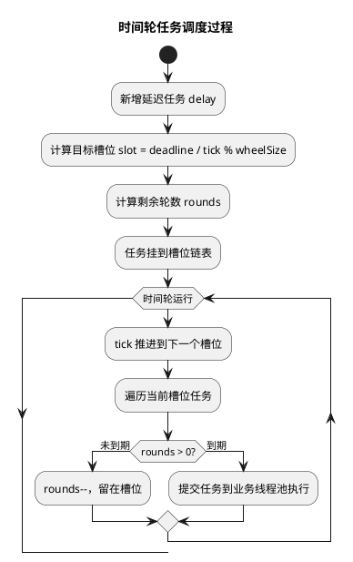

# 时间轮详解

## 问题索引

- Q1：时间轮是什么？底层结构和运行过程是怎样的？

## Q1：时间轮是什么？底层结构和运行过程是怎样的？

### 背景

时间轮是一种高性能定时任务调度数据结构，常用于处理大量延迟任务，例如：

- 订单 15 分钟未支付自动取消。
- MQ 延迟消息。
- Netty 连接超时检测。
- 心跳超时剔除。
- 本地缓存过期。
- 限时活动状态切换。

如果每个定时任务都交给普通优先队列或线程池调度，当任务量很大时，插入、删除、触发成本会明显上升。时间轮的目标是：**用近似 O(1) 的方式管理大量定时任务**。

### 核心思想

可以把时间轮想成一个钟表。

```text
slot 0 -> slot 1 -> slot 2 -> ... -> slot 59
   ^                             |
   |_____________________________|
```

每个格子叫一个槽位 `slot`，每个槽位挂一批到期时间相近的任务。

关键参数：

| 参数 | 含义 |
| --- | --- |
| `tick` | 指针每次前进的时间间隔，例如 1 秒 |
| `wheelSize` | 槽位数量，例如 60 个 |
| `interval` | 一圈覆盖的时间，`tick * wheelSize` |
| `currentTick` | 当前指针位置 |
| `slot` | 存放任务的桶，通常是链表 |

例如：

```text
tick = 1s
wheelSize = 60
interval = 60s
```

一个 10 秒后执行的任务，会被放到当前指针往后数 10 格的位置。

### 单层时间轮结构

单层时间轮通常包含：

```text
TimeWheel
  - tickMs
  - wheelSize
  - currentTick
  - buckets[]

Bucket
  - task linked list

TimerTask
  - expireTime
  - remainingRounds
  - payload
```

如果延迟时间超过一圈，例如 `tick = 1s`、`wheelSize = 60`，任务 130 秒后执行：

```text
slot = (currentIndex + 130) % 60
remainingRounds = 130 / 60 = 2
```

指针每次走到该槽位时，先让 `remainingRounds--`。只有当 `remainingRounds == 0` 且任务到期时才执行。

### 运行过程


### PlantUML 示意图：时间轮 tick 与槽位推进



#### 添加任务

假设当前指针在 `slot 0`，新增一个 8 秒后执行的任务。

```text
targetSlot = (currentSlot + delay / tick) % wheelSize
```

如果：

```text
tick = 1s
wheelSize = 60
delay = 8s
```

则：

```text
targetSlot = (0 + 8) % 60 = 8
```

任务会被挂到 `slot 8`。

#### 推进指针

后台线程每隔一个 `tick` 推进一格：

```text
slot 0 -> slot 1 -> slot 2 -> ... -> slot 8
```

当指针走到 `slot 8`：

- 取出槽位中的任务。
- 判断是否真正到期。
- 到期则提交执行。
- 未到期则重新放回合适槽位。

### 为什么时间轮性能高

普通延迟任务常用小顶堆或优先队列：

| 操作 | 小顶堆 | 时间轮 |
| --- | --- | --- |
| 添加任务 | O(logN) | 接近 O(1) |
| 删除任务 | O(logN) 或 O(N) | 通常 O(1)，如果有任务节点引用 |
| 到期扫描 | 取堆顶 O(logN) | 只扫描当前槽位 |
| 适合场景 | 精确、任务量中等 | 海量、允许 tick 级误差 |

时间轮的高性能来自两个点：

- 不对所有任务全局排序，只按时间片分桶。
- 每次 tick 只处理当前槽位，不扫描全部任务。

### 精度问题

时间轮不是绝对精确定时器，它的精度取决于 `tick`。

例如：

```text
tick = 1s
```

任务可能有接近 1 秒的调度误差。

如果想更精确：

- 减小 `tick`，例如 100ms。
- 但 tick 越小，指针推进越频繁，CPU 开销越高。

所以时间轮设计要在精度和性能之间取舍：

| 场景 | 建议 |
| --- | --- |
| 订单 15 分钟超时 | 秒级 tick 足够 |
| 心跳超时 | 100ms 到秒级都可以，看业务要求 |
| 金融撮合、严格定时 | 不适合只靠普通时间轮 |

### 分层时间轮

单层时间轮处理超长延迟时，要么 `wheelSize` 很大，要么 `remainingRounds` 很大。分层时间轮可以更优雅地解决长时间跨度。

类似钟表：

```text
毫秒轮 -> 秒轮 -> 分钟轮 -> 小时轮
```

例如：

```text
第 1 层：tick = 1s，60 个槽，覆盖 1 分钟
第 2 层：tick = 1min，60 个槽，覆盖 1 小时
第 3 层：tick = 1h，24 个槽，覆盖 1 天
```

一个 2 小时后的任务，先放到小时轮。等小时轮推进到对应槽位，再把任务降级放入分钟轮；分钟轮到期后再降级到秒轮。

这个过程叫：

```text
cascade，任务下沉或降级
```

分层时间轮的优点：

- 支持很长延迟。
- 不需要特别大的单层数组。
- 每一层都保持较小槽位数。

缺点：

- 实现复杂。
- 跨层迁移时会产生一批任务移动。
- 到期精度仍然受最底层 tick 影响。

### Netty 的 HashedWheelTimer

Netty 的 `HashedWheelTimer` 是经典单层时间轮实现。

特点：

- 用数组表示槽位。
- 每个槽位是任务链表。
- 用 `remainingRounds` 表示还要转几圈。
- 一个 worker 线程推进时间轮。

适合：

- 连接超时。
- 请求超时。
- 心跳检测。

不适合：

- 作为海量持久化订单延迟任务的唯一方案。
- 对精确时间要求极高的任务。

### Kafka 延迟操作里的时间轮思想

Kafka 内部有延迟操作管理，例如延迟生产、延迟拉取等。它使用时间轮结合队列触发过期任务。

核心思路：

- 时间轮负责按过期时间分桶。
- bucket 到期后进入延迟队列。
- 后台线程取出到期 bucket，执行或重新入轮。

这种方式避免每个任务都直接进入全局优先队列，降低大量延迟操作的管理成本。

### 简化版 Java 实现

下面是一个帮助理解的简化版单层时间轮，真实生产实现还要处理并发安全、取消任务、线程关闭、异常隔离和时间漂移。

```java
import java.util.Iterator;
import java.util.LinkedList;
import java.util.List;

public class SimpleTimeWheel {
    // 每个槽位代表的时间长度，单位毫秒。
    private final long tickMs;

    // 时间轮槽位数量，决定一圈能覆盖多长时间。
    private final int wheelSize;

    // 每个槽位存放一批延迟任务，这里用链表方便删除和遍历。
    private final List<TimerTask>[] buckets;

    // 当前指针所在槽位。
    private int currentSlot = 0;

    @SuppressWarnings("unchecked")
    public SimpleTimeWheel(long tickMs, int wheelSize) {
        this.tickMs = tickMs;
        this.wheelSize = wheelSize;
        this.buckets = new List[wheelSize];

        for (int i = 0; i < wheelSize; i++) {
            buckets[i] = new LinkedList<>();
        }
    }

    public void addTask(Runnable command, long delayMs) {
        long ticks = Math.max(1, delayMs / tickMs);

        // 计算任务应该落在哪个槽位。
        int slot = (int) ((currentSlot + ticks) % wheelSize);

        // 如果延迟超过一圈，需要记录还要等待几轮。
        long remainingRounds = ticks / wheelSize;

        TimerTask task = new TimerTask(command, remainingRounds);
        buckets[slot].add(task);
    }

    public void advanceClock() {
        // 指针向前走一格。
        currentSlot = (currentSlot + 1) % wheelSize;

        List<TimerTask> bucket = buckets[currentSlot];
        Iterator<TimerTask> iterator = bucket.iterator();

        while (iterator.hasNext()) {
            TimerTask task = iterator.next();

            if (task.remainingRounds > 0) {
                // 任务还没到本圈执行时间，只减少剩余圈数。
                task.remainingRounds--;
                continue;
            }

            // 到期任务从槽位删除，再执行，避免重复触发。
            iterator.remove();
            task.command.run();
        }
    }

    private static class TimerTask {
        private final Runnable command;
        private long remainingRounds;

        private TimerTask(Runnable command, long remainingRounds) {
            this.command = command;
            this.remainingRounds = remainingRounds;
        }
    }
}
```

注意：

- 这个示例只用于理解结构。
- 真实生产不能直接用这个版本，因为没有处理线程安全和任务取消。
- 如果任务执行很慢，不能直接在时间轮推进线程里执行业务，应提交到业务线程池。

### 业务场景

#### 订单过期取消

时间轮可以用来触发订单过期检查：

```text
创建订单 -> 挂入时间轮 -> 到期触发取消检查
```

但订单过期取消不能只依赖内存时间轮。

推荐：

```text
DB 记录 expire_time
MQ 延迟消息或时间轮触发
状态机条件更新
定时扫描补偿
```

原因：

- 应用重启会丢内存任务。
- 多实例部署需要任务分片和归属。
- 订单取消必须可靠，不能只靠内存调度。

#### 心跳超时检测

每次收到客户端心跳，就刷新一个超时任务。

```text
客户端 A 30 秒内无心跳 -> 断开连接或标记离线
```

时间轮适合这种场景，因为：

- 任务量大。
- 精度要求不是毫秒级。
- 超时任务可以重复刷新或取消。

#### MQ 延迟任务

MQ 可以用时间轮管理延迟消息：

```text
消息写入延迟队列
根据投递时间挂入时间轮
到期后转入可消费队列
消费者正常拉取
```

这里必须配合持久化，防止 Broker 重启后延迟消息丢失。

### 踩坑点

#### 1. 时间轮不等于可靠任务系统

时间轮只是调度数据结构，不天然保证任务可靠。

如果用于订单、支付、库存等关键业务，必须配合：

- 数据库存储任务状态。
- MQ 或任务表持久化。
- 幂等处理。
- 补偿扫描。

#### 2. 不要在 tick 线程里执行慢任务

如果直接在推进线程执行慢业务：

```text
当前槽位任务执行慢
  -> 指针推进延迟
  -> 后续任务全部延迟
```

正确方式：

```text
时间轮线程只负责发现到期任务
到期任务提交到业务线程池执行
```

#### 3. tick 太小会增加 CPU 开销

`tick = 1ms` 看起来精度高，但指针每毫秒推进一次，空转成本高。

要根据业务选择：

- 订单过期：1s 甚至 5s 可以接受。
- 心跳检测：100ms 到 1s。
- 请求超时：根据 SLA 设置。

#### 4. 单层时间轮不适合特别长延迟

如果要支持几天后的任务，单层时间轮会遇到：

- 槽位数组很大。
- `remainingRounds` 很大。
- 管理复杂。

更适合分层时间轮或持久化调度系统。

#### 5. 系统时间变化会影响调度

时间轮推进最好基于单调时间，例如 Java 的 `System.nanoTime()`，避免系统时间回拨导致调度异常。

业务判断到期时间时，再使用业务时间戳和数据库时间。

### 面试话术

> 时间轮是一种用于大量延迟任务调度的数据结构，可以理解成一个环形数组，每个槽位挂一批到期时间相近的任务。指针每隔一个 tick 前进一格，只处理当前槽位的任务，因此添加和触发任务的成本接近 O(1)。如果任务延迟超过一圈，可以用 remainingRounds 表示还要转几圈；如果要支持很长延迟，可以用分层时间轮，类似秒轮、分钟轮、小时轮逐层下沉。时间轮适合订单超时检查、连接超时、心跳检测、MQ 延迟任务等场景，但它只是调度结构，不天然保证可靠性。关键业务必须配合 DB/MQ 持久化、幂等和补偿扫描，并且不能在时间轮推进线程里执行慢业务。

## 高频追问

- Q：时间轮和延迟队列有什么区别？
  A：延迟队列通常基于优先队列或堆，需要按到期时间排序，插入复杂度一般是 O(logN)。时间轮按时间片分桶，不做全局排序，添加任务接近 O(1)，更适合海量延迟任务，但精度受 tick 影响。

- Q：时间轮为什么不是精确定时？
  A：任务按 tick 分桶，只有指针推进到对应槽位才会检查执行，所以误差通常在一个 tick 范围内。如果 tick 是 1 秒，任务就可能存在接近 1 秒的调度误差。

- Q：什么是分层时间轮？
  A：分层时间轮用多个不同粒度的轮管理长延迟任务，例如秒轮、分钟轮、小时轮。长延迟任务先放在高层轮，到期接近时再下沉到低层轮。

- Q：为什么订单过期取消不能只用内存时间轮？
  A：内存时间轮重启会丢任务，多实例下还有任务归属问题。订单取消是关键业务，必须有 DB 过期时间、状态机条件更新、MQ 或任务表持久化、补偿扫描兜底。

- Q：时间轮线程为什么不能直接执行业务？
  A：慢业务会阻塞指针推进，导致整个时间轮延迟。时间轮线程应只负责取出到期任务，再提交到业务线程池执行。

## 复习清单

- [ ] 能画出环形数组 + 槽位链表的时间轮结构。
- [ ] 能说明 `tick`、`wheelSize`、`currentSlot`、`remainingRounds` 的作用。
- [ ] 能解释添加任务、推进指针、触发任务的流程。
- [ ] 能对比时间轮和延迟队列的复杂度与适用场景。
- [ ] 能说明单层时间轮和分层时间轮的区别。
- [ ] 能结合订单过期取消说明时间轮为什么要配合持久化、幂等和补偿。

