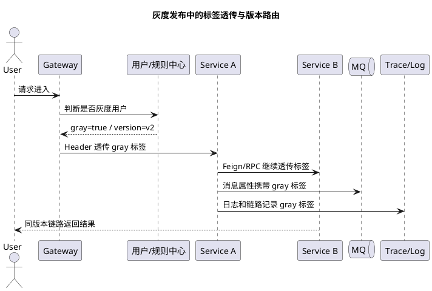

# 灰度发布架构分析

## 问题索引

- Q1：从架构角度分析，灰度发布能解决哪些业务场景问题，又需要关注哪些可能产生的问题？
- Q2：灰度发布中如何实现流量染色和标签透传，让网关、Feign、MQ、日志、链路追踪都能识别同一批灰度用户？
- Q3：数据库（SQL/NoSQL）、MQ 如何做灰度发布？

## Q1：从架构角度分析，灰度发布能解决哪些业务场景问题，又需要关注哪些可能产生的问题？

### 背景

灰度发布是把新版本先开放给一小部分用户、流量、门店、租户或内部账号，确认稳定后再逐步扩大范围的发布策略。

它解决的核心问题不是“如何把代码发上去”，而是：**如何在真实生产环境里验证新版本，同时把故障影响面控制在可接受范围内**。

从架构角度看，灰度发布涉及：

- 流量路由。
- 服务版本共存。
- 数据兼容。
- 缓存兼容。
- MQ 消息兼容。
- 监控告警。
- 快速回滚。
- 用户体验一致性。

### 灰度发布能解决哪些业务场景问题

#### 1. 降低新版本发布风险

一次全量发布如果出现问题，会影响所有用户。灰度发布可以先让 1%、5%、10% 的流量进入新版本，观察错误率、接口耗时、业务转化、订单失败率等指标。

适用场景：

- 核心下单链路改造。
- 支付回调逻辑升级。
- 库存扣减策略调整。
- 会员权益计算规则变更。
- 推荐、搜索、营销策略升级。

灰度价值：

- 问题只影响少量用户。
- 可以快速切回旧版本。
- 线上真实流量比测试环境更能暴露问题。

#### 2. 支持不同用户群体逐步开放

有些功能不是所有用户同时可见，而是按用户、租户、区域、门店、角色逐步开放。

例如：

- 先给内部员工开放。
- 再给某个城市、某个经销商、某个学校开放。
- 最后逐步全量。

这类场景通常需要按业务维度灰度，而不只是按随机流量百分比。

常见灰度维度：

| 维度 | 示例 |
| --- | --- |
| 用户 | userId 白名单、会员等级 |
| 租户 | tenantId、企业 ID |
| 区域 | province、city |
| 门店 | storeId、dealerId |
| 角色 | admin、teacher、sales |
| 设备 | appVersion、deviceType |

#### 3. 做真实生产环境验证

测试环境和预发环境很难完全模拟生产：

- 数据量不同。
- 用户行为不同。
- 第三方接口真实延迟不同。
- 缓存命中率不同。
- 并发压力不同。
- 历史脏数据不同。

灰度发布可以让新版本在可控范围内接触真实流量，验证：

- SQL 是否变慢。
- 新缓存 Key 是否正确。
- MQ 消费是否兼容老消息。
- 第三方接口参数是否符合真实要求。
- 业务状态机是否覆盖历史异常状态。

#### 4. 支持 A/B 实验和策略验证

灰度发布可以用于技术发布，也可以用于业务策略实验。

例如：

- 搜索排序策略 A/B。
- 优惠券推荐策略 A/B。
- 页面改版转化率验证。
- AI 问答召回策略对比。
- 风控规则命中率对比。

注意：A/B 实验更关注业务指标差异，灰度发布更关注风险控制。两者可以共用流量分组能力，但目标不同。

#### 5. 支持复杂系统的平滑升级

微服务系统中，一个功能可能涉及前端、网关、多个后端服务、数据库、缓存、MQ、搜索索引。如果全量同步升级，风险很高。

灰度可以让新旧版本共存：

```text
用户 A -> 网关 -> v1 服务链路
用户 B -> 网关 -> v2 服务链路
```

这样可以逐步验证服务间协议、数据库兼容、消息兼容和下游调用。

### 常见灰度发布方式

#### 1. 按流量比例灰度

例如 1%、5%、10%、50%、100%。

适合：

- 无明显用户分组要求。
- 接口无强会话粘性。
- 目标是快速观察错误率和性能指标。

风险：

- 同一个用户多次请求可能被路由到不同版本。
- 如果新旧版本数据或页面不兼容，体验可能不一致。

#### 2. 按用户或租户灰度

根据 `userId`、`tenantId`、`dealerId` 做一致性路由。

适合：

- SaaS 多租户系统。
- CRM、ERP、学校系统、门店系统。
- 需要完整业务闭环验证的场景。

优点：

- 同一个用户或租户稳定命中新版本。
- 更容易观察业务闭环。

#### 3. 按地域或门店灰度

先开放某个城市、门店、经销商。

适合：

- 线下业务。
- 区域运营。
- 需要业务人员配合验证。

#### 4. 特性开关

代码已经发布，但功能是否生效由配置控制。

适合：

- 快速开关功能。
- 同一版本中按用户开放功能。
- 避免频繁重新发版。

注意：特性开关要治理，否则会积累大量历史开关，增加代码复杂度。

### 需要重点关注哪些问题

#### 1. 流量路由一致性

灰度不能只做“随机打一部分流量”。很多业务需要同一个用户在一段时间内稳定访问同一个版本。

否则会出现：

- 第一次请求走 v2 创建了新格式数据。
- 第二次请求走 v1，v1 不认识新格式。
- 页面 A 是新版本，页面 B 是旧版本，体验割裂。

解决：

- 按 `userId` / `tenantId` 哈希路由。
- 网关写入灰度标识。
- 下游服务透传灰度标签。
- 对需要会话一致性的请求做粘性路由。

#### 2. 服务链路版本一致性

微服务里不能只灰度入口服务。如果入口服务 v2 调用了下游 v1，而接口协议已经变化，就会失败。

解决：

- 灰度标签从网关透传到整个链路。
- 服务发现支持版本标签，例如 `version=v1/v2`。
- OpenFeign / Dubbo / Gateway 根据灰度标签选择实例。
- 新旧接口保持兼容，避免强依赖同发。

#### 3. 数据库兼容

数据库是新旧版本共享的，最容易出问题。

常见问题：

- 新版本写入新字段，旧版本读不懂。
- 新版本修改字段含义，旧版本按老语义处理。
- 发布时删除字段，旧版本还在使用。
- DDL 变更锁表或影响性能。

推荐策略：

```text
先加字段 -> 新旧代码都兼容 -> 灰度新代码 -> 全量验证 -> 再清理旧字段
```

不要在灰度发布中做“代码和数据库破坏性变更同时上线”。

#### 4. MQ 消息兼容

灰度期间新旧生产者、消费者可能同时存在。

风险：

- v2 生产者发新格式消息，v1 消费者解析失败。
- v1 老消息堆积，v2 消费者不兼容。
- 新增必填字段导致老消息业务校验失败。
- 枚举和字段类型变更导致反序列化失败。

解决：

- 消息加 `version`。
- 消费者先兼容 v1/v2，再灰度生产者。
- 不直接修改字段类型，新增字段替代旧字段。
- 保留死信原文，支持转换后重放。
- 消费端始终做幂等和状态机校验。

#### 5. 缓存兼容

灰度期间新旧版本可能共享 Redis Key。

风险：

- v2 写入新结构缓存，v1 反序列化失败。
- 新旧版本使用同一个 Key，但语义不同。
- 缓存污染导致回滚后旧版本读取异常。

解决：

- 新旧结构不兼容时使用不同 Key 前缀。
- 缓存 Value 加版本字段。
- 灰度完成后再清理旧缓存。
- 回滚预案中包含缓存清理或降级策略。

#### 6. 回滚是否真的可行

很多系统以为可以回滚代码，但忽略了数据已经被新版本写坏。

回滚要关注：

- 数据结构是否兼容旧版本。
- MQ 中是否已有新格式消息。
- 缓存是否被新版本污染。
- 第三方系统是否已经收到新请求。
- 是否需要补偿脚本或数据修复。

真正的灰度回滚应该包括：

```text
停止新流量 -> 切回旧版本 -> 暂停或兼容处理新格式消息 -> 清理/兼容缓存 -> 修复已写入数据 -> 观察指标恢复
```

#### 7. 监控指标要按版本区分

灰度发布最怕“整体指标正常，但灰度用户已经异常”。

必须按版本、灰度标识、用户群体维度观察：

- 接口错误率。
- P95 / P99 延迟。
- 订单成功率。
- 支付成功率。
- MQ 堆积和死信数。
- DB 慢 SQL。
- JVM GC。
- 日志异常 TopN。

例如 Prometheus 标签：

```text
service="order-service", version="v2", gray="true"
```

#### 8. 特性开关治理

特性开关如果没有生命周期管理，会变成长期技术债。

问题：

- 代码里堆满 `if gray`。
- 开关含义没人记得。
- 多个开关组合出未知状态。
- 测试覆盖困难。

建议：

- 每个开关有负责人、创建时间、过期时间。
- 灰度结束后及时删除开关。
- 核心开关支持审计和操作日志。
- 开关配置变更需要权限控制。

### 架构落地方案


### PlantUML 示意图：灰度流量染色与版本路由



一个完整灰度发布链路通常包括：

```text
配置中心/灰度平台
        ↓
网关识别用户、租户、版本、地域
        ↓
写入灰度标签到 Header / Context
        ↓
服务发现按 version / gray 标签路由
        ↓
服务内部按特性开关执行新逻辑
        ↓
监控按 version / gray 聚合指标
        ↓
异常时自动或人工切回旧版本
```

核心能力：

- 灰度规则配置。
- 流量染色。
- 标签透传。
- 版本路由。
- 指标隔离。
- 快速回滚。
- 审计和变更记录。

### 灰度发布、蓝绿发布、金丝雀发布的区别

| 方式 | 核心思路 | 适用场景 |
| --- | --- | --- |
| 蓝绿发布 | 两套完整环境，流量整体从蓝切到绿 | 环境资源充足，要求快速整体切换 |
| 金丝雀发布 | 少量流量先进入新版本，再逐步扩大 | 控制故障影响面，常见于服务发布 |
| 灰度发布 | 按用户、租户、区域、比例、特性开关逐步开放 | 更强调业务维度和精细化控制 |

实际项目里，金丝雀发布常被看作灰度发布的一种流量比例形式。

### 面试话术

> 从架构角度看，灰度发布解决的是生产环境新版本风险控制问题。它可以把新功能、新接口、新策略先开放给少量用户、租户、门店或流量，验证真实业务数据、性能、稳定性和用户反馈，避免一次全量发布导致大面积故障。它也适合做 A/B 实验、区域试点、复杂微服务链路平滑升级。
>
> 但灰度不是简单按比例切流量。架构上要重点关注流量路由一致性、服务链路版本一致性、数据库兼容、MQ 消息兼容、缓存兼容、可回滚性、按版本隔离监控和特性开关治理。尤其要避免新版本写入的数据、缓存、消息让旧版本无法处理，否则代码能回滚，业务状态也回不去。一个完整灰度体系应该包含灰度规则配置、流量染色、标签透传、版本路由、监控告警和快速回滚能力。

### 高频追问

- Q：灰度发布和蓝绿发布有什么区别？
  A：蓝绿更像两套环境整体切换，强调快速切流和快速回滚；灰度更强调按用户、流量、租户、地域等维度逐步放量，控制影响范围。

- Q：灰度发布是不是只要网关按比例转发就行？
  A：不够。很多业务需要用户或租户维度的一致性路由，还要保证灰度标签在下游服务链路中透传，否则入口进了 v2，下游却调到 v1，仍然可能出问题。

- Q：数据库变更怎么支持灰度？
  A：遵循兼容性变更。先加字段，新旧代码都能运行；灰度新代码并验证；全量稳定后再清理旧字段。不要代码和破坏性 DDL 同时上线。

- Q：灰度期间 MQ 怎么处理？
  A：消息要带版本号，消费者先兼容老版本和新版本，再灰度生产者。老消息可能还在队列里，所以不能只让消费者支持新格式。

- Q：灰度发布如何判断是否继续放量？
  A：看按版本隔离的指标，例如错误率、P95/P99、订单成功率、支付成功率、MQ 死信、慢 SQL、GC、日志异常。如果灰度版本指标异常，暂停放量或回滚。

### 复习清单

- [ ] 能说明灰度发布解决的是生产风险控制和真实流量验证问题。
- [ ] 能区分按比例、用户、租户、地域、特性开关灰度。
- [ ] 能说清灰度发布中的数据库、MQ、缓存兼容风险。
- [ ] 能说明为什么回滚不只是代码回滚，还包括数据、消息、缓存处理。
- [ ] 能讲清灰度标签透传和服务版本路由。
- [ ] 能用指标说明灰度是否可以继续放量。

## Q2：灰度发布中如何实现流量染色和标签透传，让网关、Feign、MQ、日志、链路追踪都能识别同一批灰度用户？

### 背景

灰度发布真正难的不是“网关把一部分流量转到 v2”，而是让整条调用链都知道：**这次请求属于灰度流量**。

如果只在入口网关做灰度，后续服务不知道灰度标签，就会出现：

```text
网关 -> order-service v2
order-service -> inventory-service v1
order-service -> MQ 消息没有灰度标识
consumer -> 不知道按灰度逻辑消费
日志 / Trace -> 无法按灰度用户筛选问题
```

所以需要统一的“流量染色 + 标签透传”机制。

### 核心思路

完整链路可以抽象为：

```text
灰度规则
  -> 网关识别用户/租户/设备/地域
  -> 生成灰度标签 GrayContext
  -> HTTP Header 透传
  -> Feign / RPC 拦截器继续透传
  -> MQ Message Properties 透传
  -> 日志 MDC 写入 gray 标签
  -> Trace baggage / span tag 写入 gray 标签
  -> 监控指标按 gray/version 聚合
```

核心原则：

- 灰度标签只在可信入口生成，不要让外部用户随便伪造。
- 标签字段统一命名，避免每个服务各写一套。
- 同一个用户、租户或业务单号要稳定命中同一灰度策略。
- 异步链路也要透传，比如 MQ、定时任务、异步线程池。

### 灰度标签设计

建议定义统一 Header：

| 字段 | 含义 |
| --- | --- |
| `X-Gray` | 是否灰度流量，例如 `true/false` |
| `X-Gray-Version` | 目标版本，例如 `v2` |
| `X-Gray-Rule` | 命中的灰度规则 ID |
| `X-Tenant-Id` | 租户 ID |
| `X-User-Id` | 用户 ID |
| `X-Request-Id` | 请求 ID |

在服务内部可以封装成 `GrayContext`：

```java
public class GrayContext {
    private final boolean gray;
    private final String grayVersion;
    private final String grayRule;
    private final String tenantId;
    private final String userId;
    private final String requestId;

    // 构造器省略；实际项目中建议提供不可变对象，避免中途被业务代码随意修改。
}
```

### 网关入口染色

网关负责根据灰度规则判断当前请求是否进入灰度。

规则来源可以是：

- 配置中心。
- 灰度平台。
- 数据库灰度规则表。
- Nacos / Apollo / 配置服务。

判断维度：

- `userId` 白名单。
- `tenantId` 白名单。
- `appVersion`。
- `city` / `dealerId`。
- 哈希百分比。

示例逻辑：

```java
public class GrayGatewayFilter {
    public ServerHttpRequest filter(ServerHttpRequest request) {
        String userId = request.getHeaders().getFirst("X-User-Id");
        String tenantId = request.getHeaders().getFirst("X-Tenant-Id");

        // 1. 网关从可信身份信息中判断灰度，不直接相信外部传入的 X-Gray
        GrayDecision decision = grayRuleService.match(userId, tenantId);

        // 2. 将灰度结果写入 Header，供下游服务继续透传
        return request.mutate()
            .header("X-Gray", String.valueOf(decision.isGray()))
            .header("X-Gray-Version", decision.getVersion())
            .header("X-Gray-Rule", decision.getRuleId())
            .build();
    }
}
```

注意：外部请求携带的 `X-Gray` 不应直接信任。通常由网关重新计算并覆盖，避免用户伪造灰度标签访问未开放功能。

### Feign / HTTP 透传

下游 HTTP 调用需要通过拦截器把灰度 Header 带过去。

```java
@Component
public class GrayFeignInterceptor implements RequestInterceptor {
    @Override
    public void apply(RequestTemplate template) {
        GrayContext context = GrayContextHolder.get();
        if (context == null) {
            return;
        }

        // 1. Feign 调用下游服务时继续透传灰度标签，保证服务链路版本一致。
        template.header("X-Gray", String.valueOf(context.isGray()));
        template.header("X-Gray-Version", context.getGrayVersion());
        template.header("X-Gray-Rule", context.getGrayRule());
        template.header("X-Tenant-Id", context.getTenantId());
        template.header("X-User-Id", context.getUserId());
        template.header("X-Request-Id", context.getRequestId());
    }
}
```

服务端再用过滤器从 Header 还原 `GrayContext`：

```java
public class GrayContextFilter implements Filter {
    @Override
    public void doFilter(ServletRequest req, ServletResponse resp, FilterChain chain) {
        HttpServletRequest request = (HttpServletRequest) req;
        try {
            // 1. 从 Header 中恢复灰度上下文，后续路由、日志、指标都从这里读取。
            GrayContext context = GrayContext.fromHeaders(request);
            GrayContextHolder.set(context);

            // 2. 写入 MDC，保证日志里可以按 grayVersion / grayRule 检索。
            MDC.put("gray", String.valueOf(context.isGray()));
            MDC.put("grayVersion", context.getGrayVersion());
            MDC.put("grayRule", context.getGrayRule());
            MDC.put("requestId", context.getRequestId());

            chain.doFilter(req, resp);
        } finally {
            // 3. ThreadLocal 和 MDC 必须清理，避免线程复用导致标签串到下一次请求。
            GrayContextHolder.clear();
            MDC.clear();
        }
    }
}
```

### 服务发现和版本路由

服务实例需要带版本元数据：

```yaml
metadata:
  version: v2
  gray: true
```

路由时根据 `GrayContext` 选择实例：

```text
gray=true, grayVersion=v2 -> 优先选择 metadata.version = v2 的实例
gray=false                -> 选择稳定版本 v1
```

如果 v2 实例不可用，需要明确策略：

- 直接失败，避免灰度流量落到旧版本导致数据不兼容。
- 或降级到 v1，但必须确认 v1 能处理当前请求。

这个策略要按业务场景决定，不能默认随便降级。

### MQ 标签透传

异步链路是灰度最容易断的地方。发送 MQ 时，要把灰度信息写入 Message Properties。

```java
public void sendOrderEvent(OrderEvent event) {
    GrayContext context = GrayContextHolder.get();

    Message<String> message = MessageBuilder
        .withPayload(JsonUtils.toJson(event))
        // 1. eventId 用于消费端幂等，gray 信息用于消费端识别灰度链路。
        .setHeader("eventId", event.getEventId())
        .setHeader("X-Gray", String.valueOf(context.isGray()))
        .setHeader("X-Gray-Version", context.getGrayVersion())
        .setHeader("X-Gray-Rule", context.getGrayRule())
        .setHeader("X-Tenant-Id", context.getTenantId())
        .build();

    rocketMQTemplate.syncSend("order-event-topic", message);
}
```

消费者收到消息后恢复上下文：

```java
public void onMessage(MessageExt message) {
    try {
        // 1. 从 MQ properties 恢复灰度上下文，保证异步消费也能按灰度逻辑处理。
        GrayContext context = GrayContext.fromMqProperties(message.getProperties());
        GrayContextHolder.set(context);

        MDC.put("gray", String.valueOf(context.isGray()));
        MDC.put("grayVersion", context.getGrayVersion());
        MDC.put("grayRule", context.getGrayRule());

        orderEventHandler.handle(message.getBody());
    } finally {
        // 2. MQ 消费线程也是线程池复用，必须清理上下文。
        GrayContextHolder.clear();
        MDC.clear();
    }
}
```

如果 MQ 消息被重试、死信、人工重投，也要保留这些灰度属性，否则重投后链路标签会断。

### 日志透传

日志侧通常用 MDC：

```text
[%X{requestId}] [%X{gray}] [%X{grayVersion}] [%X{grayRule}] %msg
```

这样可以快速检索：

```text
gray=true AND grayVersion=v2 AND error
```

注意点：

- HTTP 线程处理完必须清理 MDC。
- 线程池异步任务需要复制上下文。
- MQ 消费线程也要清理 MDC。

### 异步线程池上下文传递

如果服务内部用了线程池，`ThreadLocal` 不会自动传递。

可以包装任务：

```java
public class GrayAwareRunnable implements Runnable {
    private final GrayContext context;
    private final Runnable delegate;

    public GrayAwareRunnable(Runnable delegate) {
        // 1. 提交任务时捕获当前线程的灰度上下文。
        this.context = GrayContextHolder.get();
        this.delegate = delegate;
    }

    @Override
    public void run() {
        try {
            // 2. 在线程池工作线程中恢复上下文，避免异步逻辑丢失灰度标签。
            GrayContextHolder.set(context);
            delegate.run();
        } finally {
            // 3. 工作线程会复用，必须清理。
            GrayContextHolder.clear();
        }
    }
}
```

### 链路追踪透传

链路追踪可以把灰度标签写入 span tag 或 baggage。

常见方式：

- 在入口 span 上打 `gray=true`、`gray.version=v2`。
- 通过 baggage 把灰度标签传到下游。
- 日志中同时打印 `traceId` 和灰度字段。

这样排查问题时可以：

- 查询灰度流量的调用链。
- 对比 v1 / v2 的接口耗时。
- 定位灰度链路中哪个服务版本异常。
- 关联日志、指标、Trace。

### 监控指标透传

指标必须带版本和灰度标签：

```text
http_server_requests_seconds_count{service="order-service", version="v2", gray="true"}
mq_consume_fail_total{topic="order-event-topic", gray="true", version="v2"}
```

否则整体错误率可能被大量正常流量稀释，看不出灰度版本已经异常。

### 踩坑点

#### 1. 不要信任外部传入的灰度 Header

外部请求可以伪造 Header。灰度标签应由网关根据用户身份和灰度规则生成，外部传入的灰度 Header 要覆盖或过滤。

#### 2. ThreadLocal 不清理会串流量

Tomcat、线程池、MQ 消费线程都会复用。如果 `GrayContext` 或 MDC 不清理，下一次请求可能继承上一次的灰度标签。

#### 3. MQ 和异步任务经常漏传

很多系统 HTTP 链路灰度正常，但 MQ 消费和异步任务丢失标签，导致下游按稳定版本逻辑处理灰度数据。

#### 4. 降级到旧版本要谨慎

如果灰度请求已经写入新格式数据，失败后自动降级到 v1，v1 可能无法识别新数据。灰度路由失败时是降级还是失败，要按业务兼容性明确设计。

### 面试话术

> 我会把灰度标签抽象成统一的 `GrayContext`，入口网关根据 userId、tenantId、appVersion 或 hash 规则做流量染色，生成 `X-Gray`、`X-Gray-Version`、`X-Gray-Rule` 等 Header。后续 HTTP/Feign 调用通过拦截器透传，服务端过滤器恢复上下文并写入 MDC；服务发现根据灰度标签选择带 `version=v2` 的实例。MQ 发送时把灰度标签写入 message properties，消费者恢复上下文，保证异步链路不丢标签。链路追踪里把 gray 和 version 写入 span tag 或 baggage，监控指标也按 gray/version 聚合。这样网关、RPC、MQ、日志、Trace、监控看到的是同一批灰度用户。

### 高频追问

- Q：为什么不能只在网关做灰度？
  A：因为微服务调用、MQ、异步线程和日志链路都会继续向后传播。如果灰度标签不透传，下游服务不知道该走哪个版本，日志和监控也无法按灰度流量定位问题。

- Q：灰度 Header 能不能直接让前端传？
  A：不能直接信任。前端可以带辅助信息，但最终灰度判断应该在网关或可信服务端完成，并覆盖外部传入的灰度 Header。

- Q：MQ 怎么透传灰度？
  A：发送消息时把 `X-Gray`、`X-Gray-Version`、`X-Gray-Rule`、`tenantId` 等写入 message properties；消费端从 properties 恢复 `GrayContext`，再写入 MDC 和 Trace。

- Q：异步线程池怎么透传？
  A：提交任务时捕获当前 `GrayContext`，执行任务时恢复到工作线程，执行完成后清理，避免线程复用导致上下文串流量。

- Q：灰度版本不可用时能不能自动走旧版本？
  A：要看数据和接口是否兼容。如果灰度请求可能写入新格式数据，自动降级到旧版本反而可能造成更隐蔽的问题，需要按业务明确降级策略。

### 复习清单

- [ ] 能说明流量染色和标签透传的区别。
- [ ] 能设计统一 `GrayContext` 和 Header 字段。
- [ ] 能讲清网关、Feign、MQ、MDC、Trace 如何透传灰度标签。
- [ ] 能说明异步线程池为什么会丢失 ThreadLocal 上下文。
- [ ] 能回答为什么不能信任外部传入灰度 Header。
- [ ] 能说明监控指标为什么要按 gray/version 聚合。

## Q3：数据库（SQL/NoSQL）、MQ 如何做灰度发布？

### 背景

应用服务可以通过网关、服务发现、实例版本做灰度，但数据库和 MQ 不一样：

- 数据库通常是新旧版本服务共享的。
- MQ 中会同时存在老消息、新消息、重试消息、死信消息。
- NoSQL 往往没有强 Schema，但业务代码仍然依赖字段结构。
- 数据、消息一旦写出去，回滚比代码复杂得多。

所以数据库和 MQ 灰度的核心原则是：**先保证兼容，再逐步切流；先让读写双方都能理解新旧格式，再扩大新格式生产。**

### SQL 数据库如何灰度

#### 1. DDL 必须向后兼容

SQL 数据库灰度的第一原则是：不要让旧代码因为新 DDL 立刻挂掉。

推荐流程：

```text
第一阶段：只做兼容性 DDL
  -> 新增 nullable 字段
  -> 新增表
  -> 新增索引
  -> 不删除字段
  -> 不改字段类型

第二阶段：发布兼容代码
  -> 旧字段能读
  -> 新字段能读
  -> 写入时可双写

第三阶段：灰度新逻辑
  -> 小流量写新字段/新表
  -> 观察慢 SQL、错误率、数据一致性

第四阶段：全量切换
  -> 所有流量读新字段/新表
  -> 回填历史数据

第五阶段：清理旧结构
  -> 确认无旧版本依赖后，再删除旧字段/旧表/旧索引
```

#### 2. Expand / Migrate / Contract 模式

数据库结构变更推荐使用三阶段：

| 阶段 | 动作 | 目标 |
| --- | --- | --- |
| Expand | 新增字段、新增表、新增索引 | 让新旧代码都能运行 |
| Migrate | 双写、回填、校验、切读 | 把业务迁移到新结构 |
| Contract | 删除旧字段、旧表、旧逻辑 | 清理历史包袱 |

例如把 `user_name` 拆成 `first_name` 和 `last_name`：

```text
1. 新增 first_name、last_name，保留 user_name
2. 新代码写 user_name + first_name + last_name
3. 后台任务回填历史 first_name、last_name
4. 新代码灰度读取 first_name、last_name
5. 全量稳定后停止写 user_name
6. 最后删除 user_name
```

#### 3. 双写和切读

当新旧数据结构并存时，常见策略是：

- 写阶段：先双写旧字段和新字段。
- 读阶段：先读旧字段，灰度读新字段。
- 校验阶段：对比新旧字段是否一致。
- 切换阶段：全量读新字段。

示例：

```java
public void updateUserName(UserNameCommand command) {
    // 1. 灰度迁移期间双写，确保旧版本和新版本都能读到自己需要的数据。
    userMapper.updateName(
        command.getUserId(),
        command.getFullName(),
        command.getFirstName(),
        command.getLastName()
    );
}

public UserNameDTO queryUserName(Long userId) {
    UserDO user = userMapper.selectById(userId);

    if (graySwitch.isReadNewName(userId)) {
        // 2. 灰度用户优先读取新字段，便于小流量验证新结构是否正确。
        return new UserNameDTO(user.getFirstName(), user.getLastName());
    }

    // 3. 非灰度用户仍读旧字段，避免新结构问题影响全量用户。
    return UserNameDTO.fromFullName(user.getUserName());
}
```

#### 4. 数据回填和校验

数据迁移不能只靠应用双写，还要处理历史数据。

回填要注意：

- 分批处理，避免大事务。
- 按主键游标推进，避免深分页。
- 限速，避免影响线上。
- 幂等，重复执行结果一致。
- 有校验任务对比新旧数据。

校验 SQL 示例：

```sql
select count(*)
from user
where first_name is null
   or last_name is null;
```

或者抽样对比：

```sql
select id, user_name, first_name, last_name
from user
where concat(first_name, last_name) <> user_name
limit 100;
```

#### 5. SQL 灰度风险点

- 不要灰度期间删除字段。
- 不要直接修改字段类型。
- 不要给老数据不满足的字段加 `NOT NULL`。
- 不要把 DDL 和大流量切换放在同一批发布。
- 不要忽略慢 SQL 和索引变化。
- 回滚时要确认新版本已经写入的数据旧版本能否读取。

### NoSQL 如何灰度

NoSQL 虽然 Schema-less，但业务不是 Schema-less。MongoDB、Redis、ES、文档库、宽表都可能因为字段结构变化导致旧代码无法处理。

#### 1. 文档结构加版本字段

文档型数据库建议每条数据有 `schemaVersion`。

```json
{
  "schemaVersion": 2,
  "userId": "U1001",
  "profile": {
    "firstName": "San",
    "lastName": "Zhang"
  }
}
```

读取时按版本适配：

```java
public UserProfile readProfile(Document doc) {
    int schemaVersion = doc.getInteger("schemaVersion", 1);

    if (schemaVersion == 1) {
        // v1 老文档可能只有 name 字段，这里转换成统一内部模型。
        return v1ProfileAdapter.adapt(doc);
    }

    if (schemaVersion == 2) {
        return v2ProfileAdapter.adapt(doc);
    }

    throw new UnsupportedSchemaVersionException(schemaVersion);
}
```

#### 2. Redis 缓存灰度

Redis 常见问题是新旧版本共享同一个 Key，但 Value 结构不兼容。

解决方式：

- Key 加版本前缀：`user:profile:v1:{userId}`、`user:profile:v2:{userId}`。
- Value 中加 `schemaVersion`。
- 灰度读新 Key，读不到时回源 DB 或读旧 Key 转换。
- 回滚时清理 v2 Key 或让旧版本忽略 v2 Key。

示例：

```java
public UserProfile getUserProfile(String userId) {
    if (graySwitch.isReadV2Cache(userId)) {
        // 1. 灰度用户读 v2 缓存，避免 v2 数据结构污染 v1 缓存。
        UserProfile profile = redis.get("user:profile:v2:" + userId);
        if (profile != null) {
            return profile;
        }
    }

    // 2. 非灰度或 v2 未命中时，读旧缓存或回源，保证兼容。
    return redis.get("user:profile:v1:" + userId);
}
```

#### 3. ES 索引灰度

ES Mapping 不适合频繁原地修改，字段类型改错后代价很高。

推荐：

```text
1. 新建 v2 索引
2. 双写 v1 和 v2
3. 灰度查询 v2
4. 对比查询结果和召回率
5. 全量切别名到 v2
6. 保留 v1 一段时间用于回滚
```

例如：

```text
product_index_v1
product_index_v2
product_index_alias -> 灰度后逐步切到 v2
```

#### 4. NoSQL 灰度风险点

- Schema-less 不代表不用兼容。
- Redis Key 结构变化要避免污染旧版本。
- ES 字段类型变化建议新建索引，不要强行原地改。
- 文档迁移要能按版本读取。
- 回滚时旧版本必须能避开或兼容新结构数据。

### MQ 如何灰度

MQ 灰度核心是：**消费者先兼容，生产者再放量**。

#### 1. 消息格式版本化

消息体必须带版本：

```json
{
  "version": 2,
  "eventId": "order-paid-O1001",
  "bizKey": "O1001",
  "eventType": "ORDER_PAID",
  "payload": {}
}
```

消费者按版本适配：

```java
public void consume(String rawBody) {
    JsonNode root = objectMapper.readTree(rawBody);

    // 1. 老消息没有 version 时按 v1 处理，避免历史消息消费失败。
    int version = root.path("version").asInt(1);

    DomainEvent event;
    if (version == 1) {
        event = v1Adapter.adapt(root);
    } else if (version == 2) {
        event = v2Adapter.adapt(root);
    } else {
        throw new UnsupportedMessageVersionException(version);
    }

    domainEventHandler.handle(event);
}
```

#### 2. 发布顺序

MQ 灰度推荐顺序：

```text
1. 先发布兼容 v1/v2 的消费者
2. 确认消费者能处理历史 v1 消息
3. 灰度生产者，让少量流量发送 v2 消息
4. 观察消费失败率、死信数、堆积、业务状态
5. 逐步扩大 v2 生产比例
6. 等 v1 消息基本清空后，再考虑下线 v1 兼容逻辑
```

不要先让生产者发送新格式，而消费者还只支持旧格式；也不要让消费者只支持新格式，而队列里还有老消息。

#### 3. Topic / Tag 隔离

如果新旧消息语义差异很大，可以使用 Topic 或 Tag 隔离。

方案：

| 方案 | 适用场景 | 风险 |
| --- | --- | --- |
| 同 Topic + version | 格式小变更，语义兼容 | 消费者适配复杂 |
| 同 Topic + Tag 区分 | 事件类型或版本可路由 | 需要管理订阅表达式 |
| 新 Topic | 语义差异大，想强隔离 | 双消费、回滚、数据一致性更复杂 |

一般建议：能用 `version` 兼容就不要轻易新建 Topic；语义完全不同或下游订阅方不同，再考虑新 Topic。

#### 4. MQ 双发和切消费

复杂场景可能需要双发：

```text
生产者同时发送 order-paid-v1 和 order-paid-v2
v1 消费者继续处理旧链路
v2 消费者灰度处理新链路
对比两边处理结果
稳定后停止 v1
```

风险：

- 下游可能重复处理。
- 两条消息的顺序不一定一致。
- 双发失败一边成功一边失败，需要本地消息表和对账。
- 需要明确哪条链路产生业务副作用，哪条只是影子验证。

如果只是验证新消费逻辑，可以让 v2 消费者做影子消费：只计算、只记录对比结果，不真正修改业务状态。

#### 5. 死信和重放

灰度期间必须关注：

- `%RETRY%consumerGroup` 堆积。
- `%DLQ%consumerGroup` 死信增长。
- 反序列化异常。
- 状态机非法流转。
- 消费耗时和 P99。

死信重放前要确认：

- 消费者已经兼容新旧格式。
- 原始消息体已保存。
- 重放保留 `eventId` 和 `bizKey`。
- 消费端幂等和状态机正常。

### 推荐整体流程

数据库和 MQ 一起灰度时，可以按这个顺序：

```text
1. SQL 先做兼容 DDL，只新增不破坏
2. NoSQL / 缓存准备 v2 Key、schemaVersion 或 v2 索引
3. 发布兼容型消费者，支持 v1/v2 消息
4. 发布兼容型服务，支持读旧结构和新结构
5. 小流量灰度生产者和写新结构
6. 双写、回填、对账、监控
7. 灰度切读新结构
8. 逐步扩大流量
9. 全量稳定后清理旧字段、旧 Key、旧 Topic、旧兼容逻辑
```

### 面试话术

> 数据库和 MQ 做灰度，核心不是把数据库也发一个 v2，而是保证新旧应用共用数据和消息时仍然兼容。SQL 侧我会采用 Expand/Migrate/Contract：先新增字段或新表，不做破坏性 DDL；应用双写新旧字段，后台回填历史数据，灰度读新字段，稳定后再清理旧字段。NoSQL 侧会给文档或缓存 Value 加 `schemaVersion`，Redis 用 v1/v2 Key 隔离不兼容结构，ES 用新索引加别名切换。MQ 侧遵循消费者先兼容、生产者再灰度，消息带 `version`，消费者用 Adapter 兼容 v1/v2；必要时用 Topic/Tag 隔离或双发影子消费。整个过程要配合幂等、状态机、死信重放、数据校验和回滚预案。

### 高频追问

- Q：数据库灰度能不能直接改字段类型？
  A：不建议。直接改字段类型是破坏性变更，旧代码可能无法读写。更稳的是新增字段、双写、回填、切读，最后再清理旧字段。

- Q：NoSQL 没有 Schema，为什么还要灰度？
  A：NoSQL 存储层可能不限制字段，但业务代码依赖字段结构。字段改名、类型变化、缓存 Value 结构变化，都会导致旧代码解析失败。

- Q：MQ 灰度为什么消费者要先发？
  A：因为队列里可能还有老消息。如果消费者只支持新格式，老消息会失败；如果生产者先发新格式，而消费者还不兼容，也会失败。所以消费者必须先兼容 v1/v2。

- Q：什么时候用新 Topic？
  A：消息语义变化很大、下游订阅方完全不同、需要强隔离时可以新 Topic。只是字段小变更时优先用同 Topic + version。

- Q：双写或双发最大风险是什么？
  A：一边成功一边失败、重复处理、顺序不一致。必须配合本地消息表、幂等、状态机和对账。

### 复习清单

- [ ] 能说明 SQL 灰度的 Expand / Migrate / Contract。
- [ ] 能讲清双写、回填、切读、清理旧字段的顺序。
- [ ] 能说明 NoSQL 也需要 schemaVersion 或 Key/索引隔离。
- [ ] 能回答 MQ 为什么消费者先兼容、生产者再灰度。
- [ ] 能区分同 Topic + version、Tag 隔离、新 Topic 的适用场景。
- [ ] 能说明双写、双发带来的幂等、顺序和对账问题。

