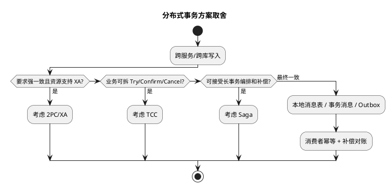
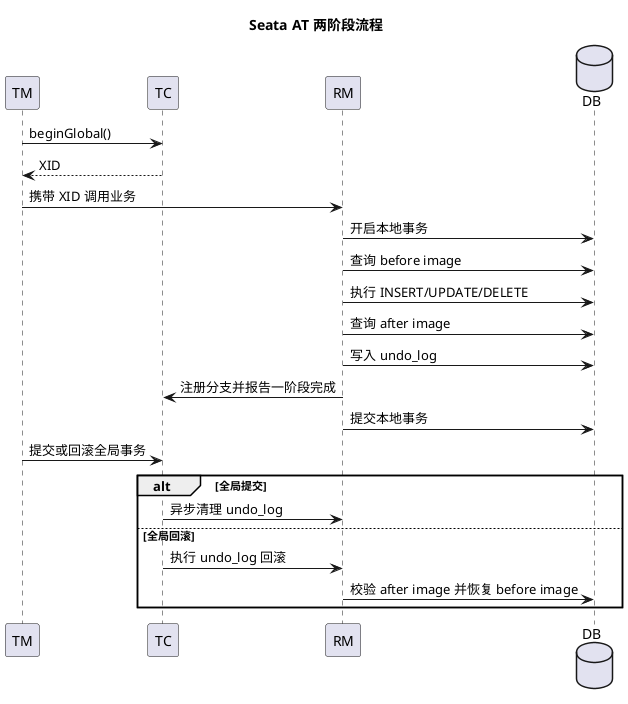

# 分布式事务

## 问题索引

- Q1：分布式事务是什么？常见方案如何选择？
- Q2：状态机以及乱序问题如何处理？如果不允许中间状态跳过怎么办？
- Q3：Seata AT 模式的实现流程、核心机制和适用边界是什么？

## Q1：分布式事务是什么？常见方案如何选择？

### 背景

单体应用里，一个数据库事务通常可以依赖本地 ACID 保证一致性；但微服务、分库分表、跨系统对接之后，一次业务动作可能同时涉及订单库、库存服务、优惠券服务、支付回调、MQ 消息、第三方接口等多个资源。

分布式事务要解决的核心问题是：**多个参与方不能天然共享一个本地事务时，如何避免一部分成功、一部分失败导致业务状态不一致**。

典型场景：

- 下单成功，但库存扣减失败。
- 支付成功，但订单状态没有更新。
- 本地数据库提交成功，但 MQ 消息发送失败。
- 分库分表后，一次业务写入跨多个分片。
- 调用第三方接口成功，但本地事务回滚。

### 核心原理


### PlantUML 示意图：分布式事务方案选择



分布式事务不是单一技术，而是一组围绕一致性、可用性、性能、复杂度做取舍的方案。

#### 强一致与最终一致

- **强一致**：业务执行完成后，所有参与方立即保持一致。常见方案是 XA、2PC、Seata XA/AT 等。
- **最终一致**：允许短时间状态不一致，通过重试、幂等、补偿、对账，最终把状态修正一致。常见方案是本地消息表、事务消息、TCC、Saga、Outbox 等。

高并发互联网业务通常优先选择最终一致，因为强一致方案往往会带来长事务、资源锁定、吞吐下降和系统耦合。

#### 不能只靠本地事务的原因

本地事务只能保证同一个数据库连接、同一个事务管理器内的操作原子性。下面这些动作无法天然放进同一个本地事务：

- 调用另一个微服务接口。
- 写入另一个独立数据库。
- 发送 MQ 消息。
- 调用支付、ERP、短信等外部系统。

一旦本地事务提交和远程动作之间出现网络超时、进程崩溃、MQ 不可用，就会出现“本地成功、远端失败”或“远端成功、本地失败”的中间状态。

### 常见方案

#### 2PC / XA

2PC 是两阶段提交，XA 是数据库层面对 2PC 的标准化支持。

流程：

1. **Prepare 阶段**：协调者询问所有参与者是否可以提交，参与者执行事务但不真正提交，并锁住相关资源。
2. **Commit / Rollback 阶段**：如果所有参与者都准备成功，协调者通知全部提交；只要有一个失败，就通知全部回滚。

优点：

- 一致性强，模型清晰。
- 对业务侵入相对小，适合数据库资源之间的强一致事务。

缺点：

- 参与者在 Prepare 后会持有锁，容易影响吞吐。
- 协调者异常时可能阻塞。
- 跨服务、跨外部系统时并不自然。
- 高并发核心链路中成本较高。

适用场景：

- 内部系统低并发、强一致要求高。
- 资金、账务等对一致性要求极高，且可接受性能损耗的场景。
- 分布式数据库或中间件已经成熟支持 XA 的场景。

#### 3PC

3PC 在 2PC 基础上增加 CanCommit、PreCommit、DoCommit 三个阶段，试图减少阻塞问题。

但它依赖更强的网络假设，实现复杂，实际业务系统中较少直接使用。面试中知道它是对 2PC 阻塞问题的改进即可，不必作为常规落地首选。

#### TCC

TCC 是 Try、Confirm、Cancel 三阶段，本质是把事务控制交给业务层。

- **Try**：预留资源，做业务检查。例如冻结库存、冻结账户余额、锁定优惠券。
- **Confirm**：确认执行，把预留资源真正转为已使用。例如扣减冻结库存。
- **Cancel**：取消执行，释放 Try 阶段预留的资源。例如解冻库存。

库存示例：

- Try：检查库存是否足够，冻结 1 件库存。
- Confirm：订单支付成功后，将冻结库存转成已扣减库存。
- Cancel：订单超时或支付失败后，释放冻结库存。

优点：

- 一致性强于普通最终一致。
- 适合资源预留类场景。
- 每个阶段都由业务显式控制，可控性高。

缺点：

- 对业务侵入大，每个接口都要实现 Try、Confirm、Cancel。
- 必须处理幂等、空回滚、悬挂。
- 业务复杂度高，开发和测试成本高。

关键问题：

- **幂等**：Confirm 或 Cancel 可能被重复调用，必须保证重复执行结果一致。
- **空回滚**：Try 没有成功执行，Cancel 却被调用了，Cancel 不能误释放资源。
- **悬挂**：Cancel 先于 Try 到达，后续 Try 不能再成功冻结资源。

适用场景：

- 库存冻结。
- 账户余额冻结。
- 优惠券锁定。
- 座位、额度、名额等需要先占用再确认的资源。

#### Saga

Saga 把一个长事务拆成多个本地事务，每个本地事务都有对应的补偿动作。

示例：

1. 创建订单。
2. 扣减库存。
3. 使用优惠券。
4. 发起支付。
5. 如果后续步骤失败，依次执行补偿：退优惠券、补库存、取消订单。

执行方式：

- **编排式**：有一个流程协调器统一控制每一步执行和补偿。
- **事件式**：服务之间通过事件驱动，成功和失败都通过消息传播。

优点：

- 适合长流程、跨服务、跨外部系统。
- 不需要长时间持有数据库锁。
- 可扩展性较好。

缺点：

- 不保证传统事务隔离性。
- 补偿动作不一定能完全抵消已发生的副作用，例如短信已经发送、第三方接口已经调用。
- 状态机、补偿、重试、告警都要设计完整。

适用场景：

- 订单履约流程。
- 审批流。
- 跨多个业务系统的长链路流程。
- 对中间状态可接受，但最终必须收敛一致的业务。

#### 本地消息表

本地消息表解决的是“本地数据库提交”和“MQ 消息发送”之间的原子性问题。

核心思路：

1. 在同一个本地事务里，同时写业务表和消息表。
2. 事务提交后，由后台任务或 afterCommit 回调发送 MQ。
3. 发送成功后更新消息状态。
4. 发送失败则定时扫描重试。
5. 消费端通过业务唯一键、去重表、状态机保证幂等。
6. 定时对账任务兜底修复长期不一致数据。

优点：

- 实现简单，可靠性高。
- 对 MQ 不可用、应用重启、网络抖动都有恢复能力。
- 非常适合高并发业务里的最终一致。

缺点：

- 有一定延迟。
- 需要维护消息表、重试任务、死信告警、对账任务。
- 消费端必须幂等。

适用场景：

- 订单创建后通知库存、积分、优惠券。
- CRM 与 ERP 数据同步。
- 本地状态变更后异步驱动后续系统。

#### RocketMQ 事务消息

RocketMQ 事务消息通过半消息和事务回查解决“发送消息”和“执行本地事务”的一致性。

流程：

1. Producer 先发送半消息，半消息对 Consumer 不可见。
2. Broker 保存半消息成功后，Producer 执行本地事务。
3. 本地事务成功则提交消息，失败则回滚消息。
4. 如果 Producer 崩溃或状态未知，Broker 会回查本地事务状态。

优点：

- MQ 原生支持事务消息。
- 能减少本地事务和消息发送之间的不一致窗口。

缺点：

- 回查接口必须能根据业务单号判断本地事务结果。
- 仍然需要消费端幂等。
- 仍然需要死信、告警、对账兜底。

适用场景：

- 本地事务完成后必须可靠触发下游消费。
- 对消息可靠性要求高，但可以接受最终一致。

#### Outbox / CDC

Outbox 模式和本地消息表类似，也是把业务事件写入本地数据库。区别是消息发送可以不由应用线程完成，而是通过 Canal、Debezium 等 CDC 工具监听 binlog，把 Outbox 事件投递到 MQ。

优点：

- 应用代码不直接承担消息发送逻辑。
- 基于数据库 binlog，可靠性较好。
- 适合事件驱动架构。

缺点：

- 引入 CDC 组件，链路更长。
- 需要处理事件顺序、重复投递、消费幂等。

适用场景：

- 微服务事件总线。
- 数据同步。
- 业务事件统一采集。

#### Seata

Seata 是常见的分布式事务框架，支持 AT、TCC、Saga、XA 等模式。

- **AT 模式**：通过代理数据源、undo_log、全局锁实现自动补偿，业务侵入较低。
- **TCC 模式**：由业务实现 Try、Confirm、Cancel。
- **Saga 模式**：适合长事务流程，依赖状态机和补偿。
- **XA 模式**：基于数据库 XA 能力，强一致但性能成本较高。

AT 模式注意点：

- 依赖 undo_log 记录回滚前镜像和后镜像。
- 全局锁可能影响并发写入。
- 对 SQL 类型和数据库能力有要求。
- 不适合所有复杂 SQL 和极高并发核心链路。

### 业务场景

#### 下单链路推荐方案

下单链路常见参与方包括订单、库存、优惠券、支付、积分、通知等。一般不建议用一个强一致分布式事务把所有服务锁在一起，因为链路太长，任何一个服务抖动都会拖垮整体可用性。

更常见的设计：

- 订单服务本地事务创建订单，并写本地消息表或发送事务消息。
- 库存服务使用 TCC 或冻结库存模型。
- 支付回调使用业务单号做幂等，并通过状态机推进订单状态。
- 积分、通知、数据统计通过 MQ 异步最终一致。
- 定时任务扫描超时订单并取消。
- 对账任务定期比对订单、支付、库存状态，发现异常后补偿。

#### CRM 与 ERP 同步

CRM 与 ERP 通常属于跨系统集成，不适合强行使用 XA。

更合适的设计：

- CRM 本地业务变更和消息记录在同一个事务内提交。
- 后台任务或事务消息投递同步事件。
- ERP 接口失败时重试，超过阈值进入异常表。
- 消费端按业务单号幂等处理。
- 每日对账修正 CRM 与 ERP 的差异。

### 解决方案选择

| 场景 | 推荐方案 | 选择原因 |
| --- | --- | --- |
| 数据库之间强一致、并发不高 | XA / Seata XA | 一致性强，业务侵入较低 |
| 分库分表后跨分片写入 | Seata AT / 数据库中间件能力 / 业务拆分 | 看中间件成熟度和并发要求 |
| 本地数据库 + MQ | 本地消息表 / RocketMQ 事务消息 / Outbox | 可靠实现最终一致 |
| 库存、余额、优惠券冻结 | TCC | 资源预留语义清晰 |
| 长流程、多服务编排 | Saga | 适合补偿式长事务 |
| 第三方系统对接 | 本地消息表 + 重试 + 对账 | 第三方通常无法加入全局事务 |
| 高并发核心链路 | 最终一致 + 幂等 + 状态机 + 对账 | 减少锁等待和服务耦合 |

### 踩坑点

#### 远程调用不要随便放进本地事务

如果在本地数据库事务中调用远程服务，会导致本地事务持有连接和锁的时间变长。远程服务一旦超时，本地数据库资源也被拖住，容易引发连接池耗尽、锁等待、接口雪崩。

更好的方式是：本地事务只做本地数据变更和事件记录，事务提交后再通过 MQ 或异步任务驱动远程动作。

#### 最终一致不是“发个 MQ 就完了”

最终一致至少要包含：

- 可靠事件记录。
- 失败重试。
- 消费端幂等。
- 状态机校验。
- 死信队列或异常表。
- 告警。
- 对账和补偿。

少了任何一环，都可能从“最终一致”退化成“最终看运气”。

#### 幂等是分布式事务的底线

常见幂等手段：

- 业务唯一键，例如 orderNo、paymentNo、requestId。
- 数据库唯一索引兜底。
- 去重表记录已处理消息。
- 状态机限制非法流转。
- 乐观锁 version 防止并发覆盖。
- Redis SETNX 做短期防重，但不能只依赖 Redis，数据库仍要兜底。

#### 补偿不是简单反向操作

补偿动作要考虑业务事实是否已经改变。例如：

- 优惠券可能已经过期，不能简单退回可用。
- 库存可能已经重新分配，需要确认冻结记录。
- 第三方支付已经成功，不能简单取消订单，而是要走退款流程。
- 短信、通知已经发出，无法物理撤回，只能追加解释或状态修正。

### 面试追问

- Q：分布式事务是不是等于 2PC？
  A：不是。2PC 只是强一致分布式事务的一种协议。真实业务里还会根据场景选择 TCC、Saga、本地消息表、RocketMQ 事务消息、Outbox、Seata AT/XA 等。高并发业务更多采用最终一致。

- Q：本地消息表能保证强一致吗？
  A：不能保证全链路强一致，它保证的是本地业务数据和消息记录在同一个数据库事务内原子提交。下游消费依赖重试、幂等和对账实现最终一致。

- Q：TCC 最容易踩什么坑？
  A：幂等、空回滚、悬挂。Confirm 和 Cancel 可能重复调用；Try 没成功也可能收到 Cancel；Cancel 先到后 Try 再到时，Try 不能继续成功。

- Q：Saga 和 TCC 怎么选？
  A：如果业务是资源预留，例如冻结库存、冻结余额，优先 TCC；如果是长流程、多步骤、允许补偿，例如订单履约、审批流，优先 Saga。

- Q：RocketMQ 事务消息还需要消费端幂等吗？
  A：需要。事务消息解决的是生产端本地事务和消息投递的一致性，不解决消费端重复消费、消费失败重试、业务并发更新等问题。

- Q：为什么很多系统不用 XA？
  A：XA 强一致但会持有资源锁，协调者和参与者之间存在阻塞风险，对吞吐和可用性影响较大。高并发业务通常更愿意用最终一致来换取吞吐、解耦和可恢复性。

### 复习清单

- [ ] 能说明分布式事务解决的不是“单库事务”，而是跨服务、跨库、跨 MQ 的一致性问题。
- [ ] 能说清 2PC / XA 的两个阶段、优缺点和适用场景。
- [ ] 能用库存冻结解释 TCC 的 Try、Confirm、Cancel。
- [ ] 能解释 TCC 的幂等、空回滚、悬挂。
- [ ] 能说明 Saga 适合长流程，但不保证传统事务隔离。
- [ ] 能说清本地消息表如何保证本地数据和消息记录原子提交。
- [ ] 能说明 RocketMQ 事务消息的半消息、本地事务、事务回查。
- [ ] 能回答为什么最终一致必须配合重试、幂等、状态机、告警和对账。
- [ ] 能按订单、库存、支付、ERP 同步等场景选择合适方案。

## Q2：状态机以及乱序问题如何处理？如果不允许中间状态跳过怎么办？

### 背景

在分布式事务和最终一致方案里，MQ 重试、异步回调、服务超时、网络抖动都会导致消息重复、乱序、延迟到达。

如果业务允许状态跳跃，例如订单从 `CREATED` 直接变成 `FINISHED`，实现会简单很多；但很多核心业务不允许跳过中间状态，例如订单必须经过：

```text
CREATED -> PAID -> STOCK_CONFIRMED -> DELIVERING -> FINISHED
```

这种情况下，乱序消息不能简单丢弃，也不能直接覆盖当前状态，否则会出现：

- 支付成功消息先到，但订单还没创建完成。
- 发货成功消息先到，但库存确认还没处理。
- 取消订单消息和支付成功消息并发到达。
- 重试消息晚到，把新状态覆盖成旧状态。

### 核心原理

状态机要解决两个问题：

- **合法流转**：当前状态只能按配置好的边流转，不能随意跳状态。
- **乱序收敛**：消息到达顺序不可靠，但最终要按业务顺序推进状态。

如果不允许中间状态跳过，核心原则是：**每次状态推进必须校验当前状态是否等于期望前置状态，不满足就不能更新主表，只能暂存、重试或进入异常处理**。

### 状态机设计

#### 1. 明确定义状态和事件

以订单为例：

| 当前状态 | 事件 | 目标状态 | 是否允许 |
| --- | --- | --- | --- |
| CREATED | PAY_SUCCESS | PAID | 允许 |
| PAID | STOCK_CONFIRM_SUCCESS | STOCK_CONFIRMED | 允许 |
| STOCK_CONFIRMED | DELIVER_SUCCESS | DELIVERING | 允许 |
| DELIVERING | SIGN_SUCCESS | FINISHED | 允许 |
| CREATED | CANCEL | CANCELLED | 允许 |
| PAID | REFUND_SUCCESS | REFUNDED | 允许 |
| CREATED | DELIVER_SUCCESS | DELIVERING | 不允许 |
| PAID | SIGN_SUCCESS | FINISHED | 不允许 |

状态机不要只靠代码里的 `if else` 零散判断，最好沉淀成明确的状态流转表、枚举或配置，方便评审和测试覆盖。

#### 2. 每条消息携带事件语义，而不是只携带目标状态

消息至少包含：

- `bizNo`：业务唯一键，例如订单号。
- `eventId`：事件唯一 ID，用于幂等。
- `eventType`：事件类型，例如 `PAY_SUCCESS`。
- `fromStatus`：期望前置状态。
- `toStatus`：目标状态。
- `version`：业务版本号或事件序号。
- `occurTime`：事件发生时间，只用于辅助判断，不能单独作为一致性依据。

注意：不能只说“我要把订单改成 FINISHED”。更安全的语义是“我基于 DELIVERING 状态处理 SIGN_SUCCESS 事件，把订单推进到 FINISHED”。

#### 3. 用条件更新保证状态不被并发覆盖

核心 SQL 思路：

```sql
UPDATE t_order
SET status = #{toStatus},
    version = version + 1,
    update_time = NOW()
WHERE order_no = #{orderNo}
  AND status = #{fromStatus};
```

这条 SQL 的关键是 `AND status = #{fromStatus}`。它保证只有当前状态正好处于期望前置状态时才允许推进。

- 更新行数为 `1`：说明状态推进成功。
- 更新行数为 `0`：说明消息重复、乱序、状态已变化或业务异常，需要进一步判断。

#### 4. 乱序消息不能直接丢弃

如果 `DELIVER_SUCCESS` 先于 `STOCK_CONFIRM_SUCCESS` 到达，此时订单状态还是 `PAID`，直接执行 `PAID -> DELIVERING` 是非法跳跃。

正确处理：

1. 判断 `DELIVER_SUCCESS` 的前置状态应为 `STOCK_CONFIRMED`。
2. 查询当前订单状态，发现当前是 `PAID`。
3. 不更新订单主表。
4. 将事件写入 `pending_event` 待处理表，标记为 `WAIT_PREV_STATE`。
5. 等 `STOCK_CONFIRM_SUCCESS` 推进成功后，再扫描或触发处理 `pending_event`。

### 解决方案

#### 方案一：状态条件更新 + 待处理事件表

这是最常见、最稳的方案。

主表：

```sql
CREATE TABLE t_order (
  id BIGINT PRIMARY KEY,
  order_no VARCHAR(64) NOT NULL UNIQUE,
  status VARCHAR(32) NOT NULL,
  version BIGINT NOT NULL DEFAULT 0,
  update_time DATETIME NOT NULL
);
```

事件去重表：

```sql
CREATE TABLE processed_event (
  event_id VARCHAR(64) PRIMARY KEY,
  order_no VARCHAR(64) NOT NULL,
  event_type VARCHAR(64) NOT NULL,
  create_time DATETIME NOT NULL
);
```

待处理事件表：

```sql
CREATE TABLE pending_event (
  event_id VARCHAR(64) PRIMARY KEY,
  order_no VARCHAR(64) NOT NULL,
  event_type VARCHAR(64) NOT NULL,
  from_status VARCHAR(32) NOT NULL,
  to_status VARCHAR(32) NOT NULL,
  reason VARCHAR(64) NOT NULL,
  retry_count INT NOT NULL DEFAULT 0,
  create_time DATETIME NOT NULL,
  update_time DATETIME NOT NULL,
  INDEX idx_order_status(order_no, from_status)
);
```

处理伪代码：

```java
@Transactional
public void handleOrderEvent(OrderEvent event) {
    // 1. eventId 是消息级幂等键，防止 MQ 重复投递导致重复推进状态
    if (processedEventMapper.exists(event.getEventId())) {
        return;
    }

    // 2. 状态流转配置用于校验事件是否合法，避免随意把订单改成某个目标状态
    StateTransition transition = stateMachine.getTransition(event.getEventType());
    if (transition == null) {
        throw new IllegalArgumentException("unsupported event type: " + event.getEventType());
    }

    // 3. 条件更新是状态机落库的关键：只有当前状态等于期望前置状态，才允许推进
    int updated = orderMapper.updateStatusIfCurrent(
        event.getOrderNo(),
        transition.getFromStatus(),
        transition.getToStatus()
    );

    if (updated == 1) {
        // 4. 状态推进成功后记录已处理事件，后续重复消息可以直接返回
        processedEventMapper.insert(event);

        // 5. 当前状态推进后，可能解锁之前乱序到达的后续事件
        pendingEventService.tryReplay(event.getOrderNo(), transition.getToStatus());
        return;
    }

    // 6. 更新失败不等于业务失败，可能是乱序、重复、旧消息或非法跳转，需要进一步判断
    Order order = orderMapper.selectByOrderNo(event.getOrderNo());
    if (order == null) {
        // 订单尚未创建完成，先暂存，等待创建事件或本地事务完成后重放
        pendingEventMapper.save(event, "ORDER_NOT_FOUND");
        return;
    }

    if (order.getStatus().equals(transition.getToStatus())) {
        // 当前已经是目标状态，说明大概率是重复消息；记录幂等后直接结束
        processedEventMapper.insert(event);
        return;
    }

    if (stateMachine.isBefore(order.getStatus(), transition.getFromStatus())) {
        // 当前状态还没走到前置状态，说明消息提前到了，不能跳过中间状态
        pendingEventMapper.save(event, "WAIT_PREV_STATE");
        return;
    }

    // 当前状态已经超过该事件的目标状态，说明这是旧消息，不能回退覆盖新状态
    processedEventMapper.insertIgnoredOldEvent(event, order.getStatus());
}
```

#### 方案二：按业务键保证 MQ 局部有序

如果 MQ 支持顺序消息，可以按 `orderNo` 做分区键，让同一个订单的消息进入同一个队列，由同一个消费线程顺序处理。

这可以减少乱序，但不能完全替代状态机，因为：

- 生产端可能本身就乱序发送。
- 不同系统的回调不一定进入同一个 MQ。
- 消费失败重试可能导致后续消息被阻塞。
- 人工补偿、定时任务、第三方回调仍可能绕开原消息顺序。

所以顺序消息只能降低乱序概率，状态机条件更新仍然要保留。

#### 方案三：版本号 / 事件序号

如果业务天然有递增序号，可以让每个事件携带 `eventSeq`。

处理规则：

- 只允许处理 `eventSeq = currentSeq + 1` 的事件。
- `eventSeq <= currentSeq` 视为重复或旧消息。
- `eventSeq > currentSeq + 1` 说明中间事件缺失，写入待处理表。

这种方式很适合严格流程，但前提是事件序号必须由同一个可信源生成，不能由多个服务各自生成。

### 不允许跳过中间状态时的处理流程

核心流程可以概括为：

1. 先做 `eventId` 幂等判断。
2. 根据 `eventType` 找到合法的 `fromStatus -> toStatus`。
3. 执行 `WHERE status = fromStatus` 的条件更新。
4. 更新成功，记录已处理事件，并尝试重放待处理事件。
5. 更新失败，查询当前状态。
6. 当前状态等于目标状态，按重复消息处理。
7. 当前状态落后于前置状态，按乱序消息暂存。
8. 当前状态已经超过目标状态，按旧消息处理。
9. 当前状态和事件完全不匹配，进入异常表并告警。

### 踩坑点

#### 不要用“状态大小比较”替代业务流转规则

很多人会给状态定义数字，例如 `10 CREATED`、`20 PAID`、`30 FINISHED`，然后用数字大小判断能不能更新。

这个做法有风险，因为业务状态不一定是单链路。比如 `PAID` 后面可能走 `REFUNDED`，也可能走 `STOCK_CONFIRMED`，还可能走 `RISK_REJECTED`。状态机应该判断“是否存在合法边”，而不是简单比较数字大小。

#### 不要让旧消息覆盖新状态

例如订单已经 `FINISHED`，过了一会儿收到重试的 `PAY_SUCCESS`，这条消息不能把状态改回 `PAID`，只能识别为旧消息或重复消息。

#### 不要只靠消息时间判断顺序

`occurTime` 可能受机器时钟、第三方系统、网络延迟影响。它可以辅助排查，但不能作为唯一的一致性判断依据。

#### 待处理事件必须有兜底

写入 `pending_event` 后，必须有：

- 定时重试。
- 最大重试次数。
- 异常表。
- 告警。
- 人工处理入口。
- 对账任务。

否则只是把问题从消费线程挪到了数据库里。

### 面试追问

- Q：乱序消息为什么不能直接丢弃？
  A：因为它可能只是提前到达，不代表业务无效。比如发货成功事件先于库存确认事件到达，如果直接丢弃，后续状态可能永远无法推进。更稳的做法是暂存到待处理事件表，等前置状态满足后重放。

- Q：如何保证不跳过中间状态？
  A：状态更新必须带前置状态条件，例如 `WHERE order_no = ? AND status = ?`。只有当前状态等于期望前置状态时才允许推进；否则进入重复、乱序、旧消息或异常分支。

- Q：顺序消息能不能解决所有乱序问题？
  A：不能。顺序消息只能保证同一个队列内的消费顺序，无法保证生产端、第三方回调、定时补偿、人工修复等所有入口都有序，所以状态机校验仍然必须存在。

- Q：状态机表怎么设计？
  A：至少包含当前状态、事件、目标状态、是否允许、是否终态等信息。复杂业务还可以加条件表达式、动作处理器、补偿动作和告警级别。

- Q：如果当前状态已经超过消息目标状态怎么办？
  A：一般按旧消息处理，不能回退覆盖新状态。可以记录事件日志用于审计，但主状态不更新。

### 复习清单

- [ ] 能解释为什么最终一致场景一定要有状态机。
- [ ] 能说清 `eventId` 幂等和 `status = fromStatus` 条件更新分别解决什么问题。
- [ ] 能说明乱序消息为什么要暂存，而不是直接丢弃。
- [ ] 能设计 `pending_event` 表处理提前到达的消息。
- [ ] 能解释顺序消息为什么不能替代状态机。
- [ ] 能回答“不允许跳过中间状态”时如何推进和重放事件。

## Q3：Seata AT 模式的实现流程、核心机制和适用边界是什么？

### 背景

微服务中一次业务操作可能同时修改订单库、库存库和账户库。每个服务内部可以使用本地数据库事务，但多个数据库之间无法天然共享同一个本地事务。Seata AT（Automatic Transaction）通过代理数据源、记录 `undo_log` 和维护全局锁，在尽量少改业务代码的情况下提供跨服务数据库事务的自动回滚能力。

AT 适合“参与方主要是关系型数据库、业务操作以常规 DML 为主、可以接受两阶段执行和最终完成”的场景；它不会把所有外部系统调用自动纳入同一个本地事务，也不是无条件的强一致方案。

### 一句话结论

Seata AT 是一种基于本地事务、`undo_log` 和全局锁的自动补偿型分布式事务：第一阶段各参与者提交本地事务并保存回滚信息，第二阶段成功时异步清理日志，失败时根据 `undo_log` 反向恢复数据。

### 核心组件

| 组件 | 职责 |
| --- | --- |
| TM（Transaction Manager） | 开启、提交、回滚全局事务，生成并维护 XID |
| TC（Transaction Coordinator） | 维护全局事务和分支事务状态，协调提交或回滚 |
| RM（Resource Manager） | 代理数据源，执行本地事务、记录 `undo_log`、注册分支并执行回滚 |
| DataSourceProxy | 拦截 SQL，生成前后镜像并参与全局锁处理 |
| `undo_log` | 保存回滚所需的 before image 和 after image |
| `lock_table` | 参与者数据库中的全局锁记录，用于避免 Seata 事务之间的脏写 |

XID 是全局事务的唯一标识，必须沿着 RPC、Feign、Dubbo 或消息上下文传递到下游服务。下游服务拿到 XID 后，才能把自己的本地事务注册为同一个全局事务的分支事务。

### 总体流程



### 一阶段：执行本地事务并记录回滚信息

以订单服务扣减库存为例：

1. TM 调用 TC 开启全局事务，TC 返回 XID。
2. TM 通过 RPC 调用库存服务，并把 XID 传递给库存服务。
3. 库存服务使用 `DataSourceProxy` 获取数据库连接，RM 识别到当前 XID。
4. RM 在本地事务中读取修改前的 **before image**。
5. 执行业务 SQL，例如扣减库存。
6. RM 再读取修改后的 **after image**。
7. RM 将回滚信息写入当前数据库的 `undo_log` 表。
8. RM 向 TC 注册分支事务、申请相关全局锁，然后提交本地数据库事务。

`undo_log` 必须和业务 SQL 在同一个本地事务中提交。这样可以避免业务数据提交成功但回滚日志没有写入，导致后续无法补偿。

一个简化的业务入口通常类似下面这样：

```java
@GlobalTransactional(name = "create-order", rollbackFor = Exception.class)
public void createOrder(CreateOrderCommand command) {
    // 外层方法负责开启全局事务；订单写库仍然由本地事务完成
    orderService.create(command);

    // RPC 调用会携带 XID；库存服务必须接入 Seata DataSourceProxy
    stockClient.deduct(command.getSkuId(), command.getQuantity());
}
```

这里的 `@GlobalTransactional` 只是全局事务入口，不会替代每个参与者的本地事务。每个参与者都必须正确配置 Seata 数据源代理，并创建匹配版本要求的 `undo_log` 表。

### 二阶段提交

当 TC 收到所有分支的一阶段成功结果后，TM 发起全局提交：

- TC 通知各 RM 提交分支事务；
- 由于业务数据在一阶段已经提交，二阶段通常不再执行实际业务 SQL；
- RM 异步删除已经完成的 `undo_log`，减少提交阶段阻塞。

因此，AT 的“提交”不是二阶段再次提交数据库连接，而是一阶段本地提交后由 TC 确认全局结果，并清理补偿数据。

### 二阶段回滚

只要任一分支失败，或全局事务被明确标记为回滚，TC 就通知各 RM 回滚：

1. RM 根据 XID、分支 ID 查询 `undo_log`。
2. 读取记录中的 before image 和 after image。
3. 校验当前数据库记录是否仍等于 after image。
4. 如果没有被其他业务修改，则用 before image 恢复数据。
5. 删除对应 `undo_log`，并把回滚结果报告给 TC。

这个 after image 校验用于防止“回滚覆盖后续合法修改”。如果业务数据已经被其他事务修改，RM 不能简单覆盖，需要按配置重试、人工处理或进入异常流程。这也是 AT 并非无条件强一致的一个重要边界。

### 全局锁解决什么问题

本地事务提交后，分支数据已经对本地数据库可见，但全局事务可能还没有完成。Seata 使用全局锁避免两个 Seata 全局事务并发修改同一业务记录时发生脏写：

- 分支提交前向 TC 申请相关资源的全局锁；
- 另一个 Seata 分支如果要修改相同资源，需要等待或返回锁冲突；
- 全局提交后释放全局锁。

全局锁主要约束接入 Seata 的事务参与者。绕过 Seata 直接修改数据库的程序不一定遵守这把锁，因此不能把它等同于数据库原生的全局排他锁。

### 适用场景

- 多个微服务分别操作 MySQL 等关系型数据库。
- 业务 SQL 以 `INSERT`、`UPDATE`、`DELETE` 等常规 DML 为主。
- 需要较低业务侵入，并且可以接受全局事务带来的锁等待和额外日志。
- 订单、库存、账户等内部服务之间的短事务协作。

### 限制与常见误区

#### 1. AT 不是跨所有资源的事务

Redis、MQ、文件、第三方支付接口等资源不会因为方法加了 `@GlobalTransactional` 就自动获得回滚能力。涉及这些资源时，通常要结合事务消息、本地消息表、TCC 或 Saga。

#### 2. 不是所有 SQL 都适合 AT

复杂 SQL、部分 DDL、无主键表、批量大字段修改、存储过程以及数据库特殊语法可能无法正确生成或恢复镜像。落地前要确认当前 Seata 版本和数据库驱动的支持范围，并对关键 SQL 做回滚测试。

#### 3. 全局事务不能设计得过长

事务链路越长，持有全局锁的时间越久，越容易出现锁冲突、超时和级联失败。远程调用、人工等待、长时间计算不应放在全局事务主链路中。

#### 4. `undo_log` 不是普通业务日志

它是回滚所需的控制数据。必须监控其增长、清理和异常状态；大字段或批量更新会导致日志膨胀，影响数据库空间和回滚性能。

#### 5. AT 不等于消费者幂等

Seata 只处理参与者数据库事务的全局协调和回滚，不会自动解决 MQ 重复消费、接口重复调用和业务状态机幂等问题。

### 线上排查清单

1. 确认 TC 是否可用，查看全局事务、分支事务和超时状态。
2. 根据 XID 检查调用链，确认 XID 是否正确传递到每个参与者。
3. 检查参与者是否真的使用 `DataSourceProxy`，避免部分 SQL 绕过 Seata。
4. 检查对应数据库是否存在 `undo_log`，以及表结构、版本和权限是否匹配。
5. 查看 `undo_log` 是否堆积，判断是提交清理慢、回滚失败还是事务长期未结束。
6. 检查 `lock_table` 和业务表上的锁冲突、等待时间及超时重试。
7. 对回滚失败记录保存 before/after image、当前数据和异常 SQL，避免只看“全局回滚失败”这一条表面日志。
8. 验证是否存在非 Seata 程序直接修改相同数据，造成全局锁失效或 after image 校验失败。

### 面试追问

- Q：Seata AT 和 TCC 怎么选？
  A：如果主要是关系型数据库常规 DML，并希望低业务侵入，可以优先 AT；如果需要控制资源预留、涉及非数据库资源或必须自定义确认与取消逻辑，通常选择 TCC。AT 依赖 undo_log 自动回滚，TCC 依赖业务实现 Try、Confirm、Cancel。

- Q：Seata AT 一阶段已经提交，为什么二阶段还能回滚？
  A：一阶段提交的是各参与者的本地事务，同时保存了 before image 和 after image。二阶段回滚时，RM 根据 undo_log 校验当前数据后恢复 before image，所以它本质上是自动补偿，而不是让数据库重新打开已提交的本地事务。

- Q：如果回滚时业务数据已经被其他程序修改怎么办？
  A：RM 会进行 after image 校验，发现数据已变化时不能盲目覆盖，通常会重试并记录异常，必要时进入人工补偿或对账流程。非 Seata 访问绕过全局锁是常见原因。

- Q：Seata AT 能保证全局可串行化吗？
  A：不能简单等同于全局可串行化。它通过全局锁和镜像校验降低 Seata 参与者之间的脏写风险，但隔离级别、非 Seata 访问、读写路径和数据库本身的并发行为仍需单独设计。

- Q：为什么 AT 事务不适合高并发超长链路？
  A：参与者需要注册分支、维护 undo_log，并可能竞争全局锁；链路越长，超时、锁等待和回滚成本越高。高并发场景通常会把主链路拆成本地事务加可靠事件，使用幂等、重试和对账实现最终一致。

### 复习清单

- [ ] 能说清 TM、TC、RM 的职责和 XID 的传递方式。
- [ ] 能按顺序解释 AT 一阶段的 before image、业务 SQL、after image、undo_log 和本地提交。
- [ ] 能解释二阶段提交为什么主要是异步清理 undo_log。
- [ ] 能解释二阶段回滚如何利用 before image、after image 和脏写校验恢复数据。
- [ ] 能说明全局锁解决的是 Seata 参与者之间的并发脏写问题。
- [ ] 能说出 AT 对非数据库资源、复杂 SQL、无主键表和超长事务的限制。
- [ ] 能够根据场景在 AT、TCC、本地消息表、事务消息和 Saga 之间做取舍。

