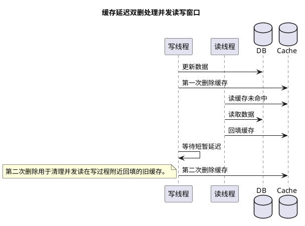

# 缓存延迟双删发展由来

## 问题索引

- Q1：缓存延迟双删是怎么发展出来的？它解决了什么并发问题？

## Q1：缓存延迟双删是怎么发展出来的？它解决了什么并发问题？

### 背景

缓存延迟双删讨论的是：

```text
数据库更新
Redis 缓存删除
并发读写交错
如何尽量减少脏缓存
```

它不是为了实现强一致，而是为了在常见“Cache Aside”模式下，用较低成本降低缓存和数据库短时间不一致的概率。

### 第一阶段：先更新数据库，再更新缓存

最直觉的做法是：

```text
更新 DB
更新 Redis
```

问题是并发下容易出现旧值覆盖新值。

例如：

```text
T1 更新 DB：库存 = 99
T2 更新 DB：库存 = 98
T2 更新 Redis：库存 = 98
T1 更新 Redis：库存 = 99
```

最终 DB 是 98，但缓存是 99，旧值覆盖了新值。

所以后来大家逐渐不推荐“写 DB 后更新缓存”，而推荐“写 DB 后删除缓存”。

### 第二阶段：先删除缓存，再更新数据库

另一个看起来合理的做法：

```text
删除 Redis
更新 DB
```

问题是读写并发下，读请求可能把旧 DB 值重新写回缓存。

时序：

```text
T1 写请求：删除缓存
T2 读请求：缓存 miss
T2 读 DB，读到旧值 A
T2 把旧值 A 写入缓存
T1 写请求：更新 DB 为 B
```

最终 DB 是 B，但缓存是 A。

这就是“先删缓存再更新 DB”的典型并发脏缓存问题。

### 第三阶段：先更新数据库，再删除缓存


### PlantUML 示意图：延迟双删并发窗口



更常见的 Cache Aside 写法是：

```text
更新 DB
删除 Redis
```

读流程：

```text
读 Redis
  -> 命中：返回
  -> 未命中：读 DB，再写 Redis
```

写流程：

```text
更新 DB
删除 Redis
```

这个方案大多数情况下比较稳，因为写请求提交 DB 后删除缓存，后续读请求缓存 miss，会读到新 DB 值。

但它仍然有一个小概率并发问题。

### 更新 DB 后删除缓存仍然可能出问题

极端时序：

```text
T1 读请求：缓存 miss
T1 查询 DB，读到旧值 A
T2 写请求：更新 DB 为 B
T2 删除缓存
T1 读请求：把旧值 A 写入缓存
```

最终 DB 是 B，但缓存又被 T1 写回旧值 A。

这个问题发生概率不高，因为要求：

- 读请求先 miss。
- 读 DB 慢。
- 写请求在读 DB 和写缓存之间完成更新和删除。
- 读请求最后把旧值写入缓存。

但高并发系统中，这个窗口确实存在。

### 第四阶段：延迟双删

延迟双删就是在“更新 DB 后删除缓存”的基础上，再补一次延迟删除。

典型流程：

```text
删除缓存
更新数据库
延迟一段时间
再次删除缓存
```

或者更常见的变体：

```text
更新数据库
删除缓存
延迟一段时间
再次删除缓存
```

为什么要第二次删除？

因为它要清理并发读请求在写流程期间回填进去的旧值。

对应刚才的并发时序：

```text
T1 读请求：缓存 miss
T1 查询 DB，读到旧值 A
T2 写请求：更新 DB 为 B
T2 删除缓存
T1 读请求：把旧值 A 写入缓存
T2 延迟一段时间后：再次删除缓存
后续读请求：缓存 miss，读 DB 得到 B，再写入缓存
```

第二次删除相当于把并发读回填的旧缓存清掉。

### 为什么要“延迟”

如果第二次删除立刻执行，可能仍然早于并发读回填缓存。

需要等一段时间，让并发读请求完成：

```text
读 DB + 写缓存
```

然后再删一次。

延迟时间一般参考：

```text
读请求最大耗时 + 缓存写入耗时 + 少量缓冲
```

例如：

- 平均读耗时 20ms。
- P99 读耗时 200ms。
- 可以延迟 500ms 或 1s 再删。

不要机械固定 5 秒或 10 秒，要结合业务 RT、缓存写入耗时和一致性要求。

### 先删缓存还是先更新 DB

实践中更常推荐：

```text
更新 DB
删除缓存
延迟删除缓存
```

原因：

- DB 是权威数据源。
- 先更新 DB 成功，再删除缓存，语义更清晰。
- 如果先删缓存再更新 DB，更新 DB 失败时，缓存已删除，会带来额外回源压力。

但如果业务代码已经采用：

```text
删除缓存
更新 DB
延迟删除缓存
```

也能解释为延迟删除补偿“读请求回填旧值”的窗口。

### 延迟删除如何实现

#### 1. 简单异步线程

```java
public void updateProduct(Product product) {
    // DB 是权威数据源，先更新数据库。
    productMapper.updateById(product);

    // 第一次删除缓存，避免后续读继续命中旧值。
    redisTemplate.delete("product:" + product.getId());

    delayExecutor.schedule(() -> {
        // 第二次删除用于清理并发读在窗口期回填的旧缓存。
        redisTemplate.delete("product:" + product.getId());
    }, 1, TimeUnit.SECONDS);
}
```

问题：

- 应用重启会丢延迟任务。
- 线程池满了可能延迟执行。
- 不适合关键业务唯一保障。

#### 2. MQ 延迟消息

```text
更新 DB
删除缓存
发送延迟消息 cache_delete_delay
消费者收到后再次删除缓存
```

优点：

- 延迟任务可靠性更好。
- 可重试、可监控、可死信。

适合：

- 订单、库存、价格等关键缓存。

#### 3. 本地消息表

```text
本地事务更新 DB + 写 cache_delete_event
afterCommit 删除缓存并发送延迟消息
扫描任务兜底补发
```

适合对一致性要求更高的场景。

### 延迟双删的局限

延迟双删不是强一致方案。

仍然可能有问题：

- 第二次删除失败。
- 延迟时间不够，旧读请求更晚回填。
- 主从数据库延迟，读请求读从库旧值再写缓存。
- 多级缓存，本地缓存没有同步删除。
- 删除缓存后缓存击穿，大量请求打 DB。

所以它只能降低不一致概率，不能保证绝对一致。

### 主从延迟下的特殊问题

如果读请求读从库：

```text
T2 更新主库为 B
T2 删除缓存
T1 读请求缓存 miss
T1 读从库，从库还没同步，读到 A
T1 写缓存 A
T2 延迟删除
```

如果延迟时间小于主从延迟，第二次删除后仍可能有请求从从库读到旧值再写缓存。

应对：

- 写后短时间读主库。
- 延迟时间覆盖主从复制 P99。
- 使用 Canal/binlog 监听 DB 变更删除缓存。
- 对强一致读不走缓存或强制读主。

### 替代和增强方案

| 方案 | 说明 |
| --- | --- |
| Cache Aside + 删除缓存 | 常用基础方案 |
| 延迟双删 | 降低并发回填旧值概率 |
| MQ 延迟删除 | 提升第二次删除可靠性 |
| Canal/binlog 删除缓存 | 基于 DB 变更异步删除缓存 |
| 版本号缓存 | 写缓存时比较版本，旧版本不能覆盖新版本 |
| 分布式锁/互斥构建缓存 | 避免大量并发回源和旧值回填 |
| 读写强一致路径 | 核心业务读主库或不走缓存 |

### 业务场景

#### 商品价格缓存

价格更新后：

```text
更新 price 表
删除 product:price:{skuId}
发送延迟删除消息
```

如果短时间读到旧价格可能造成资损，就不能只靠延迟双删，还要：

- 下单页重新校验价格。
- 订单创建时以 DB 或价格中心为准。
- 缓存只做展示。

#### 秒杀库存缓存

秒杀库存通常不适合简单延迟双删，因为库存是高频写、高并发扣减。

更推荐：

- Redis 原子扣减。
- MQ 异步落 DB。
- 库存流水对账。
- 活动结束后校准。

### 面试话术

> 延迟双删是从缓存和数据库并发更新问题演化出来的。最早有人会更新 DB 后直接更新缓存，但并发写会导致旧值覆盖新值；后来改成删除缓存。先删缓存再更新 DB 时，读请求可能在 DB 更新前读到旧值并写回缓存；更新 DB 再删缓存更常用，但也存在极端情况：读请求先 miss 并读到旧 DB 值，写请求更新 DB 并删除缓存，读请求最后把旧值写回缓存。延迟双删就是在写 DB 并删除缓存后，延迟一段时间再删一次，清理并发读在窗口期回填的旧缓存。它只能降低不一致概率，不是强一致方案；关键业务还要配合 MQ 延迟删除、binlog 监听、版本号、读主库、最终校验和对账。

## 高频追问

- Q：为什么不直接更新缓存？
  A：并发写时容易发生旧值覆盖新值。删除缓存让后续读从 DB 重新加载，更符合 Cache Aside 模式。

- Q：延迟时间怎么定？
  A：参考读请求 P99 耗时、缓存写入耗时、主从延迟和少量缓冲。目标是覆盖并发读回填旧缓存的窗口。

- Q：延迟双删能保证强一致吗？
  A：不能。第二次删除可能失败，延迟时间可能不够，读从库也可能读到旧值。它是降低概率的最终一致方案。

- Q：第二次删除失败怎么办？
  A：关键业务不要用本地线程裸跑，建议用 MQ 延迟消息或本地消息表记录删除事件，支持重试、告警和补偿。

- Q：主从延迟会影响延迟双删吗？
  A：会。如果读请求从延迟的从库读到旧值并回填缓存，仍然会产生脏缓存。可以写后读主、延迟覆盖主从 P99，或使用 binlog 删除缓存。

## 复习清单

- [ ] 能说清更新缓存为什么容易旧值覆盖新值。
- [ ] 能画出先删缓存再更新 DB 的并发脏缓存时序。
- [ ] 能画出更新 DB 再删缓存仍可能旧读回填的时序。
- [ ] 能解释第二次延迟删除要清理什么窗口。
- [ ] 能说明延迟时间如何估算。
- [ ] 能说清延迟双删为什么不是强一致，以及如何用 MQ、binlog、版本号增强。

