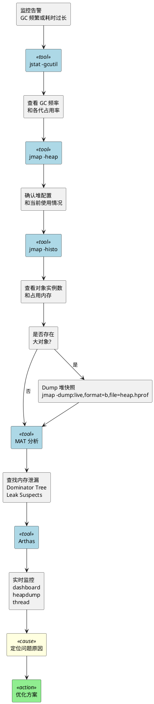
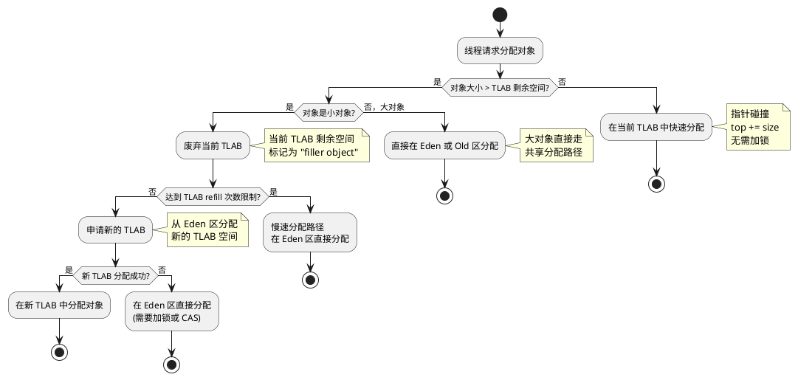
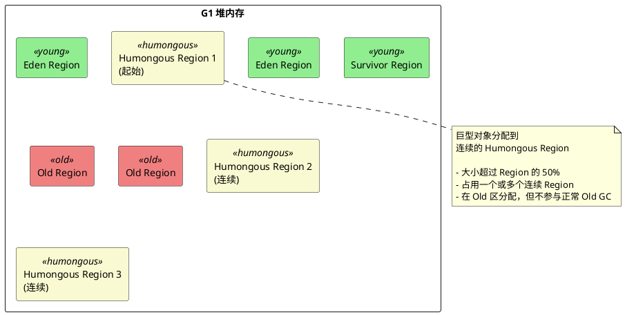

# JVM 内存分配与 GC 排查

## 问题索引

- Q1：频繁 Old GC / Full GC 问题排查
- Q2：TLAB（线程本地分配缓冲区）
- Q3：大对象/巨型对象的特殊分配
- Q4：标量替换和逃逸分析

---

## Q1：频繁 Old GC / Full GC 问题排查

### 背景

线上应用出现频繁的 Old GC 或 Full GC，会导致应用响应时间激增，甚至出现 STW（Stop-The-World）停顿，严重影响用户体验。掌握系统化的排查思路和工具使用是 JVM 调优的核心能力。

### 排查思路与工具

#### 排查路径



#### 核心工具

**1. jstat - GC 统计监控**

```bash
# 查看 GC 统计信息，每秒输出一次，共 10 次
jstat -gcutil <pid> 1000 10

# 输出示例：
# S0     S1     E      O      M     CCS    YGC     YGCT    FGC    FGCT     GCT
# 0.00  85.50  45.23  89.67  95.12  92.34   156    2.341    12   8.923   11.264

# 关键指标：
# O (Old区占用率)：持续接近 90% 说明老年代压力大
# FGC (Full GC次数)：频繁增长需重点关注
# FGCT (Full GC总耗时)：耗时过长影响业务
```

**2. jmap - 堆内存分析**

```bash
# 查看堆配置和使用情况
jmap -heap <pid>

# 查看存活对象的直方图（按占用内存排序）
jmap -histo:live <pid> | head -n 20

# 输出示例：
# num     #instances         #bytes  class name
# 1:        123456       12345678  [C
# 2:        67890         8901234  java.lang.String
# 3:        45678         7890123  byte[]

# Dump 堆快照用于离线分析
jmap -dump:live,format=b,file=/tmp/heap-$(date +%Y%m%d-%H%M%S).hprof <pid>
```

**3. MAT (Memory Analyzer Tool) - 堆快照分析**

核心功能：
- **Leak Suspects Report**：自动识别内存泄漏嫌疑点
- **Dominator Tree**：按支配树查看对象引用关系和占用内存
- **Histogram**：按类统计对象数量和内存占用
- **OQL (Object Query Language)**：用类 SQL 语法查询对象

```sql
-- MAT OQL 示例：查找大于 1MB 的 byte 数组
SELECT * FROM byte[] WHERE @retainedHeapSize > 1048576
```

**4. Arthas - 实时诊断**

```bash
# 启动 Arthas
java -jar arthas-boot.jar

# 实时查看 GC 情况
dashboard

# 动态 Dump 堆内存
heapdump /tmp/heap.hprof

# 查看 JVM 参数
jvm

# 反编译查看类加载情况（排查 Metaspace 问题）
jad --source-only com.example.SomeClass

# 监控方法调用耗时（定位性能瓶颈）
trace com.example.Service someMethod
```

### 常见原因分析

#### 1. 大对象频繁创建

**现象**：
- Young GC 后直接晋升到 Old 区
- Old 区占用率快速上升
- Full GC 频繁触发

**典型场景**：
```java
// 反例：每次查询都创建大量对象
public List<UserVO> queryUsers() {
    List<User> users = userMapper.selectAll(); // 假设 10 万条数据
    
    // 每次都创建新的 List 和 VO 对象
    List<UserVO> result = new ArrayList<>(users.size());
    for (User user : users) {
        UserVO vo = new UserVO();
        BeanUtils.copyProperties(user, vo); // 创建大量临时对象
        result.add(vo);
    }
    return result;
}
```

**优化方案**：
- 分批查询，限制单次返回数据量
- 使用流式处理，避免全量加载到内存
- 对大对象实施缓存策略

```java
// 正例：分页查询 + 流式处理
public void processUsers(Consumer<User> processor) {
    int pageSize = 1000;
    int pageNum = 1;
    
    while (true) {
        PageHelper.startPage(pageNum, pageSize);
        List<User> users = userMapper.selectAll();
        
        if (CollectionUtils.isEmpty(users)) {
            break;
        }
        
        // 逐条处理，避免大对象累积
        users.forEach(processor);
        pageNum++;
    }
}
```

#### 2. 内存泄漏

**现象**：
- Old 区占用率持续上升，GC 后也不下降
- Full GC 无法回收足够空间
- 最终导致 OOM

**典型场景**：

```java
// 反例 1：静态集合持有大量对象
public class CacheManager {
    // 静态集合永远不会被 GC
    private static Map<String, Object> cache = new HashMap<>();
    
    public void put(String key, Object value) {
        cache.put(key, value); // 无清理机制，持续增长
    }
}

// 反例 2：ThreadLocal 未清理
public class UserContext {
    private static ThreadLocal<User> context = new ThreadLocal<>();
    
    public static void setUser(User user) {
        context.set(user); // 线程池场景下，ThreadLocal 不清理会泄漏
    }
    
    // 缺少 remove() 调用
}

// 反例 3：监听器/回调未注销
public class EventManager {
    private List<EventListener> listeners = new ArrayList<>();
    
    public void register(EventListener listener) {
        listeners.add(listener); // 监听器注册后从未移除
    }
}
```

**排查方法**：
1. 使用 MAT 的 Leak Suspects Report
2. 对比两次 Heap Dump，查看增长对象
3. 分析 Dominator Tree，找到占用内存最大的对象路径

**优化方案**：
```java
// 正例 1：使用带清理策略的缓存
private static LoadingCache<String, Object> cache = CacheBuilder.newBuilder()
    .maximumSize(10000) // 限制大小
    .expireAfterWrite(10, TimeUnit.MINUTES) // 过期清理
    .build(new CacheLoader<String, Object>() {
        @Override
        public Object load(String key) throws Exception {
            return loadFromDB(key);
        }
    });

// 正例 2：ThreadLocal 主动清理
public class UserContext {
    private static ThreadLocal<User> context = new ThreadLocal<>();
    
    public static void setUser(User user) {
        context.set(user);
    }
    
    public static void clear() {
        context.remove(); // 必须在 finally 或 Filter 中调用
    }
}

// 在 Filter 中统一清理
@Override
public void doFilter(ServletRequest request, ServletResponse response, FilterChain chain) {
    try {
        chain.doFilter(request, response);
    } finally {
        UserContext.clear(); // 确保每次请求结束后清理
    }
}
```

#### 3. Metaspace 空间不足

**现象**：
- Full GC 时伴随 Metaspace 回收
- 日志显示 `Metadata GC Threshold`
- 频繁类加载/卸载

**典型场景**：
- 动态代理类过多（CGLIB、JDK Proxy）
- 大量使用反射
- Groovy/JSP 等动态语言生成类
- 热部署未正确卸载类

**排查方法**：
```bash
# 查看 Metaspace 使用情况
jstat -gc <pid>

# 使用 Arthas 查看类加载统计
classloader -l

# 查看具体类的加载信息
sc -d com.example.SomeClass
```

**优化方案**：
```bash
# JVM 参数调整
-XX:MetaspaceSize=256m           # 初始 Metaspace 大小
-XX:MaxMetaspaceSize=512m        # 最大 Metaspace 大小
-XX:+TraceClassLoading           # 跟踪类加载
-XX:+TraceClassUnloading         # 跟踪类卸载
```

代码层面：
- 减少动态代理使用
- 避免重复创建 ClassLoader
- 合理设置 Metaspace 大小

#### 4. 显式调用 System.gc()

**现象**：
- GC 日志显示 `System.gc()`
- Full GC 发生时机不可预测

**排查方法**：
```bash
# 搜索代码中的 System.gc() 调用
grep -r "System\.gc()" .

# 查看 GC 日志
# [Full GC (System.gc()) ...]
```

**优化方案**：
```bash
# JVM 参数禁用显式 GC
-XX:+DisableExplicitGC

# 或者让 System.gc() 触发 CMS GC 而非 Full GC
-XX:+ExplicitGCInvokesConcurrent
```

代码层面：
- 删除业务代码中的 `System.gc()` 调用
- 如果是第三方库调用，评估是否可以替换或升级

---

## Q2：TLAB（线程本地分配缓冲区）

### 背景

在多线程环境下，多个线程同时在堆上分配对象会产生竞争，需要加锁或使用 CAS 保证线程安全，影响性能。TLAB（Thread Local Allocation Buffer）是 JVM 为每个线程在 Eden 区预分配的一小块私有内存区域，用于快速分配对象。

### 核心原理

#### 什么是 TLAB

TLAB 是每个线程在 Eden 区独占的内存缓冲区：
- 默认大小为 Eden 区的 1%（可通过 `-XX:TLABSize` 调整）
- 每个线程只能访问自己的 TLAB，无需加锁
- TLAB 空间用完后会重新申请新的 TLAB
- 小对象优先在 TLAB 中分配，大对象直接在 Eden 区或 Old 区分配

#### 为什么需要 TLAB

**问题场景**：
```java
// 多线程并发创建对象
public class MultiThreadAllocation {
    public void run() {
        // 100 个线程同时分配对象
        ExecutorService executor = Executors.newFixedThreadPool(100);
        for (int i = 0; i < 100; i++) {
            executor.submit(() -> {
                for (int j = 0; j < 10000; j++) {
                    // 每个对象分配都需要修改 Eden 区的指针
                    Object obj = new Object();
                }
            });
        }
    }
}
```

**没有 TLAB 的情况**：
- 所有线程共享 Eden 区
- 分配对象时需要 CAS 或加锁更新 Eden 区的 top 指针
- 高并发下锁竞争严重，性能下降

**有 TLAB 的情况**：
- 每个线程在自己的 TLAB 中分配，无锁操作
- 只有 TLAB 用完申请新 TLAB 时才需要同步
- 大幅提升多线程对象分配性能

#### TLAB 分配流程



### TLAB 分配失败的处理

#### 慢速分配路径

当 TLAB 无法满足分配需求时，会进入慢速分配路径：

```java
// HotSpot 源码简化逻辑
HeapWord* allocate(size_t size) {
    // 1. 快速路径：尝试在 TLAB 中分配
    HeapWord* result = thread->tlab().allocate(size);
    if (result != NULL) {
        return result;
    }
    
    // 2. TLAB 空间不足，尝试 refill
    if (thread->tlab().should_refill()) {
        result = allocate_from_tlab_slow(size);
        if (result != NULL) {
            return result;
        }
    }
    
    // 3. 慢速路径：在 Eden 区直接分配（需要加锁）
    MutexLocker ml(Heap_lock);
    result = eden_allocate(size);
    
    // 4. Eden 区也不足，触发 Young GC
    if (result == NULL) {
        result = gc_and_allocate(size);
    }
    
    return result;
}
```

#### TLAB 相关 JVM 参数

```bash
# 启用 TLAB（默认开启）
-XX:+UseTLAB

# 禁用 TLAB（用于对比测试）
-XX:-UseTLAB

# 设置 TLAB 大小（默认为 Eden 区的 1%）
-XX:TLABSize=256k

# TLAB 自动调整大小（默认开启）
-XX:+ResizeTLAB

# 打印 TLAB 相关日志
-XX:+PrintTLAB

# TLAB refill 的浪费阈值（默认 64）
# 如果 TLAB 剩余空间小于 refill_waste，则允许浪费并申请新 TLAB
-XX:TLABRefillWasteFraction=64
```

### TLAB 优化建议

#### 监控 TLAB 效率

```bash
# 使用 jstat 查看 TLAB 相关指标
jstat -gc <pid> 1000

# 查看 GC 日志中的 TLAB 信息
# -XX:+PrintTLAB 会输出：
# TLAB: gc thread: 0x... [id: 12345] desired_size: 256KB slow allocs: 123
```

#### 优化方向

1. **减少 TLAB refill 频率**：
   - 如果 slow allocs 过多，说明 TLAB 频繁用完
   - 可适当增大 `-XX:TLABSize`

2. **减少对象分配**：
   - 对象池复用
   - 使用基本类型数组代替对象数组
   - 避免在循环中创建大量临时对象

3. **合理设置线程数**：
   - 线程过多会导致 TLAB 总占用过大
   - 每个 TLAB 占用 Eden 区空间，线程数 × TLAB 大小不应超过 Eden 区的合理比例

---

## Q3：大对象/巨型对象的特殊分配

### 背景

大对象和巨型对象在 JVM 中有特殊的分配策略，直接影响 GC 行为和性能。理解这些策略有助于避免因大对象导致的频繁 GC 问题。

### 大对象直接进入老年代

#### 原因

小对象在 Eden 区分配，经过多次 Minor GC 后晋升到 Old 区。但大对象如果也在 Eden 区分配，会导致：
- Eden 区空间迅速耗尽，频繁触发 Minor GC
- 大对象复制到 Survivor 区成本高
- Survivor 区空间往往无法容纳大对象

因此，JVM 让大对象直接在 Old 区分配，避免频繁复制。

#### 参数配置

```bash
# Serial、ParNew、Parallel Scavenge 收集器
# 大于此值的对象直接在老年代分配（默认 0，表示不限制）
-XX:PretenureSizeThreshold=1m

# 注意：此参数只对 Serial 和 ParNew 收集器有效
# 对 Parallel Scavenge 无效，Parallel Scavenge 会自动判断
```

#### 示例场景

```java
// 大对象直接进入老年代的案例
public byte[] loadFileContent(String filePath) throws IOException {
    File file = new File(filePath);
    
    // 假设文件大小为 5MB，超过 PretenureSizeThreshold
    byte[] content = new byte[(int) file.length()]; // 直接分配到 Old 区
    
    try (FileInputStream fis = new FileInputStream(file)) {
        fis.read(content);
    }
    
    return content;
}
```

**潜在问题**：
- 如果业务频繁创建大对象，Old 区会快速填满
- 触发 Full GC，影响性能

**优化方案**：
```java
// 方案 1：流式处理，避免一次性加载
public void processFile(String filePath, Consumer<byte[]> processor) throws IOException {
    try (FileInputStream fis = new FileInputStream(filePath)) {
        byte[] buffer = new byte[8192]; // 小缓冲区在 Eden 区分配
        int len;
        while ((len = fis.read(buffer)) != -1) {
            processor.accept(Arrays.copyOf(buffer, len));
        }
    }
}

// 方案 2：使用池化缓冲区
private static final ThreadLocal<byte[]> BUFFER_POOL = ThreadLocal.withInitial(() -> new byte[1024 * 1024]);

public void processWithPool(String filePath) throws IOException {
    byte[] buffer = BUFFER_POOL.get(); // 复用缓冲区，减少分配
    // ... 处理逻辑
}
```

### G1 中的 Humongous 对象

#### 定义

G1 收集器将堆划分为多个大小相等的 Region（默认 1MB ~ 32MB）。Humongous 对象是指：
- 大小超过 Region 容量一半的对象
- 例如 Region 大小为 2MB，则超过 1MB 的对象为 Humongous 对象

#### 分配策略



**Humongous 对象的特点**：
1. **分配在 Old 区**：直接分配到专门的 Humongous Region
2. **占用连续 Region**：如果对象大于一个 Region，会占用多个连续 Region
3. **特殊回收时机**：
   - 在 Young GC 时，如果 Humongous 对象不可达，可以直接回收
   - 在 Mixed GC 时，Humongous Region 也会被考虑回收
   - Full GC 时必然会回收

#### 相关参数

```bash
# 设置 Region 大小（1MB ~ 32MB，必须是 2 的幂次）
-XX:G1HeapRegionSize=4m

# 示例：
# Region 大小 = 4MB
# Humongous 对象阈值 = 4MB × 50% = 2MB
# 大于 2MB 的对象会被当作 Humongous 对象

# 打印 G1 详细日志
-XX:+PrintGCDetails -XX:+PrintGCTimeStamps
```

#### Humongous 对象的问题

```java
// 问题案例：频繁创建 Humongous 对象
public String processLargeData() {
    // 假设 Region 大小为 2MB，阈值为 1MB
    StringBuilder sb = new StringBuilder(2 * 1024 * 1024); // 2MB，超过阈值
    
    for (int i = 0; i < 100000; i++) {
        sb.append("some data..."); // StringBuilder 内部 char[] 扩容可能创建新的 Humongous 对象
    }
    
    return sb.toString();
}
```

**潜在问题**：
- Humongous Region 难以复用，容易产生碎片
- 频繁分配和回收 Humongous 对象会导致 Old 区空间不连续
- 可能提前触发 Full GC

**优化方案**：
```java
// 方案 1：预估大小，避免扩容
public String processLargeData() {
    // 预估总大小，避免 StringBuilder 扩容创建新的大 char[]
    int estimatedSize = 100000 * 20; // 每次追加约 20 字节
    StringBuilder sb = new StringBuilder(estimatedSize);
    
    for (int i = 0; i < 100000; i++) {
        sb.append("some data...");
    }
    
    return sb.toString();
}

// 方案 2：分段处理，避免单个对象过大
public List<String> processInBatches() {
    List<String> results = new ArrayList<>();
    StringBuilder sb = new StringBuilder(512 * 1024); // 512KB，低于阈值
    
    for (int i = 0; i < 100000; i++) {
        sb.append("some data...");
        
        // 每 1000 条数据生成一个字符串
        if (i % 1000 == 0) {
            results.add(sb.toString());
            sb.setLength(0); // 清空重用，避免创建新对象
        }
    }
    
    return results;
}

// 方案 3：调整 Region 大小
// 如果业务确实需要处理较大对象，可以增大 Region 大小
// -XX:G1HeapRegionSize=8m
// 此时 Humongous 阈值变为 4MB
```

---

## Q4：标量替换和逃逸分析

### 背景

JVM 的 JIT 编译器在运行时会进行激进优化，其中逃逸分析（Escape Analysis）是一项重要的技术。通过逃逸分析，JIT 可以判断对象的作用域，进而进行标量替换（Scalar Replacement）等优化，使得某些对象甚至不需要在堆上分配。

### 逃逸分析

#### 定义

逃逸分析是指分析对象的动态作用域：
- **未逃逸**：对象只在方法内部使用，不会被外部引用
- **方法逃逸**：对象作为返回值或参数传递到方法外部
- **线程逃逸**：对象被多个线程访问

#### 三种逃逸场景

**场景 1：未逃逸（No Escape）**

```java
public void noEscape() {
    // point 对象只在方法内部使用，不会逃逸
    Point point = new Point(10, 20);
    int distance = point.x * point.x + point.y * point.y;
    System.out.println(distance);
}

// JIT 编译后，point 可能被标量替换：
public void noEscape_optimized() {
    // 对象被拆解为标量，直接在栈上或寄存器中分配
    int x = 10;
    int y = 20;
    int distance = x * x + y * y;
    System.out.println(distance);
}
```

**场景 2：方法逃逸（Method Escape）**

```java
// 对象作为返回值，逃逸出方法
public Point methodEscape() {
    Point point = new Point(10, 20);
    return point; // point 逃逸到方法外部，无法被标量替换
}

// 对象作为参数传递，逃逸出方法
public void methodEscape2() {
    Point point = new Point(10, 20);
    externalMethod(point); // point 传递给其他方法，可能被外部引用
}
```

**场景 3：线程逃逸（Thread Escape）**

```java
public class SharedResource {
    private Point point; // 实例字段，可能被多个线程访问
    
    public void threadEscape() {
        // point 赋值给实例字段，可能被其他线程访问
        this.point = new Point(10, 20); // 线程逃逸，无法优化
    }
}

// 静态字段也会导致线程逃逸
public class StaticResource {
    private static Point globalPoint;
    
    public void threadEscape() {
        globalPoint = new Point(10, 20); // 线程逃逸
    }
}
```

### 标量替换

#### 定义

标量替换是指 JIT 编译器将对象拆解为基本类型（标量），直接在栈上分配或使用寄存器，而不是在堆上创建对象。

**标量 vs 聚合量**：
- **标量（Scalar）**：不可再分的数据类型，如 int、long、reference
- **聚合量（Aggregate）**：可以再分的数据类型，如对象、数组

#### 优化效果

```java
// 原始代码
public class Point {
    public int x;
    public int y;
}

public int calculate() {
    Point p = new Point();
    p.x = 10;
    p.y = 20;
    return p.x + p.y;
}

// 经过逃逸分析 + 标量替换后：
public int calculate_optimized() {
    // Point 对象被拆解为两个标量
    int x = 10;
    int y = 20;
    return x + y;
}
```

**优势**：
1. **无需堆分配**：减轻 GC 压力
2. **无需对象头**：节省内存空间（对象头占用 8~16 字节）
3. **栈上分配或寄存器**：访问速度更快
4. **方法结束自动回收**：无需 GC 介入

#### 相关 JVM 参数

```bash
# 开启逃逸分析（JDK 8+ 默认开启）
-XX:+DoEscapeAnalysis

# 关闭逃逸分析（用于对比测试）
-XX:-DoEscapeAnalysis

# 开启标量替换（默认开启）
-XX:+EliminateAllocations

# 打印逃逸分析日志
-XX:+PrintEscapeAnalysis

# 打印内联和编译日志
-XX:+PrintCompilation
-XX:+UnlockDiagnosticVMOptions
-XX:+PrintInlining
```

### 其他优化：同步消除和栈上分配

#### 同步消除（Lock Elision）

如果对象未逃逸，JIT 可以消除对该对象的同步锁：

```java
// 原始代码
public void synchronizedMethod() {
    Object lock = new Object(); // lock 对象未逃逸
    synchronized (lock) {
        // 临界区代码
        System.out.println("locked");
    }
}

// JIT 优化后：
public void synchronizedMethod_optimized() {
    // 由于 lock 对象只在方法内部使用，同步锁可以被消除
    System.out.println("locked");
}
```

#### 栈上分配（Stack Allocation）

HotSpot 并没有真正实现栈上分配，而是通过标量替换达到类似效果。部分 JVM（如 Azul Zing）实现了真正的栈上分配。

**标量替换 vs 栈上分配**：
- **标量替换**：将对象拆解为标量，标量可能在栈上或寄存器中
- **栈上分配**：整个对象在栈上分配，保留对象结构

### 实践建议

1. **尽量使用局部变量**：对象作用域越小，越容易被优化
2. **避免不必要的字段赋值**：将对象赋值给字段会导致逃逸
3. **小对象优化收益更大**：大对象即使未逃逸，也可能因为太大而不被优化
4. **不要过度依赖**：逃逸分析是 JIT 的优化，不是编程模型的一部分

```java
// 推荐：局部变量，未逃逸
public int calculate() {
    Point p = new Point(10, 20); // 可能被标量替换
    return p.x + p.y;
}

// 不推荐：不必要的字段赋值
public class Calculator {
    private Point p; // 字段赋值导致逃逸
    
    public int calculate() {
        this.p = new Point(10, 20); // 无法被标量替换
        return p.x + p.y;
    }
}
```

---

## 面试追问

### Q1：频繁 Old GC 排查

**Q：如何快速判断是内存泄漏还是内存溢出？**

A：通过对比多次 Heap Dump：
- **内存泄漏**：两次 Dump 之间，对象数量和内存占用持续增长，GC 后也不释放
- **内存溢出**：对象数量合理，但堆配置过小，无法容纳正常业务数据

可以通过 MAT 的 "Compare Baskets" 功能对比两次快照，查看增长对象。

**Q：如何定位是哪个接口或功能导致的内存问题？**

A：结合 APM 工具和日志：
1. 使用 SkyWalking、Pinpoint 等 APM 工具，关联 GC 时间点和请求链路
2. 分析 GC 发生前后的业务日志，找到高频请求
3. 使用 Arthas 的 `trace` 或 `monitor` 命令，监控可疑方法的调用次数和耗时
4. 在 Heap Dump 中查找与业务相关的对象（如 VO、DTO 类），追溯创建来源

**Q：Full GC 耗时过长如何优化？**

A：
- **减少 Old 区对象数量**：避免大对象、减少内存泄漏
- **使用低延迟 GC**：G1、ZGC、Shenandoah
- **调整 GC 参数**：增大堆内存、调整新生代和老年代比例
- **分代优化**：减少对象晋升到 Old 区的速度

### Q2：TLAB

**Q：TLAB 是否会浪费内存？**

A：会有少量浪费，但可接受：
- 当线程申请新 TLAB 时，旧 TLAB 的剩余空间会被填充为 "filler object"，暂时浪费
- 但这部分空间在下次 Young GC 时会被回收
- 浪费的空间占比很小（通过 `TLABRefillWasteFraction` 控制），换来的是显著的并发性能提升

**Q：什么情况下应该禁用 TLAB？**

A：极少场景需要禁用，仅用于排查问题：
- 对比测试，验证 TLAB 的性能提升
- 线程极少（如单线程）且对象分配频率低，TLAB 收益不明显
- 特殊的内存分配器或自定义堆管理

### Q3：大对象分配

**Q：G1 中 Humongous 对象何时会被回收？**

A：
1. **Young GC**：如果 Humongous 对象在 Young GC 时不可达，可以直接回收
2. **Mixed GC**：Humongous Region 会被标记并在 Mixed GC 中回收
3. **Full GC**：所有不可达的 Humongous 对象都会被回收

G1 会在标记阶段检查 Humongous 对象的存活性，如果引用链断裂，会提前释放。

**Q：如何监控 Humongous 对象分配？**

A：通过 GC 日志：
```bash
# 开启 G1 详细日志
-XX:+PrintGCDetails -XX:+PrintGCTimeStamps

# 日志示例：
# [GC pause (G1 Humongous Allocation) ...]
```

使用 JFR (Java Flight Recorder)：
```bash
jcmd <pid> JFR.start name=g1-profile settings=profile
jcmd <pid> JFR.dump name=g1-profile filename=recording.jfr
```

### Q4：逃逸分析

**Q：逃逸分析是在编译时还是运行时？**

A：**运行时**。逃逸分析由 JIT 编译器（C2 编译器）在运行时执行，通常在方法被多次调用达到热点阈值后触发。

**Q：为什么不是所有未逃逸对象都会被标量替换？**

A：有多个限制条件：
1. **对象过大**：标量替换后，局部变量过多会占用过多栈空间
2. **字段访问复杂**：如果对象字段被通过反射或 Unsafe 访问，无法拆解
3. **编译器判断成本**：JIT 编译时间有限，复杂对象的逃逸分析成本高
4. **对象存在不可预测行为**：如对象重写了 `finalize()` 方法

**Q：如何验证某个对象是否被标量替换？**

A：
1. **使用 JIT 编译日志**：
```bash
-XX:+UnlockDiagnosticVMOptions
-XX:+PrintEliminateAllocations
-XX:+PrintCompilation
-XX:+PrintInlining
```

2. **使用 JMH 基准测试**：
```java
@Benchmark
public int testEscapeAnalysis() {
    Point p = new Point(10, 20); // 观察是否有堆分配
    return p.x + p.y;
}

// 运行时加上 -XX:+PrintEliminateAllocations
```

3. **对比开启/关闭逃逸分析的性能**：
- 关闭：`-XX:-DoEscapeAnalysis`
- 开启：`-XX:+DoEscapeAnalysis`

---

## 复习清单

- [ ] 能说出频繁 Old GC / Full GC 的 4 种常见原因
- [ ] 能使用 jstat、jmap、MAT、Arthas 排查 GC 问题
- [ ] 能解释 TLAB 是什么，以及为什么能提升多线程分配性能
- [ ] 能画出 TLAB 分配流程图
- [ ] 能说明大对象和 Humongous 对象的分配策略
- [ ] 能举例说明 G1 中 Humongous 对象的问题和优化方法
- [ ] 能区分逃逸分析的三种场景（未逃逸、方法逃逸、线程逃逸）
- [ ] 能解释标量替换的原理和优化效果
- [ ] 能回答面试追问中的常见问题
- [ ] 能结合实际项目案例说明如何排查和优化 GC 问题
