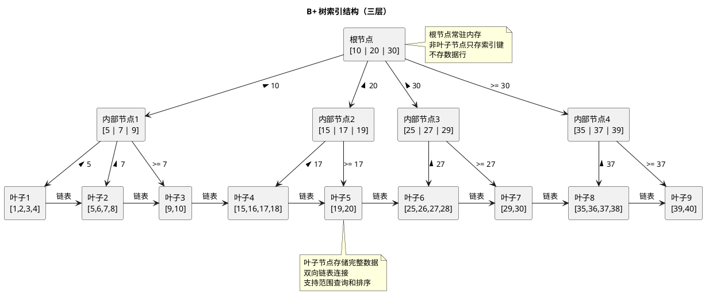
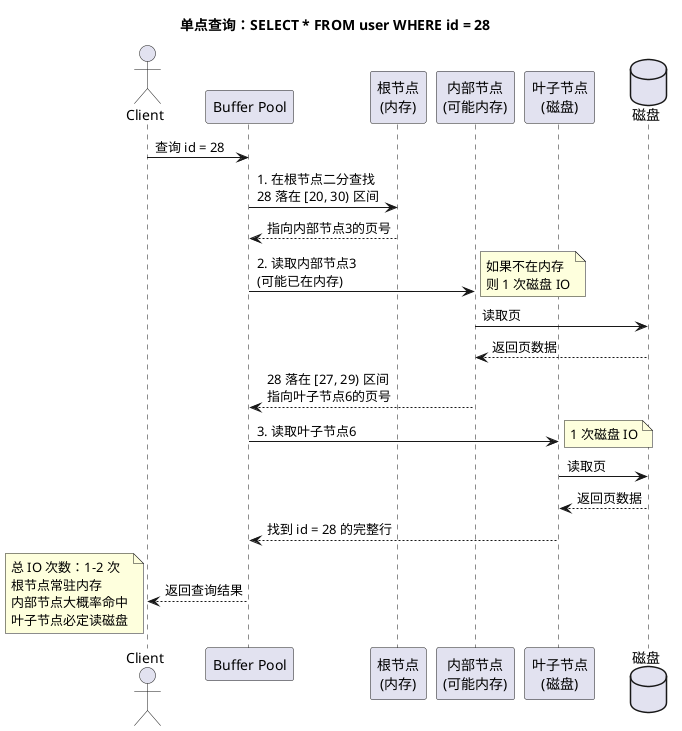
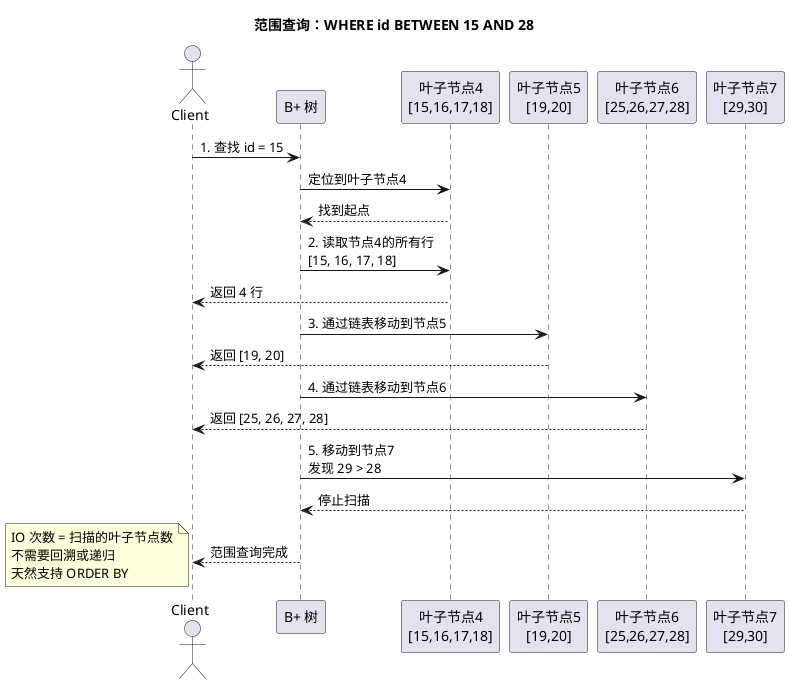

# MySQL 为什么选择 B+ 树

## 问题索引

- Q1：为什么 MySQL/InnoDB 使用 B+ 树而不是其他数据结构？
- Q2：B+ 树如何减少磁盘 IO 次数？
- Q3：B+ 树如何支撑高效的范围查询？

## Q1：为什么 MySQL/InnoDB 使用 B+ 树而不是其他数据结构？

**一句话结论：** MySQL 选择 B+ 树是因为它能够在磁盘存储场景下用最少的 IO 次数完成查询，同时天然支持范围查询和顺序扫描；相比之下，B 树每层都存数据导致树更高，红黑树和跳表的树高不可控，哈希表不支持范围查询。

### 候选数据结构对比

| 数据结构 | 树高 | 单点查询 | 范围查询 | 磁盘 IO 次数 | 为什么不选 |
| --- | --- | --- | --- | --- | --- |
| **B+ 树** | log_m(N)，m=数百 | O(log N) | 高效（叶子链表） | 3-4 次 | ✅ MySQL 采用 |
| **B 树** | log_m(N)，但 m 更小 | O(log N) | 低效（需中序遍历） | 更多 | 非叶节点也存数据，单页能存的索引键更少，树更高 |
| **红黑树** | log_2(N) | O(log N) | 低效（需中序遍历） | 几十次 | 树高不可控，百万数据需 20 层，IO 次数太多 |
| **跳表** | log_2(N) | O(log N) | 高效（底层链表） | 几十次 | 同红黑树，且多级指针需额外空间 |
| **哈希表** | - | O(1) | **不支持** | 1 次 | 无法支持范围查询、排序、最左前缀匹配 |

### B+ 树的核心特点

1. **非叶子节点只存索引键，不存数据行**
   - 单个节点（InnoDB 默认 16KB）能存储更多索引键（通常数百个）
   - 扇出（fan-out）更大，树高更低
   - 例：三层 B+ 树可索引数百万行数据

2. **所有数据行都在叶子节点**
   - 叶子节点存储完整的数据行（聚簇索引）或主键值（辅助索引）
   - 查询路径稳定：任何查询都要走到叶子节点
   - 便于实现 MVCC 和锁机制

3. **叶子节点用双向链表连接**
   - 支持高效的范围查询：`WHERE id BETWEEN 10 AND 100`
   - 支持顺序扫描：`ORDER BY id`
   - 支持反向扫描：`ORDER BY id DESC`

4. **节点内的键有序**
   - 支持二分查找，单节点内查找复杂度 O(log m)
   - 支持最左前缀匹配：联合索引 `(a, b, c)` 可以支持 `a`、`(a, b)`、`(a, b, c)` 的查询

### B+ 树结构示意



### 为什么不选 B 树

B 树的非叶子节点也存储数据行，导致：
- **单节点扇出更小**：同样 16KB 页，B 树存了数据就存不下那么多索引键
- **树高更高**：同样百万数据，B 树可能需要 4-5 层，B+ 树只需 3 层
- **范围查询低效**：需要中序遍历整棵树，不能像 B+ 树那样直接遍历叶子链表
- **缓存不友好**：根节点和上层内部节点更大，占用更多内存

### 为什么不选红黑树

红黑树是二叉搜索树的平衡版本，但：
- **树高不可控**：百万数据需要约 log₂(1,000,000) ≈ 20 层
- **磁盘 IO 次数多**：每层一次 IO，单次查询需要 20 次 IO
- **节点小，空间浪费**：每个节点只有 2 个指针，16KB 页大部分空间浪费
- **不适合磁盘存储**：红黑树适合内存场景（如 Java TreeMap），不适合磁盘

对比：B+ 树的扇出可达数百，三层即可索引 `200 * 200 * 200 = 8,000,000` 行数据，只需 3 次 IO。

### 为什么不选跳表

跳表是多层有序链表，随机化构建索引层：
- **树高同样不可控**：期望高度 log₂(N)，与红黑树类似
- **多级指针占用空间**：每个节点平均 1.5 个指针，空间开销较大
- **不适合磁盘存储**：跳表依赖指针随机跳转，磁盘随机读性能差
- **并发复杂度高**：虽然支持无锁并发，但 MySQL 有自己的锁机制，不需要跳表的无锁特性

跳表适合内存场景（如 Redis ZSet），不适合磁盘 B-Tree 存储引擎。

### 为什么不选哈希表

哈希表是 O(1) 查询，但：
- **不支持范围查询**：`WHERE id > 100` 需要全表扫描
- **不支持排序**：`ORDER BY id` 需要额外排序
- **不支持最左前缀匹配**：联合索引 `(a, b, c)` 无法支持 `WHERE a = 1`
- **哈希冲突需要链表或探测**：冲突严重时退化为 O(N)
- **不支持模糊查询**：`LIKE 'abc%'` 无法使用哈希索引

MySQL 的 Memory 引擎支持哈希索引，但仅限于等值查询场景。InnoDB 支持自适应哈希索引（Adaptive Hash Index），但只是在 B+ 树之上的内存优化，不是替代。

## Q2：B+ 树如何减少磁盘 IO 次数？

**一句话结论：** B+ 树通过增大扇出（单节点存数百个索引键）来降低树高，使得三层树即可索引数百万行；根节点常驻内存后，单次查询只需 2-3 次磁盘 IO，而不是红黑树的几十次。

### 磁盘 IO 是性能瓶颈

现代存储的性能差距：
- **内存随机访问**：约 100 ns（纳秒）
- **SSD 随机读**：约 0.1 ms（毫秒）= 100,000 ns
- **HDD 随机读**：约 10 ms = 10,000,000 ns

磁盘随机读比内存慢 10 万 - 1000 万倍，因此**减少磁盘 IO 次数是数据库索引设计的首要目标**。

### B+ 树的 IO 优化策略

#### 1. 大扇出降低树高

InnoDB 默认页大小 16KB，假设：
- 索引键 8 字节（BIGINT）
- 指针 6 字节（页号）
- 单个索引项 14 字节
- 单页可存 16KB / 14B ≈ 1170 个索引键

三层 B+ 树的容量：
```
第 1 层（根节点）：1 个节点，1170 个索引键
第 2 层（内部节点）：1170 个节点，1170 * 1170 = 1,368,900 个索引键
第 3 层（叶子节点）：1,368,900 个节点，可存储约 1000 万 - 2000 万行数据
```

单次查询路径：
```
根节点（内存）-> 内部节点（1 次 IO）-> 叶子节点（1 次 IO）
```

**总 IO 次数：2 次**（根节点常驻内存后）

#### 2. 节点对齐磁盘页

InnoDB 的页（Page）= 操作系统的页 = 磁盘扇区的整数倍 = 16KB：
- **一次磁盘 IO 读取一个完整节点**，不会跨页读取
- **避免读放大**：不会为了读几个字节而读入整个簇
- **预读优化**：InnoDB 支持线性预读和随机预读，可提前加载相邻页

#### 3. 根节点常驻内存

InnoDB Buffer Pool 会优先缓存：
- 根节点
- 高频访问的内部节点
- 热点数据的叶子节点

对于 1000 万行数据的表，根节点和第二层节点总共只有 1 + 1170 = 1171 个页，约 18MB，完全可以常驻内存。

查询路径退化为：
```
根节点（内存命中）-> 内部节点（内存命中或 1 次 IO）-> 叶子节点（1 次 IO）
```

**实际 IO 次数：1-2 次**

### 单点查询示意



### 对比：红黑树的 IO 次数

假设同样 1000 万行数据：
- 红黑树高度：log₂(10,000,000) ≈ 24 层
- 每层一次磁盘 IO
- **总 IO 次数：24 次**

即使根节点和部分上层节点缓存在内存，仍需 10-20 次 IO，远高于 B+ 树的 1-2 次。

## Q3：B+ 树如何支撑高效的范围查询？

**一句话结论：** B+ 树的叶子节点用双向链表连接且数据有序，范围查询只需定位起点后顺序扫描链表，不需要回溯或中序遍历；相比之下 B 树和红黑树都需要递归遍历整棵树。

### 范围查询的实现

查询：`SELECT * FROM user WHERE id BETWEEN 15 AND 28 ORDER BY id`

**执行步骤：**

1. **定位起点**：在 B+ 树中查找 `id = 15`，定位到叶子节点4
2. **顺序扫描**：沿着叶子节点链表向右遍历，读取 `[15, 28]` 的所有行
3. **停止条件**：遇到 `id > 28` 或链表结束



### 范围查询的 IO 分析

假设每个叶子节点存储 100 行数据（16KB 页 / 每行约 150 字节）：

| 查询范围 | 需要扫描的叶子节点数 | IO 次数 |
| --- | --- | --- |
| `BETWEEN 1 AND 100` | 1 个 | 1-2 次 |
| `BETWEEN 1 AND 1000` | 10 个 | 10-11 次 |
| `BETWEEN 1 AND 10000` | 100 个 | 100-101 次 |

**关键点：**
- IO 次数只与结果集大小相关，与表总行数无关
- 查询 `BETWEEN 1 AND 100` 在 100 行的表和 1 亿行的表中，IO 次数相同
- 这也是为什么 `LIMIT` 能显著减少 IO：`LIMIT 10` 只需扫描 1 个叶子节点

### 对比：B 树的范围查询

B 树的数据分散在各层节点，范围查询需要中序遍历：
```
1. 从根节点开始
2. 递归查找起点
3. 中序遍历：左子树 -> 当前节点 -> 右子树
4. 遍历过程中需要频繁回溯父节点
```

**问题：**
- 需要多次向上回溯，IO 不连续
- 不能利用顺序 IO 的性能优势
- 缓存命中率低

### 对比：哈希表的范围查询

哈希表完全不支持范围查询：
- `WHERE id BETWEEN 15 AND 28` 需要全表扫描
- 无法利用索引
- 即使只查 10 行，也要扫描整个表

### 叶子节点链表的其他优势

1. **支持反向扫描**
   - `ORDER BY id DESC`：从链表尾部向前遍历
   - InnoDB 的叶子节点链表是双向的

2. **支持覆盖索引**
   - 辅助索引的叶子节点存储 `(索引列, 主键)`
   - 如果查询只需要这些列，不需要回表：`SELECT id, name FROM user WHERE name = 'Alice'`

3. **支持索引合并**
   - 多个索引的结果可以通过主键合并
   - 利用链表的有序性进行归并排序

### 深分页的性能问题

虽然 B+ 树支持高效的范围查询,但深分页仍有性能问题：

```sql
SELECT * FROM user ORDER BY id LIMIT 1000000, 10;
```

**问题：**
- 需要扫描前 100 万 + 10 行，但只返回最后 10 行
- 前 100 万行的扫描是浪费的 IO

**优化方案：**

1. **延迟关联（Deferred Join）**
```sql
SELECT u.* FROM user u
INNER JOIN (
  SELECT id FROM user ORDER BY id LIMIT 1000000, 10
) t ON u.id = t.id;
```
子查询只查主键，使用覆盖索引，不需要回表；最后再关联 10 行的完整数据。

2. **游标法（Cursor）**
```sql
SELECT * FROM user WHERE id > 上次最大id ORDER BY id LIMIT 10;
```
记住上次查询的最后一行的 id，下次查询从这个 id 开始，避免扫描已读取的行。

## 面试追问

- Q：B+ 树的阶（order）是什么？InnoDB 的阶是多少？
  A：阶是指一个节点最多有多少个子节点（或索引键）。InnoDB 的阶取决于索引键大小，假设索引键 14 字节（8 字节值 + 6 字节指针），16KB 页可存约 1170 个键，阶约为 1170。

- Q：为什么 B+ 树适合磁盘存储，而红黑树适合内存？
  A：磁盘的瓶颈是随机 IO 次数，B+ 树通过大扇出降低树高来减少 IO；内存的瓶颈是计算复杂度，红黑树通过严格平衡保证 O(log N)，且实现更简单。

- Q：InnoDB 的页大小为什么是 16KB？
  A：16KB 是磁盘 IO 粒度、内存开销和树高之间的平衡。太小（如 4KB）会导致树更高、IO 更多；太大（如 64KB）会浪费内存和带宽（很多查询只需要页中的少量数据）。16KB 是经验最优值，也可以配置为 4KB/8KB/32KB/64KB。

- Q：聚簇索引和辅助索引的 B+ 树结构有什么区别？
  A：聚簇索引的叶子节点存储完整的数据行，辅助索引的叶子节点存储 `(索引列, 主键值)`。查询辅助索引时，如果需要非索引列，需要拿主键再去聚簇索引查一次（回表）。

- Q：B+ 树的插入和删除如何保持平衡？
  A：插入时如果节点满了会分裂成两个节点，父节点插入分裂点；删除时如果节点少于半满会与兄弟节点合并或从兄弟节点借一个键。InnoDB 还会延迟合并以减少写入放大。

- Q：为什么联合索引要遵循最左前缀原则？
  A：联合索引 `(a, b, c)` 在 B+ 树中按 `a -> b -> c` 的顺序排序，类似字典序。查询 `WHERE a = 1` 可以定位到 `a = 1` 的起点，然后顺序扫描；但查询 `WHERE b = 1` 无法定位起点，因为 `b` 的值在整棵树中是乱序的。

- Q：为什么 `SELECT COUNT(*)` 在 InnoDB 中很慢？
  A：InnoDB 是 MVCC 存储引擎,不同事务看到的行数可能不同,无法缓存全表计数。`COUNT(*)` 需要扫描整个聚簇索引或最小的辅助索引（如果存在）来逐行判断可见性。MyISAM 没有 MVCC，可以直接返回缓存的计数。

## 复习清单

- [ ] 能对比 B+ 树、B 树、红黑树、跳表、哈希表的优劣，说明为什么 MySQL 选择 B+ 树。
- [ ] 能画出三层 B+ 树的结构，标注根节点、内部节点、叶子节点、双向链表。
- [ ] 能计算三层 B+ 树的容量和 IO 次数：1170³ ≈ 16 亿行，单次查询 2-3 次 IO。
- [ ] 能说明 B+ 树如何支持范围查询，并对比 B 树的中序遍历。
- [ ] 能说明深分页的性能问题和优化方案（延迟关联、游标法）。
- [ ] 能回答聚簇索引、辅助索引、覆盖索引、回表、最左前缀原则等衍生问题。
