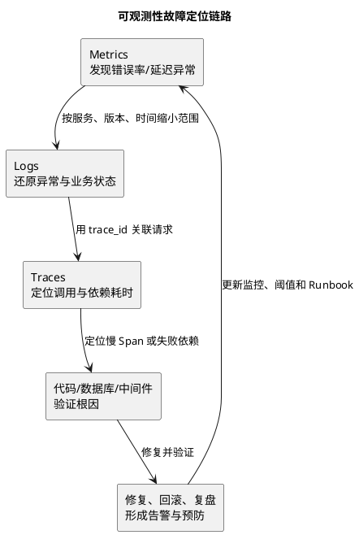

# 可观测性三支柱与故障排查

## 问题索引

- Q1：Metrics、Logs、Traces 如何协同定位线上问题？
- Q2：发现接口变慢后，如何建立证据链而不是只看单个指标？

## Q1：Metrics、Logs、Traces 如何协同定位线上问题？

**一句话结论：** Metrics 负责发现异常和判断影响范围，Logs 负责还原事件细节，Traces 负责定位一次请求经过的组件与耗时；三者通过时间、服务、实例和 TraceId 关联，才能从“系统变慢”走到“哪个依赖、哪条代码、什么根因”。

### 三者解决的问题不同

| 信号 | 最擅长回答 | 典型内容 | 局限 |
| --- | --- | --- | --- |
| Metrics | 什么时候异常、影响多大 | QPS、错误率、P95、CPU、队列堆积 | 难以说明单次请求为什么失败 |
| Logs | 某个事件发生了什么 | 参数摘要、异常栈、状态变更、重试原因 | 结构不统一时难聚合，日志过多成本高 |
| Traces | 请求经过哪里、耗时在哪 | Span、父子调用、远程依赖耗时 | 采样后可能缺失，不能代替业务指标 |

推荐的关联字段包括：`trace_id`、`span_id`、服务名、实例、环境、版本和请求时间。日志中不应记录密码、令牌、完整身份证号等敏感信息；链路字段要在异步消息、线程池和协程切换时正确传递或显式重建。

### 从发现到定位的链路



图中的顺序不是固定的单向流程：已有 TraceId 时可以从日志直接跳到链路，发现数据库连接池耗尽时也可以从指标先查资源和线程栈。关键是每一步都要产生可验证的证据。

## Q2：发现接口变慢后，如何建立证据链而不是只看单个指标？

**一句话结论：** 先确认异常是否真实且影响范围多大，再按入口、应用、依赖和资源层逐层缩小；每一步都记录时间窗口、对照组和验证结果，最后用同一组指标确认恢复。

### 推荐排查路径

1. **确认现象：** 对比 P50/P95/P99、错误率、吞吐量和正常时间段，避免只看平均值掩盖尾延迟。
2. **确认范围：** 按接口、租户、地域、版本、实例和请求类型切分，判断是全局问题还是单实例问题。
3. **查看应用资源：** 检查 CPU、内存、GC、线程池、连接池、队列和限流/熔断状态。
4. **查看 Trace：** 找出耗时最长的 Span，区分应用计算、数据库、缓存、HTTP 或消息依赖。
5. **回到日志和变更：** 用 TraceId 查看异常栈、重试、降级和状态变更，并核对发布、配置和流量变化。
6. **验证假设：** 通过降低流量、回滚配置、切换实例或执行只读诊断确认根因，不要直接把相关性当因果性。
7. **修复与复盘：** 观察同一时间窗口内延迟、错误率和资源指标恢复，再补充告警、采样、容量和 Runbook。

### 例：数据库慢查询导致接口 P99 上升

不能只看到 P99 上升就直接扩大应用实例。更可靠的证据链是：

```text
接口 P99 上升
  -> Trace 显示 DB Span 占比增加
  -> 连接池 active 接近上限、等待时间增加
  -> 慢查询日志与执行计划显示索引失效
  -> 在影子流量或低风险窗口验证索引/SQL
  -> 发布修复并观察 P99、连接池等待和数据库负载
```

如果只有应用延迟指标，没有 TraceId、连接池等待和数据库执行证据，就只能得到“数据库可能有问题”的假设，不能直接得出根因。

### 可观测性建设的取舍

- 指标标签不能无限增加高基数维度；用户 ID 等高基数字段更适合放日志或 Trace，而不是直接作为 Prometheus 标签。
- 错误日志要结构化并分级，重复重试需要采样或聚合，避免故障时日志系统先被打满。
- 全量 Trace 成本较高，可按错误、慢请求、关键链路和采样率保留；采样规则必须覆盖排障需要。
- 告警要有明确的影响、阈值、值班人和 Runbook，避免只告警“CPU 高”而没有行动路径。

## 面试追问

- Q：为什么不能只依赖日志？
  A：日志适合解释事件，但缺少全局趋势和调用拓扑；高并发下还可能采样、丢失或难以聚合。
- Q：为什么 P99 比平均响应时间更重要？
  A：平均值会掩盖少量但严重的慢请求，P99 更能反映尾延迟和用户实际感知，但仍要结合流量与样本量解读。

## 复习清单

- [ ] 能说清 Metrics、Logs、Traces 的职责边界和关联字段。
- [ ] 能按“现象 → 范围 → 资源 → Trace → 日志/变更 → 验证”讲排障流程。
- [ ] 能说明高基数标签、日志成本和 Trace 采样的取舍。
