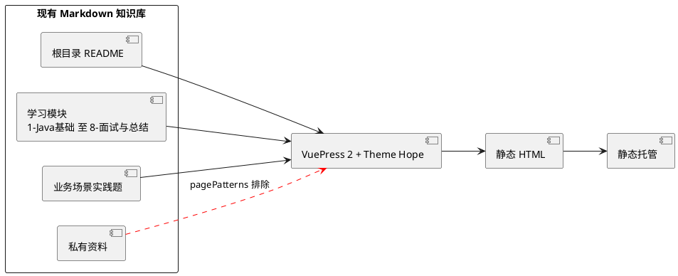

# VuePress 知识库网站模板选型与 PDai 参考

## 问题索引

- Q1：现有 Java 架构师 Markdown 知识库适合使用哪个 VuePress 模板？
- Q2：`pdai.tech` 是否适合直接作为网站模板，以及应借鉴哪些设计？

## Q1：现有 Java 架构师 Markdown 知识库适合使用哪个 VuePress 模板？

### 背景

仓库已经按 Java 基础、框架、架构、性能、DevOps、工程实践、业务场景题和面试总结组织了大量 Markdown，并且已有 PlantUML 图、代码块、目录级 README 和交叉链接。网页化的目标应是提升浏览、检索和复习效率，而不是复制一份内容到另一个 `docs/` 目录后再维护。

本次选型的关键约束如下：

- 保持现有 Markdown 为唯一内容源，避免双份知识库漂移。
- 支持多级目录侧边栏、中文阅读、代码高亮、PlantUML 和响应式布局。
- 优先本地搜索，后续内容规模扩大时可平滑切换到专业搜索服务。
- 默认排除本地私有资料和由其派生的笔记，只公开经过审核的通用技术内容。
- 主题、VuePress 核心版本和 Node.js 版本必须锁定为兼容组合，避免 VuePress 2 RC 版本间的依赖漂移。

### 候选模板对比

| 候选 | 适配能力 | 当前维护信号（2026-08-13） | 风险与取舍 | 结论 |
| --- | --- | --- | --- | --- |
| `vuepress-theme-hope` | 自动侧边栏、目录页、客户端搜索、代码增强、PlantUML、暗色模式和移动端阅读均可覆盖 | npm 最新版为 `2.0.0-rc.107`；GitHub 仓库持续更新，约 2.5k Star | 功能面很广，启用过多博客、评论、PWA 等功能会增加维护和构建复杂度 | **首选**：按需启用知识库所需能力 |
| `vuepress-theme-plume` | 文档和博客双模式、本地全文搜索、自动侧边栏、PlantUML、较现代的阅读体验 | npm 最新版为 `1.0.0-rc.205`；GitHub 仓库持续更新 | 社区规模小于 Hope，且公开 API 仍处于 RC 阶段 | 视觉和博客输出优先时的备选 |
| VuePress 默认主题 | 官方基础导航、侧边栏和 Markdown 渲染 | 与 VuePress 核心同步 | PlantUML、目录页、搜索体验和阅读增强需要自行组合多个插件 | 不建议作为本仓库首期方案 |
| `vuepress-theme-reco`、`vuepress-theme-teadocs` | 有历史用户和基础文档能力 | npm 最新稳定版本分别停留在 2023 年、2022 年 | 与当前 VuePress 2 RC 生态存在较大版本断层 | 不采用 |

### 选型结论

推荐使用 **VuePress 2 + Vite Bundler + `vuepress-theme-hope`**，但把它当作“文档主题 + 按需插件集合”，而不是打开所有功能的博客系统。

它和现有仓库最匹配的原因是：

- 现有知识点主要通过目录和 README 聚合，适合自动侧边栏和目录页，而不需要重做内容模型。
- 已有大量 PlantUML，主题及其配套 Markdown 增强能力可以直接承接；首期只验证并开启 PlantUML、代码复制、目录和搜索。
- 面试题、业务场景题和技术笔记可通过标签、目录页和搜索交叉访问，不必再引入 CMS。
- 主题的功能成熟度和社区规模在 VuePress 2 文档主题中更稳妥，后续需要页面元信息、SEO、站点地图或 PWA 时仍有扩展空间。

`vuepress-theme-plume` 是明确可用的第二选择。若后续网站的重点从“个人复习知识库”转为“对外技术博客 + 更强的文章展示效果”，再切换到 Plume 更合适；首期不应因追求展示效果而增加内容迁移成本。

### 运行时与版本基线

本机当前 Node.js 为 `v24.19.0`，满足 VuePress `2.0.0-rc.30` 的 `>= 22.18.0` 要求。正式初始化统一使用 Node.js 24，CI 也使用相同主版本，避免本地与线上运行时漂移。

第一期应固定一组经过 POC 验证的版本，而不是使用浮动的 `latest`：

| 包 | POC 建议版本 | 说明 |
| --- | --- | --- |
| `vuepress` | `2.0.0-rc.30` | 与 Hope 当前 peer dependency 对齐 |
| `@vuepress/bundler-vite` | `2.0.0-rc.30` | 使用 Vite 构建，避免引入 Webpack 配置负担 |
| `vuepress-theme-hope` | `2.0.0-rc.107` | 当前首选主题版本 |

VuePress 2 和两套候选主题都仍带有 RC 版本标识，因此升级只应在独立分支完成：先执行构建、链接检查、PlantUML 和中文搜索回归，再更新锁文件。

### 建议的网站源目录策略

不要移动或复制现有知识 Markdown。VuePress 的 source 指向仓库根目录，根目录 `README.md` 直接作为网站首页；`.vuepress/` 只保存站点配置、静态资源和样式。通过 `pagePatterns` 明确排除非公开内容。

```ts
pagePatterns: [
  '**/*.md', // 保留现有学习笔记，Markdown 是唯一内容源。
  ...privateContentPatterns, // 私有目录和私有来源笔记不进入公开静态站点。
],
```

#### 内容到静态站点的边界



这个边界让知识笔记仍可被 GitHub、Obsidian 和 VuePress 同时使用；只有站点配置决定哪些 Markdown 能被构建为公开页面。

### 分阶段落地

1. 固定 Node.js 24，并创建 VuePress 配置、依赖锁文件和 `.gitignore` 规则，不迁移任何 Markdown。
2. 用根目录 README 和每个一级模块 README 验证路由、相对链接、自动侧边栏和移动端阅读。
3. 抽取 10 篇含 PlantUML、表格、Java 代码和中文标题的笔记，验证构建、图表渲染、代码复制和中文查询。
4. 再配置一级导航：学习路线、Java 核心、框架与中间件、架构与性能、工程与云原生、场景与面试。
5. 当页面数量和搜索索引明显增大后，再评估 Algolia DocSearch、Meilisearch 等搜索服务；首期不引入外部搜索依赖。

### 踩坑点

- 不要把私有资料作为默认网站页面。即使仓库私有，静态托管配置或构建产物上传失误也会扩大泄露范围。
- 不要直接使用 `latest`。VuePress 2、主题和插件处于不同 RC 节奏，版本未对齐时容易出现 peer dependency 或构建问题。
- 中文搜索必须做真实 POC。中文没有空格分词边界，不能仅凭“支持本地搜索”的宣传判断召回效果；至少验证“死信治理”“分库分表”“数据权限”“缓存一致性”等实际关键词。
- PlantUML 的渲染方式、访问外部服务和产物体积都需要在 POC 中检查。包含内部架构细节的图，不应未经确认发送到第三方渲染端点。
- 首页先复用当前根目录 README。等导航和链接稳定后，再决定是否增加面向读者的首页编排，避免先做视觉改造、后发现内容路由有问题。

## Q2：`pdai.tech` 是否适合直接作为网站模板，以及应借鉴哪些设计？

### 实际检查结果

`pdai.tech` 是一个与本仓库主题高度相关的 Java 全栈知识站点，已实际检查其首页、导读页、`robots.txt` 和站点地图。

- 站点 HTML 的 generator 标记为 `VuePress 2.0.0-beta.53`。
- 首页静态文件响应显示最后修改时间为 2025-03-23。
- 页面使用“顶部技术域导航 + 当前目录侧边栏 + 正文目录”的经典文档布局，并提供导读、面试、资源导航和站点地图入口。
- 公开检索未找到其对应的网站源码模板；能确认的关联公开仓库是 `realpdai/tech-pdai-spring-demos`，它是 Spring 示例项目而不是该网站源码。

因此，`pdai.tech` **适合作为信息架构和阅读体验的参考，不适合被直接复制为项目模板**。其 VuePress beta 版本已经明显落后于当前候选主题的依赖基线，直接复刻会把旧版本和手工配置一并带入新站点。

### 可借鉴的设计

- 让顶栏只承担一级技术域切换，文章级导航交给左侧边栏，避免顶栏堆积所有笔记链接。
- 保留“导读/学习路线”和“场景/面试”这类跨技术域入口，使复习不只依赖目录树。
- 对大类页面建立可扫描的专题入口，而不是让读者从文件名开始查找知识点。
- 提供站点地图、搜索、暗色模式和移动端折叠侧边栏，服务长期阅读而非一次性展示。

本仓库可以把顶栏收敛为六组：`学习路线`、`Java 核心`、`框架与中间件`、`架构与性能`、`工程与云原生`、`场景与面试`。未经审核的内部资料不放入公开导航。

### 不应复制的部分

- 不复制其内容、品牌、页面 URL 结构、广告、统计脚本或定制 CSS。
- 不继续使用其 VuePress `beta.53` 技术基线。
- 不把复杂的多层下拉菜单原样搬过来；仓库已有清晰的一级目录，应让目录和搜索承担细粒度定位。

## 面试追问

- Q：为什么不直接复制一份 Markdown 到 `docs/` 再发布？
  A：复制后会形成“本地笔记”和“网页文档”两套内容源，链接、更新时间和知识修订极易漂移。直接以仓库根目录为 VuePress source，并用构建规则控制公开范围，维护成本更低。

- Q：为什么优先 VuePress Theme Hope 而不是从零开发主题？
  A：现有需求是知识库阅读和检索，不是独特的交互产品。成熟主题已覆盖目录、搜索、图表、代码和移动端；首期只做少量样式定制，把时间投入到知识内容和信息架构更有价值。

- Q：静态站点的搜索何时需要升级？
  A：当本地索引导致首屏加载、构建时长或中文检索召回无法接受时，再通过监控的索引大小、构建时间和检索样例决定是否迁移到 Algolia DocSearch 或自建搜索服务。

## 复习清单

- [x] 能说明为什么选择 VuePress Theme Hope 作为首选。
- [x] 能说明 `pdai.tech` 只借鉴信息架构、不复制技术基线的原因。
- [x] 能完成 Node.js 升级和固定版本的 VuePress POC。
- [ ] 能验证 PlantUML、中文搜索、相对链接和移动端侧边栏。
- [ ] 能确认公开页面不包含私有资料。

## 参考资料

- [VuePress 官方主题说明](https://v2.vuepress.vuejs.org/guide/theme.html)
- [VuePress Theme Hope 文档](https://vuepress-theme-hope.github.io/v2/guide/intro/intro.html)
- [VuePress Theme Plume 文档](https://theme-plume.vuejs.press/guide/intro/)
- [PDai Java 全栈知识体系](https://pdai.tech/)
- [PDai Spring 示例仓库](https://github.com/realpdai/tech-pdai-spring-demos)
