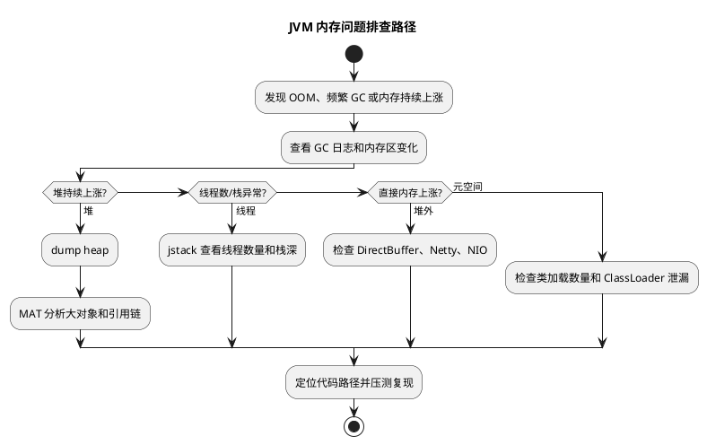

# JVM 内存问题排查实践

## 问题索引

- Q1：详细说一下 JVM 内存问题排查思路，具体执行什么命令，执行命令后需要观察什么才能发现对应的问题

## Q1：详细说一下 JVM 内存问题排查思路，具体执行什么命令，执行命令后需要观察什么才能发现对应的问题

### 背景

线上 JVM 内存问题不能只停留在“看堆、看 GC、导 dump”这种口号层面。真正排查时，需要先判断问题属于哪一类：

- 堆内存泄漏。
- 对象分配过快导致频繁 Young GC。
- 老年代增长导致 Full GC。
- 元空间膨胀。
- 直接内存或 Netty 堆外内存过高。
- 线程过多导致线程栈占用过高。
- 容器内存限制与 JVM 参数不匹配。

排查原则是：先确认现象，再定位区域，最后找对象、线程或代码入口。

### 总体排查路径


### PlantUML 示意图：JVM 内存问题排查决策树



```text
确认进程和 JVM 参数
  -> 看 GC 概况和内存分区变化
  -> 判断是 Young GC 频繁、Full GC 频繁还是堆外内存异常
  -> 按问题类型导出 heap dump / thread dump / native memory
  -> 找大对象、引用链、线程数量、直接内存、元空间
  -> 回到业务代码确认缓存、集合、批量任务、大对象、线程池、第三方组件
```

### 第一步：定位 Java 进程

#### 命令

```bash
jps -lv
```

#### 观察什么

重点看：

- 目标 Java 进程的 PID。
- 启动主类或 jar 包名称。
- JVM 参数，例如 `-Xms`、`-Xmx`、`-XX:MaxMetaspaceSize`、`-XX:MaxDirectMemorySize`、GC 收集器参数。

#### 如何判断问题

如果看到这些情况，要提高警惕：

- `-Xmx` 接近容器 memory limit，可能没有给堆外内存、线程栈、元空间留空间。
- 没有设置 `MaxMetaspaceSize`，动态类加载异常时元空间可能持续增长。
- 没有开启 GC 日志，后续追溯 GC 问题会比较困难。
- 容器环境中 JVM 版本较老，可能没有正确识别容器内存限制。

### 第二步：查看 JVM 参数和运行时配置

#### 命令

```bash
jcmd <pid> VM.flags
jcmd <pid> VM.command_line
jinfo -flags <pid>
```

#### 观察什么

重点看：

- 堆大小：`-Xms`、`-Xmx`。
- 新生代或 G1 参数：`MaxGCPauseMillis`、`InitiatingHeapOccupancyPercent`。
- 元空间：`MetaspaceSize`、`MaxMetaspaceSize`。
- 直接内存：`MaxDirectMemorySize`。
- 线程栈：`-Xss`。
- GC 收集器：`UseG1GC`、`UseParallelGC`、`UseConcMarkSweepGC` 等。

#### 如何判断问题

- `Xmx` 太小：业务对象稍多就会频繁 GC。
- `Xmx` 太大且接近容器上限：容易被容器 OOM Kill，因为堆外内存没有空间。
- `Xss` 太大：线程多时线程栈总占用会很高。
- `MaxMetaspaceSize` 没有限制：类加载泄漏时可能拖垮进程。
- G1 的 `MaxGCPauseMillis` 设置过小：可能导致 GC 过于频繁，吞吐下降。

### 第三步：看 GC 和各内存区实时变化

#### 命令

```bash
jstat -gcutil <pid> 1000 10
jstat -gc <pid> 1000 10
```

#### 观察什么

`jstat -gcutil` 重点看：

| 指标 | 含义 | 观察重点 |
|---|---|---|
| S0 / S1 | Survivor 使用率 | 是否长期接近 100% |
| E | Eden 使用率 | 是否快速打满 |
| O | 老年代使用率 | 是否持续上涨 |
| M | 元空间使用率 | 是否持续上涨 |
| YGC | Young GC 次数 | 是否增长很快 |
| YGCT | Young GC 总耗时 | 是否持续增加 |
| FGC | Full GC 次数 | 是否出现或频繁增加 |
| FGCT | Full GC 总耗时 | 是否耗时很高 |
| GCT | GC 总耗时 | 是否占比过高 |

`jstat -gc` 重点看各区容量和使用量，方便判断是空间太小还是对象太多。

#### 如何判断问题

Young GC 频繁：

- `E` 很快从低位涨到高位。
- `YGC` 快速增加。
- `O` 不一定明显上涨。
- 常见原因是短生命周期对象创建太快，例如循环里大量创建临时对象、批量转换 DTO、JSON 序列化过重。

老年代压力大：

- `O` 持续上涨，Young GC 后也降不下来。
- `FGC` 开始增加。
- Full GC 后 `O` 下降不明显。
- 常见原因是缓存不释放、静态集合持有对象、任务队列堆积、大查询结果长期被引用。

元空间问题：

- `M` 持续上涨。
- 可能伴随 Full GC。
- 常见原因是动态代理类过多、Groovy/脚本动态加载、频繁创建 ClassLoader。

### 第四步：查看 GC 日志

#### JDK 8 命令和参数

如果已经开启 GC 日志，直接查看：

```bash
tail -f /path/to/gc.log
```

常见启动参数：

```bash
-XX:+PrintGCDetails -XX:+PrintGCDateStamps -Xloggc:/path/to/gc.log
```

#### JDK 9+ 参数

```bash
-Xlog:gc*,safepoint:file=/path/to/gc.log:time,uptime,level,tags
```

#### 观察什么

重点看：

- GC 类型：Young GC、Mixed GC、Full GC。
- GC 原因：Allocation Failure、Metadata GC Threshold、System.gc()、G1 Evacuation Pause。
- GC 前后内存变化：回收前多大，回收后多大。
- 单次暂停时间：是否超过接口 SLA。
- Full GC 是否频繁。
- G1 是否出现 To-space exhausted、Evacuation Failure、Humongous allocation。

#### 如何判断问题

- Young GC 很频繁但每次能回收很多：对象分配速率高，优先优化临时对象和批处理大小。
- Full GC 后老年代下降很少：大概率有内存泄漏或长生命周期对象过多。
- Full GC 原因是 Metadata GC Threshold：重点查元空间和类加载。
- G1 出现 Humongous allocation：重点查大对象，例如超大数组、大字符串、大 JSON、一次性查询过多数据。
- `System.gc()` 触发频繁：检查代码、第三方库或 RMI 是否显式调用。

### 第五步：查看堆对象概况

#### 命令

```bash
jmap -histo:live <pid> | head -n 50
```

如果 `head` 不可用，可以输出到文件：

```bash
jmap -histo:live <pid> > histo.txt
```

#### 观察什么

重点看：

- 哪些类实例数量最多。
- 哪些类占用字节数最大。
- 是否有业务对象异常堆积。
- 是否有集合类异常多，例如 `HashMap$Node`、`ArrayList`、`ConcurrentHashMap$Node`。
- 是否有大量 `byte[]`、`char[]`、`String`。

#### 如何判断问题

- 大量业务 DTO / Entity：可能是批量查询、缓存、队列堆积。
- 大量 `byte[]`：可能是文件处理、图片、网络缓冲、序列化、压缩数据。
- 大量 `char[]` / `String`：可能是 JSON、日志拼接、字符串缓存、大文本。
- 大量 `HashMap$Node`：可能是 Map 缓存无限增长。
- 大量代理类相关对象：可能是动态代理或类加载问题。

注意：`jmap -histo:live` 会触发一次 Full GC 来统计存活对象，生产高峰期要谨慎执行。

### 第六步：导出 heap dump 分析引用链

#### 命令

```bash
jmap -dump:live,format=b,file=/tmp/heap.hprof <pid>
```

或者：

```bash
jcmd <pid> GC.heap_dump /tmp/heap.hprof
```

#### 观察什么

用 MAT、JProfiler、VisualVM 打开 dump，重点看：

- Dominator Tree：谁占用 Retained Heap 最大。
- Leak Suspects：工具推测的泄漏嫌疑。
- Path to GC Roots：对象为什么没有被回收。
- 大集合内部元素数量。
- 大对象的业务字段，例如租户、订单、用户、批次号。

#### 如何判断问题

如果某个对象 Retained Heap 很大，说明它间接持有了大量对象。

典型判断：

- `static Map` 持有大量对象：静态缓存未淘汰。
- `ThreadLocalMap` 持有业务对象：ThreadLocal 使用后没有 remove。
- `BlockingQueue` 持有任务对象：消费慢或线程池阻塞。
- `ArrayList` 持有大量查询结果：一次性加载太多数据。
- `ClassLoader` 无法释放：热部署、插件、脚本导致类加载器泄漏。

### 第七步：查看线程和线程栈内存

#### 命令

```bash
jstack -l <pid> > thread.txt
```

Linux 下查看线程数：

```bash
ps -o nlwp <pid>
```

或者：

```bash
top -H -p <pid>
```

#### 观察什么

重点看：

- 线程数量是否异常。
- 是否有大量同名业务线程。
- 是否有大量 WAITING / TIMED_WAITING / BLOCKED。
- 是否存在线程池创建过多。
- 是否有递归调用导致栈很深。
- 是否有死锁信息。

#### 如何判断问题

- 线程数很多且 `-Xss` 较大：线程栈会占用大量进程内存。
- 大量业务线程 WAITING：可能线程池没有复用，或者任务设计有问题。
- 大量 BLOCKED：锁竞争严重，可能导致请求堆积，间接造成内存上涨。
- 栈里出现深递归：可能导致 `StackOverflowError`。
- 线程池队列堆积：任务对象被队列持有，可能表现为堆内存上涨。

### 第八步：排查直接内存和堆外内存

#### 命令

先确认是否开启 Native Memory Tracking：

```bash
jcmd <pid> VM.native_memory summary
```

如果未开启，需要启动时增加：

```bash
-XX:NativeMemoryTracking=summary
```

或更详细：

```bash
-XX:NativeMemoryTracking=detail
```

#### 观察什么

重点看：

- Java Heap：堆。
- Class：类元信息。
- Thread：线程栈。
- Code：JIT Code Cache。
- GC：GC 自身数据结构。
- Internal：JVM 内部结构。
- Symbol：符号表。
- NIO / Direct Buffer 相关占用。

还可以结合系统命令：

```bash
pmap -x <pid> | tail -n 20
```

```bash
cat /proc/<pid>/status
```

重点看 `VmRSS`、`VmSize`、`Threads`。

#### 如何判断问题

- Java Heap 不高，但进程 RSS 很高：优先怀疑直接内存、线程栈、元空间、Code Cache。
- Thread 占用高：线程数过多或 `-Xss` 过大。
- Class 占用高：元空间或类加载问题。
- NIO/Direct 占用高：Netty、NIO、文件传输、DirectByteBuffer 未释放。
- 容器 OOM 但堆没满：通常是堆外内存和容器限制没算清楚。

### 第九步：容器环境额外检查

#### 命令

```bash
cat /sys/fs/cgroup/memory/memory.limit_in_bytes
cat /sys/fs/cgroup/memory/memory.usage_in_bytes
```

cgroup v2 常见路径：

```bash
cat /sys/fs/cgroup/memory.max
cat /sys/fs/cgroup/memory.current
```

Kubernetes 中查看：

```bash
kubectl top pod <pod-name> -n <namespace>
kubectl describe pod <pod-name> -n <namespace>
```

#### 观察什么

重点看：

- Pod memory limit。
- 当前 memory usage。
- 是否发生 OOMKilled。
- JVM `-Xmx` 是否太接近容器 limit。
- 是否还有足够空间留给元空间、线程栈、直接内存、Code Cache。

#### 如何判断问题

如果容器 limit 是 2G，而 `-Xmx` 设置为 1800M，风险很高。因为除了堆，还有：

- 元空间。
- 线程栈。
- 直接内存。
- JIT Code Cache。
- JVM 内部结构。
- 操作系统和基础库开销。

实战中通常要给堆外留出一定余量，而不是把容器内存几乎全部分给堆。

### 第十步：按现象快速定位

#### 现象一：Young GC 很频繁

执行：

```bash
jstat -gcutil <pid> 1000 10
jmap -histo:live <pid> | head -n 50
```

看什么：

- `YGC` 是否快速增长。
- Eden 是否快速打满。
- 大量短生命周期对象是什么类型。

常见原因：

- 接口返回对象过大。
- 批量查询一次加载太多。
- JSON 序列化临时对象多。
- 循环里重复创建对象。

处理方向：

- 控制批量大小。
- 减少无意义 DTO 转换。
- 优化序列化方式。
- 对热点对象复用或延迟创建。

#### 现象二：Full GC 频繁

执行：

```bash
jstat -gcutil <pid> 1000 10
jmap -dump:live,format=b,file=/tmp/heap.hprof <pid>
```

看什么：

- `FGC` 是否增长。
- Full GC 后老年代是否下降明显。
- MAT 中 Retained Heap 最大的是谁。
- Path to GC Roots 显示谁持有对象。

常见原因：

- 缓存没有淘汰。
- 静态集合持有对象。
- ThreadLocal 未清理。
- 队列积压。
- 大查询结果长期引用。

处理方向：

- 缓存增加过期和容量限制。
- ThreadLocal 使用后 `remove`。
- 队列设置长度和拒绝策略。
- 大查询改分页、流式处理。

#### 现象三：堆不高但容器 OOM

执行：

```bash
jcmd <pid> VM.native_memory summary
cat /proc/<pid>/status
```

看什么：

- RSS 是否远高于 Java Heap。
- Thread、Class、Code、Internal、NIO 是否异常。
- `Threads` 数量是否过多。

常见原因：

- DirectByteBuffer 或 Netty 堆外内存高。
- 线程数太多。
- 元空间增长。
- `-Xmx` 太接近容器 limit。

处理方向：

- 限制直接内存：`-XX:MaxDirectMemorySize`。
- 控制线程池数量和 `-Xss`。
- 设置 `-XX:MaxMetaspaceSize`。
- 下调 `-Xmx`，给堆外留空间。

#### 现象四：元空间 OOM

执行：

```bash
jstat -gcutil <pid> 1000 10
jcmd <pid> VM.classloader_stats
jcmd <pid> GC.class_histogram
```

看什么：

- `M` 是否持续上涨。
- ClassLoader 数量是否异常。
- 某些动态生成类是否很多。

常见原因：

- 动态代理类过多。
- 频繁创建 ClassLoader。
- 脚本引擎或热部署没有释放类加载器。
- CGLIB、Javassist、Groovy 使用不当。

处理方向：

- 复用 ClassLoader。
- 控制动态类生成数量。
- 设置 `MaxMetaspaceSize`。
- 排查热部署或插件卸载逻辑。

### 面试话术

> 排查 JVM 内存问题时，我会先用 `jps -lv` 定位进程和启动参数，再用 `jstat -gcutil` 看 Young GC、Full GC、老年代和元空间的变化趋势。如果 Young GC 很频繁但老年代不涨，通常是对象分配速率太高；如果老年代持续上涨并且 Full GC 后下降不明显，就会导出 heap dump，用 MAT 看 Dominator Tree 和 Path to GC Roots，定位是缓存、静态集合、ThreadLocal 还是队列持有。如果堆不高但进程 RSS 很高，我会用 `jcmd VM.native_memory summary` 和 `/proc/<pid>/status` 看直接内存、线程栈、元空间和 Code Cache。容器环境还要检查 memory limit 和 `-Xmx` 的比例，避免堆设置太大导致堆外没有余量。

## 高频追问

- Q：生产环境能不能直接执行 `jmap -dump`？
  A：可以，但要谨慎。dump 可能造成 STW，并产生很大的文件。高峰期建议先用 `jstat`、GC 日志、`jmap -histo` 初步判断，必要时在低峰或故障现场导出。

- Q：`jmap -histo:live` 有什么风险？
  A：`live` 会触发 Full GC，只统计存活对象。它更准确，但生产高峰期可能造成明显停顿。

- Q：Full GC 后老年代下降很多说明什么？
  A：说明有大量对象可以被回收，可能是瞬时对象晋升或阶段性任务导致；如果 Full GC 后下降很少，更像内存泄漏或长期引用。

- Q：堆 dump 里最重要看什么？
  A：先看 Dominator Tree 的 Retained Heap，再看 Path to GC Roots，确认大对象为什么还活着。

- Q：容器 OOM 和 Java OOM 有什么区别？
  A：Java OOM 是 JVM 内部某个区域分配失败并抛异常；容器 OOM 是进程总内存超过容器限制，被操作系统或 kubelet 杀掉，堆可能并没有满。

## 复习清单

- [ ] 能根据 `jstat` 判断 Young GC 频繁还是 Full GC 频繁
- [ ] 能说明 GC 日志中要看 GC 类型、原因、前后内存和停顿时间
- [ ] 能用 `jmap -histo` 初步判断大对象类型
- [ ] 能用 heap dump 的 Dominator Tree 和 GC Roots 找引用链
- [ ] 能解释堆不高但 RSS 高的排查方向
- [ ] 能说清容器内存 limit 和 `-Xmx` 的关系

