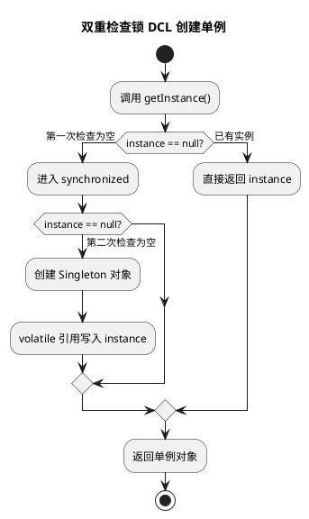

# 单例模式实践题

## 问题索引

- Q1：写一个单例模式，饿汉式、懒汉式

## Q1：写一个单例模式，饿汉式、懒汉式

### 题目要求

请写出 Java 单例模式的常见实现，包括：

1. 饿汉式。
2. 懒汉式。
3. 懒汉式线程安全版本。
4. 双重检查锁 DCL。
5. 静态内部类。
6. 枚举单例。

说明各自适用场景、线程安全性和风险点。

这里用户提到的“饱汉”，按常见面试语境理解为“懒汉式”：需要时才创建对象。

### 业务背景

单例模式适合全局只需要一个实例的对象，例如：

- 配置管理器。
- 本地缓存管理器。
- ID 生成器。
- 线程池管理器。
- 规则引擎上下文。

但要注意：单例对象不要随便保存请求级可变状态，否则在多线程环境下容易互相污染。

### 核心原理

单例模式要解决三个问题：

1. 构造方法私有化，禁止外部随意 new。
2. 类内部持有唯一实例。
3. 对外提供全局访问入口。

多线程场景下，还要保证：

1. 不会创建多个实例。
2. 其他线程能看到已经初始化完成的对象。
3. 初始化过程不会因为指令重排被其他线程看到半初始化对象。

### 方案一：饿汉式

饿汉式是在类加载时就创建实例。

```java
public class EagerSingleton {
    // 类加载时直接创建唯一实例。
    // final 保证引用不可变，类加载机制保证初始化过程线程安全。
    private static final EagerSingleton INSTANCE = new EagerSingleton();

    // 私有构造方法，禁止外部 new。
    private EagerSingleton() {
    }

    public static EagerSingleton getInstance() {
        return INSTANCE;
    }
}
```

优点：

- 实现简单。
- 类加载机制天然保证线程安全。
- 获取实例时没有锁开销。

缺点：

- 类加载时就创建对象，即使后续不用也会占用资源。
- 如果实例初始化很重，会拖慢类加载或应用启动。

适用场景：

- 对象很轻量。
- 一定会被使用。
- 初始化过程不依赖复杂外部资源。

### 方案二：普通懒汉式

懒汉式是在第一次使用时才创建实例。

```java
public class LazySingletonUnsafe {
    private static LazySingletonUnsafe instance;

    private LazySingletonUnsafe() {
    }

    public static LazySingletonUnsafe getInstance() {
        if (instance == null) {
            // 多线程同时进入这里时，可能创建多个实例。
            instance = new LazySingletonUnsafe();
        }
        return instance;
    }
}
```

优点：

- 延迟加载，第一次使用时才创建。

缺点：

- 线程不安全。
- 多线程并发调用 `getInstance()` 时可能创建多个对象。

适用场景：

- 单线程环境。
- 或者外部已经保证初始化阶段没有并发访问。

### 方案三：同步方法懒汉式

给 `getInstance()` 加 `synchronized` 可以保证线程安全。

```java
public class LazySingletonSynchronized {
    private static LazySingletonSynchronized instance;

    private LazySingletonSynchronized() {
    }

    public static synchronized LazySingletonSynchronized getInstance() {
        if (instance == null) {
            // synchronized 保证同一时刻只有一个线程能进入方法创建实例。
            instance = new LazySingletonSynchronized();
        }
        return instance;
    }
}
```

优点：

- 线程安全。
- 写法简单。

缺点：

- 每次获取实例都要进入同步方法。
- 实例创建完成后，锁仍然存在，性能不如 DCL 或静态内部类。

适用场景：

- 获取频率不高。
- 更看重简单正确，而不是极致性能。

### 方案四：双重检查锁 DCL


### PlantUML 示意图：DCL 单例创建过程



DCL 是懒加载和性能之间的折中。

```java
public class LazySingletonDcl {
    // volatile 很关键：
    // 1. 保证 instance 对其他线程可见。
    // 2. 禁止 new 对象过程中的指令重排，避免其他线程拿到半初始化对象。
    private static volatile LazySingletonDcl instance;

    private LazySingletonDcl() {
    }

    public static LazySingletonDcl getInstance() {
        if (instance == null) {
            // 第一次检查：实例已经创建后，后续调用可以直接返回，避免加锁。
            synchronized (LazySingletonDcl.class) {
                if (instance == null) {
                    // 第二次检查：防止多个线程排队进入 synchronized 后重复创建实例。
                    instance = new LazySingletonDcl();
                }
            }
        }
        return instance;
    }
}
```

为什么需要第二次检查：

```text
线程 A、B 同时看到 instance == null
A 先进入 synchronized 创建实例
B 等 A 释放锁后进入 synchronized
如果没有第二次检查，B 会再次创建实例
```

为什么需要 `volatile`：

`new LazySingletonDcl()` 不是一个不可拆分的原子动作，大致可以理解为：

```text
1. 分配内存
2. 调用构造方法初始化对象
3. 把引用赋值给 instance
```

如果没有 `volatile`，步骤 2 和 3 可能发生重排。其他线程可能看到 `instance != null`，但对象还没初始化完成。

### 方案五：静态内部类

静态内部类是更推荐的懒加载单例写法。

```java
public class HolderSingleton {
    private HolderSingleton() {
    }

    private static class Holder {
        // Holder 类只有在 getInstance 调用时才会被加载。
        // 类加载过程由 JVM 保证线程安全。
        private static final HolderSingleton INSTANCE = new HolderSingleton();
    }

    public static HolderSingleton getInstance() {
        return Holder.INSTANCE;
    }
}
```

优点：

- 懒加载。
- 线程安全。
- 没有显式加锁。
- 代码比 DCL 更简洁。

适用场景：

- 普通 Java 项目中实现懒加载单例的优先选择。

### 方案六：枚举单例

枚举单例是《Effective Java》推荐的写法。

```java
public enum EnumSingleton {
    INSTANCE;

    public String getConfig(String key) {
        // 枚举单例中也可以定义业务方法。
        return "value-of-" + key;
    }
}
```

优点：

- 写法最简洁。
- 天然线程安全。
- 天然防止反序列化破坏单例。
- 对反射攻击也有更强防护。

缺点：

- 不支持懒加载到同样细粒度的控制。
- 有些团队不习惯把业务单例写成 enum。

### 业务场景示例：配置中心客户端

假设项目中需要一个本地配置读取器，配置读取器初始化成本不高，且全局只需要一个实例，可以使用静态内部类。

```java
public class LocalConfigManager {
    private final Map<String, String> configMap = new ConcurrentHashMap<>();

    private LocalConfigManager() {
        // 构造方法中只做轻量初始化，避免单例创建时阻塞太久。
        configMap.put("app.name", "demo-service");
    }

    private static class Holder {
        // 第一次调用 getInstance 时才初始化 Holder，从而实现懒加载。
        private static final LocalConfigManager INSTANCE = new LocalConfigManager();
    }

    public static LocalConfigManager getInstance() {
        return Holder.INSTANCE;
    }

    public String getConfig(String key) {
        // 这里不保存请求级状态，只读取全局配置，适合单例。
        return configMap.get(key);
    }
}
```

### 踩坑点

#### 单例不等于线程安全业务对象

单例只保证实例数量唯一，不保证内部状态操作线程安全。

如果单例里有可变字段，例如 `HashMap`、计数器、当前用户信息，就要额外考虑并发安全。

#### 不要保存请求级状态

错误示例：

```java
public class BadUserContext {
    private static final BadUserContext INSTANCE = new BadUserContext();

    // 错误：单例对象被所有线程共享，保存当前用户会导致请求之间互相覆盖。
    private Long currentUserId;
}
```

请求级状态应该放到方法参数、局部变量、`ThreadLocal` 或请求上下文中。

#### 反射和反序列化可能破坏普通单例

普通私有构造方法可以被反射强行调用。实现 `Serializable` 的单例如果不处理 `readResolve`，反序列化也可能生成新对象。

枚举单例在这方面更稳。

### 面试话术

可以这样回答：

> 单例模式的核心是构造方法私有化、类内部持有唯一实例、对外提供全局访问点。饿汉式在类加载时创建实例，线程安全、实现简单，但不支持真正懒加载。普通懒汉式第一次使用时创建，但多线程下不安全；同步方法懒汉式安全但每次获取都有锁开销。双重检查锁通过两次判空减少锁开销，但 instance 必须加 volatile，防止指令重排导致半初始化对象被看到。更推荐静态内部类写法，既懒加载又利用类加载机制保证线程安全。枚举单例最简洁，也能防止反射和反序列化破坏单例。实际项目中，单例适合配置管理器、线程池管理器、本地缓存等，但不要在单例里保存请求级可变状态。

## 高频追问

- Q：饿汉式为什么线程安全？
  A：实例在类加载阶段创建，JVM 类加载和类初始化过程天然保证线程安全。

- Q：普通懒汉式为什么线程不安全？
  A：多个线程可能同时判断 `instance == null`，然后分别创建实例。

- Q：DCL 为什么要加 volatile？
  A：防止对象创建过程中的指令重排，避免其他线程拿到半初始化对象，同时保证 instance 引用可见。

- Q：静态内部类为什么能懒加载？
  A：外部类加载时不会立即加载内部 Holder 类，只有调用 `getInstance()` 访问 Holder 时才触发 Holder 初始化。

- Q：枚举单例有什么优势？
  A：写法简单，线程安全，并且天然抵抗反序列化和大部分反射破坏。

- Q：Spring Bean 默认单例和设计模式单例一样吗？
  A：不完全一样。设计模式单例通常是 JVM 级或类级控制一个实例；Spring 默认单例是容器级单例，一个 Spring 容器中一个 BeanName 对应一个实例。

## 复习清单

- [ ] 能手写饿汉式单例
- [ ] 能手写普通懒汉式并指出线程不安全
- [ ] 能手写同步方法懒汉式
- [ ] 能手写 DCL 并解释 volatile
- [ ] 能手写静态内部类单例
- [ ] 能说明枚举单例的优势
- [ ] 能结合业务说明单例不应保存请求级状态

