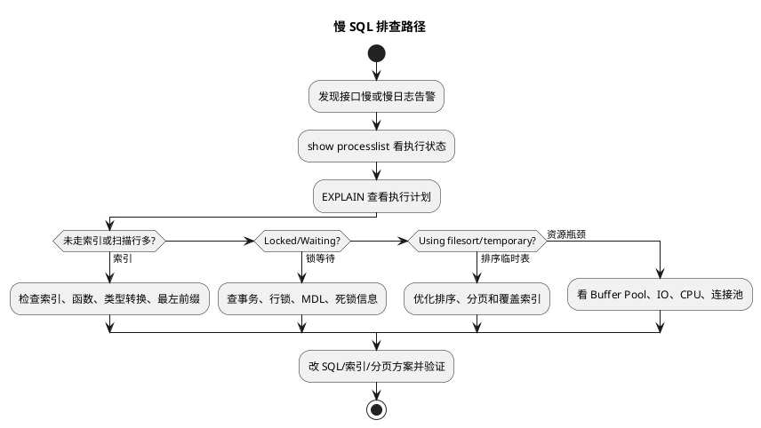

# 慢 SQL 排查与优化实践

## 问题索引

- Q1：业务场景实践题：如何排查慢 SQL 并分析解决？

## Q1：业务场景实践题：如何排查慢 SQL 并分析解决？


### PlantUML 示意图：慢 SQL 排查决策路径



### 背景

线上接口突然变慢，很多时候表现为：

- 接口 P95 / P99 上升。
- 数据库 CPU 或 IO 飙高。
- 连接池等待连接。
- 某些 SQL 执行时间明显变长。
- 偶发超时，而不是所有请求都慢。

排查慢 SQL 不能只看 SQL 文本，要按链路拆：

```text
应用接口
  -> 数据库连接池
  -> MySQL 当前执行
  -> 慢 SQL 日志
  -> 执行计划
  -> 锁等待 / 事务
  -> Buffer Pool / IO / CPU
  -> 索引、SQL、表结构和业务方案优化
```

### 第一步：确认是不是数据库慢

#### 应用侧日志

先看接口耗时和 SQL 耗时是否匹配。

如果项目有 SQL 日志或链路追踪，先定位慢 SQL：

```text
接口总耗时 1800ms
  -> Java 业务逻辑 100ms
  -> SQL 查询 1600ms
  -> 序列化 / 网络 100ms
```

表现判断：

| 现象 | 说明 |
| --- | --- |
| 接口慢，SQL 不慢 | 可能是外部调用、锁竞争、线程池、序列化、GC |
| SQL 慢，接口也慢 | 重点查数据库、SQL 执行计划、锁等待 |
| 单次 SQL 不慢，但执行次数很多 | 可能是 N+1 查询 |

#### Arthas 定位 Mapper 耗时

```bash
trace com.xxx.service.OrderService list '#cost > 100'
```

关注：

- 哪个方法耗时最高。
- Mapper 方法是否被循环调用。
- 同一个 SQL 是否执行几十次、几百次。

如果看到：

```text
OrderMapper.selectList cost 80ms
CustomerMapper.selectById cost 5ms * 100 次
```

这通常不是单条 SQL 慢，而是 N+1 查询。

解决方向：

- 改批量查询。
- 使用 join。
- 先查列表，再按 ID 集合一次查关联数据。
- 对低变更维表做缓存。

### 第二步：打开和查看慢 SQL 日志

#### 查看慢日志配置

```sql
show variables like 'slow_query_log';
show variables like 'slow_query_log_file';
show variables like 'long_query_time';
show variables like 'log_queries_not_using_indexes';
```

关注：

| 配置 | 看什么 |
| --- | --- |
| `slow_query_log` | 是否开启慢日志 |
| `slow_query_log_file` | 慢日志文件位置 |
| `long_query_time` | 超过多少秒记录 |
| `log_queries_not_using_indexes` | 是否记录未使用索引 SQL |

#### 临时开启慢日志

```sql
set global slow_query_log = 'ON';
set global long_query_time = 1;
set global log_queries_not_using_indexes = 'ON';
```

注意：

- `set global` 只影响新连接。
- 生产环境不要长时间打开过低阈值，否则日志量可能很大。
- 排查结束后要恢复配置。

#### 分析慢日志

如果有 `mysqldumpslow`：

```bash
mysqldumpslow -s t -t 10 /var/lib/mysql/slow.log
```

关注：

- `-s t`：按总耗时排序。
- `-t 10`：取前 10 条。

如果有 `pt-query-digest`：

```bash
pt-query-digest /var/lib/mysql/slow.log
```

重点看：

- 总耗时最高的 SQL。
- 平均耗时最高的 SQL。
- 执行次数最高的 SQL。
- Rows examined 和 Rows sent 的比例。

表现判断：

| 现象 | 可能问题 |
| --- | --- |
| Query_time 高，Rows_examined 高 | 索引差、全表扫描、过滤条件差 |
| Query_time 高，Rows_examined 低 | 可能是锁等待、IO 抖动、网络返回慢 |
| 执行次数特别高，单次不慢 | 高频 SQL，要考虑缓存、合并、限流 |
| Rows_examined 远大于 Rows_sent | 扫描大量无效数据，索引或条件需要优化 |

### 第三步：查看当前正在慢的 SQL

#### show processlist

```sql
show full processlist;
```

关注字段：

| 字段 | 看什么 |
| --- | --- |
| `Id` | 连接 ID，必要时可 kill |
| `User` | 来源用户 |
| `Host` | 来源应用机器 |
| `db` | 访问哪个库 |
| `Command` | Query / Sleep 等 |
| `Time` | 当前状态持续多久 |
| `State` | 当前在做什么 |
| `Info` | 正在执行的 SQL |

不同表现：

| State / 现象 | 含义 |
| --- | --- |
| 大量 `Sleep` | 连接未释放或连接池配置不合理 |
| `Sending data` 时间长 | 可能在扫描、过滤、排序或返回大量数据 |
| `Copying to tmp table` | 可能使用临时表，group by / order by 成本高 |
| `Creating sort index` | 排序成本高，可能没有合适索引 |
| `Waiting for table metadata lock` | 等元数据锁，常见于 DDL 或长事务阻塞 |
| `Locked` / waiting | 可能有锁等待 |

#### information_schema 当前事务

```sql
select * from information_schema.innodb_trx\G
```

关注：

- `trx_id`：事务 ID。
- `trx_state`：事务状态。
- `trx_started`：事务开始时间。
- `trx_mysql_thread_id`：对应 processlist 的 Id。
- `trx_query`：事务正在执行的 SQL。

表现判断：

| 现象 | 说明 |
| --- | --- |
| 存在运行很久的事务 | 可能持有锁、阻碍 undo 清理、影响 MVCC |
| `trx_query` 为空但事务很久 | 可能应用开启事务后未提交，连接空闲但事务未结束 |

### 第四步：看执行计划

#### EXPLAIN

```sql
EXPLAIN
select id, order_no, status
from orders
where dealer_id = 1001
  and order_date >= '2026-06-01'
order by order_date desc
limit 20;
```

重点字段：

| 字段 | 关注点 |
| --- | --- |
| `type` | 访问类型，`ALL` 通常危险，`ref/range/const` 更好 |
| `possible_keys` | 理论可用索引 |
| `key` | 实际使用索引 |
| `key_len` | 使用了索引的多少部分 |
| `rows` | 预估扫描行数 |
| `filtered` | 过滤后剩余比例 |
| `Extra` | filesort、temporary、using index 等 |

表现判断：

| 表现 | 可能问题 |
| --- | --- |
| `type = ALL` | 全表扫描，缺索引或索引失效 |
| `possible_keys` 有值但 `key = NULL` | 优化器认为索引成本高，或条件写法导致不能用 |
| `rows` 很大 | 扫描量大，需要优化索引或缩小条件 |
| `Using filesort` | 排序没利用索引，可能需要联合索引 |
| `Using temporary` | group by / distinct / order by 产生临时表 |
| `Using index` | 覆盖索引，通常是好现象 |
| `Using index condition` | 使用索引条件下推，通常比回表过滤好 |

#### EXPLAIN ANALYZE

MySQL 8.0 可以使用：

```sql
EXPLAIN ANALYZE
select id, order_no, status
from orders
where dealer_id = 1001
  and order_date >= '2026-06-01'
order by order_date desc
limit 20;
```

关注：

- 真实执行耗时。
- 真实扫描行数。
- 预估行数和真实行数差距。
- 哪个步骤最耗时。

表现判断：

| 现象 | 说明 |
| --- | --- |
| 预估 rows 很小，实际 rows 很大 | 统计信息不准，优化器可能选错索引 |
| 某个 iterator 耗时很高 | 重点优化该访问路径 |
| 排序节点耗时高 | 考虑索引覆盖排序或减少结果集 |

### 第五步：判断索引是否失效

常见索引失效或利用不充分场景：

#### 对索引列使用函数

```sql
select * from orders where date(create_time) = '2026-06-25';
```

表现：

- `type = ALL` 或扫描行数大。
- `key` 没有用上 `create_time` 索引。

优化：

```sql
select * from orders
where create_time >= '2026-06-25 00:00:00'
  and create_time <  '2026-06-26 00:00:00';
```

#### 隐式类型转换

```sql
-- order_no 是 varchar，但传入数字
select * from orders where order_no = 202606250001;
```

表现：

- 可能无法正确使用索引。
- `EXPLAIN` 中扫描行数异常。

优化：

```sql
select * from orders where order_no = '202606250001';
```

#### 联合索引不满足最左前缀

索引：

```sql
create index idx_dealer_date_status on orders(dealer_id, order_date, status);
```

如果 SQL 是：

```sql
select * from orders where order_date >= '2026-06-01';
```

表现：

- 无法充分使用 `idx_dealer_date_status`。

优化方向：

- 补充 `dealer_id` 条件。
- 新建更匹配查询模式的索引。
- 调整联合索引字段顺序。

#### like 前缀通配

```sql
select * from customer where name like '%科技';
```

表现：

- B+Tree 索引难以利用。

优化方向：

- 改成前缀匹配：`like '科技%'`。
- 使用全文索引或搜索引擎。
- 建立倒排或冗余检索字段。

### 第六步：排查锁等待

#### MySQL 8.0 锁等待

```sql
select
    r.trx_id waiting_trx_id,
    r.trx_mysql_thread_id waiting_thread,
    r.trx_query waiting_query,
    b.trx_id blocking_trx_id,
    b.trx_mysql_thread_id blocking_thread,
    b.trx_query blocking_query
from information_schema.innodb_lock_waits w
join information_schema.innodb_trx b
    on b.trx_id = w.blocking_trx_id
join information_schema.innodb_trx r
    on r.trx_id = w.requesting_trx_id;
```

关注：

- 谁在等锁。
- 谁持有锁。
- 持锁 SQL 是什么。
- 持锁事务持续多久。

表现判断：

| 现象 | 说明 |
| --- | --- |
| waiting_query 很多，blocking_query 一个 | 单个长事务阻塞大量请求 |
| blocking_query 为空但事务很久 | 应用开启事务后未提交，处于空闲持锁 |
| update/delete 范围条件很大 | 可能锁住大量记录或间隙 |

#### InnoDB 状态

```sql
show engine innodb status\G
```

关注：

- `LATEST DETECTED DEADLOCK`：最近死锁。
- `TRANSACTIONS`：当前事务。
- lock wait 信息。
- undo log 条目。

表现判断：

| 现象 | 说明 |
| --- | --- |
| 频繁死锁 | 更新顺序不一致、索引不合适、范围锁冲突 |
| History list length 很大 | 长事务阻碍 undo 清理 |
| 大量 lock wait | 事务持锁时间长或热点行竞争 |

### 第七步：排查数据库资源

#### 查看全局状态

```sql
show global status like 'Threads_connected';
show global status like 'Threads_running';
show global status like 'Innodb_buffer_pool_read%';
show global status like 'Created_tmp%';
show global status like 'Sort_merge_passes';
show global status like 'Handler_read%';
```

关注：

| 指标 | 表现 |
| --- | --- |
| `Threads_connected` 高 | 连接数多，可能连接池过大或连接泄漏 |
| `Threads_running` 高 | 当前活跃 SQL 多，数据库压力大 |
| `Innodb_buffer_pool_reads` 增长快 | Buffer Pool 命中率可能低，磁盘读多 |
| `Created_tmp_disk_tables` 高 | 临时表落盘多，group/order 代价高 |
| `Sort_merge_passes` 高 | 排序内存不足或排序量过大 |
| `Handler_read_rnd_next` 高 | 全表扫描较多 |

#### 查看系统资源

Linux 常用命令：

```bash
top
iostat -x 1
vmstat 1
free -m
```

关注：

| 命令 | 看什么 |
| --- | --- |
| `top` | mysqld CPU 是否高，load 是否高 |
| `iostat -x 1` | 磁盘 util、await 是否高 |
| `vmstat 1` | runnable 队列、IO wait、swap |
| `free -m` | 内存是否紧张，是否使用 swap |

表现判断：

| 表现 | 说明 |
| --- | --- |
| CPU 高，IO 不高 | 可能大量计算、排序、全表扫描在内存中跑 |
| IO await 高 | 磁盘瓶颈，可能 Buffer Pool 命中差或刷脏页压力大 |
| swap 使用明显 | 内存不足，MySQL 性能会大幅抖动 |
| load 高但 CPU 不满 | 可能 IO 等待或锁等待 |

### 第八步：优化方案怎么选

#### 缺索引或索引不合适

表现：

- `type = ALL`。
- `rows` 很大。
- `Rows_examined` 远大于 `Rows_sent`。

方案：

```sql
create index idx_orders_dealer_date
on orders(dealer_id, order_date);
```

注意：

- 联合索引顺序要匹配 where、order by、group by。
- 不要为了一个低频 SQL 盲目加索引。
- 加索引会增加写入成本和空间成本。

#### 排序慢

表现：

- `Using filesort`。
- `Sort_merge_passes` 高。
- order by 大结果集。

方案：

```sql
create index idx_orders_dealer_date
on orders(dealer_id, order_date desc);
```

同时尽量：

- 让 where 条件和 order by 走同一个联合索引。
- 避免深分页。
- 只查询必要字段。

#### 回表太多

表现：

- 使用了二级索引，但查询字段很多。
- 扫描量大，随机 IO 高。

方案：

```sql
create index idx_orders_list
on orders(dealer_id, order_date, order_no, status);
```

让查询字段被索引覆盖，`Extra` 出现 `Using index`。

#### 深分页

问题 SQL：

```sql
select * from orders
where dealer_id = 1001
order by id
limit 100000, 20;
```

表现：

- 前面 100000 行也要扫描和丢弃。

优化：

```sql
select * from orders
where dealer_id = 1001
  and id > 123456
order by id
limit 20;
```

使用游标式翻页，避免大 offset。

#### 锁等待

表现：

- `show processlist` 有 waiting / Locked。
- `innodb_lock_waits` 能看到阻塞关系。

方案：

- 缩短事务。
- 保证更新顺序一致。
- 给更新条件加合适索引，避免范围锁过大。
- 将大事务拆小。
- 热点行改异步、分片或队列化。

#### N+1 查询

表现：

- 单条 SQL 不慢，但同类 SQL 执行很多次。
- Arthas trace 中 Mapper 方法重复调用。

方案：

- 批量查询。
- join 查询。
- 缓存字典类数据。
- 调整 ORM 映射，避免循环懒加载。

### 第九步：验证优化效果

优化前后要记录同一组指标：

```sql
EXPLAIN ANALYZE ...
```

对比：

- 执行时间。
- 扫描行数。
- 是否还 filesort / temporary。
- 是否从 `ALL` 变成 `ref/range`。
- 是否命中目标索引。

应用侧对比：

- 接口 P95 / P99。
- DB QPS。
- 连接池等待时间。
- 慢 SQL 数量。
- CPU / IO。

不要只看单次 SQL 快了，还要看系统整体是否稳定。

### 常见情况速查

| 表现 | 重点命令 | 结论方向 |
| --- | --- | --- |
| 慢日志中 Rows_examined 极高 | `EXPLAIN` | 索引缺失或索引失效 |
| `Using filesort` | `EXPLAIN` | 排序没走索引 |
| `Using temporary` | `EXPLAIN` | 分组、去重或排序产生临时表 |
| 当前 SQL 卡住 | `show full processlist` | 看 State 判断扫描、锁、临时表 |
| 大量等待锁 | `innodb_lock_waits` | 找 blocking trx |
| SQL 偶发慢 | `show engine innodb status`、系统 IO | 可能锁等待、刷脏页、IO 抖动 |
| 单条 SQL 不慢，接口慢 | Arthas trace | N+1、外部调用、业务逻辑 |
| DB CPU 高 | `top`、`EXPLAIN` | 全表扫描、排序、函数计算 |
| DB IO 高 | `iostat -x 1` | Buffer Pool 命中低、回表多、刷脏页 |

### 面试话术

> 我排查慢 SQL 会先确认慢点是否真在数据库，应用侧用链路追踪或 Arthas 看接口耗时和 Mapper 调用次数，避免把 N+1 当成单条 SQL 慢。确认是 SQL 后，看慢日志，用 `mysqldumpslow` 或 `pt-query-digest` 找总耗时高、平均耗时高、扫描行数大的 SQL。线上正在发生时用 `show full processlist` 看 State 和当前 SQL，再查 `information_schema.innodb_trx`、`innodb_lock_waits` 判断是否有锁等待。对具体 SQL 用 `EXPLAIN` 或 `EXPLAIN ANALYZE` 看 type、key、rows、Extra，判断是否全表扫描、索引失效、filesort、temporary 或回表太多。解决上根据表现选择加联合索引、覆盖索引、改写 SQL、避免函数和隐式转换、优化分页、拆事务、缓存或批量查询。最后必须用执行计划、慢日志数量、接口 P95/P99、CPU/IO 指标验证优化效果。

## 高频追问

- Q：Rows_examined 很高但 Rows_sent 很低说明什么？
  A：说明扫描了大量无效数据，通常是索引不合适、条件选择性差或 SQL 写法导致索引失效。

- Q：Query_time 高但 Rows_examined 不高呢？
  A：可能是锁等待、IO 抖动、网络返回慢、连接池等待，不能只按索引问题处理。

- Q：`Using filesort` 一定要优化吗？
  A：不一定。小结果集 filesort 可以接受；如果大结果集排序慢，就要考虑联合索引、减少结果集或改分页方式。

- Q：为什么不能盲目加索引？
  A：索引会增加写入维护成本、占用磁盘和 Buffer Pool，还可能误导优化器。要结合查询频率、选择性和执行计划评估。

- Q：慢 SQL 优化后怎么证明有效？
  A：用 `EXPLAIN ANALYZE` 对比真实执行时间和扫描行数，再看慢日志数量、接口 P95/P99、DB CPU/IO、连接池等待是否下降。

## 复习清单

- [ ] 能从应用侧判断是不是数据库慢
- [ ] 能开启并分析慢 SQL 日志
- [ ] 能使用 `show full processlist` 判断当前 SQL 状态
- [ ] 能用 `EXPLAIN` 看 type、key、rows、Extra
- [ ] 能排查锁等待和长事务
- [ ] 能根据不同表现选择索引、SQL、事务或缓存方案
- [ ] 能说清优化后的验证指标

