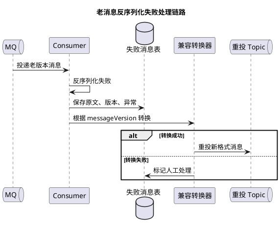

# 消息格式升级导致老消息反序列化失败

## 问题索引

- Q1：业务实践场景题：消息格式升级导致老消息反序列化失败，如何排查和解决？

## Q1：业务实践场景题：消息格式升级导致老消息反序列化失败，如何排查和解决？

### 背景

线上发布新版本后，MQ 消费突然大量失败，表现为：

- 消费者日志出现反序列化异常。
- RocketMQ 重试 Topic 消息堆积。
- 死信队列快速增长。
- 下游业务状态没有推进，例如订单未发货、库存未同步、积分未入账。
- 回滚应用后，部分消息又能消费成功。

典型异常包括：

```text
com.fasterxml.jackson.databind.exc.UnrecognizedPropertyException
com.fasterxml.jackson.databind.exc.MismatchedInputException
java.io.InvalidClassException
java.lang.ClassNotFoundException
java.lang.NoSuchFieldError
```

本质问题是：**生产者和消费者对同一条消息的格式理解不一致**。老消息还在 MQ、重试队列、死信队列或本地消息表里，但新消费者已经按新 DTO、新字段类型、新枚举、新序列化规则解析，导致反序列化失败。

### 典型触发场景

#### 1. 字段类型变更

老消息：

```json
{
  "orderNo": "O1001",
  "status": 1
}
```

新 DTO：

```java
public class OrderMessage {
    private String orderNo;

    // 老消息 status 是数字，新版本改成字符串枚举，可能导致解析失败或语义错误
    private String status;
}
```

#### 2. 删除字段或字段改名

老消息有 `userId`，新版本改成 `memberId`。如果消费逻辑强依赖 `memberId`，老消息反序列化后字段为空，后续业务可能 NPE 或参数校验失败。

#### 3. 新增必填字段

新版本新增 `tenantId`、`channel`、`sourceSystem` 等必填字段。老消息没有这些字段，虽然 JSON 能反序列化成功，但业务校验失败。

#### 4. Java 原生序列化版本不兼容

如果消息体使用 Java 原生序列化，类结构变化且 `serialVersionUID` 不一致，反序列化会直接抛 `InvalidClassException`。

#### 5. 枚举值变更

老消息中 `status = "WAIT_PAY"`，新版本枚举改成 `PENDING_PAYMENT`，消费端无法映射。

### 第一步：快速确认是不是消息格式问题


### PlantUML 示意图：消息格式升级兼容处理链路



#### 看消费者日志

应用日志中搜索反序列化异常：

```bash
grep -E "UnrecognizedPropertyException|MismatchedInputException|InvalidClassException|JsonParseException|ClassNotFoundException" app.log
```

关注：

| 观察项 | 判断 |
| --- | --- |
| 异常集中在某个 Topic | 说明是某类消息格式问题 |
| 异常集中在某个 ConsumerGroup | 说明某个消费者版本不兼容 |
| 发布后开始出现 | 高概率是 DTO 或反序列化配置变更 |
| 回滚后恢复 | 高概率是新版本兼容性问题 |

#### 看死信和重试增长

RocketMQ 可以重点看：

```bash
mqadmin consumerProgress -n <namesrvAddr> -g <consumerGroup>
mqadmin statsAll -n <namesrvAddr>
```

关注：

- 消费堆积是否快速增长。
- 失败是否集中在某个 Topic。
- 是否进入 `%RETRY%consumerGroup`。
- 是否出现 `%DLQ%consumerGroup`。

#### 抽样查看消息原文

如果业务有死信表或异常表，优先查落库的原始消息体。

```sql
select id, topic, biz_key, error_type, error_msg, body
from mq_dead_letter
where topic = 'order-topic'
order by create_time desc
limit 20;
```

关注：

| 字段 | 看什么 |
| --- | --- |
| `body` | 老消息字段结构和新 DTO 是否一致 |
| `error_type` | 是否都是反序列化异常 |
| `biz_key` | 是否可用于后续幂等重投 |
| `create_time` | 是否发布后开始集中失败 |

### 第二步：先止血

止血目标不是立刻完美修复，而是防止失败消息继续扩大、业务继续堆积。

#### 方案一：回滚消费者

如果新版本刚发布，且老版本能正常消费，优先回滚消费者。

适用条件：

- 生产者还没切到只发新格式。
- 老版本消费者能识别当前队列中的大部分消息。
- 业务堆积已经影响线上。

风险：

- 如果已有新格式消息进入队列，老版本可能又消费不了新消息。
- 回滚只能止血，不能解决格式演进问题。

#### 方案二：临时暂停消费

如果消费者持续失败，可能会造成重试风暴和日志打爆，可以临时暂停消费或限速。

适用条件：

- 消息处理不是秒级强实时。
- 需要先保住核心系统稳定。
- 已经确认消费失败不是临时网络抖动。

#### 方案三：失败消息快速入库

如果不能立刻兼容，至少要把失败消息原文、Topic、Tag、Key、异常原因入库，避免死信过期或 MQ 保留时间到期后无法恢复。

```java
public void onMessage(String rawBody) {
    try {
        OrderMessage message = objectMapper.readValue(rawBody, OrderMessage.class);
        orderService.handle(message);
    } catch (Exception ex) {
        // 1. 反序列化失败时不能只打日志，要保存原始消息，后续才能转换和重放
        deadLetterRepository.save(rawBody, ex.getClass().getName(), ex.getMessage());

        // 2. 继续抛出异常，让 MQ 按原有机制重试或进入死信
        throw ex;
    }
}
```

### 第三步：定位根因

排查时对比三份东西：

1. 老消息原文。
2. 新版本 DTO。
3. 新版本反序列化配置和业务校验逻辑。

常见根因判断：

| 表现 | 根因 |
| --- | --- |
| JSON 多了字段，新消费者失败 | Jackson 未配置忽略未知字段 |
| JSON 缺少新字段，业务校验失败 | 新增必填字段没有默认值或兼容逻辑 |
| 字段类型从数字改字符串 | DTO 字段类型不兼容 |
| 枚举解析失败 | 枚举值改名或删除 |
| `InvalidClassException` | Java 原生序列化类版本不兼容 |
| `ClassNotFoundException` | 消息里序列化了具体类名，新消费者缺少该类 |

### 第四步：兼容老消息

#### 1. 消息增加版本号

新老消息必须可区分。

```json
{
  "version": 1,
  "eventId": "order-created-O1001",
  "orderNo": "O1001",
  "status": 1
}
```

消费者按版本适配：

```java
public void consume(String rawBody) {
    JsonNode root = objectMapper.readTree(rawBody);

    // version 是消息格式版本，不是业务状态版本；缺失时按 v1 老消息处理
    int version = root.path("version").asInt(1);

    OrderEvent event;
    if (version == 1) {
        // v1 适配器负责把老字段、老枚举、老类型转换成统一内部模型
        event = v1Adapter.toOrderEvent(root);
    } else if (version == 2) {
        event = v2Adapter.toOrderEvent(root);
    } else {
        // 未知版本不要盲目消费，进入异常表，避免错误推进业务状态
        throw new UnsupportedMessageVersionException(version);
    }

    orderService.handle(event);
}
```

#### 2. 使用适配器转换为内部统一模型

不要让业务逻辑同时散落处理 v1、v2、v3。推荐先把不同版本消息转换成统一内部事件。

```java
public class OrderEventV1Adapter {
    public OrderEvent toOrderEvent(JsonNode root) {
        OrderEvent event = new OrderEvent();

        // 老消息 status 是数字，这里集中做枚举映射，避免业务代码到处 if else
        int oldStatus = root.path("status").asInt();
        event.setStatus(convertOldStatus(oldStatus));

        event.setOrderNo(root.path("orderNo").asText());

        // 老消息没有 tenantId 时给默认租户，或根据 orderNo 查询业务表补齐
        event.setTenantId(root.path("tenantId").asText("default"));
        return event;
    }
}
```

#### 3. JSON 兼容配置

对 Jackson：

```java
ObjectMapper objectMapper = new ObjectMapper();

// 忽略未知字段，避免生产者新增字段导致老消费者直接失败
objectMapper.configure(DeserializationFeature.FAIL_ON_UNKNOWN_PROPERTIES, false);

// 枚举未知值可以按 null 处理，再由业务兼容逻辑兜底
objectMapper.configure(DeserializationFeature.READ_UNKNOWN_ENUM_VALUES_AS_NULL, true);
```

类级别也可以：

```java
@JsonIgnoreProperties(ignoreUnknown = true)
public class OrderMessage {
    private String orderNo;
    private String status;
}
```

注意：忽略未知字段只能解决“多字段”的兼容，解决不了“字段类型变化”和“缺少必填字段”的问题。

#### 4. 保留旧 DTO 一段时间

如果老消息量很大，可以保留 `OrderMessageV1`、`OrderMessageV2`，由版本号路由。

```java
public interface MessageAdapter<T> {
    // 每个版本适配器只负责一种消息格式，避免兼容逻辑污染主业务流程
    OrderEvent adapt(T message);
}
```

### 第五步：处理已经失败的消息

#### 1. 死信入库

失败消息至少保存：

| 字段 | 作用 |
| --- | --- |
| `topic` / `tag` | 重投时恢复路由 |
| `message_key` | 业务查重和排查 |
| `event_id` | 消费端幂等 |
| `raw_body` | 后续转换和重放 |
| `error_type` | 根因分类 |
| `error_msg` | 快速定位 |
| `status` | NEW / FIXED / RETRIED / FAILED |
| `retry_count` | 防止无限重投 |

#### 2. 转换老消息后重投

不要直接把所有死信原样重投，否则还是会失败。先转换成新格式或走兼容消费者。

```java
public void replayDeadMessage(Long deadId) {
    DeadMessage dead = deadMessageMapper.selectById(deadId);

    // 1. 解析原始消息，保留 eventId，确保重投后消费端仍能幂等
    JsonNode oldBody = objectMapper.readTree(dead.getRawBody());
    OrderEvent event = v1Adapter.toOrderEvent(oldBody);
    event.setEventId(dead.getEventId());

    // 2. 重投前先检查业务当前状态，避免旧消息把新状态覆盖
    if (!orderStateMachine.canHandle(event)) {
        deadMessageMapper.markIgnored(deadId, "current state already advanced");
        return;
    }

    // 3. 重投新格式消息；消费端必须依赖 eventId/orderNo 做幂等
    rocketMQTemplate.syncSend(dead.getTopic(), JsonUtils.toJson(event));
    deadMessageMapper.markRetried(deadId);
}
```

#### 3. 重投前做状态机校验

老消息可能已经过期。例如订单已经取消，老的“支付成功”消息才被重放。重投前或消费时必须校验状态机：

```text
当前状态 = CANCELLED
老消息事件 = PAY_SUCCESS
期望流转 = CREATED -> PAID
结论：当前状态不满足 CREATED，不能推进，进入人工确认或忽略
```

### 第六步：发布和演进规范

#### 1. 先发兼容消费者，再发新生产者

推荐发布顺序：

```text
1. 消费者先支持 v1 + v2
2. 生产者开始灰度发送 v2
3. 观察失败率、死信数、消费延迟
4. 确认 MQ 中 v1 消息基本消费完
5. 再移除 v1 兼容逻辑
```

不要先发只支持新格式的消费者，否则 MQ 中残留老消息会立刻失败。

#### 2. 消息格式只能做兼容性演进

建议：

- 字段只新增，不随意删除。
- 新增字段尽量有默认值。
- 不直接改字段类型，新增新字段替代旧字段。
- 枚举值只新增，不随意改名或删除。
- 消息体只传业务 ID 和必要快照，不传复杂对象。
- 每条消息携带 `version`、`eventId`、`bizKey`。

#### 3. 建立契约测试

把历史消息样本放入测试用例，确保新消费者能解析。

```java
@Test
void shouldConsumeV1MessageAfterUpgrade() {
    // 1. 使用线上老消息样本，防止 DTO 升级后破坏兼容性
    String oldMessage = """
        {"version":1,"eventId":"e1","orderNo":"O1001","status":1}
        """;

    // 2. 新消费者必须能把老消息转换为统一内部事件
    OrderEvent event = consumer.parse(oldMessage);

    // 3. 校验关键业务字段，避免只是不报错但语义已经错了
    assertEquals("O1001", event.getOrderNo());
    assertEquals(OrderStatus.PAID, event.getStatus());
}
```

### 面试话术

> 这个问题我会先看消费失败日志和死信增长，确认是不是集中在反序列化异常，比如 Jackson 的字段不识别、类型不匹配、枚举解析失败，或者 Java 原生序列化的 `InvalidClassException`。止血上，如果老消费者能正常处理，就先回滚或暂停消费，避免重试风暴；同时把失败消息原文、Topic、Key、异常原因入库，防止死信过期。根因定位时对比老消息原文、新 DTO、新反序列化配置和业务校验规则。
>
> 修复上我不会直接把死信原样重投，而是给消息加 `version`，消费者支持 v1/v2 多版本解析，通过 Adapter 把老消息转换成统一内部事件；JSON 反序列化配置忽略未知字段，新增字段给默认值，枚举和字段类型变化做显式映射。已经进入死信的消息先转换成新格式，再结合业务状态机和幂等表重放。长期规范是先发兼容消费者，再灰度新生产者，历史消息样本进入契约测试，避免再次因为消息格式升级导致老消息消费失败。

### 高频追问

- Q：为什么不能直接重投死信？
  A：如果根因是格式不兼容，原样重投仍然会失败。应该先修复兼容逻辑，或把老消息转换成新格式，再做状态机校验和幂等重投。

- Q：新增字段为什么也会出问题？
  A：如果新增字段是必填，老消息没有该字段，反序列化可能成功但业务校验失败。需要默认值、补查询或版本适配。

- Q：忽略未知字段能解决所有兼容问题吗？
  A：不能。它只能解决“生产者新增字段、消费者不认识”的问题，解决不了字段类型变化、枚举值变化、缺少必填字段等问题。

- Q：为什么消息要带 version？
  A：没有版本号时，消费者只能猜消息格式。带版本号后，可以明确选择 v1/v2 适配器，兼容逻辑更可控。

- Q：老消息重放如何避免重复执行业务？
  A：保留原 `eventId` 或业务唯一键，消费端用消费日志表、DB 唯一索引、状态机校验保证幂等。

### 复习清单

- [ ] 能从日志和死信增长判断是否是消息格式兼容问题。
- [ ] 能说明止血动作：回滚、暂停消费、死信入库、限速。
- [ ] 能设计消息版本号和 Adapter 兼容 v1/v2。
- [ ] 能说明 JSON 忽略未知字段的适用范围和局限。
- [ ] 能设计死信转换、状态机校验、幂等重投流程。
- [ ] 能说清发布顺序：先兼容消费者，再灰度生产者。

