# 秒杀系统设计与容错机制

## 问题索引

- Q1：业务实践场景题：秒杀系统设计中需要关注哪些点，架构中常见的容错机制有哪些？
- Q2：秒杀系统中的防刷是什么？具体怎么做？
- Q3：秒杀系统中用户信息和资格校验如何避免直接查询 DB？
- Q4：秒杀预热后用户等级、黑名单等资格数据变化导致缓存与 DB 不一致怎么办？
- Q5：秒杀模式下 Redis 原子递减如何在 Cluster 模式下保持正确？主节点写入后宕机怎么办？
- Q6：如何针对热点商品库存做精准局部保鲜，预防 Redis master 写入后宕机导致库存丢失？
- Q7：基于库存保鲜机制，如何保证高并发下不超卖？
- Q8：秒杀系统中的业务流水和库存流水应该如何设计？

## Q1：业务实践场景题：秒杀系统设计中需要关注哪些点，架构中常见的容错机制有哪些？

### 背景

秒杀系统的本质是：**用有限库存承接瞬时极高流量，并且保证不超卖、不重复下单、系统不被打垮**。

典型链路：

```text
用户进入活动页
  -> 秒杀开始
  -> 用户抢购
  -> 校验资格和库存
  -> 生成抢购结果
  -> 异步创建订单
  -> 支付
  -> 超时取消释放库存
```

秒杀不是单纯把接口性能做高，而是要把流量、库存、订单、支付、MQ、数据库、缓存、监控、降级方案一起设计。

### 核心关注点

#### 1. 流量入口要挡住无效请求

秒杀系统最怕所有流量都打到核心下单链路。

入口层要做：

- CDN 缓存活动页、商品详情、静态资源。
- 网关限流，例如按 IP、用户、活动、接口维度限流。
- 验证码、滑块、人机校验，防止脚本流量。
- 秒杀令牌或动态 URL，避免提前刷接口。
- 活动未开始、已结束、库存已售罄时直接快速失败。

目标是：**让绝大多数无效请求在网关或缓存层就结束**。

#### 2. 热点数据要提前预热

秒杀活动开始前，把活动信息、商品信息、库存、规则预热到缓存。

常见缓存 Key：

```text
seckill:activity:{activityId}
seckill:sku:{activityId}:{skuId}
seckill:stock:{activityId}:{skuId}
seckill:user:limit:{activityId}:{userId}
```

注意：

- 秒杀开始前预热，避免活动开始瞬间回源 DB。
- 活动结束或售罄后及时设置本地售罄标记。
- 热点 Key 要考虑分片或本地缓存，避免 Redis 单 Key 压力过大。

#### 3. 库存扣减要防止超卖

##### PlantUML 示意图：Redis Lua 原子扣库存与限购

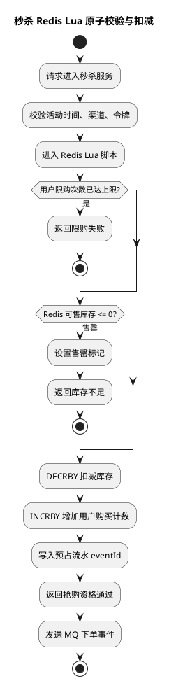

库存扣减是秒杀系统的核心。

常见方案：

| 方案 | 特点 | 适用 |
| --- | --- | --- |
| DB 条件更新 | 强一致，简单，但抗并发有限 | 中小并发、最终兜底 |
| Redis 原子扣减 | 高性能，适合前置拦截 | 高并发秒杀 |
| Redis Lua | 库存和限购校验原子完成 | 主流方案 |
| MQ 异步下单 | 削峰填谷，保护 DB | 高并发下单 |

Redis Lua 示例：

```lua
-- KEYS[1]：库存 Key，例如 seckill:stock:1001
-- KEYS[2]：用户限购 Key，例如 seckill:user:limit:1001:20001
-- ARGV[1]：用户本次购买数量
-- ARGV[2]：用户限购数量

local stock = tonumber(redis.call('GET', KEYS[1]) or '0')
local buyCount = tonumber(ARGV[1])
local limitCount = tonumber(ARGV[2])
local userBought = tonumber(redis.call('GET', KEYS[2]) or '0')

if stock < buyCount then
    -- 库存不足，直接失败，避免请求进入后续链路。
    return -1
end

if userBought + buyCount > limitCount then
    -- 用户超过限购数量，直接失败。
    return -2
end

-- 库存扣减和用户购买计数必须在同一个 Lua 脚本中完成，保证原子性。
redis.call('DECRBY', KEYS[1], buyCount)
redis.call('INCRBY', KEYS[2], buyCount)
return 1
```

Redis 扣减成功只能说明用户获得了“下单资格”，不代表订单最终创建成功。后续还要靠 MQ、DB、补偿来闭环。

#### 4. 下单链路要异步削峰

秒杀请求不建议同步直接写订单库。

推荐流程：

```text
请求进入
  -> 网关限流
  -> Redis Lua 扣库存和限购
  -> 生成抢购成功事件
  -> 写 MQ
  -> 立即返回“排队中/抢购成功待确认”
  -> 消费者异步创建订单
```

好处：

- MQ 承接瞬时流量。
- 订单库按消费能力平稳写入。
- 可以通过消费积压观测系统压力。

#### 5. 幂等和防重复必须贯穿全链路

用户可能重复点击，MQ 可能重复投递，接口可能重试。

常见幂等点：

- 前端按钮防重复点击。
- 网关按用户和商品做短时间限流。
- Redis 用户限购 Key。
- MQ 消息 `eventId` 唯一。
- 订单表唯一索引，例如 `(activity_id, sku_id, user_id)`。
- 消费端幂等表。

订单表可以增加唯一约束：

```sql
ALTER TABLE seckill_order
ADD UNIQUE KEY uk_activity_sku_user (activity_id, sku_id, user_id);
```

即使 Redis、MQ 或应用层出现重复，DB 唯一索引也能做最后兜底。

#### 6. 订单超时要释放库存

##### PlantUML 示意图：订单支付、超时取消与库存释放状态机

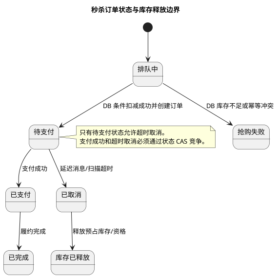

秒杀成功但未支付，需要超时取消并释放资源。

可以复用订单过期取消思路：

```text
创建订单
  -> 发送延迟消息
  -> 到期检查订单是否仍未支付
  -> 未支付则取消订单
  -> 释放库存或恢复可售资格
  -> 扫描任务兜底
```

注意：秒杀库存释放要谨慎。如果活动已经结束，是否允许释放后继续售卖，要看业务规则。

### 推荐架构

```text
CDN/静态页
  -> 网关限流/防刷/令牌
  -> 秒杀服务
      -> 本地缓存活动规则
      -> Redis Lua 原子扣库存和限购
      -> MQ 发送下单事件
  -> 订单消费者
      -> 幂等校验
      -> 创建订单
      -> 写状态日志
      -> 发送支付/通知事件
  -> 延迟取消/补偿扫描/对账
```

核心原则：

- 前置拦截无效流量。
- Redis 承接高并发库存扣减。
- MQ 削峰保护数据库。
- DB 唯一索引和状态机兜底正确性。
- 补偿任务解决异常链路。

### PlantUML 示意图

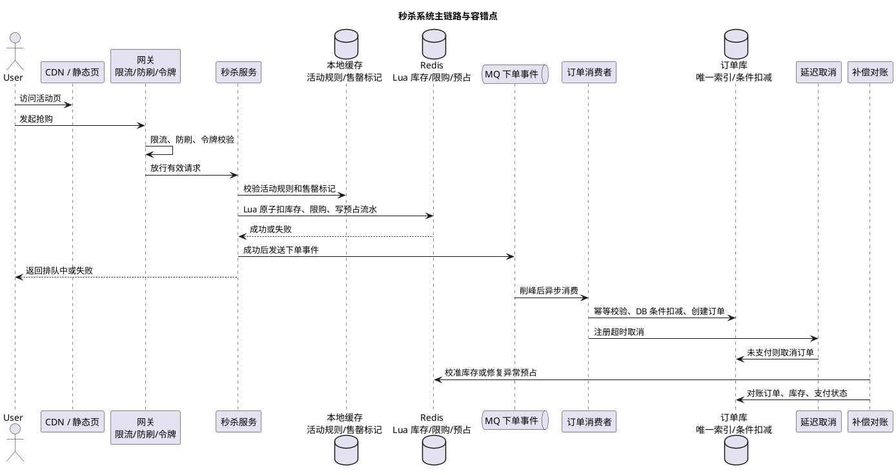

### 常见容错机制

#### 1. 限流

限流位置：

- 网关限流。
- Nginx 限流。
- 服务接口限流。
- Redis Lua 前置限流。
- MQ 消费端限速。

限流维度：

| 维度 | 目的 |
| --- | --- |
| IP | 防止单 IP 打爆系统 |
| 用户 | 防止同一用户刷接口 |
| 活动 | 防止单活动流量拖垮全站 |
| 商品 | 防止热点商品拖垮 Redis/DB |
| 接口 | 防止下单接口被压垮 |

#### 2. 降级

降级策略：

- 活动页只读缓存，不回源 DB。
- 库存售罄后直接返回“已抢完”。
- 非核心功能降级，例如推荐、优惠券展示、排行榜。
- 下单链路拥塞时返回“排队中”，异步确认结果。
- MQ 积压过高时暂停新请求或降低放行比例。

降级要提前设计用户可接受的提示，而不是直接 500。

#### 3. 熔断

当依赖服务异常时，要快速失败，避免线程池被拖死。

适合熔断的依赖：

- 用户画像服务。
- 优惠券服务。
- 风控服务。
- 商品详情服务。
- 通知服务。

注意：核心库存扣减和订单创建不能随便“放行降级”，否则会破坏一致性。

#### 4. 隔离

秒杀流量要和普通业务隔离。

隔离方式：

- 独立秒杀服务。
- 独立线程池。
- 独立 Redis 集群或独立 Key 空间。
- 独立 MQ Topic。
- 独立数据库表或分库。
- 独立网关路由和限流规则。

目的：秒杀高峰不能拖垮普通下单、支付、用户中心等核心链路。

#### 5. 异步削峰

MQ 是秒杀系统的缓冲层。

要关注：

- 生产端发送可靠性。
- 消费端幂等。
- 消费积压监控。
- 死信队列。
- 消费失败重试。
- 消费速度限速，避免订单库被瞬间打爆。

#### 6. 快速失败

库存售罄后，应该尽快阻断请求。

常见做法：

```text
Redis 库存 <= 0
  -> 设置本地 soldOut 标记
  -> 一段时间内本机直接返回售罄
  -> 后台定期校准 Redis/DB 库存
```

本地售罄标记能减少对 Redis 的无效访问，但要注意活动补库存或库存释放时清理标记。

#### 7. 补偿和对账

秒杀链路一定要有补偿。

需要对账的内容：

- Redis 已扣库存但 MQ 发送失败。
- MQ 消费失败但库存已扣。
- 订单创建成功但状态日志失败。
- 用户限购计数成功但订单失败。
- 支付成功但订单状态未更新。
- 订单取消后库存未释放。

常见机制：

- 本地消息表。
- 事务消息。
- 订单状态扫描。
- 库存流水表。
- 定时对账任务。
- 人工运营补偿入口。

#### 8. 灰度和开关

秒杀系统需要很多开关：

- 活动总开关。
- 商品售罄开关。
- 放行比例开关。
- MQ 消费开关。
- 自动取消开关。
- 库存回补开关。
- 降级开关。

这些开关要能在活动期间快速调整。

### 库存一致性设计

推荐把库存拆成几个概念：

| 库存类型 | 含义 |
| --- | --- |
| 活动总库存 | 活动配置的库存上限 |
| Redis 可抢库存 | 高并发扣减用 |
| DB 可用库存 | 尚未被待支付订单占用的库存 |
| DB 预占库存 | 已创建待支付订单、尚未支付或取消的库存 |
| DB 已售库存 | 已支付确认的库存 |
| 释放库存 | 取消或失败后从预占转回可用的库存 |

不要只看一个 Redis 数字判断全链路正确性。最终要通过订单、库存流水、支付状态对账。

### 数据库兜底

即使前面有 Redis Lua，DB 也要做最终保护。

库存扣减可以使用条件更新：

```sql
UPDATE seckill_sku
SET available_count = available_count - 1,
    reserved_count = reserved_count + 1,
    version = version + 1
WHERE activity_id = ?
  AND sku_id = ?
  AND available_count >= 1;
```

订单创建用唯一索引防重复：

```sql
INSERT INTO seckill_order (
  id,
  activity_id,
  sku_id,
  user_id,
  status,
  create_time
) VALUES (?, ?, ?, ?, 'WAIT_PAY', NOW());
```

如果唯一索引冲突，说明用户已经创建过订单，消费者应该按幂等成功或重复请求处理。

### 压测与容量评估

秒杀上线前必须压测。

关注指标：

- 网关 QPS。
- 秒杀接口 QPS/RT/错误率。
- Redis QPS、慢命令、热点 Key。
- MQ 生产 TPS、消费 TPS、堆积量。
- DB TPS、慢 SQL、锁等待、连接数。
- JVM CPU、GC、线程池队列。
- Sentinel/限流命中量。
- 订单创建成功数和库存扣减数是否一致。

压测要覆盖：

- 活动开始瞬间流量。
- 库存售罄后的无效流量。
- MQ 积压。
- Redis 故障。
- 消费者部分节点宕机。
- DB 慢 SQL 或连接池耗尽。

### 典型异常与处理

#### Redis 扣库存成功，MQ 发送失败

处理：

- 使用本地消息表或事务消息。
- 发送失败时记录待补偿事件。
- 补偿任务根据事件重新发送或回滚库存资格。

#### MQ 重复投递

处理：

- 消费端按 `eventId` 幂等。
- 订单唯一索引兜底。
- 重复消息不要重复扣 DB 库存。

#### 订单创建失败

处理：

- 记录失败原因。
- 释放 Redis 预扣库存或写补偿任务。
- 如果失败原因是用户重复下单，按幂等处理，不释放其他用户库存。

#### Redis 故障

处理：

- 秒杀核心链路通常快速失败或降级为“稍后重试”。
- 不建议所有流量直接打 DB。
- 如果业务允许，可以开启低比例 DB 兜底，但必须严格限流。

#### DB 故障

处理：

- 暂停 MQ 消费或降低消费速率。
- 秒杀入口降级为排队中或暂停抢购。
- 恢复后通过 MQ 积压继续消费。

### 面试话术

> 秒杀系统设计重点不是单个接口性能，而是整体抗峰值和正确性。入口层要用 CDN、网关限流、防刷、秒杀令牌挡住无效请求；活动和库存要提前预热到缓存；库存扣减通常用 Redis Lua 原子完成库存和限购校验，扣减成功后写 MQ 异步下单，订单消费者再做幂等校验、DB 唯一索引兜底和状态机流转。为了防止系统被打垮，要做限流、降级、熔断、隔离和快速失败；为了防止数据不一致，要做本地消息表或事务消息、消费幂等、库存流水、延迟取消、补偿扫描和对账。核心原则是前面尽量拦截，中间用 MQ 削峰，后面用 DB 和状态机保证最终正确。

## Q2：秒杀系统中的防刷是什么？具体怎么做？

### 背景

秒杀防刷不是简单加一个验证码。它的目标是：

```text
识别异常流量
提高脚本和机器人的攻击成本
减少无效请求进入核心秒杀链路
保护库存、订单、Redis、MQ、DB 不被打爆
```

正常用户是少量点击、按页面流程进入；刷子通常是脚本批量请求、提前构造接口、绕过页面、并发重试、换 IP/账号撞库存。

### 防刷分层

#### 1. 前端和页面层

前端不能作为安全边界，但可以提高脚本成本。

常见措施：

- 秒杀按钮到点才可点击。
- 按钮点击后短时间置灰，防重复点击。
- 活动页静态化，减少动态接口压力。
- 页面加载时下发一次性活动参数。
- 对异常频繁点击提示验证码。

注意：前端限制只能改善用户体验，不能防住真正脚本，因为脚本可以直接请求接口。

#### 2. 网关层

网关是防刷第一道有效防线。

可以做：

- IP 维度限流。
- 用户维度限流。
- 设备指纹限流。
- User-Agent 异常拦截。
- Referer / Origin 基础校验。
- 黑白名单。
- 地域、ASN、代理 IP 风险识别。
- 对异常请求返回验证码或直接拒绝。

示例规则：

```text
同一 IP 每秒最多 20 次秒杀请求
同一用户每秒最多 3 次秒杀请求
同一设备每分钟最多 30 次秒杀请求
未登录用户不能进入抢购接口
```

#### 3. 秒杀令牌

秒杀令牌是防止用户提前构造下单接口的重要手段。

流程：

```text
用户进入活动页
  -> 活动即将开始时请求获取秒杀令牌
  -> 服务端校验登录态、活动状态、用户资格
  -> 生成短 TTL 的 token
  -> 抢购接口必须携带 token
  -> token 校验通过后才能进入库存扣减
```

Token 设计：

```text
token = HMAC(userId + activityId + skuId + expireTime + nonce, secret)
```

服务端保存或校验：

- token 和用户、活动、商品绑定。
- token 有短过期时间。
- token 最好一次性使用或限制使用次数。
- token 不能让前端自己计算。

Redis Key 示例：

```text
seckill:token:{activityId}:{skuId}:{userId} -> token
TTL = 30s
```

抢购时校验：

```text
用户提交 token
  -> Redis 校验 token 是否存在且匹配
  -> 校验通过后删除 token 或增加使用次数
  -> 进入 Redis Lua 扣库存
```

作用：

- 防止活动开始前直接刷下单接口。
- 防止绕过活动页。
- 提前过滤无资格用户。

#### 4. 验证码和人机校验

验证码不适合对所有用户一直开启，否则会伤害体验。

更推荐分级触发：

| 触发条件 | 处理 |
| --- | --- |
| 用户请求频率轻微异常 | 图形验证码 |
| IP/设备频繁请求 | 滑块验证码 |
| 多账号同设备 | 短信或强校验 |
| 高风险代理 IP | 直接拒绝 |

验证码主要解决：

- 脚本批量请求。
- 高频撞接口。
- 低成本账号批量请求。

但验证码不能替代库存原子扣减和限购。

#### 5. 动态 URL

动态 URL 指活动开始前不暴露真实抢购接口，开始后通过服务端下发短期有效路径。

例如：

```text
/seckill/submit/{pathToken}
```

`pathToken` 与用户、活动、商品绑定，并设置短 TTL。

作用：

- 防止接口路径被提前写进脚本。
- 配合令牌提高攻击成本。

注意：动态 URL 只是增加攻击成本，不能作为唯一安全手段。

#### 6. 业务资格校验

很多刷子请求应该在库存扣减前挡掉。

校验项：

- 是否登录。
- 是否实名。
- 是否黑名单用户。
- 是否满足会员等级。
- 是否已预约。
- 是否超过限购次数。
- 是否在活动时间内。
- 是否属于目标地区或渠道。

这些校验尽量用缓存承接，不要每次查 DB。

#### 7. Redis 原子限购

防刷和防超卖要结合。

Lua 中可以同时校验：

- 库存是否足够。
- 用户是否超过限购。
- token 是否有效。
- 用户是否已经提交过。

示例逻辑：

```lua
-- KEYS[1]：库存 Key
-- KEYS[2]：用户限购 Key
-- KEYS[3]：秒杀令牌 Key
-- ARGV[1]：用户提交的 token
-- ARGV[2]：购买数量
-- ARGV[3]：限购数量

local token = redis.call('GET', KEYS[3])
if token ~= ARGV[1] then
    -- token 不存在或不匹配，说明请求可能绕过页面或已过期。
    return -3
end

local stock = tonumber(redis.call('GET', KEYS[1]) or '0')
local buyCount = tonumber(ARGV[2])
if stock < buyCount then
    -- 库存不足，直接失败。
    return -1
end

local userBought = tonumber(redis.call('GET', KEYS[2]) or '0')
local limitCount = tonumber(ARGV[3])
if userBought + buyCount > limitCount then
    -- 超过用户限购。
    return -2
end

-- token 一次性使用，避免同一 token 被并发重复提交。
redis.call('DEL', KEYS[3])
redis.call('DECRBY', KEYS[1], buyCount)
redis.call('INCRBY', KEYS[2], buyCount)
return 1
```

### 防刷和限流的区别

| 概念 | 重点 | 例子 |
| --- | --- | --- |
| 限流 | 控制请求数量 | 每个用户每秒最多 3 次 |
| 防刷 | 识别和拦截异常请求 | 令牌、验证码、设备指纹、黑名单 |
| 幂等 | 防止重复处理 | 同一用户同一商品只能生成一个订单 |
| 风控 | 识别风险用户和行为 | 代理 IP、多账号、异常设备 |

秒杀系统通常是：

```text
防刷识别异常流量
限流控制请求规模
幂等保证重复请求不重复下单
风控处理高风险用户
```

### 具体落地链路

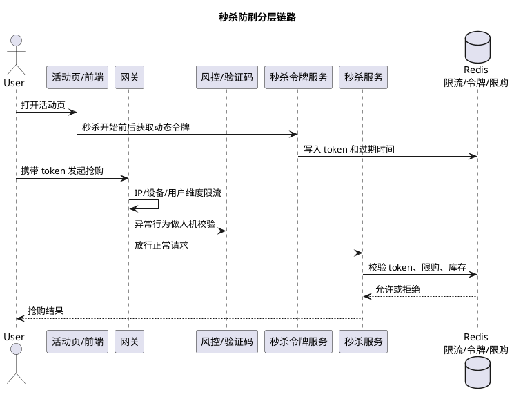

推荐链路：

```text
活动页静态化
  -> 登录态校验
  -> 网关 IP/用户/设备限流
  -> 获取秒杀令牌
  -> 人机校验按风险触发
  -> 抢购请求携带 token
  -> Redis Lua 校验 token + 限购 + 库存
  -> 成功后写 MQ 异步下单
  -> DB 唯一索引兜底
```

### 监控指标

防刷要监控：

- 单 IP QPS 排行。
- 单用户请求频率。
- 单设备绑定账号数。
- token 获取失败率。
- token 校验失败率。
- 验证码触发率和通过率。
- 黑名单命中数。
- 同一商品无效请求比例。
- 抢购接口 429/403 比例。

如果 token 校验失败率突然升高，通常说明有人在绕过页面直接刷接口。

### 踩坑点

- 只靠前端按钮置灰，没有服务端限制，脚本可以绕过。
- 只做 IP 限流，挡不住代理 IP 池。
- 验证码全量开启，正常用户体验很差。
- token 有效期太长，容易被复用。
- token 不绑定用户和商品，容易被转用。
- 防刷失败后直接打到 Redis 热点 Key，Redis 也可能被打爆。
- 风控误杀没有申诉或降级通道，影响真实用户。

### 面试话术

> 秒杀防刷的目标是识别异常流量、提高脚本攻击成本，并把无效请求挡在核心扣库存链路之前。具体会分层做：前端按钮防重复和活动页静态化改善体验；网关按 IP、用户、设备、活动维度限流，结合黑名单和代理 IP 识别；服务端通过秒杀令牌和动态 URL 防止提前构造接口，令牌要和用户、活动、商品绑定并设置短 TTL；对高风险请求触发验证码或滑块；真正进入抢购时，用 Redis Lua 原子校验 token、限购和库存。最后订单表唯一索引和消费幂等兜底。防刷不是替代限流和幂等，而是和限流、风控、幂等一起保护秒杀链路。

## Q3：秒杀系统中用户信息和资格校验如何避免直接查询 DB？

### 背景

秒杀链路里常见的用户和资格校验包括：

- 是否登录。
- 是否实名。
- 是否黑名单用户。
- 是否满足会员等级。
- 是否已预约。
- 是否超过限购次数。
- 是否在活动时间内。
- 是否属于目标地区或渠道。

这些校验不能在抢购瞬间全部实时查 DB。否则秒杀还没打到库存，用户库、活动库、预约库就先被打爆。

正确思路是：**按数据变化频率和一致性要求拆分校验位置**。

### 分类处理

| 校验项 | 推荐处理方式 | 是否查 DB |
| --- | --- | --- |
| 是否登录 | 网关/JWT/Session 校验 | 不查业务 DB |
| 是否实名 | 用户标签缓存或令牌生成前校验 | 不在抢购接口查 |
| 是否黑名单 | 风控缓存/布隆过滤器/本地缓存 | 不在抢购接口查 |
| 会员等级 | 用户权益标签缓存 | 不在抢购接口查 |
| 是否已预约 | 活动前写入 Redis Set/Bitmap | 抢购时不查 DB |
| 是否超过限购 | Redis Lua 原子计数 + DB 唯一索引兜底 | 不先查 DB |
| 是否在活动时间内 | 本地缓存活动规则 + Nacos 动态开关 | 不查 DB |
| 地区或渠道 | 用户标签/渠道 token/活动规则缓存 | 不在抢购接口查 |

### 1. 登录态校验

登录态不要查用户表。

常见方式：

```text
用户登录
  -> 颁发 JWT / Session
  -> 网关或服务校验 token
  -> 解析 userId、渠道、设备等基础信息
```

秒杀接口只需要确认：

- token 有效。
- userId 存在。
- token 未过期。
- token 没有被注销或踢下线。

如果使用 JWT，要注意用户封禁、退出登录这类状态变化无法只靠本地 JWT 判断，可以配合 Redis 黑名单或 token version。

### 2. 实名、会员等级、地区、渠道

这些属于用户画像或权益标签，适合缓存。

可以建立用户秒杀资格缓存：

```text
seckill:user:profile:{userId}
  realName=true
  memberLevel=VIP3
  region=GX
  channel=APP
  riskLevel=LOW
```

来源：

- 用户中心变更后通过 MQ 同步。
- 活动开始前批量预热目标用户。
- 用户进入活动页时懒加载并短 TTL 缓存。

不要在抢购接口实时查用户中心或用户 DB。

### 3. 黑名单用户

黑名单适合放在 Redis Set、布隆过滤器或本地缓存里。

示例：

```text
SISMEMBER risk:black:user {userId}
```

如果黑名单很大：

- 用布隆过滤器先判断大概率不在黑名单。
- 命中后再查 Redis Set 或风控服务确认。

注意：布隆过滤器可能误判存在，不能用于“放行判断”的唯一依据；可以用于快速过滤大多数正常用户。

### 4. 已预约用户

预约资格非常适合预热。

如果活动要求预约后才能抢：

```text
用户预约成功
  -> DB 写预约记录
  -> Redis Set 写入 userId
```

Key：

```text
seckill:reserve:{activityId}:{skuId}
```

抢购时：

```text
SISMEMBER seckill:reserve:{activityId}:{skuId} {userId}
```

如果预约人数极大，可以考虑 Bitmap：

```text
seckill:reserve:bitmap:{activityId}:{skuId}
```

前提是 userId 能映射成可控 offset，否则 Bitmap 会浪费空间。

### 5. 限购次数

限购不能用“先查 DB 订单数，再判断是否可买”的方式。

推荐：

```text
Redis Lua 原子判断并递增用户购买次数
DB 唯一索引最终兜底
```

Redis Key：

```text
seckill:user:limit:{activityId}:{skuId}:{userId}
```

Lua 中同时做：

- token 校验。
- 库存校验。
- 用户限购校验。
- 扣库存。
- 增加用户已购计数。

DB 兜底：

```sql
ALTER TABLE seckill_order
ADD UNIQUE KEY uk_activity_sku_user (activity_id, sku_id, user_id);
```

如果 Redis 计数成功但订单失败，要通过补偿任务处理。是否回退用户限购次数，要看失败原因：

- 用户重复下单：不回退。
- MQ 发送失败且未创建订单：可补偿重发或回退资格。
- 系统异常创建失败：写补偿任务，避免库存和限购长期不一致。

### 6. 活动时间、渠道、活动规则

活动时间和渠道规则属于活动静态规则，适合启动时或活动前预热。

Key：

```text
seckill:activity:{activityId}
```

内容：

```json
{
  "startTime": "2026-06-28T10:00:00",
  "endTime": "2026-06-28T10:10:00",
  "allowedChannels": ["APP", "MINI_PROGRAM"],
  "allowedRegions": ["GX", "GD"],
  "limitPerUser": 1,
  "enabled": true
}
```

服务本地也可以缓存一份活动规则，减少 Redis 热点读取。

注意：

- 活动开关、放行比例、限流阈值可以用 Nacos 动态配置。
- 活动规则变更后要主动刷新本地缓存。
- 本地缓存要有版本号或过期时间，避免规则长期不一致。

### 推荐校验链路

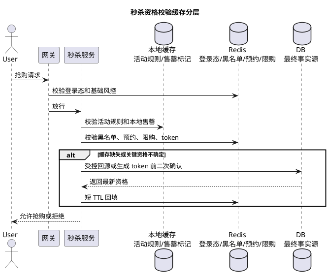

```text
1. 网关校验登录态，解析 userId、渠道、设备
2. 网关/服务层做 IP、用户、设备限流
3. 服务本地缓存判断活动时间、渠道、活动开关
4. Redis 校验黑名单、实名/会员/地区标签
5. Redis Set/Bitmap 校验是否预约
6. 生成秒杀令牌 token
7. 抢购接口通过 Redis Lua 原子校验 token、限购、库存
8. 成功后写 MQ 异步创建订单
9. DB 唯一索引和订单状态机兜底
```

关键点是：**把昂贵校验前置、缓存化，把强一致校验放到 Redis Lua 和 DB 唯一索引里兜底**。

### 预热还是懒加载

不是所有用户信息都要全量预热。

| 数据 | 建议 |
| --- | --- |
| 活动规则、商品库存 | 活动前预热 |
| 已预约用户 | 预约时写 Redis，活动前校准 |
| 黑名单 | 持续同步到 Redis/本地缓存 |
| 会员等级、实名、地区 | 目标用户可预热，非目标用户懒加载短缓存 |
| 登录态 | 网关/JWT/Session 实时校验 |
| 限购次数 | 抢购时 Redis Lua 原子计数 |

全量预热所有用户画像通常成本太高，也可能预热大量不会参与活动的用户。更实用的是：

```text
活动规则和库存强预热
预约名单强预热
风险名单持续同步
用户画像按目标人群预热 + 访问时懒加载
```

### 踩坑点

- 抢购接口实时查用户 DB，会把用户中心打爆。
- 只缓存用户等级，不考虑用户等级刚被降级或封禁。
- 黑名单用本地缓存但不刷新，导致封禁用户继续抢。
- 预约名单只在 DB，活动开始后大量 `exists` 查询压垮 DB。
- 限购用先查订单数再下单，存在并发窗口。
- 用户资格缓存没有版本或 TTL，活动规则变更后不生效。
- 缓存 miss 时大量回源，形成缓存击穿。

### 面试话术

> 秒杀里的用户资格校验不能在抢购接口实时查 DB。我会按数据类型拆分：登录态在网关通过 JWT 或 Session 校验；活动时间、渠道、限购规则提前预热到本地缓存和 Redis；实名、会员等级、地区等用户标签通过用户中心变更 MQ 同步到缓存，目标用户可活动前预热，非目标用户可以懒加载短 TTL；黑名单放 Redis Set、布隆过滤器或本地缓存；已预约用户在预约成功时写 Redis Set 或 Bitmap；限购次数在抢购时用 Redis Lua 和库存、token 一起原子校验，最后用订单表唯一索引兜底。这样能避免秒杀瞬时流量直接打用户库，同时保证关键约束有 Redis 原子校验和 DB 兜底。

## Q4：秒杀预热后用户等级、黑名单等资格数据变化导致缓存与 DB 不一致怎么办？

### 背景

预热不是一次性静态快照。秒杀开始前后，用户资格可能继续变化：

- 用户刚充值成为 VIP。
- 用户刚完成实名认证。
- 用户刚被拉入黑名单。
- 用户刚被风控系统降级为高风险。
- 用户刚预约成功或取消预约。
- 用户地区、渠道、会员等级发生变化。

如果活动开始前预热了一份用户资格缓存，但后续 DB 或用户中心发生变化，就会出现缓存与权威数据不一致。

这个问题不能用一个策略解决，要区分：

```text
正向权益变化：用户变得更有资格，例如升级 VIP、完成实名
负向风控变化：用户变得更不应该参与，例如进入黑名单、账号封禁
```

### 核心原则

| 变化类型 | 策略 | 原因 |
| --- | --- | --- |
| VIP 升级、完成实名 | 尽量快速补充资格，允许短暂延迟 | 这是用户权益问题，不能长期误伤 |
| 加入黑名单、账号封禁 | 强拦截，尽量实时同步，必要时查权威源 | 这是风险控制问题，放过一次可能造成损失 |
| 预约成功 | 写 DB 后同步写 Redis，或事务消息补偿 | 预约资格直接影响能否抢购 |
| 限购次数变化 | Redis Lua 实时原子计数，DB 兜底 | 不能依赖预热快照 |

一句话：**权益类可以最终一致但要可补偿，风控类要更接近强一致并失败关闭。**

### 方案一：用户变更事件驱动刷新缓存

用户中心、会员中心、风控中心发生变更时，发出领域事件：

```text
UserVipUpgradedEvent
UserRealNamePassedEvent
UserBlacklistedEvent
UserRiskLevelChangedEvent
UserRegionChangedEvent
```

秒杀资格服务消费事件，更新 Redis 或本地缓存。

流程：

```text
用户充值成为 VIP
  -> 会员中心 DB 更新成功
  -> 发送 UserVipUpgradedEvent
  -> 秒杀资格服务消费事件
  -> 更新 seckill:user:profile:{userId}
  -> 用户重新获取秒杀令牌时使用新资格
```

优点：

- 不需要抢购时查 DB。
- 变更能较快同步。
- 适合高并发活动。

注意：

- 事件要可靠投递，可以使用本地消息表或事务消息。
- 消费端要幂等。
- 事件要带版本号或更新时间，避免乱序覆盖。

### 方案二：缓存版本号防止旧数据覆盖新数据

用户资格缓存建议带 `version` 或 `updateTime`。

```json
{
  "userId": 1001,
  "realName": true,
  "memberLevel": "VIP3",
  "riskLevel": "LOW",
  "region": "GX",
  "version": 1720000000123
}
```

更新缓存时：

```text
只有 event.version > cache.version 才覆盖
```

这样可以避免：

```text
VIP3 事件先到
VIP2 旧事件后到
旧事件把新等级覆盖掉
```

对于 Redis Hash，可以用 Lua 做版本判断后更新，保证原子性。

### 方案三：短 TTL + 懒加载兜底

对会员等级、实名、地区这类用户标签，可以设置较短 TTL。

```text
seckill:user:profile:{userId}
TTL = 5min / 10min
```

如果缓存不存在：

```text
先查用户画像缓存服务
再短 TTL 写入 Redis
不要让所有请求直接回源用户 DB
```

为了避免缓存击穿：

- 使用互斥锁或 singleflight 合并回源。
- 对不存在用户写短 TTL 空值。
- 热点用户提前预热。

### 方案四：黑名单和封禁走强拦截链路

黑名单属于负向风险变化，不能只靠普通用户画像 TTL。

建议：

```text
风控中心加入黑名单
  -> 写风控 DB
  -> 同步写 Redis 黑名单 Set
  -> 发送 BlacklistChangedEvent
  -> 网关/秒杀服务刷新本地黑名单缓存
```

抢购链路：

```text
先查本地黑名单缓存
再查 Redis 黑名单 Set
命中黑名单直接拒绝
```

如果 Redis 黑名单服务异常：

- 核心秒杀写链路可以失败关闭或触发验证码/人工校验。
- 不建议默认放行高风险用户。

### 方案五：生成秒杀令牌前重新校验资格

抢购接口不查 DB，但获取秒杀令牌可以作为一次资格收口点。

```text
用户请求获取秒杀 token
  -> 校验登录态
  -> 查活动规则缓存
  -> 查用户资格缓存
  -> 查黑名单
  -> 查预约名单
  -> 校验通过才发 token
```

如果用户在预热后刚升级 VIP：

- 令牌接口发现缓存没有资格。
- 可以触发一次受控刷新用户资格缓存。
- 刷新成功后发 token。

注意这里的“受控刷新”不能直接让所有请求打 DB：

- 只对单用户刷新。
- 加互斥锁。
- 限制刷新频率。
- 优先查用户画像服务或缓存层，不直连用户 DB。

### 方案六：活动关键资格做二次确认

如果某些活动资格非常敏感，例如高价值权益、实名金融资格，可以在异步创建订单前做二次确认。

```text
Redis 资格校验通过
  -> MQ 异步创建订单
  -> 订单消费者调用资格服务确认关键资格
  -> 通过才创建订单
```

注意：

- 这会增加下单延迟和资格服务压力。
- 只适合高价值活动或高风险用户。
- 仍要有降级策略，不能把所有秒杀流量打到用户中心。

### 不同场景怎么处理

#### 用户刚充值成为 VIP

推荐：

```text
会员中心发送 VIP 升级事件
秒杀资格缓存更新
用户重新获取 token 时读取新等级
如果缓存未更新，可触发单用户受控刷新
```

策略：

- 可以允许几秒级延迟。
- 如果误拒绝，要允许用户重试。
- 不建议抢购接口实时查会员 DB。

#### 用户刚被拉入黑名单

推荐：

```text
风控中心同步写 Redis 黑名单
发送黑名单事件刷新本地缓存
抢购和 token 接口都检查黑名单
黑名单查询异常时对高风险场景失败关闭
```

策略：

- 尽量实时。
- 优先强拦截。
- 不能只依赖 10 分钟 TTL 的用户画像缓存。

#### 用户刚预约成功

推荐：

```text
预约事务提交
  -> 写预约表
  -> 写 Redis Set / Bitmap
  -> 写本地消息表
  -> 补偿任务校准 Redis 和 DB
```

如果 Redis 写失败：

- 预约结果不能只返回成功然后不补偿。
- 要记录待同步任务。
- 用户进入活动页或获取 token 时可以触发单用户预约状态修复。

### 推荐落地架构

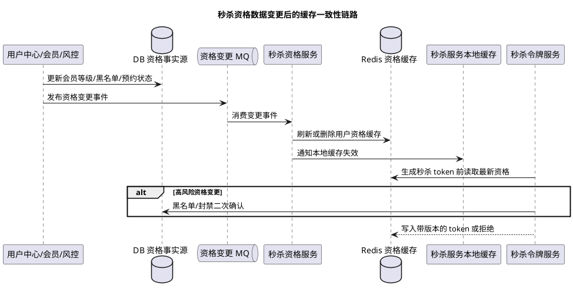

```text
用户中心 / 会员中心 / 风控中心
  -> 业务 DB
  -> 本地消息表 / 事务消息
  -> 用户资格事件
  -> 秒杀资格服务
      -> Redis 用户资格缓存
      -> Redis 黑名单 Set
      -> Redis 预约 Set/Bitmap
      -> 本地缓存
  -> 秒杀 token 接口统一校验资格
  -> 抢购接口 Redis Lua 校验 token、限购、库存
  -> 订单消费者 DB 唯一索引和关键资格兜底
```

### 踩坑点

- 把预热当成永久快照，活动期间不接收用户资格变更。
- 黑名单和普通用户标签放同一个长 TTL 缓存，导致封禁不及时。
- 用户升级 VIP 后没有补偿刷新，造成权益投诉。
- 缓存刷新事件乱序，旧等级覆盖新等级。
- 缓存 miss 时直接查 DB，活动开始后形成击穿。
- Redis 黑名单异常时默认放行所有用户，风险过高。

### 面试话术

> 秒杀预热后的用户资格变化要分场景处理。VIP 升级、实名通过这类正向权益变化，可以通过用户中心或会员中心发送变更事件，秒杀资格服务消费后更新 Redis 用户标签缓存；如果用户马上进入活动页，可以在获取秒杀令牌时做单用户受控刷新，允许短暂最终一致。黑名单、封禁这类负向风控变化要更强一致，风控中心应同步写 Redis 黑名单并发送事件刷新本地缓存，抢购和发 token 都要检查黑名单，异常时对高风险链路失败关闭。预约资格在预约成功时写 DB 后同步写 Redis Set 或 Bitmap，并用本地消息表补偿。为了防止乱序覆盖，用户资格缓存要带版本号或更新时间。总体原则是：权益类最终一致并可补偿，风控类强拦截，抢购接口不直接查 DB。

## Q5：秒杀模式下 Redis 原子递减如何在 Cluster 模式下保持正确？主节点写入后宕机怎么办？

### 背景

秒杀库存扣减常用 Redis Lua，因为 Lua 在单个 Redis 节点上执行时具备原子性。但 Redis Cluster 会把 key 分散到不同 slot，如果 Lua 脚本访问多个 key，就必须保证这些 key 在同一个 slot，否则会报错或无法保证同一次脚本执行。

库存扣减通常不只是一个 `DECR`，还会同时处理：

- 库存 key。
- 用户限购 key。
- 秒杀 token key。
- 抢购资格或预约 key。
- 预占流水 key。

所以 Cluster 模式下的关键是：**同一个 Lua 脚本访问的 key 必须通过 hash tag 固定到同一个 slot**。

### Cluster 下如何保证 Lua 原子扣减正确

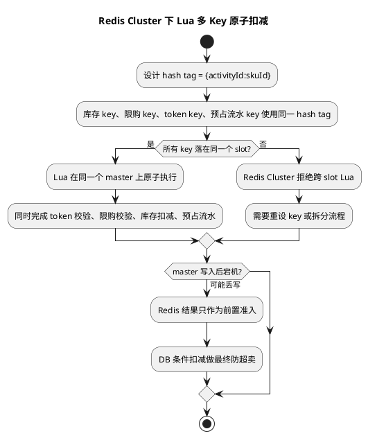

Redis Cluster 根据 key 计算 hash slot：

```text
slot = CRC16(key) % 16384
```

如果 key 中包含 `{}`，只对 `{}` 中的内容计算 slot：

```text
seckill:stock:{activityId:skuId}
seckill:limit:{activityId:skuId}:userId
seckill:token:{activityId:skuId}:userId
seckill:reserve:{activityId:skuId}:eventId
```

这几个 key 都使用 `{activityId:skuId}` 作为 hash tag，因此会落到同一个 slot，同一个 master 节点上。

示例：

```text
seckill:stock:{1001:2001}
seckill:user:limit:{1001:2001}:30001
seckill:token:{1001:2001}:30001
seckill:reserve:{1001:2001}:E202606280001
```

这样 Lua 可以一次性完成：

```text
校验 token
校验用户限购
校验库存
扣减库存
记录预占流水
记录用户限购
```

注意：不要把所有活动都用同一个 hash tag，例如 `{seckill}`。这样会把所有秒杀 key 打到同一个 slot，形成热点分片。hash tag 应该按活动商品粒度设计。

### 推荐 Lua 逻辑

```lua
-- KEYS[1]：库存 Key，例如 seckill:stock:{1001:2001}
-- KEYS[2]：用户限购 Key，例如 seckill:user:limit:{1001:2001}:30001
-- KEYS[3]：秒杀 token Key，例如 seckill:token:{1001:2001}:30001
-- KEYS[4]：预占流水 Key，例如 seckill:reserve:{1001:2001}:E202606280001
-- ARGV[1]：用户提交的 token
-- ARGV[2]：购买数量
-- ARGV[3]：用户限购数量
-- ARGV[4]：预占流水内容，例如 userId、activityId、skuId、expireTime 的 JSON
-- ARGV[5]：预占流水 TTL 秒数

local token = redis.call('GET', KEYS[3])
if token ~= ARGV[1] then
    -- token 不匹配，说明请求可能过期、重复提交或绕过页面。
    return -3
end

local stock = tonumber(redis.call('GET', KEYS[1]) or '0')
local buyCount = tonumber(ARGV[2])
if stock < buyCount then
    -- 库存不足，不允许进入 MQ 和订单链路。
    return -1
end

local userBought = tonumber(redis.call('GET', KEYS[2]) or '0')
local limitCount = tonumber(ARGV[3])
if userBought + buyCount > limitCount then
    -- 用户超过限购，避免同一用户多次占用库存。
    return -2
end

if redis.call('EXISTS', KEYS[4]) == 1 then
    -- 同一个 eventId 已经预占过，按幂等成功处理，避免重试重复扣库存。
    return 2
end

-- 下面几个操作在同一个 Lua 脚本中执行，对同一 slot 的 Redis master 来说具备原子性。
redis.call('DECRBY', KEYS[1], buyCount)
redis.call('INCRBY', KEYS[2], buyCount)
redis.call('SET', KEYS[4], ARGV[4], 'EX', tonumber(ARGV[5]))
redis.call('DEL', KEYS[3])
return 1
```

这段脚本的重点不是只做 `DECRBY`，而是要把“库存扣减”和“预占流水”放在同一个 Redis 原子操作里。否则应用在扣减成功后还没来得及发 MQ 就宕机，会出现库存被扣但没有任何可补偿凭证。

### 主节点写入后宕机怎么办

Redis Cluster 主从复制默认仍然是异步复制。流程可能是：

```text
T1 Lua 在 Master 执行成功
T2 Master 返回成功给应用
T3 写入还没复制到 Replica
T4 Master 宕机
T5 Replica 被提升为新 Master
```

如果 T1 的扣减没有复制到 Replica，新 Master 上可能没有这次扣减和预占流水。这会导致风险：

- Redis 库存回退，可能多放行请求。
- 用户限购记录丢失，可能重复抢。
- 预占流水丢失，补偿任务不知道这次请求。

所以要明确：**Redis 原子性只能保证单节点执行过程正确，不能保证主从故障切换下绝对不丢数据。**

### 工程兜底方案

#### 1. Redis 只做前置准入，DB 做最终防超卖

DB 必须有条件更新兜底：

```sql
UPDATE seckill_sku
SET available_count = available_count - ?,
    reserved_count = reserved_count + ?,
    version = version + 1
WHERE activity_id = ?
  AND sku_id = ?
  AND available_count >= ?;
```

即使 Redis 故障切换导致多放行，DB 条件更新也能防止最终超卖。

#### 2. 订单唯一索引防重复下单

```sql
ALTER TABLE seckill_order
ADD UNIQUE KEY uk_activity_sku_user (activity_id, sku_id, user_id);
```

这样用户重复抢、MQ 重复投递、应用重试，都不会创建多笔订单。

#### 3. 提高 Redis 写安全性

可以使用：

```bash
# 至少有 1 个从节点确认复制后再继续，降低主从切换丢数据概率
WAIT 1 100
```

也可以配置：

```text
min-replicas-to-write 1
min-replicas-max-lag 1
```

这些只能降低丢失概率，不能把 Redis 变成强一致系统，而且会增加延迟、降低可用性。

#### 4. 抢购成功事件要有可靠凭证

推荐在 Lua 中写预占流水，然后由发送 MQ 和补偿扫描共同处理。

```text
Redis Lua 扣库存 + 写 reserve event
  -> 应用发送 MQ
  -> MQ 消费创建订单
  -> 消费成功后确认 reserve event
  -> 超时未确认则补偿扫描处理
```

如果 Redis 主从切换导致预占流水也丢了，就依赖 DB 最终条件更新防超卖；如果 Redis 没丢但 MQ 没发出去，就依赖预占流水扫描补发或释放。

### 面试话术

> Redis Cluster 下秒杀 Lua 扣库存要保证脚本涉及的库存、限购、token、预占流水这些 key 落到同一个 slot，通常用 `{activityId:skuId}` 作为 hash tag。Lua 的原子性只在单个 Redis master 上成立，不能解决主从异步复制下 master 写入后宕机的数据丢失问题。因此 Redis 只能做高并发前置准入，最终不超卖要靠 DB 条件更新、订单唯一索引、消费幂等和库存流水兜底。可以用 `WAIT` 或 `min-replicas-to-write` 降低 Redis 切主丢数据概率，但不能替代 DB 最终一致性保护。

## Q6：如何针对热点商品库存做精准局部保鲜，预防 Redis master 写入后宕机导致库存丢失？

### 背景

这里的“库存保鲜”不是刷新商品详情缓存，而是针对秒杀库存这个热点 key 做短周期校准，降低 Redis master 写成功后宕机、复制未完成导致扣减丢失的影响。

Redis Cluster 中 Lua 原子扣减只能保证单个 master 内执行原子，不能保证主从异步复制下写入一定不丢。典型风险是：

```text
T1 用户 A 抢购成功，Redis master 执行 DECR，库存 100 -> 99
T2 master 返回成功
T3 写入还没复制到 replica
T4 master 宕机，replica 晋升为新 master
T5 新 master 仍然看到库存 100
```

这时 Redis 库存发生“回拨”，后续请求可能被多放行。库存保鲜的目标就是：**用更可靠的库存账本，按热点商品 ID 精准、短周期地把 Redis 库存校准回正确或更保守的值**。

### 保鲜依赖的可靠库存账本

不能只依赖 Redis 一个库存数字。建议 DB 或强可靠存储中至少维护：

| 字段 | 含义 |
| --- | --- |
| `total_count` | 活动总库存 |
| `sold_count` | 已支付确认的库存数量 |
| `reserved_count` | 已创建待支付订单、尚未支付或取消的预占数量 |
| `version` | 库存账本版本，防止旧数据覆盖新数据 |

Redis 中维护：

```text
seckill:stock:{activityId:skuId}          可抢库存
seckill:stock:version:{activityId:skuId}  库存版本
seckill:reserve:{activityId:skuId}:eventId 预占流水
```

理论安全库存：

```text
safeAvailable = total_count - sold_count - reserved_count
```

保鲜时不是盲目把 DB 值刷到 Redis，而是把 Redis 校准到一个“不会比可靠账本更乐观”的值。

### 精准局部保鲜怎么做

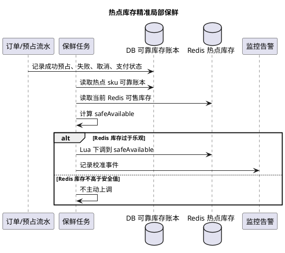

只对热点商品库存做高频保鲜，避免全量扫描拖垮 DB。

热点来源：

- 网关统计 `activityId + skuId` 请求 TopN。
- Redis 客户端统计库存 key TopN。
- 秒杀服务统计扣减成功和失败次数。
- 运营提前标记爆款商品。

热点集合：

```text
seckill:hot:sku -> ZSet
member = activityId:skuId
score = 最近窗口内请求量、扣减量或业务权重
```

保鲜任务只扫描 TopN：

```text
每 200ms / 500ms / 1s 扫描热点商品 TopN
  -> 查询可靠库存账本
  -> 计算 safeAvailable
  -> 读取 Redis 当前库存和版本
  -> 只在需要时校准 Redis 库存
```

频率不是固定越高越好：

- 极热点库存：200ms 到 1s。
- 普通热点：1s 到 5s。
- 非热点：不做高频保鲜，只靠 TTL、补偿和最终对账。

### 校准规则

保鲜最重要的规则：**只允许把 Redis 库存向更保守方向修正，不能因为 DB 账本延迟而盲目调大 Redis 库存。**

推荐：

```text
redisAvailable = Redis 当前库存
safeAvailable = total_count - sold_count - reserved_count

如果 redisAvailable > safeAvailable：
    Redis 可能因为切主丢扣减而变大，需要下调到 safeAvailable

如果 redisAvailable <= safeAvailable：
    不主动上调，避免 DB reserved_count 延迟或订单处理中导致多放行
```

只有明确发生取消、支付超时释放、人工补库存，并且这些变化已经进入可靠账本后，才通过专门的库存回补事件上调 Redis。

### 保鲜 Lua 示例

```lua
-- KEYS[1]：Redis 可抢库存 Key，例如 seckill:stock:{1001:2001}
-- KEYS[2]：Redis 库存版本 Key，例如 seckill:stock:version:{1001:2001}
-- ARGV[1]：可靠账本计算出的安全库存 safeAvailable
-- ARGV[2]：本次账本版本 ledgerVersion

local currentStock = tonumber(redis.call('GET', KEYS[1]) or '0')
local currentVersion = tonumber(redis.call('GET', KEYS[2]) or '0')
local safeAvailable = tonumber(ARGV[1])
local ledgerVersion = tonumber(ARGV[2])

if ledgerVersion < currentVersion then
    -- 旧版本保鲜任务不能覆盖新版本库存，避免乱序校准。
    return -1
end

if currentStock > safeAvailable then
    -- 只在 Redis 比可靠账本更乐观时下调库存，避免多放行。
    redis.call('SET', KEYS[1], safeAvailable)
    redis.call('SET', KEYS[2], ledgerVersion)
    return 1
end

-- Redis 已经比账本更保守，不主动增加库存。
redis.call('SET', KEYS[2], ledgerVersion)
return 0
```

### 为什么只做局部保鲜

全量保鲜会导致：

- 每秒扫大量商品库存，DB 压力过高。
- 冷门商品没必要高频校准。
- 秒杀核心链路和保鲜任务互相抢资源。

所以要按热点商品 ID 精准处理：

```text
热点商品：高频保鲜 + 监控告警 + 更严格 WAIT 或复制要求
普通商品：低频对账 + 订单链路 DB 兜底
冷门商品：活动后对账即可
```

### 面试话术

> 秒杀库存保鲜是为了解决 Redis master 写成功后还没复制就宕机，导致新 master 库存回拨的问题。我的做法不是全量刷新商品缓存，而是维护可靠库存账本，例如 total、sold、reserved 和 version。Redis 扣减只做前置准入，热点商品 ID 通过网关、服务埋点或 Redis key TopN 识别后进入热点集合。保鲜任务只扫描热点商品，按账本计算 `safeAvailable = total - sold - reserved`，如果 Redis 库存大于 safeAvailable，说明 Redis 比可靠账本更乐观，就用 Lua 按版本下调；如果 Redis 更保守，不主动上调，避免因为账本延迟导致多放行。这样可以在 Redis 切主后尽快把库存校准回安全值。

## Q7：基于库存保鲜机制，如何保证高并发下不超卖？

### 背景

有了库存保鲜后，仍然不能把“不超卖”完全寄托在保鲜任务上。因为保鲜是异步的，永远存在时间窗口：

```text
Redis master 丢扣减
  -> 新 master 库存回拨
  -> 保鲜任务下一次扫描前
  -> 可能多放行一批请求
```

所以库存保鲜只能降低 Redis 层错误库存持续时间，真正不超卖要靠多层闸门：

```text
Redis 前置扣减控制流量
DB 条件更新最终裁决
订单唯一索引防重复
预占流水和补偿任务保证可追踪
保鲜任务缩短 Redis 库存错误窗口
```

### 正确的不超卖边界

严格意义上，最终不超卖看 DB 成功订单数，而不是 Redis 放行数。

DB 条件更新必须存在：

```sql
UPDATE seckill_sku
SET available_count = available_count - ?,
    reserved_count = reserved_count + ?,
    version = version + 1
WHERE activity_id = ?
  AND sku_id = ?
  AND available_count >= ?;
```

只有这条 SQL 更新成功，才代表 DB 成功预占库存并允许创建待支付订单。Redis 扣减成功只能代表“抢购资格暂时通过”；支付成功后还要把 DB 库存从 `reserved_count` 转入 `sold_count`。

订单表还要用唯一索引防一人多单：

```sql
ALTER TABLE seckill_order
ADD UNIQUE KEY uk_activity_sku_user (activity_id, sku_id, user_id);
```

### 保鲜机制下的推荐链路

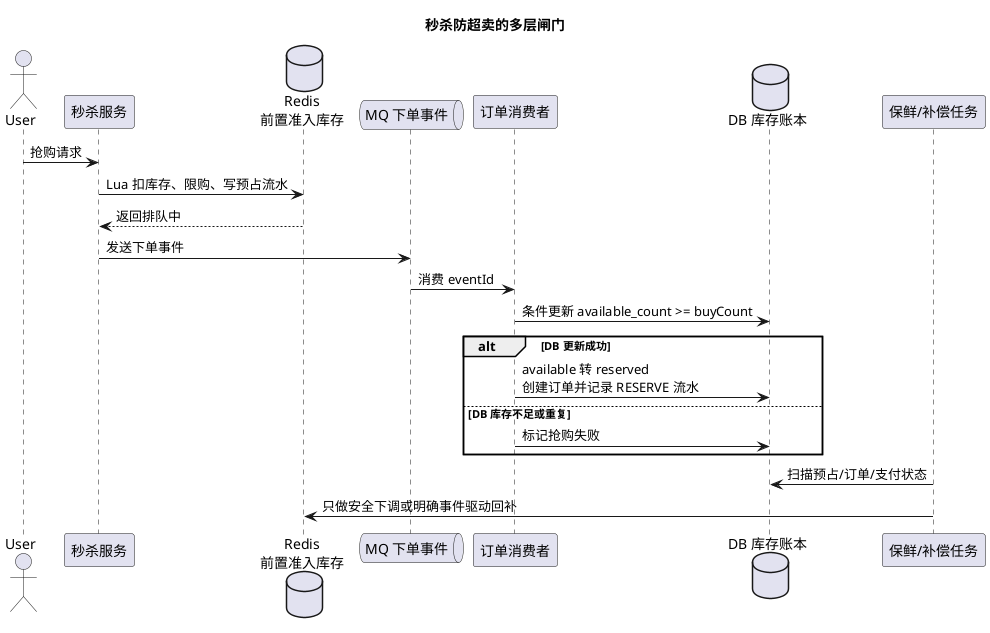

```text
1. Redis Lua 校验 token、限购、库存，并扣减 Redis 可抢库存
2. Lua 同时写 Redis 预占流水 eventId
3. 应用发送 MQ 下单事件
4. 消费者按 eventId 幂等消费
5. DB 条件更新 available_count 并转入 reserved_count，成功才创建待支付订单
6. 支付或取消后把 reserved_count 转入 sold_count 或退回 available_count
7. 保鲜任务基于可靠账本下调 Redis 过于乐观的库存
8. 超时未消费或失败的预占流水，由补偿任务决定补发 MQ 或释放库存
```

这条链路里有两个库存口径：

| 口径 | 作用 |
| --- | --- |
| Redis 库存 | 高并发前置准入，尽量少放行无效请求 |
| DB 账本库存 | 最终裁决，不允许超过总库存 |

### 如果 Redis 切主后多放行了怎么办

假设总库存 100，Redis 因 master 宕机丢了 5 次扣减，新 master 多放行了 5 个请求。

处理结果应该是：

```text
Redis 多放行 -> MQ 多进来几条消息 -> DB 条件更新只允许前 100 个成功 -> 多出来的消费者更新失败 -> 标记抢购失败 -> 释放或关闭对应预占流水
```

也就是说，Redis 层允许存在“多发资格”的小概率窗口，但 DB 层不能允许“多创建成功订单”。

用户体验上可以返回：

```text
排队中 -> 抢购失败，库存不足
```

而不是 Redis 扣减成功就直接告诉用户“下单成功”。

### 库存回补为什么要谨慎

为了避免超卖，回补库存必须基于可靠状态，而不能简单看到 MQ 没消费就 `INCRBY`。

释放前要检查：

```text
1. 预占流水仍是 RESERVED/SENT
2. 未找到成功订单
3. 预占已过期
4. CAS 把流水改为 CANCELED 成功
5. 再通过库存回补事件或 Lua 回补 Redis
```

如果消费者已经创建订单成功，补偿任务又把库存回补，就会重复放行，形成超卖风险。

### 保鲜和回补要分开

库存保鲜一般只做“安全下调”：

```text
redisAvailable > safeAvailable -> 下调
redisAvailable <= safeAvailable -> 不动
```

库存回补则必须由明确业务事件驱动：

- 订单超时取消。
- 支付失败。
- 用户主动取消。
- 消费失败且确认未创建订单。
- 运营人工补库存。

这样可以避免保鲜任务因为账本延迟而错误上调 Redis 库存。

### 踩坑点

- Redis 扣减成功就直接返回“下单成功”，会把 Redis 当最终事实源。
- 保鲜任务直接用 DB 库存覆盖 Redis 库存，可能因为 DB 账本延迟造成库存上调。
- MQ 未消费就立即回补库存，可能和消费者成功创建订单并发。
- 没有订单唯一索引，重复消息可能创建多单。
- 没有 DB 条件更新，Redis 切主多放行后会真的超卖。
- 预占流水只放 Redis，Redis 切主丢失后补偿任务没有可靠依据，关键流水应落 DB 或可靠消息表。

### 面试话术

> 库存保鲜只能缩短 Redis 库存回拨的窗口，不能单独保证不超卖。我的设计是 Redis 负责前置准入，DB 负责最终裁决。Redis Lua 扣库存并写预占流水，扣减成功后只返回排队中；MQ 消费时通过 DB 条件更新 `available_count >= buyCount`，把库存从 available 转入 reserved 并创建待支付订单，订单表唯一索引防重复下单。支付或取消再把 reserved 转入 sold 或退回 available。保鲜任务按热点商品 ID 读取可靠账本，计算 safeAvailable，只在 Redis 库存比账本更乐观时下调，不主动上调。即使 Redis master 宕机导致库存回拨、多放行请求，最终 DB 条件更新也只允许总库存内的订单成功，多出来的消息按库存不足失败处理。回补库存必须基于预占流水状态、订单状态和 CAS，不能看到 MQ 未消费就直接加回 Redis。

## Q8：秒杀系统中的业务流水和库存流水应该如何设计？

### 背景

前面的设计虽然提到了 `eventId`、预占记录和库存账本，但还没有完整回答以下问题：

- 某次抢购请求目前执行到哪一步？
- Redis 已扣减但 MQ 没有消息时，应该补发还是释放？
- 一件库存为什么减少、确认售出或重新释放？
- 支付成功与超时取消并发时，哪一方真正改变了库存？
- Redis、库存汇总表、订单表对不上时，以什么凭证对账？

普通应用日志只能帮助排查，不能作为补偿依据。秒杀系统需要可查询、可幂等、可审计的业务流水，推荐拆成三类数据：

| 数据 | 主要职责 | 是否作为事实依据 |
| --- | --- | --- |
| 抢购请求流水 | 跟踪一次 `eventId` 从 Redis 准入到订单结果的全链路状态 | 是，但不直接计算最终库存 |
| 库存变更流水 | 记录可用、预占、已售库存的每一次账务变化 | 是，和库存汇总表共同构成可靠账本 |
| 本地事件表 | 可靠投递库存回补、结果通知、对账事件 | 是，解决 DB 与 Redis/MQ 之间的一致性 |

订单表仍然表达“用户买了什么、订单处于什么状态”，不能用订单表代替库存流水；应用日志也不能代替以上三类业务数据。

### 库存口径与流转

DB 可靠库存建议显式维护三个口径：

| 字段 | 含义 |
| --- | --- |
| `available_count` | 仍可被订单消费者确认的库存 |
| `reserved_count` | 已创建待支付订单、尚未支付或取消的库存 |
| `sold_count` | 已支付确认的库存 |

始终满足以下不变量：

```text
total_count = available_count + reserved_count + sold_count
```

Redis 中的扣减只是高并发准入预扣，不直接改变 DB 的 `sold_count`。真正的账务变化发生在订单消费者、支付确认和订单取消的 DB 本地事务中。

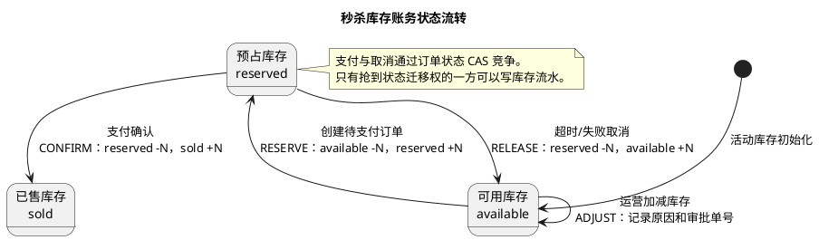

如果业务选择“创建订单即计入已售”，也可以只维护 `available + occupied` 两个口径，但全系统必须统一语义。不能一处把 `sold_count` 理解为已创建订单，另一处又理解为已支付订单。

### 抢购请求流水

抢购请求流水以 `eventId` 为全链路唯一标识，解决请求追踪和阶段性补偿问题。建议状态包括：

```text
INIT
  -> REDIS_RESERVED
  -> MQ_SENT
  -> ORDER_CREATED
  -> PAID / CANCELED

任意处理中状态
  -> FAILED
```

参考字段：

| 字段 | 作用 |
| --- | --- |
| `event_id` | 一次抢购事件的唯一编号，也是 MQ 幂等键 |
| `activity_id / sku_id / user_id` | 定位活动、商品和用户 |
| `quantity` | 本次申请数量 |
| `request_status` | 当前处理阶段 |
| `order_id` | 创建成功后关联订单 |
| `fail_code / fail_message` | 记录可枚举失败原因，供补偿和运营查询 |
| `last_mq_id` | 关联最近一次消息投递 |
| `version` | CAS 更新状态，防止重试覆盖新状态 |
| `create_time / update_time` | 计算超时和链路耗时 |

数据库唯一约束至少包括：

```sql
-- event_id 负责消息和重试幂等；业务唯一键负责一人一单兜底。
ALTER TABLE seckill_request_flow
    ADD UNIQUE KEY uk_event_id (event_id),
    ADD UNIQUE KEY uk_activity_sku_user (activity_id, sku_id, user_id);
```

极高并发下不要在 Redis 扣减前同步插入 DB 请求流水，否则入口又会被数据库写能力限制。可以先在 Lua 中原子写入短期 Redis 预占凭证，再通过可靠 MQ 异步落 DB 请求流水；接口只返回“排队中”，订单消费者最终确认结果。

### 库存流水表设计

库存流水采用只追加、不修改历史记录的账本模式。一次库存操作写一条新流水，不要把原流水从 `RESERVE` 直接更新成 `RELEASE`，否则会丢失完整变化过程。

参考表结构：

```sql
CREATE TABLE seckill_stock_ledger (
    id BIGINT NOT NULL,
    ledger_no VARCHAR(64) NOT NULL COMMENT '库存流水号',
    event_id VARCHAR(64) NOT NULL COMMENT '抢购事件 ID',
    order_id BIGINT NULL COMMENT '订单创建后回填关联',
    activity_id BIGINT NOT NULL,
    sku_id BIGINT NOT NULL,
    operation_type VARCHAR(16) NOT NULL COMMENT 'RESERVE/CONFIRM/RELEASE/ADJUST',
    quantity INT NOT NULL COMMENT '本次操作数量，使用正数表达业务数量',
    available_delta INT NOT NULL COMMENT '可用库存变化量',
    reserved_delta INT NOT NULL COMMENT '预占库存变化量',
    sold_delta INT NOT NULL COMMENT '已售库存变化量',
    stock_version BIGINT NOT NULL COMMENT '库存汇总表变更后的版本',
    reason_code VARCHAR(32) NULL COMMENT '取消、支付失败、人工调整等原因',
    create_time DATETIME(3) NOT NULL,
    PRIMARY KEY (id),
    UNIQUE KEY uk_ledger_no (ledger_no),
    UNIQUE KEY uk_biz_operation (event_id, operation_type),
    KEY idx_sku_time (activity_id, sku_id, create_time),
    KEY idx_order_id (order_id)
) COMMENT='秒杀库存变更流水';
```

关键设计点：

- `quantity` 记录业务数量，三个 `delta` 明确库存从哪个账户转到哪个账户。
- `(event_id, operation_type)` 防止 MQ 重试或定时任务重复执行同一种库存操作。
- `stock_version` 用于定位变更顺序，也可阻止旧保鲜数据覆盖新库存。
- `reason_code` 必须使用稳定枚举，不能只记录一段无法统计的文本。
- 失败请求不写成功库存流水，只在请求流水中记录失败；库存流水只记录已经提交的账务变化。

典型流水如下：

| 操作 | `available_delta` | `reserved_delta` | `sold_delta` |
| --- | ---: | ---: | ---: |
| `RESERVE` 创建待支付订单 | `-N` | `+N` | `0` |
| `CONFIRM` 支付成功 | `0` | `-N` | `+N` |
| `RELEASE` 超时或失败取消 | `+N` | `-N` | `0` |
| `ADJUST` 运营增加库存 | `+N` | `0` | `0` |

### 流水如何可靠落库

订单、库存汇总和库存流水必须在同一个 DB 本地事务内提交。DB 提交后需要回补 Redis 或发送下游消息时，再通过同事务写入的本地事件表异步投递，避免 DB 成功但外部消息丢失。

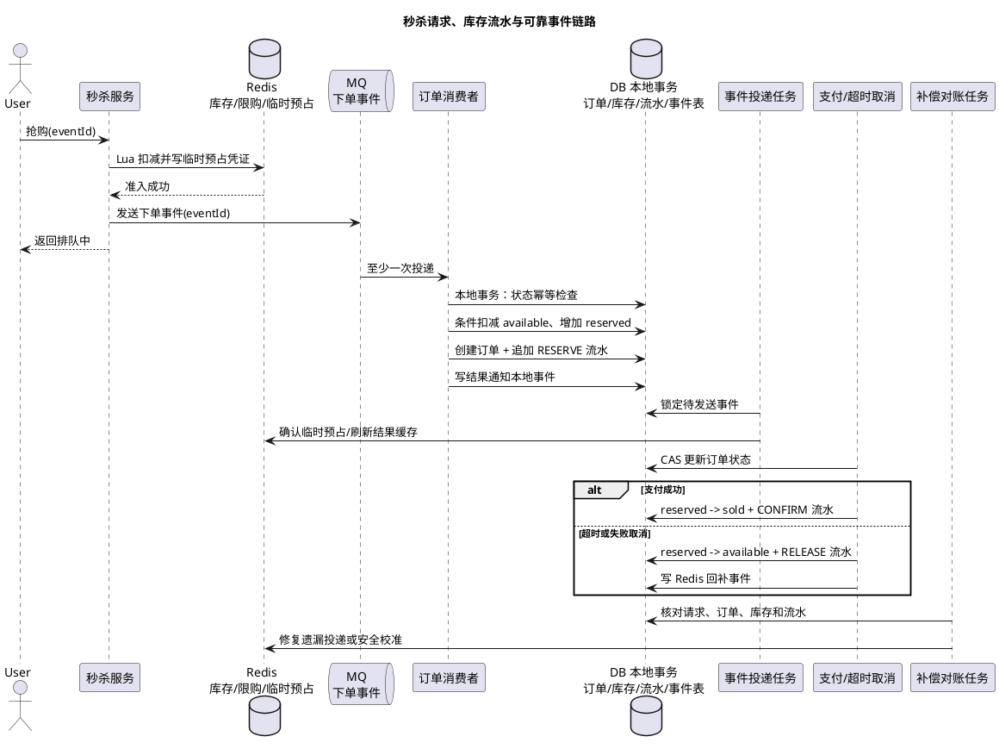

创建待支付订单的本地事务建议按以下顺序执行：

```text
1. 按 eventId 插入或读取请求流水，重复消息直接返回已有结果
2. DB 条件更新：available_count >= quantity
3. 创建订单，依赖订单业务唯一索引防一人多单
4. 追加 RESERVE 库存流水
5. 更新请求流水为 ORDER_CREATED，并关联 orderId
6. 插入结果通知本地事件
7. 一次性提交事务
```

其中第 2 到第 6 步必须同事务。任何一步失败都整体回滚，不能出现“库存汇总已变但没有流水”或“已有订单但没有预占库存”。

### 支付与取消并发处理

支付回调和超时取消可能同时执行，必须先竞争订单状态，再由胜出者改变库存：

```sql
-- 支付方只有成功把 WAIT_PAY 改为 PAID，才允许写 CONFIRM 流水。
UPDATE seckill_order
SET status = 'PAID', version = version + 1
WHERE id = ? AND status = 'WAIT_PAY';

-- 取消方只有成功把 WAIT_PAY 改为 CANCELED，才允许写 RELEASE 流水。
UPDATE seckill_order
SET status = 'CANCELED', version = version + 1
WHERE id = ? AND status = 'WAIT_PAY';
```

两个操作各自在自己的本地事务中完成“订单状态 CAS + 库存汇总变更 + 追加库存流水 + 本地事件”。更新行数为 `0` 的一方读取最终订单状态并按幂等结果返回，不能继续写库存流水。

### 补偿与对账规则

流水的价值不是“有记录”，而是能够驱动确定性的补偿。建议检查以下不变量：

```text
库存汇总：total = available + reserved + sold
预占库存：SUM(RESERVE) - SUM(CONFIRM) - SUM(RELEASE) = reserved
订单对应：WAIT_PAY 订单数量之和 = reserved
已售对应：PAID 订单数量之和 = sold
事件闭环：每个 REDIS_RESERVED 的 eventId 最终必须进入成功或失败终态
幂等约束：每个 eventId 的 RESERVE/CONFIRM/RELEASE 各最多一条
```

补偿动作不能只根据请求流水的旧状态执行，还要联合订单表和库存流水判断：

| 异常 | 判断依据 | 补偿动作 |
| --- | --- | --- |
| Redis 已预占但长期没有 MQ 结果 | Redis 临时凭证存在，DB 无订单和 `RESERVE` 流水 | 优先补发 MQ；超过业务时限后 CAS 关闭并回补 |
| 请求流水为处理中但订单已创建 | 订单和 `RESERVE` 流水存在 | 把请求流水推进到 `ORDER_CREATED`，不重复扣库存 |
| 订单已取消但没有 `RELEASE` | 取消状态存在且 `RELEASE` 唯一键不存在 | 在受控事务中补写释放流水并回补汇总库存 |
| 本地事件长期未发送 | 事件表状态为 `NEW/RETRY` | 带退避重试，超过阈值告警和人工介入 |
| 库存汇总与流水不一致 | 按 SKU 聚合流水与订单交叉验证 | 冻结自动上调，生成差异单后修复 |

自动补偿必须通过唯一键、状态 CAS 或分布式锁保证同一事件不会被多个任务重复执行。库存对不上时应优先停止自动增加可售库存，因为错误上调会带来超卖；可以先降低 Redis 可售库存并告警，再完成差异确认。

### 踩坑点

- 只记接口访问日志，没有稳定 `eventId`，无法关联 Redis、MQ、订单和支付。
- 只维护一张可更新的“当前流水”，覆盖历史状态后无法审计完整库存变化。
- 把 Redis 预占记录当成永久可靠流水，Redis 切主时流水和扣减可能一起丢失。
- 订单、库存汇总、库存流水分多个事务提交，失败后产生无法解释的中间状态。
- 支付和取消都先改库存再改订单状态，容易重复确认或重复释放。
- 定时任务看到 MQ 未消费就直接回补，没有检查订单是否已经创建。
- 对账发现差异后直接把 Redis 调大到 DB 值，可能因账本延迟再次多放行。

### 面试话术

> 秒杀流水不能只理解为应用日志。我会设计抢购请求流水、库存变更流水和本地事件表。`eventId` 串起 Redis 预占、MQ、订单和支付结果；库存流水采用只追加账本，记录 `RESERVE、CONFIRM、RELEASE、ADJUST` 以及 available、reserved、sold 的变化量。订单、库存汇总、库存流水和本地事件必须在同一个 DB 本地事务提交，支付与取消先通过订单状态 CAS 竞争，胜出者才允许改变库存并追加流水。DB 与 Redis 之间通过本地事件表最终一致，补偿任务按 eventId、订单状态和库存流水联合判断，不能看到消息超时就直接回补。这样流水既能做幂等和审计，也能支撑异常补偿与库存对账。

## 高频追问

- Q：秒杀为什么不能直接查 DB 扣库存？
  A：秒杀瞬时流量太高，直接打 DB 会造成锁竞争、连接池耗尽和慢 SQL 堆积。通常用 Redis 前置原子扣减，再用 MQ 异步写 DB，DB 做最终兜底。

- Q：Redis 扣库存成功但订单创建失败怎么办？
  A：要记录库存流水或抢购事件，通过补偿任务释放库存或标记失败；如果是用户重复下单导致失败，要按幂等处理，不能随意回补库存。

- Q：如何防止一人多单？
  A：Redis Lua 中做用户限购计数，订单表加 `(activity_id, sku_id, user_id)` 唯一索引，消费端按 eventId 幂等。

- Q：MQ 积压严重怎么办？
  A：入口降级或降低放行比例，消费者限速保护 DB，必要时扩容消费者。不能无限扩容消费者把压力转移到数据库。

- Q：库存售罄后还有大量请求怎么办？
  A：设置 Redis 售罄标记和本地售罄标记，在网关或服务层快速失败，减少对 Redis 和后端服务的无效访问。

- Q：秒杀系统最重要的容错机制是什么？
  A：限流保护入口，MQ 削峰保护 DB，幂等防重复，补偿对账修复异常，隔离防止秒杀拖垮普通业务。

- Q：防刷和限流有什么区别？
  A：限流主要控制请求数量，防刷主要识别异常请求并提高脚本成本。秒杀里一般是防刷、限流、幂等、风控一起使用。

- Q：秒杀令牌能完全防刷吗？
  A：不能。令牌只能防止提前构造接口和绕过页面，仍要结合限流、验证码、设备指纹、Redis Lua、订单唯一索引和风控。

- Q：秒杀用户资格校验要不要全量预热用户信息？
  A：不建议全量预热所有用户画像。活动规则、库存、预约名单适合预热；黑名单持续同步；实名、会员等级、地区等标签可以目标用户预热加懒加载短缓存；限购次数必须用 Redis Lua 实时原子计数。

- Q：缓存里的用户资格和用户中心不一致怎么办？
  A：要看业务容忍度。黑名单、封禁这类高风险状态要通过 MQ 或配置中心尽快同步，并设置较短 TTL；最终下单仍用 DB 唯一索引、订单状态和风控补偿兜底。

- Q：VIP 刚升级但秒杀缓存还没刷新，用户被误拒绝怎么办？
  A：可以在获取秒杀 token 时做单用户受控刷新，或者提示稍后重试。VIP 升级属于权益类变化，可以接受短暂最终一致，但要能通过事件和懒加载快速补齐。

- Q：黑名单刚新增但本地缓存没刷新怎么办？
  A：黑名单不能只靠本地长 TTL 缓存。应同步写 Redis 黑名单 Set，并通过事件刷新本地缓存；抢购关键链路至少查 Redis 黑名单，异常时高风险活动应失败关闭。

- Q：Redis Cluster 下 Lua 为什么要用 hash tag？
  A：因为 Cluster 中 Lua 脚本访问的多个 key 必须在同一个 slot，使用 `{activityId:skuId}` 这类 hash tag 可以让库存、限购、token、预占流水落到同一个 master 上，保证脚本内原子执行。

- Q：库存保鲜任务能单独保证不超卖吗？
  A：不能。保鲜任务只能缩短 Redis 库存回拨的错误窗口，最终不超卖必须依赖 DB 条件更新、订单唯一索引、消费幂等和预占流水状态机。

- Q：秒杀请求流水和库存流水为什么不能合成一张表？
  A：请求流水描述一次抢购执行到了哪个阶段，库存流水描述库存账户发生了什么不可变变化，两者生命周期和查询维度不同。强行合并会让状态更新覆盖账务历史，也不利于按 SKU 聚合对账。

- Q：为什么库存流水不能只存 Redis？
  A：Redis 适合高并发临时预占，但主从异步复制和故障切换下可能同时丢失扣减与预占记录。最终库存流水要和 DB 库存汇总、订单在本地事务中持久化，Redis 流水只作为入口补偿凭证。

## 复习清单

- [ ] 能画出秒杀从入口到异步下单的完整链路。
- [ ] 能说明入口防刷、限流、令牌和快速失败的作用。
- [ ] 能讲清 Redis Lua 扣库存和用户限购为什么要原子执行。
- [ ] 能解释 MQ 如何削峰，以及消费端如何做幂等。
- [ ] 能说明 DB 唯一索引和条件更新如何做最终兜底。
- [ ] 能列出限流、降级、熔断、隔离、补偿、对账等容错机制。
- [ ] 能回答 Redis 故障、MQ 积压、订单创建失败、库存不一致时怎么处理。
- [ ] 能说明秒杀防刷和限流、幂等、风控的区别。
- [ ] 能设计秒杀令牌、动态 URL、验证码、设备/IP/用户限流的组合方案。
- [ ] 能把登录态、实名、黑名单、预约、限购、活动规则拆分到网关、缓存、Redis Lua 和 DB 兜底层。
- [ ] 能说明哪些用户资格数据适合预热，哪些适合懒加载短缓存。
- [ ] 能区分 VIP 升级这类权益变化和黑名单这类风控变化的缓存一致性策略。
- [ ] 能说明用户资格缓存为什么需要版本号或更新时间防止乱序覆盖。
- [ ] 能说明 Redis Cluster 下 Lua 脚本 key 如何通过 hash tag 保持同 slot。
- [ ] 能解释 Redis 主节点写入后宕机为什么仍可能丢扣减，以及 DB 如何兜底不超卖。
- [ ] 能设计针对热点商品库存的精准保鲜方案，降低 Redis master 写入后宕机导致库存回拨的影响。
- [ ] 能说明库存保鲜机制下，如何通过 DB 条件更新、预占流水、补偿扫描和订单唯一索引防止超卖。
- [ ] 能区分抢购请求流水、库存变更流水和本地事件表的职责。
- [ ] 能说明 `RESERVE、CONFIRM、RELEASE` 如何在 available、reserved、sold 之间转移库存。
- [ ] 能设计订单、库存汇总、库存流水和本地事件的本地事务边界。
- [ ] 能根据 eventId、订单状态和库存流水设计补偿与对账规则。
