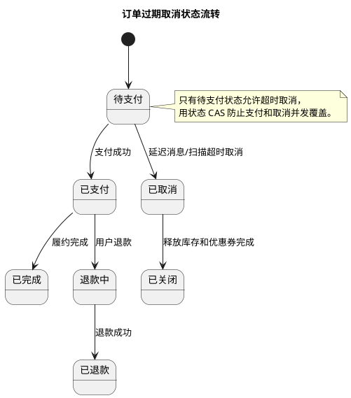

# 订单过期取消实践

## 问题索引

- Q1：业务实践场景题：怎么做订单过期取消？

## Q1：业务实践场景题：怎么做订单过期取消？

### 背景

订单过期取消是电商、CRM 订货、活动报名、库存预占类系统里很常见的场景：

```text
用户创建订单
  -> 订单状态为待支付
  -> 系统预占库存、优惠券或活动名额
  -> 超过 15 分钟未支付
  -> 自动取消订单并释放资源
```

难点不是“到点改状态”这么简单，而是要处理：

- 用户刚好在过期边界支付。
- 取消任务重复执行。
- MQ 消息丢失或延迟。
- 定时任务多实例并发扫描。
- 订单状态不能跳过中间状态。
- 库存、优惠券、积分等资源要一致释放。

### 核心目标

一个可靠的订单过期取消方案至少要满足：

| 目标 | 说明 |
| --- | --- |
| 准时性 | 尽量在过期时间附近触发取消 |
| 正确性 | 已支付订单不能被取消 |
| 幂等性 | 重复消息、重复扫描不能重复释放资源 |
| 可恢复 | MQ 丢消息、任务失败后可以补偿 |
| 可观测 | 能看到待取消积压、失败原因、补偿情况 |

### 常见方案对比

#### 1. 定时任务扫表

思路：

```sql
SELECT id
FROM orders
WHERE status = 'WAIT_PAY'
  AND expire_time <= NOW()
LIMIT 500;
```

然后逐个取消。

优点：

- 实现简单。
- 不依赖 MQ。
- 天然适合做兜底补偿。

缺点：

- 准时性取决于扫描频率。
- 大表扫描压力大。
- 多实例扫描要处理并发重复。

适合：

- 订单量不大。
- 作为延迟消息方案的补偿任务。

#### 2. Redis TTL 过期监听

思路：

```text
创建订单时写入 Redis Key：order:expire:{orderId}
设置 TTL = 15 分钟
监听 Redis key expired 事件
收到事件后取消订单
```

优点：

- 实现直观。
- 延迟相对较低。

缺点：

- Redis 过期事件不是强可靠消息。
- Redis 重启、主从切换、配置关闭通知都可能丢事件。
- 不适合做订单取消的唯一依据。

结论：

Redis TTL 可以做提醒或轻量触发，但订单取消不能只靠它。

#### 3. MQ 延迟消息

思路：

```text
创建订单成功后发送延迟消息
延迟 15 分钟后消费者收到 orderId
消费者检查订单是否仍为 WAIT_PAY
如果仍待支付，则执行取消
```

优点：

- 准时性较好。
- 不需要频繁扫表。
- 更适合中高并发场景。

缺点：

- 依赖 MQ 延迟能力。
- 消息可能重复投递。
- 消息丢失或消费失败仍需补偿。

适合：

- RocketMQ 延迟消息。
- RabbitMQ TTL + 死信队列。
- Kafka 配合延迟队列组件或时间轮服务。

#### 4. 时间轮

思路：

应用或独立调度服务维护时间轮，把订单取消任务挂到未来某个槽位。

优点：

- 性能高。
- 适合大量短延迟任务。

缺点：

- 单机内存时间轮不可靠，重启会丢任务。
- 分布式时间轮实现复杂。
- 仍需要持久化任务和补偿扫描。

适合：

- 自研调度平台。
- 高频、短延迟、可恢复任务。

### 推荐方案

生产上更推荐：

```text
订单状态机 + MQ 延迟消息 + DB 条件更新 + 本地消息表/事务消息 + 定时扫描补偿
```

整体流程：

```text
1. 创建订单
2. 本地事务内写订单 WAIT_PAY、写资源预占、写过期取消消息记录
3. 发送延迟消息 order_expire_check
4. 延迟到期后消费者查询订单
5. 如果订单仍是 WAIT_PAY 且 expire_time <= now，则 CAS 更新为 CANCELED
6. 取消成功后释放库存、优惠券、活动名额
7. 扫描任务定期补偿漏处理订单
```

### 表结构设计

#### 订单表

```sql
CREATE TABLE orders (
  id BIGINT PRIMARY KEY,
  order_no VARCHAR(64) NOT NULL,
  user_id BIGINT NOT NULL,
  status VARCHAR(32) NOT NULL,
  expire_time DATETIME NOT NULL,
  paid_time DATETIME NULL,
  cancel_time DATETIME NULL,
  cancel_reason VARCHAR(64) NULL,
  version BIGINT NOT NULL DEFAULT 0,
  create_time DATETIME NOT NULL,
  update_time DATETIME NOT NULL,
  UNIQUE KEY uk_order_no (order_no),
  KEY idx_status_expire_time (status, expire_time)
);
```

关键索引：

- `uk_order_no`：保证订单号唯一。
- `idx_status_expire_time`：支撑补偿扫描。

#### 订单状态流转记录

```sql
CREATE TABLE order_status_log (
  id BIGINT PRIMARY KEY,
  order_id BIGINT NOT NULL,
  from_status VARCHAR(32) NOT NULL,
  to_status VARCHAR(32) NOT NULL,
  event_type VARCHAR(64) NOT NULL,
  event_id VARCHAR(128) NOT NULL,
  create_time DATETIME NOT NULL,
  UNIQUE KEY uk_event_id (event_id),
  KEY idx_order_id (order_id)
);
```

作用：

- 记录状态变化。
- 用 `event_id` 防重复。
- 方便排查“订单为什么被取消”。

### 核心状态机


### PlantUML 示意图：订单过期取消状态机



订单状态可以简化为：

```text
WAIT_PAY -> PAID
WAIT_PAY -> CANCELED
PAID -> REFUNDING -> REFUNDED
```

过期取消只允许：

```text
WAIT_PAY -> CANCELED
```

绝不能允许：

```text
PAID -> CANCELED
```

所以取消 SQL 必须带状态条件：

```sql
UPDATE orders
SET status = 'CANCELED',
    cancel_time = NOW(),
    cancel_reason = 'PAY_TIMEOUT',
    version = version + 1,
    update_time = NOW()
WHERE id = ?
  AND status = 'WAIT_PAY'
  AND expire_time <= NOW();
```

根据影响行数判断：

| 影响行数 | 含义 |
| --- | --- |
| 1 | 取消成功，可以释放资源 |
| 0 | 订单已支付、已取消、未到期或不存在，不再释放资源 |

### 延迟消息实现

#### RocketMQ 延迟消息

创建订单后发送延迟消息：

```java
public void sendOrderExpireMessage(Long orderId, LocalDateTime expireTime) {
    OrderExpireMessage body = new OrderExpireMessage(orderId, expireTime);

    Message<OrderExpireMessage> message = MessageBuilder
        .withPayload(body)
        // orderId 用作业务键，方便在 MQ 控制台按订单排查消息。
        .setHeader("KEYS", String.valueOf(orderId))
        .build();

    // 延迟等级要结合 RocketMQ 版本能力选择；不支持任意延迟时，要映射到固定延迟级别。
    rocketMQTemplate.syncSend("order_expire_topic", message, 3000, delayLevel);
}
```

消费端：

```java
public void onMessage(OrderExpireMessage message) {
    Long orderId = message.getOrderId();

    // 消费端必须重新查库判断状态，不能因为消息到了就直接取消。
    Order order = orderRepository.findById(orderId);
    if (order == null) {
        return;
    }

    if (!"WAIT_PAY".equals(order.getStatus())) {
        // 已支付或已取消的订单直接忽略，保证重复消息安全。
        return;
    }

    if (order.getExpireTime().isAfter(LocalDateTime.now())) {
        // 延迟消息可能提前或系统时间有差异，未到期不能取消。
        return;
    }

    // 条件更新是最终防线，防止支付和取消并发时误取消已支付订单。
    boolean canceled = orderService.cancelTimeoutOrder(orderId, message.getEventId());
    if (!canceled) {
        return;
    }

    // 只有订单状态真正从 WAIT_PAY -> CANCELED 后，才释放库存等资源。
    resourceReleaseService.releaseByOrderId(orderId);
}
```

### 支付和取消并发怎么处理

最关键的是：支付成功和过期取消都必须用状态条件更新。

#### 支付成功

```sql
UPDATE orders
SET status = 'PAID',
    paid_time = NOW(),
    version = version + 1,
    update_time = NOW()
WHERE id = ?
  AND status = 'WAIT_PAY';
```

#### 过期取消

```sql
UPDATE orders
SET status = 'CANCELED',
    cancel_time = NOW(),
    cancel_reason = 'PAY_TIMEOUT',
    version = version + 1,
    update_time = NOW()
WHERE id = ?
  AND status = 'WAIT_PAY'
  AND expire_time <= NOW();
```

并发结果：

| 场景 | 结果 |
| --- | --- |
| 支付先成功 | 取消 SQL 影响 0 行，不释放资源 |
| 取消先成功 | 支付 SQL 影响 0 行，支付回调需要走退款或关闭支付单 |
| 两者同时到达 | 由数据库行锁和条件更新决定只有一个成功 |

这里不要用“先查状态再更新”作为唯一判断，因为查和改之间会有并发窗口。

### 补偿扫描

延迟消息不能作为唯一保障。需要定时任务扫描漏处理订单：

```sql
SELECT id
FROM orders
WHERE status = 'WAIT_PAY'
  AND expire_time <= NOW()
ORDER BY expire_time
LIMIT 500;
```

多实例部署时，要避免多个节点重复处理同一批订单。常见方式：

#### 1. 直接依赖状态 CAS

多个节点扫到同一订单也没关系，最终只有一个 `UPDATE ... WHERE status = 'WAIT_PAY'` 成功。

优点：

- 简单。
- 不需要分布式锁。

缺点：

- 会有少量重复查询和重复尝试。

适合大多数场景。

#### 2. 分片扫描

```sql
SELECT id
FROM orders
WHERE status = 'WAIT_PAY'
  AND expire_time <= NOW()
  AND MOD(id, ?) = ?
ORDER BY expire_time
LIMIT 500;
```

例如 4 个节点：

```text
节点 A 扫 id % 4 = 0
节点 B 扫 id % 4 = 1
节点 C 扫 id % 4 = 2
节点 D 扫 id % 4 = 3
```

优点：

- 减少重复扫描。

缺点：

- 扩缩容时分片数量变化要处理。

#### 3. 任务认领

在订单表或过期任务表增加 `process_status`、`process_owner`、`process_expire_time`，先抢占再处理。

适合：

- 单次处理成本很高。
- 需要严格控制重复处理。
- 任务量大且取消动作复杂。

### 资源释放一致性

订单取消通常不只改订单状态，还要释放：

- 库存。
- 优惠券。
- 积分。
- 活动名额。
- 赠品资格。

建议每个资源释放都做幂等。

例如库存预占表：

```sql
CREATE TABLE stock_reservation (
  id BIGINT PRIMARY KEY,
  order_id BIGINT NOT NULL,
  sku_id BIGINT NOT NULL,
  quantity INT NOT NULL,
  status VARCHAR(32) NOT NULL,
  create_time DATETIME NOT NULL,
  update_time DATETIME NOT NULL,
  UNIQUE KEY uk_order_sku (order_id, sku_id)
);
```

释放库存：

```sql
UPDATE stock_reservation
SET status = 'RELEASED',
    update_time = NOW()
WHERE order_id = ?
  AND status = 'RESERVED';
```

只有释放记录从 `RESERVED -> RELEASED` 成功后，才把库存加回可售数量。

### 异常处理

#### 延迟消息丢失

靠补偿扫描兜底。

#### 消费失败

MQ 重试；多次失败后进入死信队列，人工或任务补偿。

#### 订单取消成功但释放库存失败

不要只靠内存重试。可以：

- 写资源释放任务表。
- 用本地消息表发送资源释放事件。
- 后台任务按状态补偿。

#### 支付回调晚于取消

如果订单已取消但支付渠道通知支付成功：

- 查询支付单状态。
- 如果确认已支付，走退款流程。
- 订单状态不要从 `CANCELED` 直接改 `PAID`，除非业务明确支持恢复订单。

### 监控指标

- `WAIT_PAY` 且 `expire_time <= now` 的积压数量。
- 延迟消息消费延迟。
- 取消成功数、取消失败数。
- 取消 SQL 影响 0 行比例。
- 资源释放失败数。
- 死信队列数量。
- 支付成功但订单已取消的异常数。
- 补偿扫描每批处理耗时。

### 面试话术

> 订单过期取消我不会只靠一个定时任务或 Redis 过期通知。比较可靠的方案是订单状态机加延迟消息，再用定时扫描兜底。创建订单时设置 expire_time，并发送一条延迟消息；消息到期后消费者重新查库，只有订单仍是 WAIT_PAY 且 expire_time 小于当前时间，才通过 `update ... where status = WAIT_PAY and expire_time <= now` 把订单改为 CANCELED。支付成功也必须用 `where status = WAIT_PAY` 条件更新，这样支付和取消并发时数据库只会允许一个成功。取消成功后再幂等释放库存、优惠券等资源。延迟消息丢失、消费失败、服务宕机由补偿扫描处理，扫描也依赖状态 CAS 或分片扫描避免重复处理。核心是状态机、幂等、补偿和可观测。

## 高频追问

- Q：为什么不建议只用 Redis TTL 做订单过期取消？
  A：Redis 过期通知不是可靠消息，主从切换、重启、配置关闭通知都可能导致事件丢失。它可以做轻量提醒，但不能做唯一取消依据。

- Q：延迟消息重复投递怎么办？
  A：消费端重新查库，并用 `UPDATE ... WHERE status = 'WAIT_PAY'` 做条件更新。重复消息最多影响 0 行，不会重复取消。

- Q：支付和取消同时发生怎么办？
  A：支付和取消都用状态条件更新，数据库行锁会保证同一订单只有一个状态流转成功。失败的一方根据当前状态做后续处理。

- Q：补偿任务多实例会不会重复取消？
  A：可能重复扫描，但不会重复取消，因为状态 CAS 只有一个节点能把 `WAIT_PAY` 改为 `CANCELED`。如果重复扫描成本高，可以做分片扫描或任务认领。

- Q：订单取消后库存释放失败怎么办？
  A：资源释放也要有状态和幂等，可以写资源释放任务表或本地消息表，由后台任务持续补偿，不能只靠一次内存调用。

## 复习清单

- [ ] 能对比定时扫表、Redis TTL、MQ 延迟消息、时间轮的优缺点。
- [ ] 能画出订单创建、延迟消息、过期取消、补偿扫描流程。
- [ ] 能写出支付成功和过期取消的条件更新 SQL。
- [ ] 能解释为什么订单取消必须依赖状态机和幂等。
- [ ] 能说明延迟消息丢失、重复投递、消费失败时如何兜底。
- [ ] 能回答支付和取消并发时如何保证不会误取消已支付订单。

