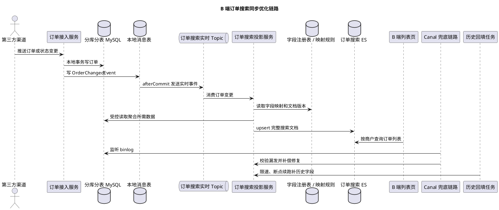

# B 端商户订单聚合搜索优化

## 问题索引

- Q1：B 端商户订单聚合系统使用 Canal + MQ + ES 同步订单搜索数据，如何优化同步时效和字段变更成本？
- Q2：Canal 同步 ES 链路中，Canal 挂了、ES 搜索实时性和主库压力大分别怎么处理？

## Q1：B 端商户订单聚合系统使用 Canal + MQ + ES 同步订单搜索数据，如何优化同步时效和字段变更成本？

### 背景

项目是 B 端商户订单聚合系统，订单来自淘宝、京东、拼多多、自营 APP 等多个 C 端渠道。订单进入系统后，按商户维度分片，使用 ShardingSphere 做 `32 * 32` 分库分表。

由于订单列表筛选条件多，直接查分库分表成本高，所以当前方案是：

```text
第三方订单进入系统
  -> 写入分库分表 MySQL
  -> Canal 监听 binlog
  -> 发送 MQ
  -> 应用消费 MQ 后查询关联信息
  -> 组装订单搜索文档
  -> 写入 ES
  -> B 端列表页查询 ES
```

当前主要问题：

1. 从入口收到第三方订单到 B 端列表页能查到订单，通常是秒级；当共享 ES 被其他业务系统打爆时，订单同步延迟可能达到半小时甚至半天。
2. 每次新增或修改字段，都需要夜间在本地跑定时任务全量刷新 ES，一跑就是一整晚。

### 核心判断

这个问题表面看是 ES 同步慢，本质上是三个问题叠加：

```text
搜索读模型没有资源隔离
订单搜索文档构建链路太后置
字段变更缺少可演进机制
搜索投影能力散落在业务代码里，长期不可维护
```

当前链路里，订单搜索依赖共享 ES。当其他系统写入、查询、聚合或重建索引时，订单系统的写入也会排队。订单列表页是 B 端核心功能，如果和非核心业务共用 ES 写入资源，就很容易出现“订单已入库，但商户看不到”的体验问题。

另一个问题是字段变更依赖全量刷新。新增字段、修改字段后，如果每次都扫全量订单重新组装写 ES，数据量一大就会变成夜间批处理，无法支撑频繁迭代。

还要特别注意：当前系统已经庞大复杂，不能再让各业务模块自己写缓存、自己拼 ES 文档、自己处理字段变更。搜索同步、字段映射、冷热数据治理应该收敛到订单搜索平台或搜索投影服务中，业务系统只输出标准订单变更事件。

### 优化目标

建议先明确目标：

| 指标 | 目标 |
| --- | --- |
| 新订单可搜索时效 | P95 5 秒内，P99 30 秒内 |
| ES 共享业务波动影响 | 订单搜索不被其他业务拖到分钟级 |
| 字段新增 | 尽量不全量重刷，根据字段类型选择增量、懒回填、运行时字段或索引版本化 |
| 字段类型或分词变化 | 通过新索引版本 + 双写 + alias 切换处理 |
| 历史数据回填 | 分布式、可限速、可断点续跑 |
| 数据一致性 | ES 最终一致，DB 为准，可对账补偿 |
| 可维护性 | 缓存和搜索投影逻辑平台化，不散落在业务系统内 |

### 方案一：订单搜索 ES 资源隔离

最直接的优化是：订单搜索不要和所有业务共用一个 ES 写入资源池。

推荐优先级：

| 方案 | 说明 | 推荐度 |
| --- | --- | --- |
| 独立订单 ES 集群 | 订单搜索独占集群资源 | 最高 |
| 独立热节点 + shard allocation | 同集群内隔离订单索引到指定节点 | 中 |
| 独立索引 + 独立写入队列 | 成本低，但无法隔离集群级压力 | 低 |

如果订单列表是 B 端核心入口，建议至少做到：

```text
订单实时写入 Topic 独立
订单 ES 索引独立
订单写入消费者独立部署
订单查询和写入限流独立
回填任务和实时同步任务隔离
```

更理想的形态：

```text
order-search-es-cluster
  -> 只承载订单搜索
  -> 独立监控写入延迟、refresh、merge、bulk rejected
  -> 独立扩容和限流
```

这样其他业务系统重建索引、跑聚合、批量写入时，不会把订单搜索拖到半小时甚至半天。

### 方案二：把 Canal 从主链路降级为兜底链路

当前链路依赖 Canal 监听 DB 变更，再异步组装 ES 文档。Canal 本身没问题，但如果它是唯一实时链路，就会有几个问题：

- Canal 是 DB commit 之后的后置链路，天然有延迟。
- Canal 只能看到表变更，不一定知道业务语义。
- 订单搜索文档需要关联查询，消费端可能放大 DB 压力。
- Canal 堆积后，订单搜索时效不可控。

建议把主链路改成“业务事件驱动”，Canal 作为补偿兜底：

```text
订单接入服务
  -> 本地事务写订单库
  -> 写本地消息表 / 发送事务消息 OrderChangedEvent
  -> MQ 订单搜索实时 Topic
  -> 订单搜索构建服务
  -> ES

Canal
  -> 监听 binlog
  -> 校验漏发、补偿修复
```

`OrderChangedEvent` 至少包含：

```text
eventId
orderId
merchantId
sourceChannel
shardingKey
changedFields
orderVersion
eventTime
```

关键点：

- 主链路由业务主动发事件，减少 Canal 后置延迟。
- 事件带业务语义和版本，方便幂等、乱序处理。
- Canal 保留为兜底，用来发现漏发事件或修复异常。

### PlantUML 示意图



### 方案三：平台化订单搜索投影服务

当前消费 MQ 后再查询关联信息、组装 ES，会导致：

- 每条订单事件都可能触发多次 DB 查询。
- 关联表变多后构建耗时增加。
- 消费积压时列表页不可见时间变长。

这里不能采用“先写基础列表字段、再异步补详情字段”的分层文档方案。因为 B 端订单系统里，列表可见但详情缺失，比列表不可见更严重：商户会认为订单数据异常，客服、履约、售后都会受影响。

更合适的是建立平台化订单搜索投影服务：

```text
订单接入
  -> 写订单库
  -> 发送 OrderChangedEvent
  -> 订单搜索投影服务
      -> 统一读取订单聚合所需数据
      -> 根据字段注册表组装完整搜索文档
      -> 校验必需字段完整性
      -> upsert ES
```

订单是否对列表页可见，应该以“完整搜索文档构建成功”为准。对于确实允许缺失的非核心展示字段，可以为空或使用默认值，但不能让订单处于“列表有、详情无”的半成品状态。

这个服务的职责包括：

- 统一维护订单搜索字段注册表。
- 统一维护 DB 字段、事件字段、ES 字段之间的映射。
- 统一处理字段版本、文档版本、幂等和乱序。
- 统一提供历史回填、失败重试、对账修复。
- 禁止各业务系统散落编写 ES 拼装逻辑或缓存逻辑。

### 方案四：实时写入和批量回填分通道

当前新增字段需要夜间全量刷 ES，一旦和实时同步共用 ES、MQ、消费者，就会互相影响。

建议拆两条通道：

```text
实时同步通道：新订单、状态变更、支付、发货、售后
历史回填通道：新增字段、字段修复、历史数据补齐
```

要求：

- 实时 Topic 高优先级。
- 回填 Topic 低优先级。
- 两套消费者独立线程池。
- 回填写 ES 必须限速。
- ES bulk 写入队列独立监控。

回填任务不能本地单机跑一晚上，应该做成分布式任务：

```text
按商户分片
按订单时间分段
按 orderId 游标断点续跑
每批生成回填事件
低优先级 MQ 消费
写 ES 时按 bulk rejected 和延迟动态降速
```

任务元数据：

```text
taskId
merchantIdRange
timeRange
lastOrderId
status
rateLimit
retryCount
```

这样字段回填可以随时暂停、恢复、限速、灰度，而不是依赖夜间本地脚本。

### 方案五：字段演进分类型处理，双写不是唯一方案

不是所有字段变更都需要全量刷新。

#### 1. 新增展示字段

如果只是列表展示字段，且历史订单没有也能接受：

```text
新增 mapping 字段
新订单开始写入
历史订单按需懒补或低优先级回填
```

不需要全量重刷。

#### 2. 新增筛选字段

如果新增字段要参与搜索筛选：

```text
新订单实时写入新字段
历史订单走分布式回填
回填完成前前端提示仅支持部分时间范围或灰度开放
```

如果字段来自已有 DB 字段，可以直接按时间段补 ES。

#### 3. 字段类型变化

ES 字段类型通常不能直接修改，例如 `keyword` 改 `text`，或者字符串改日期。

这种情况下，新索引版本 + 双写 + alias 切换是最稳妥的方案：

```text
创建 order_search_v2
应用双写 v1 和 v2
历史数据分布式 reindex 到 v2
校验 v1/v2 数量和抽样结果
切换 alias 到 v2
下线 v1
```

不要在原索引上硬改 mapping。

但双写不是所有新增字段的唯一方案。

可选方案：

| 场景 | 方案 | 说明 |
| --- | --- | --- |
| 新增非筛选展示字段 | 新订单增量写，历史为空或懒回填 | 不影响搜索条件，可以不全量刷 |
| 新增筛选字段，类型兼容 | mapping 模板提前预留或动态新增字段，历史分布式回填 | 不需要新索引，但需要补历史 |
| 新增临时计算字段 | ES runtime field 或查询层计算 | 避免立即重建索引，但性能要评估 |
| 新增扩展字段较多 | 扩展字段对象或 sidecar 扩展索引 | 降低主索引 mapping 膨胀 |
| 字段类型、分词器、排序方式变化 | 新索引版本 + 双写 + alias 切换 | 因为 ES 已有字段类型不可变 |

如果可以在订单搜索平台里提前设计扩展字段区，例如：

```text
ext.keyword.xxx
ext.long.xxx
ext.date.xxx
```

一些新增字段就可以走已存在的字段类型槽位，不一定每次都创建新索引。但这种方案要有字段注册和命名治理，否则会变成另一个不可维护的垃圾桶。

#### 4. 字段计算逻辑变化

例如订单标签、风险标记、售后状态聚合规则变化。

推荐：

```text
字段带 computeVersion
新逻辑只影响新事件
历史数据按 merchantId + timeRange 渐进回填
查询层兼容不同 computeVersion
```

### 方案六：ES 索引设计按商户和时间优化

B 端查询通常有几个特点：

- 大多数查询带 `merchantId`。
- 查询有明显时间范围，例如近 3 个月订单。
- 条件多，排序常按下单时间或更新时间。
- 不同商户数据量差异大。

建议：

```text
索引按时间拆分，例如 order_search_2026_06
routing 使用 merchantId
文档 id 使用 orderId 或 merchantId + orderId
```

好处：

- 带 `merchantId` 查询可以通过 routing 减少查询 shard。
- 按月索引可以控制单索引数据量。
- 历史索引可以降低 refresh 频率或转冷。
- 字段变更可以通过 alias 管理版本。

查询建议：

- 必须带商户维度。
- 必须限制时间范围，默认近 3 个月。
- 精确筛选字段使用 `keyword`、数值、日期。
- 避免在高基数字段上做重聚合。
- 列表页只查必要字段，详情页再查 DB 或单独详情索引。

### 方案七：冷热数据搜索治理

冷热数据可以考虑，但要放在订单搜索平台层治理，不能让业务系统各自写缓存代码。

B 端订单查询通常天然有冷热分层：

| 数据类型 | 典型范围 | 查询特点 | 建议 |
| --- | --- | --- | --- |
| 热数据 | 近 7 天 / 近 30 天 | 高频查询、状态变化多 | 高 refresh、高副本、独立热索引 |
| 温数据 | 近 3 到 6 个月 | 查询较多，变更减少 | 普通 ES 索引，较低 refresh |
| 冷数据 | 半年或一年以上 | 偶发查询，基本不变 | 冷索引、低副本、归档或 DB 兜底 |

推荐索引形态：

```text
order_search_hot_2026_06
order_search_warm_2026_Q2
order_search_cold_2025
```

查询路由由订单搜索服务统一处理：

```text
用户选择近 30 天
  -> 查询 hot 索引

用户选择近 6 个月
  -> 查询 hot + warm 索引

用户选择历史订单
  -> 查询 cold 索引，必要时提示查询较慢
```

热数据治理重点：

- 更高写入优先级。
- 更短 refresh interval。
- 更强副本和容量保障。
- 查询必须带 `merchantId` 和时间范围。

冷数据治理重点：

- 降低 refresh 频率或关闭频繁 refresh。
- 降低副本数。
- 避免复杂聚合。
- 查询限流，防止历史大范围查询拖垮热数据。

如果要做查询结果缓存，也应该放在订单搜索服务内统一实现：

```text
cacheKey = merchantId + normalizedFilters + sort + page + timeRange
```

并且只缓存低实时性查询，例如历史订单、固定筛选条件、报表类查询。新订单列表、待发货、待售后等高实时场景不建议强依赖查询结果缓存。

### 方案八：写 ES 的幂等和乱序处理

订单状态变化很频繁，例如支付、发货、售后、退款。如果 MQ 或 Canal 消息乱序，旧事件可能覆盖新状态。

ES 文档需要带版本：

```text
orderVersion
eventTime
```

写入规则：

```text
只有 event.orderVersion >= es.orderVersion 才允许覆盖
```

对于部分字段更新，使用局部 upsert：

```text
订单支付事件只更新 payStatus、payTime、orderVersion
发货事件只更新 deliveryStatus、deliveryTime、orderVersion
售后事件只更新 refundStatus、afterSaleStatus、orderVersion
```

这样可以减少每次都全量组装文档的成本。

### 推荐目标架构

```text
淘宝/京东/拼多多/自营 APP
  -> 订单接入服务
  -> ShardingSphere 分库分表
  -> 本地消息表 / 事务消息
  -> OrderChangedEvent
  -> MQ 实时订单搜索 Topic
  -> 订单搜索构建服务
      -> 完整搜索文档构建
      -> 必需字段完整性校验
      -> 幂等和版本判断
  -> 订单专用 ES 集群 / 专用索引资源
  -> B 端订单列表

Canal
  -> binlog 校验
  -> 漏事件补偿

字段回填任务
  -> 分布式游标扫描
  -> 低优先级回填 Topic
  -> 限速写 ES
  -> 断点续跑和对账
```

### 分阶段落地

#### 第一阶段：止血

- 给订单同步独立 MQ Topic 和消费者。
- 回填任务和实时同步分开。
- 对回填写 ES 限速，避免拖垮实时订单。
- 监控 ES bulk rejected、refresh、merge、写入延迟、MQ lag。
- B 端列表页增加“订单同步中”兜底提示。

#### 第二阶段：资源隔离

- 建订单专用 ES 集群，或至少独立热节点。
- 订单索引按时间拆分，查询必须带 merchantId 和时间范围。
- 实时写入和历史回填使用不同 bulk processor。

#### 第三阶段：链路前置

- 订单接入服务写 DB 后主动发 `OrderChangedEvent`。
- Canal 从主链路变成补偿链路。
- 搜索投影服务统一构建完整订单搜索文档，禁止业务系统散落拼装 ES 逻辑。

#### 第四阶段：字段演进平台化

- 建立字段注册和 mapping 模板。
- 新增字段默认增量写入。
- 历史字段回填走分布式任务，不再本地夜间脚本。
- 字段类型变化走新索引版本、双写、alias 切换。
- 热冷数据分索引治理，历史查询和实时订单查询资源隔离。

### 踩坑点

- 只扩 ES 节点但不隔离写入通道，其他业务高峰仍会影响订单同步。
- Canal 作为唯一实时链路，业务语义不足，延迟和堆积不容易治理。
- 消费端每条消息都查多张关联表，订单高峰时会反向压垮 DB。
- 新增字段一律全量重刷，迭代成本会越来越高。
- ES mapping 设计不当，字段类型改动只能重建索引。
- 回填任务和实时同步共用消费者，回填会拖慢新订单可见性。
- 没有版本号，旧事件可能覆盖新订单状态。
- 把缓存、字段拼装、ES 写入逻辑散落在各业务系统里，短期快，长期一定失控。
- 列表先可见、详情后补齐的半成品文档，会造成比订单不可见更严重的数据可信度问题。

### 面试话术

> 这个场景我会从搜索平台化和资源隔离两个方向优化。原链路是 Canal 监听分库分表变更，再发 MQ，由应用查关联信息组装 ES。问题是订单搜索和其他业务共用 ES，其他业务爆发时订单同步会被拖到分钟甚至小时级；字段变更又依赖夜间全量脚本刷新。我的优化思路是：订单搜索作为 B 端核心读模型，要独立 ES 集群或至少独立写入资源；实时订单同步和历史回填拆通道，实时 Topic 高优先级，回填 Topic 低优先级限速；主链路可以从 Canal 后置监听逐步演进为订单接入服务主动发 `OrderChangedEvent`，Canal 做漏事件补偿；同时建立订单搜索投影服务，统一维护字段注册、文档构建、版本幂等、回填和对账，避免缓存和 ES 拼装逻辑散落在业务系统。这个场景不能做列表先有、详情后补的半成品文档，订单对列表可见应以完整搜索文档构建成功为准。字段演进上，双写不是唯一方案：新增展示字段可以增量写和懒回填，新增筛选字段走分布式回填，字段类型或分词变化才用新索引版本、双写、回填、alias 切换。冷热数据按时间分索引治理，避免历史查询和回填拖慢实时订单。

## Q2：Canal 同步 ES 链路中，Canal 挂了、ES 搜索实时性和主库压力大分别怎么处理？

### 背景

订单搜索、商品搜索、商户数据同步这类场景经常使用：

```text
MySQL binlog -> Canal -> MQ -> 同步消费者 -> ES
```

这条链路的核心矛盾是：DB 是事实源，ES 是搜索读模型。只要中间任意一环故障，就会出现“DB 已经有数据，但 ES 搜不到”的最终一致性延迟。

这类题面试时通常会被拆成三个追问：

| 问题 | 简短结论 |
| --- | --- |
| Canal 挂了怎么办？ | HA 部署 + ZK 选主 + position 持久化，故障切换后从上次位点续传 |
| 同步到 ES 怎么搜实时数据？ | 秒级实时用 `refresh_interval=1s` 通常足够；毫秒级强实时要业务双写或查询兜底 |
| 主库压力大怎么办？ | Canal 挂从库；更重的场景用 binlog server / MaxScale 中转，避免直接压主库 |

### Q2.1：Canal 挂了怎么办？

Canal 挂了要关注两件事：

```text
1. 服务能不能自动恢复消费
2. 恢复后会不会从错误位置重复消费或漏消费
```

推荐方案：

- Canal Server 做 HA 部署。
- 使用 ZooKeeper 做实例选主，同一个 destination 同一时刻只由一个 Canal Server 工作。
- Canal 持久化 binlog position，例如 file、position、GTID。
- Canal Client 消费 MQ 或写 ES 时做幂等。
- 对同步延迟、位点停滞、MQ lag、ES 写入失败做告警。

故障切换流程可以理解为：

```text
Canal Server A 正在消费 binlog
  -> A 挂掉
  -> ZK 临时节点失效
  -> Canal Server B 抢到 destination
  -> B 读取持久化 position
  -> 从上次 binlog 位点继续拉取
  -> 下游根据 eventId/orderVersion 做幂等
```

需要注意：Canal 续传只能保证“从某个位点继续读”，不能自动保证下游 ES 一定没有重复写。所以消费者侧必须有幂等设计。

常见幂等手段：

- ES 文档 ID 使用业务主键，例如 `orderId`。
- ES 文档带 `orderVersion` 或 `updateTime`，旧版本不能覆盖新版本。
- MQ 消费端记录 `eventId` 去重。
- 定时对账任务扫描 DB 和 ES 差异，补偿异常数据。

### Q2.2：同步到 ES 后如何搜索实时数据？

ES 不是每次写入后立刻对搜索可见。文档写入后先进入内存 buffer，经过 refresh 生成新的 segment 后，搜索才能看到。

默认近实时策略：

```text
index.refresh_interval = 1s
```

对大多数订单列表、商品列表来说，1 秒左右可见通常可以接受。此时链路目标不是“毫秒级强一致”，而是控制整体延迟：

```text
Canal 延迟 + MQ 延迟 + 消费组装耗时 + ES bulk 写入耗时 + refresh 等待
```

排查时可以看：

```bash
# 查看 ES 索引 refresh 配置，确认是否被调得过长。
GET /order_search/_settings

# 查看写入线程池是否出现 rejected，判断 ES 是否写入拥塞。
GET /_cat/thread_pool/write?v

# 查看 refresh、merge 压力，判断是否频繁刷新或段合并拖慢写入。
GET /_nodes/stats/indices/refresh,merges
```

如果业务要求“写入后马上搜索到”，有几种选择：

| 方案 | 说明 | 代价 |
| --- | --- | --- |
| 降低 `refresh_interval` | 例如 1s 或更低 | refresh 更频繁，写入吞吐下降 |
| 写入时 `refresh=wait_for` | 等下一次 refresh 后再返回 | 请求 RT 增加，不适合高并发写入 |
| 业务双写 DB + ES | 写 DB 的同时写 ES | 需要处理双写失败、事务一致性、补偿 |
| 查询兜底 DB | ES 查不到新订单时按订单号回查 DB | 只适合精准查询，不适合复杂筛选 |

所以面试回答要分层：

- 秒级实时：Canal + MQ + ES，`refresh_interval=1s` 基本够用。
- 毫秒级可见：不要只依赖 Canal，需要业务事件前置、双写或查询兜底。
- 强一致：ES 不适合作为事实源，必须以 DB 查询或状态机结果为准。

### Q2.3：主库压力大怎么办？

Canal 模拟 MySQL slave 拉取 binlog。它主要消耗的是 binlog 传输、网络和解析资源，不应该直接和业务 SQL 查询混为一谈。

如果担心主库压力，优先方案是让 Canal 挂从库：

```text
MySQL Master
  -> MySQL Replica
      -> Canal
          -> MQ
          -> ES 同步消费者
```

好处：

- Canal 不直接连主库，降低主库连接和网络压力。
- 主库专注事务写入。
- Canal 故障不会直接影响主库。

但要注意从库延迟：

```bash
# 查看从库复制延迟，重点关注 Seconds_Behind_Master。
SHOW SLAVE STATUS\G
```

如果 `Seconds_Behind_Master` 持续升高，说明 Canal 即使正常，也会因为从库本身延迟导致 ES 同步延迟。

更复杂的场景可以引入 binlog 中转：

```text
MySQL Master
  -> MaxScale / binlog server
      -> 多个 Canal / CDC 消费者
```

适用场景：

- 多个下游系统都要订阅 binlog。
- 不希望每个 Canal 都直接连 MySQL。
- 主库网络或复制链路压力明显。
- 需要统一管理 binlog 分发。

### 监控和告警

这条链路要监控端到端延迟，而不是只看 Canal 是否存活。

| 环节 | 关键指标 |
| --- | --- |
| MySQL | binlog 生成速度、从库延迟、复制状态 |
| Canal | destination 是否在线、position 是否推进、解析异常 |
| MQ | topic lag、消费失败、重试堆积、死信 |
| 同步消费者 | 单条构建耗时、DB 关联查询耗时、bulk 批大小 |
| ES | bulk rejected、write thread pool、refresh、merge、索引写入延迟 |
| 业务 | DB commit 到 ES 可搜索的端到端延迟 |

### 踩坑点

- 只做 Canal HA，不做消费者幂等，故障切换后重复消费会覆盖新数据。
- 只看 Canal 正常，不看 MQ lag 和 ES bulk rejected，实际订单仍可能搜不到。
- 盲目把 `refresh_interval` 调得极低，会牺牲 ES 写入吞吐。
- Canal 挂从库时忽略从库延迟，会误以为 Canal 慢。
- 多个 Canal 直接连主库订阅 binlog，可能放大主库网络和复制压力。
- ES 搜索结果不能当事实源，订单状态、支付状态、库存扣减仍要以 DB 或业务状态机为准。

### 面试话术

> Canal 同步 ES 这条链路我会按故障恢复、实时性和数据库压力三个点回答。Canal 挂了要做 Server HA，通过 ZK 对 destination 选主，并持久化 binlog position，故障切换后从上次位点续传；但续传可能带来重复消息，所以下游写 ES 要用业务主键作为文档 ID，并结合 version 或 updateTime 做幂等。ES 搜索是近实时，不是写入后立即可见，普通订单列表用 `refresh_interval=1s` 基本够用；如果要求毫秒级可见，就不能只靠 Canal，要考虑业务事件前置、双写 ES 或精准查询回查 DB。主库压力大时，Canal 优先挂从库，并监控从库延迟；如果多个系统都订阅 binlog，可以用 MaxScale 或 binlog server 做中转，避免多个 Canal 直接压主库。

## 高频追问

- Q：为什么不能继续只用 Canal 做实时同步？
  A：Canal 可以保留，但不建议作为唯一实时链路。它是 DB commit 后的后置链路，缺少业务语义，堆积后恢复慢。订单接入服务主动发业务事件，Canal 做补偿，更容易控制时效。

- Q：为什么订单搜索需要独立 ES？
  A：订单列表是 B 端核心路径，共享 ES 会被其他业务写入、查询、聚合、重建索引影响。独立 ES 或独立资源池能隔离故障和流量，保证订单可搜索时效。

- Q：新增字段一定要全量刷 ES 吗？
  A：不一定。展示字段可以新订单先写，历史懒补；筛选字段需要历史回填，但可以分布式、限速、断点续跑；字段类型变化才需要新索引版本和 alias 切换。

- Q：为什么不能把缓存和 ES 拼装代码直接写到各业务系统？
  A：短期实现快，但系统变复杂后字段规则、回填逻辑、幂等、版本和缓存失效会散落各处，维护成本不可控。订单搜索应该平台化，由搜索投影服务统一处理。

- Q：列表先可见、详情后补齐是否可行？
  A：当前场景不建议。B 端订单如果列表可见但详情缺失，会造成商户对订单真实性的怀疑，影响客服、履约和售后。订单对列表可见应以完整搜索文档构建成功为准。

- Q：如何避免旧 MQ 消息覆盖新订单状态？
  A：订单搜索文档要带 `orderVersion` 或事件时间，ES upsert 时只允许新版本覆盖旧版本，消费端也要按 `eventId` 做幂等。

- Q：Canal HA 切换后为什么还需要 ES 写入幂等？
  A：因为 HA 只能保证 Canal 从持久化 position 继续拉取 binlog，切换边界可能出现重复投递。ES 文档要用业务主键做 ID，并用版本号或更新时间防止旧事件覆盖新数据。

- Q：ES `refresh_interval=1s` 是否代表 1 秒内一定搜到？
  A：不一定。它只表示 ES refresh 周期大约 1 秒，端到端还包括 Canal 延迟、MQ lag、消费者构建耗时、bulk 排队和 ES 写入压力。

## 复习清单

- [ ] 能画出现有 Canal + MQ + 应用组装 + ES 的链路。
- [ ] 能说明同步延迟长的根因是共享 ES、后置链路和关联查询放大。
- [ ] 能讲清订单搜索读模型为什么要资源隔离。
- [ ] 能说明为什么要把 Canal 从主链路改为补偿链路。
- [ ] 能设计实时同步和历史回填双通道。
- [ ] 能说明新增字段、筛选字段、字段类型变化分别如何处理。
- [ ] 能说清 ES 索引按商户 routing 和时间拆分的意义。
- [ ] 能解释为什么缓存和搜索投影逻辑不能散落在业务代码里。
- [ ] 能设计冷热数据搜索治理方案。
- [ ] 能回答如何用版本号解决 MQ 乱序覆盖问题。
- [ ] 能回答 Canal 挂了如何通过 HA、ZK 选主和 position 持久化续传。
- [ ] 能区分 ES 近实时搜索、毫秒级实时和强一致查询的方案取舍。
- [ ] 能说明 Canal 挂从库、binlog server 或 MaxScale 中转分别解决什么问题。
