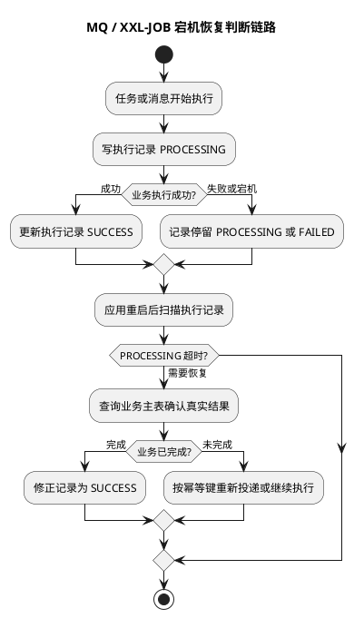

# MQ 与 XXL-JOB 宕机恢复实践

## 问题索引

- Q1：MQ/XXL-JOB 在应用程序执行时宕机，重启后怎么确定程序是否执行完成？

## Q1：MQ/XXL-JOB 在应用程序执行时宕机，重启后怎么确定程序是否执行完成？

### 背景

MQ 消费和 XXL-JOB 调度都有一个共同问题：调度系统只能知道“消息是否被 ACK”或“任务是否回调成功”，但不能天然知道业务动作是否真的完成。

典型异常：

```text
1. 任务开始执行
2. 已经调用了一部分业务逻辑
3. 应用突然宕机或容器被杀
4. 重启后不知道刚才是没执行、执行一半，还是已经执行成功但没来得及更新状态
```

所以核心原则是：**不能依赖内存判断完成状态，必须依赖业务事实表、执行记录表和幂等状态机。**

### 核心结论

重启后判断任务是否完成，优先级应该是：

```text
业务最终状态 > 执行记录状态 > MQ/XXL-JOB 调度状态
```

原因是：

- MQ 只知道消息有没有成功 ACK，不知道业务是否真的完成。
- XXL-JOB 只知道执行器有没有回调成功，不知道业务是否真的落库。
- 执行记录可能因为宕机停在 `PROCESSING`。
- 只有业务事实表最接近真实结果，例如订单状态、支付单状态、库存流水、对账流水、文件生成记录。

### 执行记录表设计


### PlantUML 示意图：宕机恢复与执行记录状态



建议为关键任务设计执行记录表。

```sql
CREATE TABLE task_execution (
  id BIGINT PRIMARY KEY,

  -- biz_key 是业务幂等键，例如 orderNo、paymentNo、messageId、jobBizKey。
  biz_key VARCHAR(128) NOT NULL,

  -- source_type 区分任务来源，例如 MQ、XXL_JOB、MANUAL_RETRY。
  source_type VARCHAR(32) NOT NULL,

  -- status 表示执行状态，不能只有成功和失败，还要能表达处理中和未知。
  status VARCHAR(32) NOT NULL,

  -- version 用于乐观锁抢占，避免多个实例同时恢复同一任务。
  version INT NOT NULL DEFAULT 0,

  -- locked_until 用于宕机恢复；锁超时后其他实例可以接手。
  locked_until DATETIME NULL,

  retry_count INT NOT NULL DEFAULT 0,
  last_error VARCHAR(1024) NULL,
  start_time DATETIME NULL,
  finish_time DATETIME NULL,
  create_time DATETIME NOT NULL,
  update_time DATETIME NOT NULL,

  UNIQUE KEY uk_biz_source (biz_key, source_type),
  INDEX idx_status_lock (status, locked_until)
);
```

状态建议：

| 状态 | 含义 |
| --- | --- |
| `INIT` | 已创建，还没开始执行 |
| `PROCESSING` | 已抢占，正在执行 |
| `SUCCESS` | 业务确认完成 |
| `FAILED_RETRY` | 失败但可重试 |
| `FAILED_FINAL` | 达到重试上限，需要人工处理 |
| `UNKNOWN` | 执行中断，业务结果暂时无法判断 |

### MQ 场景怎么判断

MQ 消费端必须遵守：

```text
业务成功提交后再 ACK
```

如果应用在执行中宕机：

| 宕机位置 | MQ 表现 | 重启后处理 |
| --- | --- | --- |
| 业务没开始 | 消息未 ACK，会重投 | 重新消费 |
| 业务执行中 | 消息未 ACK，会重投 | 查执行记录和业务状态，幂等恢复 |
| 业务已成功但未 ACK | 消息会重投 | 查到业务已完成，直接补执行记录并 ACK |
| 已 ACK 但未更新业务状态 | 这是错误设计 | 需要补偿扫描和告警兜底 |

消费流程建议：

```text
1. 收到 MQ 消息
2. 根据 bizKey 创建或查询 task_execution
3. 如果已经 SUCCESS，说明重复投递，直接 ACK
4. 如果 PROCESSING 但锁未过期，说明其他线程可能在处理，返回稍后重试
5. 如果无记录或锁已过期，通过状态 CAS 抢占执行权
6. 执行业务逻辑，业务表必须幂等
7. 业务确认成功后，把 task_execution 改为 SUCCESS
8. 最后 ACK MQ
```

核心不是“重启后猜测执行到哪一步”，而是根据 `bizKey` 查业务最终状态。

例如订单取消：

```text
如果订单已经是 CANCELED，说明取消动作完成，可以把执行记录补为 SUCCESS。
如果订单还是 WAIT_PAY，说明取消未完成或未发生，可以重新执行取消。
如果订单已经 PAID，说明业务状态已经变化，不能再取消，应标记为业务跳过或失败终态。
```

### XXL-JOB 场景怎么判断

XXL-JOB 的调度日志只能说明调度器和执行器之间的调用结果：

```text
调度成功
执行器收到
执行器回调成功 / 失败 / 超时
```

但这不等于业务任务一定完成。执行器宕机时，XXL-JOB 可能看到的是超时或失败；如果业务已经提交但回调没来得及发出，调度平台仍可能认为失败。

因此 XXL-JOB 任务也要自己维护业务执行状态：

```text
XXL-JOB 触发
  -> 扫描 task_execution 或业务待处理表
  -> 用状态 CAS 抢占任务
  -> 执行业务
  -> 根据业务最终状态标记 SUCCESS / FAILED_RETRY
```

多实例执行时，优先使用 DB 状态抢占：

```sql
UPDATE task_execution
SET status = 'PROCESSING',
    locked_until = DATE_ADD(NOW(), INTERVAL 5 MINUTE),
    version = version + 1
WHERE biz_key = ?
  AND status IN ('INIT', 'FAILED_RETRY', 'UNKNOWN')
  AND (locked_until IS NULL OR locked_until < NOW());
```

这条 SQL 的关键点：

- 更新行数为 `1`：当前实例抢到执行权。
- 更新行数为 `0`：任务被其他实例处理，或者状态已经变化，当前实例跳过。
- `locked_until` 防止实例宕机后任务永久停在 `PROCESSING`。

### 重启后的恢复扫描

重启后或定时补偿任务应该扫描：

```sql
SELECT *
FROM task_execution
WHERE status IN ('PROCESSING', 'UNKNOWN', 'FAILED_RETRY')
  AND (locked_until IS NULL OR locked_until < NOW())
LIMIT 100;
```

扫描到记录后不要直接重跑，先查业务事实：

| 业务事实 | 执行记录 | 处理方式 |
| --- | --- | --- |
| 业务已完成 | `PROCESSING/UNKNOWN` | 补记 `SUCCESS` |
| 业务未完成且可重试 | `PROCESSING/UNKNOWN/FAILED_RETRY` | 重新抢占并执行 |
| 业务已进入互斥终态 | 任意状态 | 标记跳过或失败终态 |
| 业务状态无法判断 | `PROCESSING/UNKNOWN` | 保持 `UNKNOWN`，增加告警 |

### 如何避免重复执行出问题

重启恢复一定要默认会重复执行，所以业务逻辑必须幂等。

常见幂等手段：

- 唯一索引：例如 `unique(biz_key)` 防止重复插入流水。
- 状态机：例如只允许 `WAIT_PAY -> CANCELED`，不能重复取消。
- 乐观锁：`where status = ? and version = ?`。
- 幂等流水表：每个外部调用、资源释放、通知发送都记录流水。
- 对账任务：兜底修复执行记录和业务事实不一致。

### 面试话术

> MQ 或 XXL-JOB 执行中宕机后，不能靠 MQ ACK、XXL-JOB 日志或内存变量判断是否完成。我的做法是为关键业务设计执行记录表和业务幂等键，任务开始时把记录抢占为 `PROCESSING`，业务执行成功后在同一个可靠边界内更新业务状态和执行记录，最后 MQ 才 ACK。重启后扫描 `PROCESSING/UNKNOWN/FAILED_RETRY` 且锁超时的任务，先查业务事实表：如果业务已经完成，就补记 `SUCCESS`；如果业务未完成且状态允许，就重新执行；如果业务进入互斥终态，就标记跳过或失败。XXL-JOB 也是一样，调度日志只能代表调度结果，不代表业务完成，最终要靠业务状态、执行记录、幂等和补偿扫描闭环。

## 高频追问

- Q：为什么不能直接看 MQ 是否 ACK？
  A：ACK 只能说明消费端告诉 MQ 处理成功，不等于业务一定完成。正确设计是业务事务成功后再 ACK，并通过业务状态和执行记录兜底判断。

- Q：为什么不能直接看 XXL-JOB 执行日志？
  A：XXL-JOB 日志主要表示调度和回调状态。执行器宕机时，可能业务已成功但回调失败，也可能业务未完成，所以必须查业务事实表。

- Q：执行记录停在 `PROCESSING` 怎么办？
  A：通过 `locked_until` 判断是否超时。超时后由恢复任务抢占，但抢占后要先查业务最终状态，再决定补成功、重试或告警。

- Q：如果业务成功了，但执行记录没来得及更新成功怎么办？
  A：恢复扫描查业务事实，发现业务已完成后补记 `SUCCESS`。所以业务事实表比执行记录更权威。

## 复习清单

- [ ] 能说明 MQ/XXL-JOB 状态不等于业务完成状态。
- [ ] 能设计 `task_execution` 表的状态、幂等键、锁超时和版本字段。
- [ ] 能说清应用宕机后如何通过业务事实表判断是否完成。
- [ ] 能解释为什么 MQ 必须业务成功后再 ACK。
- [ ] 能说明 XXL-JOB 多实例执行时如何用 DB 状态 CAS 抢占任务。
- [ ] 能回答重复执行为什么必须靠幂等、状态机和唯一索引兜底。

