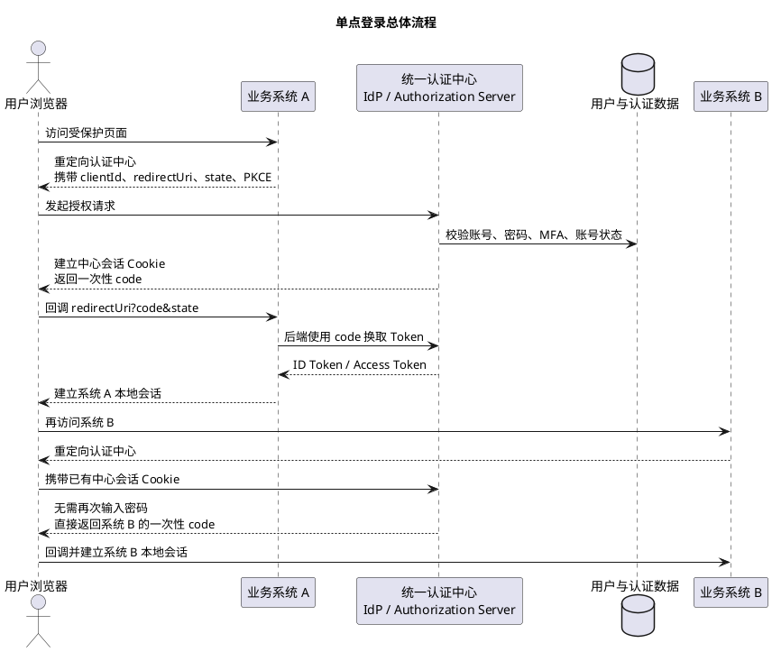
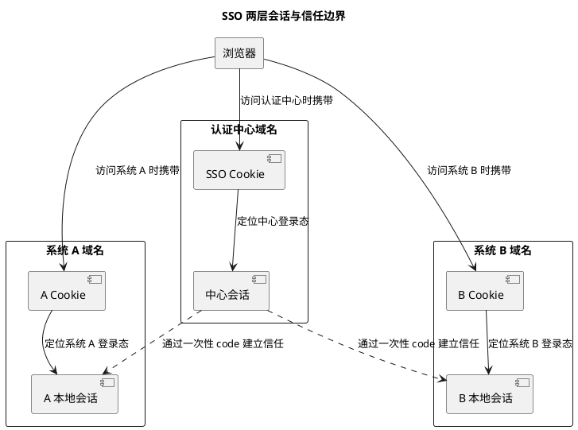
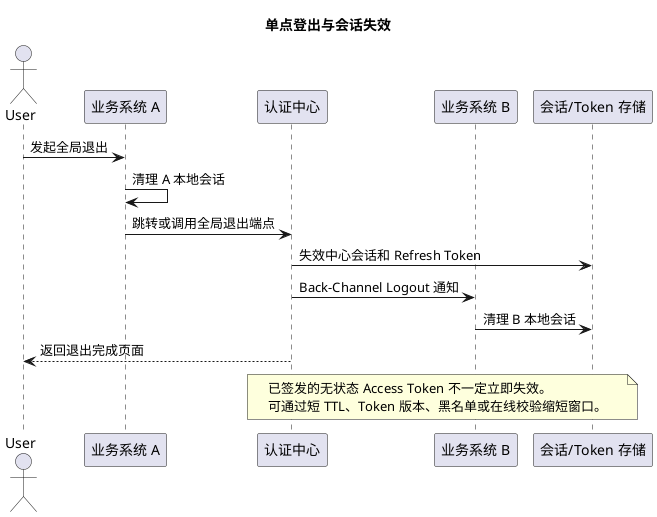
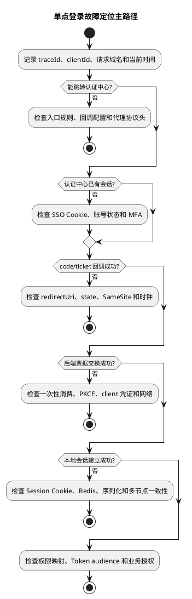

# 单点登录实现原理与常见问题

## 问题索引

- Q1：单点登录的实现原理和常见方案是什么？
- Q2：单点登录有哪些常见问题，应该如何排查和治理？

## Q1：单点登录的实现原理和常见方案是什么？

### 背景

单点登录 SSO（Single Sign-On）解决的问题是：用户在一个认证中心完成一次登录后，可以访问多个相互信任的业务系统，不需要在每个系统重复输入账号密码。

```text
一次登录，多系统访问
```

SSO 不等于所有系统共享一枚 Cookie，也不等于把同一个 JWT 发给所有系统。它的核心是建立统一信任关系：

- 认证中心负责确认用户身份并维护中心登录态。
- 业务系统信任认证中心签发的一次性票据或 Token。
- 每个业务系统仍然建立和维护自己的本地登录态与权限。

### 总体流程

下面以现代跨域 SSO 常用的 OIDC Authorization Code 流程为例：



这个流程中只有浏览器访问认证中心时才会携带认证中心域名下的 Cookie。系统 A 和系统 B 通常不能也不需要读取该 Cookie，它们通过浏览器重定向和后端票据交换确认身份。

### 核心组件

| 组件 | 常见名称 | 职责 |
| --- | --- | --- |
| 用户代理 | Browser / User-Agent | 承载跳转和认证中心 Cookie |
| 认证中心 | IdP / Authorization Server / CAS Server | 用户认证、中心会话、签发票据或 Token |
| 业务系统 | SP / Client / Relying Party | 发起认证、验证结果、建立本地会话 |
| 用户目录 | User Store / LDAP / IAM | 保存账号、密码摘要、MFA、组织与账号状态 |
| 一次性凭证 | Ticket / Authorization Code | 在不暴露用户密码的情况下传递认证结果 |
| Token | ID Token / Access Token / Refresh Token | 表达身份、访问授权或续期能力 |
| 本地会话 | Local Session | 保存用户在某个业务系统中的登录态 |
| 信任配置 | Client、证书、JWKS、redirect URI | 建立认证中心和业务系统之间的可信关系 |

### 两层会话模型

理解 SSO 最关键的是区分“认证中心会话”和“业务系统本地会话”：



用户访问系统 A 时，本地会话存在就不需要访问认证中心。本地会话不存在才跳转认证中心：

```text
系统 A 本地会话有效
  -> 直接访问系统 A

系统 A 本地会话无效
  -> 跳转认证中心
  -> 中心会话有效：静默签发 code
  -> 中心会话无效：要求用户重新认证
```

所以“单点登录”不代表所有请求都经过认证中心。认证中心通常只参与登录、续期、登出和必要的身份校验，业务请求仍由各系统自己处理。

### 一次性票据为什么重要

认证中心不应该把用户名和密码转交业务系统，而是签发短时、一次性、受约束的票据：

```text
code / ticket
  + 只能使用一次
  + TTL 很短
  + 绑定 clientId
  + 绑定 redirectUri
  + 绑定用户和认证上下文
  + 服务端交换或校验
```

业务系统收到回调后还要通过后端与认证中心通信。这样可以避免仅凭浏览器 URL 中的参数直接相信用户身份。

Authorization Code 场景还应配合 PKCE：客户端发起授权时提交 `code_challenge`，换取 Token 时提交 `code_verifier`。即使 code 在跳转过程中被截获，没有 verifier 也难以兑换 Token。

### OIDC 中三类 Token 的职责

OAuth 2.0 本身主要解决授权委托，不定义完整用户登录语义。要做标准化身份认证，通常在 OAuth 2.0 上使用 OpenID Connect：

| Token | 面向对象 | 主要用途 |
| --- | --- | --- |
| ID Token | Client / 业务系统 | 表达“谁完成了认证”以及认证上下文 |
| Access Token | Resource Server / API | 访问受保护 API |
| Refresh Token | Authorization Server | 在用户不重新登录的情况下申请新 Token |

业务系统验证 ID Token 时至少关注：

- `iss`：是否由期望的认证中心签发。
- `aud`：是否签发给当前客户端。
- `exp`、`iat`、必要时 `nbf`：时间声明是否合法。
- `nonce`：是否对应当前认证请求，防止重放和 Token 注入。
- 签名算法和 `kid`：是否在允许范围，并使用可信 JWKS 公钥验证。

不能仅仅 Base64 解码 JWT 后就相信其中的用户信息，也不能把签发给系统 A 的 ID Token 直接拿给系统 B 使用。

### 常见实现方案对比

#### 方案一：父域共享 Cookie

例如：

```text
app-a.example.com
app-b.example.com
sso.example.com
Cookie Domain=.example.com
```

优点：实现简单，适合完全同组织、同父域的系统。

问题：

- 只能覆盖同一父域，跨公司或跨顶级域名无法使用。
- Cookie 作用域扩大，一个子系统漏洞可能影响全部系统。
- 各系统必须协调 Cookie 名、Session 格式和安全策略。
- 很难独立演进和隔离故障。

因此它更像“共享会话”，不适合作为开放、跨域 SSO 的长期架构。

#### 方案二：共享 Redis Session

多个系统使用相同 Session ID Cookie，并从同一个 Redis 读取登录态。

优点：落地快，服务集群内 Session 可共享。

问题：

- 系统强耦合于同一 Session 数据模型、序列化方式和 Redis。
- 用户对象升级可能导致其他系统反序列化失败。
- 权限、租户、超时策略难以独立控制。
- 跨域 Cookie、故障隔离和安全边界仍然存在问题。

适合内部同技术栈、短期整合，不适合作为异构系统统一身份标准。

#### 方案三：CAS 票据模式

CAS 常见概念：

```text
TGC：浏览器持有的认证中心 Cookie
TGT：认证中心维护的登录票据
ST：签发给某个业务系统的一次性 Service Ticket
```

业务系统把用户重定向到 CAS Server；中心登录成功后为目标 Service 签发 ST；业务系统后端向 CAS 校验 ST，成功后建立本地会话。访问第二个系统时，CAS 根据 TGC/TGT 判断用户已登录，直接签发新的 ST。

CAS 模型清晰，适合传统企业内部 Web 系统；现代 API、移动端和开放生态通常更倾向 OAuth 2.0/OIDC。

#### 方案四：OAuth 2.0 + OpenID Connect

适合跨域、异构系统、Web、移动端和开放平台。推荐使用 Authorization Code，并根据客户端类型使用 PKCE。

优势：

- 标准化程度高，生态完整。
- 身份认证和 API 授权边界清晰。
- 支持客户端、Scope、Audience、Consent、MFA 和第三方身份源。
- 业务系统不需要共享 Session 数据结构。

复杂点：

- Token 生命周期、密钥轮换、Client 配置和回调地址管理更复杂。
- 单点登出和权限实时变更需要额外设计。
- 错误使用 OAuth 概念容易产生身份冒用和 Token 混用。

#### 方案五：网关统一认证

网关验证 Token，并向下游传递可信用户上下文，可以减少各服务重复解析 Token 的代码。但它不能替代完整 SSO 协议：

- 浏览器如何登录和跳转仍需要认证中心。
- 内部服务仍应验证请求来源，不能相信客户端直接伪造的用户请求头。
- 高风险服务可以再次校验 Token 或使用网关到服务的签名、mTLS。
- 服务级数据权限仍然属于业务系统职责。

### 推荐落地方案

现代企业多系统登录通常建议：

```text
认证中心：OAuth 2.0 Authorization Server + OpenID Connect Provider
浏览器 Web：Authorization Code + PKCE
业务系统：建立 HttpOnly 本地 Session，或采用 BFF 管理 Token
后端 API：校验面向自身 audience 的 Access Token
用户目录：统一账号、组织、MFA、账号状态
登出与变更：短 Token + Refresh Token 轮换 + 事件通知/会话版本
```

对于浏览器系统，BFF 或服务端 Session 通常比把 Refresh Token 长期放在浏览器可读存储中更容易控制泄漏风险。Cookie 应按实际部署设置：

```text
HttpOnly
Secure
合理的 SameSite
最小 Domain 和 Path
受控 Max-Age
```

### Spring Security 落地组件

业务系统作为 OIDC Client 时，Spring Security 常见组件包括：

| 组件 | 作用 |
| --- | --- |
| `ClientRegistrationRepository` | 保存认证中心、clientId、redirect URI、scope 等注册信息 |
| `OAuth2AuthorizationRequestRedirectFilter` | 构造授权请求并重定向认证中心 |
| `AuthorizationRequestRepository` | 在跳转前后关联 `state`、PKCE 等请求上下文 |
| `OAuth2LoginAuthenticationFilter` | 处理授权码回调并发起登录认证 |
| `OAuth2AccessTokenResponseClient` | 后端使用 code 换取 Token |
| `OidcUserService` | 获取并组装 OIDC 用户信息 |
| `OAuth2AuthorizedClientService/Repository` | 保存客户端对应的 Token 和授权状态 |

基础配置示例：

```java
@Configuration
@EnableWebSecurity
public class SsoClientSecurityConfig {

    @Bean
    SecurityFilterChain ssoClientSecurityFilterChain(HttpSecurity http) throws Exception {
        http
            .authorizeHttpRequests(authorize -> authorize
                // 健康检查和静态资源可以匿名访问，其他请求必须完成统一登录。
                .requestMatchers("/health", "/assets/**").permitAll()
                .anyRequest().authenticated()
            )
            .oauth2Login(oauth2 -> oauth2
                // 登录成功后回到业务首页；生产中也可恢复登录前缓存的原始请求。
                .defaultSuccessUrl("/", false)
            )
            .logout(logout -> logout
                // 本地退出只清理当前系统；是否联动认证中心要单独设计。
                .logoutSuccessUrl("/")
            );

        return http.build();
    }
}
```

OIDC Client 配置示意：

```yaml
spring:
  security:
    oauth2:
      client:
        registration:
          company-sso:
            provider: company-idp
            client-id: order-system
            # 客户端密钥必须由 Secret 管理，不能提交到 Git。
            client-secret: ${SSO_CLIENT_SECRET}
            authorization-grant-type: authorization_code
            scope: openid,profile
        provider:
          company-idp:
            # issuer-uri 用于发现授权、Token、JWKS、UserInfo 等端点。
            issuer-uri: https://sso.example.com
```

自定义用户映射时，应以稳定不变的 `issuer + subject` 作为外部身份主键，不要只用昵称、邮箱或手机号。邮箱、手机号和姓名都可能变化或重复。

### 单点登出

单点登录相对容易，单点登出更复杂，因为用户登录后可能同时存在：

- 认证中心会话。
- 系统 A、B、C 的本地会话。
- 尚未过期的 Access Token。
- Refresh Token 和 Remember-Me 状态。



常见登出策略：

| 策略 | 特点 |
| --- | --- |
| 仅本地登出 | 只清理当前系统，再访问时可能被中心会话静默登录 |
| Front-Channel Logout | 浏览器依次通知各系统，受页面、网络和第三方 Cookie 策略影响 |
| Back-Channel Logout | 认证中心通过服务端通知各业务系统，可靠性更高但要做重试和幂等 |
| 短 Access Token + Refresh Token 撤销 | 不强求 Access Token 立即失效，用短 TTL 控制窗口 |
| Token 黑名单或版本号 | 可快速失效，但增加共享状态和每次请求校验成本 |

高安全场景不能只清理认证中心 Cookie，还要处理本地 Session、Refresh Token、Remember-Me、设备会话和关键 Access Token。

### 安全设计要点

- 所有登录、回调、Token 和 JWKS 通信使用 HTTPS。
- `redirect_uri` 必须在服务端精确白名单校验，不能做任意前缀或包含匹配。
- `state` 必须随机、短时、一次性并与浏览器会话绑定，用于抵御登录 CSRF。
- OIDC 使用 `nonce` 关联认证请求和 ID Token。
- Authorization Code 使用 PKCE，code 必须短 TTL、一次性并绑定 Client。
- 机密客户端的 `client_secret` 只能保存在服务端 Secret 系统。
- JWT 需要验证签名、`iss`、`aud`、时间和算法白名单，不能只解码 Payload。
- Token、code、Session ID、Cookie 和 client secret 不写入日志。
- 登录成功后轮换本地 Session ID，防止 Session Fixation。
- Access Token Scope 和 Audience 最小化，避免一个 Token 通吃全部系统。
- 认证中心和业务系统都要有登录限流、异常行为识别、MFA 和审计。
- JWKS 缓存要支持按 `kid` 刷新，也要防止认证中心抖动导致每个请求都回源。

### 面试话术

> 单点登录的核心不是共享 Cookie，而是多个业务系统共同信任一个认证中心。以 OIDC Authorization Code 为例，用户访问系统 A 时，本地没有会话就重定向认证中心，并携带 clientId、redirectUri、state、nonce 和 PKCE。认证中心完成账号、密码或 MFA 校验后建立中心会话，签发短时一次性 code。系统 A 的后端用 code 换取并校验 Token，再建立自己的本地 Session。用户访问系统 B 时同样重定向认证中心，但浏览器已经有认证中心 Cookie，所以不需要再次输入密码，认证中心直接为系统 B 签发新的 code。这样认证中心和各业务系统分别维护中心会话、本地会话，系统之间不需要共享用户密码或 Session 对象。工程上要重点处理回调白名单、state/nonce、PKCE、Token 验签、密钥轮换、会话超时、权限同步和单点登出。

## Q2：单点登录有哪些常见问题，应该如何排查和治理？

### 排查总原则

SSO 问题跨越浏览器、反向代理、业务系统、认证中心、Session 存储和时间系统，不能只看业务系统的一条异常日志。

先确认问题发生在哪一阶段：



建议全链路生成统一 `traceId`，但日志只能记录票据的哈希摘要或末尾少量字符，不能记录完整 code、Token 和 Cookie。

### 问题一：登录后不断重定向

现象：

```text
业务系统 -> 认证中心 -> 回调业务系统 -> 再次跳认证中心
```

常见原因：

1. 回调成功后没有真正保存本地 `SecurityContext` 或 Session。
2. 本地 Session Cookie 的 Domain、Path、Secure、SameSite 配置错误。
3. HTTPS 在网关终止，应用误认为自己是 HTTP，生成错误回调地址或 Secure Cookie。
4. 负载均衡后多节点 Session 未共享，也没有粘性会话。
5. 回调 URI 本身又被错误规则当成普通受保护页面。
6. 浏览器禁用 Cookie，或 Cookie 超过浏览器大小限制被丢弃。
7. 登录成功写 Session 后立即被自定义 Filter、并发会话策略或登出逻辑清理。

排查：

```text
浏览器 Network 查看 302 Location 链
  -> Application/Cookie 查看每一步 Set-Cookie 和实际携带 Cookie
  -> 对比 Cookie Domain/Path/SameSite/Secure/Expires
  -> 按 Session ID 哈希查询 Redis 是否存在
  -> 确认回调节点和后续请求节点能读取同一 Session
  -> 检查 X-Forwarded-Proto / Forwarded 头处理
```

### 问题二：票据或 code 无效

常见错误：

```text
invalid_grant
code already used
ticket expired
redirect_uri mismatch
PKCE verification failed
```

原因包括：

- 浏览器刷新回调页面，导致一次性 code 被消费两次。
- 多个节点同时处理同一个回调，缺少幂等控制。
- code TTL 太短或认证中心与业务系统网络延迟过高。
- 服务器时钟偏差过大。
- 换 Token 使用的 `redirect_uri` 与授权请求不完全一致。
- `code_verifier` 没有和授权前生成的 `code_challenge` 对应。
- clientId 或 client secret 配错环境。
- 代理对 URL 进行了重复编码、解码或参数截断。

治理方式：

- 回调成功后立即使用 PRG 或跳转到干净业务 URL，避免刷新重复消费。
- 以 `state` 或 code 摘要建立短时幂等记录。
- 所有节点使用 NTP/chrony 保持时间同步。
- redirect URI 从统一配置生成，避免在多个服务中手工拼接。
- 监控 code 签发到消费耗时、失败原因和各阶段成功率。

### 问题三：跨域 Cookie 和 SameSite 导致静默登录失败

浏览器 Cookie 隔离策略会直接影响 SSO：

- 业务系统不能读取认证中心域名下的 Cookie，这是正常安全边界。
- 顶层页面跳转通常比 iframe 静默认证更可靠。
- `SameSite=Lax` 通常允许顶层 GET 导航携带 Cookie，但不覆盖所有跨站 POST 或 iframe 场景。
- `SameSite=None` 必须配合 `Secure`，并且仍可能受到第三方 Cookie 限制。
- 本地开发的 HTTP、IP 地址和生产 HTTPS 域名表现可能不同。

不要通过无限放大 Cookie Domain 解决跨域问题。跨顶级域名 SSO 应使用标准重定向和票据交换，而不是试图让系统 A 读取认证中心 Cookie。

### 问题四：CORS 与 SSO 跳转混淆

CORS 主要限制浏览器脚本发起的跨源 HTTP 请求，浏览器顶层 302 导航本身不是普通 Ajax CORS 模型。

常见错误：SPA 使用 Ajax 调业务 API，API 返回 302 登录页，XHR 最终跨域访问认证中心并被 CORS 阻止。

推荐：

```text
页面发现未登录
  -> 使用 window.location 发起顶层登录跳转

API 发现 Token 无效
  -> 返回明确 401
  -> 前端统一认证模块决定是否跳转
```

不要让所有 API 401 都无条件跳转，否则后台请求并发失败时可能同时触发大量登录跳转。

### 问题五：`state` 或 `nonce` 校验失败

常见原因：

- 发起授权请求的 Session 丢失。
- 多标签页同时登录，后一次请求覆盖前一次 state。
- state 存在单节点内存，回调落到另一个节点。
- 用户登录耗时超过 state TTL。
- 浏览器返回历史页面或重复提交旧回调。

解决：

- state 必须支持同一会话并存多个授权请求，不能只保存一个全局值。
- 集群环境使用共享存储或加密、自包含且防篡改的短时状态。
- 校验失败直接终止登录，不能为了“提高成功率”跳过 state/nonce 校验。
- 记录 state 摘要、创建时间和消费结果，禁止记录完整 Token。

### 问题六：登录成功但没有业务权限

SSO 只解决身份认证，不自动解决所有系统的业务授权。常见原因：

- ID Token 只有身份信息，没有业务权限。
- 认证中心角色和业务系统权限模型不一致。
- 用户组织、租户、岗位或数据范围尚未同步。
- 系统错误使用昵称或邮箱关联本地账号。
- Token 中权限缓存过旧，用户已停用但旧 Token 仍有效。
- Access Token 的 Audience 不属于当前 API。

推荐身份映射：

```text
外部身份唯一键 = issuer + subject
  -> 关联本地 userId
  -> 本地 RBAC/ABAC/数据权限计算
```

认证中心可以提供统一组织和基础角色，但订单归属、商户范围、区域数据权限等业务规则仍应由业务系统控制。

### 问题七：退出后又自动登录

原因通常是只清理了业务系统本地 Session，认证中心会话仍然有效。再次访问系统时跳转认证中心，中心立即静默签发票据，所以用户感觉“退出失效”。

需要先定义产品语义：

- 退出当前系统：只清理本地会话。
- 退出所有系统：同时失效中心会话，并通知其他系统。
- 退出当前设备：失效设备对应的中心与本地会话。
- 修改密码或账号封禁：强制所有高风险会话和续期凭证失效。

单点登出通知必须幂等、可重试并有失败告警。业务系统离线时，应在恢复后根据会话版本、注销事件或 Token 状态完成补偿。

### 问题八：JWT 无法立即失效

自包含 JWT 在签发后通常可以离线验签。认证中心删除 Session 不会自动删除所有已经签发的 Access Token。

可选方案：

| 方案 | 实时性 | 代价 |
| --- | --- | --- |
| 短 Access Token TTL | 最长等待一个 TTL | 简单，但不能瞬时失效 |
| Token 黑名单 | 接近实时 | 每次请求增加共享存储查询 |
| 用户/会话版本号 | 接近实时 | 需要查询缓存并维护版本 |
| 不透明 Token + Introspection | 实时 | 资源服务依赖认证中心可用性和性能 |
| 网关集中校验 | 可统一控制 | 网关成为关键依赖，内部调用还需可信保护 |

大多数系统采用“短 Access Token + 可撤销 Refresh Token”；高风险操作再查询用户状态或会话版本。

### 问题九：Refresh Token 并发刷新

多个前端请求同时发现 Access Token 过期，可能并发使用同一个 Refresh Token。启用 Refresh Token Rotation 后，第一个请求刷新成功并使旧 Token 失效，后续请求会被判断为重放。

治理：

- 前端或 BFF 对同一会话使用 single-flight，只允许一个刷新请求。
- 其他请求等待同一刷新结果，不各自发起刷新。
- 服务端旋转 Refresh Token，并对旧 Token 重用做检测。
- 更新 Token 时保证原子性，避免新旧 Token 状态部分提交。
- 刷新失败后统一进入重新登录，避免无限重试风暴。

### 问题十：认证中心或 JWKS 故障

认证中心是全局关键依赖，故障可能导致所有系统无法新登录。设计时要区分：

- **已有本地 Session**：可以在可控时间内继续访问，避免认证中心短故障扩大。
- **本地验证 JWT**：已缓存有效 JWKS 时可以继续验签。
- **新登录、code 换 Token、Refresh Token**：通常依赖认证中心可用。
- **不透明 Token 在线校验**：每个请求都可能依赖 Introspection 服务。

高可用措施：

- 认证中心多节点、多可用区部署。
- 中心 Session、票据和授权数据使用高可用存储。
- JWKS 按缓存头缓存，并支持未知 `kid` 触发受控刷新。
- 密钥轮换时新旧公钥保留重叠窗口。
- 业务系统对认证中心调用设置超时、有限重试、熔断和隔离线程池。
- 监控授权端点、Token 端点、JWKS、Session 存储和用户目录依赖。
- 不要在认证中心故障时绕过验签或默认放行受保护接口。

### 可观测性与日志

建议记录：

```text
traceId
clientId
issuer
授权阶段：redirect/callback/token/local-session
state 摘要
code 摘要
用户内部 ID 或脱敏 subject
认证方式与 MFA 级别
错误码
各阶段耗时
回调 Host、Scheme、redirect URI 模板 ID
```

禁止记录：

```text
原始密码
完整 Authorization Code
Access Token / ID Token / Refresh Token
Cookie / Session ID
client_secret
MFA 种子和恢复码
```

关键指标：

- 登录发起数、成功率、取消率。
- code 签发到兑换耗时与失败率。
- `invalid_grant`、state/nonce、redirect mismatch 分类计数。
- 302 跳转次数分布，跳转过多可能存在循环。
- Token 刷新成功率和重放检测量。
- JWKS 命中率、刷新失败率和未知 `kid` 数量。
- 单点登出通知成功率、重试量和积压量。
- 认证中心、Redis、LDAP/用户库延迟和错误率。

### 常见踩坑点

1. 把 OAuth 2.0 Access Token 当作用户身份凭证，不校验 OIDC ID Token 语义。
2. 只解码 JWT，不验证签名、Issuer、Audience 和过期时间。
3. redirect URI 支持任意地址，形成开放重定向和授权码窃取风险。
4. 不校验 state、nonce 或 PKCE，为登录 CSRF 和重放留下空间。
5. 把 Refresh Token 放在 LocalStorage，XSS 后可被长期窃取。
6. 系统之间共享完整 Session 用户对象，升级后产生强耦合和反序列化问题。
7. 只设计单点登录，没有设计单点登出、账号封禁和权限变更传播。
8. 所有 API 未认证都返回 302，前端并发请求触发重定向风暴。
9. 多租户系统只根据邮箱匹配账号，没有校验 Issuer、Tenant 和 Subject。
10. JWKS 未缓存导致每个请求回源，或者永久缓存导致密钥轮换后全部验签失败。
11. 日志打印完整 code、Token 和 Cookie，排障系统反而成为凭证泄漏源。
12. 本地 Session 和中心 Session 超时时间完全不协调，造成频繁静默跳转或长期无法全局失效。

### 面试话术

> 排查 SSO 问题时，我会先把链路拆成跳转认证中心、中心会话识别、票据回调、后端 code 兑换、本地会话建立和业务授权六个阶段。登录循环重点检查本地 Session 是否真正写入、Cookie 的 Domain/Path/SameSite/Secure、反向代理协议头和集群 Session；票据无效重点检查一次性重复消费、redirect URI、PKCE、Client 配置、TTL 和时钟；登录成功无权限则检查 issuer+subject 到本地用户的映射、Audience、租户和本地 RBAC。单点登出要同时考虑中心会话、本地 Session、Refresh Token 和未过期 Access Token，通常通过 Back-Channel Logout、短 Token、版本号或黑名单组合处理。整个链路需要 traceId 和分阶段指标，但日志只能记录 code、state 的摘要，不能记录完整凭证。

## 高频追问

- Q：SSO 为什么不能直接把认证中心 Cookie 设置成所有系统都能读取？
  A：Cookie 受域名边界限制，跨顶级域名无法共享；扩大 Cookie Domain 还会扩大泄漏和攻击范围。标准 SSO 通过认证中心域名 Cookie、浏览器重定向和一次性票据建立信任。

- Q：OAuth 2.0 和 OIDC 有什么区别？
  A：OAuth 2.0 主要解决客户端如何获得 API 访问授权，OIDC 在其上增加标准身份认证语义、ID Token、UserInfo 和发现机制。做用户登录时通常使用 OIDC。

- Q：为什么业务系统还要建立本地 Session？
  A：本地 Session 可以承载系统自己的权限、租户和业务上下文，并减少每次请求依赖认证中心。认证中心负责统一认证，本地系统负责本系统会话和授权。

- Q：JWT 和 SSO 是一回事吗？
  A：不是。JWT 是一种 Token 表达格式，SSO 是多个系统共享认证结果的整体机制。SSO 可以使用 JWT，也可以使用不透明 Token、CAS Ticket 或共享 Session。

- Q：只使用 JWT 为什么很难做到立即单点登出？
  A：自包含 JWT 可以离线验签，签发后不需要查询认证中心。中心会话被删除并不会改变已签发 Token，只能通过短 TTL、黑名单、版本校验或在线 Introspection 增加撤销能力。

- Q：`state`、`nonce`、PKCE 分别解决什么问题？
  A：state 关联浏览器授权请求并抵御登录 CSRF；nonce 把 OIDC ID Token 与当前认证请求绑定；PKCE 防止被截获的授权码被其他客户端兑换。

- Q：业务系统应该信任 Token 中的角色，还是查询本地权限？
  A：通用身份和粗粒度角色可以来自认证中心；订单归属、商户范围、数据权限等业务授权应由业务系统结合本地数据计算，并设计权限变更失效机制。

## 复习清单

- [ ] 能画出业务系统、浏览器和认证中心之间的 SSO 跳转与票据交换流程。
- [ ] 能区分认证中心会话、业务系统本地会话和 Access Token。
- [ ] 能比较共享 Cookie、共享 Session、CAS、OIDC 和网关认证方案。
- [ ] 能说明 ID Token、Access Token 和 Refresh Token 的职责。
- [ ] 能解释 state、nonce、PKCE、redirect URI 白名单的安全作用。
- [ ] 能设计本地登出、全局登出和无状态 Token 失效方案。
- [ ] 能排查登录循环、票据无效、SameSite、CORS 和 Session 集群问题。
- [ ] 能处理用户权限变化、账号封禁和多租户身份映射。
- [ ] 能设计 Refresh Token 并发刷新和轮换重放检测。
- [ ] 能说明认证中心、JWKS 和用户目录故障时的可用性边界。
- [ ] 能列出 SSO 链路日志字段、监控指标和敏感数据禁记项。

## 参考资料

- [OpenID Connect Core 1.0](https://openid.net/specs/openid-connect-core-1_0.html)
- [OAuth 2.0 Authorization Framework](https://www.rfc-editor.org/rfc/rfc6749)
- [Proof Key for Code Exchange by OAuth Public Clients](https://www.rfc-editor.org/rfc/rfc7636)
- [Spring Security OAuth 2.0 Login](https://docs.spring.io/spring-security/reference/servlet/oauth2/login/index.html)
- [Spring Authorization Server](https://docs.spring.io/spring-authorization-server/reference/)
