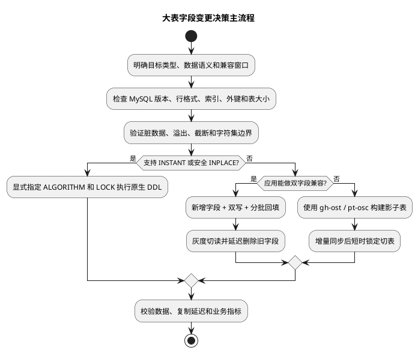
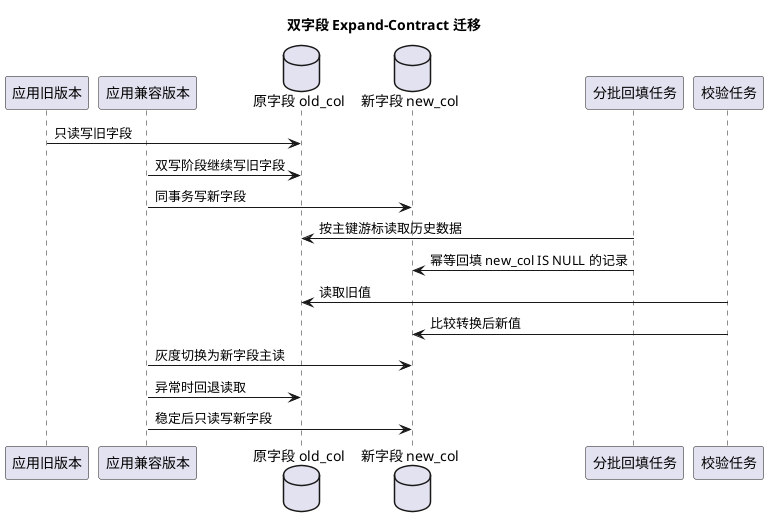
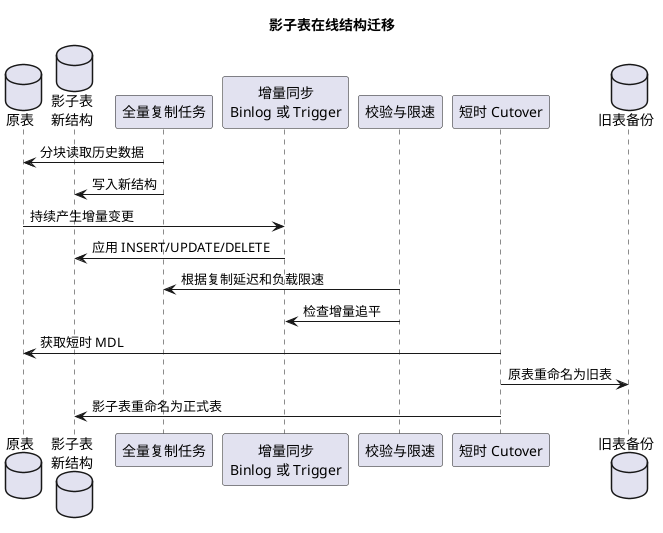
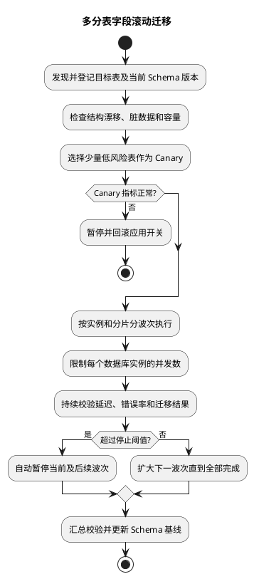

# 大表字段类型与长度变更迁移

## 问题索引

- Q1：单表数据量很大时，如何安全修改字段类型或长度？
- Q2：分表数量很多时，如何批量迁移字段并控制风险？

## Q1：单表数据量很大时，如何安全修改字段类型或长度？

### 背景

这里的“大表”首先指单表行数多、数据文件大、写入频繁，例如千万到亿级订单表。小表上一条简单的 `ALTER TABLE`，在大表上可能引发：

- 等待 MDL 元数据锁，阻塞后续查询和写入。
- 重建整张表，持续数小时并产生大量磁盘 IO。
- 临时空间、Redo、Undo、Binlog 快速增长。
- 主从复制延迟，读请求读到旧结构或旧数据。
- DDL 失败回滚时间很长，甚至耗尽磁盘。
- 新旧应用版本在灰度期间无法同时访问表结构。
- 类型转换遇到脏数据、溢出、截断或字符集问题。

不能只根据 `ALTER TABLE` 语法是否简单判断风险。关键要确认这次变更属于元数据修改、原地重建，还是完整复制表。

### 总体决策流程



优先级通常是：

```text
INSTANT 元数据变更
  > 可确认 LOCK=NONE 的 INPLACE
  > 业务双字段 Expand-Contract
  > gh-ost / pt-online-schema-change 影子表迁移
  > 直接 COPY 重建大表
```

最后一项不是绝对禁止，而是通常只适合业务可停机、表规模可控或已在离线副本验证的场景。

### 先理解 MySQL DDL 算法

#### `ALGORITHM=INSTANT`

只修改数据字典等元数据，不扫描或重写已有数据，通常耗时最短。但支持范围受 MySQL 版本和具体操作限制。

字段类型变化通常不能简单认为是 INSTANT。即使只是把 `INT` 改为 `BIGINT`，每行物理存储长度发生变化，往往需要重写数据。

#### `ALGORITHM=INPLACE`

“INPLACE”表示不使用传统的完整 COPY 算法，不等于完全不重建，也不等于完全不加锁。某些操作仍会扫描或重建聚簇索引，只是可以在较长阶段允许并发读写。

#### `ALGORITHM=COPY`

创建临时表、复制全部数据、应用表结构后再替换原表。大表上耗时和空间风险最高，并发 DML 能力也最差。

#### `LOCK=NONE`

表示要求 DDL 执行期间允许并发读写。如果当前操作不支持，显式指定后应该失败，而不是悄悄降级到更强锁级别。

```sql
SET SESSION lock_wait_timeout = 5;

ALTER TABLE customer
    MODIFY COLUMN display_name VARCHAR(200) NOT NULL,
    ALGORITHM=INPLACE,
    LOCK=NONE;
```

这段 SQL 不是通用答案。必须先在相同 MySQL 版本、表结构和接近生产数据量的环境验证。显式写算法和锁的意义是让不符合预期的操作失败，而不是由数据库自动选择更重的算法。

即使 `LOCK=NONE`，DDL 开始和结束阶段仍需要 MDL。线上有长事务时，DDL 可能一直等待 MDL 写锁；等待中的 DDL 还可能让后续请求排队。因此应设置较小的 `lock_wait_timeout`，拿不到锁就退出重试，而不是长期挂在线上。

### 不同字段变更的风险差异

| 变更 | 常见风险 | 建议 |
| --- | --- | --- |
| 增加可空字段或带默认值字段 | 某些 MySQL 版本支持 INSTANT | 显式尝试 INSTANT，并验证版本限制 |
| 增大 `VARCHAR` 长度 | 是否重建取决于最大编码字节数边界 | 在同版本环境验证 INPLACE，注意 1/2 字节长度标记边界 |
| 缩小 `VARCHAR` 长度 | 可能截断数据，通常需要重建 | 先清洗数据，优先双字段迁移 |
| `INT -> BIGINT` | 每行物理长度变化，通常需要重写表 | 大表优先影子表或双字段迁移 |
| `VARCHAR -> BIGINT` | 非数字、前导零、溢出、语义变化 | 必须新增字段和回填校验 |
| `DATETIME -> TIMESTAMP` | 时区、范围和默认值语义变化 | 双字段迁移并按业务时区核对 |
| 调整 `DECIMAL(p,s)` | 精度丢失、四舍五入或溢出 | 先验证最大值和小数位，再迁移 |
| 修改字符集或排序规则 | 行长度、索引长度、比较规则变化 | 通常按重建表评估，检查唯一键冲突 |
| 可空改为非空 | 历史 NULL、默认值和写入兼容 | 先回填、加应用校验，再增加约束 |

`VARCHAR` 是否跨越内部长度字节边界，取决于字符集下的最大编码字节数，不只是声明的字符数量。例如多字节字符集下，较小的字符长度也可能跨越 255 字节边界。

不要根据开发环境空表执行速度推断生产行为。空表即使使用 COPY 也可能瞬间完成。

### 变更前数据检查

#### 检查表结构和规模

```sql
SHOW CREATE TABLE customer_order;

SELECT table_schema,
       table_name,
       table_rows,
       data_length,
       index_length,
       data_free
FROM information_schema.tables
WHERE table_schema = 'trade'
  AND table_name = 'customer_order';
```

`table_rows` 对 InnoDB 通常是估算值，容量评估应结合数据文件大小、监控和抽样，不要为了得到精确行数先执行一次无索引全表 `COUNT(*)`。

#### `VARCHAR` 缩短前检查

```sql
SELECT MAX(CHAR_LENGTH(display_name)) AS max_chars,
       MAX(OCTET_LENGTH(display_name)) AS max_bytes,
       SUM(CHAR_LENGTH(display_name) > 100) AS overflow_rows
FROM customer;
```

- `CHAR_LENGTH` 统计字符数。
- `OCTET_LENGTH` 统计编码后的字节数。
- 缩短字段前要明确超长值是拒绝、截断、转存还是人工处理。

#### 字符串转数字前检查

```sql
-- 找出空字符串、非纯数字和可能改变业务语义的数据。
SELECT id, legacy_user_id
FROM customer_order
WHERE legacy_user_id IS NULL
   OR legacy_user_id = ''
   OR legacy_user_id NOT REGEXP '^[0-9]+$'
LIMIT 100;

-- 检查是否超过目标 BIGINT UNSIGNED 范围，应按实际目标类型调整边界。
SELECT id, legacy_user_id
FROM customer_order
WHERE legacy_user_id REGEXP '^[0-9]+$'
  AND CAST(legacy_user_id AS DECIMAL(65, 0)) > 18446744073709551615
LIMIT 100;
```

还要确认前导零是否有意义：`000123` 转为数字后变成 `123`。如果它是业务编码而不是数值，就不应该改成 BIGINT。

#### 检查长事务和 MDL

```sql
SELECT trx_id,
       trx_mysql_thread_id,
       trx_started,
       trx_state,
       trx_query
FROM information_schema.innodb_trx
ORDER BY trx_started;

SHOW FULL PROCESSLIST;
```

重点关注：

- 长时间未提交事务。
- `Waiting for table metadata lock`。
- 大查询、备份任务、批处理是否正在访问目标表。
- 主从复制延迟和从库 DDL 应用进度。

### 方案一：原生 Online DDL

适用于已经确认当前 MySQL 版本支持目标操作，并且压测证明 IO、Redo 和复制延迟可接受的场景。

执行步骤：

```text
1. 在结构和数据量接近生产的环境验证算法、耗时和空间
2. 确认备份、磁盘、Binlog、复制状态和回滚方案
3. 低峰期设置较小 lock_wait_timeout
4. 显式指定期望的 ALGORITHM 和 LOCK
5. 持续监控 MDL、IO、延迟、连接数和错误率
6. 超过阈值立即中止或暂停后续批次
```

生产示例：

```sql
SET SESSION lock_wait_timeout = 5;

-- 只有在同版本验证支持 INPLACE + LOCK=NONE 后才执行。
ALTER TABLE customer
    MODIFY COLUMN display_name VARCHAR(200) NOT NULL,
    ALGORITHM=INPLACE,
    LOCK=NONE;
```

不要省略算法选项后直接执行，以免 MySQL 自动选择 COPY。也不要把“命令已经开始执行”理解为风险已经过去，结束切换阶段仍可能等待 MDL。

MySQL DDL 通常会触发隐式提交，不能指望把 `ALTER TABLE` 包在普通业务事务中再用 `ROLLBACK` 撤销。生产回滚应依赖兼容字段、旧表、配置切换或备份恢复，而不是依赖事务回滚 DDL。

### 方案二：双字段 Expand-Contract 迁移

字段类型变化、长度缩小、数据需要清洗，或者希望具备业务级回滚能力时，推荐使用双字段迁移。



#### 阶段一：Expand，新增字段

```sql
ALTER TABLE customer_order
    ADD COLUMN user_id_new BIGINT UNSIGNED NULL COMMENT '迁移后的用户 ID',
    ALGORITHM=INSTANT;
```

`INSTANT` 是否支持仍取决于 MySQL 版本和表结构。如果不支持，应停止并重新评估，不要未经确认直接改成 COPY。

#### 阶段二：发布双写兼容版本

新应用写入时，在同一个数据库事务中写新旧字段：

```sql
INSERT INTO customer_order (
    id,
    legacy_user_id,
    user_id_new,
    create_time
) VALUES (?, ?, ?, NOW());
```

或者更新：

```sql
UPDATE customer_order
SET legacy_user_id = ?,
    user_id_new = ?
WHERE id = ?;
```

双写顺序必须可重试、幂等，并避免一个字段成功、另一个字段失败。字段在同一数据库表时优先使用一个本地事务，不要用异步 MQ 替代当前行的原子双写。

灰度期间旧应用仍可能只写旧字段，因此不能立即假设所有新数据都有 `user_id_new`。应等全部写节点升级后再进入最终切读。

#### 阶段三：按主键分批回填

不要使用越来越深的 `OFFSET`：

```sql
-- 不推荐：OFFSET 越大扫描和丢弃的数据越多。
SELECT id FROM customer_order ORDER BY id LIMIT 1000 OFFSET 10000000;
```

应使用主键游标或预先确定的主键区间：

```sql
SELECT id, legacy_user_id
FROM customer_order
WHERE id > ?
  AND id <= ?
  AND user_id_new IS NULL
ORDER BY id
LIMIT 1000;
```

回填更新：

```sql
UPDATE customer_order
SET user_id_new = CAST(legacy_user_id AS UNSIGNED)
WHERE id > ?
  AND id <= ?
  AND user_id_new IS NULL
  AND legacy_user_id REGEXP '^[0-9]+$';
```

关键点：

- 每批 500、1000 或其他大小必须通过压测确定。
- 记录 `last_id` 检查点，任务可暂停、重启和重跑。
- 使用 `new_col IS NULL` 保证回填幂等，不覆盖应用刚写入的新值。
- 每批独立短事务，限制锁持有时间、Undo 和复制压力。
- 根据主库 CPU、IO、锁等待、P99 和从库延迟动态降速。
- 脏数据写入异常表，不能因为少量错误让全量迁移卡死。
- 回填任务也要限流，不能和线上流量争抢全部数据库资源。

#### 阶段四：校验

先做全量统计，再做差异明细和业务抽样：

```sql
SELECT COUNT(*) AS missing_rows
FROM customer_order
WHERE user_id_new IS NULL;

SELECT COUNT(*) AS mismatch_rows
FROM customer_order
WHERE legacy_user_id REGEXP '^[0-9]+$'
  AND CAST(legacy_user_id AS UNSIGNED) <> user_id_new;
```

超大表上的全量校验同样可能造成压力，可以：

- 按主键范围分片校验。
- 在延迟可控的只读副本上校验。
- 对每批迁移记录数量、最小/最大主键、聚合值和差异数。
- 对金额等关键字段做业务总量和分组总量核对，不能只做行数比较。
- CRC 或哈希只能降低比较成本，存在碰撞时不能作为唯一正确性依据。

#### 阶段五：灰度切读

推荐版本演进：

```text
V1：旧字段读写
V2：新旧字段双写，旧字段主读
V3：双写，新字段主读，旧字段 fallback，并记录差异
V4：新字段读写，停止旧字段写入
V5：观察一个完整回滚窗口后删除旧字段
```

切换开关要支持按实例、租户或流量比例灰度。新字段读取异常时可以快速回到旧字段，而不是立即做反向 DDL。

#### 阶段六：Contract，删除旧字段

删除旧字段是最后一步，而且它本身也可能触发表重建。应先确认：

- 所有应用版本已经停止访问旧字段。
- SQL、ORM 映射、报表、ETL、CDC、审计任务都已迁移。
- 回滚窗口已经结束。
- 备份和归档数据可以恢复旧值。
- 当前版本支持目标删除算法，否则使用影子表或延后处理。

### 方案三：影子表在线迁移

当应用很难长期双写，又不能直接 COPY 大表时，可以使用 `gh-ost` 或 `pt-online-schema-change`。



两类工具的典型差异：

| 工具 | 增量同步方式 | 主要特点 |
| --- | --- | --- |
| `pt-online-schema-change` | 在原表创建 Trigger | 生态成熟；现有 Trigger、外键和负载需要重点评估 |
| `gh-ost` | 读取 Binlog | 不在原表创建业务同步 Trigger；要求合适的 Binlog、主键和拓扑条件 |

共同风险：

- 通常需要稳定主键或唯一键进行分块和定位行。
- 影子表、Binlog、Relay Log 和旧表会占用额外磁盘。
- 外键、触发器、生成列、分区表和特殊索引可能限制工具使用。
- Cutover 仍需要短时 MDL，不是绝对零锁。
- 复制延迟过大时必须自动暂停或降速。
- 工具中断后要明确临时表、Trigger、账号权限和恢复流程。
- 必须先在数据副本演练完整执行、暂停、恢复、切换和回滚。

不要在不了解参数的情况下直接复制网上的工具命令到生产。不同复制拓扑、外键和流量模型需要单独配置。

### 字段重命名也要使用 Expand-Contract

即使数据库支持快速重命名，应用灰度期间也可能存在新旧版本不兼容：

```text
旧应用读取 old_name
新应用读取 new_name
```

直接重命名后旧应用会立即报错。更安全的是：

```text
新增 new_name
  -> 双写
  -> 回填
  -> 新应用切读
  -> 停止旧字段写入
  -> 延迟删除 old_name
```

数据库 DDL 能否在线执行和应用能否向前、向后兼容是两个不同问题，两者都必须满足。

### 执行前检查清单

#### 数据与结构

- 目标字段最大值、最小值、NULL、空字符串和非法值。
- 精度、符号位、时区、字符集和排序规则变化。
- 目标字段涉及的普通索引、唯一索引、联合索引和外键。
- 行大小和索引长度是否超过限制。
- ORM、SQL、存储过程、Trigger、报表和 CDC 是否依赖旧字段。

#### 容量

- 原表数据和索引大小。
- 影子表与旧表共存空间。
- Redo、Undo、Binlog、Relay Log 和备份空间。
- 主库和从库的 IO、CPU、磁盘水位。
- 迁移期间新增业务数据的增长空间。

#### 可用性

- 长事务和 MDL 等待。
- 从库延迟、读写路由和故障切换影响。
- DDL 或迁移工具的限速、暂停和中止能力。
- 回滚是切回旧字段、旧表，还是执行反向 DDL。
- 监控、告警、值班人和变更窗口。

### 监控与停止阈值

迁移过程中至少监控：

```text
数据库 CPU、IOPS、磁盘吞吐和磁盘剩余空间
连接数、活跃线程、P95/P99 延迟和错误率
行锁等待、死锁、MDL 等待和长事务
Redo/Undo 增长、History List Length
Binlog 生成速率和从库复制延迟
每批回填耗时、成功数、跳过数和错误数
影子表与原表的增量差距
```

提前定义自动暂停阈值，例如：

```text
主库 CPU > 70%
从库延迟 > 10s
接口 P99 超过基线 30%
出现 MDL 等待或锁等待快速增长
磁盘剩余空间低于安全水位
```

阈值必须结合实际容量制定，示例数值不能直接照搬。

### 回滚设计

大表 DDL 的反向操作可能和正向操作一样昂贵，所以“出问题再 ALTER 回去”通常不是可靠回滚方案。

推荐回滚手段：

- 双字段阶段通过配置开关切回旧字段读取。
- 影子表切换后短期保留旧表，但禁止新旧表同时无规则写入。
- 在删除旧字段前保留完整观察窗口和备份。
- 发布版本保持前向、后向兼容，允许应用先回滚。
- 为回填任务保存检查点和错误明细，可暂停后继续。
- 对类型转换不可逆的数据保留原值或归档映射。

### 面试话术

> 大表修改字段不能直接执行一条 ALTER 就结束。我会先确认 MySQL 版本、表大小、行格式、索引、外键和目标操作支持的 DDL 算法，并检查 MDL、长事务、磁盘和复制延迟。如果确认支持 INSTANT 或 INPLACE，会显式指定 `ALGORITHM` 和 `LOCK=NONE`，设置较小的 `lock_wait_timeout`，避免自动降级或长时间等待。像 INT 改 BIGINT、VARCHAR 缩短、字符串转数字这类需要重写或清洗数据的变更，我更倾向 Expand-Contract：先增加新字段，发布双写兼容版本，再按主键短事务分批回填，做数量、差异和业务总量校验，然后灰度切换新字段读取，稳定一个回滚窗口后才停止旧写并删除旧字段。如果应用无法双写，可以使用 gh-ost 或 pt-online-schema-change 构建影子表和增量同步，但仍要评估主键、Binlog、Trigger、外键、磁盘和 Cutover MDL。整个过程必须有动态限速、复制延迟监控、停止阈值和可执行回滚方案。

## Q2：分表数量很多时，如何批量迁移字段并控制风险？

### 背景

如果问题指的不是单表行数大，而是有几百、几千张按租户、日期或 Hash 拆分的表需要做相同字段变更，风险会从“单次 DDL 很重”变成：

- 大量 DDL 并发抢占数据库 IO 和 MDL。
- 不同分表处于不同 Schema 版本，应用兼容困难。
- 某些表有脏数据、索引或历史结构差异，批量脚本中途失败。
- 迁移进度难以追踪，重跑时重复执行。
- 多个分片复制延迟同时上升，扩大故障范围。

因此不能用一个脚本并发遍历所有表直接执行 ALTER，而要把它当作一个可观测、可暂停、可恢复的滚动发布系统。

### 多表滚动迁移流程



### 迁移状态表

使用独立控制库记录每张表的迁移状态：

```sql
CREATE TABLE schema_migration_progress (
    id BIGINT NOT NULL,
    migration_version VARCHAR(64) NOT NULL,
    datasource_name VARCHAR(128) NOT NULL,
    table_name VARCHAR(128) NOT NULL,
    current_schema_hash VARCHAR(128) NULL,
    target_schema_hash VARCHAR(128) NOT NULL,
    state VARCHAR(32) NOT NULL COMMENT 'PENDING/RUNNING/VERIFYING/SUCCESS/FAILED/PAUSED',
    last_processed_id BIGINT NULL COMMENT '双字段回填检查点',
    affected_rows BIGINT NOT NULL DEFAULT 0,
    retry_count INT NOT NULL DEFAULT 0,
    error_message VARCHAR(1000) NULL,
    started_at DATETIME(3) NULL,
    finished_at DATETIME(3) NULL,
    update_time DATETIME(3) NOT NULL,
    PRIMARY KEY (id),
    UNIQUE KEY uk_version_table (migration_version, datasource_name, table_name)
);
```

作用：

- 防止同一迁移重复执行。
- 支持失败表单独重试。
- 保存双字段回填检查点。
- 统计每个实例、分片和波次进度。
- 区分 Schema 结构失败和数据转换失败。
- 迁移完成后对比目标 Schema Hash，防止少执行索引或约束。

### 先处理结构漂移

分表长期运行后不一定结构完全一致。执行统一变更前，应采集：

```text
SHOW CREATE TABLE
字段类型、默认值、字符集、排序规则
普通索引、唯一索引和外键
分区、行格式和表选项
```

对规范化后的结构计算 Hash，并按结构分组。只有基线一致的表才能进入同一个迁移模板；异常表应先修复或进入单独迁移分支。

不要只检查字段是否存在。例如同名字段可能分别是 `VARCHAR(64)`、`VARCHAR(128)` 和 `BIGINT`，直接执行同一 ALTER 会产生不同结果。

### 分波次和并发控制

推荐波次：

```text
实验环境和生产副本演练
  -> 1 到 3 张低流量 Canary 表
  -> 单个低风险租户或 1% 分片
  -> 5% / 20% / 50% 波次
  -> 剩余分片
```

并发限制不能只看全局任务数，要按物理数据库实例控制。位于同一实例的 100 张逻辑分表共享 CPU、IO、Redo、Binlog 和复制链路。

示例策略：

```text
全局最大迁移任务：10
单数据库实例并发：1
单复制组并发：1
同一业务高峰时段：暂停
从库延迟超过阈值：暂停该复制组
```

具体数值应通过压测确定。对于会重建表的操作，单实例通常从并发 1 开始。

### 应用必须兼容混合 Schema 版本

滚动迁移期间会同时存在：

```text
分片 A：只有旧字段
分片 B：新旧字段并存
分片 C：已切换新字段
```

最安全的方式是先发布兼容版本，使应用可以处理新旧字段并存，然后再滚动迁移数据库。

对于直接 DDL：

- 应用先停止依赖将被删除或重命名的结构。
- 新增字段阶段不要立即要求所有分片都有该字段，除非路由层保证迁移完成才放量。
- ORM 使用 `SELECT *` 会放大列变更和映射风险，应显式列出字段。

对于双字段迁移：

- 双写逻辑按表的 Schema 版本决定是否写新字段，或先确保所有表完成 Expand 后再启用全局双写。
- 切读按租户或分片灰度，不能只用一个全局开关瞬间切全部表。
- 回滚开关也要能按分片控制。

### 任务幂等与租约

多个调度节点可能同时领取同一张表。迁移任务应使用数据库条件更新或租约抢占：

```sql
UPDATE schema_migration_progress
SET state = 'RUNNING',
    started_at = NOW(3),
    update_time = NOW(3)
WHERE id = ?
  AND state IN ('PENDING', 'FAILED', 'PAUSED');
```

只有更新行数为 1 的节点获得执行权。执行节点还要定期续租或更新心跳，节点宕机后由恢复任务把超时 `RUNNING` 状态转为可重试。

DDL 幂等检查不能只依赖状态表，还要查询真实 `information_schema`。状态可能丢失，而数据库结构才是最终事实。

### 失败处理

失败后不要默认继续所有表：

| 失败类型 | 处理 |
| --- | --- |
| MDL 获取超时 | 当前表退出，稍后重试，不阻塞线上请求 |
| 脏数据转换失败 | 标记数据错误，暂停该表并输出错误主键 |
| 磁盘或复制延迟超阈值 | 暂停同物理实例的全部迁移 |
| Schema 与基线不一致 | 转入人工或专用迁移模板 |
| 工具进程中断 | 根据检查点、影子表和工具状态恢复，不能盲目重跑 |
| 应用错误率上升 | 停止后续波次并切回旧字段读取 |

一张表失败是否阻止全部迁移取决于失败类型。单表历史脏数据可以隔离；实例磁盘、复制、业务错误率异常必须停止该故障域后续任务。

### 多表迁移面试话术

> 如果是大量分表需要统一改字段，我不会用脚本并发 ALTER 所有表，而是先建立 Schema 基线和迁移状态表，采集每张表的 SHOW CREATE TABLE 并识别结构漂移。应用先发布兼容新旧字段的版本，数据库从少量 Canary 表开始，再按数据库实例和复制组分波次推进，单实例从并发 1 开始，根据 CPU、IO、MDL 和复制延迟动态暂停。每张表有 PENDING、RUNNING、VERIFYING、SUCCESS、FAILED 状态和回填检查点，通过条件更新抢占任务，保证幂等和故障恢复。迁移期间允许不同分片处于不同 Schema 版本，所以双写、切读和回滚开关都要支持按租户或分片控制。单表脏数据失败可以隔离，但实例磁盘、复制延迟和应用错误率异常要停止整个故障域。最终通过真实 information_schema 和数据校验确认，而不是只相信任务状态表。

## 高频追问

- Q：`ALGORITHM=INPLACE` 是否表示不锁表、不重建？
  A：不是。INPLACE 不等于无锁，也不保证不重建聚簇索引。是否允许并发 DML 还要看具体操作和 LOCK 级别，开始与结束阶段通常仍需要 MDL。

- Q：为什么 `LOCK=NONE` 仍可能导致线上请求等待？
  A：DDL 开始和切换阶段仍需要 MDL。长事务持有 MDL 读锁时，DDL 会等待写锁，后续请求还可能排在等待中的 DDL 后面。

- Q：`INT` 改 `BIGINT` 为什么风险大？
  A：字段物理长度变化，需要重写每一行，并可能重建包含该字段的索引。大表上会产生大量 IO、日志和复制延迟。

- Q：VARCHAR 只增加长度是否一定很快？
  A：不一定。要看 MySQL 版本、字符集、最大编码字节数是否跨越内部长度标记边界，以及相关索引和表定义，必须在同版本环境验证算法。

- Q：为什么回填要用主键游标而不是 OFFSET？
  A：深 OFFSET 需要扫描并丢弃前面大量记录，越往后越慢；主键游标可以稳定使用索引定位，并自然保存检查点。

- Q：双写时先写旧字段还是新字段？
  A：同一张表的两个字段应在一个本地事务中同时写，重点不是先后顺序，而是原子提交、幂等和新旧转换规则一致。

- Q：gh-ost 和 pt-online-schema-change 是否完全无锁？
  A：不是。它们把长时间复制过程在线化，但最终切换仍需要短时 MDL，也会增加 IO、Binlog、临时空间和复制压力。

- Q：迁移完成后为什么不能立即删除旧字段？
  A：旧应用、报表、ETL、CDC 或回滚仍可能依赖旧字段，而且删除本身也可能重建表。应保留完整观察和回滚窗口。

## 复习清单

- [ ] 能区分 `INSTANT`、`INPLACE`、`COPY` 和 `LOCK=NONE`。
- [ ] 能说明 Online DDL 为什么仍然可能等待 MDL。
- [ ] 能按字段变更类型判断重建、截断、溢出和字符集风险。
- [ ] 能设计新增字段、双写、回填、校验、切读和删除旧字段的完整流程。
- [ ] 能使用主键游标和短事务完成可暂停、可重试的批量回填。
- [ ] 能比较原生 Online DDL、gh-ost、pt-osc 和业务双字段迁移。
- [ ] 能设计迁移监控、停止阈值、复制延迟保护和回滚开关。
- [ ] 能处理分表结构漂移、混合 Schema 版本和按分片灰度。
- [ ] 能设计多表迁移状态机、租约抢占和失败恢复。
- [ ] 能说明为什么反向 DDL 不是大表迁移的首选回滚方案。

## 参考资料

- [MySQL InnoDB Online DDL Operations](https://dev.mysql.com/doc/refman/8.4/en/innodb-online-ddl-operations.html)
- [MySQL ALTER TABLE Statement](https://dev.mysql.com/doc/refman/8.4/en/alter-table.html)
- [pt-online-schema-change](https://docs.percona.com/percona-toolkit/pt-online-schema-change.html)
- [gh-ost](https://github.com/github/gh-ost)
