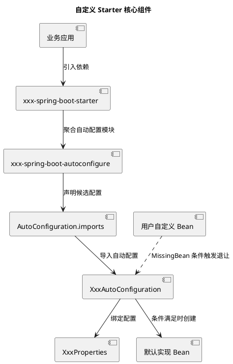
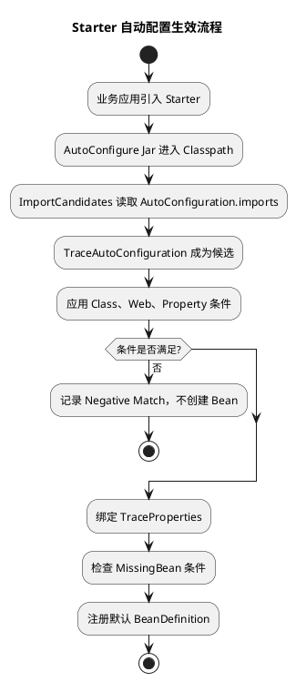
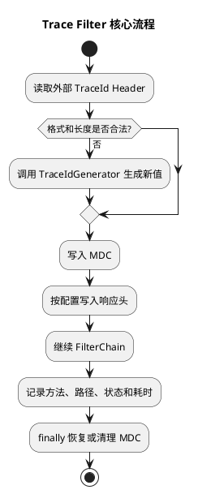
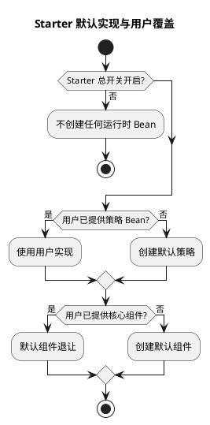

# 手搓一个 Spring Boot Starter

## 问题索引

- Q1：如何设计并实现一个可配置、可覆盖、可测试的 Spring Boot Starter？

## Q1：如何设计并实现一个可配置、可覆盖、可测试的 Spring Boot Starter？

### 背景

Starter 用于封装多个项目都会使用的基础能力，例如统一日志、审计、SDK Client、限流、幂等、脱敏和监控。

一个合格的 Starter 应该做到：

```text
引入依赖即可使用
  + 有合理默认配置
  + 可以通过属性关闭
  + 用户自定义 Bean 时默认实现退让
  + 只在满足条件时装配
  + 可以测试和解释为什么生效或不生效
```

Starter 不是把业务代码打成一个 Jar，也不是用 `@ComponentScan` 隐式扫描一批组件。它的核心是：**依赖聚合 + 自动配置 + 条件装配 + 扩展点设计**。

本文以链路标识 Trace Starter 为例，重点讲实现思路。示例仅保留关键代码，不展开完整 Maven POM、Getter/Setter 和通用工具代码。

### 总体组件关系



可以先记住四层：

| 层次 | 职责 |
| --- | --- |
| Starter | 给使用方提供统一依赖入口 |
| AutoConfigure | 保存条件装配逻辑和默认 Bean |
| Properties | 把外部配置绑定成类型安全对象 |
| 扩展接口 | 允许业务替换默认策略 |

### Starter 和普通依赖有什么区别

普通依赖通常只是把类放进 Classpath，使用者还要自己创建 Bean、读取配置和处理生命周期。

Starter 在普通依赖之上增加：

```text
Classpath 中出现 Starter
  -> Spring Boot 发现自动配置候选
  -> 条件满足时注册 BeanDefinition
  -> 用户不配置也有默认实现
  -> 用户声明自定义 Bean 后默认实现退出
```

因此 Starter 的质量主要取决于自动配置边界是否清晰，而不是代码数量。

### 模块应该如何拆分

推荐拆成两个模块：

```text
company-trace-spring-boot-starter/
  -> 只聚合依赖

company-trace-spring-boot-autoconfigure/
  -> TraceProperties
  -> TraceAutoConfiguration
  -> TraceIdGenerator 默认实现
  -> TraceFilter
  -> AutoConfiguration.imports
  -> 自动配置测试
```

为什么要拆分：

- Starter 只负责告诉使用方“需要引入哪些依赖”。
- AutoConfigure 可以被多个 Starter 复用。
- 自动配置逻辑可以独立测试。
- 可选依赖和运行时依赖更容易管理。
- 避免把普通 API、默认实现和依赖聚合混成一个模块。

小型公司内部 Starter 也可以暂时合成一个模块，但职责仍应按以上边界组织，后续复杂后再物理拆分。

### Starter 模块应该放什么

Starter 模块通常只有依赖声明，不需要 `@SpringBootApplication`，也不需要可执行入口。

核心依赖关系示意：

```xml
<dependencies>
    <!-- 真正的配置和默认实现位于 autoconfigure 模块。 -->
    <dependency>
        <groupId>com.example.infrastructure</groupId>
        <artifactId>company-trace-spring-boot-autoconfigure</artifactId>
        <version>${project.version}</version>
    </dependency>

    <!-- 示例是 Servlet MVC Starter，因此聚合对应 Web 技术栈。 -->
    <dependency>
        <groupId>org.springframework.boot</groupId>
        <artifactId>spring-boot-starter-webmvc</artifactId>
    </dependency>
</dependencies>
```

如果 Starter 不是专门服务 Web 应用，不应为了一个可选功能强制引入完整 WebMVC。可以把 Web 依赖设为 optional，并在 Classpath 中存在 Web API 时才装配相关 Bean。

Starter 和 AutoConfigure 应发布普通 Jar，不要使用 repackage 把它们打成可执行 Fat Jar。

### 配置属性设计

配置项要集中到 `@ConfigurationProperties`：

```java
@ConfigurationProperties(prefix = "company.trace")
public class TraceProperties {

    // 默认开启，但必须允许业务在故障时快速关闭。
    private boolean enabled = true;

    private String headerName = "X-Trace-Id";

    private boolean includeResponseHeader = true;

    private List<String> excludePaths = List.of("/actuator/health/**");

    // Getter/Setter 省略。
}
```

设计配置时关注：

- 前缀使用公司或产品命名空间，避免和其他 Starter 冲突。
- 默认值必须安全、可解释。
- 关键能力要有总开关。
- 数量、时长等字段使用明确类型并增加校验。
- 配置项改名时提供废弃提示和迁移窗口。
- 不把密码、Token 等 Secret 直接作为普通默认值。

相比大量 `@Value`，`@ConfigurationProperties` 更适合分组、类型转换、校验、元数据生成和测试。

### 先设计扩展点，再提供默认实现

例如业务可能已经接入 Micrometer Tracing，不能强迫所有项目使用 Starter 自己的 UUID：

```java
public interface TraceIdGenerator {

    String generate();
}

public class DefaultTraceIdGenerator implements TraceIdGenerator {

    @Override
    public String generate() {
        // 默认实现只负责开箱即用，业务可以声明同类型 Bean 替换它。
        return UUID.randomUUID().toString().replace("-", "");
    }
}
```

扩展接口应解决真实差异，例如：

- ID 生成策略。
- SDK 请求签名。
- 用户身份提取方式。
- 失败回调或降级策略。

不要把每一个私有方法都抽成接口。扩展点越多，兼容和测试成本越高。

### 自动配置类是核心

核心代码通常集中在一个较短的自动配置类中：

```java
@AutoConfiguration
@ConditionalOnWebApplication(type = Type.SERVLET)
@ConditionalOnClass(OncePerRequestFilter.class)
@ConditionalOnProperty(
        prefix = "company.trace",
        name = "enabled",
        havingValue = "true",
        matchIfMissing = true)
@EnableConfigurationProperties(TraceProperties.class)
public class TraceAutoConfiguration {

    @Bean
    @ConditionalOnMissingBean
    TraceIdGenerator traceIdGenerator() {
        return new DefaultTraceIdGenerator();
    }

    @Bean
    @ConditionalOnMissingBean
    TraceFilter traceFilter(TraceProperties properties,
                            TraceIdGenerator generator) {
        return new TraceFilter(properties, generator);
    }

    @Bean
    @ConditionalOnMissingBean(name = "companyTraceFilterRegistration")
    FilterRegistrationBean<TraceFilter> companyTraceFilterRegistration(
            TraceFilter filter,
            TraceProperties properties) {
        FilterRegistrationBean<TraceFilter> registration =
                new FilterRegistrationBean<>(filter);
        registration.setOrder(properties.getOrder());
        registration.addUrlPatterns("/*");
        return registration;
    }
}
```

这里体现了 Starter 的核心能力：

| 注解 | 解决的问题 |
| --- | --- |
| `@AutoConfiguration` | 声明这是 Spring Boot 自动配置类 |
| `@ConditionalOnWebApplication` | 只在目标应用类型中生效 |
| `@ConditionalOnClass` | 依赖存在时才装配，避免类缺失异常 |
| `@ConditionalOnProperty` | 提供配置开关 |
| `@EnableConfigurationProperties` | 注册并绑定配置对象 |
| `@ConditionalOnMissingBean` | 用户自定义 Bean 优先，默认实现退让 |

条件尽量放在最能表达边界的位置。如果整个功能都依赖同一个总开关，可以放在自动配置类；只影响某个可选 Bean 的条件应放到对应 Bean 方法，避免无关组件一起消失。

### `AutoConfiguration.imports` 为什么必不可少

自动配置类通常不在业务应用的组件扫描范围内，必须显式注册为自动配置候选。

资源路径：

```text
META-INF/spring/
org.springframework.boot.autoconfigure.AutoConfiguration.imports
```

文件内容：

```text
com.example.trace.autoconfigure.TraceAutoConfiguration
```

加载关系：



imports 中有类名，只表示它成为候选。最终是否创建 Bean，还要经过条件判断和 Spring BeanDefinition 注册流程。

对于现代 Spring Boot，应使用 `AutoConfiguration.imports`。旧版本可能使用 `spring.factories` 注册 `EnableAutoConfiguration`，维护 Starter 时必须明确支持的 Boot 大版本。

### Filter 业务逻辑只保留必要原则

Trace Filter 的关键不是完整代码，而是以下处理顺序：



核心代码骨架：

```java
protected void doFilterInternal(HttpServletRequest request,
                                HttpServletResponse response,
                                FilterChain chain) throws Exception {
    String traceId = resolveOrGenerateTraceId(request);
    long start = System.nanoTime();
    MDC.put("traceId", traceId);
    try {
        response.setHeader(properties.getHeaderName(), traceId);
        chain.doFilter(request, response);
    }
    finally {
        // Servlet 线程会复用，MDC 必须在 finally 中清理。
        logRequest(request, response, System.nanoTime() - start);
        MDC.remove("traceId");
    }
}
```

生产注意点：

- 外部 TraceId 必须限制字符集和长度，防止日志或响应头注入。
- 不记录密码、Authorization、Cookie 和完整 QueryString。
- 异步线程不会自动继承 MDC，需要 TaskDecorator 或观测框架。
- 跨服务链路优先复用 Micrometer Tracing 或 OpenTelemetry。
- Filter 的 finally 不一定能看到容器异常二次分派后的最终状态码，严格访问日志应结合 Observation 或容器 Access Log。

### 用户如何覆盖默认实现

业务应用只需要声明同类型 Bean：

```java
@Bean
TraceIdGenerator traceIdGenerator() {
    // 声明后，默认生成器因 ConditionalOnMissingBean 自动退让。
    return existingTracingSystem::currentOrCreateTraceId;
}
```

装配决策：



应该支持三个层次：

```text
默认使用：只引入依赖
部分替换：声明扩展接口或核心组件 Bean
完全关闭：company.trace.enabled=false
```

### 配置元数据

AutoConfigure 模块加入可选的：

```xml
<dependency>
    <groupId>org.springframework.boot</groupId>
    <artifactId>spring-boot-configuration-processor</artifactId>
    <optional>true</optional>
</dependency>
```

编译后生成：

```text
META-INF/spring-configuration-metadata.json
```

IDE 可以据此提示配置名、类型、默认值和说明。发布前应检查元数据是否被打进 Jar。

### 自动配置应该怎么测试

测试重点不是覆盖每个 Getter，而是覆盖条件矩阵：

| 场景 | 预期 |
| --- | --- |
| Servlet Web + 默认配置 | 默认 Bean 全部存在 |
| `enabled=false` | 运行时 Bean 不存在 |
| 用户提供策略 Bean | 默认策略退让 |
| 用户提供核心组件 | 默认组件退让 |
| 非 Web 或 Reactive 应用 | Servlet Filter 不装配 |
| 缺少必要 Class | 自动配置不生效且不报类加载错误 |
| 属性自定义 | Properties 和 Bean 行为正确 |

关键测试骨架：

```java
private final WebApplicationContextRunner contextRunner =
        new WebApplicationContextRunner()
                .withConfiguration(
                        AutoConfigurations.of(TraceAutoConfiguration.class));

@Test
void backsOffWhenUserProvidesGenerator() {
    contextRunner
            .withBean(TraceIdGenerator.class, () -> () -> "fixed-trace-id")
            .run(context ->
                    assertThat(context)
                            .hasSingleBean(TraceIdGenerator.class));
}

@Test
void canBeDisabled() {
    contextRunner
            .withPropertyValues("company.trace.enabled=false")
            .run(context ->
                    assertThat(context)
                            .doesNotHaveBean(TraceFilter.class));
}
```

`ApplicationContextRunner` 比每个用例启动完整应用更轻量，特别适合验证自动配置条件、Bean 退让和属性绑定。

如果 Starter 包含 Filter、序列化或网络行为，还需要少量集成测试验证运行期效果，但不应使用端到端测试代替条件装配测试。

### 如何排查 Starter 没有生效

按层排查：

```text
1. Maven dependency:tree 中是否存在 Starter 和 AutoConfigure Jar
2. Jar 中是否存在 AutoConfiguration.imports
3. 自动配置类全限定名是否正确
4. --debug 条件报告中是否出现 TraceAutoConfiguration
5. Class、Web、Property 条件是否匹配
6. 是否因为 MissingBean 检测到用户 Bean 而退让
7. BeanDefinition 已注册后是否在实例化阶段失败
```

常用手段：

```bash
mvn dependency:tree
jar tf company-trace-spring-boot-autoconfigure.jar
java -jar app.jar --debug
```

Actuator 可辅助查看：

```text
/actuator/conditions
/actuator/configprops
/actuator/beans
```

故障定位：

| 现象 | 优先检查 |
| --- | --- |
| 条件报告没有自动配置类 | imports、Jar 资源、Classpath |
| Negative Match | Class、Web、Property 条件 |
| 自动配置匹配但默认 Bean 不存在 | MissingBean 退让、方法级条件 |
| BeanDefinition 存在但启动失败 | 构造依赖、属性绑定、初始化逻辑 |

### 版本兼容和发布

示例基于 Spring Boot `4.1.0`，Web 依赖使用 `spring-boot-starter-webmvc`。Boot 4.1 中旧 `spring-boot-starter-web` 仍存在，但官方模块已经标记为推荐迁移到 webmvc Starter。

实际发布需要维护兼容矩阵：

```text
Starter 1.x -> Spring Boot 3.x
Starter 2.x -> Spring Boot 4.x
```

不要声明一个未经测试的 Starter 同时兼容所有 Boot 大版本。Jakarta API、依赖拆分、自动配置 API 和测试基础设施都可能变化。

发布要求：

- 使用语义化版本并发布到公司 Maven 私服。
- 提供配置说明、默认值、关闭方式和覆盖方式。
- CI 验证所有受支持的 Boot 小版本。
- 补丁版本不要删除配置或改变关键默认行为。
- 不在自动配置构造器中执行远程调用和数据修改。
- 复杂初始化应提供超时、延迟加载或明确失败策略。

### 什么适合做成 Starter

适合：

- 多项目重复使用。
- 有稳定的配置模型。
- 有明确启用条件和默认实现。
- 可以通过少量扩展点满足差异。
- 能独立测试和发布。

不适合：

- 强业务流程，例如订单状态流转。
- 只在一个项目使用的普通 Service。
- 必须隐式扫描业务包才能运行。
- 启动时执行不可控的数据迁移。
- 无法安全关闭或覆盖的全局副作用。

### 常见踩坑点

1. Starter 与 AutoConfigure 职责混乱，把所有依赖和逻辑放在一起。
2. 忘记声明 `AutoConfiguration.imports`，配置类永远不会成为候选。
3. 自动配置使用宽泛 `@ComponentScan`，创建接入方无法预期的 Bean。
4. 没有总开关，线上出现问题时无法快速关闭。
5. 没有 `@ConditionalOnMissingBean`，业务无法替换默认实现。
6. 条件边界不完整，在非 Web 或缺少依赖时类加载失败。
7. 配置使用大量 `@Value`，没有分组、校验和 IDE 元数据。
8. 在自动配置初始化时访问远程服务，依赖抖动导致应用无法启动。
9. Starter 被打成可执行 Fat Jar。
10. Filter 重复注册，导致同一请求执行两次。
11. MDC 没有在 finally 清理，线程复用后日志串链路。
12. 只写 Demo，没有测试关闭、覆盖、条件不匹配和版本兼容。
13. Starter 升级改变默认行为，却没有灰度开关和变更说明。
14. 已有 Micrometer Tracing 时又引入第二套 TraceId 体系。

### 面试话术

> 手写 Starter 的核心不是写一个配置类，而是设计依赖聚合、自动配置、条件装配和用户扩展边界。我通常拆成 starter 与 autoconfigure 两个模块：starter 只聚合依赖，autoconfigure 放 `@ConfigurationProperties`、默认实现和 `@AutoConfiguration`。自动配置通过 `@ConditionalOnClass`、`@ConditionalOnWebApplication` 和 `@ConditionalOnProperty` 控制生效条件，通过 `@ConditionalOnMissingBean` 让用户 Bean 覆盖默认实现，并把配置类全限定名写入 `AutoConfiguration.imports`。测试使用 ApplicationContextRunner 覆盖默认装配、关闭开关、用户覆盖和条件不满足场景。生产化还要提供配置元数据、版本兼容矩阵、ConditionEvaluationReport 排障，以及可关闭、可回滚的默认行为。

### 高频追问

- Q：Starter 和 AutoConfigure 为什么要拆开？
  A：Starter 负责依赖聚合，AutoConfigure 负责条件装配。拆分后依赖边界、复用、测试和版本管理更清晰。

- Q：为什么不能只给配置类加 `@Configuration`？
  A：Starter 配置类通常不在业务组件扫描范围内，还需要通过 `AutoConfiguration.imports` 声明为自动配置候选。

- Q：`@ConditionalOnMissingBean` 的价值是什么？
  A：提供默认配置退让机制。框架开箱即用，业务有特殊需求时声明同类型 Bean 即可替换。

- Q：条件注解应该放在类上还是 Bean 方法上？
  A：整个功能共用的条件放在自动配置类；只控制某个可选组件的条件放在对应 Bean 方法，避免不相关 Bean 被一起关闭。

- Q：为什么推荐 ApplicationContextRunner？
  A：它可以快速构建小型上下文，直接验证条件、配置绑定和 Bean 退让，不需要每次启动完整应用。

- Q：Starter 是否应该强制引入 WebMVC？
  A：明确只服务 Servlet Web 的 Starter 可以聚合 WebMVC；通用 Starter 应把 Web 能力做成 optional，并通过 Classpath 和应用类型条件装配。

### 复习清单

- [ ] 能说明 Starter、AutoConfigure、Properties 和扩展接口的职责。
- [ ] 能解释自动配置从 imports 到 BeanDefinition 的生效流程。
- [ ] 能根据 Classpath、应用类型和属性设计条件边界。
- [ ] 能通过 MissingBean 实现默认 Bean 退让。
- [ ] 能设计总开关、安全默认值和配置元数据。
- [ ] 能使用 ApplicationContextRunner 测试条件矩阵。
- [ ] 能通过 ConditionEvaluationReport 排查 Starter 未生效。
- [ ] 能说明普通 Jar、Fat Jar 和 Boot 大版本兼容问题。
- [ ] 能识别哪些能力适合或不适合做成 Starter。

### 相关笔记

- [Spring Boot 核心组件与原理](../3-Java框架/02-SpringBoot/2026-07-22-SpringBoot核心组件与原理.md)

### 参考资料

- [Spring Boot 4.1.0 Release](https://github.com/spring-projects/spring-boot/releases/tag/v4.1.0)
- [Spring Boot Creating Your Own Auto-configuration](https://docs.spring.io/spring-boot/reference/features/developing-auto-configuration.html)
- [Spring Boot AutoConfiguration](https://github.com/spring-projects/spring-boot/blob/v4.1.0/core/spring-boot-autoconfigure/src/main/java/org/springframework/boot/autoconfigure/AutoConfiguration.java)
- [Spring Boot WebApplicationContextRunner](https://github.com/spring-projects/spring-boot/blob/v4.1.0/core/spring-boot-test/src/main/java/org/springframework/boot/test/context/runner/WebApplicationContextRunner.java)
