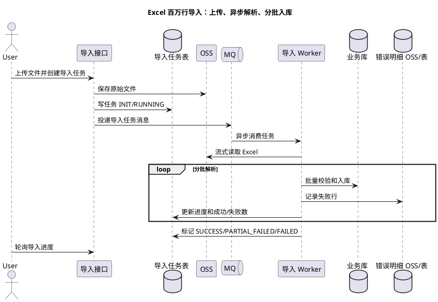

# 30 道系统设计面试题（代码级详解）

> 适用面试题类型：开放型多维度系统设计题（"做一个 X 系统需要考虑什么"）。这类题没有标准答案，考察候选人能想到多少维度、能展开到多深。
>
> 万能答题策略：先拉框架再选 5-6 个维度展开 + 1-2 个维度落到代码细节。

---

## 通用答题框架：8 维度 + 答题节奏

### 8 个维度

| # | 维度 | 关键词 |
|---|------|--------|
| ① | **性能** | 数据量、QPS、查询优化、索引、缓存、批处理 |
| ② | **异步** | 消息队列、线程池、@Async、CompletableFuture |
| ③ | **并发** | 限流、锁（DB / Redis / ZK）、隔离、降级、熔断 |
| ④ | **存储** | 关系型 vs NoSQL、冷热分离、分库分表、读写分离 |
| ⑤ | **安全** | 鉴权、防刷、脱敏、审计、签名 URL、XSS/CSRF |
| ⑥ | **用户体验** | 进度反馈、错误提示、可取消、降级提示、文案 |
| ⑦ | **异常处理** | 重试、降级、熔断、补偿、对账、死信队列 |
| ⑧ | **数据一致性** | 事务、幂等、最终一致、对账、TCC、Saga |

### 答题节奏（5 分钟版）

- **30 秒：** 复述题目，确认边界（"用户量 / QPS / 数据量大概什么级别？"）
- **1 分钟：** 列 5-6 个相关维度，每个一句话
- **2-3 分钟：** 挑 1-2 个最关键维度展开到表结构 / 接口设计 / 关键代码
- **30 秒：** 主动提潜在坑（"还有 X 风险，可以用 Y 方案解决"）

### 三句加分话术

1. "这里有读写不一致风险，我会用 X 保证最终一致" → 体现一致性意识
2. "这个接口要加幂等，避免重试重复扣费" → 体现可用性意识
3. "压测时要关注 P99 而不是平均，长尾请求才是用户体验真凶" → 体现性能意识

---

# A 类：数据处理（与订单导出最相似）

## 1. 设计 Excel 批量导入百万行用户数据

> 场景：HR 系统上传一份 100 万行的用户 Excel，要求校验后批量导入数据库，错误行能下载错误清单。

### 核心难点

- **OOM 风险**：100 万行 × 30 列 ≈ 几百 MB 数据 + Excel XML 解压 ≈ 1-2GB 内存
- **超时风险**：HTTP 请求默认 30s 超时，导入 100 万行远超
- **校验失败处理**：哪些行成功、哪些失败、错误原因怎么返回

### ① 性能：流式解析 + 分批入库

**用 EasyExcel SAX 模式**，绝不能用 `XSSFWorkbook` 一次性 load 整个 Excel：

```java
// 监听器：每解析 1000 行触发一次 invoke，攒满 batch 入库
public class UserImportListener extends AnalysisEventListener<UserImportRowDTO> {
    private static final int BATCH_SIZE = 1000;
    private final List<UserImportRowDTO> batch = new ArrayList<>(BATCH_SIZE);
    private final UserImportService service;
    private int totalCount = 0;
    private int successCount = 0;
    private final List<ErrorRowDTO> errorRows = new ArrayList<>();

    @Override
    public void invoke(UserImportRowDTO row, AnalysisContext context) {
        totalCount++;
        batch.add(row);
        if (batch.size() >= BATCH_SIZE) {
            flushBatch();
        }
    }

    @Override
    public void doAfterAllAnalysed(AnalysisContext context) {
        if (!batch.isEmpty()) flushBatch();
    }

    private void flushBatch() {
        ImportResultDTO result = service.validateAndSave(batch);
        successCount += result.getSuccessCount();
        errorRows.addAll(result.getErrorRows());
        batch.clear();  // 关键：清空批，让旧对象被 GC
    }
}

// 调用入口
EasyExcel.read(inputStream, UserImportRowDTO.class, new UserImportListener(service))
    .sheet().doRead();
```

**入库可用 MyBatis `<foreach>` 生成多值 INSERT**，例如单批 1000 行：

```xml
<insert id="batchInsert">
    INSERT INTO sys_user (username, mobile, dept_id, create_time) VALUES
    <foreach collection="list" item="item" separator=",">
        (#{item.username}, #{item.mobile}, #{item.deptId}, NOW())
    </foreach>
</insert>
```

上面的 `<foreach>` 已经生成一条包含多组 `VALUES` 的 SQL，不依赖 `rewriteBatchedStatements=true`。如果改为 `ExecutorType.BATCH`，重复调用单行 INSERT 并使用 JDBC Batch，再评估在 JDBC URL 增加 `rewriteBatchedStatements=true`，让 Connector/J 将符合条件的批处理重写成多值 INSERT。

### ② 异步：导入任务表 + MQ 削峰

**任务表：**

```sql
CREATE TABLE import_task (
    id BIGINT PRIMARY KEY,
    user_id BIGINT,
    file_url VARCHAR(500),
    status TINYINT,           -- 0=待处理 1=处理中 2=成功 3=失败 4=取消
    total_count INT,
    success_count INT,
    error_count INT,
    error_file_url VARCHAR(500),  -- 错误清单 OSS 地址
    create_time DATETIME,
    finish_time DATETIME
);
```

**调用链：**

```
前端上传文件 → Controller 存 OSS + 建 task 记录 (status=0) + 发 MQ → 返回 taskId
消费者收到 → status=1 → 流式解析 + 分批校验入库 → 错误清单写 CSV 上传 OSS
完成 → status=2 + 错误文件 URL 存进 task → 前端轮询发现完成 → 显示下载按钮
```

### ③ 并发：用户级 + 全局级双重限流

```java
// 用户级：同一用户同时只能跑一个导入
int running = importTaskMapper.countRunning(userId);
if (running > 0) throw new BizException("您有未完成的导入任务");

// 全局级：分布式信号量限制并发
RSemaphore semaphore = redisson.getSemaphore("import:semaphore");
semaphore.trySetPermits(5);  // 全局最多 5 个并发
if (!semaphore.tryAcquire(0, TimeUnit.SECONDS)) {
    throw new BizException("系统繁忙，请稍后重试");
}
try { /* 导入逻辑 */ } finally { semaphore.release(); }
```

### ④ 存储：错误清单走 OSS 不走 DB

10 万行错误清单存 DB 行数太多，应直接生成 CSV 上传 OSS，DB 只存 URL。CSV 必须写 UTF-8 BOM 头（`'\uFEFF'`）防 Excel 打开乱码。

### ⑤ 安全：文件类型 + 大小 + 病毒扫描

```java
// 校验顺序：MIME → 后缀 → 魔数（前 2 字节）→ 大小
if (!"xlsx".equals(FileUtil.extName(filename))) throw new BizException("仅支持 xlsx");
if (file.getSize() > 50 * 1024 * 1024) throw new BizException("文件不超过 50MB");
byte[] head = new byte[4];
file.getInputStream().read(head);
// xlsx 实际是 zip，魔数 50 4B 03 04 = "PK\x03\x04"
if (head[0] != 0x50 || head[1] != 0x4B) throw new BizException("文件已损坏");
```

权限：导入 SQL 强制带 `WHERE tenant_id = ?` 防越权写入别的租户。

### ⑥ 用户体验：实时进度 + 可取消

进度条用 WebSocket 推 `currentCount / totalCount * 100`；前端取消按钮调接口把 `status=4`，监听器每批检查一次状态，发现取消立即终止。

### ⑦ 异常处理：错误隔离 + 断点续导

**关键决策：单行错误不要抛异常导致整批失败**——在监听器里 try-catch 单行，把错误信息记入 errorRows，继续处理下一行。

```java
@Override
public void invoke(UserImportRowDTO row, AnalysisContext context) {
    try {
        validate(row);   // JSR-303 + 业务校验
        batch.add(row);
        if (batch.size() >= BATCH_SIZE) flushBatch();
    } catch (Exception e) {
        errorRows.add(new ErrorRowDTO(context.readRowHolder().getRowIndex(),
            row, e.getMessage()));
    }
}
```

断点续导：失败时把 lastRowIndex 存进 task 记录，重试从该行开始读（EasyExcel 支持 `headRowNumber + skipRows`）。

### ⑧ 数据一致性：批内事务 + 整体最终一致

```java
@Transactional(rollbackFor = Exception.class)
public ImportResultDTO validateAndSave(List<UserImportRowDTO> batch) {
    // 校验失败的不入库；通过校验的走批量 insert
    // 单批事务保证原子，跨批不保证整体——业务上可接受
}
```

### 完整调用链


### PlantUML 示意图：百万行 Excel 导入调用链



```
前端 → 上传 xlsx 到 OSS → 调创建任务接口 → 后端建 task + 发 MQ → 返回 taskId
                                                                          ↓
前端 ← WebSocket 进度推送 ← 监听器每批推送 ← 消费者拉 OSS 文件流式解析
       ↓
前端轮询 task 状态 → status=2 → 显示成功数 + 错误清单下载按钮 → 点击 → OSS 签名 URL
```

### 常见追问

| 追问 | 回答要点 |
|------|----------|
| 怎么避免重复导入同一文件？ | 上传前算 MD5，task 表加唯一索引 `uk_user_md5(user_id, file_md5)` |
| 导入到一半服务挂了怎么办？ | MQ 重试 + lastRowIndex 断点续导 + 定时扫超时 task |
| 100GB Excel 怎么办？ | 不存在 100GB Excel，xlsx 单 sheet 上限 1048576 行；超过让用户拆分或改 CSV 格式 |

---

## 2. 大文件分片上传（断点续传 + 秒传）

> 场景：用户上传 10GB 的视频/数据库备份文件，要支持断点续传、秒传、网络波动恢复。

### 核心难点

- 单 HTTP 请求传 10GB 容易超时/被中断
- 用户网络断了之后能从上次位置继续
- 同一文件第二次上传应该秒传不重复

### ① 性能：客户端切片 + 并发上传

**前端切片（5MB/片）：**

```javascript
const CHUNK_SIZE = 5 * 1024 * 1024;
async function uploadFile(file) {
    const fileMd5 = await calcFileMd5(file);  // 用 spark-md5 增量算
    // 1. 秒传判断
    const { exists, uploadId, uploadedChunks } = await api.checkFile(fileMd5);
    if (exists) { showSuccess('秒传成功'); return; }
    // 2. 分片并发上传（控制最大并发 5）
    const chunks = sliceFile(file, CHUNK_SIZE);
    await pLimit(5, chunks.map((chunk, idx) => () => {
        if (uploadedChunks.includes(idx)) return;  // 已传跳过（断点续传）
        return uploadChunk(uploadId, idx, chunk);
    }));
    // 3. 通知合并
    await api.mergeChunks(uploadId);
}
```

**后端用 OSS 的 MultipartUpload API**（阿里云/AWS 都有），不要自己拼接：

```java
@PostMapping("/upload/init")
public InitUploadVO initUpload(@RequestBody InitUploadReq req) {
    // 1. 秒传：MD5 已存在直接返回
    UploadFile existing = uploadFileMapper.findByMd5(req.getFileMd5());
    if (existing != null) {
        return InitUploadVO.builder().exists(true).fileUrl(existing.getUrl()).build();
    }
    // 2. 创建 OSS MultipartUpload
    InitiateMultipartUploadRequest ossReq = new InitiateMultipartUploadRequest(bucket, objectKey);
    String uploadId = ossClient.initiateMultipartUpload(ossReq).getUploadId();
    // 3. 建上传任务记录
    UploadTask task = new UploadTask();
    task.setUploadId(uploadId);
    task.setFileMd5(req.getFileMd5());
    task.setTotalChunks(req.getTotalChunks());
    uploadTaskMapper.insert(task);
    // 4. 返回已上传分片号（断点续传）
    List<Integer> uploaded = chunkMapper.listByUploadId(uploadId);
    return InitUploadVO.builder().uploadId(uploadId).uploadedChunks(uploaded).build();
}

@PostMapping("/upload/chunk")
public void uploadChunk(@RequestParam String uploadId,
                        @RequestParam Integer chunkIndex,
                        @RequestParam MultipartFile chunk) {
    UploadPartRequest partReq = new UploadPartRequest();
    partReq.setUploadId(uploadId);
    partReq.setPartNumber(chunkIndex + 1);  // OSS 从 1 开始
    partReq.setInputStream(chunk.getInputStream());
    partReq.setPartSize(chunk.getSize());
    UploadPartResult result = ossClient.uploadPart(partReq);
    // 记录分片成功（用于秒传 / 断点续传查询）
    chunkMapper.insert(new Chunk(uploadId, chunkIndex, result.getETag()));
}

@PostMapping("/upload/merge")
public String merge(@RequestParam String uploadId) {
    List<PartETag> etags = chunkMapper.listEtags(uploadId);
    CompleteMultipartUploadRequest req = new CompleteMultipartUploadRequest(
        bucket, objectKey, uploadId, etags);
    return ossClient.completeMultipartUpload(req).getLocation();
}
```

### ② 异步：合并耗时操作放后台

10GB 文件合并可能要几分钟，merge 接口应只丢个 MQ 消息异步处理，立即返回 jobId。

### ③ 并发：分片上传天然支持

前端用 `Promise.all` + 并发数控制（5-10 个），既能加速又不打爆服务器。

### ④ 存储：分片表 + 任务表

```sql
CREATE TABLE upload_task (
    upload_id VARCHAR(64) PRIMARY KEY,
    file_md5 CHAR(32) UNIQUE,         -- 秒传查询索引
    file_name VARCHAR(255),
    total_chunks INT,
    file_url VARCHAR(500),            -- 合并完成后填
    status TINYINT,                   -- 0=上传中 1=已合并 2=失败
    expire_time DATETIME              -- 7 天未完成自动清理
);

CREATE TABLE upload_chunk (
    id BIGINT AUTO_INCREMENT PRIMARY KEY,
    upload_id VARCHAR(64),
    chunk_index INT,
    etag VARCHAR(64),                 -- OSS 返回的分片标识
    UNIQUE KEY uk_upload_chunk (upload_id, chunk_index)
);
```

### ⑤ 安全：MD5 校验防篡改 + 鉴权

- 上传前后端核对：客户端传文件 MD5，后端合并后再算一遍 OSS 文件 MD5 对比
- 每个分片上传都要校验 token；upload_id 是临时的不能预测

### ⑥ 用户体验

- **进度条**：每片成功后前端更新进度
- **暂停/继续**：暂停 = 取消 pending 的请求；继续 = 重新调 init 接口拿到 uploadedChunks 后跳过已传的
- **网络恢复自动续传**：监听 `online` 事件触发继续

### ⑦ 异常处理：分片重试 + 过期清理

```java
// 每天扫一次：超过 7 天未合并的 task 调 OSS abort 释放空间
@Scheduled(cron = "0 0 3 * * ?")
public void cleanExpiredUploads() {
    List<UploadTask> expired = uploadTaskMapper.listExpired();
    for (UploadTask task : expired) {
        ossClient.abortMultipartUpload(new AbortMultipartUploadRequest(
            bucket, task.getObjectKey(), task.getUploadId()));
        uploadTaskMapper.delete(task.getUploadId());
    }
}
```

单个分片失败：前端自动重试 3 次，仍失败提示用户手动续传。

### ⑧ 数据一致性

- **MD5 必须前后端都算**：客户端算的可能被改，服务端用 OSS 返回的 ContentMD5 验证
- **秒传不能只信 MD5**：MD5 碰撞风险，重要文件要二次校验文件大小 + 前 1KB hash

### 常见追问

| 追问 | 回答要点 |
|------|----------|
| MD5 计算 10GB 文件前端不会卡死吗？ | 用 spark-md5 增量计算，每读 5MB 计算一次，UI 不会卡；或用 Web Worker |
| 怎么防止盗链？ | OSS 签名 URL（限时 + 限来源）+ Referer 校验 |
| 秒传是怎么实现的？ | 文件 MD5 唯一索引，第二次上传命中直接返回已有 URL |

---

## 3. 跨系统千万级数据同步（CDC + 全量 + 增量）

> 场景：MySQL 主库 → 数据仓库 / ES / 另一个微服务的库，要求实时同步、不丢数据、不影响主库性能。

### 核心难点

- 全量初始化（千万行）+ 增量实时同步无缝衔接
- 同步链路有故障时不能丢消息
- 脏数据 / 重复数据怎么处理

### ① 性能：全量分片 + 增量基于 binlog

**全量阶段**：用主键范围分片并发拉取，避免 LIMIT offset 大偏移：

```java
// 分片参数：N 个线程，每线程负责一段 ID 范围
long minId = orderMapper.minId();
long maxId = orderMapper.maxId();
long shardSize = (maxId - minId) / shardCount;

ExecutorService executor = Executors.newFixedThreadPool(shardCount);
for (int i = 0; i < shardCount; i++) {
    long start = minId + i * shardSize;
    long end = (i == shardCount - 1) ? maxId : start + shardSize;
    executor.submit(() -> syncShard(start, end));
}

private void syncShard(long start, long end) {
    long lastId = start;
    while (lastId < end) {
        // 游标分页，比 LIMIT offset 快几十倍
        List<Order> batch = orderMapper.selectByIdRange(lastId, end, 1000);
        if (batch.isEmpty()) break;
        targetService.batchUpsert(batch);
        lastId = batch.get(batch.size() - 1).getId();
    }
}
```

**增量阶段**：监听 MySQL binlog，**绝对不要用定时扫表**（效率低、不实时、漏删除）。用 Canal / Debezium：

```yaml
# Canal 客户端订阅
canal:
  instances:
    order:
      destination: order-instance
      filter: zsy_basic.t_order,zsy_basic.t_order_item
```

```java
@CanalEventListener
public class OrderSyncHandler {
    @InsertListenPoint
    public void onInsert(CanalEntry.EventType type, CanalEntry.RowData rowData) {
        Order order = parseRowData(rowData);
        kafkaTemplate.send("order-sync-topic", order.getId().toString(), order);
    }
    @UpdateListenPoint
    public void onUpdate(...) { ... }
    @DeleteListenPoint
    public void onDelete(...) { ... }
}
```

### ② 异步：MQ 解耦 + 顺序消费

**关键：同一 ID 的消息必须顺序消费**（否则 update 后 insert 顺序反了，数据错）：

- Kafka：用 `key=order_id` 保证同一 order 落同一 partition
- RocketMQ：用 `MessageQueueSelector` 按 order_id hash

```java
kafkaTemplate.send("order-sync-topic",
    String.valueOf(order.getId()),  // ← 关键：以 ID 作 key
    JSON.toJSONString(order));
```

### ③ 并发：消费者多实例 + 分区水平扩展

```yaml
spring.kafka.consumer:
  group-id: order-sync-consumer
  max-poll-records: 500
  enable-auto-commit: false  # 手动 commit 保证至少一次
spring.kafka.listener:
  concurrency: 8  # 8 个分区 8 个消费线程
```

### ④ 存储：用幂等 upsert 替代 insert

```sql
-- ON DUPLICATE KEY UPDATE 是 MySQL 的幂等写
INSERT INTO order_es (id, status, amount, update_time)
VALUES (?, ?, ?, ?)
ON DUPLICATE KEY UPDATE
    status = VALUES(status),
    amount = VALUES(amount),
    update_time = VALUES(update_time);
```

ES 用 `index` API 而不是 `create`（index 是 upsert，create 是只插入）。

### ⑤ 安全：DBA 单独账号 + binlog 权限

Canal 连主库的账号只给 `REPLICATION SLAVE, REPLICATION CLIENT, SELECT`，不能有 INSERT/UPDATE/DELETE。

### ⑥ 用户体验（运维侧）

- 实时延迟监控：binlog position vs 消费者已处理 position 的差距，超过阈值告警
- 全量进度展示：分片完成数 / 总分片数

### ⑦ 异常处理：死信队列 + 对账

**消费失败的进死信：**

```java
@KafkaListener(topics = "order-sync-topic")
public void consume(ConsumerRecord<String, String> record, Acknowledgment ack) {
    try {
        Order order = JSON.parseObject(record.value(), Order.class);
        targetService.upsert(order);
        ack.acknowledge();
    } catch (RetryableException e) {
        // 触发重试（不 ack，下次重新投递；或扔 retry topic）
        throw e;
    } catch (Exception e) {
        // 不可恢复错误进死信，人工介入
        deadLetterProducer.send("order-sync-dlt", record.value());
        ack.acknowledge();
    }
}
```

**T+1 对账定时任务：**

```java
@Scheduled(cron = "0 30 2 * * ?")
public void reconcile() {
    // 比对源库和目标库前一天 update_time 范围内的记录
    Map<Long, String> sourceHash = sourceMapper.hashByDay(yesterday);
    Map<Long, String> targetHash = targetMapper.hashByDay(yesterday);
    // 差异行重新同步
    sourceHash.forEach((id, hash) -> {
        if (!hash.equals(targetHash.get(id))) {
            kafkaTemplate.send("order-sync-topic", id.toString(),
                sourceMapper.selectById(id));
        }
    });
}
```

### ⑧ 数据一致性：全量+增量无缝衔接

**经典坑**：先全量再切增量时会丢中间产生的变更。正确流程：

```
1. 记录当前 binlog position = P0
2. 启动增量消费，但只入 MQ 缓冲，不落库
3. 全量拉取（基于事务 ISO 级别 RR 保证一致性视图）
4. 全量完成后，从 P0 开始消费 MQ 中堆积的 binlog 事件
5. 此时增量和全量无缝衔接
```

### 常见追问

| 追问 | 回答要点 |
|------|----------|
| Canal 挂了怎么办？ | HA 部署 + ZK 选主 + position 持久化，故障切换续传 |
| 同步到 ES 怎么搜实时数据？ | ES refresh_interval=1s 已足够；要求毫秒级用双写 |
| 主库压力大怎么办？ | 从库挂 Canal 不影响主库；或用 MaxScale binlog server 中转 |

---

# B 类：高并发

## 4. 秒杀系统

> 场景：iPhone 限量 1000 台，1000 万用户同时点抢，要求不超卖、不少卖、不打挂数据库。

### 核心难点

- **流量瞬时洪峰**：QPS 可能 100 万+，传统数据库 5000 QPS 就崩了
- **超卖**：100 件商品被卖出 105 件 → 必须强一致
- **羊毛党刷单**：脚本秒杀正常用户买不到

### ① 性能：层层削峰，能拦在前面绝不放后面

经典"漏斗"架构，每层只放一部分流量进去：

```
1000万 QPS  → CDN 静态资源（页面、图片缓存）→ 拦掉 60%
 400万      → Nginx 限流（按 IP/UA）→ 拦掉 50%
 200万      → 网关限流（用户级令牌桶）→ 拦掉 80%
  40万      → 业务层 Redis 预扣库存 → 真实进 DB 的只有 1000 个成功扣减
```

**Nginx 限流：**

```nginx
limit_req_zone $binary_remote_addr zone=seckill:10m rate=10r/s;
location /seckill {
    limit_req zone=seckill burst=20 nodelay;
    proxy_pass http://backend;
}
```

### ② 异步：Redis 预扣 + MQ 异步下单

**最关键的 Lua 脚本（原子扣减库存）：**

```lua
-- KEYS[1]=stock:1001  ARGV[1]=1(数量)  ARGV[2]=user_id
local stock = tonumber(redis.call('GET', KEYS[1]))
if stock == nil or stock < tonumber(ARGV[1]) then
    return 0  -- 库存不足
end
-- 防止同一用户重复下单
if redis.call('SISMEMBER', 'seckill:user:1001', ARGV[2]) == 1 then
    return -1  -- 已抢过
end
redis.call('DECRBY', KEYS[1], ARGV[1])
redis.call('SADD', 'seckill:user:1001', ARGV[2])
return 1  -- 成功
```

```java
public Long seckill(Long itemId, Long userId) {
    Long result = redisTemplate.execute(SECKILL_SCRIPT,
        Arrays.asList("stock:" + itemId), 1, userId);
    if (result == 0) throw new BizException("已售罄");
    if (result == -1) throw new BizException("您已抢购过");
    // 扣减成功 → 发 MQ 异步下单（DB 慢慢消化）
    rocketMQTemplate.send("seckill-order-topic",
        new SeckillOrder(itemId, userId));
    return orderId;
}
```

### ③ 并发：用户级 + 全局级双重防控

- 同一用户同 SKU 1 单：Redis Set 去重（上面 Lua 已实现）
- 全局令牌桶：超过 QPS 直接 503，宁可拒绝不要拖垮系统
- 防脚本：滑块验证 / 答题 / 短信验证码（前置 5-30s）

### ④ 存储：库存预热到 Redis + DB 终态

秒杀开始前 1 小时把库存从 DB 同步到 Redis（`SET stock:1001 1000`）。DB 库存只在订单实际生成时扣减（带版本号乐观锁）：

```sql
UPDATE item SET stock = stock - 1, version = version + 1
WHERE id = ? AND stock > 0 AND version = ?;
```

返回 affected_rows = 0 表示 CAS 失败，订单需回滚。

### ⑤ 安全：防机器人 + 防黄牛

- URL 隐藏：秒杀按钮的真实 URL 在开始前几秒才下发（`/api/seckill/{token}` 中 token 临时生成）
- 设备指纹 + 行为分析：同设备多账号、点击间隔 < 100ms 直接拉黑
- 风控规则：手机号注册时间 < 7 天、历史无消费 → 加重审核

### ⑥ 用户体验

- 倒计时同步：服务器时间下发，前端按服务器时间显示倒计时
- 排队页：进 Redis 排队，前端轮询自己的排队序号
- "已售罄"快速返回：避免用户长时间等待空响应

### ⑦ 异常处理

- Redis 主从延迟导致少卖：库存改为 Redis Cluster + AOF 持久化，崩了从 DB 重建
- MQ 消费失败：进死信队列后人工介入 + 库存回滚（Redis INCR 回库存）
- 超时未支付：30 分钟未支付订单取消 → 库存释放（DB UPDATE + Redis INCR）

### ⑧ 数据一致性

**核心矛盾**：Redis 扣减成功但 DB 下单失败怎么办？两种方案：

```
方案 A（最终一致）：MQ 重试若干次仍失败 → 死信队列 → 人工介入 + Redis 回滚
方案 B（强一致）：用 Seata AT 模式包裹 Redis + DB（性能差，秒杀不用）
```

生产用方案 A，配定时对账：扫 Redis 已售但 DB 无订单的，回补库存。

### 常见追问

| 追问 | 回答要点 |
|------|----------|
| Redis 单机扛得住 100w QPS 吗？ | 单实例 Lua 5w-10w QPS，要分片 SKU（不同商品不同 Redis 节点）|
| 怎么防止同一商品 Lua 串行成为瓶颈？ | 库存分桶：`stock:1001:bucket1` ~ `bucket10`，每个桶 100 个，请求随机打到桶 |
| MQ 堆积怎么办？ | 消费者扩容；DB 写入用批量 upsert 提速；下游业务异步 |

---

## 5. 抽奖系统

> 场景：双 11 大转盘活动，奖池有 10 种奖品（一等奖 1 个、二等奖 100 个、谢谢参与无限），要求概率公平、不超发、防作弊。

### 核心难点

- **概率算法公平性**：1% 中奖率不能被刷出来变 10%
- **奖池超发**：1 个一等奖被并发抽出多个
- **风控**：脚本批量抽奖

### ① 性能：抽奖算法选型

**权重轮询（前缀和 + 二分查找），O(log n)：**

```java
public class WeightedRandom {
    private final int[] prefixSum;
    private final List<Prize> prizes;

    public WeightedRandom(List<Prize> prizes) {
        this.prizes = prizes;
        this.prefixSum = new int[prizes.size()];
        int sum = 0;
        for (int i = 0; i < prizes.size(); i++) {
            sum += prizes.get(i).getWeight();
            prefixSum[i] = sum;
        }
    }

    public Prize draw() {
        int r = ThreadLocalRandom.current().nextInt(prefixSum[prefixSum.length - 1]);
        int idx = Arrays.binarySearch(prefixSum, r + 1);
        if (idx < 0) idx = -idx - 1;
        return prizes.get(idx);
    }
}
```

权重示例：一等奖 1 / 二等奖 100 / 三等奖 1000 / 谢谢参与 100000 → 总权重 101101，一等奖概率 ≈ 0.001%。

### ② 异步：发奖异步化

抽奖结果秒级返回（核心链路），实物奖品发货走 MQ 异步处理（不影响用户体验）：

```java
@Transactional
public DrawResult draw(Long userId, Long activityId) {
    // 1. 校验抽奖资格（次数、活动状态）
    checkEligibility(userId, activityId);
    // 2. 抽奖（CPU 计算）
    Prize prize = weightedRandom.draw();
    // 3. 奖池扣减（关键，下面 ③ 详细讲）
    if (!stockService.tryDeduct(prize.getId())) {
        prize = sorryPrize();  // 抢空了降级为谢谢参与
    }
    // 4. 写抽奖记录
    drawRecordMapper.insert(new DrawRecord(userId, activityId, prize.getId()));
    // 5. 异步发奖
    if (prize.isPhysical()) {
        rocketMQTemplate.send("prize-deliver-topic", new DeliverMsg(userId, prize));
    }
    return new DrawResult(prize);
}
```

### ③ 并发：奖池 Lua 原子扣减

```lua
-- KEYS[1]=prize:stock:1  ARGV[1]=user_id
local stock = tonumber(redis.call('GET', KEYS[1]))
if stock == nil or stock <= 0 then return 0 end
redis.call('DECR', KEYS[1])
redis.call('LPUSH', 'prize:winners:1', ARGV[1])  -- 中奖记录
return 1
```

**坑**：抽到一等奖但 Redis 扣减失败（已抢空）时，必须降级为谢谢参与而不是再抽一次（再抽会改变概率）。

### ④ 存储

```sql
CREATE TABLE draw_record (
    id BIGINT AUTO_INCREMENT PRIMARY KEY,
    user_id BIGINT,
    activity_id BIGINT,
    prize_id BIGINT,
    draw_time DATETIME,
    INDEX idx_user_activity (user_id, activity_id, draw_time)
);
CREATE TABLE prize_pool (
    id BIGINT PRIMARY KEY,
    activity_id BIGINT,
    prize_name VARCHAR(100),
    total_count INT,
    remaining_count INT,
    weight INT,           -- 抽奖权重
    is_physical TINYINT
);
```

### ⑤ 安全：防作弊三件套

```java
// 1. 频率限制：每用户每分钟最多抽 10 次
String key = "draw:limit:" + userId;
Long count = redisTemplate.opsForValue().increment(key);
if (count == 1) redisTemplate.expire(key, 60, SECONDS);
if (count > 10) throw new BizException("操作过于频繁");

// 2. 设备指纹：同设备多账号风控
if (riskService.isSuspicious(deviceId, userId)) blackList.add(userId);

// 3. 行为分析：抽奖间隔 < 200ms 拉黑
```

### ⑥ 用户体验

- 转盘动画 3 秒（即使后端 50ms 返回）→ 增强仪式感
- 中奖后弹窗 + 振动 + 音效
- "差一点中奖"特效（实际是谢谢参与，但展示为"指针停在大奖旁"）

### ⑦ 异常处理

- 发奖 MQ 失败：死信队列 + 人工补发
- 用户网络断了没收到结果：抽奖记录已落库，重新查 → 显示已抽过
- 活动结束前最后 1 秒抽奖：强校验 `activity_end_time > now()`

### ⑧ 数据一致性

- **重发奖**：MQ 至少一次语义可能重复发奖，发奖接口必须幂等（按 draw_record_id 去重）
- **奖池对账**：每天凌晨对比 `prize_pool.remaining_count` 与 `total - 中奖记录数`，差异告警

### 常见追问

| 追问 | 回答要点 |
|------|----------|
| 怎么保证概率绝对公平？ | 用 SecureRandom（加密强随机）替代 Random；权重和大于 RAND_MAX 时分块 |
| 大转盘指针怎么和后端对应？ | 后端返回 prizeId + 指针角度（前端固定每个奖项扇形角度）|
| 怎么测试概率？ | 压测 100 万次抽奖，统计各奖项实际占比对比理论值，偏差 < 0.5% 算合格 |

---

## 6. 高频点赞

> 场景：抖音视频点赞，单个视频可能 1 亿点赞，1 秒内可能涌入 10 万点赞，要求实时显示总数 + 防止重复点赞 + 异步刷盘 DB。

### 核心难点

- **点赞的写多读少**（每个用户都点，但显示是总数）
- **不能每次都打 DB**：1 万 QPS 写直接打挂
- **去重**：同一用户对同一视频只能点 1 次

### ① 性能：Redis 计数 + 去重

```java
public boolean like(Long videoId, Long userId) {
    String dedupKey = "like:dedup:" + videoId;
    String countKey = "like:count:" + videoId;
    // SADD 返回 1 = 新添加（首次点赞），0 = 已存在
    Long added = redisTemplate.opsForSet().add(dedupKey, userId.toString());
    if (added == 0) {
        return false;  // 已点过
    }
    redisTemplate.opsForValue().increment(countKey);
    // 加入待刷盘列表
    redisTemplate.opsForSet().add("like:dirty:videos", videoId.toString());
    return true;
}
```

**问题**：用户量大时 SADD 的 Set 会非常大（1 亿用户存 Set 内存爆炸）。优化方案——用 **Bitmap**：

```java
// 用户 ID 做位图偏移，1 亿用户只占 12.5MB
redisTemplate.execute((RedisCallback<Boolean>) conn ->
    conn.setBit("like:bm:" + videoId, userId, true));
```

但 Bitmap 要求 user_id 是连续整数。如果 user_id 是雪花 ID（很大），用一致性哈希到 0~N 区间或换 **HyperLogLog**（粗略估算）+ 精确去重表（Redis Set + 分桶）。

### ② 异步：定时刷盘 DB

```java
@Scheduled(fixedRate = 60_000)  // 每分钟刷一次
public void flushLikesToDb() {
    Set<String> dirtyVideos = redisTemplate.opsForSet()
        .pop("like:dirty:videos", 1000);  // 批量取出
    if (CollectionUtils.isEmpty(dirtyVideos)) return;

    List<VideoLikeUpdate> updates = new ArrayList<>();
    for (String videoId : dirtyVideos) {
        Long count = Long.valueOf(redisTemplate.opsForValue()
            .get("like:count:" + videoId));
        updates.add(new VideoLikeUpdate(Long.valueOf(videoId), count));
    }
    // 批量 update
    videoMapper.batchUpdateLikeCount(updates);
}
```

```xml
<!-- ON DUPLICATE KEY UPDATE 批量写 -->
<update id="batchUpdateLikeCount">
    INSERT INTO video_stats (video_id, like_count) VALUES
    <foreach collection="list" item="item" separator=",">
        (#{item.videoId}, #{item.likeCount})
    </foreach>
    ON DUPLICATE KEY UPDATE like_count = VALUES(like_count)
</update>
```

### ③ 并发：分桶降低单 key 热点

热门视频 1 亿点赞集中到 1 个 Redis key 会成为瓶颈。**分桶**：

```java
// 把单个视频的点赞数分散到 16 个桶
int bucket = userId.hashCode() & 15;
String countKey = "like:count:" + videoId + ":" + bucket;
redisTemplate.opsForValue().increment(countKey);

// 读总数：累加 16 个桶
public long getLikeCount(Long videoId) {
    long total = 0;
    for (int i = 0; i < 16; i++) {
        String v = redisTemplate.opsForValue().get("like:count:" + videoId + ":" + i);
        if (v != null) total += Long.parseLong(v);
    }
    return total;
}
```

### ④ 存储：冷热分离

- **热数据**（最近 3 天活跃视频）：Redis 全量计数 + 用户 Bitmap
- **温数据**（3 天-30 天）：DB + Redis 缓存（TTL 1 小时）
- **冷数据**（30 天前）：DB + 不缓存

### ⑤ 安全：防刷

- 频率限制：每用户每秒最多点 5 次（Redis 计数器）
- 设备风控：异常设备多账号点赞同一视频 → 拉黑
- 异步审核：每天凌晨扫 24h 内点赞 > 1000 的用户，机器学习识别异常

### ⑥ 用户体验

- 点赞后立即变红 + 数字 +1（前端乐观更新，不等接口返回）
- 接口失败前端回滚
- 计数采用"千/万"格式（10w、1.2亿）

### ⑦ 异常处理

- Redis 主从切换数据丢失：每分钟刷 DB 限制损失 ≤ 1 分钟
- 刷盘失败：dirty:videos Set 不 pop（保留），下次重试

### ⑧ 数据一致性

最终一致即可。Redis 是真实计数，DB 是异步刷盘的"快照"。展示时优先读 Redis，Redis miss 时读 DB（带 version 防覆盖）。

### 常见追问

| 追问 | 回答要点 |
|------|----------|
| 取消点赞怎么实现？ | SREM dedupKey + DECR countKey；Bitmap 用 setBit(false) |
| 怎么查"我点赞过的视频"？ | 反向索引：`like:user:userId` Set 存视频 ID 列表，定时归档到 DB |
| 1 亿点赞精确到秒级显示？ | 分桶 + 本地缓存 100ms（热视频读 Redis 都吃不消，加 Caffeine）|

---

# C 类：消息推送

## 7. 站内信系统

> 场景：电商平台给用户推送订单状态变更、运营公告、私信，要求支持单发/群发/全员发，未读数实时显示，多端已读同步。

### 核心难点

- **全员通知 1 亿用户**：不能每人复制一条消息（数据爆炸）
- **未读数实时显示**：每次进 App 都查 DB 太慢
- **多端已读同步**：手机已读，PC 端也要立即变已读

### ① 性能：消息池 + 已读表分离

**关键设计**：消息只存一份，已读状态单独存：

```sql
-- 消息池：内容只存一份
CREATE TABLE message (
    id BIGINT PRIMARY KEY,
    sender_id BIGINT,
    type TINYINT,            -- 1=单发 2=群发 3=全员
    content TEXT,
    target_user_id BIGINT,   -- 单发时填，群发/全员为 NULL
    target_group_id BIGINT,  -- 群发时填
    create_time DATETIME
);

-- 已读表：只记录"已读过"，未读默认未读
CREATE TABLE message_read (
    user_id BIGINT,
    message_id BIGINT,
    read_time DATETIME,
    PRIMARY KEY (user_id, message_id)
);
```

**未读消息查询**：

```sql
-- 用户的所有可见消息 - 已读消息 = 未读消息
SELECT m.* FROM message m
WHERE (m.type = 3                                 -- 全员
       OR (m.type = 1 AND m.target_user_id = ?)   -- 单发给我
       OR (m.type = 2 AND m.target_group_id IN (我所在的群)))
  AND m.create_time > #{userRegisterTime}         -- 注册前的全员通知不看
  AND NOT EXISTS (SELECT 1 FROM message_read
                  WHERE user_id = ? AND message_id = m.id)
ORDER BY m.create_time DESC LIMIT 20;
```

全员通知 1 条 message + 1 亿条 read 是常态——10 亿用户里只有 1% 会读，read 表只增 100 万条。

### ② 异步：未读数 Redis + 实时推送

```java
public void sendMessage(Long senderId, MessageReq req) {
    // 1. 写消息池
    Message msg = new Message(senderId, req);
    messageMapper.insert(msg);
    // 2. 计算目标用户列表
    List<Long> targetUsers = resolveTargetUsers(req);
    // 3. 异步增加未读数 + WebSocket 推送
    rocketMQTemplate.send("message-fanout-topic",
        new FanoutMsg(msg.getId(), targetUsers));
}

@RocketMQMessageListener(topic = "message-fanout-topic")
public void onFanout(FanoutMsg msg) {
    for (Long userId : msg.getTargetUsers()) {
        // 未读数 +1
        redisTemplate.opsForValue().increment("unread:" + userId);
        // WebSocket 实时推送
        wsHandler.sendToUser(userId, new MessagePush(msg.getMessageId()));
    }
}
```

### ③ 并发：全员通知分批 fanout

1 亿用户的全员通知不能一次性扇出，分批：

```java
public void fanoutAll(Long messageId) {
    long minUserId = userMapper.minId();
    long maxUserId = userMapper.maxId();
    long batchSize = 10000;
    for (long start = minUserId; start <= maxUserId; start += batchSize) {
        long end = start + batchSize;
        rocketMQTemplate.send("message-fanout-batch-topic",
            new BatchFanout(messageId, start, end));
    }
}
```

### ④ 存储：冷热分离 + 用户维度归档

- 30 天内的消息保留在 message 表
- 30 天前的归档到 message_archive（按月分表）
- read 表按 user_id 哈希分库分表（user_id 是查询主条件）

### ⑤ 安全

- 群发权限校验（只有管理员能发全员通知）
- 内容审核（敏感词过滤、图片鉴黄）
- 私信防骚扰：陌生人每天只能发 5 条

### ⑥ 用户体验

- 进入 App 显示未读总数（红点）
- 点开消息列表：滚动加载（游标分页）
- 点击消息：标记已读（INSERT INTO message_read，未读数 -1）
- 全部已读按钮：批量标记

### ⑦ 异常处理

- WebSocket 推送失败：用户下次登录拉取（轮询 + 增量同步）
- 重复 fanout：read 表唯一索引 (user_id, message_id) 自然幂等
- MQ 堆积：fanout 消费者横向扩展

### ⑧ 数据一致性

**多端已读同步**：手机端标记已读后，通过 WebSocket 推送给该用户的所有在线设备：

```java
public void markAsRead(Long userId, Long messageId) {
    messageReadMapper.insert(new MessageRead(userId, messageId, now()));
    redisTemplate.opsForValue().decrement("unread:" + userId);
    // 推所有在线设备
    wsHandler.broadcastToUser(userId, new ReadEvent(messageId));
}
```

### 常见追问

| 追问 | 回答要点 |
|------|----------|
| 已读表 1 亿×N 怎么办？ | 按 user_id 分表 + 冷数据按月归档；超活跃用户单独建表 |
| 离线推送怎么实现？ | 接入 APNs / 厂商通道（华为、小米、OPPO），下面 #9 详细讲 |
| 在线状态怎么判断？ | Redis Hash `online:userId → deviceId:lastHeartbeat`，超过 30s 无心跳为离线 |

---

## 8. 短信发送防轰炸

> 场景：登录验证码、订单通知短信，要求防止恶意调用导致每条 6 分钱的短信被刷光，同时支持多通道主备。

### 核心难点

- **恶意攻击**：脚本调注册接口刷短信
- **运营商通道波动**：主通道挂了要切备份，不能用户感知
- **回执处理**：发送成功 ≠ 用户收到（运营商可能拒发）

### ① 性能：模板预审 + 通道路由

```java
public void send(SmsReq req) {
    // 1. 限流（详见 ③）
    rateLimit(req);
    // 2. 模板审核：必须使用预审通过的模板 ID
    SmsTemplate tpl = templateMapper.findById(req.getTemplateId());
    if (tpl == null || tpl.getStatus() != APPROVED) throw new BizException("模板未审核");
    // 3. 通道路由（按运营商）
    SmsChannel channel = channelRouter.route(req.getMobile(), tpl);
    // 4. 调通道 SDK 发送
    SmsResult result = channel.send(req.getMobile(), tpl, req.getParams());
    // 5. 写流水
    smsLogMapper.insert(new SmsLog(req, channel.getId(), result));
}
```

### ② 异步：批量发送走 MQ

营销短信几万条直接走 MQ，避免 Controller 卡死：

```java
// 营销短信（非实时）走 MQ 削峰
rocketMQTemplate.send("sms-marketing-topic", smsReq);
// 验证码（实时）直接同步发送（用户在等）
smsService.send(smsReq);
```

### ③ 并发：滑动窗口限流（多维度）

```java
@Component
public class SmsRateLimiter {
    private static final String LUA = """
        local key = KEYS[1]
        local now = tonumber(ARGV[1])
        local window = tonumber(ARGV[2])
        local limit = tonumber(ARGV[3])
        redis.call('ZREMRANGEBYSCORE', key, 0, now - window)
        local count = redis.call('ZCARD', key)
        if count >= limit then return 0 end
        redis.call('ZADD', key, now, now)
        redis.call('EXPIRE', key, window / 1000)
        return 1
        """;

    public void check(String mobile, String ip, Long userId) {
        long now = System.currentTimeMillis();
        // 单手机号：1 分钟 1 条、1 小时 5 条、24 小时 10 条
        check("sms:m:" + mobile, now, 60_000, 1);
        check("sms:m:" + mobile, now, 3600_000, 5);
        check("sms:m:" + mobile, now, 86400_000, 10);
        // IP 维度：1 分钟 10 条（防同 IP 给不同手机号刷）
        check("sms:ip:" + ip, now, 60_000, 10);
        // 用户维度：1 小时 20 条
        if (userId != null) check("sms:u:" + userId, now, 3600_000, 20);
    }

    private void check(String key, long now, long window, int limit) {
        Long ok = redisTemplate.execute(new DefaultRedisScript<>(LUA, Long.class),
            List.of(key), String.valueOf(now), String.valueOf(window),
            String.valueOf(limit));
        if (ok == 0) throw new BizException("发送过于频繁");
    }
}
```

### ④ 存储：流水表 + 通道路由表

```sql
CREATE TABLE sms_log (
    id BIGINT AUTO_INCREMENT PRIMARY KEY,
    mobile VARCHAR(20),
    template_id INT,
    channel_id INT,
    content VARCHAR(500),
    status TINYINT,             -- 0=发送中 1=成功 2=失败 3=拒收
    biz_id VARCHAR(64),         -- 业务方 ID（用于回执查询）
    cost DECIMAL(8,4),          -- 单条成本
    send_time DATETIME,
    INDEX idx_mobile_time (mobile, send_time)
);

CREATE TABLE sms_channel (
    id INT PRIMARY KEY,
    name VARCHAR(50),           -- 阿里云、腾讯云、华信
    weight INT,                 -- 权重（越大优先级越高）
    success_rate DECIMAL(5,4),  -- 实时成功率（动态更新）
    cost_per_msg DECIMAL(8,4),
    enabled TINYINT
);
```

**通道路由按"权重 × 成功率"动态选择**，最近 10 分钟成功率 < 90% 自动降权。

### ⑤ 安全：图形验证码 + 设备风控

第一道防线：滑块/旋转验证码（极验、阿里云人机验证）→ 拦掉 99% 脚本
第二道：设备指纹关联检查
第三道：可疑请求降级为短信审核（人工审）

### ⑥ 用户体验

- 倒计时按钮：发送后 60s 不能再发
- 不同业务不同模板：登录验证码 / 找回密码 / 注册验证码分开计数（避免同号码登录后没法注册）
- 失败原因明确："号码被列入黑名单"、"暂时无法接收"

### ⑦ 异常处理

- 通道故障自动切换：连续 5 条失败 → 该通道熔断 10 分钟，路由到备用通道
- 回执处理：运营商异步回调（30s-5min）→ 更新 sms_log.status，失败重发
- 黑名单管理：连续 3 次拒收的号码加入黑名单 7 天

### ⑧ 数据一致性

- 短信发送是有副作用的（花钱），必须幂等：同一 biz_id 不重发
- 计费对账：每天和运营商账单核对，差异 > 0.5% 告警

### 常见追问

| 追问 | 回答要点 |
|------|----------|
| 验证码怎么校验？ | Redis 存 5 分钟，校验后 DEL 防重用；连续错 3 次封 IP 5 分钟 |
| 怎么防国际号码刷？ | 国际短信费用是国内 100 倍，必须人工审核或单独通道 + 强限流 |
| 通道动态权重怎么算？ | 滑动窗口统计最近 10 分钟成功率，每分钟更新 channel 表 |

---

## 9. 千万级 APP Push

> 场景：电商促销给 1000 万用户推送 Push 通知（"双 11 红包到账"），要求 1 小时内全部送达，避开夜间不打扰，回执统计点击率。

### 核心难点

- **厂商通道差异**：iOS 用 APNs、Android 各厂商不同（华为、小米、OPPO、vivo、魅族）
- **批量发送**：单条循环发 1000 万条要 10+ 小时
- **设备 Token 失效**：用户卸载后 Token 失效但还存着

### ① 性能：分通道批量 + 多线程并发

```java
public void pushBatch(Long campaignId, List<Long> userIds) {
    // 1. 按厂商分组
    Map<Vendor, List<DeviceToken>> grouped = deviceTokenMapper
        .listByUserIds(userIds).stream()
        .collect(Collectors.groupingBy(DeviceToken::getVendor));
    // 2. 每个厂商独立线程池并行
    grouped.forEach((vendor, tokens) -> {
        vendorExecutors.get(vendor).submit(() -> {
            // 厂商 SDK 通常支持批量（如华为 HMS 单次 1000 条）
            Lists.partition(tokens, vendor.getBatchSize())
                .forEach(batch -> pushToVendor(vendor, batch, campaignId));
        });
    });
}

private void pushToVendor(Vendor vendor, List<DeviceToken> batch, Long campaignId) {
    PushRequest req = PushRequest.builder()
        .tokens(batch.stream().map(DeviceToken::getToken).toList())
        .title("双11狂欢")
        .body("您有1000元红包待领取")
        .extra(Map.of("campaignId", campaignId.toString()))
        .build();
    PushResult result = vendor.getClient().push(req);
    // 处理失败 token（Token 失效 → 标记删除）
    handleInvalidTokens(result.getInvalidTokens());
}
```

### ② 异步：MQ 分片处理

1000 万用户分成 1000 个分片，每片 1 万人，扔进 MQ：

```java
public void launchCampaign(Long campaignId) {
    int totalUsers = userMapper.count();
    int batchSize = 10000;
    for (int offset = 0; offset < totalUsers; offset += batchSize) {
        rocketMQTemplate.send("push-batch-topic",
            new PushBatchMsg(campaignId, offset, batchSize));
    }
}
```

### ③ 并发：每厂商独立线程池 + 限流

```java
// 不同厂商 QPS 限制差异大，独立配置
@Bean("hmsExecutor") public Executor hmsExecutor() {
    return new ThreadPoolTaskExecutor(/* core=10, max=20, queue=1000 */);
}
@Bean("apnsExecutor") public Executor apnsExecutor() {
    return new ThreadPoolTaskExecutor(/* core=20, max=50, queue=2000 */);
}

// 限流：APNs 单连接 1000 QPS，开 10 个连接 ≈ 10000 QPS
RateLimiter limiter = RateLimiter.create(10000);
limiter.acquire();  // 阻塞等待令牌
```

### ④ 存储：Token 表设计

```sql
CREATE TABLE device_token (
    id BIGINT AUTO_INCREMENT PRIMARY KEY,
    user_id BIGINT,
    device_id VARCHAR(64),       -- 设备唯一标识
    token VARCHAR(256),
    vendor TINYINT,              -- 1=APNs 2=HMS 3=Mi 4=OPPO 5=Vivo
    app_version VARCHAR(20),
    last_active DATETIME,        -- 最近活跃时间
    is_valid TINYINT,            -- 0=失效（已卸载/Token 过期）
    UNIQUE KEY uk_user_device (user_id, device_id),
    INDEX idx_user (user_id),
    INDEX idx_vendor_valid (vendor, is_valid)
);
```

**关键**：每天清理 30 天未活跃的 Token，否则发送量越来越多但触达率越来越低。

### ⑤ 安全

- 推送内容审核（防止运营误发敏感内容）
- 用户级开关：用户可以关闭某类推送
- 频率限制：同一用户每天最多 5 条非紧急推送

### ⑥ 用户体验

**静默时段**：22:00-08:00 不推送非紧急消息：

```java
LocalTime now = LocalTime.now();
if (now.isAfter(LocalTime.of(22, 0)) || now.isBefore(LocalTime.of(8, 0))) {
    if (!msg.isUrgent()) {
        // 延迟到次日 8 点发
        delayQueue.offer(msg, calcDelayUntil8AM());
        return;
    }
}
```

**精准触达**：根据用户活跃时段个性化推送时间（每个用户最近 30 天打开 App 的时段统计）。

### ⑦ 异常处理

- Token 失效：APNs 返回 BadDeviceToken / HMS 返回 80300007 → 标记 `is_valid=0`
- 厂商接口限流：捕获 429 错误 → 退避重试（指数退避）
- 长期不活跃用户：90 天未打开 App 自动停推（避免被厂商通道限流）

### ⑧ 数据一致性

**回执统计**：

```sql
CREATE TABLE push_log (
    id BIGINT AUTO_INCREMENT PRIMARY KEY,
    campaign_id BIGINT,
    user_id BIGINT,
    token_id BIGINT,
    status TINYINT,         -- 1=已下发 2=送达 3=点击 4=失败
    push_time DATETIME,
    arrive_time DATETIME,   -- 设备签收时间
    click_time DATETIME,    -- 用户点击时间
    INDEX idx_campaign (campaign_id, status)
);
```

App 收到推送时上报 arrive，用户点击时上报 click，用于统计活动效果（送达率 = 送达数/下发数，点击率 = 点击数/送达数）。

### 常见追问

| 追问 | 回答要点 |
|------|----------|
| iOS 推送怎么搞？ | APNs HTTP/2 协议，长连接复用，企业号证书或 P8 Token |
| 离线设备能推到吗？ | 厂商通道会缓存（如 APNs 默认 24h），用户上线后送达 |
| 怎么定向推送（地域/性别）？ | 拉取目标用户列表 → 走批量推送，复杂条件用 ES 查 user 标签 |

---

# D 类：订单支付

## 10. 订单超时自动取消（延迟队列）

> 场景：电商下单后 30 分钟未支付自动取消，库存释放、优惠券返还。下单峰值 1 万 QPS，要求精度秒级、不丢单、可取消。

### 核心难点

- **精度 vs 性能**：DB 轮询精度低；单机延迟队列容量受限
- **状态机并发**：用户支付的同时定时任务在取消，订单状态错乱
- **下游连锁**：取消订单要释放库存、退优惠券、退积分

### 4 种实现方案对比

| 方案 | 精度 | 容量 | 可取消 | 适用 |
|------|------|------|--------|------|
| **DB 轮询** | 分钟级 | 无限 | ✅ | 数据量小、精度要求低 |
| **Redis ZSet** | 秒级 | 单机 ~百万 | ✅ | 中等容量、生产首选 |
| **RocketMQ 延迟消息** | 固定档位（1s、5s、10s...） | 无限 | ❌ 难取消 | 高容量、不需取消 |
| **时间轮（Netty HashedWheelTimer）** | 毫秒级 | 单机 | ✅ | JVM 内任务、不持久 |

### ① 性能：Redis ZSet 实现

```java
// 下单：放入 ZSet，score = 超时时间戳
public Long createOrder(OrderReq req) {
    Order order = orderService.create(req);
    long expireAt = System.currentTimeMillis() + 30 * 60 * 1000;
    redisTemplate.opsForZSet().add("order:expire", order.getId().toString(), expireAt);
    return order.getId();
}

// 取消订单：从 ZSet 移除（用户主动支付时调用）
public void onOrderPaid(Long orderId) {
    redisTemplate.opsForZSet().remove("order:expire", orderId.toString());
}

// 扫描线程：1 秒一次，处理已到期的订单
@Scheduled(fixedRate = 1000)
public void scanExpired() {
    long now = System.currentTimeMillis();
    Set<String> expired = redisTemplate.opsForZSet()
        .rangeByScore("order:expire", 0, now, 0, 100);  // 限 100 防一次过多
    for (String orderId : expired) {
        // 用 Lua 原子获取 + 删除（防多实例重复处理）
        Long acquired = redisTemplate.opsForZSet().remove("order:expire", orderId);
        if (acquired > 0) {
            cancelOrder(Long.valueOf(orderId));  // 业务逻辑
        }
    }
}
```

**坑**：扫描线程在多实例部署时会重复触发。解决：用 Lua 原子 `ZSCORE + ZREM` 或加 Redis 分布式锁。

### ② 异步：取消业务异步化

订单取消触发的库存释放、优惠券返还要走 MQ，避免扫描线程阻塞：

```java
public void cancelOrder(Long orderId) {
    // 1. 状态机校验 + 改 status（同步）
    int updated = orderMapper.updateStatusIfPending(orderId, OrderStatus.CANCELED);
    if (updated == 0) return;  // 已被其他流程处理
    // 2. 异步释放下游资源
    rocketMQTemplate.send("order-canceled-topic", orderId);
}

@RocketMQMessageListener(topic = "order-canceled-topic")
public class OrderCanceledHandler {
    public void onMessage(Long orderId) {
        Order order = orderMapper.selectById(orderId);
        // 释放库存（Redis + DB）
        for (OrderItem item : order.getItems()) {
            redisTemplate.opsForValue().increment("stock:" + item.getSkuId(), item.getQuantity());
            itemMapper.releaseStock(item.getSkuId(), item.getQuantity());
        }
        // 退优惠券（调券服务）
        if (order.getCouponId() != null) {
            couponService.unuse(order.getCouponId(), order.getUserId());
        }
        // 退积分
        pointService.refund(order.getUserId(), order.getUsedPoints());
    }
}
```

### ③ 并发：状态机原子流转

支付和自动取消可能同时发生，必须用 SQL 状态约束防并发：

```sql
-- 取消：必须从 "待支付" → "已取消"
UPDATE orders SET status = 'CANCELED', cancel_time = NOW()
WHERE id = ? AND status = 'PENDING';

-- 支付：必须从 "待支付" → "已支付"
UPDATE orders SET status = 'PAID', pay_time = NOW()
WHERE id = ? AND status = 'PENDING';
```

两个 UPDATE 互斥，affected_rows = 0 表示状态已变更，本次操作失败。

### ④ 存储：定时任务兜底

Redis 不持久或集群挂了会丢任务，加 DB 兜底定时任务：

```java
// 每 5 分钟扫一次：超过 35 分钟还是 PENDING 的订单强制取消
@Scheduled(cron = "0 */5 * * * ?")
public void compensate() {
    List<Long> stale = orderMapper.findStaleOrders(LocalDateTime.now().minusMinutes(35));
    for (Long id : stale) cancelOrder(id);
}
```

### ⑤ 安全 / ⑥ 用户体验 / ⑦ 异常

- 用户支付到一半被自动取消：支付前检查订单状态，取消后再调支付返回特定错误码"订单已取消"
- 释放库存失败：MQ 重试 + 死信队列；DB 释放失败用最终一致对账
- 取消通知：取消后 WebSocket 推送 + 短信通知用户

### ⑧ 数据一致性

**核心**：订单 status 是单一事实源，下游（库存/优惠券/积分）通过 MQ 最终一致。

定时对账：每天凌晨扫昨天 status=CANCELED 的订单，比对库存释放表、优惠券使用表，发现遗漏的补偿处理。

### 常见追问

| 追问 | 回答要点 |
|------|----------|
| RocketMQ 延迟消息为什么难取消？ | 消息已下发到 Broker，没接口删除特定消息；只能消费时再判断状态 |
| 时间轮怎么用？ | `HashedWheelTimer.newTimeout(task, 30, MIN)`，单机 JVM 任务、重启会丢 |
| 怎么处理一亿级订单的延迟？ | ZSet 单机扛百万，分库分表后每库一个 ZSet；或用专门的延迟服务（如 BeanstalkD） |

---

## 11. 支付对账系统

> 场景：每天和支付宝/微信账单对账，确保平台订单和支付方账单一一对应、金额一致，发现长款/短款及时人工介入。

### 核心难点

- **数据量大**：日单 100 万 × 多支付渠道 = 几百万条对比
- **三种账差**：长款（平台收到钱但订单不存在）、短款（订单完成但没收到钱）、单边账
- **金额浮点**：必须用 BigDecimal 不能用 double

### 名词解释（重要）

| 类型 | 含义 | 处理 |
|------|------|------|
| **长款** | 支付方账单有，平台订单无 | 联系支付方退款 / 找用户确认 |
| **短款** | 平台订单有，支付方账单无 | 平台亏损，重点排查 |
| **单边账** | 一方有完整记录，另一方完全没有 | 系统级故障，必须修复 |
| **金额不一致** | 双方都有但金额不同 | 一般是手续费 / 优惠券差异，确认无误后调账 |

### ① 性能：分商户并行对账

```java
@Scheduled(cron = "0 30 2 * * ?")  // 每天 2:30 执行
public void reconcile() {
    LocalDate yesterday = LocalDate.now().minusDays(1);
    List<Long> merchantIds = merchantMapper.listAll();
    // 按商户分片并行处理
    merchantIds.parallelStream().forEach(mid -> reconcileOneMerchant(mid, yesterday));
}

private void reconcileOneMerchant(Long merchantId, LocalDate date) {
    // 1. 拉取支付方账单（异步对账文件）
    String alipayBillUrl = alipayClient.queryBill(merchantId, date);
    String wxBillUrl = wxPayClient.queryBill(merchantId, date);
    // 2. 流式下载 + 解析，写入临时表
    parseToTempTable(alipayBillUrl, "alipay_bill_temp", merchantId);
    parseToTempTable(wxBillUrl, "wx_bill_temp", merchantId);
    // 3. SQL JOIN 比对
    diff(merchantId, date);
}
```

### ② 异步：账单下载走 MQ

支付宝/微信账单是 T+1 异步生成，不能阻塞主流程：

```java
// 8:00 触发：发起拉账单请求 + 进队列等待
rocketMQTemplate.syncSend("bill-download-topic", new BillDownloadMsg(merchantId));

// 消费者轮询账单状态：可下载了就下载并触发对账
public void onMessage(BillDownloadMsg msg) {
    BillStatus status = alipayClient.queryBillStatus(msg.getMerchantId());
    if (status.isReady()) {
        downloadAndReconcile(msg.getMerchantId());
    } else {
        // 未就绪：延迟 30 分钟重试
        rocketMQTemplate.syncSendDelayed("bill-download-topic", msg, 30 * 60);
    }
}
```

### ③ 并发：分商户隔离

不同商户之间互不影响，并行度 = 商户数（CPU 核数倍数）。

### ④ 存储：临时表 + 差异表

```sql
-- 临时表：每天清空（按商户分区）
CREATE TABLE bill_temp_alipay (
    out_trade_no VARCHAR(64),    -- 平台订单号（关联 key）
    trade_no VARCHAR(64),        -- 支付宝交易号
    amount DECIMAL(18,2),
    fee DECIMAL(18,2),           -- 手续费
    pay_time DATETIME,
    PRIMARY KEY (out_trade_no)
) PARTITION BY HASH(merchant_id);

-- 差异表：保留 90 天供查
CREATE TABLE reconcile_diff (
    id BIGINT AUTO_INCREMENT PRIMARY KEY,
    merchant_id BIGINT,
    bill_date DATE,
    out_trade_no VARCHAR(64),
    diff_type TINYINT,           -- 1=长款 2=短款 3=金额不一致
    platform_amount DECIMAL(18,2),
    channel_amount DECIMAL(18,2),
    status TINYINT,              -- 0=未处理 1=已处理 2=已忽略
    handle_note VARCHAR(500),
    create_time DATETIME
);
```

**核心对账 SQL：**

```sql
-- 找差异（长款 + 短款 + 金额不一致）
INSERT INTO reconcile_diff (merchant_id, bill_date, out_trade_no, diff_type,
                            platform_amount, channel_amount)
-- 短款：平台有订单，账单没有
SELECT o.merchant_id, ?, o.out_trade_no, 2, o.amount, NULL
FROM orders o
LEFT JOIN bill_temp_alipay b ON o.out_trade_no = b.out_trade_no
WHERE o.merchant_id = ? AND DATE(o.pay_time) = ? AND o.status = 'PAID'
  AND b.out_trade_no IS NULL
UNION ALL
-- 长款：账单有，平台订单没有
SELECT ?, ?, b.out_trade_no, 1, NULL, b.amount
FROM bill_temp_alipay b
LEFT JOIN orders o ON b.out_trade_no = o.out_trade_no
WHERE b.merchant_id = ? AND o.id IS NULL
UNION ALL
-- 金额不一致
SELECT o.merchant_id, ?, o.out_trade_no, 3, o.amount, b.amount
FROM orders o
JOIN bill_temp_alipay b ON o.out_trade_no = b.out_trade_no
WHERE o.merchant_id = ? AND ABS(o.amount - b.amount) > 0.01;
```

### ⑤ 安全

- 财务数据要审计日志：每条 reconcile_diff 处理操作记录操作人
- 大额差异（> 1 万）告警 + 人工二次确认
- 账单文件签名校验，防伪造

### ⑥ 用户体验（运维侧）

- 对账完成后邮件 / 钉钉发送日报：总成功率、差异条数、金额
- 差异列表后台可视化，财务可点击"已确认"标记

### ⑦ 异常处理

- 账单文件下载失败：重试 3 次，仍失败短信告警财务
- 对账中途服务挂了：用账单日期 + 商户 ID 做幂等，重启可断点续作
- 跨日订单（11:59 下单 0:01 支付）：对账以 pay_time 为准，不以 create_time

### ⑧ 数据一致性

- **金额**：必须 BigDecimal，比较用 `compareTo()` 不用 `equals()`
- **超时容忍**：当天差异先标记 status=0 不立即处理，T+3 仍未匹配再算"真差异"（避免支付方延迟入账被误报）

### 常见追问

| 追问 | 回答要点 |
|------|----------|
| 一笔订单多次支付怎么对？ | 支付流水表（pay_record）按 trade_no 一对一，订单可能对多笔流水 |
| 退款怎么对？ | 单独 refund_bill_temp 表对账，关联原订单 + 退款单号 |
| 三方对账（平台/支付方/银行）？ | 两两对账串联，先 平台 vs 支付方，再 支付方 vs 银行 |

---

## 12. 退款系统

> 场景：用户申请退款，调支付方退款接口，要求幂等、支持部分退、第三方异步通知处理。

### 核心难点

- **重试导致重复退款**：网络抖动重试可能多扣商家钱
- **第三方异步通知乱序**：成功通知先到、失败通知后到
- **部分退款**：100 元订单退 30 元，剩 70 元仍可继续退

### ① 性能：退款单 + 状态机

```sql
CREATE TABLE refund_order (
    id BIGINT AUTO_INCREMENT PRIMARY KEY,
    refund_no VARCHAR(64) UNIQUE,    -- 平台退款单号（幂等 key）
    out_trade_no VARCHAR(64),         -- 原订单号
    user_id BIGINT,
    amount DECIMAL(18,2),             -- 本次退款金额
    refund_channel_no VARCHAR(64),    -- 支付方返回的退款流水号
    status TINYINT,                   -- 0=申请中 1=处理中 2=成功 3=失败 4=关闭
    reason VARCHAR(200),
    apply_time DATETIME,
    finish_time DATETIME,
    INDEX idx_trade_no (out_trade_no),
    INDEX idx_status (status, apply_time)
);
```

状态机：`申请中(0) → 处理中(1) → 成功(2) / 失败(3)`

### ② 异步：调三方走 MQ + 重试

```java
@Transactional
public void applyRefund(RefundReq req) {
    // 1. 校验：原订单是否存在 + 已支付 + 可退金额够
    Order order = orderMapper.selectByTradeNo(req.getOutTradeNo());
    BigDecimal refundedAmount = refundOrderMapper.sumByTradeNo(req.getOutTradeNo());
    BigDecimal remaining = order.getAmount().subtract(refundedAmount);
    if (req.getAmount().compareTo(remaining) > 0) {
        throw new BizException("退款金额超过可退金额");
    }
    // 2. 创建退款单（status=0）
    RefundOrder refund = new RefundOrder();
    refund.setRefundNo(idGenerator.nextId());
    refund.setOutTradeNo(req.getOutTradeNo());
    refund.setAmount(req.getAmount());
    refund.setStatus(0);
    refundOrderMapper.insert(refund);
    // 3. 发 MQ 异步调三方
    rocketMQTemplate.send("refund-process-topic", refund.getRefundNo());
}

@RocketMQMessageListener(topic = "refund-process-topic")
public void doRefund(String refundNo) {
    RefundOrder refund = refundOrderMapper.selectByNo(refundNo);
    if (refund.getStatus() != 0) return;  // 幂等
    // 改为处理中
    refundOrderMapper.updateStatus(refundNo, 0, 1);
    try {
        // 调三方退款（用 refund_no 作为幂等 key）
        AlipayRefundResult result = alipayClient.refund(
            refund.getOutTradeNo(), refund.getAmount(), refund.getRefundNo());
        // 三方返回的是"已受理"，最终结果靠异步回调
        refundOrderMapper.updateChannelNo(refundNo, result.getChannelNo());
    } catch (Exception e) {
        // 退回处理中状态，等待重试
        refundOrderMapper.updateStatus(refundNo, 1, 0);
        throw e;
    }
}
```

### ③ 并发：refund_no 唯一索引天然幂等

支付宝/微信退款都支持 `out_refund_no` 幂等参数，传同一个退款单号永远只退一次。

### ④ 存储：可退金额计算

部分退款时通过 `SUM(refund_amount) WHERE status IN (1,2)` 算已退金额。WHERE 加 `status IN (1,2)` 是关键——处理中的也算（防止并发申请）。

### ⑤ 安全

- 退款金额不超过订单金额（强校验）
- 退款审批：金额超过阈值（如 1000 元）走人工审核
- 用户身份核验（防黑客盗号申请退款到自己账户）

### ⑥ 用户体验

- 退款进度：申请中（1 分钟）→ 处理中（10 分钟）→ 退款成功（1-3 天到账）
- 失败原因明确："原支付账户已注销"、"原订单已超过退款期限"

### ⑦ 异常处理

**第三方异步回调处理（关键）：**

```java
@PostMapping("/callback/alipay/refund")
public String handleCallback(@RequestParam Map<String, String> params) {
    // 1. 验签防伪造
    if (!alipayClient.verifySign(params)) return "fail";
    String refundNo = params.get("out_refund_no");
    String tradeStatus = params.get("refund_status");
    // 2. 查退款单
    RefundOrder refund = refundOrderMapper.selectByNo(refundNo);
    if (refund == null || refund.getStatus() == 2 || refund.getStatus() == 3) {
        return "success";  // 已最终态，幂等返回成功
    }
    // 3. 状态机原子流转
    if ("REFUND_SUCCESS".equals(tradeStatus)) {
        refundOrderMapper.updateStatus(refundNo, 1, 2);
        // 触发下游：退积分、退优惠券、通知用户
        rocketMQTemplate.send("refund-success-topic", refundNo);
    } else {
        refundOrderMapper.updateStatus(refundNo, 1, 3);
    }
    return "success";  // 一定要返回 success，否则三方一直重发
}
```

**定时兜底**：每 10 分钟扫处理中超过 30 分钟的退款单，主动调三方查询状态：

```java
@Scheduled(fixedRate = 10 * 60_000)
public void compensate() {
    List<RefundOrder> processing = refundOrderMapper.findProcessingTimeout();
    for (RefundOrder r : processing) {
        AlipayQueryResult result = alipayClient.queryRefund(r.getRefundNo());
        if (result.isFinal()) {
            // 主动更新最终状态
            refundOrderMapper.updateStatusByQuery(r.getRefundNo(), result);
        }
    }
}
```

### ⑧ 数据一致性

**核心**：退款单 status 是单一事实源，回调先到 / 主动查询补偿，两条路径都走相同的状态机更新逻辑（用 `update ... where status=1` 保证只一次状态流转）。

### 常见追问

| 追问 | 回答要点 |
|------|----------|
| 部分退款顺序退会不会超？ | SUM 计算可退金额时加 FOR UPDATE 锁原订单；或用 Redis 锁 |
| 三方回调来了但我们已查询过最终态？ | 状态机 `WHERE status=1` 防覆盖，已是 2/3 直接幂等返回 |
| 用户退完款 90 天后退款表怎么处理？ | 归档到 refund_archive，原表只保留 30 天热数据 |

---

# E 类：缓存存储

## 13. 分布式 ID 生成器

> 场景：分库分表后无法用 MySQL 自增 ID，需要全局唯一、趋势递增、高性能、不依赖外部服务的 ID。日订单 1 亿。

### 核心难点

- **唯一性**：不能重复
- **趋势递增**：B+ 树插入要有序，避免页分裂
- **高性能**：业务 QPS 1 万，ID 生成不能成为瓶颈
- **不依赖外部**：DB / Redis 挂了 ID 还能生成

### 4 种方案对比

| 方案 | 优点 | 缺点 |
|------|------|------|
| **UUID** | 全局唯一、本地生成 | 36 字节太长、无序导致 B+ 树页分裂、可读性差 |
| **DB 号段** | 趋势递增、可读 | 强依赖 DB、QPS 受限于号段大小 |
| **Snowflake** | 本地生成、有序、64 位 long | 时钟回拨问题 |
| **Redis incr** | 全局唯一、有序 | 依赖 Redis、单点性能 5w QPS |

### ① 性能：Snowflake（推荐）

64 位 long 拆分：`1 符号位 + 41 时间戳(毫秒) + 10 机器位 + 12 序列号`

- 时间戳 41 位 = 69 年
- 机器位 10 位 = 1024 台机器
- 序列号 12 位 = 单机单毫秒 4096 个 ID

```java
public class SnowflakeIdGenerator {
    private final long workerId;          // 机器 ID（0-1023）
    private long lastTimestamp = -1L;
    private long sequence = 0L;

    private static final long WORKER_BITS = 10L;
    private static final long SEQ_BITS = 12L;
    private static final long SEQ_MASK = ~(-1L << SEQ_BITS);  // 4095
    private static final long TIMESTAMP_LEFT = WORKER_BITS + SEQ_BITS;
    private static final long WORKER_LEFT = SEQ_BITS;
    private static final long EPOCH = 1577836800000L;  // 2020-01-01 起算

    public synchronized long nextId() {
        long now = System.currentTimeMillis();
        if (now < lastTimestamp) {
            // 时钟回拨！轻微回拨等待，严重回拨抛异常
            long offset = lastTimestamp - now;
            if (offset <= 5) {
                try { Thread.sleep(offset + 1); } catch (Exception e) {}
                now = System.currentTimeMillis();
            } else {
                throw new RuntimeException("Clock moved backwards by " + offset + "ms");
            }
        }
        if (now == lastTimestamp) {
            sequence = (sequence + 1) & SEQ_MASK;
            if (sequence == 0) {
                // 同毫秒序列号用尽，等下一毫秒
                while ((now = System.currentTimeMillis()) <= lastTimestamp) {}
            }
        } else {
            sequence = 0;
        }
        lastTimestamp = now;
        return ((now - EPOCH) << TIMESTAMP_LEFT)
             | (workerId << WORKER_LEFT)
             | sequence;
    }
}
```

### ② 时钟回拨解决

**3 种应对：**

```java
// 方案 1：等待小回拨（< 5ms）
if (offset <= 5) Thread.sleep(offset + 1);

// 方案 2：备用机器位（百度 UidGenerator）
// workerId 不固定，每次回拨切换不同机器位继续生成
workerId = (workerId + 1) & WORKER_MASK;

// 方案 3：用上次 ID 的时间戳代替系统时钟（美团 Leaf-Snowflake）
// 启动时从 ZK 拉历史最大时间戳，生成 ID 时取 max(系统时钟, 上次时间戳+1)
```

### ③ 并发：本地生成无网络开销

Snowflake 单机 QPS 约 400 万（同毫秒 4096 × 1000 ms），完全够用。

### ④ DB 号段方案（备选）

```sql
CREATE TABLE id_segment (
    biz_tag VARCHAR(50) PRIMARY KEY,
    max_id BIGINT,
    step INT,                  -- 每次取的号段大小
    update_time DATETIME
);

-- 取号段（原子）
UPDATE id_segment SET max_id = max_id + step WHERE biz_tag = 'order';
SELECT max_id, step FROM id_segment WHERE biz_tag = 'order';
-- 应用拿到 [max_id - step + 1, max_id] 这一段，本地用完再取
```

**双 buffer 优化**：当前 buffer 用了 90% 时异步加载下一段，避免 DB 抖动影响业务。

### ⑤ 安全

- ID 不能包含敏感信息（如用户 ID 直接拼接）
- Snowflake ID 可以反推时间，对外暴露需脱敏

### ⑥ 用户体验

订单号可以做对人友好的格式：`yyyyMMddHHmmss + 随机 6 位` → 用户能看到下单时间。

### ⑦ 异常处理

- workerId 冲突：启动时去 ZK 注册 + 心跳，挂了释放
- 单机 4096/ms 用完：极端情况下加睡眠等下一毫秒（一般业务到不了）

### ⑧ 一致性

- 不保证全局严格递增（不同机器之间），只保证趋势递增
- 单机内严格递增

### 常见追问

| 追问 | 回答要点 |
|------|----------|
| 为什么不用 UUID？ | 36 字节、无序导致 B+ 树页分裂、索引大、不能用 long 存 |
| Snowflake 怎么分配 workerId？ | ZK 临时节点抢占；或 Redis incr 分配；K8s 用 statefulset 序号 |
| 用号段方案 DB 挂了怎么办？ | 双 DB + 当前 buffer 没用完前不影响；Leaf 用 ZK 故障切换 |

---

## 14. 多级缓存系统

> 场景：电商首页 QPS 10 万，商品详情页 1000 万 SKU，要求 P99 < 50ms，缓存击穿/穿透/雪崩都要防。

### 5 层缓存架构

```
浏览器（5min HTTP Cache）
   ↓ Miss
CDN（边缘节点，10min）
   ↓ Miss
Nginx 共享内存（lua-resty-lrucache，1min）
   ↓ Miss
应用本地缓存 Caffeine（10s，进程内）
   ↓ Miss
Redis 分布式缓存（5min）
   ↓ Miss
DB（最终源）
```

每一层 hit 率 90%+，最终到 DB 的 QPS = 10万 × (1-0.9)^5 = 1 QPS。

### ① 性能：Caffeine + Redis 二级缓存

```java
@Component
public class ProductCacheService {
    // 一级：本地缓存（10s 过期，1000 个）
    private final Cache<Long, Product> localCache = Caffeine.newBuilder()
        .maximumSize(1000)
        .expireAfterWrite(10, TimeUnit.SECONDS)
        .build();

    @Autowired
    private RedisTemplate<String, Product> redisTemplate;

    public Product getProduct(Long id) {
        // L1: 本地
        Product p = localCache.getIfPresent(id);
        if (p != null) return p;
        // L2: Redis
        String key = "product:" + id;
        p = redisTemplate.opsForValue().get(key);
        if (p != null) {
            localCache.put(id, p);
            return p;
        }
        // L3: DB（带防击穿）
        return loadFromDb(id);
    }

    private Product loadFromDb(Long id) {
        // 用本地锁防同进程并发
        synchronized (("lock:" + id).intern()) {
            // 双检
            Product p = redisTemplate.opsForValue().get("product:" + id);
            if (p != null) return p;
            // 真查 DB
            p = productMapper.selectById(id);
            if (p == null) {
                // 防穿透：缓存空值（短 TTL）
                redisTemplate.opsForValue().set("product:" + id, NULL_PRODUCT, 60, SECONDS);
                return null;
            }
            redisTemplate.opsForValue().set("product:" + id, p, 300, SECONDS);
            localCache.put(id, p);
            return p;
        }
    }
}
```

### ② 异步：缓存预热 + 异步刷新

启动时预热热门商品到 Redis：

```java
@PostConstruct
public void warmUp() {
    List<Long> hotIds = analyticsService.getTop10000HotProducts();
    hotIds.parallelStream().forEach(id -> getProduct(id));
}

// 即将过期时异步刷新（避免缓存过期瞬间的击穿）
public Product getWithRefresh(Long id) {
    Product p = redisTemplate.opsForValue().get("product:" + id);
    Long ttl = redisTemplate.getExpire("product:" + id, SECONDS);
    if (p != null && ttl != null && ttl < 60) {
        // 还剩不到 1 分钟，异步刷新
        asyncExecutor.submit(() -> reloadFromDb(id));
    }
    return p;
}
```

### ③ 并发：三大问题及解法

**穿透**（查不存在的 key）：

```java
// 方案 1：缓存空值（TTL 短，避免被恶意写满）
if (p == null) redisTemplate.opsForValue().set(key, EMPTY, 60, SECONDS);

// 方案 2：布隆过滤器（启动时把所有 ID 灌入）
@PostConstruct
public void initBloom() {
    bloomFilter = BloomFilter.create(Funnels.longFunnel(), 100_000_000, 0.001);
    productMapper.streamAllIds().forEach(bloomFilter::put);
}

public Product getProduct(Long id) {
    if (!bloomFilter.mightContain(id)) return null;  // 一定不存在
    // ... 查缓存查 DB
}
```

**击穿**（热点 key 过期瞬间大量并发查 DB）：

```java
// 方案：分布式锁 + 双检
RLock lock = redisson.getLock("lock:product:" + id);
lock.lock();
try {
    p = redisTemplate.opsForValue().get(key);  // 双检
    if (p != null) return p;
    p = productMapper.selectById(id);
    redisTemplate.opsForValue().set(key, p, 300, SECONDS);
    return p;
} finally {
    lock.unlock();
}
```

**雪崩**（大量 key 同时过期）：

```java
// TTL 加随机抖动（避免同时过期）
int ttl = 300 + ThreadLocalRandom.current().nextInt(60);
redisTemplate.opsForValue().set(key, p, ttl, SECONDS);
```

### ④ 存储：热点 key + 大 key 处理

**热点 key**（单 key QPS > 10 万）：分桶。`product:1001` → `product:1001:0` ~ `product:1001:9`，请求随机打到桶。

**大 key**（单 key value > 10MB）：拆分。一个商品的 100 万评论 → `comment:1001:page:1` ~ `comment:1001:page:N`。

### ⑤ 安全

- 缓存内容脱敏（不缓存手机号明文）
- 缓存 key 不能由用户输入直接拼接（防注入）

### ⑥ 用户体验

- 缓存挂了走 DB（带降级标识：DB 查询时返回简化版数据）
- 客户端缓存（HTTP Cache-Control）+ 服务端缓存配合

### ⑦ 异常处理

**Cache Aside 模式**（生产标准）：

```
读：缓存 miss → 查 DB → 回写缓存
写：先写 DB → 删除缓存（不是更新缓存，下次 miss 再回填）
```

为什么删而不是更新？两个并发写线程：
```
T1 写 DB（值=10）
T2 写 DB（值=20）  
T2 更新缓存为 20
T1 更新缓存为 10  ← 旧值覆盖新值！
```

删缓存避免这个问题——两个线程都去删，下次读都触发回填最新值。

### ⑧ 数据一致性

**最终一致**：
- 删缓存失败 → MQ 重试 / 监听 binlog 兜底删
- 缓存与 DB 主从延迟：写完 DB 立即读主库 + 延迟双删（写 → 删 → 等 500ms → 再删）

**强一致需求**（少数场景）：用 Canal 监听 binlog 实时删缓存，或者直接读 DB 不缓存。

### 常见追问

| 追问 | 回答要点 |
|------|----------|
| 本地缓存怎么集群间同步？ | 不同步！本地 TTL 短（10s）容忍短暂不一致；要同步用 Redis Pub/Sub 广播 |
| Caffeine 怎么选淘汰策略？ | W-TinyLFU（默认）综合最优，比 LRU 命中率高 30% |
| 怎么发现热点 key？ | Redis monitor / 客户端埋点 / 业务统计；Hot Key 中间件（如京东 hotkey）|

---

# Round 4：F 类 + G 类 + H 类（任务调度 / 用户体系 / 电商基础）

---

## 15. 分布式定时任务调度系统

> 场景：公司有几百个定时任务（账单生成、缓存刷新、对账、报表），多实例部署的微服务不能重复执行，部分大任务需要分片并行，失败要重试可视化管理。

### 核心难点

- **多实例不重复**：3 个实例都跑同一个 cron，会触发 3 次
- **分片并行**：1000 万订单的对账任务要拆成 10 片，每片单独跑
- **失败重试 + 告警**：执行失败要自动重试 + 通知开发
- **可视化**：运维要能在控制台看任务状态、手动触发、查看日志

### 4 种方案对比

| 方案 | 原理 | 优势 | 劣势 |
|------|------|------|------|
| **Quartz 集群** | 共享 DB 表 + 行级锁抢占 | 老牌、稳定 | 没有分片、没控制台、扩展难 |
| **XXL-Job** | 中心化调度器 + Executor | 有控制台、支持分片、配置简单 | 调度器单点（要主备） |
| **Elastic-Job** | ZK 选主 + 分片 | 去中心化、分片强 | ZK 依赖、运维复杂 |
| **PowerJob** | 类似 XXL-Job 的进化版 | 支持 MapReduce、工作流 | 较新、社区小 |

**生产推荐**：中小项目 XXL-Job，大型项目 ElasticJob 或 PowerJob。

### ① 性能：分片广播

XXL-Job 的分片机制：调度器把任务发给所有 Executor，每个 Executor 拿到自己的分片号 + 总分片数，自己处理对应数据。

```java
@XxlJob("reconcileJobHandler")
public void reconcile() {
    int shardIdx = XxlJobHelper.getShardIndex();   // 当前分片号 0、1、2
    int shardTotal = XxlJobHelper.getShardTotal(); // 总分片数 3
    // 按订单 id mod 分片
    List<Order> orders = orderMapper.selectByShard(shardIdx, shardTotal);
    for (Order o : orders) {
        reconcileOne(o);
    }
}
```

对应 SQL：

```sql
SELECT * FROM orders WHERE create_date = ? AND id % #{shardTotal} = #{shardIdx};
```

部署 3 个 Executor，每个跑 1/3 数据，总耗时降为 1/3。

### ② 异步：长任务异步化

定时任务里启动后立即返回，业务通过 MQ（Message Queue，消息队列）异步处理：

```java
@XxlJob("dailyReportJobHandler")
public void dailyReport() {
    LocalDate date = LocalDate.now().minusDays(1);
    // 不在调度线程内做事，发 MQ 让业务方异步消费
    rocketMQTemplate.send("daily-report-topic", date);
    XxlJobHelper.handleSuccess("已触发");
}
```

调度器只关心"任务有没有触发"，长耗时业务交给消费方。

### ③ 并发：抢占式执行（不分片场景）

如果任务不能分片，要保证全集群只有一个实例执行，用 DB 行锁：

```sql
-- 任务表
CREATE TABLE schedule_lock (
    job_name VARCHAR(64) PRIMARY KEY,
    locked_by VARCHAR(64),     -- 持有者 IP
    lock_until DATETIME,       -- 锁释放时间
    version INT DEFAULT 0
);
```

```java
public boolean tryLock(String jobName, int durationSec) {
    String myIp = getLocalIp();
    LocalDateTime lockUntil = LocalDateTime.now().plusSeconds(durationSec);
    return scheduleMapper.tryLock(jobName, myIp, lockUntil) > 0;
}
// SQL
// UPDATE schedule_lock 
// SET locked_by = #{myIp}, lock_until = #{lockUntil}, version = version + 1
// WHERE job_name = #{jobName} 
//   AND (lock_until < NOW() OR locked_by = #{myIp});
```

谁更新成功谁拿到锁；锁带过期时间防止持有者宕机后死锁。

### ④ 存储：任务日志归档

执行日志（开始时间、结束时间、入参、结果、异常堆栈）必须持久化，3 个月以上的归档到对象存储：

```sql
CREATE TABLE job_log (
    id BIGINT PRIMARY KEY AUTO_INCREMENT,
    job_id INT,
    trigger_time DATETIME,
    handle_time DATETIME,
    handle_code INT,         -- 200 成功、500 失败
    handle_msg TEXT,
    INDEX idx_job_time (job_id, trigger_time)
);
```

XXL-Job 自带日志清理任务，配置 `xxl.job.logretentiondays=30`。

### ⑤ 安全

- 控制台权限：内嵌 Spring Security 或公司 SSO（Single Sign-On，单点登录）
- Executor 注册校验：accessToken 鉴权防止恶意 Executor 注册
- 任务参数注入防护：传入的 jobParam 不能拼 SQL，必须用预编译

### ⑥ 用户体验

- 控制台：任务列表、执行历史、失败任务一键重试、查看 GLog（执行日志）
- 监控告警：Prometheus 抓取调度成功率，失败超过 X 次推送钉钉/飞书

### ⑦ 异常处理

```java
@XxlJob("riskJobHandler")
public void run() {
    try {
        doBusiness();
    } catch (Exception e) {
        // 1. 记录到日志
        XxlJobHelper.log("执行失败：{}", e.getMessage(), e);
        // 2. 抛出让 XXL-Job 标记失败（会触发重试）
        throw new RuntimeException(e);
    }
}
```

XXL-Job 配置失败重试：`failRetryCount=3`，三次失败后告警。

### ⑧ 数据一致性

幂等执行：定时任务可能重复触发（手动触发 + cron 同时点击），处理逻辑必须幂等：

```java
public void reconcileOne(Order order) {
    // 用 trace_id = 任务 id + 订单 id 防重
    String key = "reconciled:" + jobInstanceId + ":" + order.getId();
    if (!redisTemplate.opsForValue().setIfAbsent(key, "1", Duration.ofHours(24))) {
        return;  // 已处理，跳过
    }
    doReconcile(order);
}
```

### 常见追问

| 追问 | 回答要点 |
|------|----------|
| XXL-Job 调度器单点怎么解决？ | 部署多个调度器实例 + 共享 DB，DB 行锁选主；新版本支持调度集群 |
| 分片重新分配会重复执行吗？ | Executor 上下线会触发分片重新分配，靠业务层幂等保证 |
| 任务执行了 6 小时还没完怎么办？ | 阻塞策略选 DISCARD_LATER（丢弃后续触发）；任务超时强制 kill |

---

## 16. 通用延迟任务平台

> 场景：业务方需要"30 分钟后执行 X"、"3 天后执行 Y"，原本各业务各自实现（DB 轮询/Redis ZSet/MQ 延迟消息），需要统一抽象成平台化服务，支持秒级精度、亿级容量、可取消、可查询。

### 核心难点

- **任意延迟**：从 1 秒到 30 天都要支持
- **大容量**：单业务可能堆积亿级任务（电商双十一）
- **高可用**：服务挂了任务不能丢
- **可取消**：用户支付后取消订单超时任务

### 整体架构

```
业务方 → API（提交任务）→ Storage（DB + Redis）
                              ↓
                          Loader 加载未来 5 分钟任务到内存时间轮
                              ↓
                          Worker 触发到期任务 → 写入下游 MQ Topic
                              ↓
                          业务方消费 Topic 处理
```

### ① 性能：分桶 + 时间轮

单个 ZSet（Sorted Set，有序集合）容纳上限 ~2 亿且操作慢，分 1024 个桶哈希散列：

```java
public void submit(DelayTask task) {
    int bucket = Math.abs(task.getKey().hashCode() % 1024);
    String zsetKey = "delay:bucket:" + bucket;
    redisTemplate.opsForZSet().add(zsetKey, task.getId(), task.getExpireAt());
    // 任务详情单独存（防 ZSet member 太大）
    redisTemplate.opsForValue().set("delay:task:" + task.getId(), 
        JSON.toJSONString(task), Duration.ofDays(35));
}
```

每个桶启 1 个加载线程，把"未来 5 分钟"的任务捞到 JVM（Java Virtual Machine，Java 虚拟机）内存的 HashedWheelTimer（哈希时间轮）：

```java
private final HashedWheelTimer timer = new HashedWheelTimer(
    new ThreadFactoryBuilder().setNameFormat("delay-timer-%d").build(),
    100, TimeUnit.MILLISECONDS,  // 100ms 一格，精度 100ms
    1024                         // 1024 格 = 一轮 102.4 秒
);

@Scheduled(fixedRate = 60_000)  // 每分钟加载一次
public void preload() {
    long now = System.currentTimeMillis();
    long horizon = now + 5 * 60_000;  // 加载未来 5 分钟
    for (int i = 0; i < 1024; i++) {
        Set<String> ids = redisTemplate.opsForZSet()
            .rangeByScore("delay:bucket:" + i, now, horizon);
        for (String id : ids) {
            DelayTask task = loadTask(id);
            long delay = task.getExpireAt() - now;
            timer.newTimeout(t -> trigger(task), delay, TimeUnit.MILLISECONDS);
        }
    }
}
```

时间轮触发：精度 100ms，性能 O(1) 插入。

### ② 异步：触发后只写 MQ 不做业务

```java
private void trigger(DelayTask task) {
    // 原子从 Redis 删除（防重复触发）
    Long removed = redisTemplate.opsForZSet().remove(
        "delay:bucket:" + task.getBucket(), task.getId());
    if (removed == 0) return;  // 已被取消或被其他节点处理
    // 写入业务方 Topic
    rocketMQTemplate.send(task.getTopic(), task.getPayload());
    // 标记完成
    taskMapper.updateStatus(task.getId(), TaskStatus.TRIGGERED);
}
```

平台只负责"准点触发"，不负责"业务执行"。

### ③ 并发：分桶天然分流

每个桶由特定节点（一致性哈希分配）加载，避免多节点重复 preload。节点宕机后通过 ZK（ZooKeeper，分布式协调服务）通知重新分片。

### ④ 存储：双写持久化

```sql
CREATE TABLE delay_task (
    id VARCHAR(32) PRIMARY KEY,        -- 业务侧自带 trace_id
    biz_type VARCHAR(32),
    payload TEXT,
    expire_at BIGINT,                  -- 触发时间戳
    bucket INT,
    status TINYINT,                    -- 0 待触发 1 已触发 2 已取消
    create_time DATETIME,
    INDEX idx_expire (status, expire_at)
);
```

提交任务时同步写 DB + Redis；DB 是兜底，Redis 是热数据。

### ⑤ 安全

- 业务方鉴权：appKey + 签名防止任意提交
- payload 大小限制：单任务 ≤ 4KB（防滥用）
- 限流：每业务方每秒最多 1000 任务

### ⑥ 用户体验

提供查询和取消接口：

```java
@GetMapping("/task/{id}")
public DelayTask query(@PathVariable String id) {
    return taskMapper.selectById(id);
}

@DeleteMapping("/task/{id}")
public void cancel(@PathVariable String id) {
    taskMapper.updateStatus(id, TaskStatus.CANCELED);
    int bucket = Math.abs(id.hashCode() % 1024);
    redisTemplate.opsForZSet().remove("delay:bucket:" + bucket, id);
}
```

### ⑦ 异常处理

- **触发失败**：MQ 写入失败 → 重试 3 次 → 进 fail_task 表，由人工/补偿任务处理
- **遗漏任务**：定时扫描 `expire_at < now() AND status = 0` 的任务做补偿
- **重复触发**：消费方必须幂等（业务侧约定）

### ⑧ 数据一致性

提交时强一致：DB 写成功才认为任务成立。然后再写 Redis，写 Redis 失败由后台补偿任务推到 Redis：

```java
@Scheduled(fixedRate = 30_000)
public void replenishRedis() {
    List<DelayTask> tasks = taskMapper.selectStatus0NotInRedis(
        System.currentTimeMillis(), 1000);
    for (DelayTask t : tasks) pushToRedis(t);
}
```

### 常见追问

| 追问 | 回答要点 |
|------|----------|
| 为什么不直接用 RocketMQ 延迟消息？ | RocketMQ 5.0 前只支持固定 18 档（1s、5s、10s...）；5.0 后支持任意但不能取消、不能查询 |
| 时间轮内存爆了怎么办？ | 只加载未来 5 分钟，长延迟在 Redis；时间轮 OOM（Out Of Memory，内存溢出）就把 horizon 调小 |
| 怎么保证分钟级精度？ | 时间轮 tick 100ms + 加载线程 1 分钟一次，整体 ±100ms 精度 |

---

## 17. SSO 单点登录系统

> 场景：公司有 OA、CRM、ERP、报表平台等十几个内部系统，员工不想每个都登录一次。用一套账号在认证中心登录后，访问任何系统都自动登录；任何一个系统登出，所有系统全部退出。

### 核心难点

- **跨域**：sso.company.com 登录后，怎么让 oa.company.com 知道？（不同二级域名 Cookie 不通）
- **第三方系统接入**：公司外的系统（如供应商 SaaS）也要支持 SSO（Single Sign-On，单点登录）
- **全局登出**：A 系统点退出，B、C、D 系统也要立即退出
- **Token 续期 / 失效**：用户活跃时延长有效期，离职后立即失效

### 协议对比

| 协议 | 适用 | 复杂度 | 备注 |
|------|------|--------|------|
| **共享 Cookie** | 同一主域下子系统 | 低 | 只能 `*.company.com` 内部 |
| **CAS** | 内部企业系统 | 中 | 票据 ST/TGT，Apereo 开源实现 |
| **OAuth2** | 第三方授权 | 中 | 偏"授权"不偏"认证"，扩展 OIDC（OpenID Connect）做认证 |
| **JWT + Redis** | 前后端分离 SPA | 低 | 自己实现简单灵活，本文示例方案 |

### 整体架构（JWT + Redis 方案）

```
浏览器 ──登录──> SSO 服务（颁发 JWT，存 Redis）
        ↓
    带 token ──> 业务系统 A（验签 + 查 Redis 是否撤销）
        ↓
    带 token ──> 业务系统 B（同上）
```

### ① 性能：本地验签 + Redis 校验

JWT（JSON Web Token，用 JSON 表示的网络令牌）签名校验是 CPU 操作不查库，极快；Redis 校验只查"是否在黑名单/是否已撤销"。

```java
public class JwtUtil {
    private static final String SECRET = "your-256-bit-secret";

    public static String issue(Long userId, long ttlSec) {
        return Jwts.builder()
            .setSubject(userId.toString())
            .setExpiration(Date.from(Instant.now().plusSeconds(ttlSec)))
            .setId(UUID.randomUUID().toString())  // jti 用作唯一标识
            .signWith(SignatureAlgorithm.HS256, SECRET)
            .compact();
    }

    public static Claims parse(String token) {
        return Jwts.parser().setSigningKey(SECRET).parseClaimsJws(token).getBody();
    }
}
```

**为什么还要 Redis**：JWT 一旦签发不能撤销（除非过期），所以在 Redis 维护一份"已发出的 token 白名单"或"主动撤销黑名单"。

### ② 异步：登出广播

```java
public void logout(String token) {
    Claims c = JwtUtil.parse(token);
    String jti = c.getId();
    long ttl = c.getExpiration().getTime() - System.currentTimeMillis();
    // 加入黑名单，TTL 等于 token 剩余有效期
    redisTemplate.opsForValue().set("token:blacklist:" + jti, "1", ttl, TimeUnit.MILLISECONDS);
    // 异步通知所有业务系统（让它们清理本地 session 缓存）
    rocketMQTemplate.send("sso-logout-topic", c.getSubject());
}
```

业务系统订阅该 Topic，收到后清除自身 user session 缓存。

### ③ 并发：Refresh Token 续期防重发

```java
public TokenPair refresh(String refreshToken) {
    String userId = redisTemplate.opsForValue().get("rt:" + refreshToken);
    if (userId == null) throw new BizException("refresh_token 无效");
    // 用 Redis 原子操作避免并发刷新（同 token 只能用一次）
    Boolean ok = redisTemplate.delete("rt:" + refreshToken);
    if (!Boolean.TRUE.equals(ok)) throw new BizException("refresh_token 已使用");
    // 颁发新一对
    String accessToken = JwtUtil.issue(Long.valueOf(userId), 30 * 60);  // 30 分钟
    String newRefresh = UUID.randomUUID().toString().replace("-", "");
    redisTemplate.opsForValue().set("rt:" + newRefresh, userId, 7, TimeUnit.DAYS);
    return new TokenPair(accessToken, newRefresh);
}
```

### ④ 存储：双 Token 模式

| Token | 存储位置 | 有效期 | 作用 |
|-------|----------|--------|------|
| access_token | localStorage / Header | 30 分钟 | 业务接口鉴权 |
| refresh_token | httpOnly Cookie | 7 天 | 用来换新的 access_token |

access_token 短期降低泄露风险；refresh_token 在 httpOnly Cookie 防 XSS（Cross-Site Scripting，跨站脚本攻击）窃取。

### ⑤ 安全

- **签名算法**：用 RS256（非对称）而非 HS256（对称），签名私钥只在 SSO 服务，业务系统只用公钥验签，避免密钥泄漏
- **CSRF 防护**（Cross-Site Request Forgery，跨站请求伪造）：refresh_token 在 httpOnly Cookie + SameSite=Strict
- **Token 重放防护**：jti（JWT ID）记录在 Redis 防同一 token 多用
- **HTTPS 强制**：所有传输必须 TLS（Transport Layer Security，传输层安全协议）
- **登录限频**：账号 + IP 维度的登录失败计数（连续 5 次锁 30 分钟）

### ⑥ 用户体验

无感登录流程（业务系统第一次访问）：

```
1. 浏览器访问 oa.company.com
2. OA 检查：没有 token → 重定向到 sso.company.com/login?redirect=oa.company.com
3. SSO 检查：没登录 → 显示登录页；已登录（SSO 域 Cookie 有 user_session）→ 跳过登录
4. SSO 颁发 token，重定向回 oa.company.com/?token=xxx
5. OA 接收 token，存入 localStorage，刷新页面
```

### ⑦ 异常处理

```java
@ControllerAdvice
public class AuthExceptionHandler {
    @ExceptionHandler(ExpiredJwtException.class)
    public ResponseEntity<R> expired(ExpiredJwtException e) {
        // 401 + 特定错误码，前端拦截后用 refresh_token 续签
        return ResponseEntity.status(401).body(R.fail(40101, "token 过期"));
    }
    @ExceptionHandler(SignatureException.class)
    public ResponseEntity<R> badSig(SignatureException e) {
        return ResponseEntity.status(401).body(R.fail(40102, "token 非法"));
    }
}
```

前端 axios 拦截 40101 自动调 refresh 接口续签，对用户无感。

### ⑧ 数据一致性

**全局登出**用 Redis 黑名单 + MQ 广播双保险：
- Redis 黑名单：所有业务系统鉴权时主动查
- MQ 广播：业务系统即时清掉自身 session 缓存（如本地 Caffeine）

用户密码修改场景：把该用户所有 token 全部撤销 → 写入"用户级别黑名单 `user:revoked:{uid}` = 撤销时间戳"，鉴权时比对 token 签发时间。

### 常见追问

| 追问 | 回答要点 |
|------|----------|
| JWT 不能撤销怎么办？ | Redis 黑名单 + 短 TTL access_token；或者 access_token 改用 opaque token（不透明令牌，需查库） |
| 业务系统能离线验证 JWT 吗？ | 用 RS256 公钥验签可以离线；但黑名单还是要查中心，否则失效不及时 |
| 跨域怎么传 token？ | URL 重定向参数（redirect_uri 拼 token）→ 前端取走存 localStorage；不用 Cookie 跨域问题 |
| 多终端登录控制？ | Redis 维护 user → token 集合，新登录踢旧的（写黑名单）；或者允许多端 |

---

## 18. RBAC 权限系统

> 场景：管理后台需要细粒度权限控制——不同角色看不同菜单、点不同按钮、查不同数据。员工"销售经理"能看到全部订单，"销售员"只能看自己的；财务能看金额，运营看不了。

### 核心难点

- **三层权限**：菜单（页面）、按钮（操作）、数据（行级 / 列级）
- **角色继承**：经理拥有员工的所有权限 + 自己的额外权限
- **权限变更生效快**：管理员改了角色，相关用户应该立刻生效（缓存怎么处理）
- **性能**：每次请求鉴权不能查库

### 数据模型（RBAC，Role-Based Access Control，基于角色的访问控制）

```sql
-- 用户
CREATE TABLE sys_user (id, username, password_hash, ...);
-- 角色
CREATE TABLE sys_role (id, code, name, parent_id);   -- parent_id 实现角色继承
-- 权限（菜单 + 按钮统一抽象成"资源"）
CREATE TABLE sys_resource (
    id, code, name, type,    -- type: 1 菜单 2 按钮 3 接口
    parent_id, path, perm_code  -- perm_code: user:add、order:export
);
-- 关联表
CREATE TABLE sys_user_role (user_id, role_id);
CREATE TABLE sys_role_resource (role_id, resource_id);
-- 数据权限规则
CREATE TABLE sys_data_scope (
    id, role_id, scope_type,  -- 1 全部 2 本部门 3 本部门及下级 4 仅本人 5 自定义
    custom_dept_ids VARCHAR(500)  -- 自定义时存部门 id 列表
);
```

### ① 性能：权限树缓存

登录时一次性把用户所有权限码加载到 Redis，后续鉴权 O(1)：

```java
public Set<String> loadUserPermCodes(Long userId) {
    String key = "user:perm:" + userId;
    Set<String> cached = redisTemplate.opsForSet().members(key);
    if (cached != null && !cached.isEmpty()) return cached;
    // 查库：用户 → 角色（含继承）→ 资源 → 权限码
    Set<String> codes = userMapper.findAllPermCodes(userId);
    redisTemplate.opsForSet().add(key, codes.toArray(new String[0]));
    redisTemplate.expire(key, 30, TimeUnit.MINUTES);
    return codes;
}
```

### ② 异步：变更通知

管理员改角色后，异步通知所有受影响用户清缓存：

```java
public void updateRolePermissions(Long roleId, List<Long> resourceIds) {
    roleResourceMapper.deleteByRoleId(roleId);
    roleResourceMapper.batchInsert(roleId, resourceIds);
    // 异步清相关用户缓存
    rocketMQTemplate.send("perm-changed-topic", roleId);
}

@RocketMQMessageListener(topic = "perm-changed-topic")
public class PermChangeHandler {
    public void onMessage(Long roleId) {
        List<Long> userIds = userRoleMapper.findUsersByRoleId(roleId);
        for (Long uid : userIds) {
            redisTemplate.delete("user:perm:" + uid);
            redisTemplate.delete("user:menu:" + uid);
        }
    }
}
```

### ③ 并发：缓存击穿用互斥

热点用户（admin）缓存过期瞬间多请求同时回源：

```java
public Set<String> loadUserPermCodes(Long userId) {
    String key = "user:perm:" + userId;
    Set<String> cached = redisTemplate.opsForSet().members(key);
    if (!cached.isEmpty()) return cached;
    // Redisson 互斥锁
    RLock lock = redissonClient.getLock("lock:perm:" + userId);
    try {
        lock.lock(3, TimeUnit.SECONDS);
        // 双重检查
        cached = redisTemplate.opsForSet().members(key);
        if (!cached.isEmpty()) return cached;
        return loadFromDb(userId);
    } finally {
        lock.unlock();
    }
}
```

### ④ 存储：菜单权限树

```java
@GetMapping("/menus")
public List<MenuVO> getMyMenus() {
    Long uid = currentUserId();
    String key = "user:menu:" + uid;
    // 直接从 Redis 取 JSON
    String json = redisTemplate.opsForValue().get(key);
    if (json != null) return JSON.parseArray(json, MenuVO.class);
    // 查库构建树
    List<Resource> all = resourceMapper.findByUser(uid, 1);  // type=1 菜单
    List<MenuVO> tree = buildTree(all);  // 通过 parent_id 构建
    redisTemplate.opsForValue().set(key, JSON.toJSONString(tree), 30, TimeUnit.MINUTES);
    return tree;
}
```

### ⑤ 安全（三层鉴权）

**接口鉴权**（注解）：

```java
@RestController
public class OrderController {
    @PreAuthorize("hasAuthority('order:export')")  // Spring Security
    @GetMapping("/order/export")
    public void export() { ... }
}
```

**按钮鉴权**（前端）：登录返回的权限码列表传给前端，按钮通过 `v-permission="'order:export'"` 自定义指令控制显隐。**前端控制只是体验，后端必须再校验**——否则用户改 DOM 就能调用接口。

**数据权限**（MyBatis 拦截器自动拼 SQL）：

```java
@Intercepts(@Signature(type = StatementHandler.class, method = "prepare", 
    args = {Connection.class, Integer.class}))
public class DataScopeInterceptor implements Interceptor {
    public Object intercept(Invocation inv) throws Throwable {
        StatementHandler sh = (StatementHandler) inv.getTarget();
        // 解析当前 SQL，判断是否需要数据权限
        String sql = sh.getBoundSql().getSql();
        DataScope scope = currentUserScope();  // 从 ThreadLocal 取
        if (scope.getType() == ScopeType.DEPT) {
            sql += " AND dept_id IN (" + scope.getDeptIds() + ")";
        } else if (scope.getType() == ScopeType.SELF) {
            sql += " AND owner_id = " + currentUserId();
        }
        // 反射改回 sql
        Field field = BoundSql.class.getDeclaredField("sql");
        field.setAccessible(true);
        field.set(sh.getBoundSql(), sql);
        return inv.proceed();
    }
}
```

### ⑥ 用户体验

- 登录返回菜单 + 权限码（一次性，前端缓存到 Vuex/Pinia）
- 按钮无权限直接隐藏（不显示再禁用）
- 接口 403（HTTP 状态码，禁止访问）时弹"无权限"提示

### ⑦ 异常处理

```java
@ExceptionHandler(AccessDeniedException.class)
public ResponseEntity<R> deny(AccessDeniedException e) {
    log.warn("用户 {} 越权访问 {}", currentUserId(), request.getRequestURI());
    return ResponseEntity.status(403).body(R.fail(40301, "无权访问"));
}
```

越权访问要打日志 + 告警（可能是攻击或权限配置错）。

### ⑧ 数据一致性

权限变更立即生效有 3 种策略：

| 策略 | 一致性 | 复杂度 | 选型 |
|------|--------|--------|------|
| 短 TTL（5-10 分钟） | 弱（最长 10 分钟才生效） | 低 | 简单系统可用 |
| 主动失效（变更时清缓存） | 强（秒级） | 中 | **推荐** |
| 实时查库 | 最强 | 高 | 性能差，不推荐 |

主动失效的精确度依赖：变更操作必须能识别"哪些用户受影响"——通过 role_id 反查 user_role 表得到用户列表清缓存。

### 常见追问

| 追问 | 回答要点 |
|------|----------|
| 角色继承怎么实现？ | sys_role 加 parent_id，递归查询；或物化视图 sys_role_inherit 加速 |
| 数据权限怎么和分页配合？ | 拦截器在 PageHelper 之前执行，先拼数据权限再分页 |
| 字段级别权限（脱敏）怎么做？ | 注解 @Sensitive + AOP，序列化时根据角色脱敏（如手机号变 138****1234）|
| 共享菜单不同角色看见不同？ | 菜单关联多个角色，并集即可；按钮同理 |

---

## 19. 购物车系统

> 场景：电商购物车需要支持未登录添加（游客）、登录后合并、跨设备同步、库存动态校验、价格刷新、勾选下单等功能。日活千万的购物车请求 QPS（Queries Per Second，每秒查询数）峰值 5 万。

### 核心难点

- **登录前后合并**：游客加了 3 件商品，登录后要并入账号购物车
- **价格 / 库存动态变化**：购物车放置 3 天，再下单时价格涨了或商品下架
- **高频读写**：刷新页面、加减数量都触发请求
- **跨终端同步**：手机加的商品，PC 立刻能看到

### 数据模型

| 类型 | 存储 | 说明 |
|------|------|------|
| 游客购物车 | localStorage（前端） | 不上传服务端，登录时合并 |
| 登录购物车 | Redis Hash + DB 异步落盘 | Redis 主存，DB 兜底 |

```
KEY: cart:{userId}
HASH FIELD: skuId
HASH VALUE: {"qty": 2, "selected": true, "addTime": 1700000000}
```

### ① 性能：Redis Hash 全量缓存

```java
public void addItem(Long userId, Long skuId, int qty) {
    String key = "cart:" + userId;
    // 已存在则累加，否则新增
    redisTemplate.opsForHash().increment(key, skuId.toString(), qty);
    // 异步写 DB
    rocketMQTemplate.send("cart-changed-topic", new CartEvent(userId, skuId, qty));
}

public List<CartItemVO> listCart(Long userId) {
    String key = "cart:" + userId;
    Map<Object, Object> entries = redisTemplate.opsForHash().entries(key);
    List<Long> skuIds = entries.keySet().stream()
        .map(k -> Long.valueOf(k.toString())).collect(Collectors.toList());
    // 批量查商品最新信息（价格、库存、上架状态）
    Map<Long, Sku> skuMap = skuClient.batchGet(skuIds);
    return entries.entrySet().stream().map(e -> {
        Long skuId = Long.valueOf(e.getKey().toString());
        CartItem item = JSON.parseObject(e.getValue().toString(), CartItem.class);
        Sku sku = skuMap.get(skuId);
        return convertVO(item, sku);
    }).collect(Collectors.toList());
}
```

读购物车 = 1 次 Redis HGETALL + 1 次商品批量查询，<10ms。

### ② 异步：DB 异步落盘

Redis 重启数据丢失风险，用 MQ 异步把变更写 DB：

```java
@RocketMQMessageListener(topic = "cart-changed-topic")
public class CartPersistHandler {
    public void onMessage(CartEvent evt) {
        // upsert 到 DB
        cartMapper.upsert(evt.getUserId(), evt.getSkuId(), evt.getQty());
    }
}
```

DB 表 `user_cart(user_id, sku_id, qty, selected, update_time)` 主要用作兜底恢复。

### ③ 并发：增减数量幂等

用户连点 +1，可能并发：

```java
// HINCRBY 是原子操作，天然支持并发
redisTemplate.opsForHash().increment("cart:" + userId, skuId.toString(), 1);
```

但是"修改数量为 5"这种 SET 操作要带版本号防覆盖：

```java
public boolean updateQty(Long userId, Long skuId, int newQty, long version) {
    String script = "local cur = redis.call('HGET', KEYS[1], KEYS[2]) " +
                    "if not cur then return 0 end " +
                    "local item = cjson.decode(cur) " +
                    "if item.version ~= tonumber(ARGV[1]) then return 0 end " +
                    "item.qty = tonumber(ARGV[2]) " +
                    "item.version = item.version + 1 " +
                    "redis.call('HSET', KEYS[1], KEYS[2], cjson.encode(item)) " +
                    "return 1";
    return redisTemplate.execute(new DefaultRedisScript<>(script, Long.class),
        Arrays.asList("cart:" + userId, skuId.toString()),
        String.valueOf(version), String.valueOf(newQty)) == 1L;
}
```

### ④ 存储：登录合并

```java
public void mergeOnLogin(Long userId, List<CartItem> guestItems) {
    String key = "cart:" + userId;
    // 用 Lua 批量合并：游客有的 sku，账号已存在则累加，不存在则新增
    String script = "for i = 1, #ARGV, 2 do " +
                    "  local sku = ARGV[i] " +
                    "  local qty = tonumber(ARGV[i+1]) " +
                    "  local existing = redis.call('HGET', KEYS[1], sku) " +
                    "  if existing then " +
                    "    local item = cjson.decode(existing) " +
                    "    item.qty = item.qty + qty " +
                    "    redis.call('HSET', KEYS[1], sku, cjson.encode(item)) " +
                    "  else " +
                    "    redis.call('HSET', KEYS[1], sku, cjson.encode({qty=qty,selected=true})) " +
                    "  end " +
                    "end return 1";
    Object[] args = guestItems.stream()
        .flatMap(i -> Stream.of(i.getSkuId().toString(), String.valueOf(i.getQty())))
        .toArray();
    redisTemplate.execute(new DefaultRedisScript<>(script, Long.class),
        Collections.singletonList(key), args);
}
```

### ⑤ 安全

- **商品有效性校验**：加购时校验 sku 是否存在、是否上架、是否限购
- **数量上限**：单 sku 最多 999、购物车最多 100 个 sku（防恶意撑爆 Redis）
- **登录态**：所有写操作必须登录，防止刷接口

### ⑥ 用户体验

**刷新机制**：列表展示时实时拉商品最新价格 / 库存，**变化要明显提示**：

```java
public CartItemVO convertVO(CartItem item, Sku sku) {
    CartItemVO vo = new CartItemVO();
    vo.setSkuId(sku.getId());
    vo.setQty(item.getQty());
    vo.setCurrentPrice(sku.getPrice());
    vo.setOriginalPrice(item.getAddPrice());  // 加入时的价格
    if (sku.getStatus() == OFF_SHELF) {
        vo.setWarning("已下架");
    } else if (sku.getStock() < item.getQty()) {
        vo.setWarning("库存不足");
    } else if (sku.getPrice().compareTo(item.getAddPrice()) != 0) {
        vo.setWarning("价格已变动");
    }
    return vo;
}
```

### ⑦ 异常处理

- **Redis 挂掉**：降级查 DB（性能差但能用）
- **MQ 挂掉**：变更先入本地队列，恢复后批量补偿
- **跨设备同步延迟**：WebSocket 推送 cart_changed 事件让其他端刷新

### ⑧ 数据一致性

- **Redis vs DB**：Redis 是主，DB 是兜底；定时任务对账（每天凌晨比对）
- **价格 / 库存变化**：购物车里只存商品 id 和数量，**不存价格**——下单时再算最新价；解决"加车便宜下单贵"问题

### 常见追问

| 追问 | 回答要点 |
|------|----------|
| 购物车要不要分库分表？ | 用户维度的，按 user_id 分；亿级用户单表撑不住 |
| 如何防恶意刷购物车？ | 限频（每秒 10 次）+ 数量上限 + 风控（设备指纹）|
| 多端勾选状态怎么同步？ | selected 字段也存 Redis；A 端勾上、B 端拉时能看到 |
| 长时间不下单的购物车怎么清理？ | TTL 设 30 天或 60 天，到期自动清；DB 兜底归档 |

---

## 20. 优惠券系统

> 场景：电商促销活动需要发放千万张优惠券（满 100 减 20、9 折券、新人券、品类券），用户领取后下单使用。难点：领取时不能超发、使用时不能重复使用、计算多券叠加。

### 核心难点

- **领取防超发**：限量 10000 张被秒抢，不能多发
- **使用防重复**：同一张券只能用一次（不管下单失败几次）
- **多券叠加**：满减 + 折扣 + 红包能不能一起用？规则复杂
- **互斥规则**：A 券和 B 券不能同时使用

### 数据模型

```sql
-- 券模板（活动配置）
CREATE TABLE coupon_template (
    id, name, type,           -- 1 满减 2 折扣 3 立减
    discount, threshold,      -- 折扣值、使用门槛
    total_count, sent_count,  -- 总量、已发量
    start_time, end_time,
    use_start_time, use_end_time,
    rule_json TEXT            -- 互斥/叠加规则
);
-- 用户券（实例）
CREATE TABLE user_coupon (
    id, user_id, template_id, code,
    status,                   -- 0 未使用 1 已使用 2 已过期
    use_time, order_id,
    UNIQUE KEY uk_user_tpl (user_id, template_id),  -- 同一活动每人只能领一张
    INDEX idx_user_status (user_id, status)
);
```

### ① 性能：Redis 预扣 + Lua 原子领取

发放时把库存预热到 Redis：

```java
public void warmup(Long templateId, int total) {
    redisTemplate.opsForValue().set("coupon:stock:" + templateId, total);
}
```

领取脚本：

```lua
-- KEYS[1] = coupon:stock:{templateId}
-- KEYS[2] = coupon:received:{templateId}:{userId}（防重复领）
-- ARGV[1] = userId
local stock = tonumber(redis.call('GET', KEYS[1]))
if not stock or stock <= 0 then return -1 end  -- 没库存
if redis.call('EXISTS', KEYS[2]) == 1 then return -2 end  -- 已领过
redis.call('DECR', KEYS[1])
redis.call('SET', KEYS[2], '1', 'EX', 86400 * 90)
return 1
```

```java
public Result receive(Long templateId, Long userId) {
    Long ret = redisTemplate.execute(new DefaultRedisScript<>(SCRIPT, Long.class),
        Arrays.asList("coupon:stock:" + templateId, "coupon:received:" + templateId + ":" + userId),
        userId.toString());
    if (ret == -1) return Result.fail("已抢光");
    if (ret == -2) return Result.fail("您已领取");
    // 异步发券
    rocketMQTemplate.send("coupon-grant-topic", new CouponGrantEvent(templateId, userId));
    return Result.ok();
}
```

100 万人同抢用 Redis Lua 单线程原子操作，1 万 QPS（每秒查询数）轻松撑住。

### ② 异步：MQ 异步发券

```java
@RocketMQMessageListener(topic = "coupon-grant-topic")
public class CouponGrantHandler {
    public void onMessage(CouponGrantEvent evt) {
        // 检查 user_coupon 表幂等（用 user_id + template_id 唯一索引）
        try {
            UserCoupon uc = new UserCoupon();
            uc.setUserId(evt.getUserId());
            uc.setTemplateId(evt.getTemplateId());
            uc.setCode(generateCode());
            uc.setStatus(0);
            userCouponMapper.insert(uc);
            // 推送通知
            notifyService.push(evt.getUserId(), "您领取了一张券");
        } catch (DuplicateKeyException e) {
            log.warn("重复发券，userId={}, tpl={}", evt.getUserId(), evt.getTemplateId());
        }
    }
}
```

唯一索引保证幂等。

### ③ 并发：使用券防重复

下单选了券 A，校验 + 锁定：

```java
// 状态机 SQL：从 "未使用" → "锁定中"
UPDATE user_coupon SET status = 3, lock_time = NOW(), order_id = ?
WHERE id = ? AND user_id = ? AND status = 0;
```

支付成功后：`status = 3 → 1（已使用）`；订单取消：`status = 3 → 0（释放）`。

> **为什么要锁定中状态**：防止下单到支付间隔（30 分钟）内，券被另一个请求重复使用。

### ④ 存储：互斥规则

`rule_json` 存放互斥/叠加规则：

```json
{
  "stackable": ["DISCOUNT", "RED_PACKET"],   // 可叠加类型
  "exclusive": ["NEW_USER"],                 // 互斥类型
  "max_per_order": 3                         // 每单最多用 3 张
}
```

下单计算时：

```java
public BigDecimal calculate(List<UserCoupon> coupons, BigDecimal orderAmount) {
    // 1. 校验互斥规则
    Set<CouponType> types = coupons.stream().map(UserCoupon::getType).collect(Collectors.toSet());
    if (types.contains(NEW_USER) && types.size() > 1) {
        throw new BizException("新人券不可叠加");
    }
    // 2. 按"满减 → 折扣 → 立减"顺序计算
    BigDecimal amount = orderAmount;
    for (UserCoupon c : sortByPriority(coupons)) {
        if (amount.compareTo(c.getThreshold()) < 0) continue;  // 不达门槛
        if (c.getType() == FULL_REDUCE) amount = amount.subtract(c.getDiscount());
        else if (c.getType() == DISCOUNT) amount = amount.multiply(c.getDiscount());
        else if (c.getType() == DEDUCT) amount = amount.subtract(c.getDiscount());
    }
    return amount.max(BigDecimal.ZERO);  // 注：BigDecimal 是 Java 高精度十进制类型，避免浮点误差
}
```

### ⑤ 安全

- **黄牛防刷**：账号 + IP + 设备指纹三维度限频；新账号 7 日内不能领大额券
- **黑产识别**：风控接入，可疑用户领券进人审队列
- **券码不可猜**：UUID 或加盐 hash，不用自增 id

### ⑥ 用户体验

- 领取动效（券飞入卡包）
- 下单页"自动选最优券"算法（穷举所有可用券组合，挑省钱最多的）
- 即将过期券推送（到期前 3 天）

### ⑦ 异常处理

- **库存超卖**（Redis vs DB 数据差）：每天凌晨对账，DB 实际发放量 > Redis 计数 → 补预扣
- **下单失败要还券**：状态从"锁定中" → "未使用"
- **订单退款**：可配置策略：退券（status=0）/ 不退（status=1 保持）

### ⑧ 数据一致性

最强一致点是"使用券"——绝不能重复使用：

```sql
-- 加唯一约束防重复使用
ALTER TABLE order_coupon ADD UNIQUE KEY uk_coupon (user_coupon_id);
-- 下单时插入 order_coupon 表，重复使用直接报错
```

DB 唯一索引是兜底防线。

### 常见追问

| 追问 | 回答要点 |
|------|----------|
| 千万级用户全员发券怎么做？ | 不是同步发，标记"用户类型"（如新人）+ 领取时按规则匹配；批量插 user_coupon 表分批 + MQ |
| 订单退款怎么处理券？ | 可配置：a) 已用券退回 b) 不退（视为已消费）；通常视活动规则 |
| 券计算用前端还是后端？ | 后端权威计算（前端可以预估展示），下单提交时后端再算一次 |
| 怎么处理券的过期？ | 定时任务扫 status=0 且 use_end_time<now 的券改 status=2；用户列表展示直接过滤 |

---

## 21. 评论楼中楼系统

> 场景：内容平台（B站、知乎、微博）的评论功能：一级评论挂在内容下，二级评论挂在一级评论下（楼中楼）。支持点赞、举报、敏感词过滤、置顶、热门排序。单条热门内容评论可能上万条。

### 核心难点

- **嵌套层级**：要不要无限嵌套？多深合适？
- **加载性能**：万级评论怎么分页加载，怎么排序（最热/最新）
- **互动数据**：点赞数、回复数高频更新，DB 压力大
- **内容审核**：敏感词、广告、人身攻击实时过滤

### 嵌套深度选型

| 方案 | 深度 | 优点 | 缺点 |
|------|------|------|------|
| 单层平铺 | 0 层 | 简单 | 无法回复评论 |
| **二级（楼中楼）** | **1 层** | **平衡** | **主流方案，B站、微博** |
| 多级树形 | N 层 | 灵活 | 加载慢、UI 复杂、易引战 |

主流选**二级评论**：一级评论挂在内容下，二级评论都挂在一级下（即使你是回复二级评论，存储上也归到根一级评论）。

### 数据模型

```sql
-- 一级评论
CREATE TABLE comment_l1 (
    id BIGINT PRIMARY KEY,
    content_id BIGINT,           -- 文章/视频 id
    user_id BIGINT,
    text TEXT,
    like_count INT DEFAULT 0,
    reply_count INT DEFAULT 0,
    status TINYINT,               -- 0 正常 1 删除 2 审核中
    is_top TINYINT DEFAULT 0,
    create_time DATETIME,
    INDEX idx_content (content_id, status, create_time)
);
-- 二级评论
CREATE TABLE comment_l2 (
    id BIGINT PRIMARY KEY,
    parent_id BIGINT,            -- 一级评论 id
    reply_to_id BIGINT,          -- 实际回复对象（可能是另一个二级评论）
    user_id BIGINT,
    text TEXT,
    like_count INT DEFAULT 0,
    create_time DATETIME,
    INDEX idx_parent (parent_id, create_time)
);
```

### ① 性能：分页 + 缓存

一级评论按热度排序，热门评论缓存：

```java
public PageVO<CommentVO> listL1(Long contentId, int page, int size, SortType sort) {
    String key = "comment:hot:" + contentId;
    if (sort == HOT && page == 1 && size <= 20) {
        // 热门第一页直接走 Redis ZSet
        Set<ZSetOperations.TypedTuple<String>> top = redisTemplate.opsForZSet()
            .reverseRangeWithScores(key, 0, size - 1);
        if (top != null && !top.isEmpty()) {
            List<Long> ids = top.stream().map(t -> Long.valueOf(t.getValue())).collect(toList());
            return loadCommentsByIds(ids);
        }
    }
    // 冷数据查 DB
    List<Comment> list = commentL1Mapper.page(contentId, sort, page, size);
    return convert(list);
}
```

ZSet score = `like_count * 2 + reply_count - decay(now - createTime)`，每 10 分钟重算一次热度。

### ② 异步：互动数据异步写

点赞频率极高（B 站爆款评论可能 1 秒 100 个赞），同步写 DB 会拖垮数据库：

```java
public void like(Long commentId, Long userId) {
    String setKey = "comment:liked:" + commentId;
    // 防重复点赞
    Boolean added = redisTemplate.opsForSet().add(setKey, userId.toString()) > 0;
    if (!added) return;
    // Redis 计数 +1
    redisTemplate.opsForValue().increment("comment:like:" + commentId);
    // 异步刷 DB
    rocketMQTemplate.send("comment-like-topic", new LikeEvent(commentId, userId));
}

@Scheduled(fixedRate = 60_000)  // 每分钟批量刷 DB
public void flushLikes() {
    Set<String> dirty = redisTemplate.opsForSet().members("comment:dirty:like");
    for (String id : dirty) {
        Long count = redisTemplate.opsForValue().get("comment:like:" + id);
        commentL1Mapper.updateLikeCount(Long.valueOf(id), count);
    }
}
```

### ③ 并发：评论计数

回复数 +1 用 SQL 自增不会丢更新：

```sql
UPDATE comment_l1 SET reply_count = reply_count + 1 WHERE id = ?;
```

不要用 "查 → 改 → 写" 的方式，会被并发覆盖。

### ④ 存储：二级评论懒加载

一级评论列表只显示前 3 条二级评论 + "查看全部 N 条回复"：

```java
public List<CommentVO> loadL1WithPreview(List<Long> l1Ids) {
    List<CommentVO> result = commentL1Mapper.findByIds(l1Ids);
    // 批量查每个一级评论的前 3 条二级
    Map<Long, List<CommentL2>> previewMap = commentL2Mapper.findTop3ByParentIds(l1Ids);
    for (CommentVO vo : result) {
        vo.setPreviewReplies(previewMap.getOrDefault(vo.getId(), Collections.emptyList()));
    }
    return result;
}
```

点击"查看全部"再加载完整二级列表。

### ⑤ 安全

- **敏感词过滤**：DFA（Deterministic Finite Automaton，确定性有限自动机）算法的敏感词树，毫秒级匹配
- **机审 + 人审**：高风险关键词直接删除；中风险走人工审核（status=2）
- **频率限制**：单用户 1 分钟最多评 5 条
- **XSS 防护**：评论内容 HTML 转义，禁止 `<script>` 等标签
- **举报功能**：3 次举报自动隐藏，等人审

### ⑥ 用户体验

- **乐观更新**：发表评论时前端立即显示（client_id 占位），后端成功后替换
- **@ 提及**：解析 `@用户名` 转化为可点击链接，发通知
- **实时刷新**：WebSocket 推送新评论（热门内容），但不强制刷新

### ⑦ 异常处理

- **审核失败**：`status = 2` 暂存，过审改 0，未过删除并通知作者
- **删除评论**：软删（status=1），保留数据用于举报追溯
- **举报处理**：审核中评论显示"该评论审核中"占位

### ⑧ 数据一致性

- **点赞数 / 回复数**：Redis 计数 + 异步刷 DB，最终一致；DB 是兜底（重启后从 DB 恢复 Redis）
- **删除联动**：删一级评论不删二级（标记一级已删除即可），保留二级用户的内容
- **定时对账**：每天凌晨从 DB 查实际点赞数，对比 Redis 计数修正偏差

### 常见追问

| 追问 | 回答要点 |
|------|----------|
| 万级评论怎么排序？ | ZSet 按热度排前 100 缓存；冷数据走 DB 排序索引 |
| 点赞数据怎么不丢？ | Redis Set + DB 落盘双保险；重启从 DB 恢复 Set |
| 评论的回复怎么计数？ | parent_id 维度的 reply_count 字段，发评论时自增 |
| 怎么实现"展开/折叠"？ | 二级评论分页加载（10 条一页），点"展开更多"加载下一页 |

---

## 22. 用户关注与 Feed 流

> 场景：微博/抖音类社交产品，用户关注其他用户后，首页 Feed 流要看到关注用户的最新内容。难点：千万粉丝大 V 发动态怎么扩散？小用户首页怎么聚合？

### 核心难点

- **大 V 扩散**：1000 万粉丝的明星发一条微博，怎么让 1000 万人都收到
- **小用户首页**：关注 200 人，他们的最新动态合在一起按时间排序
- **Feed 实时性**：发布到展示秒级延迟
- **历史数据加载**：滚动到 30 天前还要能看

### 推拉模式（核心选型）

| 模式 | 原理 | 优势 | 劣势 | 适用 |
|------|------|------|------|------|
| **Push（推/写扩散）** | 发布时写入所有粉丝的 Feed | 读快 | 大 V 扩散慢、空间大 | 普通用户 |
| **Pull（拉/读扩散）** | 读时实时聚合关注列表的最新内容 | 写快、空间省 | 读慢、关注多了卡 | 大 V |
| **Push-Pull 混合** | 大 V 拉、普通用户推 | 两者优点 | 复杂 | **生产首选** |

### 整体架构

```
小用户发布 → MQ → 写入所有粉丝的 Feed ZSet（推）
大 V 发布   → MQ → 只入 Profile（不扩散）
读 Feed    → 取自己 ZSet（推的部分）∪ 关注大 V 的最新（拉的部分）→ 归并排序
```

### ① 性能：关注列表 + Feed 用 Redis

```java
// 关注列表
String followingKey = "follow:list:" + userId;
String followerKey = "follow:fans:" + userId;

public void follow(Long userId, Long targetId) {
    redisTemplate.opsForZSet().add("follow:list:" + userId, targetId.toString(), now);
    redisTemplate.opsForZSet().add("follow:fans:" + targetId, userId.toString(), now);
    // 异步落 DB
    rocketMQTemplate.send("follow-topic", new FollowEvent(userId, targetId));
}
```

ZSet 的 score = 关注时间，方便按时间倒序。

### ② 异步：扩散用 MQ + 分片

普通用户发布动态：

```java
public void publish(Long userId, Post post) {
    postMapper.insert(post);
    // 判断大 V（粉丝数 > 100 万）
    Long fanCount = redisTemplate.opsForZSet().zCard("follow:fans:" + userId);
    if (fanCount != null && fanCount > 1_000_000) {
        // 大 V：不扩散
        log.info("大 V 发布，不扩散，userId={}", userId);
        return;
    }
    // 小用户：异步推送给所有粉丝
    rocketMQTemplate.send("feed-fanout-topic", new FanoutEvent(userId, post.getId()));
}

@RocketMQMessageListener(topic = "feed-fanout-topic")
public class FanoutHandler {
    public void onMessage(FanoutEvent evt) {
        // 分页拉取粉丝列表（每批 1000）
        long cursor = 0;
        while (true) {
            Set<String> fans = redisTemplate.opsForZSet()
                .range("follow:fans:" + evt.getAuthorId(), cursor, cursor + 999);
            if (fans == null || fans.isEmpty()) break;
            // 批量写入每个粉丝的 Feed
            for (String fanId : fans) {
                redisTemplate.opsForZSet().add("feed:" + fanId, 
                    evt.getPostId().toString(), evt.getPublishTime());
                // 维持只保留最近 1000 条
                redisTemplate.opsForZSet().removeRange("feed:" + fanId, 0, -1001);
            }
            cursor += 1000;
        }
    }
}
```

百万粉丝扩散用分批 + MQ 多消费者并行处理。

### ③ 并发：取消关注幂等

```java
public void unfollow(Long userId, Long targetId) {
    Long removed = redisTemplate.opsForZSet().remove("follow:list:" + userId, targetId.toString());
    if (removed > 0) {
        redisTemplate.opsForZSet().remove("follow:fans:" + targetId, userId.toString());
        rocketMQTemplate.send("unfollow-topic", new FollowEvent(userId, targetId));
    }
}
```

ZREM 的返回值表明是否真删除了，重复调用幂等。

### ④ 存储：Feed 拉取（推拉结合）

```java
public List<PostVO> getFeed(Long userId, long maxScore, int size) {
    // 1. 拉自己的 Feed（推过来的部分）
    Set<ZSetOperations.TypedTuple<String>> pushed = redisTemplate.opsForZSet()
        .reverseRangeByScoreWithScores("feed:" + userId, 0, maxScore, 0, size);
    // 2. 拉关注的大 V 最新动态（拉的部分）
    Set<String> bigVs = redisTemplate.opsForZSet()
        .range("follow:bigv:" + userId, 0, -1);  // 关注的大 V 集合
    List<Post> bigVPosts = postMapper.findByAuthorsAfter(bigVs, maxScore, size);
    // 3. 归并排序
    List<Post> merged = mergeAndSort(toPosts(pushed), bigVPosts, size);
    return convert(merged);
}
```

### ⑤ 安全

- **关注上限**：每人最多关注 5000 人（防爬虫批量关注）
- **大 V 互关验证**：明星账号互关需审核
- **黑名单**：拉黑后双方互不可见
- **僵尸粉清理**：定期识别行为异常账号清理粉丝列表

### ⑥ 用户体验

- **下拉刷新**：拉 maxScore = now 的最新内容
- **滚动加载**：带 maxScore 游标分页（不要用 offset，offset 大了性能差）
- **新动态提示**：发现 maxScore 后有新内容显示"X 条新动态"按钮

### ⑦ 异常处理

- **MQ 堆积**：大 V 发文（即便不扩散）也会在评论区被刷爆，扩展消费者并发处理
- **Redis 内存满**：Feed ZSet 限制 1000 条，超出删旧的；冷数据走 DB
- **关注列表丢失**：每天凌晨从 DB 全量重建 Redis ZSet

### ⑧ 数据一致性

- **关注关系**：Redis 主，DB 从（通过 MQ 异步同步）；DB 唯一索引 `(user_id, target_id)` 防重复关注
- **Feed 完整性**：扩散失败的消息进死信队列，人工补发
- **大 V 阈值动态调整**：粉丝数从 100 万降到 90 万要从"拉"切回"推"，定时任务定期重评估

### 常见追问

| 追问 | 回答要点 |
|------|----------|
| 一亿粉丝的明星发文怎么处理？ | 纯拉模式 + 多级缓存；他的最新 100 条在每个区域 Redis 都有 |
| Feed 怎么去重？ | ZSet 用 post_id 做 member 天然去重；归并时再按 post_id Set 去重一次 |
| 粉丝数怎么实时？ | Redis ZCARD 实时；DB 兜底；大 V 缓存粉丝数避免 ZCARD 大 ZSet 慢 |
| 用户冷启动（无关注）首页给啥？ | 推荐流（兴趣模型）→ 关注几个人后切回 Feed 流 |

---

# Round 5：I 类 + J 类（内容算法 / 基础设施）

---

## 23. 推荐系统

> 场景：抖音、淘宝、新闻 App 的"猜你喜欢"。基于用户历史行为（点击、停留、点赞、购买）推荐感兴趣的内容。日活 1 亿，每秒 10 万次推荐请求，要求 200ms 内返回 20 条结果。

### 核心难点

- **召回**：从亿级内容池里挑出几百个候选（粗筛）
- **排序**：把候选按"用户多大概率喜欢"打分排序（精筛）
- **多样性**：不能全是同一品类，要均衡
- **冷启动**：新用户没行为、新内容没数据怎么办

### 整体架构（业界标准两阶段）

```
亿级内容
    ↓ 召回（多路并行 + 取并集）→ 候选池 1000 条
    ↓ 粗排（轻量模型）→ Top 200
    ↓ 精排（深度模型）→ Top 50
    ↓ 重排（多样性、运营干预）→ Top 20
    ↓ 返回客户端
```

### ① 性能：多路召回并发

```java
public List<Long> recall(Long userId) {
    CompletableFuture<List<Long>> userCF = CompletableFuture.supplyAsync(
        () -> userBasedCF(userId), recallExecutor);                  // 协同过滤
    CompletableFuture<List<Long>> itemCF = CompletableFuture.supplyAsync(
        () -> itemBasedCF(userId), recallExecutor);                  // 物品协同过滤
    CompletableFuture<List<Long>> tagBased = CompletableFuture.supplyAsync(
        () -> tagBasedRecall(userId), recallExecutor);               // 标签召回
    CompletableFuture<List<Long>> hot = CompletableFuture.supplyAsync(
        () -> hotItems(), recallExecutor);                            // 热门兜底
    CompletableFuture<List<Long>> vector = CompletableFuture.supplyAsync(
        () -> vectorRecall(userId), recallExecutor);                  // 向量召回（embedding）
    CompletableFuture.allOf(userCF, itemCF, tagBased, hot, vector).join();
    // 取并集 + 去重
    Set<Long> candidates = new LinkedHashSet<>();
    candidates.addAll(userCF.join());
    candidates.addAll(itemCF.join());
    candidates.addAll(tagBased.join());
    candidates.addAll(hot.join());
    candidates.addAll(vector.join());
    return new ArrayList<>(candidates);
}
```

每路召回独立线程池，超时 50ms 不返回的就丢弃（不阻塞整体）。

### ② 异步：行为日志采集

用户每次点击、停留、点赞都要送进推荐模型训练，但不能阻塞 UI：

```java
@PostMapping("/track")
public void track(@RequestBody UserAction action) {
    // 异步写入 Kafka，业务完全不感知
    kafkaTemplate.send("user-action-topic", action);
}
```

下游 Flink（实时流处理引擎）消费 Kafka 实时更新用户画像，离线 Spark 训练新模型。

### ③ 并发：用户特征预加载

排序需要的用户特征（年龄、性别、最近 100 个行为）放 Redis：

```java
public UserFeature getUserFeature(Long userId) {
    String key = "user:feat:" + userId;
    String json = redisTemplate.opsForValue().get(key);
    if (json != null) return JSON.parseObject(json, UserFeature.class);
    // 缓存击穿用本地锁（同一 JVM 内）
    return loadingCache.get(userId, () -> {
        UserFeature feat = userFeatureMapper.findById(userId);
        redisTemplate.opsForValue().set(key, JSON.toJSONString(feat), 30, TimeUnit.MINUTES);
        return feat;
    });
}
```

### ④ 存储：向量召回（业界主流）

用户和物品都转成 128 维向量（embedding），用相似度查找。生产用专门的向量数据库 Milvus / Faiss：

```java
public List<Long> vectorRecall(Long userId) {
    float[] userVec = userEmbeddingService.get(userId);
    // Faiss 查找 Top 200 最相似物品
    SearchResult result = faissClient.search(userVec, 200);
    return result.getItemIds();
}
```

### ⑤ 安全

- **黑产识别**：刷数据账号通过用户画像聚类识别（点击频率、设备指纹）
- **内容合规**：召回前过滤违规内容（结合内容审核系统）
- **隐私保护**：用户行为日志脱敏（手机号、地址等）

### ⑥ 用户体验

- **实时反馈**：用户点了"不感兴趣"，立即把同类内容降权
- **冷启动**：新用户给热门 + 同地区用户偏好；新内容根据标签配相似用户
- **多样性**：MMR（Maximal Marginal Relevance，最大边际相关性）算法保证结果多样

### ⑦ 异常处理

- **召回路全挂**：兜底"全局热门列表"+ 推送告警
- **排序模型挂**：降级到粗排结果
- **个性化失败**：返回纯热门，保证有结果

### ⑧ 数据一致性

推荐系统不追求强一致，**最终一致 + 时间窗口**：
- 用户行为 5 分钟内反映到推荐（实时画像）
- 离线模型 1 天迭代一次
- 可接受少量延迟

### 常见追问

| 追问 | 回答要点 |
|------|----------|
| 协同过滤怎么实现？ | 用户/物品共现矩阵 + 余弦相似度；亿级用 ALS（Alternating Least Squares，交替最小二乘）矩阵分解 |
| 怎么避免推荐 ECHO（信息茧房）？ | 多样性算法 + 引入探索项（少量低相关内容）+ 用户主动反馈机制 |
| 排序模型用什么？ | LR（Logistic Regression，逻辑回归）→ GBDT → DeepFM → DIN/DIEN（深度兴趣网络） |
| 推荐架构 SLA 怎么保证？ | 各路召回超时 50ms、排序超时 100ms、重排 20ms；总 200ms |

---

## 24. 站内搜索系统

> 场景：电商搜索（淘宝商品）、内容搜索（知乎文章）。用户输入"红色苹果手机壳"，要从亿级商品库里毫秒返回相关结果，支持纠错、分词、排序、筛选。

### 核心难点

- **分词**：中文不像英文有空格，"红色苹果手机壳" 怎么分（"红色"、"苹果"、"手机壳"）
- **倒排索引**：词 → 文档列表的反向映射
- **同义词 / 纠错**："iphone" 和 "苹果手机" 应该匹配；"耐克" 和 "耐尅" 也要匹配
- **多维排序**：相关性 + 销量 + 评分 + 时效综合打分

### 选型

| 方案 | 说明 |
|------|------|
| MySQL LIKE | 数据小、需求简单时用；亿级直接挂 |
| **ElasticSearch** | **分布式倒排索引，业界标准** |
| Solr | 老牌，被 ES 替代趋势 |
| Vespa / OpenSearch | 大厂自研选项 |

### ① 性能：ES 倒排索引

```json
PUT /products
{
  "mappings": {
    "properties": {
      "title": {
        "type": "text",
        "analyzer": "ik_max_word",       // IK 中文分词器
        "search_analyzer": "ik_smart"
      },
      "price": {"type": "double"},
      "sales": {"type": "long"},
      "category_id": {"type": "keyword"},
      "create_time": {"type": "date"}
    }
  }
}
```

查询时 ES 把"红色苹果手机壳"分词后，对每个词查倒排索引取并集 + 评分。

### ② 异步：DB 数据同步到 ES

商品库变更要同步 ES，方案对比：

| 方案 | 实时性 | 开发成本 | 缺点 |
|------|--------|----------|------|
| **Canal 监听 binlog** | 秒级 | 低 | 业务无感知，**推荐** |
| 业务双写（DB + ES） | 强一致 | 高 | 出错难处理 |
| 定时全量同步 | 分钟级 | 极低 | 实时性差 |

```java
@Component
public class ProductBinlogListener {
    public void onMessage(BinlogEvent evt) {
        if (evt.getTable().equals("products")) {
            ProductDoc doc = convertToDoc(evt.getData());
            esClient.index("products", doc.getId(), doc);
        }
    }
}
```

### ③ 并发：搜索 QPS 高用读写分离

ES 索引和搜索都消耗资源，生产用读写分离：
- Master 节点：3 个，管理元数据
- Data 节点（写）：处理索引
- Coordinating 节点：纯协调，处理搜索请求

```java
RestHighLevelClient client = new RestHighLevelClient(
    RestClient.builder(
        new HttpHost("es-coord-1", 9200),
        new HttpHost("es-coord-2", 9200),
        new HttpHost("es-coord-3", 9200)
    )
);
```

### ④ 存储：分片策略

```
1 亿商品 / 单分片 1000 万 = 10 个分片
```

```bash
PUT /products
{
  "settings": {
    "number_of_shards": 10,        # 主分片数（建好后不能改）
    "number_of_replicas": 1        # 每个主分片 1 个副本
  }
}
```

### ⑤ 安全

- **SQL 注入防护**：用 DSL（Domain Specific Language，领域特定语言）查询而非拼接
- **关键词黑名单**：违禁词搜索返回空 + 提示
- **限流**：单用户每秒最多 5 次搜索请求

### ⑥ 用户体验

**搜索建议（Suggest）**：用户打"苹果"自动补全"苹果手机"、"苹果电脑"。

```java
public List<String> suggest(String prefix) {
    SuggestBuilder sb = new SuggestBuilder();
    sb.addSuggestion("title-suggest", SuggestBuilders
        .completionSuggestion("title.suggest")
        .prefix(prefix)
        .size(10));
    return parseSuggest(esClient.search(sb));
}
```

**纠错**：edit_distance 算法，"耐尅" → 推荐"耐克"。

**结果高亮**：搜索结果中关键词加红：

```java
HighlightBuilder hb = new HighlightBuilder();
hb.field("title").preTags("<em>").postTags("</em>");
sourceBuilder.highlighter(hb);
```

### ⑦ 异常处理

- **ES 集群挂掉**：降级到 DB LIKE 查询（性能差但不挂）+ 兜底缓存最热搜索词
- **慢查询**：开启 slowlog，超过 200ms 的查询打日志告警
- **分词错误**：人工词典定期补充新词（如新出现的明星名、品牌）

### ⑧ 数据一致性

ES 是近实时（NRT，Near Real Time，准实时）：写入到可搜索默认 1 秒延迟。强一致场景方案：
- **写后查询**：刚刚发布的内容查不到 → 写完后立即调 `?refresh=true` 强制刷新（仅限低频操作）
- **业务方查 DB**：搜索用 ES（容忍延迟），详情用 DB（强一致）

### 常见追问

| 追问 | 回答要点 |
|------|----------|
| ES 倒排索引原理？ | 词 → posting list（文档 id 列表）+ 词频 + 位置；查询时多词取交集 + 打分 |
| BM25 是什么？ | ES 默认相关性评分算法，基于 TF-IDF 改进，考虑词频饱和度和文档长度归一化 |
| 索引重建怎么不停服？ | 别名（alias）切换：建新索引 → 同步数据 → 切别名指向新索引 → 删旧索引 |
| 怎么处理深分页？ | 不用 from + size，用 search_after（基于上一页最后一条游标）|

---

## 25. 内容审核系统

> 场景：UGC（User Generated Content，用户生成内容）平台必须对用户发布的文字、图片、视频、音频做合规审核。涉黄、涉政、暴力、广告、辱骂等违规内容要拦截。日均提交内容 1 亿条，要求文字毫秒响应、图片秒级、视频分钟级。

### 核心难点

- **多类型内容**：文字 / 图片 / 视频 / 音频处理方式完全不同
- **机审 + 人审**：机审误杀和漏放，需要人工兜底
- **响应速度**：用户发布要立即看到反馈（不能等 5 秒）
- **海量数据**：每天 1 亿条要审，人工只能处理一小部分

### 整体架构

```
内容发布 → 同步预审（敏感词、签名校验）→ 通过 → 落库 status=PENDING
                                          ↓
                                    异步深度审核
                                    ├── 文字 NLP 模型
                                    ├── 图片 CV 模型
                                    ├── 视频抽帧 + CV
                                    └── 音频转文字 + NLP
                                          ↓
                          高风险 → 直接删（status=REJECTED）
                          低风险 → 直接过（status=APPROVED）
                          中等风险 → 进人工审核队列（status=REVIEWING）
                                          ↓
                                    人工审核员处理
```

### ① 性能：分级处理

```java
public ContentResult submit(Content content) {
    // 1. 同步快速过滤（< 50ms）
    if (sensitiveWordFilter.contains(content.getText())) {
        return ContentResult.rejected("含敏感词");
    }
    // 2. 落库为 PENDING
    content.setStatus(ContentStatus.PENDING);
    contentMapper.insert(content);
    // 3. 异步深度审核
    rocketMQTemplate.send("content-audit-topic", content.getId());
    // 4. 立即返回（用户体验）
    return ContentResult.pending(content.getId());
}
```

用户感知到的延迟只有同步过滤的 50ms，深度审核异步执行。

### ② 异步：分类型审核

```java
@RocketMQMessageListener(topic = "content-audit-topic", consumerGroup = "audit-cg")
public class ContentAuditHandler {
    public void onMessage(Long contentId) {
        Content c = contentMapper.selectById(contentId);
        AuditResult result = null;
        switch (c.getType()) {
            case TEXT: result = textAuditor.audit(c.getText()); break;
            case IMAGE: result = imageAuditor.audit(c.getImageUrl()); break;
            case VIDEO: result = videoAuditor.audit(c.getVideoUrl()); break;
            case AUDIO: result = audioAuditor.audit(c.getAudioUrl()); break;
        }
        handleResult(c, result);
    }
}
```

### ③ 并发：分级队列

不同类型的处理速度差异大（文字 10ms、图片 200ms、视频 30s），用独立 Topic + 独立线程池：

```yaml
rocketmq:
  consumer:
    topic: content-audit-text
    consume-thread-min: 50
    consume-thread-max: 100
  consumer:
    topic: content-audit-video
    consume-thread-min: 5    # 视频处理重，少线程
    consume-thread-max: 10
```

### ④ 存储：审核记录

```sql
CREATE TABLE audit_record (
    id BIGINT PRIMARY KEY,
    content_id BIGINT,
    content_type TINYINT,
    status TINYINT,             -- 0 PENDING 1 APPROVED 2 REJECTED 3 REVIEWING
    machine_score DECIMAL(5,2), -- 机审分数 0-100
    machine_tags JSON,          -- 机审标签：[政治, 涉黄, 辱骂]
    human_reviewer_id BIGINT,
    human_decision TINYINT,
    create_time DATETIME,
    INDEX idx_status (status, create_time)
);
```

### ⑤ 安全（核心审核能力）

**文字审核（敏感词 + AI 模型）**：

```java
@Service
public class TextAuditor {
    private final SensitiveWordTrie trie;  // DFA 算法构建的敏感词树
    private final NlpClient nlpClient;     // 阿里云 / 火山 / 自研 NLP 服务

    public AuditResult audit(String text) {
        // Layer 1: 敏感词命中
        Set<String> hits = trie.match(text);
        if (hits.size() > 0) {
            // 高危词直接拒（如政治敏感、严重涉黄）
            for (String word : hits) {
                if (criticalWords.contains(word)) {
                    return AuditResult.rejected("命中关键词: " + word);
                }
            }
        }
        // Layer 2: AI 模型打分（识别变种、隐喻、谐音）
        NlpScore score = nlpClient.score(text);
        if (score.getRisk() > 0.9) return AuditResult.rejected();
        if (score.getRisk() > 0.5) return AuditResult.review();
        return AuditResult.approved();
    }
}
```

**图片审核（OCR + CV）**：

```java
public AuditResult audit(String imageUrl) {
    // 1. OCR（Optical Character Recognition，光学字符识别）提取图中文字
    String textInImage = ocrClient.recognize(imageUrl);
    if (textInImage != null && trie.match(textInImage).size() > 0) {
        return AuditResult.rejected("图中含违规文字");
    }
    // 2. CV（Computer Vision，计算机视觉）模型识别（涉黄、暴恐、政治）
    CvResult cv = cvClient.analyze(imageUrl);
    if (cv.getPornScore() > 0.8) return AuditResult.rejected("涉黄");
    if (cv.getViolenceScore() > 0.7) return AuditResult.rejected("暴力");
    return AuditResult.approved();
}
```

**视频审核（抽帧）**：

```java
public AuditResult audit(String videoUrl) {
    // 每 5 秒抽 1 帧
    List<String> frameUrls = videoFrameExtractor.extract(videoUrl, 5);
    for (String frame : frameUrls) {
        AuditResult fr = imageAuditor.audit(frame);
        if (fr.getStatus() == REJECTED) return fr;
    }
    // 音轨转文字 + 文字审核
    String audioText = audioToTextClient.transcribe(videoUrl);
    return textAuditor.audit(audioText);
}
```

### ⑥ 用户体验

- **预审反馈**：发布瞬间提示"内容审核中，预计 1 分钟内完成"
- **驳回原因**：拒绝时给出明确原因（"含违规词"或"图片含违规元素"），用户能理解
- **申诉通道**：误杀的内容用户可申诉，进人工二审

### ⑦ 异常处理

- **机审服务挂掉**：降级为"全部进人审"+ 告警
- **图片下载失败**：重试 3 次 → 失败标记 REJECTED + 通知作者
- **审核超时**：单条内容审核超过 5 分钟 → 默认通过（或保守做法默认拒绝）

### ⑧ 数据一致性

审核结果是单一事实源，**所有展示场景都看 status 字段**：

```java
// 所有内容查询都加 status = APPROVED 过滤
public List<Content> listForUser() {
    return contentMapper.selectByStatus(ContentStatus.APPROVED);
}

// 用户自己看自己的可以看到 PENDING 状态
public List<Content> listMine(Long uid) {
    return contentMapper.selectByUserId(uid);  // 不限 status
}
```

### 常见追问

| 追问 | 回答要点 |
|------|----------|
| 误杀率高怎么办？ | 阈值调宽 → 走人审；积累误杀样本反向训练模型 |
| 怎么处理直播这种实时内容？ | 推流端先抽帧上送审核，发现违规立即断流 |
| 敏感词怎么维护？ | 公司内部黑词库 + 国家政策库 + 实时舆情更新（如新出现的政治事件）|
| 审核员怎么不被恶心内容伤心？ | 心理疏导、轮岗、AI 预过滤减少接触 |

---

## 26. 短链接系统

> 场景：把长 URL 转成短链（如 `https://shorten.com/aB3cD`），用于短信推广、二维码、社交分享。要求高并发（百万 QPS 跳转）、长期可用、可统计点击。

### 核心难点

- **短码生成**：保证唯一、不可猜、长度短（6-8 位）
- **高并发跳转**：百万 QPS 的 302 跳转
- **统计**：点击数、来源、地域统计
- **过期管理**：临时链接的自动失效

### 短码生成方案对比

| 方案 | 长度 | 优点 | 缺点 |
|------|------|------|------|
| **MD5 / SHA1 截取** | 6-8 位 | 简单 | 可能冲突，要查重 |
| **自增 ID + Base62** | 取决于量级 | 无冲突 | 顺序可猜（安全风险）|
| **雪花 ID + Base62** | 11 位 | 全局唯一 | 较长 |
| **预生成池 + 取号** | 6 位 | 无冲突、不可猜 | 需要预生成 |

**生产推荐**：预生成 + 取号方式。

### ① 性能：Redis 缓存全部短链映射

短链 → 长链是 100% 读多写少（写一次，读上亿次），全部缓存：

```java
public String resolve(String shortCode) {
    String key = "url:" + shortCode;
    String longUrl = redisTemplate.opsForValue().get(key);
    if (longUrl != null) return longUrl;
    // 缓存未命中，查 DB
    Url url = urlMapper.findByShortCode(shortCode);
    if (url == null) return null;
    redisTemplate.opsForValue().set(key, url.getLongUrl(), 7, TimeUnit.DAYS);
    return url.getLongUrl();
}
```

热门短链 100% 命中 Redis，单 Redis 集群轻松撑 10 万 QPS。

### ② 异步：点击统计异步写

```java
@GetMapping("/{shortCode}")
public void redirect(@PathVariable String shortCode, HttpServletResponse resp,
                     HttpServletRequest req) throws IOException {
    String longUrl = resolve(shortCode);
    if (longUrl == null) {
        resp.sendError(404);
        return;
    }
    // 立即跳转（用户感知）
    resp.sendRedirect(longUrl);
    // 异步记录点击
    ClickEvent evt = new ClickEvent(shortCode, req.getHeader("User-Agent"),
        req.getRemoteAddr(), System.currentTimeMillis());
    kafkaTemplate.send("url-click-topic", evt);
}
```

跳转时点击日志写 Kafka，下游 Flink 实时聚合，写到 ClickHouse 做查询。

### ③ 并发：短码池预生成

启动时把短码池预生成 1000 万个，服务从池里取：

```sql
CREATE TABLE short_code_pool (
    code VARCHAR(8) PRIMARY KEY,
    used TINYINT DEFAULT 0,        -- 0 未使用 1 已分配
    INDEX idx_used (used)
);
```

```java
public String allocate() {
    // 用 SELECT FOR UPDATE 取一个未使用的码
    return jdbcTemplate.queryForObject(
        "SELECT code FROM short_code_pool WHERE used = 0 ORDER BY RAND() LIMIT 1 FOR UPDATE",
        String.class);
    // 接着 UPDATE used = 1
}
```

更高性能：JVM（Java Virtual Machine，Java 虚拟机）预拉 1000 个码到内存，用完再批量拉：

```java
private final Queue<String> codeQueue = new ConcurrentLinkedQueue<>();

public String getCode() {
    String code = codeQueue.poll();
    if (code == null) {
        synchronized (this) {
            if (codeQueue.isEmpty()) {
                codeQueue.addAll(loadFromDb(1000));  // 批量拉 1000 个
            }
        }
        code = codeQueue.poll();
    }
    return code;
}
```

### ④ 存储

```sql
CREATE TABLE short_url (
    short_code VARCHAR(8) PRIMARY KEY,
    long_url VARCHAR(2048) NOT NULL,
    creator_id BIGINT,
    expire_time DATETIME,        -- 过期时间，NULL 表示永久
    create_time DATETIME,
    INDEX idx_expire (expire_time)
);
```

亿级短链按短码哈希分库分表（256 库 × 256 表）。

### ⑤ 安全

- **黑名单 URL**：钓鱼/赌博/色情站不能生成短链
- **审计日志**：长链 → 短链的映射要记录创建者，方便溯源
- **防爬虫**：短码不允许遍历（顺序 ID 致命），用预生成池避免可猜
- **HTTPS 强制**：短链域名必须 HTTPS（防中间人篡改跳转目标）

### ⑥ 用户体验

- **自定义短码**：用户可指定（如 `shorten.com/promo2024`），有则用、无则报错
- **二维码生成**：短链同时生成二维码图片
- **统计看板**：创建者能看点击数、UV（Unique Visitor，独立访客）、地域分布、时间趋势

### ⑦ 异常处理

- **过期链接**：访问时检查 expire_time，过期返回 410 Gone（HTTP 状态码：资源已永久删除）
- **目标 URL 失效**：跳转后用户看到 404，可加"目标页面已失效"友好提示页
- **重定向循环**：检测短链指向另一个短链，禁止或限制深度

### ⑧ 数据一致性

短链一旦生成，映射关系不能改（否则用户收藏的短链失效）。**short_url 表只插入不更新**。

要修改目标地址 → 生成新短码，旧短码逐步退役（保留 N 个月后删除）。

### 常见追问

| 追问 | 回答要点 |
|------|----------|
| 短码用什么字符集？ | Base62（[a-z][A-Z][0-9]，62 字符），6 位有 568 亿组合，足够大多数业务 |
| 怎么防止恶意刷量？ | IP + UA（User-Agent，浏览器标识）维度限频；机器流量识别（无 Referer、UA 异常）|
| 跳转时延优化？ | 多地域部署 + DNS（Domain Name System，域名解析）就近调度；Redis 全量缓存；HTTP/2 |
| 短链能用 GET 还是 301/302？ | 临时活动用 302（不缓存，方便统计）；永久映射用 301（浏览器缓存，性能好）|

---

## 27. 全链路监控系统

> 场景：微服务架构下一个请求跨 10+ 服务，某次请求慢了 3 秒，需要快速定位是哪个服务、哪个 SQL、哪个外部调用拖慢的。需要覆盖 Tracing（链路追踪）、Metrics（指标度量）、Logging（日志）三大支柱。

### 核心难点

- **跨服务追踪**：请求经过 Gateway → Service A → Service B → DB → Redis，每段耗时都要记录
- **数据量巨大**：每秒百万级 Span（追踪片段），全量存不下
- **低侵入性**：业务代码尽量不改动
- **实时告警**：异常指标要秒级发现

### 可观测性三大支柱

| 支柱 | 工具 | 作用 |
|------|------|------|
| **Tracing（分布式链路追踪）** | SkyWalking / Zipkin / Jaeger | 跟踪请求在各服务间的完整链路和耗时 |
| **Metrics（指标度量）** | Prometheus + Grafana | QPS、P99 延迟、错误率、JVM 指标 |
| **Logging（日志）** | ELK（Elasticsearch + Logstash + Kibana） | 文本日志查询 |

### ① 性能：采样策略

全量存储不可行（每秒百万 Span），用概率采样 + 错误全采：

```java
@Configuration
public class TracingConfig {
    @Bean
    public Sampler sampler() {
        return new Sampler() {
            @Override
            public boolean isSampled(String traceId) {
                // 正常请求 10% 采样
                if (traceId.hashCode() % 10 == 0) return true;
                // 错误请求 100% 采样（在 span 结束时补发）
                return false;
            }
        };
    }
}
```

SkyWalking 默认 Agent 字节码增强，无需改业务代码。

### ② 异步：日志异步上报

```java
// SkyWalking Agent 自动埋点，以下是手动埋点场景
public void doSomething() {
    Span span = Tracer.createLocalSpan("doSomething");
    try {
        // 业务逻辑
        span.tag("orderId", orderId);
    } catch (Exception e) {
        span.log(e);
        throw e;
    } finally {
        span.asyncFinish();  // 异步上报，不阻塞业务
    }
}
```

Agent 把 Span 写入本地 Buffer（内存队列），独立线程批量上报到 OAP（Observability Analysis Platform，可观测性分析平台）。

### ③ 并发：Metrics 聚合

Prometheus 用 Pull 模型（主动拉取），不会压垮业务：

```java
@Bean
public MeterRegistryCustomizer<PrometheusMeterRegistry> metricsCommon() {
    return registry -> registry.config().commonTags(
        "app", "zsyht-upms",
        "env", "prod"
    );
}
```

```yaml
# Prometheus 配置
scrape_configs:
  - job_name: 'zsyht-upms'
    metrics_path: '/actuator/prometheus'
    scrape_interval: 15s          # 15 秒拉一次
    static_configs:
      - targets: ['10.0.0.1:8080', '10.0.0.2:8080']
```

Grafana 看板展示 QPS、P99、错误率、JVM 堆内存等。

### ④ 存储：分层存储

| 数据 | 存储 | 保留期 |
|------|------|--------|
| Trace Span | ES / ClickHouse | 7 天（热数据） |
| Metrics | Prometheus TSDB（Time Series Database，时序数据库） | 30 天 |
| 日志 | ES | 15 天 |
| 告警记录 | MySQL | 永久 |

历史数据转冷存储（对象存储）按需查。

### ⑤ 安全

- **日志脱敏**：手机号、密码等不能出现在日志中（AOP 注解 `@Sensitive`）
- **链路数据隔离**：不同租户的 Trace 数据隔离存储
- **告警渠道**：飞书/钉钉 Webhook + 电话（P0 级别）

### ⑥ 用户体验

**TraceId 贯穿**：从 Gateway 生成 traceId，透传到所有下游：

```java
@Component
public class TraceIdFilter implements GlobalFilter {
    @Override
    public Mono<Void> filter(ServerWebExchange exchange, GatewayFilterChain chain) {
        String traceId = exchange.getRequest().getHeaders().getFirst("X-Trace-Id");
        if (traceId == null) traceId = UUID.randomUUID().toString().replace("-", "");
        exchange.getResponse().getHeaders().add("X-Trace-Id", traceId);
        // 放入 MDC，日志自动带上
        MDC.put("traceId", traceId);
        return chain.filter(exchange);
    }
}
```

用户投诉"订单创建慢"→ 拿到 traceId → 在 SkyWalking 查到完整链路：Gateway 10ms → UserService 50ms → OrderService 2800ms（找到了！）→ MySQL慢查询 2500ms。

### ⑦ 异常处理

```java
// 自定义告警规则（SkyWalking OAP）
rules:
  endpoint_percent_rule:
    metrics-name: endpoint_resp_time
    op: ">"
    threshold: 3000        # P99 延迟 > 3 秒
    period: 5              # 持续 5 分钟
    count: 3               # 触发 3 次
    silence-period: 10     # 静默 10 分钟（防告警风暴）
```

告警链路：SkyWalking → Webhook → 告警中心 → 飞书/电话通知 oncall。

### ⑧ 数据一致性

监控数据可以丢少量（采样），但不能**串**（traceId 乱了比没有更严重）。核心：

```
traceId 必须在所有 RPC / HTTP / MQ 调用间透传
```

Spring Cloud Sleuth / SkyWalking Agent 自动做这件事；自研时要在 MQ 消息头里手动塞 traceId。

### 常见追问

| 追问 | 回答要点 |
|------|----------|
| SkyWalking 和 Zipkin 选哪个？ | SkyWalking 功能全（指标+链路+日志一体）、Agent 无侵入；Zipkin 轻量、社区大 |
| Prometheus 数据超 30 天怎么办？ | 接 Thanos / VictoriaMetrics 做长期存储 |
| 日志怎么和链路关联？ | MDC（Mapped Diagnostic Context，映射诊断上下文）放 traceId，logback pattern 里带 `%X{traceId}` |
| Agent 对性能影响大吗？ | SkyWalking Agent 通常增加 1-3% 延迟，可接受 |

---

## 28. 分布式限流系统

> 场景：保护系统在流量突增时不被打垮。分单机限流（本机 QPS 控制）和分布式限流（整个集群的总 QPS 控制），在 Gateway、微服务入口、接口级别都需要限流。

### 核心难点

- **精确性**：限流 1000 QPS 就只让 1000 个请求过
- **低延迟**：限流判断 < 1ms
- **多维度**：全局限流、用户级别、接口级别、IP 级别
- **集群一致性**：3 个实例总共 1000 QPS，不是每台 1000

### 4 种限流算法

| 算法 | 原理 | 优点 | 缺点 |
|------|------|------|------|
| **固定窗口** | 1 秒内计数 ≤ N | 简单 | 临界点突刺（0.9s 到 1.1s 可能过 2N）|
| **滑动窗口** | 把窗口切成子窗口平滑 | 更均匀 | 内存稍大 |
| **漏桶** | 匀速处理，溢出丢弃 | 极平滑 | 无法应对突发流量 |
| **令牌桶** | 匀速放令牌，取到才放行 | 允许短暂突发 | 稍复杂 |

**生产推荐**：滑动窗口（简单场景）或令牌桶（需突发容忍）。

### ① 性能：单机限流（Guava RateLimiter）

```java
private final RateLimiter rateLimiter = RateLimiter.create(1000);  // 1000 QPS

@GetMapping("/api")
public R doSomething() {
    if (!rateLimiter.tryAcquire(10, TimeUnit.MILLISECONDS)) {
        return R.fail(429, "限流");  // 429 Too Many Requests
    }
    return businessService.process();
}
```

RateLimiter 基于令牌桶算法，允许短暂突发（预借）。

### ② 异步：限流后的处理

被限流的请求不能简单丢弃，有两种策略：

```java
if (!rateLimiter.tryAcquire()) {
    // 策略 1：快速拒绝
    return R.fail(429, "系统繁忙，请稍后重试");
    // 策略 2：排队等待（适用于非实时场景）
    // rocketMQTemplate.send("pending-queue", request);
    // return R.ok("请求已排队，稍后处理");
}
```

### ③ 并发：分布式限流（Redis Lua）

多实例共享 1000 QPS，用 Redis 滑动窗口：

```lua
-- KEYS[1] = 限流 key
-- ARGV[1] = 窗口大小（毫秒）
-- ARGV[2] = 限流阈值
-- ARGV[3] = 当前时间戳（毫秒）
-- ARGV[4] = 请求唯一 id

-- 1. 删除窗口外的数据
redis.call('ZREMRANGEBYSCORE', KEYS[1], 0, tonumber(ARGV[3]) - tonumber(ARGV[1]))
-- 2. 当前窗口内的请求数
local count = redis.call('ZCARD', KEYS[1])
-- 3. 判断是否超限
if count >= tonumber(ARGV[2]) then
    return 0  -- 限流
end
-- 4. 放行，加入请求
redis.call('ZADD', KEYS[1], ARGV[3], ARGV[4])
redis.call('PEXPIRE', KEYS[1], ARGV[1])
return 1  -- 通过
```

```java
public boolean isAllowed(String key, int windowMs, int limit) {
    long now = System.currentTimeMillis();
    String requestId = UUID.randomUUID().toString();
    Long result = redisTemplate.execute(new DefaultRedisScript<>(SCRIPT, Long.class),
        Collections.singletonList(key),
        String.valueOf(windowMs), String.valueOf(limit),
        String.valueOf(now), requestId);
    return result != null && result == 1L;
}
```

### ④ 存储：限流规则动态配置

限流阈值不能硬编码，需要动态调整：

```sql
CREATE TABLE rate_limit_rule (
    id INT PRIMARY KEY AUTO_INCREMENT,
    resource VARCHAR(128),    -- 接口路径或服务名
    dimension VARCHAR(32),    -- GLOBAL / USER / IP
    window_ms INT,            -- 窗口大小
    max_count INT,            -- 最大请求数
    strategy VARCHAR(16),     -- REJECT / QUEUE
    enabled TINYINT DEFAULT 1
);
```

规则热加载到本地 Caffeine 缓存，配合 Nacos 配置推送。

### ⑤ 安全

- **多维度组合限流**：全局 10000 + 单 IP 100 + 单用户 50
- **黑名单直接拉黑**：识别恶意 IP 加入黑名单（Gateway 层拦截）
- **动态调阈值**：大促前调高，平时调低（通过配置中心推送）

### ⑥ 用户体验

```java
// 429 返回时带 Retry-After 头，告诉客户端多久后重试
response.setHeader("Retry-After", "2");  // 2 秒后重试
return ResponseEntity.status(429)
    .header("Retry-After", "2")
    .body(R.fail(429, "系统繁忙，请 2 秒后重试"));
```

前端拦截 429：显示友好提示 + 自动重试倒计时。

### ⑦ 异常处理

- **Redis 挂了**：降级到单机限流（Guava RateLimiter），宁可限不准也不能放开不限
- **限流规则配置错误**（阈值设成 0）：兜底最小值 10 QPS 防全禁
- **限流过严导致投诉**：监控被限流的请求比例，>5% 告警

### ⑧ 数据一致性

分布式限流用 Redis 是近似精确（因为网络延迟），误差在 ±5% 可接受。**绝对精确需求（如秒杀库存）不应该依赖限流，而应该用原子操作（Lua 脚本扣库存）**。

### 常见追问

| 追问 | 回答要点 |
|------|----------|
| Sentinel 和手写限流选哪个？ | 生产首选 Sentinel（阿里巴巴开源）：有规则管理、集群限流、熔断降级、实时监控一体 |
| Gateway 限流怎么做？ | Spring Cloud Gateway 内置 `RequestRateLimiter` + Redis 令牌桶 |
| 限流和熔断有什么区别？ | 限流：控制进入速率；熔断：下游不健康时直接拒绝（保护下游），配合降级返回兜底数据 |
| 怎么做预热限流？ | 冷启动：前 10 秒从 100 QPS 线性增到 1000 QPS（Sentinel warmUpPeriodSec）|

---

## 29. 配置中心

> 场景：微服务架构下有 200+ 实例，数据库连接串、开关、限流阈值等配置分散在各服务 `application.yml` 里，改一次要重新打包发布。需要集中管理配置、动态推送、灰度发布、版本回滚。

### 核心难点

- **动态生效**：改了限流阈值，200 个实例立即生效（不重启）
- **多环境**：dev / test / staging / prod 配置隔离
- **灰度推送**：只让 10% 的实例先用新配置
- **安全**：数据库密码等敏感配置加密存储

### 选型对比

| 方案 | 推送方式 | 优点 | 缺点 |
|------|----------|------|------|
| **Nacos** | 长轮询（Long Polling）| Spring Cloud 原生、服务发现 + 配置一体 | 集群搭建稍复杂 |
| **Apollo** | 长连接（HTTP Long Polling） | 有灰度发布、权限管理、审计 | 组件多（Portal + Admin + Config）|
| **Spring Cloud Config** | Git + Bus 推送 | 简单 | 无 UI、无推送（依赖 Bus）|
| **Consul** | KV（Key-Value，键值）存储 + Watch | 轻量 | 功能少 |

**生产推荐**：互联网公司 Nacos（和 Spring Cloud Alibaba 配合好）；大型企业 Apollo（管控能力强）。

### ① 性能：本地缓存 + 长轮询

Nacos 客户端架构：

```
客户端启动 → 全量拉配置到本地文件缓存
            → 启动长轮询线程（30 秒超时）
            → 服务端配置变更 → 立即返回 → 客户端刷新本地
            → 超时无变更 → 重新发起长轮询
```

```java
// Nacos 配置自动刷新
@RefreshScope
@RestController
public class ConfigController {
    @Value("${rate.limit:1000}")
    private int rateLimit;

    @GetMapping("/config/rateLimit")
    public int getRateLimit() {
        return rateLimit;  // 配置变更后自动更新
    }
}
```

`@RefreshScope` 让 Bean 在配置变更时重新创建，拿到最新值。

### ② 异步：变更通知

配置变更事件驱动，不用应用主动轮询：

```java
@Component
public class ConfigChangeListener {
    @NacosConfigListener(dataId = "zsyht-upms.yml", groupId = "DEFAULT_GROUP")
    public void onChange(String newConfig) {
        log.info("配置变更，重新初始化资源");
        // 例如：数据库连接池动态调整
        dataSource.setMaxActive(Integer.parseInt(getProperty(newConfig, "spring.datasource.max-active")));
    }
}
```

### ③ 并发：多实例同时拉取

Nacos 服务端用 **长轮询 hold 住连接**（而非推送），配置变更时一次性唤醒所有 hold 中的请求。这比 WebSocket 推送更可靠（HTTP 天然支持重试/负载均衡）。

单 Nacos 服务端可支撑 ~10 万长轮询连接（Netty 实现）。

### ④ 存储：配置版本管理

```sql
-- Nacos 内部表（简化版）
CREATE TABLE config_info (
    id BIGINT PRIMARY KEY AUTO_INCREMENT,
    data_id VARCHAR(255),
    group_id VARCHAR(128),
    tenant_id VARCHAR(128),   -- 命名空间（namespace）
    content LONGTEXT,
    md5 VARCHAR(32),
    src_user VARCHAR(128),    -- 修改人
    gmt_modified DATETIME
);

CREATE TABLE his_config_info (
    id BIGINT PRIMARY KEY AUTO_INCREMENT,
    data_id VARCHAR(255),
    group_id VARCHAR(128),
    content LONGTEXT,
    op_type CHAR(10),         -- I 新增 U 修改 D 删除
    gmt_modified DATETIME
);
```

历史表保留所有变更记录，支持一键回滚到任意版本。

### ⑤ 安全

- **敏感配置加密**：数据库密码用 Jasypt / KMS（Key Management Service，密钥管理服务）加密
  ```yaml
  spring:
    datasource:
      password: ENC(AxB3CdE4FgH5IjK6LmN7OpQ8RsT9UvW0)  # Jasypt 加密
  ```
- **操作审计**：谁在什么时间改了什么配置，全部记录
- **权限控制**：只有 admin 能改 prod 配置；开发只能改 dev
- **变更审批**：prod 配置变更要二人审批

### ⑥ 用户体验

- **Web UI**：Nacos Console / Apollo Portal 可视化编辑
- **差异对比**：修改前后 diff 展示
- **灰度发布**（Apollo 特色）：配置先推给 10% 实例，观察无异常后全量推

```
Apollo 灰度流程：
1. 在 Portal 创建灰度规则（按 IP / 实例 ID 筛选）
2. 修改配置 → 发布灰度
3. 只有命中规则的实例收到新配置
4. 观察 1 小时无问题 → 全量发布
```

### ⑦ 异常处理

- **配置中心挂了**：客户端有本地文件缓存（`~/.nacos/config/`），不影响已启动实例
- **推送失败**：客户端重连 + 定时全量比对（每 5 分钟 MD5 校验）
- **错误配置导致服务崩溃**：回滚机制 + 快速灰度验证

```java
// 配置兜底：解析失败用默认值
@Value("${rate.limit:1000}")  // :1000 是默认值
private int rateLimit;
```

### ⑧ 数据一致性

Nacos 用 **AP 模式**（Availability + Partition tolerance，可用性 + 分区容错）：
- 配置变更最终一致（秒级）
- 集群内通过 Raft（分布式一致性算法）同步

客户端保证方式：长轮询 + 定时全量 MD5 校验（双重保证）。

### 常见追问

| 追问 | 回答要点 |
|------|----------|
| Nacos 和 Apollo 怎么选？ | Nacos：Spring Cloud Alibaba 全家桶一站式；Apollo：管控、灰度、审批强 |
| 配置推送延迟多少？ | Nacos 长轮询 ≤1 秒；Apollo ≤1 秒；Config + Bus ≈ 5 秒 |
| 怎么做配置热更新（非 @Value）？ | 监听变更事件 → 手动重新初始化 Bean（如连接池） |
| 配置中心是 CP 还是 AP？ | Nacos 配置用 CP（Raft）；服务发现用 AP（Distro）|

---

## 30. 日志收集与分析系统

> 场景：200 个微服务实例每天产生 TB 级日志（access log、业务日志、错误日志），需要集中收集、统一查询、实时告警。开发通过关键词（traceId、orderId）快速定位问题。

### 核心难点

- **海量数据**：200 实例 × 10GB/天 = 2TB/天
- **实时性**：日志产生到可搜索 < 10 秒
- **查询性能**：从 TB 数据中 1 秒搜到特定 traceId
- **存储成本**：日志不能无限存

### 选型（ELK vs EFK）

| 方案 | 组成 | 说明 |
|------|------|------|
| **ELK** | Elasticsearch + Logstash + Kibana | 经典方案，Logstash 功能强但重 |
| **EFK** | Elasticsearch + Filebeat + Kibana | Filebeat 轻量替代 Logstash |
| **Loki + Grafana** | Loki + Promtail + Grafana | 不建索引（省资源），按标签查 |

**生产推荐**：EFK（主流）+ 热冷分层存储。

### 整体架构

```
应用实例 → Filebeat（采集）→ Kafka（缓冲）→ Logstash（解析/过滤）→ ES（存储+索引）→ Kibana（查询）
```

### ① 性能：Kafka 缓冲削峰

直接写 ES 峰值扛不住，中间加 Kafka（分布式消息队列）缓冲：

```yaml
# Filebeat 配置
filebeat.inputs:
  - type: log
    paths: ["/app/logs/*.log"]
    fields:
      app: zsyht-upms
      env: prod
    multiline.pattern: '^\d{4}-\d{2}-\d{2}'   # 合并多行异常堆栈
    multiline.negate: true
    multiline.match: after

output.kafka:
  hosts: ["kafka1:9092", "kafka2:9092"]
  topic: 'app-logs'
  partition.round_robin:
    reachable_only: true
```

Kafka Topic 按应用分区，下游 Logstash 消费：

```ruby
# Logstash pipeline
input {
  kafka {
    bootstrap_servers => "kafka1:9092"
    topics => ["app-logs"]
    group_id => "logstash-cg"
    consumer_threads => 4
  }
}
filter {
  grok {
    match => { "message" => "%{TIMESTAMP_ISO8601:timestamp} %{LOGLEVEL:level} \[%{DATA:traceId}\] %{DATA:class} - %{GREEDYDATA:msg}" }
  }
  date {
    match => ["timestamp", "yyyy-MM-dd HH:mm:ss.SSS"]
    target => "@timestamp"
  }
}
output {
  elasticsearch {
    hosts => ["es1:9200", "es2:9200"]
    index => "app-logs-%{+yyyy.MM.dd}"   # 按天分索引
  }
}
```

### ② 异步：日志写盘 + 异步采集

应用层日志先写本地文件（不阻塞业务），Filebeat 异步尾读：

```xml
<!-- logback-spring.xml -->
<appender name="FILE" class="ch.qos.logback.core.rolling.RollingFileAppender">
    <file>/app/logs/app.log</file>
    <rollingPolicy class="ch.qos.logback.core.rolling.SizeAndTimeBasedRollingPolicy">
        <fileNamePattern>/app/logs/app.%d{yyyy-MM-dd}.%i.log</fileNamePattern>
        <maxFileSize>200MB</maxFileSize>
        <maxHistory>3</maxHistory>    <!-- 本地只保留 3 天 -->
    </rollingPolicy>
    <encoder>
        <pattern>%d{yyyy-MM-dd HH:mm:ss.SSS} %level [%X{traceId}] %logger{36} - %msg%n</pattern>
    </encoder>
</appender>

<!-- 异步写盘，不阻塞业务线程 -->
<appender name="ASYNC_FILE" class="ch.qos.logback.classic.AsyncAppender">
    <queueSize>1024</queueSize>
    <discardingThreshold>0</discardingThreshold>  <!-- 队列满了也不丢 -->
    <appender-ref ref="FILE"/>
</appender>
```

### ③ 并发：ES 分片 + 按天分索引

按天建索引，老索引可以整体删除或迁移：

```
app-logs-2024-04-25（昨天，热数据 → SSD）
app-logs-2024-04-24（前天，温数据 → HDD）
app-logs-2024-04-17（7 天前，冷数据 → 归档到对象存储）
```

ILM（Index Lifecycle Management，索引生命周期管理）自动管理：

```json
PUT _ilm/policy/app-logs-policy
{
  "policy": {
    "phases": {
      "hot":   {"actions": {"rollover": {"max_size": "50GB", "max_age": "1d"}}},
      "warm":  {"min_age": "3d", "actions": {"shrink": {"number_of_shards": 1}}},
      "cold":  {"min_age": "7d", "actions": {"freeze": {}}},
      "delete": {"min_age": "30d", "actions": {"delete": {}}}
    }
  }
}
```

### ④ 存储：结构化日志

所有日志必须结构化（JSON），否则 grok 解析会频繁出错：

```java
// 推荐用 JSON 日志格式
log.info("订单创建成功 orderId={} userId={} amount={}", orderId, userId, amount);
// ES 里可以直接按 orderId 字段查询
```

或者用 logstash-logback-encoder 直接输出 JSON：

```xml
<encoder class="net.logstash.logback.encoder.LogstashEncoder">
    <customFields>{"app":"zsyht-upms","env":"prod"}</customFields>
</encoder>
```

### ⑤ 安全

- **日志脱敏**：手机号、身份证、密码在日志中必须脱敏
  ```java
  log.info("用户注册 phone={}", mask(phone));  // 138****1234
  ```
- **访问控制**：Kibana 接入公司 SSO，按角色限制查询范围
- **日志传输加密**：Filebeat → Kafka 用 SASL（Simple Authentication and Security Layer，简单认证和安全层）+ TLS
- **防篡改**：关键审计日志写入独立 ES 集群 + 只读索引

### ⑥ 用户体验

**Kibana 看板**：
- 错误日志大盘（ERROR 级别按服务统计）
- 按 traceId 搜索：一键查到完整请求链路日志
- 按 orderId 搜索：一键查到订单的所有相关日志

```
Kibana 查询语法示例：
traceId: "abc123" AND level: "ERROR"
orderId: "202404250001" AND app: "zsyht-order"
```

### ⑦ 异常处理

**实时告警**：Kibana Watcher / ElastAlert 监控 ERROR 日志激增：

```json
{
  "trigger": {"schedule": {"interval": "1m"}},
  "input": {
    "search": {
      "request": {
        "indices": ["app-logs-*"],
        "body": {
          "query": {
            "bool": {
              "filter": [
                {"range": {"@timestamp": {"gte": "now-5m"}}},
                {"term": {"level": "ERROR"}}
              ]
            }
          }
        }
      }
    }
  },
  "condition": {"compare": {"ctx.payload.hits.total": {"gt": 100}}},
  "actions": {
    "webhook": {
      "webhook": {
        "method": "POST",
        "url": "https://hooks.dingtalk.com/xxx",
        "body": "5 分钟内 ERROR 日志超过 100 条！"
      }
    }
  }
}
```

### ⑧ 数据一致性

日志系统可以容忍少量丢失（99.99% 即可），但**不能乱序**（时间戳乱了很难排查）。

保证：
- Filebeat 保证 at-least-once（至少一次）投递
- Kafka 保证分区内有序
- Logstash 按时间戳排序写入 ES
- 重复日志靠 `_id`（traceId + 行号）去重

### 常见追问

| 追问 | 回答要点 |
|------|----------|
| 2TB/天 ES 要多大集群？ | 单副本 2TB + 1 副本 = 4TB/天，保留 15 天 = 60TB；3 数据节点 × 30TB SSD |
| Loki 和 ELK 怎么选？ | Loki 省资源（不建全文索引），适合日志量不大或 Grafana 统一看板场景；ELK 查询能力强 |
| 日志采集丢失怎么办？ | Filebeat registry 文件记录偏移量，重启后续传；Kafka 持久化兜底 |
| 怎么防止日志把磁盘打满？ | Logback maxFileSize + maxHistory 限制；Filebeat harvester_limit 限制打开文件数 |

---

# 全 30 题总目录

| 类别 | 编号 | 题目 |
|------|------|------|
| **A 数据处理** | 1 | Excel 批量导入 |
| | 2 | 大文件分片上传 |
| | 3 | 跨系统千万级数据同步 |
| **B 高并发** | 4 | 秒杀系统 |
| | 5 | 抽奖系统 |
| | 6 | 高频点赞 |
| **C 消息推送** | 7 | 站内信系统 |
| | 8 | 短信防轰炸 |
| | 9 | 千万级 APP Push |
| **D 订单支付** | 10 | 订单超时自动取消 |
| | 11 | 支付对账系统 |
| | 12 | 退款系统 |
| **E 缓存存储** | 13 | 分布式 ID 生成器 |
| | 14 | 多级缓存系统 |
| **F 任务调度** | 15 | 分布式定时任务调度 |
| | 16 | 通用延迟任务平台 |
| **G 用户体系** | 17 | SSO 单点登录 |
| | 18 | RBAC 权限系统 |
| **H 电商基础** | 19 | 购物车系统 |
| | 20 | 优惠券系统 |
| | 21 | 评论楼中楼 |
| | 22 | 用户关注与 Feed 流 |
| **I 内容算法** | 23 | 推荐系统 |
| | 24 | 站内搜索系统 |
| | 25 | 内容审核系统 |
| | 26 | 短链接系统 |
| **J 基础设施** | 27 | 全链路监控系统 |
| | 28 | 分布式限流系统 |
| | 29 | 配置中心 |
| | 30 | 日志收集与分析系统 |

> **全 30 题已完成**。每题均按 **8 维度框架**（性能、异步、并发、存储、安全、用户体验、异常处理、数据一致性）展开，包含核心代码片段和常见追问。面试时根据岗位侧重挑 5-8 题深入准备即可。

