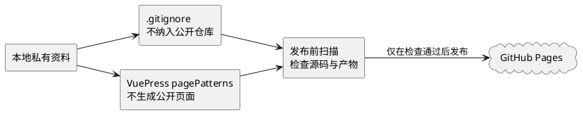

# 公共知识站发布与脱敏规则

## 问题索引

- Q1：哪些内容可以进入公共知识站，哪些内容必须保留在本地？
- Q2：每次提交和发布前必须执行哪些检查？
- Q3：发现历史内容或构建产物包含私有信息时如何处理？

## Q1：公共内容边界

### 允许公开的内容

- 通用技术原理、源码分析、抽象后的架构方案和可复现实验。
- 不依赖真实组织、客户、人员、业务数据或内部系统名称的示例。
- 已经通过公开内容扫描、可达 Git 历史扫描、静态构建和产物扫描的 Markdown。

### 必须保留在本地的内容

- 个人经历、身份信息、工作时间、联系方式和个人评价。
- 真实组织、客户、产品、内部系统、接口、表结构、账号、域名和日志。
- 未经公开授权的规模数据、性能指标、截图、架构图和项目复盘。
- 从私有资料直接生成且尚未完成通用化改写的笔记。

### 三层保护



私有内容必须同时满足“不被 Git 跟踪”和“不被 VuePress 构建”两个条件；扫描脚本负责验证这两条规则没有被后续改动破坏。

## Q2：提交与发布检查

### 新增笔记的判断

1. 先判断内容是否来自真实项目或个人资料。
2. 若是，优先保留在本地私有资料中；需要公开时，先删除可识别事实并重写为通用案例。
3. 通用化改写后，不保留指向私有资料的链接、名称、量化数据或图表。
4. 更新目录 README、公开导航和覆盖矩阵时，只能引用可公开的笔记。

### 必执行命令

```powershell
# 先检查 Git 已跟踪的公开源码和三层排除规则。
npm run docs:check-public

# 再构建静态站点，确认 VuePress 配置可用。
npm run docs:build

# 最后扫描构建产物，防止页面、搜索索引或资源带出私有信息。
npm run docs:check-artifact
```

也可以使用 `npm run docs:verify` 连续执行以上三步。源码检查还会扫描所有可达 Git 提交，避免只删除当前文件却遗漏历史内容。GitHub Pages 工作流会重复执行同一组检查，任一步失败都不会上传站点产物。

### 配置修改要求

- 修改私有目录或私有笔记清单时，必须同时更新 `.gitignore`、本地私有清单、`.vuepress/config.ts` 和 `scripts/check-public-content.mjs`。
- `.private-content.json` 只保留在本地，除私有路径外还可维护识别词；本地 `docs:verify` 会加载完整清单，CI 仅执行不包含个人词条的通用规则，因此推送前必须先完成本地校验。
- 不能通过删除扫描关键字来绕过失败；应先删除、迁移或通用化改写对应内容。
- 任何公开提交前，先用 `git status` 和 `git diff --cached` 检查暂存范围。

## Q3：泄露风险处置

1. 立即停止推送和部署，保留现场用于确认泄露范围。
2. 从公开源码和构建产物中移除内容，并补齐三层排除规则。
3. 若内容已推送，按仓库托管平台的历史清理流程处理，并使旧链接失效。
4. 重新执行 `npm run docs:verify`，确认源码、页面和搜索索引都不再命中。
5. 在开发进度文档记录原因、影响范围和防复发措施。

## 复习清单

- [x] 知道公共站点只发布通用技术内容。
- [x] 知道私有内容必须同时被 Git 和 VuePress 排除。
- [x] 知道发布前要检查源码和静态产物。
- [ ] 能在新增真实案例前完成通用化改写和公开审核。
