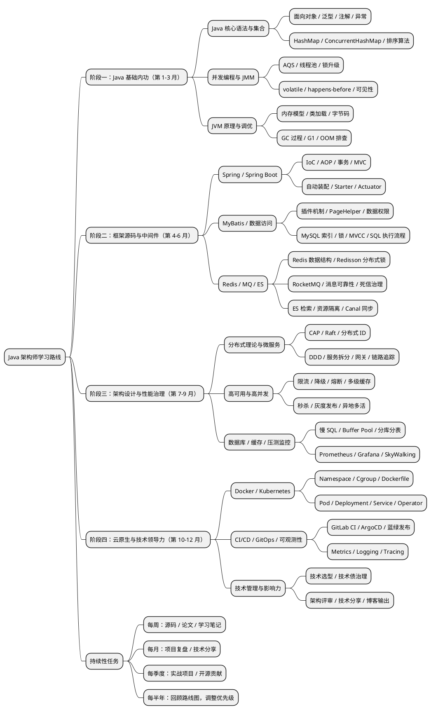

# Java架构师学习路线图

> 面向10年经验Java工程师的系统化进阶规划，总周期 **12个月**，分 **4大阶段**。
> 原则：**深度优先、源码驱动、实战落地、持续输出**。

---

## 总览

| 阶段 | 周期 | 主题 | 核心目标 |
|------|------|------|---------|
| 阶段一 | 第1-3月 | **内功筑基** | 吃透JVM、并发、集合源码，建立底层思维 |
| 阶段二 | 第4-6月 | **框架精通** | 源码级掌握Spring全家桶与中间件原理 |
| 阶段三 | 第7-9月 | **架构跃迁** | 分布式、微服务、高并发架构设计能力 |
| 阶段四 | 第10-12月 | **云原生与领导力** | K8s、ServiceMesh、技术管理与影响力 |

---

## 阶段一：内功筑基（第1-3月）

> **目标**：把"会用"升级为"懂原理"。

### 第1月：JVM与字节码
- **学习重点**
  - JVM内存模型（堆/栈/元空间/直接内存）
  - GC算法（CMS/G1/ZGC/Shenandoah）与调优参数
  - 类加载机制、双亲委派、破坏场景
  - 字节码指令集、`javap` 反编译、ASM/Javassist
- **实战产出**
  - 一份完整的 **GC调优案例报告**（含线上OOM复盘）
  - 手写一个简易类加载器 + 字节码增强Demo
- **对应目录**：`1-Java基础/05-JVM原理与调优`、`2-Java高级/01-反射与字节码`

### 第2月：并发编程
- **学习重点**
  - JMM、`volatile`/`synchronized`/`final` 内存语义
  - AQS源码（ReentrantLock、Semaphore、CountDownLatch）
  - 线程池源码 + 生产参数设置
  - `ConcurrentHashMap` 1.7 vs 1.8 演进
  - Disruptor、CAS、伪共享
- **实战产出**
  - 手写一个 **简易线程池** + **分布式锁**（Redis/ZK两版）
  - 绘制 AQS 核心源码思维导图
- **对应目录**：`1-Java基础/04-并发编程`

### 第3月：集合、IO与JDK源码
- **学习重点**
  - `HashMap`/`LinkedHashMap`/`TreeMap` 源码
  - BIO/NIO/AIO，`Selector`、Reactor模式
  - Netty核心组件（EventLoop、Pipeline、ByteBuf）
  - `String`、`StringBuilder`、`ThreadLocal` 源码与内存泄漏
- **实战产出**
  - 基于Netty实现一个 **简易RPC框架**
  - JDK源码阅读笔记（至少10个核心类）
- **对应目录**：`1-Java基础/02-集合框架与数据结构`、`1-Java基础/03-IO与NIO`、`2-Java高级/03-JDK源码阅读`

---

## 阶段二：框架精通（第4-6月）

> **目标**：从框架使用者升级为框架设计者。

### 第4月：Spring核心源码
- **学习重点**
  - IoC容器启动流程、Bean生命周期、三级缓存解决循环依赖
  - AOP实现原理（JDK动态代理 vs CGLIB）
  - `@Transactional` 事务传播机制与失效场景
  - SpringMVC 请求处理链路
- **实战产出**
  - 手写 **Mini-Spring**（IoC + AOP + MVC 简版）
  - Spring源码阅读笔记（至少覆盖核心10个扩展点）
- **对应目录**：`3-Java框架/01-Spring核心`

### 第5月：SpringBoot与SpringCloud
- **学习重点**
  - SpringBoot自动装配原理、`SpringFactoriesLoader`、条件注解
  - 自定义Starter、Actuator原理
  - Nacos/Eureka 注册中心对比、Ribbon负载均衡、OpenFeign
  - Sentinel/Hystrix 熔断降级、Gateway路由过滤
- **实战产出**
  - 自研一个 **企业级Starter**（含配置、监控、自动装配）
  - 搭建一套完整的 **微服务脚手架**
- **对应目录**：`3-Java框架/02-SpringBoot`、`3-Java框架/03-SpringCloud`

### 第6月：中间件原理
- **学习重点**
  - **Redis**：数据结构、持久化、主从/哨兵/Cluster、缓存三大问题
  - **Kafka/RocketMQ**：存储模型、消费语义、事务消息、顺序消息
  - **MySQL**：InnoDB存储引擎、MVCC、索引底层、锁机制
  - **ES**：倒排索引、分词、评分、集群原理
- **实战产出**
  - 一次 **缓存雪崩** 的完整复盘 + 解决方案
  - 基于MQ的 **最终一致性分布式事务** 实现
- **对应目录**：`3-Java框架/05-常用中间件`、`5-性能优化/02-数据库优化`、`5-性能优化/03-缓存策略`

---

## 阶段三：架构跃迁（第7-9月）

> **目标**：具备独立设计大型分布式系统的能力。

### 第7月：分布式系统理论
- **学习重点**
  - CAP/BASE、一致性模型（线性一致/顺序一致/最终一致）
  - Paxos/Raft/ZAB 共识算法
  - 分布式ID（Snowflake/Leaf/UidGenerator）
  - 限流算法（令牌桶/漏桶/滑动窗口）、分布式锁对比
- **实战产出**
  - 手写简化版 **Raft算法** 实现
  - 生产级 **分布式ID服务**
- **对应目录**：`4-架构设计/01-分布式系统理论`

### 第8月：微服务与DDD
- **学习重点**
  - DDD战略/战术设计、限界上下文、聚合根
  - 服务拆分原则、API网关、BFF模式
  - 分布式事务（2PC/TCC/Saga/Seata）
  - 全链路追踪（SkyWalking/Zipkin）
- **实战产出**
  - 用DDD重构一个真实业务模块
  - 一份 **微服务架构设计文档**（含拆分、治理、监控）
- **对应目录**：`4-架构设计/02-微服务架构`、`4-架构设计/04-数据一致性`

### 第9月：高并发与高可用
- **学习重点**
  - 秒杀系统设计（流量削峰、预扣库存、防超卖）
  - 多级缓存架构（本地+Redis+CDN）
  - 分库分表（ShardingSphere）、读写分离
  - 异地多活、单元化架构
- **实战产出**
  - 完整设计一个 **百万QPS秒杀系统**
  - 一次 **全链路压测** 报告
- **对应目录**：`4-架构设计/03-高可用与高并发`、`5-性能优化/04-系统压测与监控`

---

## 阶段四：云原生与领导力（第10-12月）

> **目标**：从技术专家升级为技术领导者。

### 第10月：容器与编排
- **学习重点**
  - Docker原理（namespace/cgroup/联合文件系统）
  - K8s核心对象（Pod/Deployment/Service/Ingress）
  - Helm、Operator开发
  - K8s网络（CNI/Service/Ingress）与存储（PV/PVC/StorageClass）
- **实战产出**
  - 将现有项目完整K8s化部署
  - 开发一个自定义Operator
- **对应目录**：`6-DevOps与云原生/01-Docker与容器化`、`6-DevOps与云原生/02-Kubernetes`

### 第11月：云原生架构
- **学习重点**
  - ServiceMesh（Istio）、Envoy
  - Serverless（Knative/OpenFaaS）
  - 可观测性三大支柱（Metrics/Logging/Tracing）
  - GitOps、ArgoCD、蓝绿/金丝雀发布
- **实战产出**
  - 搭建完整的 **GitOps CI/CD流水线**
  - 一份 **云原生架构演进路线图**
- **对应目录**：`6-DevOps与云原生/03-CI-CD`、`6-DevOps与云原生/04-云原生架构`

### 第12月：技术管理与影响力
- **学习重点**
  - 技术选型方法论、技术债治理
  - 团队培养、Code Review文化
  - 架构评审、技术方案写作
  - 技术演讲、博客输出、开源贡献
- **实战产出**
  - 主导一次 **架构评审会**
  - 发表 **3+篇高质量技术博客**
  - 完成一次 **技术分享/大会演讲**
- **对应目录**：`7-工程实践/03-技术管理`、`7-工程实践/04-技术视野与趋势`、`8-面试与总结/03-技术博客与分享`

---

## 持续性任务（贯穿全年）

- **每周**：阅读1篇源码/论文，写1篇学习笔记
- **每月**：完成1次项目复盘或技术分享
- **每季度**：输出1个完整的实战项目或开源贡献
- **每半年**：回顾路线图，调整优先级

---

## 关键产出物清单（KR）

| 类别 | 数量目标 |
|------|---------|
| 技术博客 | ≥ 30篇 |
| 源码阅读笔记 | ≥ 20份 |
| 实战项目 | ≥ 6个（手写框架 / 秒杀 / RPC / 分布式锁 / Operator / GitOps） |
| 架构设计文档 | ≥ 4份 |
| 开源贡献 | ≥ 2次（PR合并或独立项目） |
| 技术分享 | ≥ 4次（团队内/外） |

---

## 推荐书单

- **基础**：《深入理解Java虚拟机》《Java并发编程实战》《Effective Java》
- **源码**：《Spring源码深度解析》《MySQL技术内幕：InnoDB存储引擎》
- **架构**：《数据密集型应用系统设计》（DDIA）《领域驱动设计》《微服务架构设计模式》
- **云原生**：《Kubernetes in Action》《Istio实战指南》
- **软技能**：《架构整洁之道》《技术领导力》《金字塔原理》

---

> **执行建议**：每周固定投入 **10-15小时**（工作日晚2h + 周末6h），保持节奏比冲刺更重要。

---

## 学习路线图可视化（PlantUML）

